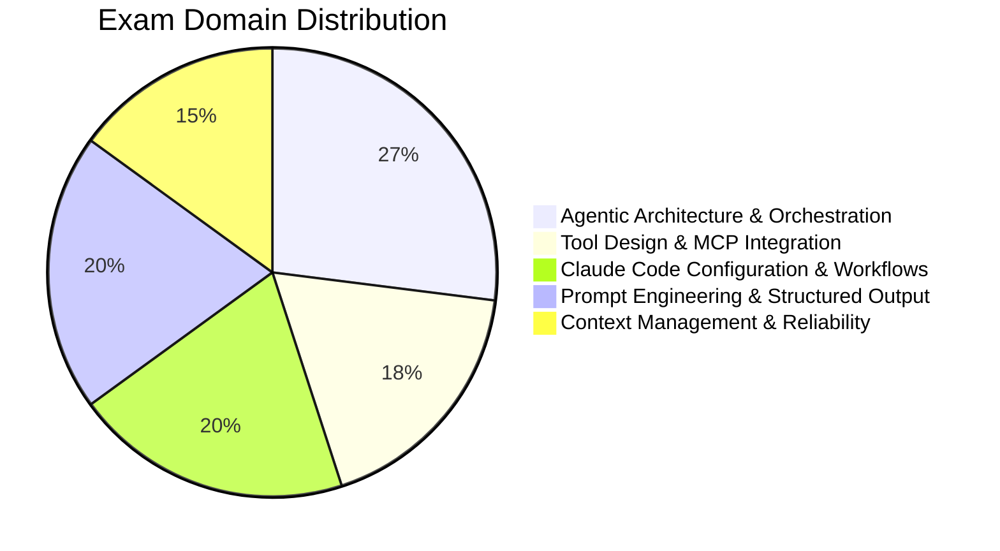

[00:00:04](https://www.udemy.com/course/claude-certified-architect-foundations-complete-course/learn/lecture/57042097#overview)

## Claude Certified Architect Foundations Exam Format

- **Exam Logistics**
    - 60 questions total
    - 120 minutes to complete
    - Approximately 2 minutes per question
- **Answer Structure**
    - Typically 1 correct answer and 3 incorrect answers
    - **[Caution]** Incorrect answers are not always obviously wrong:
        - They may sound reasonable
        - They may work in a simple prototype
        - They may improve the prompt but not enforce the rule
        - They may solve only part of the problem

[00:00:29](https://www.udemy.com/course/claude-certified-architect-foundations-complete-course/learn/lecture/57042097#overview)

[00:00:36](https://www.udemy.com/course/claude-certified-architect-foundations-complete-course/learn/lecture/57042097#overview)

### Answering Exam Questions

- Focus on the exact problem presented
- Select the answer that best fits the specific production situation described in the scenario

### The Practice Exam

- Available after registration
- **[Purpose]** Useful for reviewing style, terminology, and specific topics
- **Format Comparison**

| Feature | Real Exam | Practice Exam |
| --- | --- | --- |
| Questions | 60 | 60 |
| Time Limit | 120 minutes | 90 minutes |
| Difficulty | Requires careful reading and strong scenario understanding | Easier than the real exam |

[00:00:58](https://www.udemy.com/course/claude-certified-architect-foundations-complete-course/learn/lecture/57042097#overview)

[00:01:15](https://www.udemy.com/course/claude-certified-architect-foundations-complete-course/learn/lecture/57042097#overview)

### Practice Exam Utility

- Useful for:
    - Getting familiar with question style
    - Checking terminology
    - Identifying topic areas that require more review
- **[Caution]** If the practice exam feels easy, remember the real exam requires more careful reading and deeper scenario understanding

### Scoring

- Results are reported as a simple Pass/Fail
- The score is calculated on a scaled range from 100 to 1000
- **Passing Score**: 720

| Metric | Value |
| --- | --- |
| Scaled score range | 100–1000 |
| Passing score | 720 |
| Result format | Pass / Fail |

[00:01:28](https://www.udemy.com/course/claude-certified-architect-foundations-complete-course/learn/lecture/57042097#overview)

[00:01:38](https://www.udemy.com/course/claude-certified-architect-foundations-complete-course/learn/lecture/57042097#overview)

## Exam Content Domains

The exam content is divided into five main domains:

### Agentic Architecture & Orchestration

- Represents the largest portion of the exam at 27%
- **Core topics include:**
    - Agentic loops
    - Multi-agent systems
    - Orchestration
    - Coordinator and sub-agent patterns
    - Task, tool, and hooks

[00:02:15](https://www.udemy.com/course/claude-certified-architect-foundations-complete-course/learn/lecture/57042097#overview)

### Agentic Architecture & Orchestration (Continuation)

- **Core concepts include:**
    - Session state
    - Resumption
    - Workflow design
- **[In simple terms]** This domain focuses on how Claude-based systems perform multi-step work

### Tool Design & MCP Integration

- Represents 18% of the exam
- **[Purpose]** Focuses on how Claude connects to external systems, designed carefully
- **This domain covers:**
    - Tool schemas & descriptions
    - MCP tools and MCP resources
    - Structured tool errors
    - Retryable vs. non-retryable failures
    - Tool distribution across agents
    - Built-in tools: Read, Write, Edit, Bash, Grep, Glob

[00:02:47](https://www.udemy.com/course/claude-certified-architect-foundations-complete-course/learn/lecture/57042097#overview)

### Claude Code Configuration & Workflows

- Represents 20% of the exam
- **[Purpose]** Focuses on using Claude Code inside a real development environment
- **Core topics include:**
    - `CLAUDE.md` file & instruction hierarchy
    - Custom slash commands & skills
    - Path-specific rules
    - Plan mode vs. direct execution
    - Iterative refinement
    - CI/CD workflows

[00:03:19](https://www.udemy.com/course/claude-certified-architect-foundations-complete-course/learn/lecture/57042097#overview)

### Prompt Engineering & Structured Output

- Represents 20% of the exam
- **[Core Focus]** Designing prompts and outputs that software can use reliably
- **Core topics include:**
    - Explicit criteria & few-shot examples
    - JSON schemas & structured output
    - Validation & retry loops
    - Extraction workflows
    - Batch processing
    - Multi-pass review
- **[In Practice]** Designing for reliability:
    - Example: Extracting data from invoices, emails, or support tickets
    - The output must match a JSON schema
    - If the JSON is invalid $\rightarrow$ retry
    - If the JSON is valid but the meaning is questionable $\rightarrow$ add validation or human review

### Context Management & Reliability

- Represents 15% of the exam
- **[Purpose]** Focuses on keeping Claude-based systems reliable over time
- **Core topics include:**
    - Conversation context & critical facts
    - Context degradation
    - Escalation patterns & error propagation
    - Large codebase exploration
    - Human review
    - Confidence calibration, provenance & uncertainty
- **[In Practice]** Managing the limitations of long-term interaction:
    - Long conversations can become difficult to manage
    - Critical facts may need to live outside the immediate conversation history
    - Subagents may return incomplete results or tools may fail
    - **[Strategy]** Certain cases should be routed to a human rather than being handled automatically

[00:03:58](https://www.udemy.com/course/claude-certified-architect-foundations-complete-course/learn/lecture/57042097#overview)

### Context Management & Reliability (Continuation)

- **[In Practice]** Managing complexity and maintaining system utility:
    - Long conversations can become difficult to manage
    - Critical facts may need to be preserved outside the normal conversation history
    - Sub-agents may return incomplete results
    - External tools may fail
    - **[Strategy]** Some cases should be routed to a human rather than being handled automatically

## Lesson Summary

### Key Exam Numbers

| Metric | Real Exam | Practice Exam |
| --- | --- | --- |
| Total Questions | 60 | 60 |
| Time Limit | 120 min | 90 min |
| Passing Score | 720 | N/A |

### The Five Domains

- **Agentic Architecture & Orchestration**: 27%
- **Tool Design & MCP Integration**: 18%
- **Claude Code Configuration & Workflows**: 20%
- **Prompt Engineering & Structured Output**: 20%
- **Context Management & Reliability**: 15%

[00:04:44](https://www.udemy.com/course/claude-certified-architect-foundations-complete-course/learn/lecture/57042097#overview)

### Exam Application Approach

- **[Key Insight]** The exam avoids testing isolated definitions
    - Instead, it connects technical topics to realistic production situations
- **[Next Steps]** The next lesson will analyze official production scenarios and map them back to the five exam domains