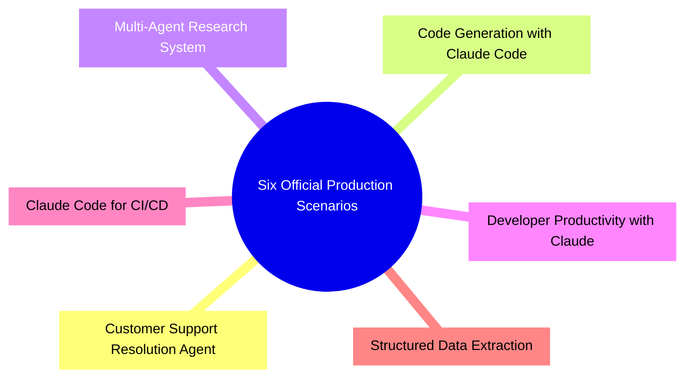
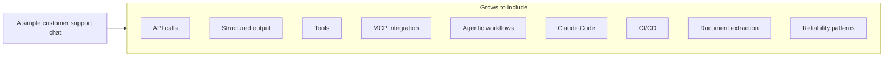
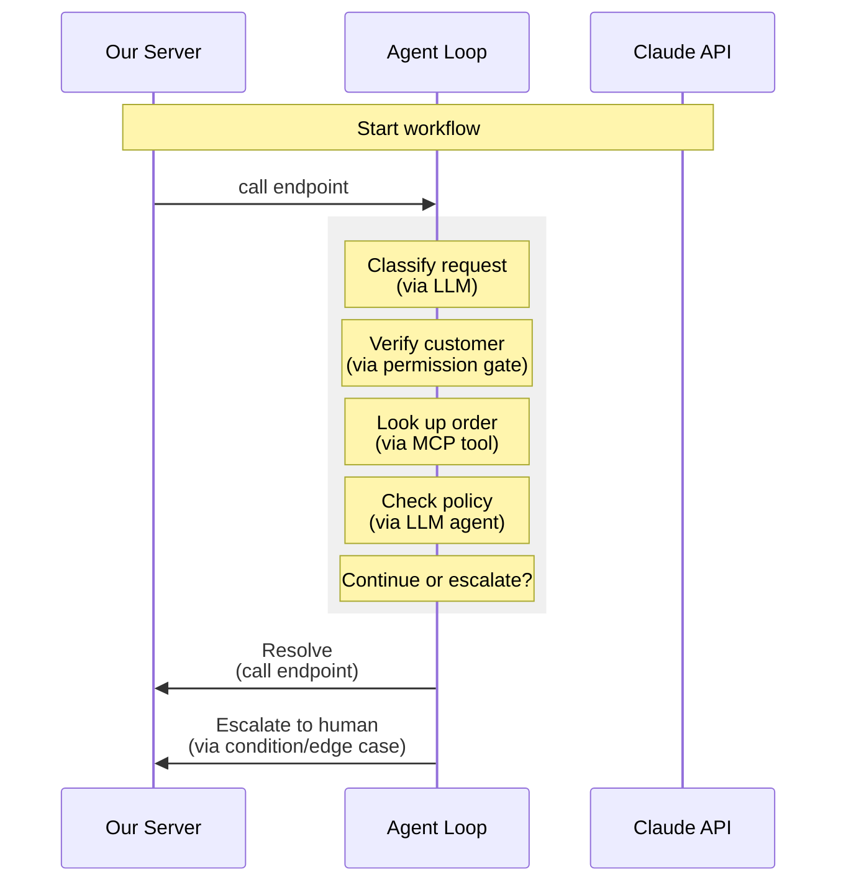

[00:00:00](https://www.udemy.com/course/claude-certified-architect-foundations-complete-course/learn/lecture/57042105#overview)

[00:00:09](https://www.udemy.com/course/claude-certified-architect-foundations-complete-course/learn/lecture/57042105#overview)

[00:00:11](https://www.udemy.com/course/claude-certified-architect-foundations-complete-course/learn/lecture/57042105#overview)

## Six Official Production Scenarios

- These scenarios demonstrate how exam topics appear within real cloud-based systems

### Scenario 1: Customer Support Resolution Agent

- An AI support agent designed to handle various customer issues:
    - Refunds
    - Billing disputes
    - Account problems
    - Order questions
- **Typical tools used:**
    - `get_customer`
    - `lookup_order`
    - `process_refund`
    - `escalate_to_human`

[00:00:30](https://www.udemy.com/course/claude-certified-architect-foundations-complete-course/learn/lecture/57042105#overview)

[00:00:39](https://www.udemy.com/course/claude-certified-architect-foundations-complete-course/learn/lecture/57042105#overview)

### Customer Support Resolution Agent Connections

- **[Core Concepts]** This scenario bridges several important exam topics:
    - Agentic architecture
    - Tool use & MCP
    - Business rules
    - Customer verification
    - Human escalation

## Scenario 2: Code Generation with Claude Code

- Using Claude Code to perform various software development tasks:
    - Code generation
    - Refactoring
    - Debugging
    - Documentation
    - Test creation
- **[Configuration Layer]** Includes specific elements for controlling and guiding the tool:
    - Claude Code configuration
    - `CLAUDE.md` & instructions
    - Custom slash commands
    - Plan mode
    - Direct execution

[00:01:00](https://www.udemy.com/course/claude-certified-architect-foundations-complete-course/learn/lecture/57042105#overview)

[00:01:29](https://www.udemy.com/course/claude-certified-architect-foundations-complete-course/learn/lecture/57042105#overview)

### Scenario 3: Multi-Agent Research System

- A system where multiple agents work together to complete complex tasks:
    - One agent searches for information
    - Another agent analyzes documents
    - Another agent synthesizes findings
    - Another agent generates the final report
- **[Core Concepts]** This scenario connects to:
    - Orchestration
    - Context passing
    - Citations & provenance
    - Handling incomplete or conflicting information

### Scenario 4: Developer Productivity with Claude

- Focused on helping developers work more efficiently by:
    - Exploring codebases
    - Understanding legacy systems
    - Generating boilerplate
    - Automating routine tasks
    - Using built-in tools and MCP servers
- **[Core Concepts]** Connects to:
    - Codebase exploration
    - Tool use
    - Project context
    - Built-in tools & MCP
    - Safe developer workflows

[00:01:31](https://www.udemy.com/course/claude-certified-architect-foundations-complete-course/learn/lecture/57042105#overview)

[00:01:53](https://www.udemy.com/course/claude-certified-architect-foundations-complete-course/learn/lecture/57042105#overview)

### Scenario 5: Claude Code for CI/CD

- Focuses on utilizing Claude Code within automated development pipelines
- **[Core Concepts]** Connects to:
    - CI/CD automation
    - Structured output
    - Actionable comments
    - False-positive reduction
    - Workflow integration

[00:02:01](https://www.udemy.com/course/claude-certified-architect-foundations-complete-course/learn/lecture/57042105#overview)

[00:02:01](https://www.udemy.com/course/claude-certified-architect-foundations-complete-course/learn/lecture/57042105#overview)

## Scenario 6: Structured Data Extraction

- Extracting reliable structured data from unstructured content
- **Examples of use:**
    - Reviewing pull requests, generating tests, summarizing code changes, or providing structured feedback (within CI/CD contexts)
- **[Core Concepts]** Connects to:
    - JSON schemas
    - Validation & retries
    - Edge cases
    - Confidence & human review
    - Downstream integration

[00:02:31](https://www.udemy.com/course/claude-certified-architect-foundations-complete-course/learn/lecture/57042105#overview)

[00:02:32](https://www.udemy.com/course/claude-certified-architect-foundations-complete-course/learn/lecture/57042105#overview)

[00:02:47](https://www.udemy.com/course/claude-certified-architect-foundations-complete-course/learn/lecture/57042105#overview)

### Structured Data Extraction (Continued)

- **[What it is]** Extracting reliable structured data from unstructured content
    - Examples include extracting fields from:
        - Invoices
        - Receipts
        - Forms
        - Emails
        - Support tickets
        - Documents
- **[Core Concepts]** Connects to:
        - JSON schemas
        - Validation & retries
        - Edge cases
        - Confidence & human review
        - Downstream system integration

---

### Summary of Six Official Production Scenarios

[00:03:01](https://www.udemy.com/course/claude-certified-architect-foundations-complete-course/learn/lecture/57042105#overview)

[00:03:02](https://www.udemy.com/course/claude-certified-architect-foundations-complete-course/learn/lecture/57042105#overview)

[00:03:09](https://www.udemy.com/course/claude-certified-architect-foundations-complete-course/learn/lecture/57042105#overview)

### Scenarios Combine Multiple Domains

- The production scenarios are not isolated; each one blends several exam domains together
- **[Domain Intersections]** Examples of how scenarios pull from different domains:

| Scenario | Blended Domains/Concepts |
| --- | --- |
| Customer Support | Agents, Tools, MCP, Context management, Human escalation |
| CI/CD | Claude Code, Structured output, Prompt engineering, Reliability |
| Structured Extraction | Prompts, Schemas, Validation, Retries, Human review |

[00:03:31](https://www.udemy.com/course/claude-certified-architect-foundations-complete-course/learn/lecture/57042105#overview)

[00:03:32](https://www.udemy.com/course/claude-certified-architect-foundations-complete-course/learn/lecture/57042105#overview)

[00:03:51](https://www.udemy.com/course/claude-certified-architect-foundations-complete-course/learn/lecture/57042105#overview)

### Running Project: ShopAssist AI

- A central project used throughout the course to connect different ideas and scenarios
- **Evolution of the project:**
    - **Starts as:** A simple customer support chat
    - **Grows to include:**
        - API calls
        - Structured output
        - Tools
        - MCP integration
        - Agentic workflows
        - Claude Code
        - CI/CD
        - Document extraction
        - Reliability patterns

[00:03:51](https://www.udemy.com/course/claude-certified-architect-foundations-complete-course/learn/lecture/57042105#overview)

[00:03:55](https://www.udemy.com/course/claude-certified-architect-foundations-complete-course/learn/lecture/57042105#overview)

[00:03:55](https://www.udemy.com/course/claude-certified-architect-foundations-complete-course/learn/lecture/57042105#overview)

[00:03:55](https://www.udemy.com/course/claude-certified-architect-foundations-complete-course/learn/lecture/57042105#overview)

### A Map of the Claude Ecosystem

- The next lesson will focus on mapping and comparing the different parts of the Claude ecosystem to clarify their specific uses
- **[Components to be compared]**:
    - Claude App
    - Claude API
    - Agent SDK
    - Claude Code
    - MCP

[00:04:04](https://www.udemy.com/course/claude-certified-architect-foundations-complete-course/learn/lecture/57042105#overview)

[00:04:06](https://www.udemy.com/course/claude-certified-architect-foundations-complete-course/learn/lecture/57042105#overview)

## A Map of the Claude Ecosystem

- The next lesson will focus on mapping out the various components of the Claude ecosystem
- **[Goal]** To clarify the specific purpose of each component before moving into deeper technical lessons
- **[Components to be compared]**
    - Claude App
    - Claude API
    - Agent SDK
    - Claude Code
    - MCP

[00:01:59](https://www.udemy.com/course/claude-certified-architect-foundations-complete-course/learn/lecture/57042113#overview)

[00:02:04](https://www.udemy.com/course/claude-certified-architect-foundations-complete-course/learn/lecture/57042113#overview)

[00:02:04](https://www.udemy.com/course/claude-certified-architect-foundations-complete-course/learn/lecture/57042113#overview)

### Claude Code

- A developer workflow tool used directly inside a codebase
    - Used to:
        - Inspect files
        - Understand architecture
        - Make edits
        - Write tests
        - Refactor code
        - Generate documentation
        - Review changes
- **[The simple distinction]**
    - **Claude API**: Belongs to the application runtime
    - **Claude Code**: Belongs to the development workflow

[00:02:28](https://www.udemy.com/course/claude-certified-architect-foundations-complete-course/learn/lecture/57042113#overview)

[00:02:30](https://www.udemy.com/course/claude-certified-architect-foundations-complete-course/learn/lecture/57042113#overview)

[00:02:51](https://www.udemy.com/course/claude-certified-architect-foundations-complete-course/learn/lecture/57042113#overview)

### Agent SDK

- Used for structuring agentic workflows
    - Moves beyond simple one-request, one-response API integrations
    - **[Agentic Workflow]** A multi-step process where an agent must:
        - Classify a request
        - Verify a customer
        - Look up an order
        - Check policy
        - Call a tool
        - Inspect the result
        - Decide whether to continue or escalate
- **[Orchestration]** The SDK provides a way to define:
    - Agents
    - Tools
    - Hooks
    - Handoffs
    - Execution flows

### Agent SDK — Multi-Step Loop

- A process where a support agent decides, step by step, whether to continue or escalate

[00:02:58](https://www.udemy.com/course/claude-certified-architect-foundations-complete-course/learn/lecture/57042113#overview)

[00:02:59](https://www.udemy.com/course/claude-certified-architect-foundations-complete-course/learn/lecture/57042113#overview)

[00:03:19](https://www.udemy.com/course/claude-certified-architect-foundations-complete-course/learn/lecture/57042113#overview)

### Agent SDK — Control and Decision Making

- **[Exam Focus]** The core of using the Agent SDK is managing control within the loop:
    - **Agent Decisions**: What can the agent autonomously decide?
    - **Application Enforcement**: What must the application strictly enforce?
    - **Loop Termination**: When should the multi-step process stop?
    - **Escalation**: When should the system hand off to a human?
    - **Deterministic Validation**: Which specific actions require rigid, non-probabilistic validation?

### MCP — Model Context Protocol

- A standard way to expose tools and context to Claude-compatible clients
- **[Key Concept]** It serves as an **integration boundary**
    - The goal is to make tools easy to understand and hard to misuse
- **Example Tool Exposure (ShopAssist AI)**:
    - `get_customer`
    - `lookup_order`
    - `process_refund`
    - `escalate_to_human`
    - `retrieve_policy`
- **Characteristics of a good MCP tool**:
    - A clear name & description
    - A typed input schema
    - Structured output
    - Useful error handling
    - Appropriate permissions

[00:03:28](https://www.udemy.com/course/claude-certified-architect-foundations-complete-course/learn/lecture/57042113#overview)

[00:03:50](https://www.udemy.com/course/claude-certified-architect-foundations-complete-course/learn/lecture/57042113#overview)

### MCP — Designing Reliable Tool Interfaces

- **[Core Concept]** MCP acts as an **integration boundary**
    - The model-facing layer must be designed to make tools easy to understand and hard to misuse
    - This is critical when Claude interacts with actual business systems
- **Characteristics of a good MCP tool**:
    - A clear name & description
    - A typed input schema
    - Structured output
    - Useful error handling
    - Appropriate permissions