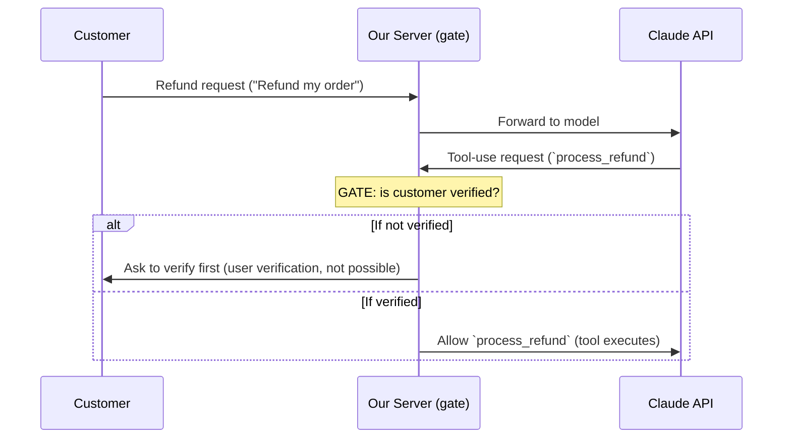
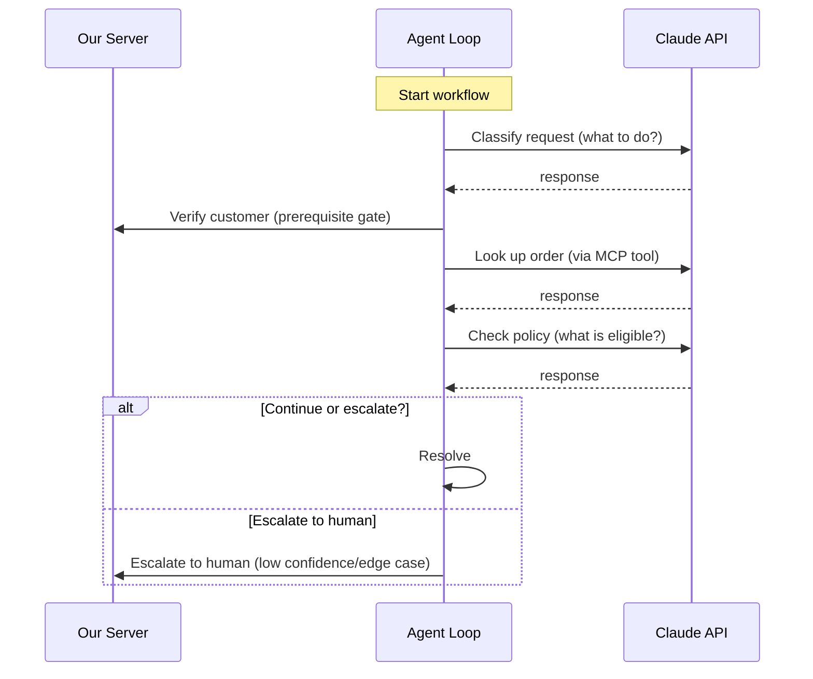
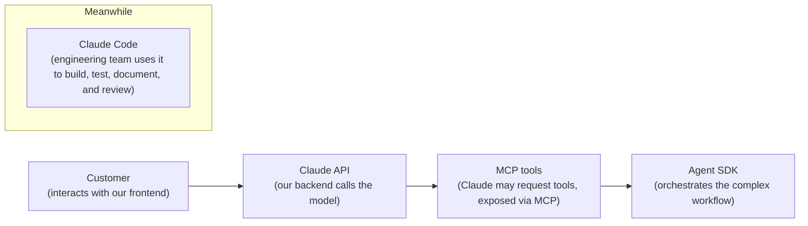
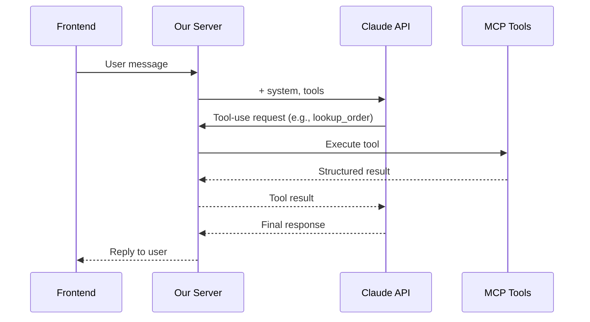

[00:00:00](https://www.udemy.com/course/claude-certified-architect-foundations-complete-course/learn/lecture/57042113#overview)

[00:00:14](https://www.udemy.com/course/claude-certified-architect-foundations-complete-course/learn/lecture/57042113#overview)

## Five Concepts to Separate

- Claude app
- Claude API
- Claude code
- Agent SDK
- MCP

### Claude App

- The hosted product experience
    - Accessed directly through a browser, desktop app, or mobile app
    - Ideal for interactive work
    - **[Note]** It is not your production runtime; you do not own the application state, backend orchestration, tool execution, validation, or deployment model
    - For this course, it serves mostly as a reference point

[00:00:22](https://www.udemy.com/course/claude-certified-architect-foundations-complete-course/learn/lecture/57042113#overview)

[00:00:47](https://www.udemy.com/course/claude-certified-architect-foundations-complete-course/learn/lecture/57042113#overview)

[00:00:52](https://www.udemy.com/course/claude-certified-architect-foundations-complete-course/learn/lecture/57042113#overview)

[00:01:02](https://www.udemy.com/course/claude-certified-architect-foundations-complete-course/learn/lecture/57042113#overview)

### Claude API

- The model interface inside your own application
- **Communication Flow**
    - Your backend sends: messages, system instructions, model parameters, tool definitions, and structured output requirements
    - Claude returns: a response, structured data, or a tool use request
- **[Critical]** The API does not remove your responsibility as an architect
    - While Claude can reason, classify, extract, generate, and request tools, it should not be the only enforcement layer for critical rules
    - Your backend must still own:
        - Conversation state & auth
        - Permission checks
        - Tool execution
        - Output validation & retries
        - Observability & business rules

[00:01:22](https://www.udemy.com/course/claude-certified-architect-foundations-complete-course/learn/lecture/57042113#overview)

[00:01:24](https://www.udemy.com/course/claude-certified-architect-foundations-complete-course/learn/lecture/57042113#overview)

[00:01:29](https://www.udemy.com/course/claude-certified-architect-foundations-complete-course/learn/lecture/57042113#overview)

### Claude API: The Verification Gate

- **[The Problem]** Relying solely on a system prompt to enforce critical rules is unsafe
    - An AI might decide to call a sensitive tool (e.g., `process_refund`) without proper authorization
- **The Solution: Programmatic Prerequisite Gates**
    - The backend must explicitly verify conditions before allowing a tool call to proceed
    - This ensures rules are enforced in code, not just in the model's reasoning

#### Refund Request Workflow

[00:01:52](https://www.udemy.com/course/claude-certified-architect-foundations-complete-course/learn/lecture/57042113#overview)

[00:01:53](https://www.udemy.com/course/claude-certified-architect-foundations-complete-course/learn/lecture/57042113#overview)

[00:02:07](https://www.udemy.com/course/claude-certified-architect-foundations-complete-course/learn/lecture/57042113#overview)

## Claude Code

- A developer workflow tool
- **[Usage]** Used inside a codebase to:
    - Inspect files
    - Understand architecture
    - Make edits
    - Write tests
    - Refactor code
    - Generate documentation
    - Review changes
- **The Simple Distinction**
    - Claude API belongs to the application runtime
    - Claude Code belongs to the development workflow

### When to use Claude Code

- Engineers maintaining the codebase
- Automating code reviews
- Working inside CI/CD
- Addressing runtime questions via API, tools, MCP, or Agent SDK

[00:02:22](https://www.udemy.com/course/claude-certified-architect-foundations-complete-course/learn/lecture/57042113#overview)

[00:02:25](https://www.udemy.com/course/claude-certified-architect-foundations-complete-course/learn/lecture/57042113#overview)

[00:02:50](https://www.udemy.com/course/claude-certified-architect-foundations-complete-course/learn/lecture/57042113#overview)

## Agent SDK

- **[The Distinction]** Unlike a simple API integration (one request, one response), an agentic workflow is multi-step
- **Agentic Workflow Example**
    - A support agent might need to:
        - Classify a request
        - Verify a customer
        - Look up an order
        - Check policy
        - Call a tool
        - Inspect the result
        - Decide whether to continue or escalate
- **[Purpose]** The Agent SDK provides the structure for this orchestration
    - It defines agents, tools, hooks, handoffs, and execution flow
    - **The Key Point: Control**
        - Deciding what the agent can decide
        - Determining what the app must enforce
        - Managing when the loop should stop or escalate
        - Identifying which actions require deterministic validation

### Agent SDK — Multi-Step Loop

[00:02:52](https://www.udemy.com/course/claude-certified-architect-foundations-complete-course/learn/lecture/57042113#overview)

[00:03:07](https://www.udemy.com/course/claude-certified-architect-foundations-complete-course/learn/lecture/57042113#overview)

[00:03:14](https://www.udemy.com/course/claude-certified-architect-foundations-complete-course/learn/lecture/57042113#overview)

## MCP — Model Context Protocol

- **[Definition]** A standard way to expose tools and context to Claude-compatible clients
- **[Concept]** Acts as an integration boundary
    - It is more than just "tool calling"
    - Designed to make tools easy to understand and hard to misuse
- **Characteristics of a good MCP tool**
    - A clear name & description
    - A typed input schema
    - Structured output
    - Useful error handling
    - Appropriate permissions

[00:03:23](https://www.udemy.com/course/claude-certified-architect-foundations-complete-course/learn/lecture/57042113#overview)

[00:03:24](https://www.udemy.com/course/claude-certified-architect-foundations-complete-course/learn/lecture/57042113#overview)

[00:03:52](https://www.udemy.com/course/claude-certified-architect-foundations-complete-course/learn/lecture/57042113#overview)

### Putting the Map Together: ShopAssist AI

- The pieces connect into one single runtime flow

[00:03:55](https://www.udemy.com/course/claude-certified-architect-foundations-complete-course/learn/lecture/57042113#overview)

[00:04:00](https://www.udemy.com/course/claude-certified-architect-foundations-complete-course/learn/lecture/57042113#overview)

[00:04:19](https://www.udemy.com/course/claude-certified-architect-foundations-complete-course/learn/lecture/57042113#overview)

### ShopAssist AI — Runtime Flow

- The different components connect into a single runtime flow to process a customer request

[00:04:23](https://www.udemy.com/course/claude-certified-architect-foundations-complete-course/learn/lecture/57042113#overview)

[00:04:40](https://www.udemy.com/course/claude-certified-architect-foundations-complete-course/learn/lecture/57042113#overview)

### Summary of the Claude Ecosystem

- **Claude App**: The hosted, consumer-facing product.
- **Claude API**: The model interface used within an application's runtime.
- **Agent SDK**: Used to orchestrate complex, multi-step agentic workflows.
- **MCP (Model Context Protocol)**: The standard layer for exposing tools and context to the model.
- **Claude Code**: The developer workflow tool used for building, testing, documenting, and reviewing the system.

[00:04:48](https://www.udemy.com/course/claude-certified-architect-foundations-complete-course/learn/lecture/57042113#overview)