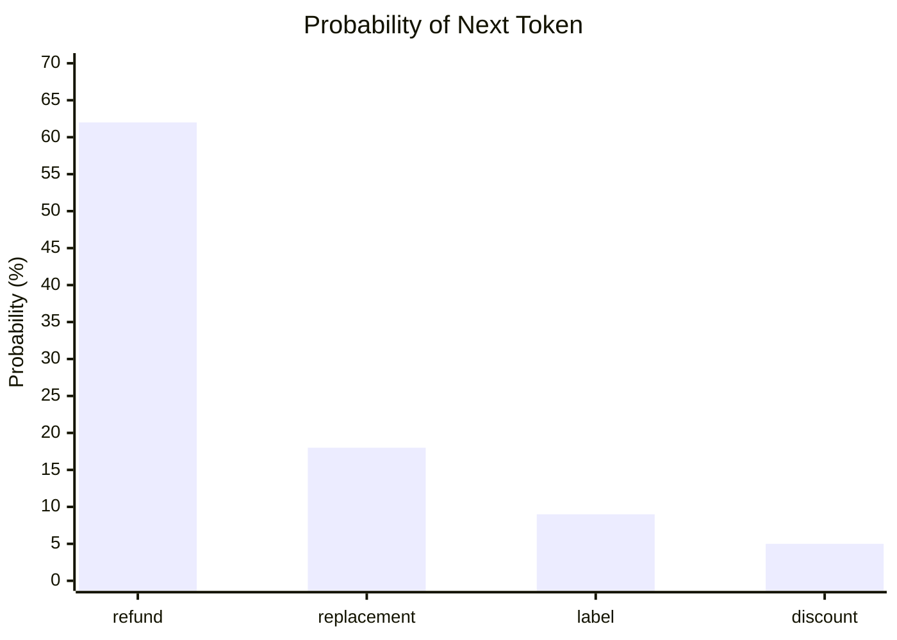
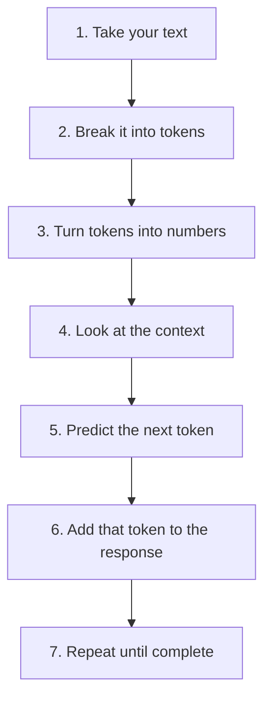

[00:00:00](https://www.udemy.com/course/claude-certified-architect-foundations-complete-course/learn/lecture/57042121#overview)

### Learning Approach: Contextual Architecture

- Concepts will be taught within the framework of a production-style cloud architecture
    - This prevents the need to memorize isolated, disconnected concepts
    - Focuses on understanding the purpose of each service, its placement in a system, and its role in solving real engineering problems

[00:01:59](https://www.udemy.com/course/claude-certified-architect-foundations-complete-course/learn/lecture/57042131#overview)

### Contextualizing Embeddings

- The model performs a second pass to determine the numeric representation of a token based on its neighbors
    - Instead of just asking "What does this token usually mean?", the model asks "What does this token mean *here*?"
- **[The Result]** The same visible word can result in different internal numeric representations depending on its position and surrounding tokens
    - This allows the model to differentiate between identical words used in different contexts

[00:02:28](https://www.udemy.com/course/claude-certified-architect-foundations-complete-course/learn/lecture/57042131#overview)

### The Synthesis of Meaning

- A token's final meaning is derived from three distinct layers:
    - **Token**: The discrete label (the raw piece of text)
    - **Embedding**: The starting, general meaning (the initial numeric representation)
    - **Context**: The surrounding information that provides the final, specific meaning
- **[Example: "I want to return my order"]**
    - The model doesn't just process isolated words; it connects them to build a coherent intent:
        - `I` $\rightarrow$ identifies the customer
        - `want` $\rightarrow$ signals intent
        - `return` $\rightarrow$ points to a specific type of request
        - `my order` $\rightarrow$ points to a previous purchase
    - **[The Result]** The model synthesizes these components to understand the high-level concept: *The customer is requesting help with a product return.*

[00:02:58](https://www.udemy.com/course/claude-certified-architect-foundations-complete-course/learn/lecture/57042131#overview)

[00:03:14](https://www.udemy.com/course/claude-certified-architect-foundations-complete-course/learn/lecture/57042131#overview)

[00:03:18](https://www.udemy.com/course/claude-certified-architect-foundations-complete-course/learn/lecture/57042131#overview)

### Now Generation Begins

- After processing the input through the pipeline (taking the message, breaking into tokens, turning tokens into numbers, and adjusting by context), Claude has a rich internal representation of the user's intent
- **Generation** is the stage where the model uses this representation to predict the response
- **[The Core Mechanism]** The model predicts the next token by assigning probabilities to potential candidates

#### Predicting the Next Token

- The model does not choose with certainty; it assigns probabilities to possible next tokens based on the given context
- **[Example Context]**: "I want to return my order and get a \_\_\_\_"

- In this scenario, "refund" is the most likely next token with a 62% probability
- Once a token is selected, it is added to the text, and the model begins the process again to predict the subsequent token

[00:03:18](https://www.udemy.com/course/claude-certified-architect-foundations-complete-course/learn/lecture/57042131#overview)

[00:03:23](https://www.udemy.com/course/claude-certified-architect-foundations-complete-course/learn/lecture/57042131#overview)

### The Iterative Prediction Loop

- Once the model has its internal representation, it looks at all the tokens in the current context and asks: *"What is the most likely next token?"*
- **[The Process]**
    - The model predicts a single token based on probability
    - That token is selected and appended to the existing text
    - The model then repeats the entire process to predict the subsequent token, using the newly expanded context
- **[Example Context]**: "I want to return my order and get a \_\_\_\_"

[00:03:26](https://www.udemy.com/course/claude-certified-architect-foundations-complete-course/learn/lecture/57042131#overview)

[00:03:28](https://www.udemy.com/course/claude-certified-architect-foundations-complete-course/learn/lecture/57042131#overview)

[00:03:56](https://www.udemy.com/course/claude-certified-architect-foundations-complete-course/learn/lecture/57042131#overview)

[00:03:57](https://www.udemy.com/course/claude-certified-architect-foundations-complete-course/learn/lecture/57042131#overview)

[00:04:17](https://www.udemy.com/course/claude-certified-architect-foundations-complete-course/learn/lecture/57042131#overview)

### How Tokens Build a Response

- The model predicts one token at a time, appends it, and then predicts again
- **[The Cumulative Effect]** After many small, iterative steps, the sequence of individual tokens forms a complete, coherent sentence

#### The Step-by-Step Progression

- The model uses the current context (the original message plus all previously predicted tokens) to determine the next most likely token
- Once a token is picked, it becomes part of the new context for the next prediction cycle

**Example of the iterative process:**

1. **Initial Context**: "I want to return my order."
2. **Step 1**: Model predicts "Sure," (66% probability) $\rightarrow$ **Response**: "Sure,"
3. **Step 2**: Model predicts "I" (64% probability) $\rightarrow$ **Response**: "Sure, I"
4. **Step 3**: Model predicts "can" (68% probability) $\rightarrow$ **Response**: "Sure, I can"
5. **Step 4**: Model predicts "help" (50% probability) $\rightarrow$ **Response**: "Sure, I can help"
6. **Step 5**: Model predicts "with" (82% probability) $\rightarrow$ **Response**: "Sure, I can help with"
7. **Step 6**: Model predicts "that." (82% probability) $\rightarrow$ **Response**: "Sure, I can help with that."

- **[The Result]** To the user, it looks like Claude wrote a complete sentence like:

> "Sure, I can help with that. Could you provide your order number?"

[00:04:26](https://www.udemy.com/course/claude-certified-architect-foundations-complete-course/learn/lecture/57042131#overview)

[00:04:26](https://www.udemy.com/course/claude-certified-architect-foundations-complete-course/learn/lecture/57042131#overview)

[00:04:35](https://www.udemy.com/course/claude-certified-architect-foundations-complete-course/learn/lecture/57042131#overview)

### The Critical Importance of Context

- The same initial message can produce vastly different answers depending on the context provided to the model
- **[Why it matters]** Context allows the model to move from generic, polite responses to specific, actionable ones

#### Comparison: Little Context vs. Rich Context

| Feature | Little Context | Rich Context |
| --- | --- | --- |
| Input Message | "I want a refund" | "I want a refund" + context |
| Additional Data | None | Customer is verified\n\nOrder delivered yesterday\n\nProduct eligible for return\n\nRefund policy details |
| Claude's Response | "Sure, can you provide your order number?" | "Your order is eligible. I can start the return for you." |

- **[The Architect's Role]** Because the model generates responses based on what it receives, the application must be responsible for supplying that necessary context.

[00:04:56](https://www.udemy.com/course/claude-certified-architect-foundations-complete-course/learn/lecture/57042131#overview)

[00:04:56](https://www.udemy.com/course/claude-certified-architect-foundations-complete-course/learn/lecture/57042131#overview)

### The Architect's Responsibility: Context Injection

- **[Core Principle]** Claude generates answers based solely on the context it receives; it does not have inherent, automatic access to your external systems.
    - It does not automatically know your database contents.
    - It does not automatically know your customer profiles.
- **[The Implication]** To move from generic responses to specific, actionable ones, the application must proactively "inject" the necessary information into the prompt.

**Example of Context-Driven Logic:**

If the context includes a specific policy (e.g., "allows refunds within 30 days"), the model can transition from a generic acknowledgment to a definitive answer:

*   **Without Policy Context:** "I can help with that. What is your order number?"
*   **With Policy Context:** "Your order is eligible for a refund. I can start the return process for you."

[00:05:26](https://www.udemy.com/course/claude-certified-architect-foundations-complete-course/learn/lecture/57042131#overview)

[00:05:27](https://www.udemy.com/course/claude-certified-architect-foundations-complete-course/learn/lecture/57042131#overview)

### Claude's Knowledge Boundaries

- Claude generates answers based solely on the context it receives
- **[What Claude does NOT automatically know]**:
    - Your database (e.g., order status, inventory, customer profiles)
    - Conversation history (unless the application re-sends previous messages)
    - Real-time user identity or permissions
- **[The Developer's Responsibility]**:
    - Because the model doesn't 'know' your business, the application must act as the bridge, supplying the specific data points needed to turn a generic response into a useful one.

**Example in ShopAssist AI:**

If a customer says, "I want to return my order:"

- Claude understands the *intent* (a return request)
- Claude does *not* know:
    - Which specific order is being referenced
    - If the customer is verified
    - If the order is eligible for return
    - If a refund has already been processed

[00:05:56](https://www.udemy.com/course/claude-certified-architect-foundations-complete-course/learn/lecture/57042131#overview)

[00:05:58](https://www.udemy.com/course/claude-certified-architect-foundations-complete-course/learn/lecture/57042131#overview)

### The Model Reasons — The System Controls

Claude serves as the reasoning and language layer, but the surrounding system controls what it sees and what it is allowed to do.

| Component | Responsibility |
| --- | --- |
| The model | generates language — reads, classifies, asks, decides next step |
| The application | provides context |
| The backend | connects to real systems |
| Tools | retrieve real data |
| Code | enforces business rules |

**[The Role of the Model]**

- It acts as the "brain" for reasoning and language tasks
    - It can read a given situation
    - It can follow complex instructions
    - It can ask clarifying questions
    - It can summarize information or classify intent
    - It can decide what the next logical step in a process should be

[00:06:26](https://www.udemy.com/course/claude-certified-architect-foundations-complete-course/learn/lecture/57042131#overview)

[00:06:28](https://www.udemy.com/course/claude-certified-architect-foundations-complete-course/learn/lecture/57042131#overview)

[00:06:35](https://www.udemy.com/course/claude-certified-architect-foundations-complete-course/learn/lecture/57042131#overview)

[00:06:53](https://www.udemy.com/course/claude-certified-architect-foundations-complete-course/learn/lecture/57042131#overview)

### The Whole Mechanism: A Seven-Step Prediction Engine

Rather than viewing an LLM as magic, it can be understood as a powerful prediction engine following a specific sequence:

### Everything Is Context

Whatever information is provided to the model before it predicts the next token fundamentally shapes the answer. In a production system, all these elements are forms of "managed context."

- **[The core principle]**: Prompts, history, documents, tool results, memory, and agentic loops are all just ways to manage the context that the model uses to make its predictions.

[00:06:55](https://www.udemy.com/course/claude-certified-architect-foundations-complete-course/learn/lecture/57042131#overview)

[00:07:11](https://www.udemy.com/course/claude-certified-architect-foundations-complete-course/learn/lecture/57042131#overview)

[00:07:13](https://www.udemy.com/course/claude-certified-architect-foundations-complete-course/learn/lecture/57042131#overview)

### Context In, Tokens Out

In a production environment, the model's output is shaped by various streams of information that all serve as context.

- **[Types of Context]**
    - **System instructions**: High-level guidance on how to behave
    - **Conversation history**: The record of previous exchanges
    - **Documents**: External knowledge or data
    - **Tool results**: Data retrieved from external systems via tools
    - **Managed memory**: Long-term or session-based information stored by the application

### Agentic Workflows as Context Loops

Instead of a single interaction, agentic workflows function as continuous loops of reasoning and action.

1. The model receives current context
2. The model decides on the next step
3. The model generates an output (which may include a tool call or a response)
4. The result of that step becomes new context for the next iteration

> **The Core Concept**: Do not imagine LLMs as magic. Imagine them as very powerful prediction engines. They receive context, predict the next token, and when this process happens many times in a row, the result appears to be a conversation, a summary, a plan, or a support agent.

[00:07:25](https://www.udemy.com/course/claude-certified-architect-foundations-complete-course/learn/lecture/57042131#overview)

[00:07:26](https://www.udemy.com/course/claude-certified-architect-foundations-complete-course/learn/lecture/57042131#overview)

[00:07:31](https://www.udemy.com/course/claude-certified-architect-foundations-complete-course/learn/lecture/57042131#overview)