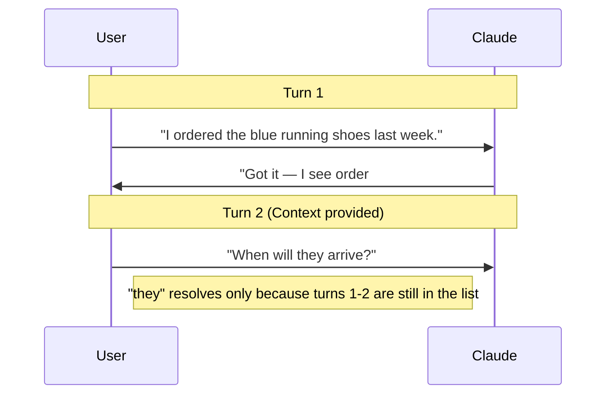
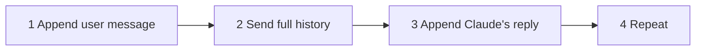

[00:00:00](https://www.udemy.com/course/claude-certified-architect-foundations-complete-course/learn/lecture/57042161#overview)


[00:00:00](https://www.udemy.com/course/claude-certified-architect-foundations-complete-course/learn/lecture/57042161#overview)

## Multi-Turn Conversations

- Claude is stateless
    - It has no built-in memory of previous interactions
    - Memory is something you must build by carrying the whole conversation on every request
- **[How to implement memory]** Because each API call is independent, your code must append every user and assistant turn to one list, then send that entire list again
    - `messages = [user, asst, user, ...]`

### Example Conversation Flow



### The Conversation Loop



[00:00:28](https://www.udemy.com/course/claude-certified-architect-foundations-complete-course/learn/lecture/57042161#overview)


[00:00:28](https://www.udemy.com/course/claude-certified-architect-foundations-complete-course/learn/lecture/57042161#overview)

### Product vs. Developer Experience

- **Using Claude (Product)**
    - Experienced through the web interface or app
    - Conversation feels natural because the application handles the heavy lifting
    - The app automatically manages and sends the relevant chat history with each new message
- **Building with Claude (Developer)**
    - Requires manual management of state
    - You must explicitly track and send the conversation history to maintain context

[00:00:58](https://www.udemy.com/course/claude-certified-architect-foundations-complete-course/learn/lecture/57042161#overview)


[00:00:59](https://www.udemy.com/course/claude-certified-architect-foundations-complete-course/learn/lecture/57042161#overview)

### API vs. Product Features

- **Building with the Claude API**
    - Unlike ready-made chat applications, the API does not provide the built-in tools or product features that make the user experience feel seamless
    - Developers are responsible for building the application logic that handles the conversation flow

[00:01:28](https://www.udemy.com/course/claude-certified-architect-foundations-complete-course/learn/lecture/57042161#overview)


[00:01:28](https://www.udemy.com/course/claude-certified-architect-foundations-complete-course/learn/lecture/57042161#overview)

### Manual Context Management

- Because each API request is isolated, the model only knows what is contained in the current request
- **[What must be included manually?]**
    - Previous messages: To provide conversation history
    - System prompts: To define an assistant persona
    - Business/Customer data: To provide access to tools, order information, or specific user details
- **[The Developer's Responsibility]**
    - Unlike a consumer product, the API does not provide 'hidden' memory; the developer must connect all pieces within their own application logic

[00:01:58](https://www.udemy.com/course/claude-certified-architect-foundations-complete-course/learn/lecture/57042161#overview)


[00:01:59](https://www.udemy.com/course/claude-certified-architect-foundations-complete-course/learn/lecture/57042161#overview)


[00:02:15](https://www.udemy.com/course/claude-certified-architect-foundations-complete-course/learn/lecture/57042161#overview)

### Implementing Multi-Turn Conversations

- **[The Core Mechanism]** Multi-turn conversation is achieved by having the backend collect the conversation history and send the relevant context to Claude on every single request
- This distinguishes building a Claude-powered application from simply using Claude as a product

### Notebook Setup

- Initializing the environment to work with Claude
- Using `load_dotenv` to allow Python to load environment variables (like API keys)

```python
from dotenv import load_dotenv
from anthropic import Anthropic

load_dotenv()

client = Anthropic()
model = "claude-3-sonnet-20240229"
```

[00:02:29](https://www.udemy.com/course/claude-certified-architect-foundations-complete-course/learn/lecture/57042161#overview)


[00:02:30](https://www.udemy.com/course/claude-certified-architect-foundations-complete-course/learn/lecture/57042161#overview)

### Notebook Setup Details

- **Environment and SDK Initialization**
    - `from dotenv import load_dotenv`: Imports the function to load environment variables from a `.env` file
    - `from anthropic import Anthropic`: Imports the official Anthropic SDK client
    - `load_dotenv()`: Executes the loading process, making variables like the API key available to the Python session
    - `client = Anthropic()`: Initializes the client
        - Because the API key is already present in the environment, it does not need to be passed as a direct argument
    - `model = "claude-sonnet-4-6"`: Stores the specific model name in a variable to keep subsequent code cleaner

```python
from dotenv import load_dotenv
from anthropic import Anthropic

load_dotenv()

client = Anthropic()
model = "claude-sonnet-4-6"
```

[00:02:59](https://www.udemy.com/course/claude-certified-architect-foundations-complete-course/learn/lecture/57042161#overview)


[00:03:14](https://www.udemy.com/course/claude-certified-architect-foundations-complete-course/learn/lecture/57042161#overview)

### Sending a Single Message

- **[The Initial Request]** To start a conversation, we can send a single message to Claude using the `client.messages.create` method
- **[Key Parameters]**
    - `model`: Specifies which Claude model to use (reusing the `model` variable from the setup)
    - `max_tokens`: Sets a limit on the maximum length of Claude's response (e.g., 300 tokens)
    - `messages`: A list of message objects representing the conversation
        - Each message in the list requires a `role` (e.g., `"user"`) and `content`

```python
message = client.messages.create(
    model=model,
    max_tokens=300,
    messages=[
        {"role": "user", "content": "..."}
    ]
)
```

[00:03:29](https://www.udemy.com/course/claude-certified-architect-foundations-complete-course/learn/lecture/57042161#overview)


[00:03:43](https://www.udemy.com/course/claude-certified-architect-foundations-complete-course/learn/lecture/57042161#overview)

### Accessing Response Content

- To extract the actual text response from the object returned by `client.messages.create`, use `message.content[0].text`

```python
print(message.content[0].text)
```

### The Common Mistake in Multi-Turn Conversations

- **[The Problem]** When a user replies to a previous response, developers often mistakenly send only the new message in the `messages` list
- **[Why it fails]** Because the API is stateless, it has no memory of the previous exchange. If you only send the new message, Claude loses all context of what was discussed before

```python

# INCORRECT: This only sends the new message, losing previous context
message = client.messages.create(
    model=model,
    max_tokens=300,
    messages=[
        {"role": "user", "content": "My order number is 12345"}
    ]
)
```

[00:03:59](https://www.udemy.com/course/claude-certified-architect-foundations-complete-course/learn/lecture/57042161#overview)


[00:04:03](https://www.udemy.com/course/claude-certified-architect-foundations-complete-course/learn/lecture/57042161#overview)

### The Consequences of Statelessness

- **[The Result of Missing Context]** When only the new user message is sent, Claude treats the interaction as a completely new, isolated request
    - Claude may still provide a reasonable answer, but it lacks the actual context of the previous turn
    - For example, it won't automatically know the user is attempting to return an order unless that intent was part of the current payload

```python

# INCORRECT: This only sends the new message, losing previous context
message = client.messages.create(
    model=model,
    max_tokens=300,
    messages=[
        {"role": "user", "content": "My order number is 12345"}
    ]
)
```

**[Example Output of the Incorrect Request]**

Even though the user provided an order number, Claude's response might look like this because it doesn't know why the number was provided:

> Thanks for sharing your order number! However, I should let you know that I'm an AI assistant. To get help with your order, I'd suggest:
> - **Contacting the retailer/company** directly through their website or customer service
> - **Checking your email** for order confirmation or shipping updates
> - **Logging into your account** on the retailer's website to track your order
> Is there anything else I can help you with?

[00:04:29](https://www.udemy.com/course/claude-certified-architect-foundations-complete-course/learn/lecture/57042161#overview)


[00:04:30](https://www.udemy.com/course/claude-certified-architect-foundations-complete-course/learn/lecture/57042161#overview)

### Implementing Multi-Turn Conversations Correctly

- **[The Rule]** If context matters, you cannot rely on the model to guess missing information; you must send the conversation history explicitly
- **[The Correct Approach]** Instead of sending only the latest message, create a `messages` list that contains the full sequence of the exchange

**[Correctly Structuring the Messages List]**

To follow up on a previous interaction, the `messages` list should be constructed chronologically:

1. **The initial user message** (e.g., the customer stating their intent)
2. **The assistant's previous reply** (representing Claude's prior response)
3. **The new user message** (the latest follow-up)

```python
messages = [
    {"role": "user", "content": "I want to return my order."},
    {"role": "assistant", "content": "Sure, I can help with that. Could you share your order number?"},
    {"role": "user", "content": "My order number is 12345"}
]
```

[00:04:59](https://www.udemy.com/course/claude-certified-architect-foundations-complete-course/learn/lecture/57042161#overview)


[00:05:09](https://www.udemy.com/course/claude-certified-architect-foundations-complete-course/learn/lecture/57042161#overview)

### The Core Principle of Multi-Turn Conversations

- **[The Mechanism]** By sending the full `messages` list (user intent $\rightarrow$ assistant reply $\rightarrow$ new user message), Claude can link new information to previous context
    - For example, Claude can recognize that a specific order number is directly related to a previously mentioned request to return an item
- **[The Responsibility]** Conversation state is not stored within the Claude API
    - The API remains stateless; it only knows what is in the current request
    - The application (the developer's code) is responsible for managing the conversation history

**[Managing State in Production]**

In a real-world production environment, the history would be managed using external storage such as:

- A database
- A session store

[00:05:29](https://www.udemy.com/course/claude-certified-architect-foundations-complete-course/learn/lecture/57042161#overview)


[00:05:29](https://www.udemy.com/course/claude-certified-architect-foundations-complete-course/learn/lecture/57042161#overview)

### Conversation History as Architecture

- **[The Developer's Role]** Because the API is stateless, managing the flow of a conversation becomes a core part of the application's architecture
    - In consumer-facing apps (like the Claude web interface), this management is handled automatically by the product
    - In custom API-driven applications, the developer is responsible for implementing the logic to track and resend history
- **[Implementation Methods]**
    - **In production:** History is typically stored in a database, a session store, or another backend storage mechanism
    - **In development/notebooks:** A simple Python list can be used to manually manage the sequence of messages

[00:05:59](https://www.udemy.com/course/claude-certified-architect-foundations-complete-course/learn/lecture/57042161#overview)


[00:05:59](https://www.udemy.com/course/claude-certified-architect-foundations-complete-course/learn/lecture/57042161#overview)

### Streamlining Message Management

- **[The Goal]** To move away from manually writing out message dictionaries for every interaction
- **[The Solution]** Implementing small helper functions to automate the process:
    - Adding user messages to the history
    - Saving assistant responses to the history
    - Building a simple reply loop for the application (e.g., ShopAssist AI)