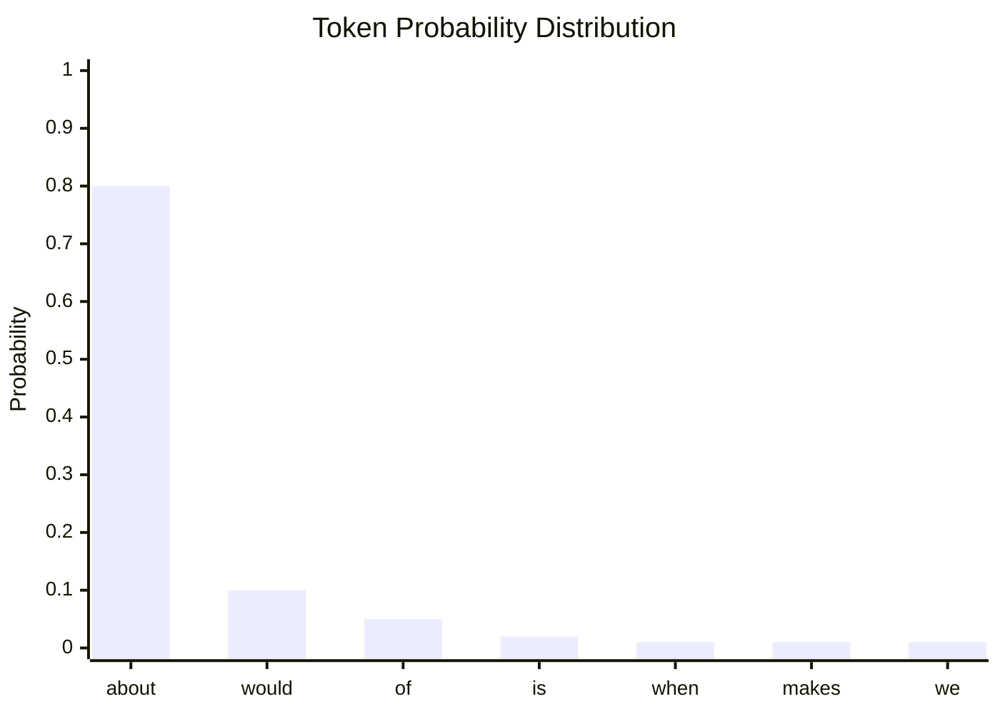
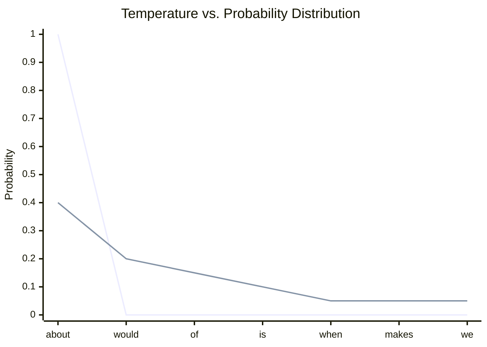

[00:00:00](https://www.udemy.com/course/claude-certified-architect-foundations-complete-course/learn/lecture/57042193#overview)


[00:00:00](https://www.udemy.com/course/claude-certified-architect-foundations-complete-course/learn/lecture/57042193#overview)

## Parameters that control how Claude responds

- Transitioning from a demo to a real application requires fine-tuning specific settings
- Key parameters to be covered:
    - 01 Model selection
    - 02 Temperature
    - 03 Stop sequences

[00:00:13](https://www.udemy.com/course/claude-certified-architect-foundations-complete-course/learn/lecture/57042193#overview)


[00:00:13](https://www.udemy.com/course/claude-certified-architect-foundations-complete-course/learn/lecture/57042193#overview)


[00:00:27](https://www.udemy.com/course/claude-certified-architect-foundations-complete-course/learn/lecture/57042193#overview)

### Model Selection

- Instead of anchoring on specific model names, focus on the type of task being solved
    - Model names change frequently as new ones appear
- **[The Architectural Question]** What kind of task are we solving?

| Task Type | Model Characteristic | Use Case |
| --- | --- | --- |
| Normal support | General-purpose default | Understand context, follow policy, and give a helpful answer |
| Simple, high-volume | Smaller / faster | Detect refund requests, classify intent, extract a field, route a case |
| Complex / high-risk | Capable reasoning — test it | Multi-step issues, policy exceptions, conflicting info, agentic coordination |

- **Strategy**: Don't automatically pick the most powerful model
    - Match the model to the task
    - Combine models where it helps (e.g., use a fast model to classify/route, then a stronger one for the final reply)

[00:00:43](https://www.udemy.com/course/claude-certified-architect-foundations-complete-course/learn/lecture/57042193#overview)


[00:00:43](https://www.udemy.com/course/claude-certified-architect-foundations-complete-course/learn/lecture/57042193#overview)

[00:01:13](https://www.udemy.com/course/claude-certified-architect-foundations-complete-course/learn/lecture/57042193#overview)


[00:01:14](https://www.udemy.com/course/claude-certified-architect-foundations-complete-course/learn/lecture/57042193#overview)

[00:01:43](https://www.udemy.com/course/claude-certified-architect-foundations-complete-course/learn/lecture/57042193#overview)


[00:01:43](https://www.udemy.com/course/claude-certified-architect-foundations-complete-course/learn/lecture/57042193#overview)


[00:01:53](https://www.udemy.com/course/claude-certified-architect-foundations-complete-course/learn/lecture/57042193#overview)


[00:02:08](https://www.udemy.com/course/claude-certified-architect-foundations-complete-course/learn/lecture/57042193#overview)

### Model Selection Strategy

- In real architectures, it is effective to use multiple models together
    - Use a faster model for tasks like classification and routing
    - Use a stronger model for the final customer-facing response

### Temperature

- Claude generates text by predicting the next token rather than writing full sentences all at once
- Each possible next token is assigned a probability
    - For example, after the phrase "what do you think", Claude might consider tokens like "about", "would", "of", "is", "when", or "makes"
    - The model weighs these options based on their probability

```python

# temperature is a float parameter

# Defaults to 1.0. Ranges from 0.0 to 1.0.

# Use closer to 0.0 for analytical/multiple choice

# Use closer to 1.0 for creative and generative tasks.

temperature = 0.0
system = "You are ShopAssist AI, a helpful customer support assistant."
messages = [
    {"role": "user", "content": "A customer wants to return an order. Write a short helpful res"}
]
```



[00:02:15](https://www.udemy.com/course/claude-certified-architect-foundations-complete-course/learn/lecture/57042193#overview)


[00:02:22](https://www.udemy.com/course/claude-certified-architect-foundations-complete-course/learn/lecture/57042193#overview)

### Temperature's Effect on Token Selection

- Temperature controls how strongly Claude follows the calculated token probabilities
- **Low Temperature (near 0.0)**
    - Makes the model more deterministic
    - One token receives almost all the probability
    - Results in stable, predictable, and repeatable output
- **High Temperature (near 1.0)**
    - Allows for more variety and creativity
    - Probability is spread out across more candidates
    - Gives the model "freedom" to choose less obvious, lower-probability options



[00:03:00](https://www.udemy.com/course/claude-certified-architect-foundations-complete-course/learn/lecture/57042193#overview)


[00:03:02](https://www.udemy.com/course/claude-certified-architect-foundations-complete-course/learn/lecture/57042193#overview)


[00:03:30](https://www.udemy.com/course/claude-certified-architect-foundations-complete-course/learn/lecture/57042193#overview)

### Matching Temperature to the Task

- Temperature is not about 'good' or 'bad' settings, but about matching the setting to the specific task
- **Low Temperature (e.g., 0.0)**
    - Used for tasks requiring consistency and predictability
    - Ideal for support automation and writing refund policy answers
    - Reduces randomness to keep replies from changing too much between requests
- **High Temperature**
    - Used for creative and generative tasks
    - Ideal for brainstorming ideas, such as five creative product campaign ideas

```python

# Example configuration for consistent support replies

temperature = 0.0
system = "You are ShopAssist AI, a helpful customer support assistant."
messages = [
    {"role": "user", "content": "A customer wants to return an order. Write a short helpful res"}
]
```

[00:03:45](https://www.udemy.com/course/claude-certified-architect-foundations-complete-course/learn/lecture/57042193#overview)


[00:04:26](https://www.udemy.com/course/claude-certified-architect-foundations-complete-course/learn/lecture/57042193#overview)

### Stop Sequences

- A custom text marker that tells Claude exactly when to stop generating text
- **[How it works]** The `stop_sequences` parameter accepts a list of strings
    - If Claude generates any of these strings, the API immediately stops the response
    - The `stop_reason` field in the API response will indicate that the generation was halted by a stop sequence
- **[Use Case Example]** Preventing the model from bleeding into other sections
    - If you want Claude to generate only a customer-facing reply and stop before an internal notes section, you can use a marker like `<END>` to act as a boundary

```python
message = client.messages.create(
    model=model,
    max_tokens=300,
    temperature=0,
    stop_sequences=["<END>"],
    system="You are ShopAssist AI, a helpful customer support assistant.",
    messages=[
        {"role": "user", "content": "Write a short customer support reply about a return request. End the reply with <END>"}
    ]
)
```

[00:04:31](https://www.udemy.com/course/claude-certified-architect-foundations-complete-course/learn/lecture/57042193#overview)


[00:04:42](https://www.udemy.com/course/claude-certified-architect-foundations-complete-course/learn/lecture/57042193#overview)


[00:05:03](https://www.udemy.com/course/claude-certified-architect-foundations-complete-course/learn/lecture/57042193#overview)

### Stop Sequences vs. Validation

- Stop sequences help control the boundary of a response, but they do not guarantee the correctness of the content
- **[Important distinction]** Stop sequences $\neq$ Validation
    - A stop sequence can prevent the model from generating extra text (like internal notes)
    - However, it cannot guarantee that the generated text follows a specific schema or is factually accurate
    - For production systems, especially when relying on JSON or tool calls, you must implement programmatic validation in your application code
- **[API Details]** When a stop sequence is triggered:
    - The `stop_reason` field in the API response will explicitly state `stop_sequence`
    - The response will also identify the exact string that was used to halt the generation

### Summary: Model Selection Strategy

- Model selection is a balancing act between four key factors:
    - Reasoning quality
    - Speed
    - Latency
    - Cost

| Model Type | Role | Typical Use Case |
| --- | --- | --- |
| Strong General-Purpose | Default Assistant | Everyday customer support conversations |
| Smaller / Faster | Fast Utility Model | Classification, routing, summaries, and low-risk background tasks |
| Most Capable | Highest-reasoning Model | Complex cases, policy exceptions, multi-step analysis, and high-impact decisions |

[00:05:16](https://www.udemy.com/course/claude-certified-architect-foundations-complete-course/learn/lecture/57042193#overview)


[00:05:16](https://www.udemy.com/course/claude-certified-architect-foundations-complete-course/learn/lecture/57042193#overview)

### Summary of Model Selection

- Model selection is a balancing act between reasoning quality, speed, latency, and cost
- **[Key Strategy]** Instead of memorizing specific model names, focus on the role each model plays in your architecture:

| Model Role | Characteristics | Use Cases |
| --- | --- | --- |
| Default assistant | Strong general-purpose | Everyday customer-support conversations |
| Fast utility model | Smaller and faster | Classification, routing, summaries, and low-risk background tasks |
| Highest-reasoning model | Most capable | Complex cases, policy exceptions, multi-step analysis, or high-impact decisions |

### Quick Reference for Parameters

- **Low Temperature**: Use when you need predictable, consistent behavior
- **Stop Sequences**: Use when your application needs the model to halt at a specific marker