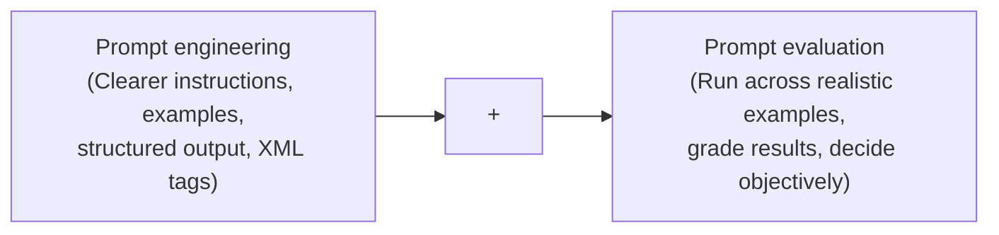
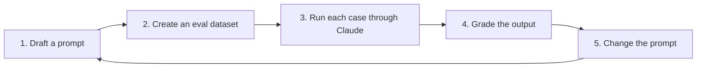
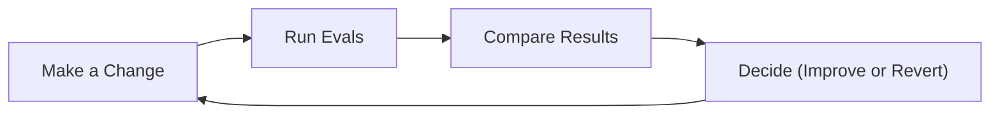
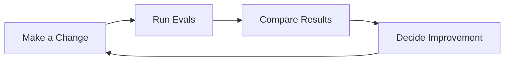

## Prompt Engineering and Evaluation

- Prompt engineering focuses on writing better prompts through several techniques:
    - Making instructions clearer
    - Adding examples
    - Requesting structured output
    - Using XML tags to separate different parts of the prompt
- **[The Missing Half]** Prompt evaluation is just as critical as engineering
    - Evaluation involves measuring how well a prompt works by running it across many realistic examples
    - It requires grading results and deciding objectively if the prompt has improved




[00:00:21](https://www.udemy.com/course/claude-certified-architect-foundations-complete-course/learn/lecture/57042201#overview)


[00:00:33](https://www.udemy.com/course/claude-certified-architect-foundations-complete-course/learn/lecture/57042201#overview)

### The Risks of Manual Testing

- **[The Problem]** A prompt that appears successful in a controlled environment can still fail in production
    - It may work perfectly in a demo
    - It may pass for the few specific examples you tested by hand
- **[Why it fails]** Real users send inputs that were never planned for:
    - Unclear or vague messages
    - Unexpected edge cases
    - Forgotten or missing details
    - Multiple problems contained within a single message

> **Example: ShopAssist AI**
> A prompt designed to handle a single refund request might fail when a user sends a complex message involving refunds, missing packages, damaged items, billing problems, and angry sentiment all at once, requiring human escalation.


[00:00:52](https://www.udemy.com/course/claude-certified-architect-foundations-complete-course/learn/lecture/57042201#overview)


[00:01:22](https://www.udemy.com/course/claude-certified-architect-foundations-complete-course/learn/lecture/57042201#overview)


[00:01:37](https://www.udemy.com/course/claude-certified-architect-foundations-complete-course/learn/lecture/57042201#overview)

### Reframing Prompt Quality

- **[The Shift]** Move away from subjective questions toward objective performance metrics
    - Instead of asking: "Does this prompt look good?"
    - Ask: "How does this prompt perform across many realistic examples?"
- **[The Goal of Evals]** Answering the performance question objectively across many cases, rather than relying on a feeling

### Three Paths After Writing a Prompt

- Engineers typically follow one of three approaches to validate their work:

| Path | Description | Risk/Benefit |
| --- | --- | --- |
| Risky | Test it once and decide it is "good enough" after a single try | May work in a notebook but fail in production |
| Better, but limited | Test the prompt a few times and fix one or two obvious problems | Only covers the specific cases you happened to think of |
| Recommended | Build an eval pipeline | Run the prompt against a whole dataset, grade the results, then change and re-run for an objective comparison |


[00:01:51](https://www.udemy.com/course/claude-certified-architect-foundations-complete-course/learn/lecture/57042201#overview)

### The Recommended Path: Building an Eval Pipeline

- **[The Advantage]** Building a pipeline provides an objective way to decide if a prompt change actually improved performance
    - It involves creating a dataset of test cases
    - You run the prompt against all cases in the dataset
    - You grade the results
    - You then change the prompt and run the exact same eval again to compare

### The Basic Eval Workflow

- Evaluation is a repeatable loop, not a one-off check




[00:02:21](https://www.udemy.com/course/claude-certified-architect-foundations-complete-course/learn/lecture/57042201#overview)


[00:02:27](https://www.udemy.com/course/claude-certified-architect-foundations-complete-course/learn/lecture/57042201#overview)

### ShopAssist AI Evaluation Dataset

- **[The Dataset Structure]** To make an evaluation objective, each test case must contain both the input and the correct answer
    - **Input**: The raw customer message
    - **Expected Intent**: The ground truth/correct classification we expect the AI to return

```python
test_cases = [
    {
        "input": "I want to return my shoes. They arrived damaged.",
        "expected_intent": "refund_request"
    },
    {
        "input": "Where is my order? It was supposed to arrive yesterday.",
        "expected_intent": "order_status"
    },
    {
        "input": "I was charged twice for the same order.",
        "expected_intent": "billing_issue"
    }
]
```


[00:03:08](https://www.udemy.com/course/claude-certified-architect-foundations-complete-course/learn/lecture/57042201#overview)

### Running the Evaluation Loop

- To automate the process, iterate through the `test_cases` dataset and pass each input to the classification function

```python
for test_case in test_cases:
    response = classify_intent(test_case["input"])
    print(response)
```

### Implementing `classify_intent`

- This function handles the communication between the application and Claude to categorize customer messages
- **[Configuration Details]**
    - **Model**: Uses `claude-sonnet-4-6`
    - **Temperature**: Set to `0` because this is a classification task where consistency and predictability are more important than creativity
    - **Output Format**: Instructs Claude to return a valid JSON object so the Python code can easily parse and use the result

```python
def classify_intent(customer_message):
    prompt = f'''
Classify the customer's message into one of these intents:
- refund_request
- order_status
- billing_issue
- product_question
- other

Customer message: {customer_message}

Return only a valid JSON object.
Do not include markdown.
Do not include explanations.
Do not wrap the JSON in a code block.

{{"intent": "refund_request"}}
'''
    message = client.messages.create(
        model=model,
        max_tokens=200,
        temperature=0,
        messages=[
            {
                "role": "user",
                "content": prompt
            }
        ]
    )
    return json.loads(message.content[0].text)
```


[00:03:22](https://www.udemy.com/course/claude-certified-architect-foundations-complete-course/learn/lecture/57042201#overview)

### Automating the Comparison

- Simply printing the response is insufficient because it doesn't provide a clear signal of correctness
- To automate the evaluation, compare the actual intent returned by the model against the expected intent in the test case
    - If they match, the test passes
    - If they do not match, the test fails

```python
for test_case in test_cases:
    response = classify_intent(test_case["input"])
    print(response)
    actual = response["intent"]
    expected = test_case["expected_intent"]
    passed = actual == expected
    print(passed)
```


[00:03:58](https://www.udemy.com/course/claude-certified-architect-foundations-complete-course/learn/lecture/57042201#overview)


[00:04:08](https://www.udemy.com/course/claude-certified-architect-foundations-complete-course/learn/lecture/57042201#overview)

### The Prompt Engineering Workflow

- **[Mindset Shift]** Move from subjective assessment to an objective engineering workflow
    - Instead of asking "Does this prompt look good?", ask "How does it perform across many realistic examples?"
- **The Workflow Loop**

    1. **Make a change**: Modify the prompt instructions or structure
    2. **Run evals**: Execute the prompt against your evaluation dataset
    3. **Compare results**: Measure the actual outputs against the expected ground truth
    4. **Decide**: Use the measurable data to determine if the change was an improvement



### Measuring Results

- Evaluation allows you to turn prompt changes into measurable data
- **[Example Comparison]**
    - First prompt: 7/10 pass rate
    - Improved prompt: 9/10 pass rate
- A good prompt is defined by its performance across realistic examples, not just how well-written it sounds.


[00:04:22](https://www.udemy.com/course/claude-certified-architect-foundations-complete-course/learn/lecture/57042201#overview)

### The Prompt Engineering Workflow

- Prompt engineering should be treated as a measurable engineering workflow rather than a subjective feeling
- **[The Core Loop]**
    - Make a change to the prompt
    - Run evaluations
    - Compare results against the previous version
    - Decide whether the change resulted in an improvement
- A good prompt is defined by its performance across realistic examples, not just how well-written it sounds



| Metric | Description |
| --- | --- |
| passed | actual == expected (The model output matches the ground truth) |
| failed | actual != expected (The model output does not match the ground truth) |

| Version | Score |
| --- | --- |
| First prompt | 7/10 |
| Improved prompt | 9/10 |