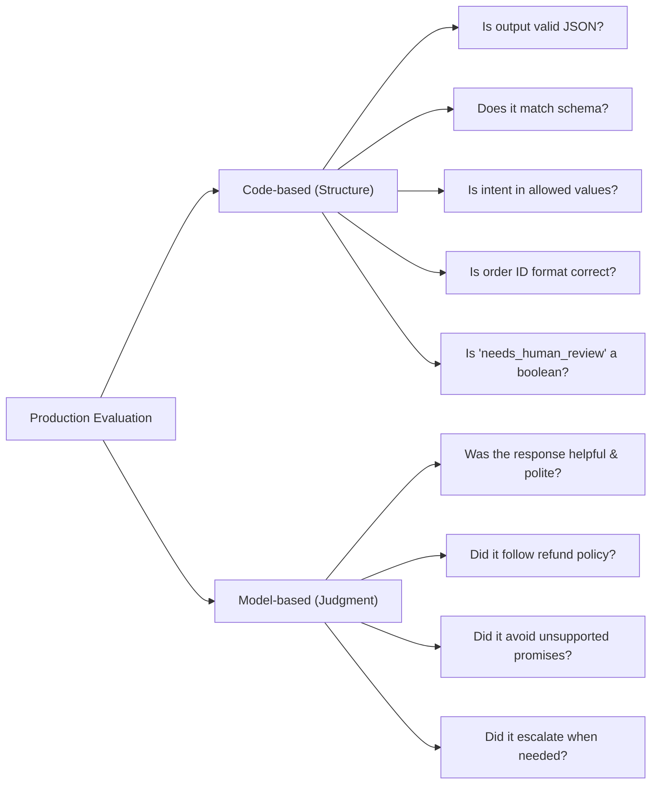

[00:00:00](https://www.udemy.com/course/claude-certified-architect-foundations-complete-course/learn/lecture/57042211#overview)

## Grading Prompt Outputs

- The evaluation loop requires every output to receive a verdict to be effective
- There are three common ways to grade a model's answer, which involve trade-offs between accuracy, speed, and cost

| Approach | Description | Notes |
| --- | --- | --- |
| Approach 01: Code-based | Plain program logic checks the answer | Fast, reliable, and easy to automate |
| Approach 02: Model-based | A second Claude call judges the first response | Great for quality and tone |
| Approach 03: Human | A person reviews manually | Very accurate, but expensive and hard to scale (Slow) |


[00:00:20](https://www.udemy.com/course/claude-certified-architect-foundations-complete-course/learn/lecture/57042211#overview)

### Automation Advantages

- Code-based and model-based grading are the primary focus for automation due to their scalability compared to human review.


[00:00:50](https://www.udemy.com/course/claude-certified-architect-foundations-complete-course/learn/lecture/57042211#overview)


[00:01:10](https://www.udemy.com/course/claude-certified-architect-foundations-complete-course/learn/lecture/57042211#overview)

### Code-based Grading

- Best used when model outputs have a clear, predictable structure
- **[Deterministic nature]** Because the checks follow strict logic, the result is binary (e.g., valid or invalid)

#### JSON Validation

- Can be used to verify if the model's response is a valid JSON object

```python
import json

def is_valid_json(text):
    try:
        json.loads(text)
        return True
    except json.JSONDecodeError:
        return False
```

#### Field Validation

- Can be used to ensure the output contains all necessary keys required by the application

```python
def has_required_fields(data):
    required_fields = ["intent", "order_id", "needs_human_review"]
    for field in required_fields:
        if field not in data:
            return False
    return True
```


[00:01:37](https://www.udemy.com/course/claude-certified-architect-foundations-complete-course/learn/lecture/57042211#overview)

#### Value Validation

- Can be used to check if a specific value falls within an allowed list of options
- **[Example]** Ensuring the `intent` returned by the model is one of the specific values the system is programmed to handle

```python
def has_valid_intent(data):
    allowed_intents = [
        "refund_request",
        "order_status",
        "billing_issue",
        "product_question",
        "other"
    ]
    return data["intent"] in allowed_intents
```

- **[Why this matters]** In an application like ShopAssist AI, missing or invalid fields can break core logic:
    - Missing `intent`: Cannot route the request
    - Missing `order_id`: May require an unnecessary follow-up question
    - Missing `needs_human_review`: May fail to escalate a sensitive case


[00:01:49](https://www.udemy.com/course/claude-certified-architect-foundations-complete-course/learn/lecture/57042211#overview)


[00:01:56](https://www.udemy.com/course/claude-certified-architect-foundations-complete-course/learn/lecture/57042211#overview)

### Limitations of Code-based Grading

- Code-based grading is limited because it can only check structure, not quality
- **[The Distinction]**
    - **Easy for code (Strict rules):**
        - Is the JSON valid?
        - Is the field present?
        - Is the value in the allowed list?
        - Does the output match a specific schema?
    - **Hard for code (Judgment & policy):**
        - Was the answer polite?
        - Did the model explain a policy clearly?
        - Did it avoid promising a refund too early?
        - Did it ask for missing information (like an order number)?
        - Did it escalate when necessary?
- **[The Solution]** To handle these qualitative questions, a grader that understands language is required, leading to model-based grading.


[00:02:20](https://www.udemy.com/course/claude-certified-architect-foundations-complete-course/learn/lecture/57042211#overview)


[00:02:49](https://www.udemy.com/course/claude-certified-architect-foundations-complete-course/learn/lecture/57042211#overview)

### Model-based Grading

- Uses a second LLM to evaluate the response produced by the first LLM
    - **First LLM:** Produces the actual customer support answer
    - **Second LLM:** Acts as the "grader" to evaluate the quality of that answer
- **[Why use it?]** To handle complex, qualitative judgments that are difficult to capture with strict code-based rules, such as:
        - Detecting if a customer mentioned fraud or legal action
        - Evaluating politeness
        - Checking for clarity in policy explanations

#### The Grading Process

- To perform model-based grading, you provide a grading prompt to the second LLM that includes specific rules and a requested output format.
- **Example Grading Prompt:**

```text
You are evaluating a customer support assistant response.
Check whether the response follows these rules:
1. The assistant must be polite.
2. The assistant must not promise a refund before checking the order.
3. The assistant must ask for the order number if it is missing.
4. The assistant must escalate if the customer mentions fraud or legal action.

Return JSON with:
- score: a number from 1 to 10
- passed: true or false
- reason: short explanation
```

- **Implementation Structure:**

```python
def grade_response(customer_message, assistant_response):
    grading_input = f"""
    grading_prompt = '''
    You are evaluating a customer support assistant response.
    Check whether the response follows these rules:
    1. The assistant must be polite.
    2. The assistant must not promise a refund before checking the order.
    3. The assistant must ask for the order number if it is missing.
    4. The assistant must escalate if the customer mentions fraud or legal action.

    Return JSON with:
    - score: a number from 1 to 10
    - passed: true or false
    - reason: short explanation
    '''

    grading_input = f"""
    {grading_prompt}

    Customer message: {customer_message}
    Assistant response: {assistant_response}
    """

# (Logic to call the LLM with grading_input and return the result)
```


[00:02:52](https://www.udemy.com/course/claude-certified-architect-foundations-complete-course/learn/lecture/57042211#overview)

### Implementation Details

- **Prompt Composition:** The grading prompt serves as the core evaluation criteria, defining the specific rules the grader LLM must apply.
- **Input Context:** To perform the evaluation, the grading prompt is combined with the original interaction context, typically including:
    - The original customer message
    - The assistant's response being evaluated


[00:03:20](https://www.udemy.com/course/claude-certified-architect-foundations-complete-course/learn/lecture/57042211#overview)

### Model-based Grading Output

- The grader LLM evaluates the interaction and returns structured feedback
    - **Example Grading Result:**

```json
{
      "score": 4,
      "passed": false,
      "reason": "The assistant promised a refund before verifying the order."
    }
```

- **[Why use it?]** It provides qualitative reasoning and feedback that is difficult to capture with simple code-based checks

### Use Cases for Model-based Grading

- It is especially helpful for evaluating subjective criteria such as:
    - Helpfulness
    - Politeness
    - Completeness
    - Instruction following
    - Business policy compliance
    - Safety
    - Escalation behavior


[00:03:50](https://www.udemy.com/course/claude-certified-architect-foundations-complete-course/learn/lecture/57042211#overview)

### Challenges and Best Practices for Model-based Grading

- **Inherent Risks**
    - A model-based grader is still a model and is susceptible to:
        - Making mistakes
        - Inconsistency
- **[The Importance of Specificity]** If grading criteria are vague, the resulting scores lack utility
    - **Poor Prompting (Vague):** "Grade whether the response is good"
    - **Effective Prompting (Specific):**
        - Grade whether the response follows the refund policy
        - Grade whether the response avoids unsupported promises
        - Grade whether the response asks for missing information
        - Grade whether the response uses a polite tone


[00:04:20](https://www.udemy.com/course/claude-certified-architect-foundations-complete-course/learn/lecture/57042211#overview)


[00:04:32](https://www.udemy.com/course/claude-certified-architect-foundations-complete-course/learn/lecture/57042211#overview)

## Hybrid Grading in Production

- Real-world systems often combine both approaches to leverage their respective strengths
    - **Code-based grading** is used for **structure** (deterministic checks)
    - **Model-based grading** is used for **judgment** (semantic checks)

### Combining Approaches




[00:04:51](https://www.udemy.com/course/claude-certified-architect-foundations-complete-course/learn/lecture/57042211#overview)


[00:05:14](https://www.udemy.com/course/claude-certified-architect-foundations-complete-course/learn/lecture/57042211#overview)

### Scoring and Comparison

- **[Combining Scores]** You can aggregate different grading methods into a single metric to get an overall view of performance for each test case
    - **Example calculation:**

```python
final_score = (code_score + model_score) / 2
```

- **[The Goal of Evaluation]** The specific number generated is less important than the ability to compare versions
    - By calculating the average score across an entire evaluation dataset, you can determine if `prompt version 1` is performing better or worse than `prompt version 2`.


[00:05:20](https://www.udemy.com/course/claude-certified-architect-foundations-complete-course/learn/lecture/57042211#overview)

### The Importance of Inspecting Failures

- **[Compare, then Inspect]** The primary value of an aggregate score is to determine the direction of improvement between versions, not the absolute number itself
    - **Example:** If `Prompt v1` scores 6.8 and `Prompt v2` scores 8.4, version 2 is likely better, but the number is not "magic"
- **[The Risk of Averages]** A higher mean score can hide significant trade-offs and regressions
    - A new prompt might improve one aspect while breaking another
    - **Potential Trade-offs:**
        - Improved refund handling vs. broken billing logic
        - Increased politeness vs. decreased directness
        - Reduced hallucinations vs. excessive follow-up questions
- **[Key Principle]** Do not stop at the average; always review the failed cases to understand the nuances of how the model is performing.


[00:06:03](https://www.udemy.com/course/claude-certified-architect-foundations-complete-course/learn/lecture/57042211#overview)

### Summary of Grading Approaches

- **[The Synergy]** Combining both methods provides a practical way to build more reliable applications by leveraging the strengths of each
    - **Code-based grading** is used to check:
        - Structure
        - Schemas
        - Syntax
        - Exact rules
    - **Model-based grading** is used to check:
        - Quality
        - Judgment
        - Tone
        - Policy following