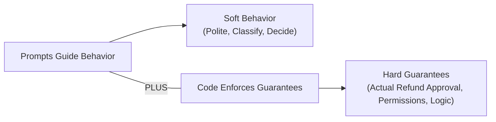
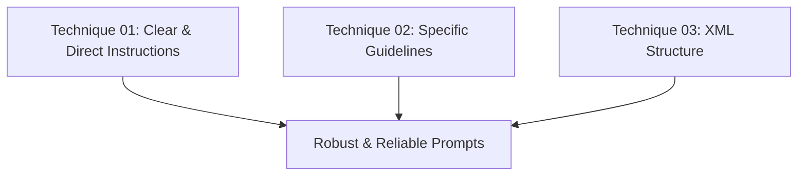
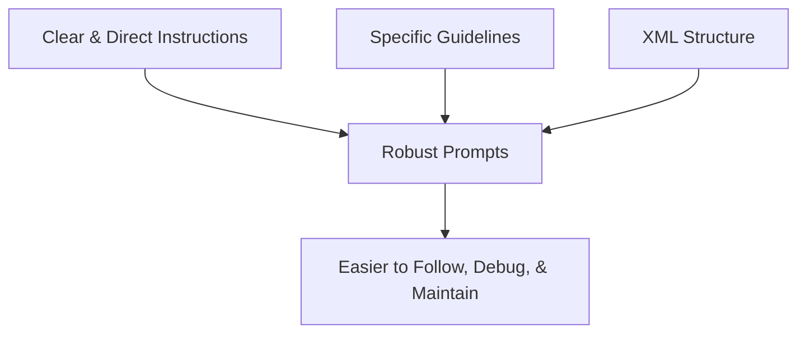

### Clear & Direct Instructions

- A good prompt isn't clever — it's unambiguous
    - The goal is to write instructions that are clear, direct, and easy to follow
    - **Core rule**: Don't make Claude guess what you want


[00:00:05](https://www.udemy.com/course/claude-certified-architect-foundations-complete-course/learn/lecture/57042215#overview)


[00:00:11](https://www.udemy.com/course/claude-certified-architect-foundations-complete-course/learn/lecture/57042215#overview)


[00:00:28](https://www.udemy.com/course/claude-certified-architect-foundations-complete-course/learn/lecture/57042215#overview)

### Components of a Good Prompt

- A good prompt tells Claude four things upfront:
    - **Role**: Who Claude should be
    - **Task**: What it should do
    - **Rules**: What to follow
    - **Format**: What to return

### Prompt Precision: Vague vs. Clear

- **[The Problem]** Vague instructions are technically valid but leave too many decisions to Claude
    - Example of a weak prompt: `"Help this customer"`
    - This is too open; Claude has to guess whether to write a reply, classify an issue, ask for an order number, or approve a refund
- **[The Solution]** Spell out the role, task, business rules, and limits to be clear and direct
    - Instead of being vague, provide specific instructions like:
        - "You are a support assistant for an online store."
        - "Write a short, helpful response."
        - "If they want a refund, ask for the order number."
        - "Don't promise the refund is approved. Keep it under 80 words."


[00:00:34](https://www.udemy.com/course/claude-certified-architect-foundations-complete-course/learn/lecture/57042215#overview)


[00:01:04](https://www.udemy.com/course/claude-certified-architect-foundations-complete-course/learn/lecture/57042215#overview)


[00:01:25](https://www.udemy.com/course/claude-certified-architect-foundations-complete-course/learn/lecture/57042215#overview)

### Specific Guidelines

- **[Principle 2]** Explain what "handle this well" actually means
    - Claude is good at following instructions, but the instructions must explicitly "describe the behavior you want"
    - A list of guidelines turns vague expectations into explicit behavior
- **[Example: Guidelines for Support Assistant]**
    - Instead of a vague instruction, use a specific list:
        - Be polite and professional.
        - Do not mention internal policies.
        - Do not approve refunds directly.
        - Ask for missing information when needed.
        - If the customer is angry, acknowledge the frustration briefly.
        - If the issue is unclear, ask one clarifying question.


[00:01:34](https://www.udemy.com/course/claude-certified-architect-foundations-complete-course/learn/lecture/57042215#overview)


[00:01:45](https://www.udemy.com/course/claude-certified-architect-foundations-complete-course/learn/lecture/57042215#overview)

### Anatomy of a Production Claude Prompt

- In a production environment, a prompt is rarely just a single sentence
- A robust prompt is composed of several distinct, functional parts
- **Initial Components**:
    - **Task**: A clear definition of what Claude should actually do
    - **Context**: The necessary background information Claude needs to provide an accurate response

```text
<role>
You are a customer support assistant for ShopAssist AI.
</role>

<task>
Write a short, helpful reply.
</task>

<context>
ShopAssist helps with orders, returns, refunds, and product questions.
</context>

<rules>
- Be polite and calm.
- Do not approve a refund directly.
- Ask for the order number if it is missing.
- Keep the response under 80 words.
</rules>

<customer_message>
I want my money back. The jacket arrived damaged.
</customer_message>

<output_format>
Return only the final customer-facing response.
</output_format>

<success_criteria>
Short, calm, helpful -- and asks for the order number.
</success_criteria>
```


[00:02:05](https://www.udemy.com/course/claude-certified-architect-foundations-complete-course/learn/lecture/57042215#overview)

### Essential Prompt Components for Production

To build a robust, production-ready prompt, several additional functional components are used to provide structure and clarity:

- **Rules**: Explicitly defining what Claude should always or never do
- **Input**: Providing the actual data to be processed (e.g., the `<customer_message>`)
- **Output Format**: Specifying the desired shape of the answer (e.g., plain text, JSON, a short answer, or a classification)
- **Success Criteria**: Defining what a good answer looks like to guide the model's performance

**[Complete Prompt Structure Example]**

Using clear tags helps organize these components, making the prompt much easier to manage:

```text
<role>
You are a customer support assistant for ShopAssist AI.
</role>

<task>
Write a short, helpful reply.
</task>

<context>
ShopAssist helps with orders, returns, refunds, and product questions.
</context>

<rules>
- Be polite and calm.
- Do not approve a refund directly.
- Ask for the order number if it is missing.
- Keep the response under 80 words.
</rules>

<customer_message>
I want my money back. The jacket arrived damaged.
</customer_message>

<output_format>
Return only the final customer-facing response.
</output_format>

<success_criteria>
Short, calm, helpful — and asks for the order number.
</success_criteria>
```


[00:02:34](https://www.udemy.com/course/claude-certified-architect-foundations-complete-course/learn/lecture/57042215#overview)

### Organizing Prompts with XML Tags

- Avoid mixing all instructions into a single, messy paragraph
- Separate distinct parts to make the prompt easier for Claude to follow and easier for developers to maintain
- **[Technique]** Use XML tags as a clean way to separate functional components
    - XML tags are not "magic," but they provide clear structural boundaries
    - They help prevent different parts of the prompt from bleeding into one another

**[Example Structure]**

| Component | XML Tag | Purpose |
| --- | --- | --- |
| Role & Task | <role> / <task> | Defines who Claude is and what to do |
| Context | <context> | Provides necessary background information |
| Rules | <rules> | Specifies what to always or never do |
| Input | <customer_message> | The actual data or message being processed |
| Output Format | <output_format> | Defines the shape of the response (e.g., JSON, plain text) |
| Success Criteria | <success_criteria> | Describes what a good answer looks like |


[00:03:05](https://www.udemy.com/course/claude-certified-architect-foundations-complete-course/learn/lecture/57042215#overview)

### Benefits of XML Tagging in Production

- **Improved Model Understanding**: Helps Claude distinguish between different types of content:
    - Instructions (what to do)
    - Data (the information being processed)
    - Expected output requirements
- **Developer Maintainability**: Makes prompts much easier to read and update as they grow
- **[Why it matters]** Because production prompts can scale quickly to include complex elements like:
    - Business rules
    - Customer and order data
    - Tool results
    - Specific formatting requirements

Without this structure, the prompt becomes a "messy paragraph" that is difficult for both the AI and the human developer to manage.


[00:03:35](https://www.udemy.com/course/claude-certified-architect-foundations-complete-course/learn/lecture/57042215#overview)


[00:03:58](https://www.udemy.com/course/claude-certified-architect-foundations-complete-course/learn/lecture/57042215#overview)

### Messy vs. Structured Prompts

- **[The Messy Approach]** Writing instructions as a single, continuous paragraph
    - Example: `"You are a support assistant. A customer wants a refund. Be nice. Ask for details if needed. Don't say too much and don't approve anything unless you know the order..."`
    - **[Problem]** As the prompt grows with more rules and data, it becomes increasingly difficult to read and maintain
- **[The Structured Approach]** Using tagged sections to give each part a clear purpose
    - Each section (role, task, rules, etc.) is isolated within XML tags
    - **[Benefit]** This makes the prompt easier to read and much simpler to update later (e.g., when business rules change)

### Implementing Structure in Python Code

- In a real application, the structural part of the prompt remains constant, while the specific user input is injected dynamically
- **[Why this works]** The structure provides consistent instructions to Claude every time, regardless of the changing input

```python
customer_message = "I want my money back."

prompt = f"""
<rules>You are a customer support assistant for ShopAssist AI.</rules>
<task>Write a short response to the customer.</task>
<rules>Be polite - don't approve a refund - ask for the order number</rules>
<customer_message>{customer_message}</customer_message>
"""

message = client.messages.create(
    model=claude_3_5_sonnet,
    max_tokens=300,
    messages=[{"role": "user", "content": prompt}]
)
```


[00:04:05](https://www.udemy.com/course/claude-certified-architect-foundations-complete-course/learn/lecture/57042215#overview)


[00:04:32](https://www.udemy.com/course/claude-certified-architect-foundations-complete-course/learn/lecture/57042215#overview)

### Wrapping Structure Around Dynamic Input

- In a production application, the prompt structure is static, while the specific user input is dynamic
    - **Dynamic Input**: Data that changes with every request (e.g., a message from a UI, a chat, or a backend service)
    - **Static Structure**: The set of instructions, rules, and formatting requirements that stay the same to ensure consistent model behavior
- **[Implementation]** Use Python f-strings to inject the dynamic variable into a pre-defined XML-structured prompt

```python
customer_message = "I want my money back."

prompt = f"""
<role>You are a customer support assistant for ShopAssist AI.</role>
<task>Write a short response to the customer.</task>
<rules>
    Be polite and calm.
    Do not approve a refund.
    Ask for the order number.
    Keep the response under 80 words.
</rules>
<customer_message>{customer_message}</customer_message>
<output_format>
    Return only the message that should be sent to the customer.
</output_format>
"""

message = client.messages.create(
    model=claude_3_5_sonnet,
    max_tokens=300,
    messages=[{"role": "user", "content": prompt}]
)
```


[00:04:35](https://www.udemy.com/course/claude-certified-architect-foundations-complete-course/learn/lecture/57042215#overview)

### Implementing Structured Prompts in Python

- In production, a high-quality prompt combines a static structure with dynamic input to ensure Claude receives consistent instructions every time
    - **Static Structure**: The instructions, rules, and output formats that remain constant
    - **Dynamic Input**: The specific data (e.g., a customer message) that changes with every request
- **[Implementation]** Use Python f-strings to inject the variable `customer_message` into the structured XML template

```python
customer_message = "I want my money back."

prompt = f"""
<role>You are a customer support assistant for ShopAssist AI.</role>
<task>Write a short response to the customer.</task>
<rules>
    Be polite and calm.
    Do not approve a refund.
    Ask for the order number.
    Keep the response under 80 words.
</rules>
<customer_message>{customer_message}</customer_message>
<output_format>
    Return only the message that should be sent to the customer.
</output_format>
"""

message = client.messages.create(
    model=claude_3_5_sonnet,
    max_tokens=300,
    temperature=0,
    messages=[{"role": "user", "content": prompt}]
)

pprint(message.content[0].text)
```

- **[Result]** Because of the structured prompt, the model produces a clean, professional response like:

  > "Thank you for reaching out! I'm sorry to hear you're having an issue. I'd love to help look into this for you. Could you please provide your order number so I can review the details of your purchase? Once I have that information, I'll do my best to assist you with a suitable resolution. Thank you for your patience!"


[00:05:05](https://www.udemy.com/course/claude-certified-architect-foundations-complete-course/learn/lecture/57042215#overview)


[00:05:14](https://www.udemy.com/course/claude-certified-architect-foundations-complete-course/learn/lecture/57042215#overview)

### Prompts vs. Backend Logic

- **Prompts guide behavior**: They provide instructions to influence how the model acts (e.g., "be polite", "do not approve refunds")
    - This results in "soft behavior"
- **Code enforces guarantees**: Backend logic is required for critical or financial actions that cannot be left to chance
    - This results in "hard guarantees"
- **[Key Principle]** Prompting improves behavior, but it does not replace backend logic
    - For example, while you can instruct Claude not to approve refunds, the backend must still enforce the actual financial rules to ensure security and correctness




[00:05:35](https://www.udemy.com/course/claude-certified-architect-foundations-complete-course/learn/lecture/57042215#overview)


[00:05:55](https://www.udemy.com/course/claude-certified-architect-foundations-complete-course/learn/lecture/57042215#overview)

### Summary: Three Techniques for Prompts That Hold Up

- These techniques stack together to remove different types of guesswork, making prompts easier to follow, debug, and maintain
- **Technique 01: Clear & direct instructions**
    - Tell Claude exactly what to do with no room to guess the intent
- **Technique 02: Specific guidelines**
    - Explain what good behavior looks like in explicit terms
- **Technique 03: XML structure**
    - Separate instructions, context, data, rules, and output format




[00:06:05](https://www.udemy.com/course/claude-certified-architect-foundations-complete-course/learn/lecture/57042215#overview)

### Summary: Three Techniques for Robust Prompts

- Each technique removes a different kind of guesswork, and they are most effective when used together (they stack)
- **The Three Techniques:**
    - **Technique 01: Clear & direct instructions**
        - Tell Claude exactly what to do to leave no room for guessing the intent
    - **Technique 02: Specific guidelines**
        - Explain what good behavior looks like in explicit terms
    - **Technique 03: XML structure**
        - Separate instructions, context, data, rules, and output format
- **[Outcome]** Using these together makes prompts:
    - Easier to follow
    - Easier to debug
    - Easier to maintain

