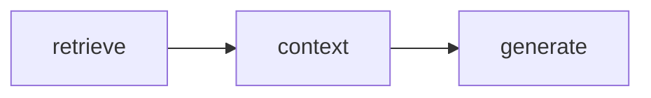
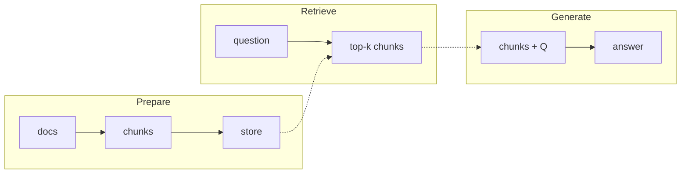
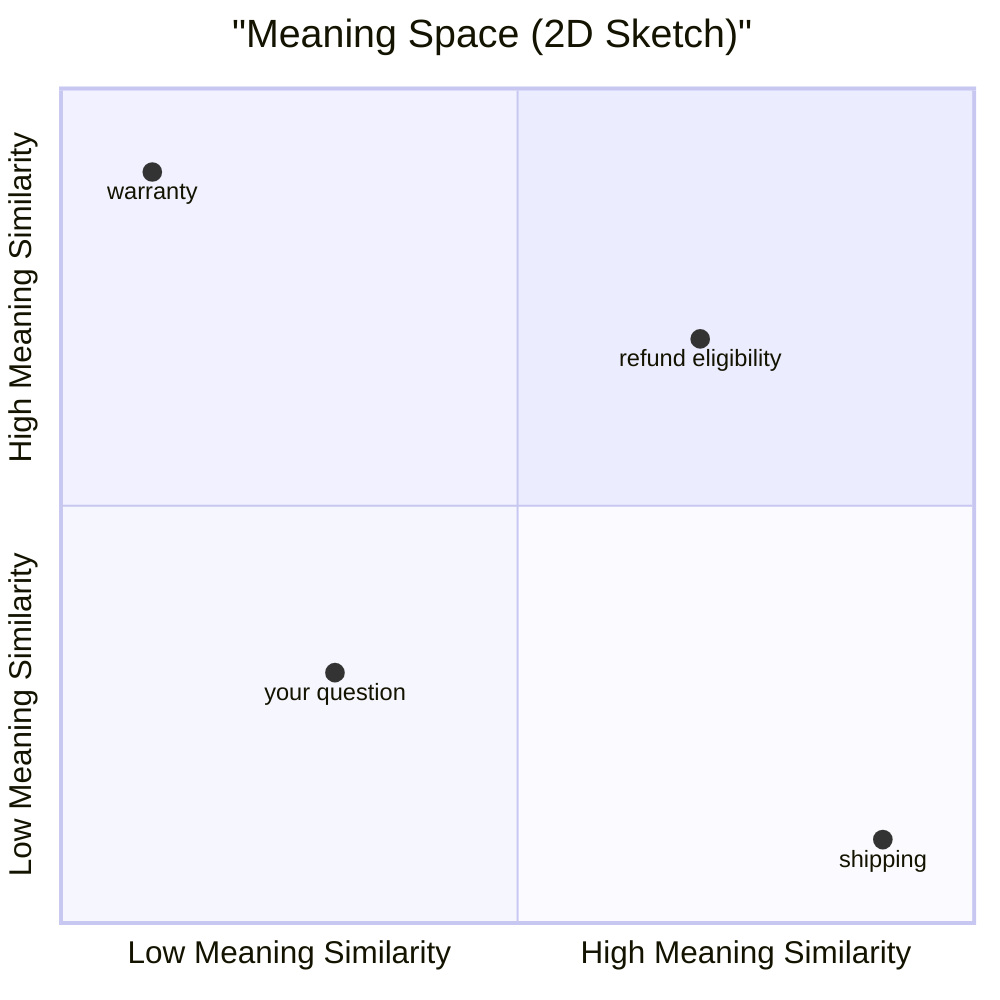
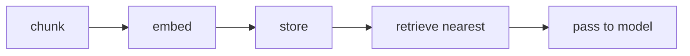
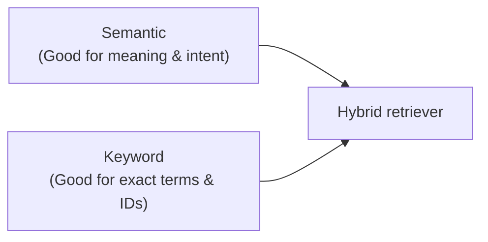

[00:00:05](https://www.udemy.com/course/claude-certified-architect-foundations-complete-course/learn/lecture/57042221#overview)


[00:00:15](https://www.udemy.com/course/claude-certified-architect-foundations-complete-course/learn/lecture/57042221#overview)

## Retrieval Augmented Generation (RAG)

- A pattern that helps an AI model answer questions using information that is not fully included in the prompt

### The Problem: You can't fit everything in the prompt

- Large organizations (like a hypothetical "ShopAssist") may have thousands of support articles, refund policies, shipping rules, product manuals, and incident reports
- Attempting to "stuff" all this documentation into a prompt doesn't scale because:
    - **Expensive**: Sending everything costs more per request
    - **Slow**: The model has to wade through too much text
    - **Context limits**: Sometimes the documentation simply won't fit
    - **Less focused**: The answer becomes diluted and vaguer




[00:00:28](https://www.udemy.com/course/claude-certified-architect-foundations-complete-course/learn/lecture/57042221#overview)


[00:00:52](https://www.udemy.com/course/claude-certified-architect-foundations-complete-course/learn/lecture/57042221#overview)

### The Solution: Adding a Retrieval Step

- RAG solves the scaling problem by adding a retrieval step before the generation step
- **[Why?]** Instead of giving the model everything, you first search for the most relevant pieces and send only those along with the user's question

#### Comparison: Without RAG vs. With RAG

| Approach | Process | Characteristics |
| --- | --- | --- |
| Without RAG | Dump all documentation into the prompt and hope the model finds the answer | Expensive, slow, unfocused |
| With RAG | Search first, then send only the most relevant chunks with the question | Cheaper, faster, grounded |


[00:00:57](https://www.udemy.com/course/claude-certified-architect-foundations-complete-course/learn/lecture/57042221#overview)


[00:01:07](https://www.udemy.com/course/claude-certified-architect-foundations-complete-course/learn/lecture/57042221#overview)

### The RAG Pipeline

- The workflow follows three distinct stages:

    1. **Prepare**

        - Documents are split into smaller chunks
        - These chunks are then stored in a searchable system
        - `docs` $\rightarrow$ `chunks` $\rightarrow$ `store`

    1. **Retrieve**

        - When a user question arrives, the system searches for the most relevant chunks
        - `question` $\rightarrow$ `top-k chunks`

    1. **Generate**

        - The retrieved chunks are placed into the prompt
        - The AI model (e.g., Claude) answers the question using that specific context
        - `chunks + Q` $\rightarrow$ `answer`




[00:01:28](https://www.udemy.com/course/claude-certified-architect-foundations-complete-course/learn/lecture/57042221#overview)


[00:01:46](https://www.udemy.com/course/claude-certified-architect-foundations-complete-course/learn/lecture/57042221#overview)

### Worked Example: Retrieving Context

- **User Question**: "Can I return a damaged item after 45 days?"
- **Retrieved Chunks**: The system pulls three specific pieces of relevant information to provide context:
    - Damaged-item return policy
    - Exception policy
    - Escalation instructions
- **Result**: Claude generates the final response using only these retrieved excerpts

### The Core Concept of RAG

- **[The Important Idea]** RAG does not magically make the model "know" your documents
    - It does not involve memorization or fine-tuning
    - Instead, it gives the model the right pieces of your documents at the right time
    - It provides relevant evidence, retrieved on demand, and placed into the prompt


[00:01:58](https://www.udemy.com/course/claude-certified-architect-foundations-complete-course/learn/lecture/57042221#overview)


[00:01:59](https://www.udemy.com/course/claude-certified-architect-foundations-complete-course/learn/lecture/57042221#overview)

### Search Option 1: Keyword

- Looks for exact words or close matches in the documents
- **[Strengths]** It is fast and performs very well when users use precise language:
    - Specific IDs (e.g., `INC12345`)
    - Product names
    - Error codes
- **[The Limitation]** It can miss the best results if the wording is different
    - If the user's phrasing doesn't match the document's phrasing, the search may fail to find the relevant context

| User Input | Document Text | Match? |
| --- | --- | --- |
| "Can I get my money back?" | "Customers may request a refund." | ❌ No |


[00:02:27](https://www.udemy.com/course/claude-certified-architect-foundations-complete-course/learn/lecture/57042221#overview)


[00:02:34](https://www.udemy.com/course/claude-certified-architect-foundations-complete-course/learn/lecture/57042221#overview)

### Search Option 2: Semantic

- Uses **embeddings** to find context based on meaning rather than just exact characters
- **[What is an embedding?]** A numerical representation of text meaning
    - The system converts both the question and the document chunks into these vectors
    - Similar meanings produce similar numbers, allowing the system to find matches even with different wording

#### How a Vector Database Works

- By representing text as vectors in a "meaning space," the system can calculate proximity between concepts



- **[The Workflow]**

    1. **Chunk**: Break documents into pieces
    2. **Embed**: Convert chunks into numerical vectors
    3. **Store**: Save vectors in a vector database
    4. **Retrieve Nearest**: When a question is asked, convert it to an embedding and find the closest vectors in the database
    5. **Pass to Model**: Send the most relevant chunks to the LLM


[00:02:58](https://www.udemy.com/course/claude-certified-architect-foundations-complete-course/learn/lecture/57042221#overview)

### Vector Databases and Semantic Matching

- **[The Mechanism]** Both the user's question and the document chunks are converted into vectors (lists of numbers)
    - The system compares these vectors to identify chunks with the most similar meaning
    - This allows a question like "Can I get my money back?" to match a document about "refund eligibility" despite having no overlapping words

```text
"refund eligibility"
→ [0.82, 0.10, 0.93, ...]

"Can I get my money back?"
→ [0.79, 0.14, 0.00, ...]

[Result: close]

"shipping delays"
→ [0.06, 0.88, 0.12, ...]

[Result: far]
```

- **Vector Databases**
    - Specialized storage systems optimized for handling and searching embeddings
    - Their primary purpose is to efficiently find the chunks that are mathematically closest in meaning to the user's query




[00:03:28](https://www.udemy.com/course/claude-certified-architect-foundations-complete-course/learn/lecture/57042221#overview)


[00:03:41](https://www.udemy.com/course/claude-certified-architect-foundations-complete-course/learn/lecture/57042221#overview)

### Search Option 3: Hybrid

- Combines semantic search and keyword search to cover more cases
- **[The logic]** Semantic search captures meaning and intent, while keyword search excels at finding exact terms and specific IDs



- **Example scenario**: "Why was order 12345 escalated?"
    - Semantic search grasps the intent of the question
    - Keyword search nails the exact order ID
    - The hybrid retriever merges both to return the strongest set of results


[00:03:58](https://www.udemy.com/course/claude-certified-architect-foundations-complete-course/learn/lecture/57042221#overview)


[00:04:17](https://www.udemy.com/course/claude-certified-architect-foundations-complete-course/learn/lecture/57042221#overview)

### Why Retrieval Matters Most

- **[The Core Principle]** RAG quality depends heavily on retrieval quality
    - If the retrieval step is flawed, the LLM's response will be flawed regardless of its reasoning capabilities
- **Consequences of poor retrieval**
    - **Wrong context**: The model may produce a confident but incorrect answer because it is working from the wrong information
    - **Incomplete context**: The model may miss critical details, such as important policy exceptions
- **[A Better Approach]** Shift the focus of evaluation
    - Instead of asking: "Can the model answer?"
    - Ask instead: "Did we retrieve the right evidence for the model to answer?"


[00:04:28](https://www.udemy.com/course/claude-certified-architect-foundations-complete-course/learn/lecture/57042221#overview)


[00:04:42](https://www.udemy.com/course/claude-certified-architect-foundations-complete-course/learn/lecture/57042221#overview)

### Practical Decisions in RAG Design

- Building an effective RAG system involves several key tuning decisions:
    - **Chunking strategy**: Determining how to split documents (e.g., by size, paragraph, heading, or semantic meaning)
    - **Retrieval quantity**: Deciding how many chunks to retrieve (top-k)
    - **Search type**: Choosing between vector, keyword, or hybrid search
    - **Reranking**: Reordering results before they are sent to the model
    - **Citations**: Deciding if the model should cite its retrieved sources
    - **Knowledge scope**: Defining which sources belong in the index


[00:04:58](https://www.udemy.com/course/claude-certified-architect-foundations-complete-course/learn/lecture/57042221#overview)


[00:05:13](https://www.udemy.com/course/claude-certified-architect-foundations-complete-course/learn/lecture/57042221#overview)

### When to Reach for RAG

- **[The Core Use Case]** RAG is useful when an application needs to answer questions using large or changing knowledge sources
    - Examples include:
        - Documentation
        - Policies
        - Support history
        - Contracts
        - Product catalogs
        - Internal reports
- **Key Advantages of the RAG Pattern**
    - **Scalability**: You don't have to send everything to the model at once
    - **Freshness**: Documents can be updated outside of the model's training cycle
    - **Control**: Answers are grounded in retrieved, specific sources


[00:05:28](https://www.udemy.com/course/claude-certified-architect-foundations-complete-course/learn/lecture/57042221#overview)

### ShopAssist Example: Applying RAG

- **[The Use Case]** Using RAG to answer support questions based on dynamic information
    - **Examples of knowledge sources**:
        - Latest return policies
        - Shipping rules
        - Warranty terms
        - Escalation procedures
- **[The Advantage]** The model does not need to memorize these policies
    - It only needs to be provided with the correct policy excerpts via retrieval


[00:05:58](https://www.udemy.com/course/claude-certified-architect-foundations-complete-course/learn/lecture/57042221#overview)