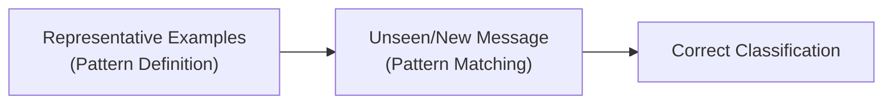
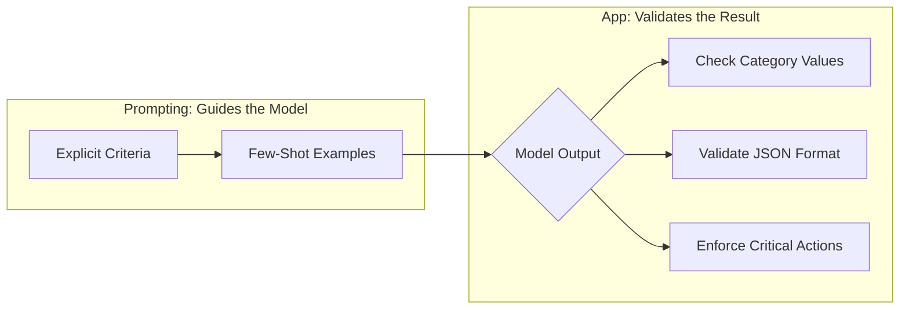

[00:00:00](https://www.udemy.com/course/claude-certified-architect-foundations-complete-course/learn/lecture/57042237#overview)

## Making Judgments

- Moving beyond simple instruction following to tasks that require decision-making
    - Examples of judgment tasks:
        - Is this a normal return?
        - Is the item damaged?
        - Is this a billing dispute?
        - Should this customer message be escalated?
- **[The Challenge]** These tasks are more difficult because they depend on boundaries
    - If boundaries are vague, Claude has to guess, which leads to inconsistent results


[00:00:56](https://www.udemy.com/course/claude-certified-architect-foundations-complete-course/learn/lecture/57042237#overview)

### The Problem with Vague Judgment

- "Be conservative" isn't a rule Claude can apply
    - A prompt can sound reasonable but still leave the actual decision undefined
    - Undefined words simply push the judgment back onto the model
- **[Example of Vague Prompting]**
    - `Classify this customer message. Be conservative. Only escalate serious cases.`
- **[Why this fails]** It leaves open questions that force the model to guess:
    - What does "conservative" mean?
    - What counts as a "serious case"?
    - Should an angry customer always be escalated, or only if they mention a legal, bank, or safety issue?


[00:00:58](https://www.udemy.com/course/claude-certified-architect-foundations-complete-course/learn/lecture/57042237#overview)

### The Fix: Explicit Criteria

- Replace vague judgment words with concrete triggers
    - Instead of using a subjective term like "escalate serious cases," you should list the exact conditions that qualify for that action
    - This ensures the boundary is explicit and the same input lands in the same bucket every time
    - By doing this, you (the human) define what "serious" means rather than leaving it to the model to decide

**[Example of Explicit Criteria]**

```text

# use escalation candidate ONLY when the customer:
- asks for a manager or human agent
- threatens legal action
- says they'll contact their bank or dispute the charge
- reports a safety concern
- is extremely upset and has a billing, legal, or policy issue
```


[00:01:27](https://www.udemy.com/course/claude-certified-architect-foundations-complete-course/learn/lecture/57042237#overview)


[00:01:29](https://www.udemy.com/course/claude-certified-architect-foundations-complete-course/learn/lecture/57042237#overview)


[00:01:43](https://www.udemy.com/course/claude-certified-architect-foundations-complete-course/learn/lecture/57042237#overview)

### ShopAssist Classification Example

To make the classification reliable, every category must have its own definition and a priority order to handle overlapping cases.

#### Category Definitions

| Category | Definition |
| --- | --- |
| normal_return | Standard policy return — no damage, billing, policy exception, or escalation trigger |
| damaged_item | Item arrived broken, defective, missing parts, or not working |
| billing_dispute | Incorrect, duplicate, or unauthorized charge, missing refund, or payment problem |
| policy_exception | A request outside standard policy, e.g., returning after the return window |
| escalation_candidate | Only when an escalation trigger is present (manager, legal, bank, safety...) |

#### Priority Order

- **[If multiple apply, use this priority]**:

    1. `escalation_candidate`
    2. `billing_dispute`
    3. `damaged_item`
    4. `policy_exception`
    5. `normal_return`

#### Full Classification Prompt Structure

```text
You are ShopAssist, a customer support classification assistant. Classify the message into exactly one category.

Categories:
- normal_return
    Wants to return under the standard policy — no damage, billing, policy exception, or escalation trigger.
- damaged_item
    Item arrived broken, defective, missing parts, or not working.
- billing_dispute
    Incorrect, duplicate, or unauthorized charge, missing refund, or payment problem.
- policy_exception
    A request outside standard policy, e.g., returning after the return window.
- escalation_candidate
    Use only when the message includes an escalation trigger:
    - asking for a manager / human agent
    - threatening legal action
    - contacting the bank / disputing charge
    - reporting a safety concern
    - extreme frustration + billing, legal, or policy issue

If multiple apply, use this priority:
1. escalation_candidate
2. billing_dispute
3. damaged_item
4. policy_exception
5. normal_return

Return only JSON:
{
  "category": "...",
  "reason": "..."
}
```


[00:01:58](https://www.udemy.com/course/claude-certified-architect-foundations-complete-course/learn/lecture/57042237#overview)


[00:02:14](https://www.udemy.com/course/claude-certified-architect-foundations-complete-course/learn/lecture/57042237#overview)

### Handling Overlapping Categories

- **[Why use priority?]** Because a single message can match multiple categories, creating ambiguity
    - A priority rule removes this ambiguity so the result is predictable
- **Example of overlap**:
        - **Customer Message**: "My package arrived damaged, and I was charged twice."
        - **Potential matches**: `damaged_item` or `billing_dispute`
        - **Result**: Based on the priority order, Claude classifies this as `billing_dispute` because it ranks higher than `damaged_item`

### Few-Shot Examples

- Sample cases included directly in the prompt
- **[Why use them?]** They perform two critical roles:

        1. **Teach the boundary**: They show the model exactly how to classify specific, nuanced cases
        2. **Lock the output**: They ensure the model follows the exact JSON shape and structure every time, reducing "format drift"

| Example Case | Classification | Reason/Logic |
| --- | --- | --- |
| "Wrong size, want to send it back." | normal_return | Standard return scenario |
| "Headphones arrived broken." | damaged_item | Item is defective |
| "Charged twice... I'll dispute with my bank." | escalation_candidate | Includes a dispute/legal trigger |


[00:02:28](https://www.udemy.com/course/claude-certified-architect-foundations-complete-course/learn/lecture/57042237#overview)


[00:02:42](https://www.udemy.com/course/claude-certified-architect-foundations-complete-course/learn/lecture/57042237#overview)

### The Role of Few-Shot Examples

- **[Two main jobs]**
    - **Teach the boundary**: Demonstrates how to classify specific, nuanced cases
    - **Lock the output**: Ensures the model follows the exact expected JSON shape and structure

### Preventing Format Drift

- **[What is format drift?]** When the model provides a reasonable answer but uses incorrect field names or structure, causing the application backend to fail
    - While a human can read different formats easily, application code relies on specific, consistent field names

| Type | Description | Example JSON |
| --- | --- | --- |

| **What the app expects** | The stable, required structure | \`\`\`json

{

  "category": "billing\_dispute",

  "reason": "A duplicate charge."

}

```javascript
|
| **Format drift** | A reasonable answer with wrong keys | ```json
{
  "intent": "billing",
  "confidence": "high"
}
``` |
```


[00:02:57](https://www.udemy.com/course/claude-certified-architect-foundations-complete-course/learn/lecture/57042237#overview)


[00:03:06](https://www.udemy.com/course/claude-certified-architect-foundations-complete-course/learn/lecture/57042237#overview)


[00:03:16](https://www.udemy.com/course/claude-certified-architect-foundations-complete-course/learn/lecture/57042237#overview)

### Reducing False Positives

- **[What is a false positive?]** When the system incorrectly flags a harmless message as something serious
    - **Example**: A customer saying "I do not like the color and want to return it"
    - This is a `normal_return` because there is no damage, billing issue, policy exception, or escalation trigger
- **[How to prevent it]** Provide examples that show where the boundary **isn't**
    - By showing cases that look like dissatisfaction but don't meet escalation criteria, you teach the model not to over-classify

```json
{
  "category": "normal_return",
  "reason": "Wants to return the item, but reports no damage, billing issue, policy exception, or escalation trigger."
}
```

| Feature | Status |
| --- | --- |
| No damage | ✅ |
| No billing issue | ✅ |
| No policy exception | ✅ |
| No escalation trigger | ✅ |


[00:03:27](https://www.udemy.com/course/claude-certified-architect-foundations-complete-course/learn/lecture/57042237#overview)


[00:03:37](https://www.udemy.com/course/claude-certified-architect-foundations-complete-course/learn/lecture/57042237#overview)

### Using Examples to Define Boundaries

- **[The goal]** Use few-shot examples to teach the model where a category's boundary *isn't* to prevent over-classification
    - This keeps false positives down by showing that normal dissatisfaction does not automatically equal an escalation

### Applying Explicit Criteria to Code Reviews

- **[The Problem with Vague Prompts]** Using undefined terms like "serious" in a code review prompt leads to noisy, low-value feedback
    - **Vague Prompt**: "Review this pull request, find serious issues. Be conservative."
    - **Resulting "Noise"**: Claude may flag non-critical items such as:
        - Naming preferences
        - Formatting changes
        - Subjective refactoring ideas
- **[The Fix]** Replace vague adjectives with explicit severity criteria to ensure the model only flags truly important issues


[00:04:20](https://www.udemy.com/course/claude-certified-architect-foundations-complete-course/learn/lecture/57042237#overview)

### Defining Severity Criteria for Code Reviews

- **[The Goal]** Replace vague terms like "serious" with explicit technical triggers to prevent the model from flagging low-value noise
- **[What to flag]** Issues that cause:
    - Incorrect behavior
    - Failed builds or tests
    - Security exposure
    - Data loss
    - Broken user workflows
    - Production errors
- **[What NOT to flag]** Avoid flagging:
    - Formatting preferences
    - Minor naming suggestions
    - Subjective refactoring ideas
    - Code that is acceptable but could be written differently

### Using Examples to Show Both Sides of a Boundary

- **[The Strategy]** Provide few-shot examples that include both a "real issue" and a "non-issue"
    - This teaches the model the exact edge of the category
    - Both examples should return the same JSON shape to ensure format consistency

| Type | Example Description | JSON Output |
| --- | --- | --- |

| **Real Issue** | Refund function processes a refund **before** verifying customer identity | \`\`\`json

{

  "severity": "critical",

  "should\_comment": true,

  "reason": "Financial action before customer verification."

}

```javascript
|
| **Not an Issue** | Variable renamed `customerInfo` $\rightarrow$ `customerProfile` | ```json
{
  "severity": "none",
  "should_comment": false,
  "reason": "A naming change, no correctness or security risk."
}
``` |
```


[00:04:29](https://www.udemy.com/course/claude-certified-architect-foundations-complete-course/learn/lecture/57042237#overview)


[00:04:41](https://www.udemy.com/course/claude-certified-architect-foundations-complete-course/learn/lecture/57042237#overview)

### Generalizing Through Representative Examples

- **[The Strategy]** Don't try to list every possible future case
    - Instead, provide enough representative examples to mark the boundary of a pattern
    - This allows the model to generalize to messages it has never seen before
- **[Example: ShopAssist]**
    - If the prompt includes examples for:
        - Duplicate charges
        - Missing refunds
        - Bank disputes
    - The model can correctly classify a new, unseen message like: *"My refund says completed, but the money never came back to my card."* $\rightarrow$ **billing\_dispute**




[00:04:58](https://www.udemy.com/course/claude-certified-architect-foundations-complete-course/learn/lecture/57042237#overview)


[00:05:01](https://www.udemy.com/course/claude-certified-architect-foundations-complete-course/learn/lecture/57042237#overview)

### The Practical Pattern for Reliable AI

- **[Prompting Guides]** Shapes the judgment
    - Use **explicit criteria** to define boundaries
    - Use **few-shot examples** to handle ambiguous cases
    - Use **examples** to keep the output format consistent
- **[The App Validates]** Enforces the guarantees
    - Prompting makes output *reliable*, but not *guaranteed*
    - **[Why validate?]** Because the backend must enforce hard limits that a model might occasionally miss
    - **Examples of backend enforcement:**
        - Ensuring a category is one of five specific allowed values
        - Verifying the response parses as valid JSON
        - Enforcing rules for real refund or account actions




[00:05:28](https://www.udemy.com/course/claude-certified-architect-foundations-complete-course/learn/lecture/57042237#overview)

### Summary of the Reliability Path

To achieve production-grade reliability, the strategy follows a two-layer approach:

1.  **The Prompting Layer (Guidance):** Uses **explicit criteria** to define boundaries, **few-shot examples** to resolve ambiguity and reduce false positives, and **formatting examples** to maintain structural consistency.
2.  **The Application Layer (Enforcement):** Acts as the final authority by validating that the model's output adheres to strict constraints (e.g., allowed categories and JSON schema) and by enforcing actual business logic for sensitive actions like refunds.

**Next Lesson:** Moving from guiding judgment to implementing **Structured Outputs**.