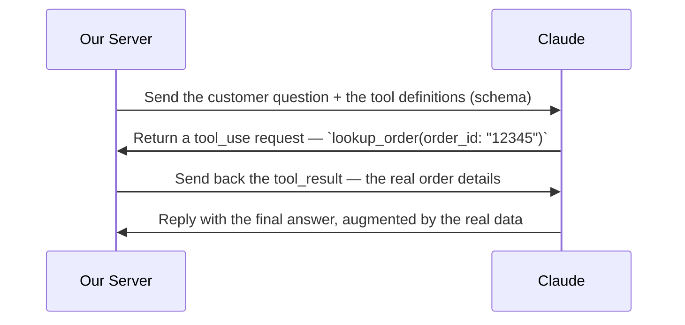
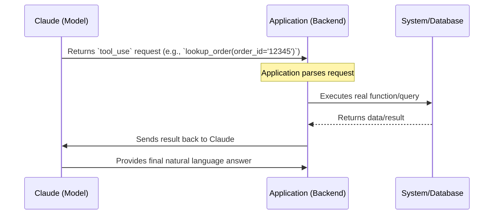
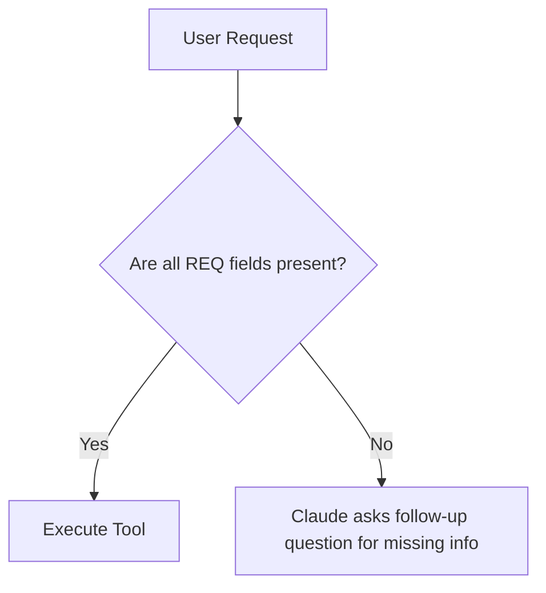
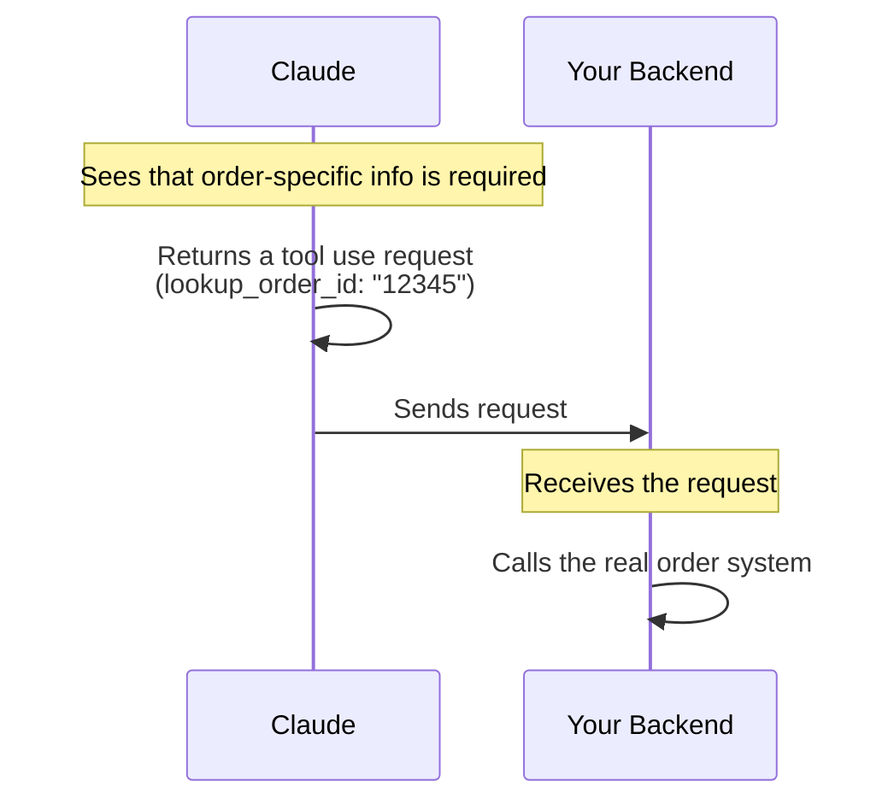

## Claude shouldn't invent answers it can't know

- Real support applications require access to **real backend data**
    - Simply reading messages and returning structured info is insufficient if the AI lacks the actual data (e.g., order eligibility)
- **[The Problem]** Claude must NOT guess or provide wrong answers
    - If a customer asks: "I want to return order 12345, is it still eligible?"
    - The model must look up the order, check the date, and check the policy rather than making it up
- **[The Solution]** Tool use serves as the bridge to real systems


[00:00:20](https://www.udemy.com/course/claude-certified-architect-foundations-complete-course/learn/lecture/57042243#overview)


[00:00:22](https://www.udemy.com/course/claude-certified-architect-foundations-complete-course/learn/lecture/57042243#overview)

### Tool Use Basics

- A tool is a function that your application exposes to Claude
    - Claude does not execute the function directly
    - Instead, Claude decides a tool should be called and returns a structured tool use request
- **[The Tool-Use Loop]** The process of bridging Claude to real backend data



- **[Server-side actions]** When a tool is requested, the server runs the actual logic
    - Example: `We run lookup_order() to fetch the real order`


[00:00:50](https://www.udemy.com/course/claude-certified-architect-foundations-complete-course/learn/lecture/57042243#overview)


[00:01:02](https://www.udemy.com/course/claude-certified-architect-foundations-complete-course/learn/lecture/57042243#overview)

### Responsibility in Tool Use

- The process is a shared responsibility between the AI and the application
    - **Claude's role**: Decides what information is needed
    - **Application's role**: Executes the tool safely and controls what Claude is allowed to access

### Example: `lookup_order` Tool

- A tool designed to retrieve specific order information via an ID
- **Input**:
    - `order_id` (string)
- **Output**: Returns details such as:
    - Whether the order exists
    - Items purchased
    - Delivery date
    - Return eligibility status

```python
tools = {
    "name": "lookup_order",
    "description": "Look up an order by order ID and return order details.",
    "input_schema": {
        "type": "object",
        "properties": {
            "order_id": {
                "type": "string",
                "description": "The customer's order ID."
            }
        },
        "required": ["order_id"]
    }
}
```


[00:01:32](https://www.udemy.com/course/claude-certified-architect-foundations-complete-course/learn/lecture/57042243#overview)

### Defining Tools via Schema

- Tools are described to Claude using a schema to ensure the model understands how to use them
- The schema provides critical metadata:
    - **Name**: The exact identifier Claude will use to call the tool
    - **Description**: Explains what the tool does and when it is useful
    - **Input Schema**: Defines the structure of the data the tool expects
        - **Type**: The data type of the input (e.g., `object`)
        - **Properties**: The specific fields the tool accepts
            - **Type**: The data type for each individual field (e.g., `string`)
            - **Description**: A clarification of what that specific field represents
        - **Required**: A list of fields that must be provided for the tool to function

```python
tools = {
    "name": "lookup_order",
    "description": "Look up an order by order ID and return order details.",
    "input_schema": {
        "type": "object",
        "properties": {
            "order_id": {
                "type": "string",
                "description": "The customer's order ID."
            }
        },
        "required": ["order_id"]
    }
}
```


[00:02:16](https://www.udemy.com/course/claude-certified-architect-foundations-complete-course/learn/lecture/57042243#overview)

### The Input Schema as a Contract

- The input schema defines the exact arguments Claude must provide when requesting a tool
- **[Why it matters]** It serves as a "contract" between the application and the model
    - If Claude wants to use a tool, it must provide arguments that match the specified shape and data types
- In the `lookup_order` example, the schema requires one field: `order_id` (string)

### Sending Tools to the API

- To enable tool use, the `tools` list (containing the tool definitions) is passed into the API call along with the customer's message

```python
tools = {
    "name": "lookup_order",
    "description": "Look up an order by order ID and return order details.",
    "input_schema": {
        "type": "object",
        "properties": {
            "order_id": {
                "type": "string",
                "description": "The customer's order ID."
            }
        },
        "required": ["order_id"]
    }
}

message = client.messages.create(
    model=model,
    max_tokens=500,
    tools=tools
)
```


[00:02:24](https://www.udemy.com/course/claude-certified-architect-foundations-complete-course/learn/lecture/57042243#overview)

### Inspecting the Tool Use Response

- When Claude determines a tool is needed, it won't provide a final answer immediately
    - Instead, it will return a request to call the specific tool
- **[Identifying a tool request]** You can distinguish a tool request from a standard text response by checking the `stop_reason` in the message object
        - A normal text response typically has a `stop_reason` of `end_turn`
        - A tool request will have a `stop_reason` of `tool_use`

```python
message = client.messages.create(
    model=model,
    max_tokens=500,
    tools=tools,
    messages=[
        {"role": "user", "content": "Can I return order 12345?"}
    ]
)

print(message.stop_reason)
print(message.content)
```

- The `message.content` will contain the details of the tool call, such as the tool name and the arguments to be used
        - For example, if Claude wants to look up an order, the content might include a `tool_use` block specifying the `order_id` to be used in the `lookup_order` tool


[00:02:55](https://www.udemy.com/course/claude-certified-architect-foundations-complete-course/learn/lecture/57042243#overview)

### The Tool Use Loop

- **[Crucial Distinction]** Claude does not actually call your database or execute any external code
    - Claude only produces a **structured request** (a `tool_use` block)
    - This request is essentially Claude saying: "I need you to call [tool\_name] with [these arguments]"
- **The Execution Responsibility**
    - Your application's backend is responsible for:

        1. Taking the structured request from Claude
        2. Calling the actual function/database
        3. Returning the result back to Claude




[00:03:21](https://www.udemy.com/course/claude-certified-architect-foundations-complete-course/learn/lecture/57042243#overview)


[00:03:23](https://www.udemy.com/course/claude-certified-architect-foundations-complete-course/learn/lecture/57042243#overview)

### Why Tool Use Matters

- **[The Problem]** Without tools, Claude can only answer based on the current conversation context
    - This can lead to "confident guesses" that are factually incorrect
    - Example: Claude might say "Yes, your order is probably eligible for return" based on tone, even if the actual order status says otherwise
- **[The Solution]** Tools allow Claude to ground its responses in real data
    - Instead of guessing, Claude can request to look up specific information first
    - The backend retrieves the actual status, making the application reliable and keeping sensitive actions under control

| Scenario | Claude's Behavior | Result |
| --- | --- | --- |
| Without Tools | Answers based only on conversation | Potentially wrong/hallucinated answers |
| With Tools | Requests to look up data first | Grounded in real-world facts |

> Claude can request a tool — but your code decides whether it actually runs.


[00:03:50](https://www.udemy.com/course/claude-certified-architect-foundations-complete-course/learn/lecture/57042243#overview)


[00:03:55](https://www.udemy.com/course/claude-certified-architect-foundations-complete-course/learn/lecture/57042243#overview)

### Designing Effective Tool Schemas

- **[The Goal]** To ensure Claude provides the correct arguments, schemas must be highly specific
- **Weak vs. Strong Schemas**
    - **Weak tools** are too vague, forcing Claude to guess what kind of information the tool expects or returns
    - **Strong tools** have a clear purpose, descriptive field names, and detailed descriptions of what the inputs should be

#### Example: Weak Tool Schema

```python
tools = [
    {
        "name": "query",
        "type": "string",
        "required": ["query"]
    }
]
```

*Note: This is weak because it doesn't explain what the query should be or what it returns.*

#### Example: Strong Tool Schema

```python
tools = [
    {
        "name": "lookup_order",
        "description": "Look up an order by order ID and return order details.",
        "input_schema": {
            "type": "object",
            "properties": {
                "order_id": {
                    "type": "string",
                    "description": "The customer's order ID."
                }
            },
            "required": ["order_id"]
        }
    }
]
```

- **Why this works:**
    - The `description` tells Claude exactly what the tool does
    - The `order_id` property has a clear name and a specific description, removing ambiguity about what value to pass


[00:04:22](https://www.udemy.com/course/claude-certified-architect-foundations-complete-course/learn/lecture/57042243#overview)

### Narrow Schemas and Required Fields

- **[The Pattern]** To maximize reliability, good tools should follow these principles:
    - Narrow (focused on a specific task)
    - Well-named
    - Clearly described
- **[The Risk]** Vague tools make tool use less reliable because Claude is forced to guess what they do or what they need.

#### Using Required Fields to Surface Gaps

- Required fields act as a contract that keeps Claude honest about missing information
- **[Why use them?]** If a tool requires specific inputs that the user hasn't provided, Claude shouldn't fabricate them; instead, it should ask a follow-up question to get the real data

**Example:&#32;`create_return_request`**

- This tool requires three specific fields:
    - `order_id` (REQ)
    - `item` (REQ)
    - `reason` (REQ)



- **The result of this approach:**
    - **Missing information becomes visible:** The gaps in the conversation are part of the contract
    - **Clearer boundaries:** It maintains a much cleaner separation between Claude's reasoning and your backend logic


[00:04:51](https://www.udemy.com/course/claude-certified-architect-foundations-complete-course/learn/lecture/57042243#overview)


[00:05:00](https://www.udemy.com/course/claude-certified-architect-foundations-complete-course/learn/lecture/57042243#overview)

### Automatic Tool Choice

- By default, Claude can decide whether or not to use a tool provided in the schema
- This is known as `auto` tool choice
    - Under `auto`, Claude can either provide a standard conversational response or request a tool call
    - **[Example]** If a user asks about a return policy, Claude might answer using its internal system instructions instead of triggering a tool

### Three Ways to Control Tool Use

| Mode | Description | API Implementation Example |
| --- | --- | --- |
| Default (auto) | Claude decides whether to answer normally or request a tool | "type": "auto" |
| Must Use One (any) | Claude must use a tool, but it can choose which one from the list | "type": "any" |
| Pinned (forced tool) | Claude is forced to use one specific tool every time | "type": "tool", "value": "lookup_order" |


[00:05:22](https://www.udemy.com/course/claude-certified-architect-foundations-complete-course/learn/lecture/57042243#overview)

### Use Cases for Tool Choice Modes

- **[Forced Tool Choice]** Best used when the application requires structured arguments as a mandatory step in a workflow.
    - **[Example]** If a specific step in your application is dedicated to data extraction, forcing a tool ensures Claude provides the necessary structured data instead of defaulting to a conversational response.
- **[Must Use One (any)]** Serves as a middle ground where Claude is required to trigger a tool call but retains the flexibility to select the most appropriate one from the available list.
- **[Automatic (auto)]** The standard behavior where Claude evaluates the context to decide between a conversational answer or a tool request.
    - **[Example]** If a user asks about a general return policy, Claude may answer using its internal knowledge; if they ask "Is order 12345 eligible for return?", Claude will trigger the `lookup_order` tool.


[00:05:52](https://www.udemy.com/course/claude-certified-architect-foundations-complete-course/learn/lecture/57042243#overview)


[00:06:11](https://www.udemy.com/course/claude-certified-architect-foundations-complete-course/learn/lecture/57042243#overview)

### ShopAssist Example: The First Step

- **Scenario:** A customer initiates a return request due to damaged packaging.
    - **Customer Input:** "hi, I want to return order 12345. It arrived yesterday, but the box was damaged."
- **The Handoff Process:**




[00:06:22](https://www.udemy.com/course/claude-certified-architect-foundations-complete-course/learn/lecture/57042243#overview)

### The Foundation of Multi-Step Workflows

While a single interaction focuses on the initial order lookup, a complete assistant workflow typically evolves through several distinct stages:

1. **Order Lookup:** Identifying the specific transaction details.
2. **Policy Verification:** Checking the retrieved order data against return policies.
3. **Action Execution:** Formally creating the return request in the system.

The lookup step serves as the essential foundation for these subsequent automated actions.


[00:06:52](https://www.udemy.com/course/claude-certified-architect-foundations-complete-course/learn/lecture/57042243#overview)

### Tools as a Structured Interface

- A tool is not Claude directly accessing your database
    - Instead, it is a structured interface exposed by your application
    - Claude **requests** the tool call, but your backend **executes** it
- **[The Division of Labor]**

| Claude's Side (Guides & Structures) | Your Backend's Side (Executes & Enforces) |
| --- | --- |
| Prompt instructions guide behavior | Runs the real function |
| Tool schemas structure the requests | Validates permissions & business rules |
| Returns a tool_use block | Handles errors, decides what's safe to return |

- **[Key Principle]** Deterministic business logic should always stay in your code, not in the prompt. Prompts and schemas are for guiding Claude's requests, but the backend remains the ultimate authority for validation and security.


[00:07:21](https://www.udemy.com/course/claude-certified-architect-foundations-complete-course/learn/lecture/57042243#overview)

### Summary: Tools as a Structured Interface

- Tools are not a direct connection from Claude to a database
    - Instead, they act as a structured interface exposed by the application
- **The division of labor:**

| Claude's Side (Guides & Structures) | Your Backend's Side (Executes & Enforces) |
| --- | --- |
| Prompt instructions guide behavior | Runs the real function |
| Tool schemas structure the requests | Validates permissions & business rules |
| Returns a tool_use block — never executes | Handles errors, decides what's safe to return |

- **Key Takeaways:**
        - Claude only **requests** the tool call
        - The backend is responsible for the actual **execution** and enforcing all guarantees (permissions, rules, error handling)