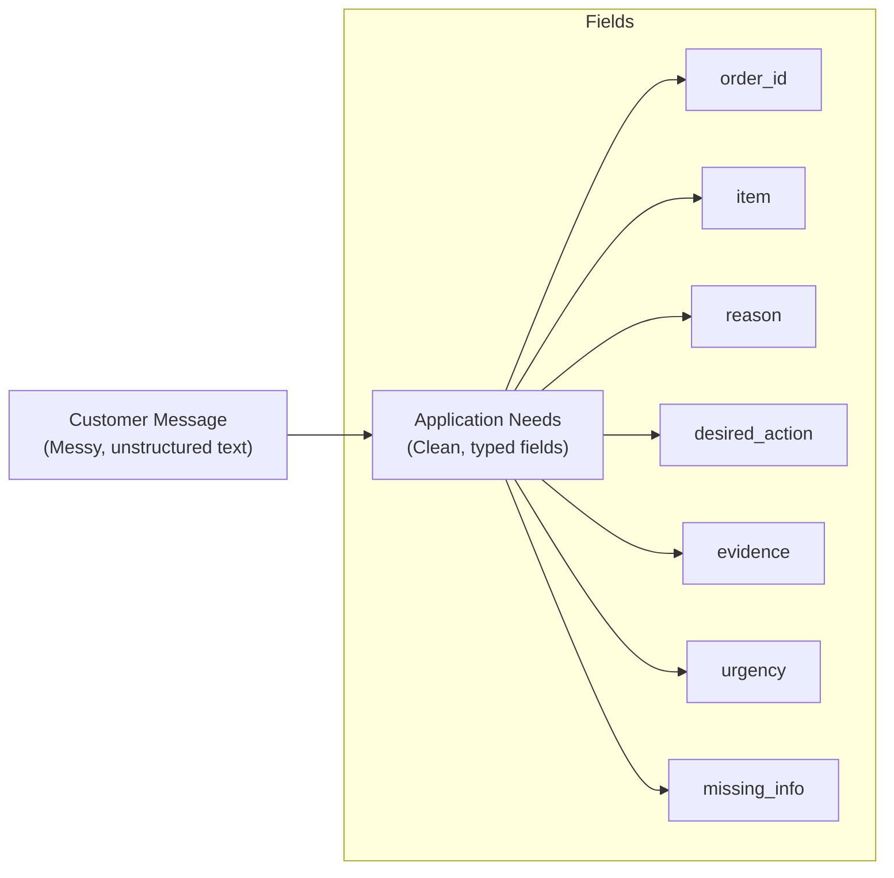

## Structured Outputs

- Transitioning from basic tool use to one of the most common production use cases: reliable structured output
- **[The Goal]** To transform a messy customer message into data that code can trust
    - Example messy message: "I got my shoes yesterday and they're scratched. I don't know if I can return them, but I want a replacement."
- **[The Transformation]** Converting unstructured human language into structured application needs




[00:00:22](https://www.udemy.com/course/claude-certified-architect-foundations-complete-course/learn/lecture/57042253#overview)

### Approaches to Structured Output

- **[Beginner Approach]** Prompting the model to "return only valid JSON"
    - **[Why it's unreliable]** It is not robust enough for production because the model might:
            - Add extra conversational text around the JSON
            - Forget a comma
            - Use the wrong format
            - Invert a field
- **[Reliable Approach]** Using `tool_use` + input schema
    - **[Why it works]** It produces a structured tool call that strictly follows the provided schema, preventing the model from writing free-text JSON.


[00:00:52](https://www.udemy.com/course/claude-certified-architect-foundations-complete-course/learn/lecture/57042253#overview)


[00:01:20](https://www.udemy.com/course/claude-certified-architect-foundations-complete-course/learn/lecture/57042253#overview)


[00:01:49](https://www.udemy.com/course/claude-certified-architect-foundations-complete-course/learn/lecture/57042253#overview)

### The Problem with Prompt-Based JSON

- **[The Weakness]** When the structure exists only in the prompt instructions, the model has to infer the fields
    - This makes the application dependent on text formatting
    - If the response is not valid JSON, the application's parser may fail

### Defining Structure via Tool Use

- Instead of raw prompting, define the required structure as a tool
- **[Example Tool Configuration]**
    - **Tool Name**: `extract_return_request`
    - **Description**: "Extract a structured return request from a customer support message."
    - **Input Schema**: Defines the exact properties and types required

```python

# Example of a tool definition with an input schema
tools = {
    "name": "extract_return_request",
    "description": "Extract a structured return request from a customer support message.",
    "input_schema": {
        "type": "object",
        "properties": {
            "order_id": {
                "type": "string",
                "description": "The customer's order ID, or null if not provided."
            },
            "item": {
                "type": "string",
                "description": "The item the customer wants to return or replace."
            },
            "reason": {
                "type": "string",
                "enum": [
                    "normal_return",
                    "damaged_item",
                    "billing_dispute",
                    "policy_exception",
                    "unclear",
                    "other"
                ]
            }
        }
    }
}
```


[00:02:05](https://www.udemy.com/course/claude-certified-architect-foundations-complete-course/learn/lecture/57042253#overview)

### Schema Design: Required vs. Nullable

- **[Key Distinction]** There is a difference between a field being mandatory in the structure and the value being mandatory in the content
    - **Required**: The field *must* exist in the JSON object
    - **Nullable**: The value of that field can be `null` if the information is missing
- **[Why this matters]** Using this combination prevents the model from "inventing" data to satisfy a requirement
    - Instead of hallucinating an `order_id`, the model can safely return `"order_id": null`

```python

# Example of schema design for reliability
"input_schema": {
    "type": "object",
    "properties": {
        "order_id": {
            "type": ["string", "null"],
            "description": "The customer's order ID, or null if not provided."
        },
        "item": {
            "type": ["string", "null"],
            "description": "The item the customer wants to return or replace."
        },
        "reason": {
            "type": "string",
            "enum": [
                "normal_return",
                "damaged_item",
                "billing_dispute",
                "policy_exception",
                "unclear",
                "other"
            ]
        }
    },
    "required": [
        "order_id",
        "item",
        "reason"
    ]
}
```


[00:02:24](https://www.udemy.com/course/claude-certified-architect-foundations-complete-course/learn/lecture/57042253#overview)

### Advanced Schema Design Strategies

- **Using Enums for Categorization**
    - Restricts the model to a specific set of allowed values
    - **[Why?]** Prevents the model from generating random or inconsistent labels (e.g., generating "product issue" when the system expects "damaged\_item")
- **Handling Ambiguity**
    - Include an `unclear` value within the enum
    - **[Why?]** Instead of forcing the model to make a bad classification on an ambiguous message, it can explicitly signal that the intent is not understood
- **The "Other + Detail" Pattern**
    - Include an `other` option in the enum
    - Pair it with a nullable detail field (e.g., `reason_detail`)
    - **[Why?]** Allows the model to capture information that doesn't fit existing categories while still providing the necessary context via the detail field

```python
"reason": {
    "type": "string",
    "enum": [
        "normal_return",
        "damaged_item",
        "billing_dispute",
        "policy_exception",
        "unclear",
        "other"
    ],
    "description": "The main reason for the request."
},
"reason_detail": {
    "type": ["string", "null"],
    "description": "Extra detail when reason is other or unclear."
}
```


[00:03:19](https://www.udemy.com/course/claude-certified-architect-foundations-complete-course/learn/lecture/57042253#overview)

### Forcing Structured Output with `tool_choice`

- Use `tool_choice` to mandate that the model uses a specific tool
    - This forces the model to return a `tool_use` block instead of a standard text response

```python
message = client.messages.create(
    model=model,
    max_tokens=500,
    temperature=0,
    tools=tools,
    tool_choice={"type": "tool", "name": "extract_return_request"},
    messages=[
        {
            "role": "user",
            "content": """I got my shoes yesterday and they are scratched. I want a replacement. I can send a photo if needed."""
        }
    ]
)
```

### Extracting and Using Structured Data

- The response contains a `tool_use` block that can be parsed into a Python dictionary
- **[How to extract]**

```python
tool_use = next(
      block for block in message.content
      if block.type == "tool_use"
  )
  structured_data = tool_use.input
  print(structured_data)
```

- **[Practical Applications]**
    - Save the extracted data directly to a database
    - Route requests to specific automated workflows
    - Programmatically ask the customer for missing information
    - Trigger escalations based on specific reasons or urgency levels

```python

# Example output of structured_data
{
    'order_id': None,
    'item': 'shoes',
    'reason': 'damaged_item',
    'reason_detail': None,
    'desired_action': 'replacement',
    'desired_action_detail': None,
    'evidence_provided': False,
    'urgency': 'normal',
    'missing_information': ['order_id']
}
```


[00:03:43](https://www.udemy.com/course/claude-certified-architect-foundations-complete-course/learn/lecture/57042253#overview)


[00:04:06](https://www.udemy.com/course/claude-certified-architect-foundations-complete-course/learn/lecture/57042253#overview)

### Forcing Tool Selection

- The `tool_choice` setting determines how the model decides to use a tool
- **[Why use forced selection?]** In structured extraction workflows, you often want a tool-use block instead of a conversational text response every single time

```python
message = client.messages.create(
    model=model,
    max_tokens=500,
    temperature=0,
    tools=tools,
    tool_choice={
        "type": "tool",
        "name": "extract_return_request"
    },
    messages=[
        {"role": "user", "content": "Extract the return request from this customer message."}
    ]
)
```

### The Limits of Schema Validation

- A strict schema is effective at preventing syntax and formatting errors
    - Ensures the output contains all expected fields
    - Validates that enum values belong to the allowed list
    - Ensures missing information follows the defined format (e.g., an array)
- **[The Critical Limitation]** Schemas do not guarantee semantic correctness
    - A schema controls the **shape** of the answer (structure)
    - Instructions, criteria, and examples control the **quality** of the decision (meaning)

| Aspect | Controlled by Schema? | What it ensures | Example |
| --- | --- | --- | --- |
| Structure | Yes | Shape and format | Correct fields, valid enums, correct types |
| Judgment | No | Semantic meaning | The model's reasoning and accuracy of the choice |


[00:05:04](https://www.udemy.com/course/claude-certified-architect-foundations-complete-course/learn/lecture/57042253#overview)

### Solving the Judgment Problem

- Tool use and schemas solve the **structure problem**, but not the **judgment problem**
    - **[The Problem]** A model might follow the schema perfectly but make an incorrect semantic choice (e.g., marking an item as "high urgency" when the text doesn't justify it, or picking "normal return" when it should be "damaged item")
- **[The Solution]** To ensure high-quality decisions, you must combine schemas with:
    - Good prompt instructions
    - Explicit criteria
    - Examples
    - Evaluation tests

| Aspect | Role | Focus |
| --- | --- | --- |
| Structure | Schema / Tool Use | Controls the shape of the answer |
| Judgment | Instructions / Criteria / Examples | Controls the quality of the decision |

### Normalization Rules

- Even with a good schema, add normalization rules to the prompt to keep output consistent and reduce false positives
- **[Example Rules]**
    - If the order ID is missing, use `null`. Do not invent one.
    - If the customer offers a photo later, `evidence_provided` is `false`.
    - Use `urgency: high` only for a deadline, repeated failed attempts, or business-critical impact.
    - Use `unclear` when the message lacks enough information.
    - Use `other` only when none of the listed enum values fit.


[00:05:14](https://www.udemy.com/course/claude-certified-architect-foundations-complete-course/learn/lecture/57042253#overview)

### The Importance of Consistency

- Normalization rules make structured output more **consistent** and **reduce false positives**
- **[Why it matters]** In production applications (like ShopAssist), extracted data often drives automated workflow decisions
    - Incorrect data leads to incorrect routing

#### Workflow Routing Examples

| Extracted Data | Resulting Workflow |
| --- | --- |
| damaged_item | Goes to the replacement workflow |
| billing_dispute | Goes to the billing team |
| policy_exception | Requires escalation |
| order_id = null | Triggers a follow-up question instead of a return authorization |


[00:06:32](https://www.udemy.com/course/claude-certified-architect-foundations-complete-course/learn/lecture/57042253#overview)

### Demo Summary: Free-form JSON vs tool\_use

| Approach | Characteristics |
| --- | --- |
| Free-form JSON | Simple, yet fragile; depends on text formatting and can break parsing |
| tool_use + JSON schema | Structured by construction; gives a structured tool input your application can extract directly |

- **[Key Reminder]** Schemas improve reliability, but they **don't replace good instructions**
- **[Handling Missing Data]** Use nullable fields so that if an order ID is missing, Claude returns `null` instead of a fabricated value

### Summary: When and How to Use Structured Output

#### When: Reach for tool use + JSON schemas

- Use this whenever your application needs **reliable structured output**

#### How: The Schema (Strict, yet practical)

- Combine **required fields**, **nullable values**, **enums**, and **unclear / other** as a default field

#### How: Control (Use `tool_choice`)

- Decide whether Claude **may** use a tool, **must** use one, or **must use one specific** tool

> **Core Principle:** Structure comes from the schema; judgment still comes from your instructions, criteria, examples, and evals.


[00:06:44](https://www.udemy.com/course/claude-certified-architect-foundations-complete-course/learn/lecture/57042253#overview)

### Summary: When and How to Use Structured Output

- **When to use tool use + JSON schemas**
    - Use whenever your application requires reliable structured output
- **How: The Schema (Strict, yet practical)**
    - Combine `required` fields, `nullable` values, `enums`, and `unclear / other + detail` fields
    - This approach makes the schema both strict enough for parsing and practical enough for real-world data ambiguity
- **How: Control (`tool_choice`)**
    - Use `tool_choice` to decide Claude's behavior:
        - `may use a tool` (optional)
        - `must use a tool` (enforced tool use)
        - `must use one specific tool` (forced specific tool selection)

> Structure comes from the schema - judgment still comes from your instructions, criteria, examples, and evals.