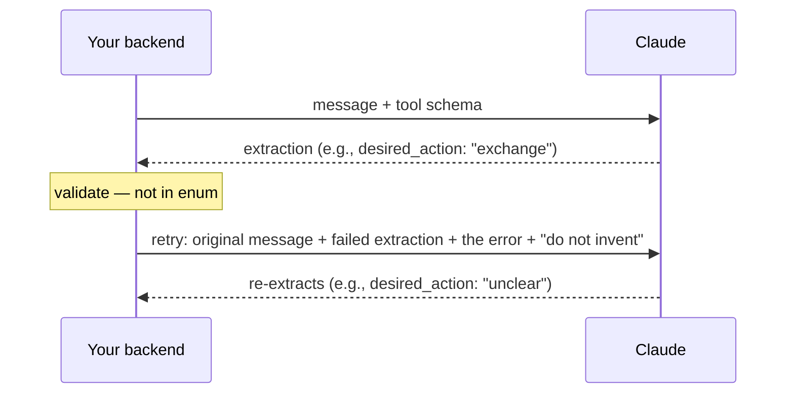
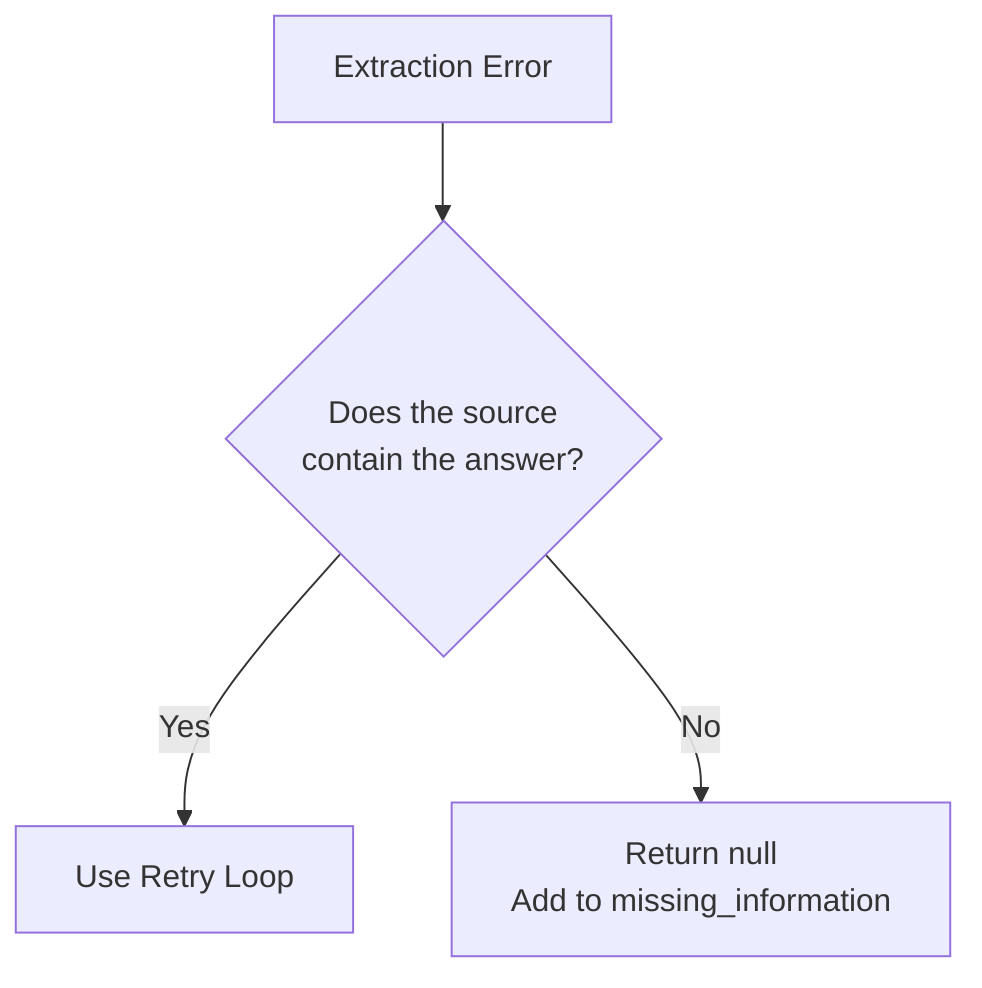
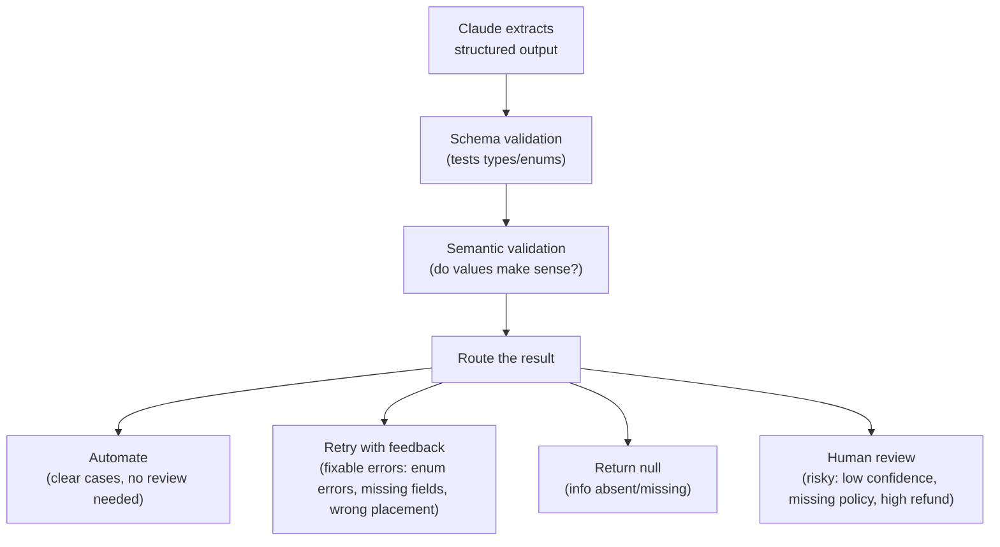

[00:00:00](https://www.udemy.com/course/claude-certified-architect-foundations-complete-course/learn/lecture/57042263#overview)

## Validation & Reliability

- **[The Distinction]** Structured output $\neq$ correct output
    - Using JSON schema makes the output easier for applications to parse
    - However, the model can still:
        - Extract the wrong value
        - Pick the wrong enum
        - Miss a contradiction
        - Infer information that was never in the source
- **[The Solution]** Production systems need validation after the model returns output
    - There are two important types of validation

### Schema Validation: The Shape

- Checks the structural integrity of the output
    - Are all required fields present?
    - Are the types correct?
    - Are the enum values valid?
- **Example of a schema validation failure:**
    - `desired_action` must be `refund`, `replacement`, `store_credit`, or `unclear`
    - If Claude returns `exchange`, schema validation catches it


[00:00:43](https://www.udemy.com/course/claude-certified-architect-foundations-complete-course/learn/lecture/57042263#overview)

### Semantic Validation: The Meaning

- Checks whether the extracted values actually make sense in the context of the source text
    - Even if the JSON structure is perfectly valid, the content can be wrong
    - **Example of a semantic failure:**
        - Customer message: "I want a replacement"
        - Claude extracts: `desired_action: refund`
        - This is a meaning problem, not a JSON problem


[00:01:29](https://www.udemy.com/course/claude-certified-architect-foundations-complete-course/learn/lecture/57042263#overview)


[00:01:41](https://www.udemy.com/course/claude-certified-architect-foundations-complete-course/learn/lecture/57042263#overview)


[00:01:53](https://www.udemy.com/course/claude-certified-architect-foundations-complete-course/learn/lecture/57042263#overview)


[00:02:12](https://www.udemy.com/course/claude-certified-architect-foundations-complete-course/learn/lecture/57042263#overview)

### The Retry Loop

- **[The Core Principle]** A good retry is specific, not just "try again"
    - A weak retry provides no new information, leading the model to repeat the same mistake
    - A strong retry includes:
        - The original customer message
        - The failed extraction
        - The exact validation error
        - A constraint to not invent missing information
- **[The Retry Process]** How the backend interacts with the model to correct errors



- **[Example of a Specific Retry Instruction]**
    - Instead of a generic request, provide detailed feedback:

    > Feedback: `desired_action` must be one of `refund` / `replacement` / `store_credit` / `unclear`. You returned `exchange`. Re-extract the return request from the original message. Use `unclear` if the `desired_action` is ambiguous. Do not invent missing information.


[00:02:15](https://www.udemy.com/course/claude-certified-architect-foundations-complete-course/learn/lecture/57042263#overview)


[00:02:55](https://www.udemy.com/course/claude-certified-architect-foundations-complete-course/learn/lecture/57042263#overview)

### The Limits of the Retry Loop

- **When retries help (Fixable Mistakes)**
    - Retries work best when the source contains the right information, but Claude placed it incorrectly or used the wrong format
    - Examples of fixable mistakes:
        - A wrong enum value
        - A missing required field
        - Wrong field placement
        - A structural mismatch
- **When retries do not help (Information is Absent)**
    - If the customer never provided the information (e.g., an order ID), the correct behavior is **not** to retry until Claude guesses one
    - Instead, the correct behavior is:
        - Return `null` for the missing field
        - Add the field to `missing_information`
    - **The Golden Rule:** Retry when the model made a fixable extraction mistake; do not retry when the source does not contain the answer.



### Handling Contradictions

- **[The Problem]** Sometimes a message contains conflicting intent (e.g., "I want a refund, but if possible, just send me another one")
    - Both refund and replacement are requested simultaneously
- **[The Solution]** Flag a conflict instead of forcing one answer
    - It is safer to flag the conflict than to pretend the request is clear
- **Example Contradiction Schema:**
    - `desired_action`: `unclear`
    - `conflict_detected`: `true`
    - `conflict_reason`: `mentions both`

---

### Anatomy of a Production-Ready Prompt

- In production, a prompt is rarely just one sentence; it is composed of several clear parts
- **Key Components of a Structured Prompt:**

    1. **Task:** What should Claude do?
    2. **Context:** What information does Claude need to answer correctly?
    3. **Rules:** What should Claude always do? What should it never do?
    4. **Input:** The actual data (e.g., the customer message)
    5. **Output Format:** How should the response look? (e.g., plain text, JSON, classification)
    6. **Success Criteria:** What does a good answer look like?

- This structure makes the prompt much easier for the model to follow reliably.


[00:03:27](https://www.udemy.com/course/claude-certified-architect-foundations-complete-course/learn/lecture/57042263#overview)

### Handling Contradictions

- **[Flag, Don't Force]** When a customer message contains conflicting intents, do not force the model to pick one
    - **Example:** A user says, "I want a refund, but if possible, just send me another one"
    - **Recommended Schema Approach:**
        - `desired_action: unclear`
        - `conflict_detected: true`
        - `conflict_reason: "mentions both refund and replacement"`
    - This is safer than pretending the request is clear and potentially making a wrong decision

### Deterministic Verification for Numbers

- Use a pattern of comparing different sources of truth to ensure accuracy
- **[Example: Receipt Totals]** Separate what the document claims from what the math says
    - `stated_total`: What the document explicitly says
    - `calculated_total`: What your code calculates by summing the line items
- **[Handling Mismatches]** If these values do not match, use a flag to trigger human review:
    - `conflict_detected: true`
    - This allows the model to extract the data while letting deterministic code handle the verification logic.


[00:03:43](https://www.udemy.com/course/claude-certified-architect-foundations-complete-course/learn/lecture/57042263#overview)


[00:03:52](https://www.udemy.com/course/claude-certified-architect-foundations-complete-course/learn/lecture/57042263#overview)


[00:04:11](https://www.udemy.com/course/claude-certified-architect-foundations-complete-course/learn/lecture/57042263#overview)


[00:04:14](https://www.udemy.com/course/claude-certified-architect-foundations-complete-course/learn/lecture/57042263#overview)

### Analyzing Mistakes with Pattern Detection

- Use a `detected_pattern` field to help surface and analyze false positives
    - This field captures the specific reasoning or evidence used for a classification
    - **Example:**
        - `detected_pattern`: `damaged_item`
        - `pattern_evidence`: `"the left side does not work"`
- **[Why use it?]** If a system (e.g., ShopAssist) repeatedly misclassifies normal returns as damaged, this field reveals exactly which words or phrases are causing the mistake, making it easier to refine prompts or logic.


[00:04:39](https://www.udemy.com/course/claude-certified-architect-foundations-complete-course/learn/lecture/57042263#overview)


[00:05:10](https://www.udemy.com/course/claude-certified-architect-foundations-complete-course/learn/lecture/57042263#overview)

### Field-Level Confidence

- **[Granularity]** Confidence should be assigned to each individual field rather than providing one single global score for the entire extraction
    - Different fields have different levels of certainty; for example, an `order_id` might be obvious (high confidence), while the `desired_action` might be ambiguous (low confidence)
- **Example of field-level scores:**
    - `order_id_confidence: high`
    - `item_confidence: high`
    - `reason_confidence: medium`
    - `desired_action_confidence: low`

### Calibrating Confidence

- **[The Risk]** A model can be "confidently wrong"
    - High confidence does not inherently mean high accuracy
- **[Calibration Process]** Use a labeled validation set to ensure confidence scores are meaningful
    - Collect examples where the correct extraction is already known
    - Run the system and measure how often fields with high confidence are actually correct
- **[Granular Accuracy Measurement]** Avoid relying on a single accuracy number, as it hides specific weaknesses
    - Measure accuracy **by document type** (e.g., checking if performance drops on receipts vs. plain text messages)
    - Measure accuracy **by field** (e.g., identifying if the model struggles specifically with extracting dates or amounts)


[00:05:14](https://www.udemy.com/course/claude-certified-architect-foundations-complete-course/learn/lecture/57042263#overview)

### Human Review Routing

- **[The Goal]** Automate clear cases and escalate risky ones
    - Do not send every case to a human; use the system to filter for high-certainty tasks
- **When to route to a human:**
    - Confidence is low
    - `conflict_detected` is `true`
    - Required information is missing
    - The customer asks for a policy exception
    - The refund amount is high
    - The extracted request contradicts business rules

### Stratified Sampling

- **Definition:** Reviewing a sample of outputs across high, medium, and low confidence groups
    - **[Why use it?]** High confidence does not guarantee correctness
    - **[Purpose]** Sampling across all levels helps catch hidden systematic errors that might be missed if only low-confidence cases are reviewed


[00:05:59](https://www.udemy.com/course/claude-certified-architect-foundations-complete-course/learn/lecture/57042263#overview)


[00:06:09](https://www.udemy.com/course/claude-certified-architect-foundations-complete-course/learn/lecture/57042263#overview)

### The Validation Layer

- **[Core Principle]** Claude extracts — your application validates
    - The LLM is responsible for the extraction, but the backend code is responsible for ensuring that extraction meets business requirements
- **[Error Categorization]** Different errors require different recovery strategies:
        - **Fixable (Retryable):** When the model returns a value that is not in the allowed list (e.g., an invalid `desired_action`)
        - **Absent (Do not invent):** When required information like an `order_id` is missing
                - **[Rule]** Never ask the model to invent missing data; instead, flag it as missing information
        - **Risky (Human Review):** When the extraction is fundamentally unreliable
                - `conflict_detected` is `true`
                - `desired_action_confidence` is `low`

```python
def validate_return_request(extraction):
    errors = []
    allowed = ("refund", "replacement", "store_credit", "unclear")

# fixable - can be retried
    if extraction["desired_action"] not in allowed:
        errors.append("desired_action invalid")

# absent - do not invent
    if extraction["order_id"] is None:
        extraction["missing_information"].append("order_id")

# risky - require human review
    if extraction["conflict_detected"] or extraction["desired_action_confidence"] == "low":
        extraction["human_review_required"] = True

    return errors, extraction
```


[00:06:43](https://www.udemy.com/course/claude-certified-architect-foundations-complete-course/learn/lecture/57042263#overview)


[00:06:54](https://www.udemy.com/course/claude-certified-architect-foundations-complete-course/learn/lecture/57042263#overview)


[00:07:07](https://www.udemy.com/course/claude-certified-architect-foundations-complete-course/learn/lecture/57042263#overview)

### The Validation Pipeline

- **Core Architecture:** Claude extracts $\rightarrow$ your application validates
    - The validation layer can include schema libraries, business rules, database checks, policy checks, and review queues
- **Routing Logic:** Based on the type of validation error, the system should route the result accordingly:



### Lesson Summary: Making Extractions Reliable

- **Two Types of Validation**
    - **Schema validation:** Checks if the output has the correct shape/structure
    - **Semantic validation:** Checks if the extracted values actually make sense in context
- **Error Recovery Strategies**
    - **Retry loops:** Use for fixable issues like wrong enum values, missing fields, or incorrect placement
    - **Never retry to force missing data:** If information is absent, return null or mark it as missing instead of asking the model to invent it
    - **Human Review:** Escalate when there are conflicts or low confidence scores
- **The Throughline**
    - Extract return requests, validate them, retry when appropriate, and escalate low-confidence or contradictory cases instead of blindly automating.


[00:07:30](https://www.udemy.com/course/claude-certified-architect-foundations-complete-course/learn/lecture/57042263#overview)

### Advanced Observability & Reliability Metrics

- **Observability Fields for Debugging**
    - **Conflict Detection:** Implement fields like `conflict_detected` or compare `calculated_total` vs `stated_total` to surface internal inconsistencies.
    - **Pattern Detection:** Use a `detected_pattern` field to surface recurring issues or specific types of extraction failures.
- **Confidence & Quality Management**
    - **Field-Level Confidence:** Assign confidence scores to individual pieces of data rather than a single global score.
    - **Confidence Calibration:** Ensuring the model's reported confidence aligns with actual accuracy.
    - **Stratified Sampling:** Using specific sampling methods to evaluate model performance across different data distributions or edge cases.
- **The Shop Assist Workflow Recap**
    - Extract return requests $\rightarrow$ validate $\rightarrow$ retry (for fixable errors) $\rightarrow$ escalate (for low-confidence or contradictory cases).