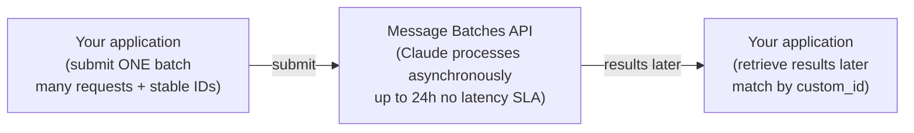
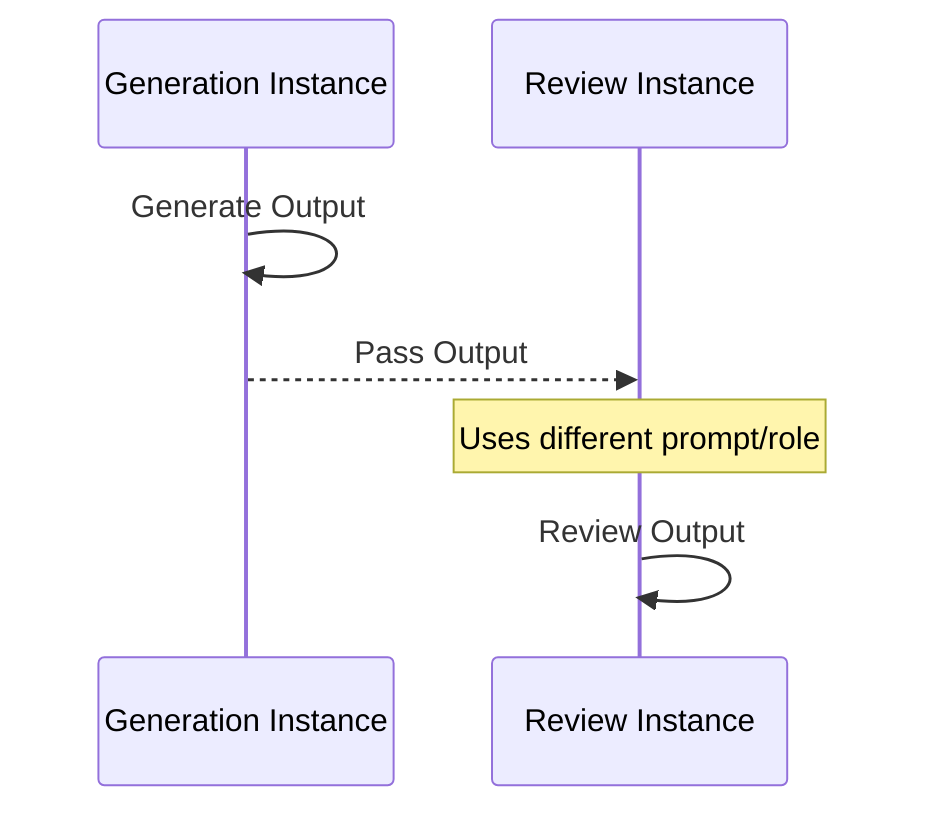
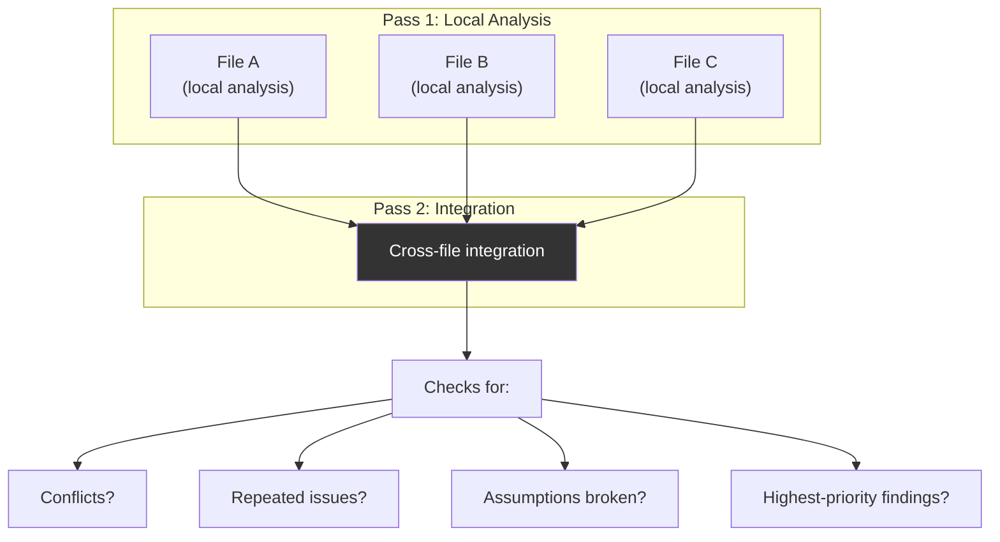
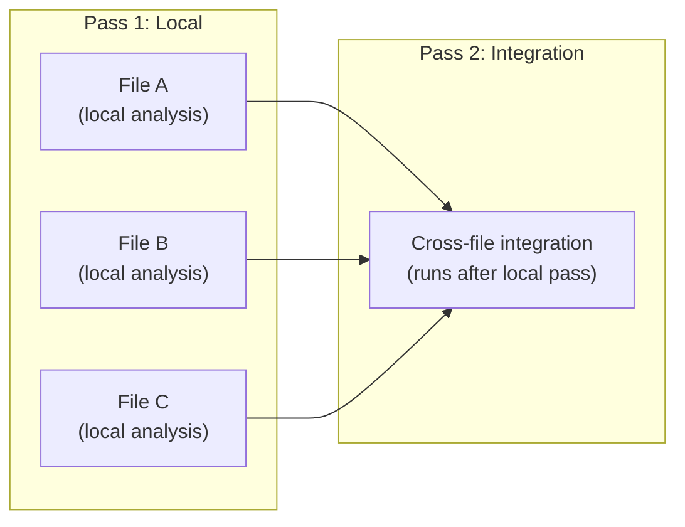

[00:00:30](https://www.udemy.com/course/claude-certified-architect-foundations-complete-course/learn/lecture/57042269#overview)

## Architecture & Scale

### Moving from Single Extractions to Large Batches

- For large, latency-tolerant work, the synchronous Messages API is not ideal for processing one request at a time
- Scaling requires a different approach when dealing with thousands of items (e.g., support tickets, audit logs, or bulk summary generation)

### The Message Batches API

- An asynchronous method to submit many requests and retrieve results later
- **[Key Characteristics]**
    - Asynchronous & latency-tolerant
    - Runs in the background
    - Approximately 50% cheaper
    - Up to 24h no latency SLA




[00:00:42](https://www.udemy.com/course/claude-certified-architect-foundations-complete-course/learn/lecture/57042269#overview)


[00:00:57](https://www.udemy.com/course/claude-certified-architect-foundations-complete-course/learn/lecture/57042269#overview)


[00:01:20](https://www.udemy.com/course/claude-certified-architect-foundations-complete-course/learn/lecture/57042269#overview)

### Benefits of Batch Processing

- **[Cost Efficiency]** Reduces costs by approximately 50% compared to standard synchronous API calls
- **[Suitability]** Designed for work that does not require an immediate answer

### Choosing Between Synchronous and Batch APIs

- **Synchronous API**
    - Use when a user is actively waiting for a response
    - Example: A customer chatting with support asking, "Can I return this item?"
- **Batch API**
    - Use for background, latency-tolerant workloads
    - Example: Auditing all support tickets from the previous night

#### Example: Background Audit Use Cases

- A nightly audit of support tickets can be run offline to:
    - Classify tickets
    - Detect risky refunds
    - Find policy exceptions
    - Flag cases for human review


[00:01:26](https://www.udemy.com/course/claude-certified-architect-foundations-complete-course/learn/lecture/57042269#overview)


[00:01:56](https://www.udemy.com/course/claude-certified-architect-foundations-complete-course/learn/lecture/57042269#overview)


[00:02:08](https://www.udemy.com/course/claude-certified-architect-foundations-complete-course/learn/lecture/57042269#overview)

### The Latency Trade-off

- **[The Trade-off]** Batch processing is optimized for offline workflows but is unsuitable for blocking ones
    - A batch can take up to 24 hours to complete
    - There is no guaranteed latency SLA
- **Offline vs. Blocking Workflows**
        - **Offline (Good for Batch):** Background tasks like a nightly audit of support tickets (classifying, detecting risky refunds, finding exceptions, or flagging for human review)
        - **Blocking (Bad for Batch):** Tasks that require an immediate pass/fail result, such as a pre-merge CI check

### Correlating Results with `custom_id`

- **[Purpose]** Used to match each asynchronous result back to its specific input
- **[Why it's needed]** Batch results may come back out of order
    - Stable IDs allow you to update the correct audit record even when responses are not sequential

```text
Example IDs:
ticket_1001
ticket_1002
ticket_1003
```


[00:02:41](https://www.udemy.com/course/claude-certified-architect-foundations-complete-course/learn/lecture/57042269#overview)

### Tools in Batch

- **[No Live Loop]** A batch request cannot support a mid-request tool loop
    - In a live workflow, Claude requests a tool, the application executes it, and the result is sent back to Claude in a round-trip
    - A single batch request cannot perform this round-trip during reasoning
    - If a task requires multiple live tool calls during reasoning, a different architecture is needed


[00:03:26](https://www.udemy.com/course/claude-certified-architect-foundations-complete-course/learn/lecture/57042269#overview)

### Preparing Context for Batch Jobs

- **[The Requirement]** Because a single batch request cannot support a mid-request tool execution loop, you must assemble all required context before submitting the request
    - In a live workflow, Claude can request a tool, the app runs it, and the result is sent back
    - In a batch, this round-trip is impossible
- **Example: Auditing a support ticket**
    - Instead of letting the model fetch data, gather these details upfront and include them in the request:
        - Ticket text
        - Customer tier
        - Order status
        - Refund history
        - Policy version

### Best Practices for Scaling

- **[Test on a Sample]** Do not start by submitting a massive batch (e.g., 10,000 documents)
- **Iterative Refinement Process**

    1. Start with a small sample
    2. Review the outputs
    3. Identify common mistakes
    4. Improve the prompt, schema, and validation rules
    5. Run the larger batch

- **[The Goal]** This approach avoids wasting costs on a flawed prompt or incorrect schema across a large dataset


[00:03:41](https://www.udemy.com/course/claude-certified-architect-foundations-complete-course/learn/lecture/57042269#overview)


[00:03:47](https://www.udemy.com/course/claude-certified-architect-foundations-complete-course/learn/lecture/57042269#overview)


[00:04:19](https://www.udemy.com/course/claude-certified-architect-foundations-complete-course/learn/lecture/57042269#overview)

### Handling Failures in Batch Jobs

- **[Resubmit Selectively]** If some requests in a batch fail, do not resubmit the entire batch
    - Identify only the failed documents and resend just those
- **[Connection to Stable IDs]** This selective resubmission is possible because stable IDs allow you to track and target specific failed items

### Review Architecture

- **[The Problem with Self-Review]** Asking the same Claude response to review itself has limits
    - The model may miss the same assumptions and mistakes that were baked into the original answer
- **[Higher Reliability: Independent Instances]** Use separate Claude calls for generation and review
    - One Claude call **generates** the output
    - A separate Claude call **reviews** it using a different prompt, role, or more focused criteria




[00:04:26](https://www.udemy.com/course/claude-certified-architect-foundations-complete-course/learn/lecture/57042269#overview)


[00:04:47](https://www.udemy.com/course/claude-certified-architect-foundations-complete-course/learn/lecture/57042269#overview)


[00:04:52](https://www.udemy.com/course/claude-certified-architect-foundations-complete-course/learn/lecture/57042269#overview)


[00:05:09](https://www.udemy.com/course/claude-certified-architect-foundations-complete-course/learn/lecture/57042269#overview)

### Multi-Pass Review

- **[Concept]** Using a sequence of distinct Claude calls to refine an output
    - **Pass 1**: Produces or analyzes the initial content
    - **Pass 2**: Reviews the output using a different prompt, role, or more focused criteria
    - **Pass 3**: Integrates findings (e.g., routing to a human)
- **Example: Policy Review**
        - **Request 1 (Drafting)**: Drafts a refund-resolution policy
        - **Request 2 (Reviewing)**: Checks the draft against specific questions:
                - Does it follow the refund rules?
                - Does it create legal or compliance risk?
                - Does it require human approval?
                - Does it contradict any existing policy?
- **[Use Cases]** Especially effective for:
        - Code review
        - Policy review
        - Support summaries
        - Document analysis

### Large Codebases & Document Sets

- **[The Pattern]** Analyze individual components locally before looking for systemic patterns



- **[Integration Details]** The cross-file integration pass runs only after every local pass is complete
    - It looks for conflicts, repeated issues, or where one file breaks another's assumptions


[00:05:12](https://www.udemy.com/course/claude-certified-architect-foundations-complete-course/learn/lecture/57042269#overview)


[00:05:42](https://www.udemy.com/course/claude-certified-architect-foundations-complete-course/learn/lecture/57042269#overview)

## Large Codebases & Document Sets

### Local-to-Integration Analysis Pattern

To handle large datasets, use a two-pass approach rather than attempting to fit an entire project into a single prompt.

- **Pass 1: Local Analysis**
    - Claude reviews each file or document separately
    - Results are small, structured, and focused
- **Pass 2: Integration Analysis**
    - Runs only after every local pass is complete
    - Looks across the per-file findings to answer questions like:
        - Are there conflicts?
        - Are there repeated issues?
        - Does one file break another's assumptions?
        - What are the highest-priority findings?



- **[Why it's better than one giant prompt]**
    - **Traceability**: You know exactly which file produced which finding
    - **Filtering**: You can filter out low-confidence results before the integration step
    - **Efficiency**: Integration analysis only runs once the local analysis is fully complete


[00:05:58](https://www.udemy.com/course/claude-certified-architect-foundations-complete-course/learn/lecture/57042269#overview)


[00:06:27](https://www.udemy.com/course/claude-certified-architect-foundations-complete-course/learn/lecture/57042269#overview)

## Lesson Summary

### Match the Processing Model to the Requirement

- **Synchronous**: Use when the user is actively waiting for a response
- **Batch**: Use when the work is large and latency-tolerant
- **`custom_id`**: Use to correlate asynchronous results
- **Context Preparation**: Prepare all tool context before submitting a batch request
- **Scaling Strategy**: Test prompts on a small sample before scaling to a large dataset
- **Failure Handling**: Resubmit only the specific documents that failed
- **High-Stakes Review**: Prefer independent multi-pass review over simple self-review

**[Three things to avoid]**

- Batching when an immediate answer is needed
- Relying only on self-review for high-stakes calls
- Solving a large review in one giant prompt

### Putting It Together: ShopAssist Use Cases

| Workload Type | Recommended Model |
| --- | --- |
| Live customer conversations | Synchronous |
| Nightly support-ticket audits | Batch |
| Generated summaries & policies | Independent review |
| Large analysis jobs | Local passes, then integration |


[00:06:43](https://www.udemy.com/course/claude-certified-architect-foundations-complete-course/learn/lecture/57042269#overview)

### ShopAssist Implementation Summary

To apply the architectural principles discussed, different ShopAssist tasks are mapped to specific models and methods:

| Task | Method |
| --- | --- |
| Live customer conversations | Synchronous |
| Nightly support-ticket audits | Batch |
| Generated summaries & policies | Independent review |
| Large analysis jobs | Local passes, then integration |