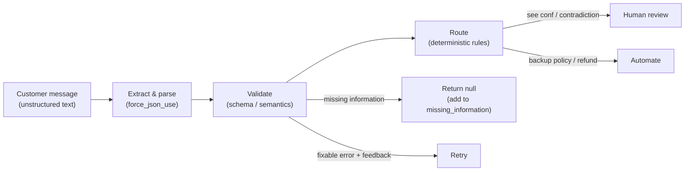
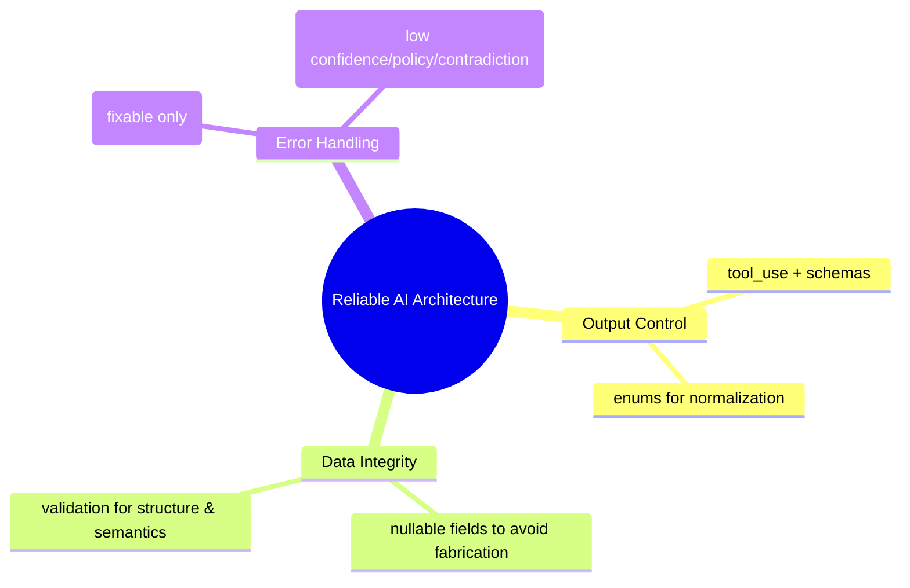

[00:00:00](https://www.udemy.com/course/claude-certified-architect-foundations-complete-course/learn/lecture/57042287#overview)

### ShopAssist: Messy Message to Structured Return Request

- **Goal**: Convert unstructured customer messages into validated, structured return requests
- **The Role of Extraction**: Acts as the bridge between natural language and backend logic
    - Before a system like ShopAssist can check an order or issue a refund, it must first understand the request through structured extraction
- **Core Patterns Combined**:
    - Explicit criteria & examples (for consistent judgment)
    - Tool use + JSON Schema + tool choice (for reliable structured output)
    - Validation, retries, and human-review routing (for error handling and reliability)


[00:00:42](https://www.udemy.com/course/claude-certified-architect-foundations-complete-course/learn/lecture/57042287#overview)


[00:01:00](https://www.udemy.com/course/claude-certified-architect-foundations-complete-course/learn/lecture/57042287#overview)


[00:01:09](https://www.udemy.com/course/claude-certified-architect-foundations-complete-course/learn/lecture/57042287#overview)


[00:01:20](https://www.udemy.com/course/claude-certified-architect-foundations-complete-course/learn/lecture/57042287#overview)

### The Input: Unstructured Customer Messages

- Raw customer text is useful but difficult for code to process directly
    - Example input:

    > "HI, I got my headphones yesterday, but the box was crushed and one side does not work. Can I send it back? I think the order was 12345."

- **[The Problem]** This message is completely unstructured, making it hard for a system to automatically check orders or apply policies.

### The Output: Validated Structure

- The goal is to convert messy text into a structured format that is easy for code to validate and process
- Example structured output:

```json
{
    "order_id": "12345",
    "item": "headphones",
    "reason": "damaged_item",
    "desired_action": "return",
    "evidence_provided": false,
    "urgency": "normal",
    "missing_information": [],
    "confidence": 0.91,
    "human_review_required": false
  }
```

### Designing a Reliable Workflow

- Extraction should be treated as a workflow, not just a task of filling fields
- **[Reliability Rules]**
    - **No order ID?** Claude should return `null` instead of inventing one
    - **Ambiguous reason?** Mark it as `unclear`
    - **Policy exception or contradiction?** Route the request to **human review**


[00:01:26](https://www.udemy.com/course/claude-certified-architect-foundations-complete-course/learn/lecture/57042287#overview)


[00:01:36](https://www.udemy.com/course/claude-certified-architect-foundations-complete-course/learn/lecture/57042287#overview)


[00:01:44](https://www.udemy.com/course/claude-certified-architect-foundations-complete-course/learn/lecture/57042287#overview)

### The Extraction Workflow

- **[Concept]** Designing a reliable system means moving beyond just extracting fields to creating a complete pipeline
- **The Three-Step Pipeline**:



### Step 1: Defining the Extraction Schema

- The schema tells the model exactly which fields are expected
- **Handling Missing Data**: Fields like `order_id` and `item` are set as `nullable` (type: `["string", "null"]`)
    - This allows the model to return `null` instead of guessing/hallucinating when information is absent
- **Ensuring Consistency**: The `reason` field uses an `enum` to restrict the model to a specific set of predefined values
    - This prevents the model from returning many different variations of the same idea

```python

# Example schema definition for the return request
tools = {
    "name": "extract_return_request",
    "description": "Extract a structured return request from a customer message.",
    "input_schema": {
        "type": "object",
        "properties": {
            "order_id": {
                "type": ["string", "null"],
                "description": "The order ID provided by the customer, or null if missing."
            },
            "item": {
                "type": ["string", "null"],
                "description": "The item the customer wants to return, or null if missing."
            },
            "reason": {
                "type": "string",
                "enum": [
                    "damaged_item",
                    "wrong_item",
                    "changed_mind",
                    "billing_dispute",
                    "policy_exception",
                    "unclear",
                    "other"
                ]
            },
            "reason_details": {
                "type": ["string", "null"],
                "description": "Additional details when reason is other or unclear."
            }
        }
    }
}
```


[00:02:11](https://www.udemy.com/course/claude-certified-architect-foundations-complete-course/learn/lecture/57042287#overview)

### Step 1: Define the Extraction Schema (Continued)

- **[Normalizing Data]** Use `enum` to map various ways a customer might describe a problem into a single, consistent category
    - Instead of receiving multiple variations of "damaged", the system receives a normalized value like `"damaged_item"`
- **[Balancing Structure and Flexibility]** Combine enums with a details field
    - Use an `enum` for the primary category (e.g., `reason`)
    - Use a nullable string field (e.g., `reason_details`) to capture additional context when the reason is `"other"` or \`"unclear"$
- **[Human Review Flag]** Include a field like `human_review_required`
    - This allows the extraction module to signal to the rest of the system if a specific case needs a person to look at it

### Step 2: Use Forced Tool Choice

- **[The Goal]** Ensure the model acts as a dedicated extraction module rather than a conversational assistant
- **[Why use it?]** To prevent the model from deciding to reply with conversational text instead of the required JSON
    - Forced tool choice tells the model: "Use this specific schema. Do not answer conversationally. Return the structured extraction."

```python
message = client.messages.create(
    model=model,
    max_tokens=1000,
    tools=tools,
    tool_choice={
        "type": "tool",
        "name": "extract_return_request"
    },
    messages=[
        {"role": "user", "content": customer_message}
    ]
)
```


[00:03:36](https://www.udemy.com/course/claude-certified-architect-foundations-complete-course/learn/lecture/57042287#overview)

### The Extraction Workflow (Continued)

- **Step 3: Extract the Tool Input**
    - After the model responds, the system must read the `tool_use` block
    - This block contains the actual structured data (e.g., a Python dictionary) that can be passed to subsequent parts of the application
    - **[Example Output]** The following is the structured block returned by Claude based on the customer message:

```json
{
        "id": "toolu_01L18vxZv5nqaZujg2p2APQm",
        "caller": {
            "type": "direct"
        },
        "input": {
            "order_id": "12345",
            "item": "headphones",
            "reason": "damaged_item",
            "reason_details": "Box was crushed and one side does not work.",
            "desired_action": "return",
            "evidence_provided": false,
            "urgency": "normal",
            "missing_information": [],
            "confidence": 0.88,
            "human_review_required": false,
            "human_review_reason": null
        },
        "name": "extract_return_request",
        "type": "tool_use"
      }
```

- **Step 4: Validate the Result**
    - **[Why validate?]** While a schema ensures the *structure* is correct (e.g., types and fields), it does not guarantee the *semantic* correctness of the values
    - Validation checks if the extracted information actually makes sense in context
    - A simple validation function might look like this:

```python
def validate_return_request(data):
          errors = []
          if data["order_id"] is None:
              errors.append("order_id is missing")
          if data["item"] is None:
              errors.append("item is missing")
          if data["reason"] == "other" and not data["reason_details"]:
              errors.append("reason_details is required when reason is other")
          if data["confidence"] < 0.7:
              errors.append("confidence is below review threshold")
          return errors
```

    - In production environments, formal schema validators are typically used for more robust checking


[00:03:42](https://www.udemy.com/course/claude-certified-architect-foundations-complete-course/learn/lecture/57042287#overview)


[00:03:53](https://www.udemy.com/course/claude-certified-architect-foundations-complete-course/learn/lecture/57042287#overview)

### Step 5: Retry only when it helps

- **[The Core Principle]** Claude extracts, but code validates; the model should not be the only line of defense
- **Handling Validation Failures**
    - **Fixable errors**: Mistakes the model can correct with specific feedback
        - *Example*: Information placed in the wrong field or missing `reason_details`
        - *Action*: Retry the extraction with specific instructions/feedback
    - **Not fixable errors**: Scenarios where the model cannot magically produce data that wasn't provided
        - *Example*: The customer never provided an `order_id`
        - *Action*: Do not retry to invent data; instead, return `null`, add the field to `missing_information`, and potentially ask the customer for the missing detail
- **[Warning]** Retries for extraction mistakes are not a license to invent missing information


[00:04:28](https://www.udemy.com/course/claude-certified-architect-foundations-complete-course/learn/lecture/57042287#overview)


[00:04:43](https://www.udemy.com/course/claude-certified-architect-foundations-complete-course/learn/lecture/57042287#overview)


[00:05:07](https://www.udemy.com/course/claude-certified-architect-foundations-complete-course/learn/lecture/57042287#overview)

### Step 6: Human Review Routing

- **[The Goal]** Determine if the request can proceed automatically or requires a human to intervene
- **[When to route to human review]**
    - Confidence score is too low
    - The reason for the request is unclear
    - The customer message contains contradictory information
    - The request looks like a policy exception
    - The customer is asking for something sensitive (e.g., a refund outside of normal policy)

---

### ShopAssist Demo: Testing the Workflow

- Running realistic messages through the system to test the different paths
    - **Case 1: Complete return request**
        - *Input*: "I want to return order 12344."
        - *Expected Behavior*: Successful extraction and automated processing


[00:05:53](https://www.udemy.com/course/claude-certified-architect-foundations-complete-course/learn/lecture/57042287#overview)

### ShopAssist Demo: Test Scenarios

Running realistic messages through the system to verify the extraction and routing logic:

- **Case 1: Complete return request**
    - *Input*: "I want to return order 12345. The headphones arrived broken."
    - *Result*: Extracts cleanly into the structured format.
    - \`\`\`json

      "id": "toolu\_01J...",

      "input": {

          "order\_id": "12345",

          "item": "headphones",

          "reason": "damaged\_item",

          "reason\_details": null,

          "desired\_action": "return",

          "evidence\_provided": false,

          "urgency": "normal",

          "missing\_information": [],

          "confidence": 0.95,

          "human\_review\_required": false,

          "human\_review\_reason": null

      }

```javascript
- **Case 2: Missing order ID**
    - *Input*: "I bought a jacket last week and want to return it. I do not have the order number."
    - *Result*: `order_id` is set to `null` and the field is flagged in `missing_information`.
    - ```json
      "input": {
          "order_id": null,
          "item": "jacket",
          "reason": "changed_mind",
          "reason_details": null,
          "desired_action": "return",
          "evidence_provided": false,
          "urgency": "normal",
          "missing_information": [
              "order_id"
          ],
          "confidence": 0.7,
          "human_review_required": false,
          "human_review_reason": null
      }
```

- **Case 3: Ambiguous reason**
    - *Input*: "This product is not what I expected. Can I get my money back?"
    - *Result*: Depending on the criteria, this may result in a reason like `unclear` or `changed_mind`.
- **Case 4: Policy exception**
    - *Input*: "I bought this six months ago, but I still want a refund because I never used it."
    - *Result*: Likely routed to human review or policy handling due to the age of the purchase.
    - \`\`\`json

      "input": {

          "order\_id": "UNKNOWN",

          "item": "UNKNOWN",

          "reason": "changed\_mind",

          "reason\_details": "Customer purchased the item six months ago but never used it and is requesting a refund.",

          "desired\_action": "refund",

          "evidence\_provided": false,

          "urgency": "normal",

          "missing\_information": [

              "order\_id",

              "item"

          ],

          "confidence": 0.7,

          "human\_review\_required": true,

          "human\_review\_reason": "The purchase was made six months ago, which likely falls outside the standard return/refund window. This may require a policy exception and manual review."

      }

```javascript
- **Case 5: Contradiction**
    - *Input*: "The item works perfectly, [but I want to return it]"
    - *Result*: Triggers routing to human review because the customer message contains contradictory information.
```


[00:06:04](https://www.udemy.com/course/claude-certified-architect-foundations-complete-course/learn/lecture/57042287#overview)


[00:06:09](https://www.udemy.com/course/claude-certified-architect-foundations-complete-course/learn/lecture/57042287#overview)

### Case 5: Contradiction

- *Input*: "The item works perfectly, but it arrived broken and I need a replacement today."
- **[Result]** This should be flagged as contradictory or low confidence due to the conflicting information provided by the customer.

### Summary: Architecture vs. Prompting

- **[The Core Insight]** Reliability comes from the architecture, not the prompt
- **Key Architectural Patterns for Reliability**
    - **Tool use + schemas**: Ensures structured output
    - **Nullable fields**: Prevents the model from fabricating missing data
    - **Enums**: Normalizes categories and values
    - **Validation**: Catches both structural and semantic problems
    - **Retries**: Only used when the problem is fixable
    - **Human review**: Used for low confidence, contradictions, or requests outside of policy




[00:06:47](https://www.udemy.com/course/claude-certified-architect-foundations-complete-course/learn/lecture/57042287#overview)

### Exam Takeaway: Architecture vs. Prompting

- **Reliability comes from the architecture, not the prompt**
    - Use `tool_use` + `schemas` $\rightarrow$ structured output
    - Use `nullable fields` $\rightarrow$ avoid fabricated data
    - Use `enums` $\rightarrow$ normalize categories
    - Use `validation` $\rightarrow$ catch structural & semantic problems
    - Use `retries` $\rightarrow$ only when the problem is fixable
    - Use `human review` $\rightarrow$ low confidence, contradiction, or outside policy

### Transition: From Extraction to Action

- Moving from understanding requests to executing real tool workflows
- ShopAssist will evolve to use backend tools for:
    - Looking up customers
    - Inspecting orders
    - Processing refunds
    - Escalating cases when needed