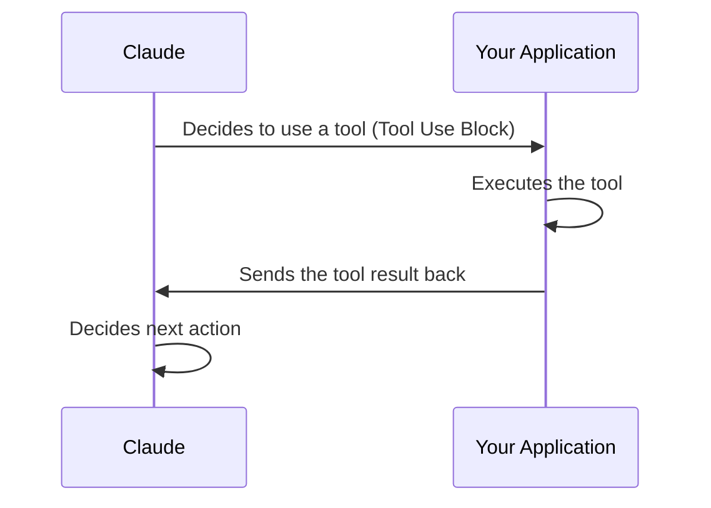
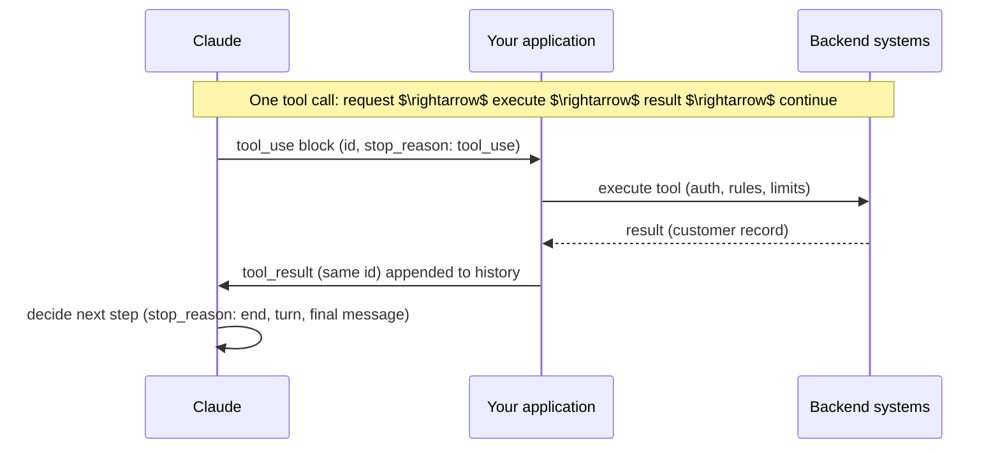
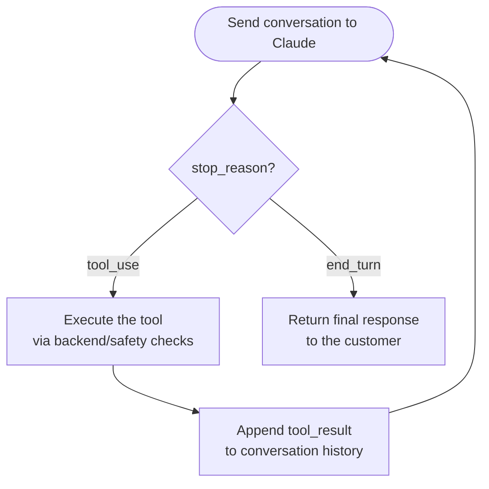
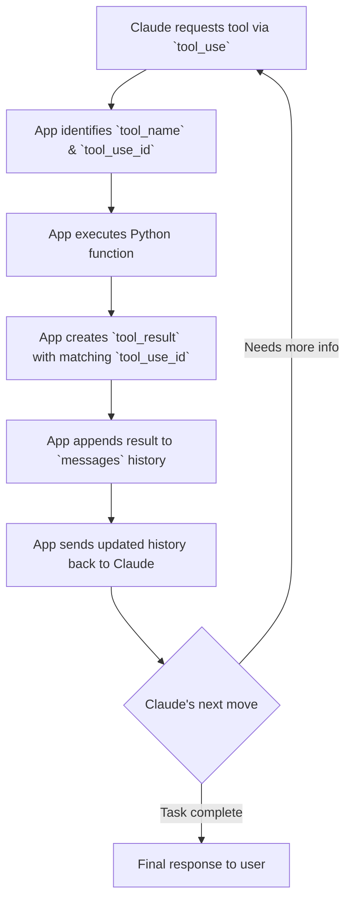

[00:00:16](https://www.udemy.com/course/claude-certified-architect-foundations-complete-course/learn/lecture/57042299#overview)

## Connecting tools into the full tool-use loop

- This loop is the mechanism that allows Claude to act as part of an autonomous workflow

### The Core Rule: Who Does What

- Claude does not execute tools by itself
- The responsibility is split between Claude and your application:
    - Claude decides a tool should be used
    - Your application executes the tool
    - Your application sends the result back to Claude
    - Claude decides what to do next



### The Assistant Response: Tool Use Block

- When Claude wants to use a tool, the assistant response can contain a `tool_use` block
- This block contains three specific pieces of information:
    - The **name** of the tool Claude wants to call
    - The **input arguments** for that tool
    - A **tool\_use id**
        - The `tool_use id` is used to connect the initial request to the result that is sent back later


[00:01:00](https://www.udemy.com/course/claude-certified-architect-foundations-complete-course/learn/lecture/57042299#overview)


[00:01:12](https://www.udemy.com/course/claude-certified-architect-foundations-complete-course/learn/lecture/57042299#overview)

### The Role of the tool\_use id

- Connects the initial tool request to the result that comes back later

### ShopAssist Example: Avoiding Guesswork

- Instead of guessing customer details, Claude requests a tool call
    - **Customer Message**: "I want a refund for my last order, it arrived damaged."
    - **Claude's Action**: Requests `get_customer` using an email or account ID as input
- **`stop_reason: tool_use`**
    - This indicates Claude is not finished
    - It signifies Claude is waiting for your application to run the tool and provide the result before it can continue

### The Tool-Use Round-Trip

- A continuous loop between Claude, your application, and backend systems


[00:01:29](https://www.udemy.com/course/claude-certified-architect-foundations-complete-course/learn/lecture/57042299#overview)


[00:01:46](https://www.udemy.com/course/claude-certified-architect-foundations-complete-course/learn/lecture/57042299#overview)


[00:01:55](https://www.udemy.com/course/claude-certified-architect-foundations-complete-course/learn/lecture/57042299#overview)

### Application Responsibilities in Execution

- While Claude requests the tool, your application owns the actual execution
    - The model does **none** of the following directly:
        - Looking up customers in a database
        - Calling order services
        - Checking if a refund is allowed
- **[Crucial]** Your application is responsible for all operational logic:
    - Permissions
    - Business rules
    - Authentication
    - Validation
    - Rate limits
    - Safety checks

### Closing the Loop: Sending the Result Back

- Once the tool is executed, the result is sent back to Claude to continue the conversation
- The result is appended to the conversation history as a **user message** containing a `tool_result` block
- **[Requirement]** The result must include the same `tool_use id` from the original request so Claude knows which request this result corresponds to

```json
"role": "user",
"content": [
    {
        "type": "tool_result",
        "tool_use_id": "tool_01...", # same id
        "content": "...customer record..."
    }
]
```

### The Full Round-Trip Flow




[00:02:14](https://www.udemy.com/course/claude-certified-architect-foundations-complete-course/learn/lecture/57042299#overview)


[00:02:27](https://www.udemy.com/course/claude-certified-architect-foundations-complete-course/learn/lecture/57042299#overview)

### The Agentic Loop

- The loop is driven by the `stop_reason` returned by the API
- **The core logic flow:**

    1. Send the current conversation history to Claude
    2. Check the `stop_reason` in the response:

        - **If&#32;`tool_use`**:
            - Execute the requested tool in your backend
            - Append the `tool_result` to the conversation history
            - Call Claude again with the updated history
        - **If&#32;`end_turn`**:
            - The loop terminates
            - Claude has produced the final assistant message for this turn
            - This is the response to be shown to the customer



- **[Why follow this loop?]** Because it allows Claude to reason through multiple steps (e.g., looking up an order, then checking refund eligibility, then processing the refund or escalating to a human) without the application having to manually parse natural language to decide what to do next.


[00:03:38](https://www.udemy.com/course/claude-certified-architect-foundations-complete-course/learn/lecture/57042299#overview)

### Detecting Completion

- **[Avoid]** Parsing natural language to decide if a task is done
    - Scanning for phrases like "I'm done," "Here is the final answer," or "No more tools needed" is fragile
- **[Use]** The API response as the reliable signal
    - `stop_reason: tool_use` $\rightarrow$ continue the tool loop
    - `stop_reason: end_turn` $\rightarrow$ return the final response

### Safety Guards vs. Primary Stopping Mechanisms

- The **primary** stopping mechanism should be model-driven completion via `end_turn`
- An iteration cap (maximum number of loops) should only be used as a **safety guard**
    - It protects against bugs, unexpected tool behavior, or poorly designed loops
    - It should not be the mechanism that defines how a task normally ends

### Agentic Loops vs. Hard-coded Decision Trees

- Hard-coded decision trees are brittle because they rely on fixed flows
    - Example of a fragile fixed flow: `get_customer` $\rightarrow$ `lookup_order` $\rightarrow$ `process_refund` $\rightarrow$ `respond`
    - This breaks when real-world messages involve exceptions like damaged items, duplicate charges, or policy exceptions
- An agentic assistant is more robust because it chooses its next action based on the entire **conversation** and **previous tool results**


[00:03:44](https://www.udemy.com/course/claude-certified-architect-foundations-complete-course/learn/lecture/57042299#overview)


[00:04:28](https://www.udemy.com/course/claude-certified-architect-foundations-complete-course/learn/lecture/57042299#overview)

### Real-World Complexity and Dynamic Tool Selection

- **[The Problem]** Hard-coded decision trees are too rigid for real-world complexity
    - A fixed flow like `get_customer` $\rightarrow$ `lookup_order` $\rightarrow$ `process_refund` $\rightarrow$ `respond` works for simple cases but fails when messages are "messy"
    - Messy messages might combine multiple requests: a refund, a damaged item, a duplicate charge, and a policy exception all in one
- **[The Solution]** A tool-enabled assistant chooses the next action dynamically
    - The assistant makes decisions based on the current conversation and previous tool results

### ShopAssist Example: Tool Selection and Authorization

- To handle customer support, specific tools are exposed to the model:
    - `get_customer`
    - `lookup_order`
    - `process_refund`
    - `escalate_to_human`
- **[Crucial Distinction]** The division of responsibility between the model and the backend:
    - **Claude (The Model):** Decides which tool is appropriate to call based on the context
    - **The Backend (The Application):** Decides whether the requested tool call is actually **allowed**


[00:04:31](https://www.udemy.com/course/claude-certified-architect-foundations-complete-course/learn/lecture/57042299#overview)


[00:05:13](https://www.udemy.com/course/claude-certified-architect-foundations-complete-course/learn/lecture/57042299#overview)

### Decisions vs. Rules

- **Claude decides the step**
    - The model uses reasoning to choose the next appropriate tool based on the conversation context
- **The application enforces the rules**
    - Even if Claude requests a specific action, the backend must apply deterministic logic to validate it
    - **[Why?]** To ensure safety and business compliance that a model cannot be trusted to handle alone
    - **Examples of backend rejection criteria:**
        - Customer has not been verified
        - Refund amount exceeds a predefined limit
        - The order is not eligible for the requested action

> The agentic loop is not "let the model do anything." It means let Claude decide the next reasonable step, while your application executes tools safely.

### ShopAssist Toolset

- A set of tools exposed to the assistant to handle customer requests
- **Available Tools:**
    - `get_customer`: Returns a customer object based on their email
    - `lookup_order`: Returns order details based on an order ID
    - `process_refund`: Processes a refund for an eligible order
    - `escalate_to_human`: Transfers the conversation to a human agent

```python

# Example tool definitions for ShopAssist
tools = {
    "name": "get_customer",
    "description": "Get customer profile by email.",
    "input_schema": {
        "type": "object",
        "properties": {
            "email": {"type": "string"}
        },
        "required": ["email"]
    },
    "name": "lookup_order",
    "description": "Look up an order by order id.",
    "input_schema": {
        "type": "object",
        "properties": {
            "order_id": {"type": "string"}
        },
        "required": ["order_id"]
    }
}
```


[00:05:14](https://www.udemy.com/course/claude-certified-architect-foundations-complete-course/learn/lecture/57042299#overview)

### Tool Definitions vs. Implementation

- **Tool Definitions**
    - These describe what Claude is allowed to request
    - Each tool consists of a `name`, a `description`, and an `input_schema`
    - **[Crucial distinction]** The definition itself does not execute any code; it only provides the model with the structured interface of available tools
- **Tool Implementation**
    - The actual logic that runs when a tool is called
    - In a demo environment, these might return hardcoded or fake data, but in production, they involve real side effects
    - **Examples of real-world implementation:**
        - `get_customer`: Performing a database query or calling a third-party customer service API
        - `lookup_order`: Querying an order management system to retrieve status and eligibility

```python

# Example of tool definitions provided to the model
tools = {
    "name": "get_customer",
    "description": "Get customer profile by email.",
    "input_schema": {
        "type": "object",
        "properties": {
            "email": {"type": "string"}
        },
        "required": ["email"]
    },
    "name": "lookup_order",
    "description": "Look up an order by order id.",
    "input_schema": {
        "type": "object",
        "properties": {
            "order_id": {"type": "string"}
        },
        "required": ["order_id"]
    },
    "name": "process_refund",
    "description": "Process a refund for an eligible order.",
    "input_schema": {
        "type": "object",
        "properties": {
            "order_id": {"type": "string"},
            "reason": {"type": "string"}
        },
        "required": ["order_id", "reason"]
    },
    "name": "escalate_to_human",
    "description": "Escalate the case to a human support agent.",
    "input_schema": {
        "type": "object",
        "properties": {
            "reason": {"type": "string"}
        },
        "required": ["reason"]
    }
}
```


[00:06:42](https://www.udemy.com/course/claude-certified-architect-foundations-complete-course/learn/lecture/57042299#overview)

### Tool Implementations in Production

- **Mock vs. Production Logic**
    - In a demo, functions return hardcoded or fake data (e.g., `lookup_order` returning a fake order object)
    - In production, these functions trigger real side effects and external integrations:
        - `process_refund`: Calls a payment provider or internal refund service
        - `escalate_to_human`: Creates a support ticket in platforms like Zendesk, Salesforce, or Jira

### Connecting Models to Code

- **The&#32;`tool_functions`&#32;Dictionary**
    - Acts as the bridge between Claude's tool requests and the Python backend
    - When Claude requests a tool by name (e.g., `"lookup_order"`), the application uses this dictionary to find and execute the corresponding Python function

```python
tool_functions = {
    "get_customer": get_customer,
    "lookup_order": lookup_order,
    "process_refund": process_refund,
    "escalate_to_human": escalate_to_human
}
```

### Initializing the Conversation

- **The&#32;`messages`&#32;list**
    - Stores the conversation history, starting with the user's initial input

```python
messages = [
    {
        "role": "user",
        "content": "Hi, my email is alex@example.com. I want a refund for order ORD-1001 because the keyboard arrived damaged."
    }
]
```


[00:06:53](https://www.udemy.com/course/claude-certified-architect-foundations-complete-course/learn/lecture/57042299#overview)

### The Agentic Loop Implementation

- **The Iterative Process**
    - On each iteration, the application sends the current `messages` history along with the `tools` definitions to Claude
    - The loop continues until Claude provides a final response or a specific stop reason is encountered
- **Handling&#32;`stop_reason`**
    - **`stop_reason == "end_turn"`**
        - Indicates the task is finished and Claude has provided a final answer
        - The application prints the final response and exits the loop
    - **`stop_reason == "tool_use"`**
        - Indicates Claude is requesting to run a specific tool
        - The application must then parse the response to execute the tool
- **Parsing Tool Requests**
    - When a tool is requested, the application iterates through the response blocks to find blocks where `block.type == "tool_use"`
    - For each valid block, the following data is extracted:
        - `tool_name`: The name of the tool Claude wants to call
        - `tool_input`: The structured arguments for the tool
        - `tool_use_id`: The unique identifier for this specific tool call

```python
while True:
    response = client.messages.create(
        model=model,
        max_tokens=1000,
        tools=tools,
        messages=messages
    )
    messages.append({
        "role": "assistant",
        "content": response.content
    })

    if response.stop_reason == "end_turn":
        final_text = response.content[0].text
        print(final_text)
        break

    if response.stop_reason == "tool_use":
        tool_results = []
        for block in response.content:
            if block.type == "tool_use":
                tool_name = block.name
                tool_input = block.input
                tool_use_id = block.id

                print(f"Claude requested tool: {tool_name}")
                print(f"Tool input: {tool_input}")

                result = tool_functions[tool_name](**tool_input)

                tool_results.append({
                    "type": "tool_result",
                    "tool_use_id": tool_use_id,
                    "content": str(result)
                })
        messages.append({
            "role": "user",
            "content": tool_results
        })
```


[00:07:56](https://www.udemy.com/course/claude-certified-architect-foundations-complete-course/learn/lecture/57042299#overview)


[00:08:01](https://www.udemy.com/course/claude-certified-architect-foundations-complete-course/learn/lecture/57042299#overview)

### The Core Mechanic of the Tool-Use Loop

- **The Execution Cycle**
    - When Claude requests a tool, the application performs the following steps to complete the loop:

        1. **Identify**: Parse the `tool_use` block to extract `tool_name`, `tool_input`, and `tool_use_id`
        2. **Execute**: Use the `tool_name` to find and run the matching Python function from the `tool_functions` dictionary
        3. **Respond**: Package the function's return value into a `tool_result` block

            - **[Crucial]** The `tool_result` must include the exact same `tool_use_id` from the original request so Claude can link the result to its specific call

        1. **Append**: Add the `tool_result` to the `messages` conversation history
        2. **Iterate**: Send the updated history back to Claude, allowing it to see the result and decide whether to call another tool or provide a final answer

```python
if response.stop_reason == "tool_use":
    for block in response.content:
        if block.type == "tool_use":
            tool_name = block.name
            tool_input = block.input
            tool_use_id = block.id

            result = tool_functions[tool_name](**tool_input)

            tool_results.append({
                "type": "tool_result",
                "tool_use_id": tool_use_id,
                "content": str(result)
            })

    messages.append(tool_results)
```

- **Summary of the Loop**




[00:08:33](https://www.udemy.com/course/claude-certified-architect-foundations-complete-course/learn/lecture/57042299#overview)

### The Core Mechanic

- It is a controlled loop between Claude, your application, and your backend systems
- **Key loop behaviors:**
    - Assistant messages can contain `tool_use` blocks, each with a `tool_use_id`
    - Your backend executes the tool
    - Results return to Claude and are appended to the conversation history
    - The loop continues while Claude returns `tool_use` and ends when Claude returns `end_turn`