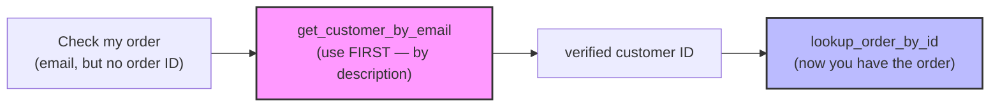
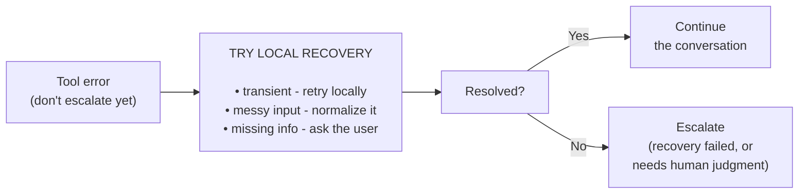

[00:00:00](https://www.udemy.com/course/claude-certified-architect-foundations-complete-course/learn/lecture/57042305#overview)


[00:00:38](https://www.udemy.com/course/claude-certified-architect-foundations-complete-course/learn/lecture/57042305#overview)

## Tool Design

- **[The selection problem]** How Claude determines which tool to use
    - Claude considers the tool name, the input schema, and the conversation context
    - The **description** is the critical component that explains *when* a tool should be used
    - If descriptions are too short, too generic, or too similar, Claude may select the wrong tool

### Start Weak: Minimal Descriptions

- An example of poor tool design where descriptions fail to provide guidance

```json
weak_tools = {
  "name": "get_customer",
  "description": "Get customer data.",
  "input_schema": {"email": {"type": "string"}},

  "name": "lookup_order",
  "description": "Get order data.",
  "input_schema": {"order_id": {"type": "string"}}
}
```


[00:00:43](https://www.udemy.com/course/claude-certified-architect-foundations-complete-course/learn/lecture/57042305#overview)


[00:01:04](https://www.udemy.com/course/claude-certified-architect-foundations-complete-course/learn/lecture/57042305#overview)


[00:01:25](https://www.udemy.com/course/claude-certified-architect-foundations-complete-course/learn/lecture/57042305#overview)

### The Problem with Minimal Descriptions

- Minimal descriptions fail to provide necessary guidance
    - They don't explain the boundary between different tools (e.g., customer lookup vs. order lookup)
    - They don't instruct the model on how to handle partial information

#### The Routing Problem: Partial Information

- When a user provides incomplete data, Claude may select the wrong tool based on keywords
    - **Example Scenario**:
        - **User Message**: "Can you check my order? My email is alex@example.com."
        - **The Error**: Because the user mentioned an "order," Claude might mistakenly attempt to call `lookup_order`.
        - **The Correct Path**: Since no `order_id` was provided, the correct first step is to call a customer lookup tool to identify the user before proceeding.

### Improving Tool Design

- To prevent routing errors, tools need specific names and guiding descriptions
- **[Example of an improved tool]**:

```json
{
  "name": "get_customer_by_email",
  "description": "Find a customer profile by email. Returns identity, account status, and a verified customer ID. Use FIRST when the user gives an email but no order ID. Do NOT use to look up a specific order.",
  "input_schema": {"email": {"type": "string"}},
  "description": "e.g. alex@example.com"
}
```


[00:01:27](https://www.udemy.com/course/claude-certified-architect-foundations-complete-course/learn/lecture/57042305#overview)


[00:01:57](https://www.udemy.com/course/claude-certified-architect-foundations-complete-course/learn/lecture/57042305#overview)


[00:02:06](https://www.udemy.com/course/claude-certified-architect-foundations-complete-course/learn/lecture/57042305#overview)

### Improving Tool Design with Specificity

- **Specific Names**: Using descriptive names provides immediate context about the tool's function and required input
    - Instead of `get_customer`, use `get_customer_by_email`
    - Instead of `lookup_order`, use `lookup_order_by_id`
- **Rich Descriptions**: Descriptions should go beyond simple function summaries to include:
    - Purpose of the tool
    - Expected inputs and outputs
    - Concrete examples
    - **Boundaries**: Explicit instructions on when to use (or NOT use) the tool

#### Tool 1: `get_customer_by_email`

```json
{
  "name": "get_customer_by_email",
  "description": "Find a customer profile by email. Returns identity, account status, and a verified customer ID. Use FIRST when the user gives an email but no order ID. Do NOT use to look up a specific order.",
  "input_schema": {
    "email": {
      "type": "string",
      "description": "e.g. alex@example.com"
    }
  }
}
```

#### Tool 2: `lookup_order_by_id`

```json
{
  "name": "lookup_order_by_id",
  "description": "Retrieve a specific order by order ID (for example ORD-12345678). Do NOT use this tool with an email address. If the user only gives an email, call get_customer_by_email first.",
  "input_schema": {
    "order_id": {
      "type": "string",
      "description": "ORD- followed by 8 digits"
    }
  }
}
```

### The Key Idea: Descriptions Guide Routing

- A well-designed interface uses names and descriptions to steer the model through the correct logic flow




[00:02:12](https://www.udemy.com/course/claude-certified-architect-foundations-complete-course/learn/lecture/57042305#overview)


[00:02:18](https://www.udemy.com/course/claude-certified-architect-foundations-complete-course/learn/lecture/57042305#overview)

### Tool Granularity

- **[The core principle]**: Split tools to reduce ambiguity; consolidate tools to reduce complexity

#### Splitting for Clarity

- Avoid using one generic tool for multiple distinct business functions (e.g., customers, orders, refunds, and policy checks)
    - A single generic tool becomes too vague for the model to use reliably
- **[Why split?]** To provide purpose-specific guidance and clear boundaries
    - **Example of purpose-specific tools**:
        - `get_customer_by_email`
        - `lookup_order_by_id`
        - `check_refund_eligibility`
        - `create_human_escalation`

#### Consolidating for Simplicity

- If multiple tools are almost always called together, use the same input, and return different parts of the same business operation, they should be combined
    - **[Why consolidate?]** To reduce the complexity of the interface and the number of steps the model must manage


[00:02:59](https://www.udemy.com/course/claude-certified-architect-foundations-complete-course/learn/lecture/57042305#overview)


[00:03:40](https://www.udemy.com/course/claude-certified-architect-foundations-complete-course/learn/lecture/57042305#overview)

### Tool Errors

- **[The Problem]**: In production, tools frequently fail due to invalid IDs, permission issues, policy violations, or backend timeouts.
- **Weak vs. Structured Errors**:
    - **Weak errors**: Returning a generic message like `{"error": "Something went wrong"}` is unhelpful because it provides no context for recovery.
    - **[Why it matters]**: Without context, the model cannot determine if it should:
        - Retry the request
        - Ask the user for better information
        - Explain a specific policy issue
        - Escalate to a human

#### Implementing Structured Errors

To enable intelligent recovery, tools should return structured error objects. For example, a `lookup_order_by_id` function might return different error types based on the failure:

```python
def lookup_order_by_id(order_id: str) -> dict:
    if not order_id.startswith("ORD-"):
        return {
            "isError": True,
            "errorCategory": "validation",
            "isRetryable": False,
            "customerMessage": "The order ID does not look valid. Please check the order number and try again.",
            "developerMessage": "Order ID must start with ORD-"
        }

# ... further logic for permission or existence checks
```


[00:04:25](https://www.udemy.com/course/claude-certified-architect-foundations-complete-course/learn/lecture/57042305#overview)

#### Handling Specific Scenarios in `lookup_order_by_id`

- **Validation Errors**: Occur when the input format is incorrect
    - **[Why it matters]**: These are not retryable because the input itself is the problem
    - **Action**: Claude should ask the user to check and provide the correct format
- **Empty Results**: Occur when a valid ID is provided but no record exists
    - **[Note]**: An empty result is **not** an error; the tool worked correctly, it just found no data
    - **Action**: Claude can ask the user for a different ID or email
- **Permission Errors**: Occur when the user lacks access to the requested data
    - **[Why it matters]**: These should not be retried to avoid security risks or unnecessary calls
    - **Action**: Claude should not reveal private data and may need to escalate to a human
- **Transient Errors**: Occur during backend timeouts or temporary service interruptions
    - **[Why it matters]**: These are retryable because the same request might succeed later
    - **Action**: Claude can attempt to retry the request

```python
if order_id == "ORD-00000000":
    return {
        "isError": False,
        "orders": []
    }

if order_id == "ORD-99999999":
    return {
        "isError": True,
        "errorCategory": "permission",
        "isRetryable": False,
        "customerMessage": "I can't access this order with the current account information.",
        "developerMessage": "Authenticated customer does not own requested order."
    }

if order_id == "ORD-TIMEOUT":
    return {
        "isError": True,
        "errorCategory": "transient",
        "isRetryable": True,
        "customerMessage": "I'm having trouble checking the order right now. Please try again in a moment.",
        "developerMessage": "Order service timed out."
    }
```


[00:04:28](https://www.udemy.com/course/claude-certified-architect-foundations-complete-course/learn/lecture/57042305#overview)


[00:04:33](https://www.udemy.com/course/claude-certified-architect-foundations-complete-course/learn/lecture/57042305#overview)


[00:05:05](https://www.udemy.com/course/claude-certified-architect-foundations-complete-course/learn/lecture/57042305#overview)

### Error Categories and Recovery

- The `errorCategory` field helps the system understand the nature of the failure to determine the appropriate response
- **Common error categories include**:
    - **transient**: A temporary system problem, such as a timeout
        - **[Action]**: Retry the same request later
    - **validation**: The input provided is malformed or incomplete
        - **[Action]**: Ask the user to fix the input (no retry)
    - **business**: The request was understood, but business rules prevent the action
        - **[Action]**: Explain the situation or escalate (no retry)
    - **permission**: The user is not authorized to access or perform the action
        - **[Action]**: Do not reveal private data; escalate if needed (no retry)
- The `isRetryable` field explicitly tells the application if another attempt at the same request makes sense

#### Example: Refund Eligibility

Checking if a customer is eligible for a refund can result in a business error if the request is valid but violates policy:

```python
def check_refund_eligibility(order: dict) -> dict:
    if order["delivered_days_ago"] > 30:
        return {
            "isError": True,
            "errorCategory": "business",
            "isRetryable": False,
            "customerMessage": "This order is outside the standard return window, so I cannot process an automated refund.",
            "developerMessage": "Refund denied because the order is outside the 30-day return policy."
        }

    return {
        "isError": False,
        "eligible": True,
        "reason": "Order is within the 30-day return window."
    }
```


[00:05:13](https://www.udemy.com/course/claude-certified-architect-foundations-complete-course/learn/lecture/57042305#overview)


[00:05:57](https://www.udemy.com/course/claude-certified-architect-foundations-complete-course/learn/lecture/57042305#overview)

### Business Errors in `check_refund_eligibility`

- Occur when the request is valid and permissions are correct, but business rules prevent the action
    - **[Example]**: A refund cannot be processed because the order is outside the 30-day return window
    - **[Note]**: Retrying will not change the outcome because the state of the system (the rule) hasn't changed
    - **Action**: Claude should use the `customerMessage` to explain the situation or escalate if manual exceptions are possible

```python
def check_refund_eligibility(order: dict) -> dict:
    if order["delivered_days_ago"] > 30:
        return {
            "isError": True,
            "errorCategory": "business",
            "isRetryable": False,
            "customerMessage": "This order is outside the standard return window, so I cannot process an automatic refund.",
            "developerMessage": "Refund denied because the order is outside the 30-day return policy."
        }
    else:
        return {
            "isError": False,
            "eligible": True,
            "reason": "Order is within the 30-day return window."
        }
```

### Production Pattern: Recover, Then Escalate

- Not every error requires immediate escalation to a human or a coordinator
- **[Why use it?]** To improve efficiency and reduce the burden on human operators by resolving minor issues automatically



#### Examples of Local Recovery

- **Transient Errors**: If a backend times out once, the application can attempt a retry locally
- **Messy Input**: If an ID has extra spaces or lowercase letters, the application can normalize it (e.g., stripping whitespace or converting to uppercase)
- **Missing Information**: If required fields are missing, Claude can ask the user for them directly
- **Escalation**: Only happens when local recovery fails or when the error specifically requires human judgment


[00:05:59](https://www.udemy.com/course/claude-certified-architect-foundations-complete-course/learn/lecture/57042305#overview)

## Beyond Schemas

- Tool design is about more than just defining a schema
- **[Goal]** A strong tool interface helps the model:
    - Choose the right tool
    - Send the right input
    - Understand the result
    - Recover safely from errors
- **[Implementation for ShopAssist]** To achieve this, tools need:
    - Better names
    - Better descriptions
    - Clear input boundaries
    - Structured MCP errors
- **[Outcome]** This holistic approach provides:
    - Less room for the model to guess
    - More control for the backend
    - A better experience for the customer when errors occur