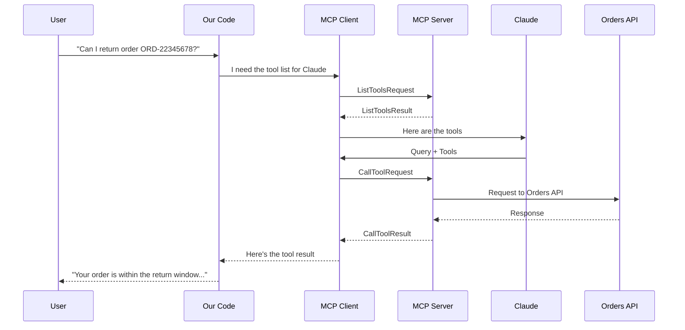
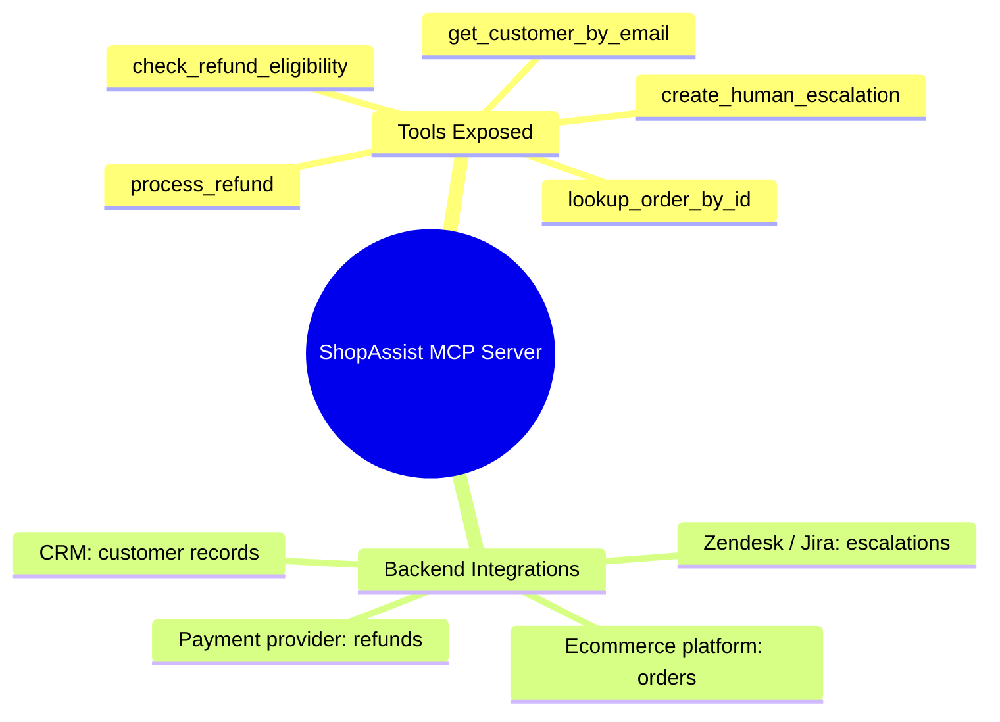

[00:00:00](https://www.udemy.com/course/claude-certified-architect-foundations-complete-course/learn/lecture/57042315#overview)

## ShopAssist Backend Tool Layer

- Building the backend tool layer that agents can actually use
- **[The Interface]** Five backend functions mapping to real business operations:
    - `get_customer_by_email` — finds the customer
    - `lookup_order_by_id` — retrieves order data
    - `check_refund_eligibility` — applies the refund policy
    - `process_refund` — performs the actual refund (sensitive)
    - `create_human_escalation` — sends the case to a human team


[00:00:44](https://www.udemy.com/course/claude-certified-architect-foundations-complete-course/learn/lecture/57042315#overview)


[00:01:16](https://www.udemy.com/course/claude-certified-architect-foundations-complete-course/learn/lecture/57042315#overview)

### Tool Exposure Strategy

- **[Design Choice]** Not all backend tools are exposed to the same agent
    - **Main Support Agent**: Uses safe, decision-support tools like lookup and eligibility checks
    - **Refund Workflow Agent**: A narrower, specialized agent that has access to the sensitive `process_refund` tool
- **[Why?]** This prevents the main support agent from being overpowered and adds a layer of control over sensitive operations

### Mocked Backend Implementation

- Functions are currently mocked using test data to focus on the interface
    - In production, these would interface with databases, order systems, payment providers, or internal APIs
- **Test Data Structure**:
    - `CUSTOMERS`: Contains user details (e.g., `alex@example.com` with `customer_id: "CUS-1001"`)
    - `ORDERS`: Contains order details (e.g., `ORD-12345678` linked to `CUS-1001`)

```python

# Example of the tool sets defined for different agents
main_support_agent_tools = [
    "get_customer_by_email",
    "lookup_order_by_id",
    "check_refund_eligibility",
    "create_human_escalation",
]

refund_agent_tools = [
    "lookup_order_by_id",
    "check_refund_eligibility",
    "process_refund",
    "create_human_escalation",
]
```


[00:02:10](https://www.udemy.com/course/claude-certified-architect-foundations-complete-course/learn/lecture/57042315#overview)

### Customer Lookup Tool

- `get_customer_by_email` returns a structured success response
- **[Handling Missing Data]** If no customer is found, the tool returns a successful response with `isError: False` and `customer: None`
    - This prevents the agent from treating a missing customer as a system failure
    - If it were a system error, the agent might incorrectly retry the same lookup

```python
def get_customer_by_email(email: str) -> dict:
    normalized_email = email.strip().lower()
    customer = CUSTOMERS.get(normalized_email)

    if not customer:
        return {
            "isError": False,
            "customer": None,
            "message": "No customer found for this email address."
        }

    return {
        "isError": False,
        "customer": customer,
    }
```

### Order Lookup Tool

- `lookup_order_by_id` handles three distinct backend scenarios:
    - **Validation Error**: Occurs if the provided order ID format is incorrect
    - **Empty Result**: Occurs if the order ID is valid but the order does not exist in the system (not a system error)
    - **Permission Error**: Occurs if the order exists but does not belong to the authenticated customer

```python
def lookup_order_by_id(order_id: str, customer_id: str) -> dict:
    normalized_order_id = order_id.strip().upper()

    if not normalized_order_id.startswith("ORD-"):
        return {
            "isError": True,
            "errorCategory": "validation",
            "isRetryable": False,
            "customerMessage": "The order ID does not look valid. Please check the order number and try again.",
            "developerMessage": "Order ID must start with ORD-"
        }

    order = ORDERS.get(normalized_order_id)

    if not order:
        return {
            "isError": False,
            "order": None,
            "message": "No order found with this order ID."
        }

    if order["customer_id"] != customer_id:
        return {
            "isError": True,
            "errorCategory": "permission",
            "isRetryable": False,
            "customerMessage": "I can't access this order with the current account information.",
            "developerMessage": "Order does not belong to the authenticated customer."
        }
```


[00:02:34](https://www.udemy.com/course/claude-certified-architect-foundations-complete-course/learn/lecture/57042315#overview)

### Refund Eligibility Tool

- `check_refund_eligibility` answers the policy question without actually performing the refund
- **[Why separate it?]** This allows a main support agent to check if a customer is eligible for a refund without granting them the high-level permission required to actually process money
- The tool evaluates two main criteria:
    - **Order Status**: If the status is not "delivered", the refund is denied
    - **Return Window**: If the number of days since delivery is greater than 30, it is outside the standard return window

```python
def check_refund_eligibility(order: dict) -> dict:
    if order["status"] != "delivered":
        return {
            "isError": True,
            "errorCategory": "business",
            "isRetryable": False,
            "customerMessage": "This order is not eligible for an automatic refund because it has not been delivered.",
            "developerMessage": "Refund denied because order status is not delivered."
        }

    if order["delivered_days_ago"] > 30:
        return {
            "isError": True,
            "errorCategory": "business",
            "isRetryable": False,
            "customerMessage": "This order is outside the standard 30-day return window, so I cannot process a refund.",
            "developerMessage": "Refund denied because delivery date is outside policy window."
        }

    return {
        "isError": False,
        "eligible": True,
        "reason": "Order is within the 30-day return window."
    }
```

### Refund Execution Tool

- `process_refund` performs the actual financial transaction
- In a production environment, this would interface with payment providers like Stripe, Adyen, Shopify, or Magento
- This tool is more sensitive and should be restricted to a narrower, more secure workflow than simple lookup tools

```python
def process_refund(order_id: str, amount: float, reason: str) -> dict:
    if amount <= 0:
        return {
            "isError": True,
            "errorCategory": "validation",
            "isRetryable": False,
            "customerMessage": "The refund amount must be greater than zero.",
            "developerMessage": "Refund amount was less than or equal to zero."
        }

    return {
        "isError": False,
        "refund": {
            "refund_id": "REF-55000",
            "order_id": order_id,
            "amount": amount,
            "status": "submitted",
            "reason": reason
        }
    }
```

### Human Escalation Tool

- `create_human_escalation` is used when automation reaches its limit and a human support team needs to intervene


[00:03:42](https://www.udemy.com/course/claude-certified-architect-foundations-complete-course/learn/lecture/57042315#overview)

### Refund Workflow Patterns

#### The Happy Path (Successful Refund)

To maintain safety and ensure all business rules are met, the agent must follow a strict sequence of backend checks rather than jumping directly to execution.


#### The Policy Exception Path

When an automated check fails a business rule (e.g., an order is outside the 30-day return window), the system should transition from automation to human intervention.

- **Escalation Triggers**:
        - Permission issues
        - Policy exceptions (e.g., expired return window)
        - High-value refund requests
        - Conflicting customer information

```python

# Example of handling a policy exception via escalation
escalation_result = create_human_escalation(
    customer_id=customer["customer_id"],
    order_id=order["order_id"],
    reason="refund_policy_exception",
    summary=eligibility_result["developerMessage"]
)
```

### Human Escalation Tool

- `create_human_escalation` prepares a structured ticket for a human agent to review
    - Returns a dictionary containing:
        - `isError`: False (the tool itself worked)
        - `escalation`: A dictionary with `ticket_id`, `customer_id`, `order_id`, `reason`, `summary`, and `status: "open"`


[00:03:44](https://www.udemy.com/course/claude-certified-architect-foundations-complete-course/learn/lecture/57042315#overview)


[00:03:47](https://www.udemy.com/course/claude-certified-architect-foundations-complete-course/learn/lecture/57042315#overview)


[00:04:05](https://www.udemy.com/course/claude-certified-architect-foundations-complete-course/learn/lecture/57042315#overview)

### Transitioning to MCP

- The core business logic remains the same, but the location of the tool layer and how the agent accesses it changes
- The implementation shifts from plain Python functions to an MCP server

#### MCP Server Architecture

- An **MCP server** acts as the layer that exposes capabilities (like ShopAssist functions) to an MCP-compatible client
- Each function is wrapped as an **MCP tool**
    - The underlying logic is still standard Python
    - The MCP SDK handles exposing the function as a tool
    - Type hints (e.g., `email: str`) are used to define the expected inputs for the agent

```python
from mcp.server.fastmcp import FastMCP

mcp = FastMCP("ShopAssistMCP")

@mcp.tool()
def get_customer_by_email(email: str) -> dict:
    """Find a customer profile by email address.

    Use this when the user provides an email address but no verified customer ID.
    Returns customer identity, account status, and customer ID.
    Do not use this tool to look up a specific order.
    """
    customer = CUSTOMERS.get(email.strip().lower())
    if not customer:
        return {
            "isError": False,
            "customer": None,
            "message": "No customer found for this email address."
        }

    return {
        "isError": False,
        "customer": customer
    }
```


[00:04:44](https://www.udemy.com/course/claude-certified-architect-foundations-complete-course/learn/lecture/57042315#overview)


[00:05:10](https://www.udemy.com/course/claude-certified-architect-foundations-complete-course/learn/lecture/57042315#overview)

### MCP Tool Implementation Details

- **Input Boundaries and Dependencies**
    - Certain tools require specific combinations of identifiers to maintain security and accuracy
    - For example, `lookup_order_by_id` requires both `order_id` and `customer_id` to ensure the caller is accessing the correct user's data
- **The Role of Docstrings**
    - In an MCP context, docstrings serve as the primary tool description for the AI agent
    - They must explicitly define:
        - When the tool should be used
        - What the tool returns
        - What the tool should *not* do (to prevent incorrect usage)
- **Consistent Structured Responses**
    - While MCP changes how a client like Claude discovers and calls a tool, it does not change the requirement for backend validation
    - The backend must still return structured results to handle various outcomes:
        - Success results
        - Validation errors
        - Permission errors
        - Business logic errors

```python
@mcp.tool()
def lookup_order_by_id(order_id: str, customer_id: str) -> dict:
    """Retrieve a specific order by order ID for a verified customer.

    Use this only when you have both an order ID and a verified customer ID.
    Do not use this tool with an email address instead of customer_id.
    Returns order status, delivery age, total amount, and currency."""
    normalized_order_id = order_id.strip().upper()
    if not normalized_order_id.startswith("ORD-"):
        return {
            "isError": True,
            "errorCategory": "validation",
            "isRetryable": False,
            "customerMessage": "The order ID does not look valid. Please check the order number and try again.",
            "developerMessage": "Order ID must start with ORD-"
        }

    order = ORDERS.get(normalized_order_id)
    if not order:
        return {
            "isError": False,
            "order": None,
            "message": "No order found with this order ID."
        }

    if order["customer_id"] != customer_id:
        return {
            "isError": True,
            "errorCategory": "permission",
            "isRetryable": False,
            "customerMessage": "I can't access this order with the current account information.",
            "developerMessage": "Order does not belong to the verified customer."
        }

    return {
        "isError": False,
        "eligible": True,
        "order_id": order_id,
        "reason": "Order is within the 30-day return window."
    }
```

### The Reusable MCP Tool Pattern

Every tool should follow a consistent shape to ensure the layer is reusable across different clients:


[00:05:16](https://www.udemy.com/course/claude-certified-architect-foundations-complete-course/learn/lecture/57042315#overview)


[00:05:41](https://www.udemy.com/course/claude-certified-architect-foundations-complete-course/learn/lecture/57042315#overview)


[00:05:55](https://www.udemy.com/course/claude-certified-architect-foundations-complete-course/learn/lecture/57042315#overview)


[00:05:58](https://www.udemy.com/course/claude-certified-architect-foundations-complete-course/learn/lecture/57042315#overview)

### The Reusable MCP Tool Pattern

- Every tool follows a consistent shape to ensure the layer is reusable across different clients:
    - FastMCP decorators (`@mcp.tool()`)
    - Typed parameters
    - Docstrings that define operational boundaries
    - Structured responses
    - Backend validation

### Testing with the MCP Inspector

- The Python MCP SDK includes a browser-based inspector for debugging and testing the server without a full application
- **[How to start]** Use the `mcpdev` command in the terminal
    - This command prints a local browser URL along with a session token
    - The token is used to authenticate requests to the inspector

```bash

# Example of starting the inspector
mcpdev shopassist_mcp_server.py
```

```python

# Example of the tool implementation structure in shopassist_mcp_server.py
from __future__ import annotations
import json
from typing import Any
from mcp.server.fastmcp import FastMCP

mcp = FastMCP("ShopAssistMCP")

@mcp.tool()
def get_customer_by_email(email: str) -> dict[str, Any]:
    """Find a customer profile by email address.

    Use this when the user provides an email address but no verified customer ID.
    Returns customer identity, account status, and customer ID.
    Do not use this tool to look up a specific order.
    """
    normalized_email = email.strip().lower()
    customer = CUSTOMERS.get(normalized_email)
    if not customer:
        return {
            "isError": False,
            "customer": None,
            "message": "No customer found for this email address."
        }

    return {
        "isError": False,
        "customer": customer
    }
```


[00:06:14](https://www.udemy.com/course/claude-certified-architect-foundations-complete-course/learn/lecture/57042315#overview)


[00:06:23](https://www.udemy.com/course/claude-certified-architect-foundations-complete-course/learn/lecture/57042315#overview)

### Using the MCP Inspector

- Once connected to the server, you can interact with the exposed tools via the inspector interface
    - Navigate to the **Tools** section
    - Click **List Tools** to see all functions exposed by the server

### The MCP Architectural Shift

- MCP changes how tools are managed and discovered compared to traditional implementations
- **[Traditional Way]** The application must:
    - Define tool schemas manually
    - Maintain tool implementations
    - Execute tool calls
    - Send results back to the LLM
- **[MCP Way]** The architecture is decoupled:
    - **MCP Server**: Hosts the tool implementations
    - **MCP Client (e.g., Claude)**: Connects to the server, discovers available tools, reads their descriptions and input schemas, and calls them through the protocol
    - **Benefit**: The main agent application does not need to manually hard-code every backend tool




[00:06:45](https://www.udemy.com/course/claude-certified-architect-foundations-complete-course/learn/lecture/57042315#overview)


[00:07:00](https://www.udemy.com/course/claude-certified-architect-foundations-complete-course/learn/lecture/57042315#overview)


[00:07:21](https://www.udemy.com/course/claude-certified-architect-foundations-complete-course/learn/lecture/57042315#overview)

- The inspector allows for direct debugging of the server by simulating a client connection
    - The client connects to the server via MCP configuration (e.g., a project-level `mcp_config.json` file)
    - Once connected, the server provides the available tools via the protocol
- **[Verification Example]** Testing `get_customer_by_email` with input `alex@example.com`:
    - The inspector returns a structured result containing `customer_id`, `email`, `name`, and `account_status`
    - This successful test confirms two critical layers are functioning:

        1. The underlying Python business logic is correct
        2. The MCP server is correctly exposing that logic as an accessible tool

### ShopAssist MCP Server Composition

- The server acts as a bridge between the LLM and various backend systems




[00:07:31](https://www.udemy.com/course/claude-certified-architect-foundations-complete-course/learn/lecture/57042315#overview)


[00:07:40](https://www.udemy.com/course/claude-certified-architect-foundations-complete-course/learn/lecture/57042315#overview)

### Local Tools vs. MCP

- **[Decision Criteria]**
    - **Local Tools**: Use when the tool layer belongs exclusively to one specific application
    - **MCP**: Use when you want tools to be discoverable, reusable, and configurable across multiple workloads (e.g., Claude Code, Claude Desktop, internal agents)
- **The Value of MCP**
    - It is a standardized way to expose controlled backend capabilities
    - It provides a consistent interface for the client, regardless of the actual backend (CRM, ticketing system, etc.)
    - The client receives:
        - Clear tool names
        - Typed inputs
        - Useful descriptions
        - Structured results

> MCP is about exposing controlled backend capabilities through clear, typed, well-described interfaces.