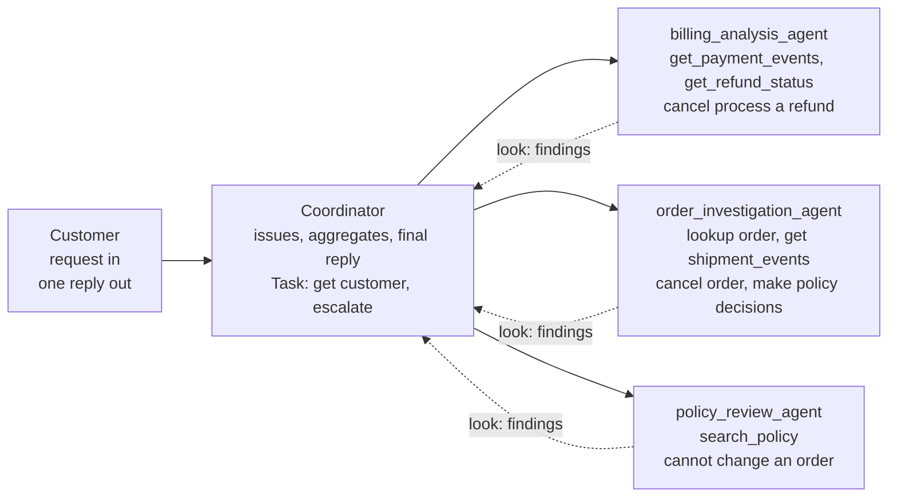
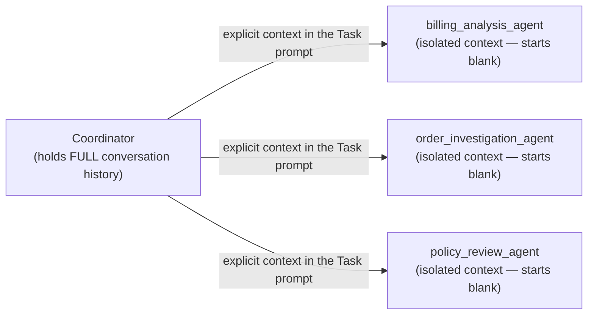
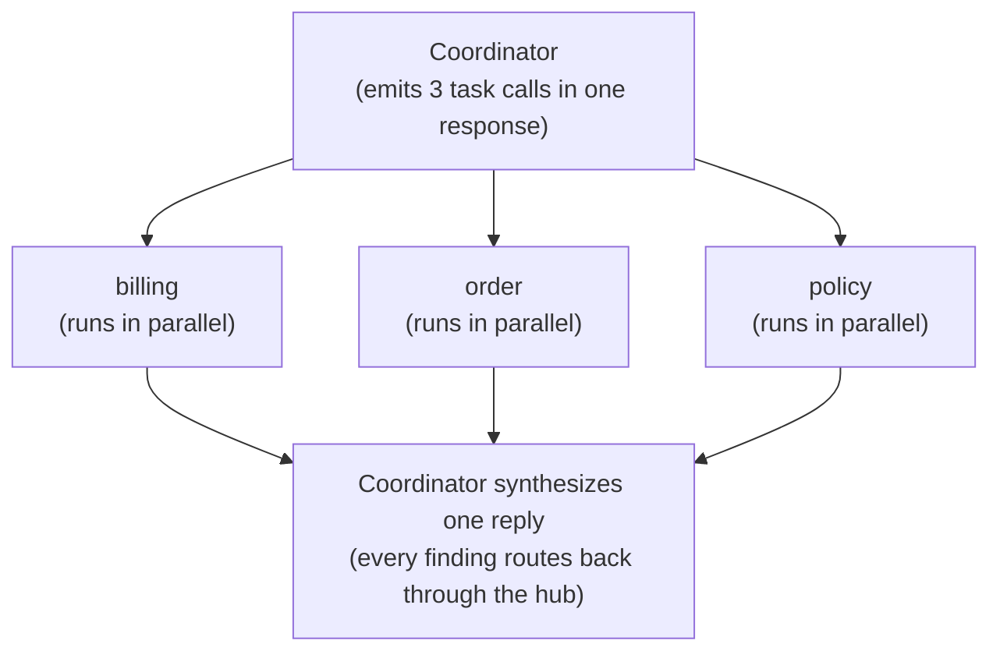

[00:00:00](https://www.udemy.com/course/claude-certified-architect-foundations-complete-course/learn/lecture/57042349#overview)


[00:00:17](https://www.udemy.com/course/claude-certified-architect-foundations-complete-course/learn/lecture/57042349#overview)

## Coordinator & Subagents Architecture

- **Hub-and-Spoke Pattern**
    - A central **coordinator** acts as the hub
    - Specialized **subagents** act as the spokes
- **The Coordinator's Role**
    - Receives the initial user request
    - Decides how to split the work into tasks
    - Sends tasks to specialized subagents
    - Receives findings from subagents
    - Produces one final consolidated answer
- **Why use this?**
    - It is useful when a single customer message contains several different problems that require different expertise




[00:00:44](https://www.udemy.com/course/claude-certified-architect-foundations-complete-course/learn/lecture/57042349#overview)


[00:01:12](https://www.udemy.com/course/claude-certified-architect-foundations-complete-course/learn/lecture/57042349#overview)

### Handling Complex Requests

- A single customer message can contain multiple unrelated issues
    - Example: "I think I was charged twice for order A1042. Also, the headphones arrived damaged, and I want to know if I can still return the charger from my previous order?"
    - This single message triggers three distinct domains:
        - billing issue
        - order investigation
        - policy review
- **[Design Comparison]**
    - **Weak design**: One agent attempts to handle everything within a single, long context
    - **Better design**: The coordinator delegates specific parts of the request to specialized subagents

### Defining the Coordinator Hub

- To enable delegation, the coordinator must be explicitly given the ability to spawn subagents via the `Task` tool
    - Without the `Task` tool in `allowedTools`, the coordinator can reason about the need to delegate but cannot actually execute the command to spawn a subagent
- **Coordinator Configuration Example**

```json
coordinator_agent = {
    "name": "shopassist_coordinator",
    "description": "Routes complex requests and writes the reply.",
    "allowedTools": ["Task", "get_customer", "escalate_to_human"],
    "system": ""Break complex requests into meaningful tasks. Use subagents for investigation. All communication with the customer goes through you.""
}
```


[00:01:30](https://www.udemy.com/course/claude-certified-architect-foundations-complete-course/learn/lecture/57042349#overview)


[00:01:55](https://www.udemy.com/course/claude-certified-architect-foundations-complete-course/learn/lecture/57042349#overview)

### Defining the Spokes: Tool Restrictions

- Each specialist is granted only the specific tools required for their domain
    - This limits the scope of what an agent can do, preventing unintended actions
- **Sub-agent tool configurations**

```python
billing_analysis_agent
      allowedTools = ["get_payment_events", "get_refund_status"]

# analyze billing facts only · do not contact the customer

  order_investigation_agent
      allowedTools = ["lookup_order", "get_shipment_events"]

# report what happened, the evidence, and what is missing

  policy_review_agent
      allowedTools = ["search_policy"]

# return the rule, exception conditions, and confidence
```

### The Key Gotcha: Isolated Context

- Sub-agents start with a blank slate
    - They do not automatically inherit the full conversation history from the coordinator
- **[Requirement]** The coordinator must pass necessary context explicitly within the `Task` prompt to ensure the sub-agent understands the user's situation




[00:02:25](https://www.udemy.com/course/claude-certified-architect-foundations-complete-course/learn/lecture/57042349#overview)


[00:02:49](https://www.udemy.com/course/claude-certified-architect-foundations-complete-course/learn/lecture/57042349#overview)

### Explicit Context Passing

- **[The Problem] Vague Tasks**
    - Providing a generic prompt results in a sub-agent that lacks critical details like the customer identity, order ID, or the original user message

```json
// Too vague: the subagent lacks context
{
  "subagent": "billing_analysis_agent",
  "prompt": "Check the billing problem."
}
```

- **[The Solution] Explicit & Complete Tasks**
    - Instead of relying on "hidden memory," the coordinator must provide the exact facts needed for the task

```json
// Better: passing complete context explicitly
billing_task = {
  "tool": "Task",
  "subagent": "billing_analysis_agent",
  "prompt": """Investigate a possible duplicate charge.
Customer context: customer id C-8821 - verified: true
Original message: \"...charged twice for A1042...\"
Relevant issue: possible duplicate charge for A1042
Return: {issue, evidence, conclusion, recommended_next_step, missing_information}"""
}
```

### Scaling Larger Workflows

- **Separating Layers**
    - For complex workflows, it is beneficial to separate content from metadata and prior findings
    - **[Why?]** This prevents the sub-agent from mixing source text, system facts, and previous findings, which makes the final synthesis much easier

```python
policy_task["prompt"] = """Review return eligibility.
CONTENT: can they still return a charger from a past order?
METADATA: customer id C-8821 | order A0977 | item charger | purchase_date 2026-05-12 | current_date 2026-06-30
PRIOR FINDINGS: verified customer | no refund issued yet
Return: rule | eligibility | missing facts | human review"""
```

### Parallel Task Execution

- If the coordinator identifies that multiple issues are independent, it can execute sub-agents in parallel by emitting multiple task tool calls in a single response




[00:02:58](https://www.udemy.com/course/claude-certified-architect-foundations-complete-course/learn/lecture/57042349#overview)


[00:03:17](https://www.udemy.com/course/claude-certified-architect-foundations-complete-course/learn/lecture/57042349#overview)


[00:03:37](https://www.udemy.com/course/claude-certified-architect-foundations-complete-course/learn/lecture/57042349#overview)

### Managing Parallel Execution

- **[The Flow] Routing through the Hub**
    - Parallel execution does not mean chaotic communication
    - All sub-agents return their findings to the coordinator
    - The coordinator is responsible for aggregating these findings into one unified response
- **[Responsibilities] What the Coordinator Owns**
    - Routing tasks to sub-agents
    - Aggregating results
    - Ensuring final response quality

```json
// Example of structured findings returned to the coordinator
subagent_findings = {
  "billing": {"conclusion": "two authorizations, only one captured",
    "next": "explain the 2nd auth drops off automatically"},
  "order": {"conclusion": "delivered yesterday, damage evidence needed",
    "next": "ask the customer to upload a photo"},
  "policy": {"conclusion": "charger is outside the 30-day window",
    "next": "escalate only if defect / warranty"}
}
```

### Design Warning: Avoid Over-Decomposition

- **Split on meaningful business boundaries**
    - **Good boundaries**: `billing`, `order investigation`, `policy review`, `escalation`
    - **Too narrow**: Creating sub-agents for tiny fields like `check customer name` or `check order date` (unless they are part of a larger workflow)
- **[Why?]** Decomposing too narrowly adds unnecessary overhead and makes the system harder to reason about


[00:04:07](https://www.udemy.com/course/claude-certified-architect-foundations-complete-course/learn/lecture/57042349#overview)

### Exam Core Mechanics

- **The coordinator** is the central routing and aggregation point
- **Subagents have isolated context**
    - They do not automatically inherit the parent conversation
- **The Task tool** spawns subagents
    - The coordinator must have this tool in its `allowedTools` list
- **Pass context explicitly**
    - Include relevant prior findings
    - Can trigger multiple Task calls in a single response


[00:04:28](https://www.udemy.com/course/claude-certified-architect-foundations-complete-course/learn/lecture/57042349#overview)