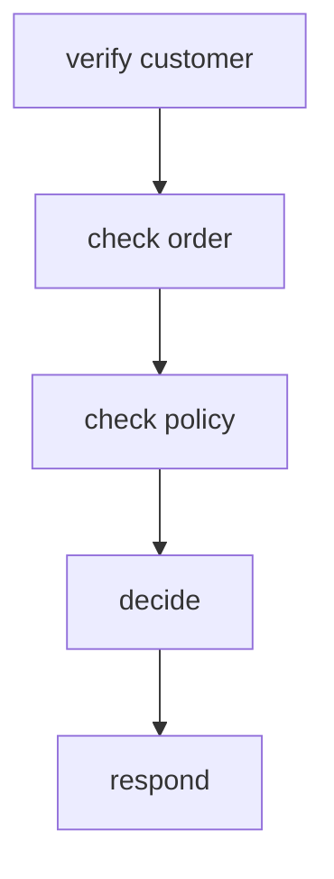
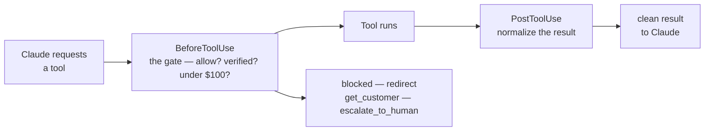

[00:00:00](https://www.udemy.com/course/claude-certified-architect-foundations-complete-course/learn/lecture/57042363#overview)


[00:00:10](https://www.udemy.com/course/claude-certified-architect-foundations-complete-course/learn/lecture/57042363#overview)


[00:00:27](https://www.udemy.com/course/claude-certified-architect-foundations-complete-course/learn/lecture/57042363#overview)

## Designing the Work

- The choice of architecture depends on how much is known about the task beforehand
    - **Fixed Workflow**: Used when the exact steps are known in advance
    - **Adaptive Decomposition**: Used when only the goal is known, requiring the agent to investigate dynamically

### Fixed Sequential Pipeline

- A design where each step depends on the previous one
- Ideal for predictable business processes where the workflow is well-defined
- Example: A refund process for ShopAssist



```python
def refund_workflow(customer_id: str, order_id: str, message: str):
    customer = get_customer(customer_id)
    order = lookup_order(
        customer_id=customer['id'],
        order_id=order_id
    )
    policy = check_return_policy(
        customer_id=customer['id'],
        order_id=order['id']
    )
    decision = decide_refund(
        customer=customer,
        order=order,
        policy=policy,
        customer_message=message
    )
    return draft_customer_response(decision)
```


[00:00:42](https://www.udemy.com/course/claude-certified-architect-foundations-complete-course/learn/lecture/57042363#overview)


[00:01:04](https://www.udemy.com/course/claude-certified-architect-foundations-complete-course/learn/lecture/57042363#overview)


[00:01:19](https://www.udemy.com/course/claude-certified-architect-foundations-complete-course/learn/lecture/57042363#overview)

### Prompt Chaining

- A method of implementing a fixed sequential pipeline
    - Each step uses a model call (e.g., Claude) and passes its output to the next step
- **[Why use it?]** To keep each call focused on a single responsibility
    - Instead of one massive prompt trying to classify, extract, validate, decide, and write, you break it into discrete, manageable stages that feed clean, structured data into the next

```python
classification = classify_customer_issue(message)
extraction = extract_return_request(message)

# Example output:

# {

# "order_id": "A123",

# "claim": "headphones",

# "reason": "arrived damaged",

# "desired_action": "replacement"

# }

order = lookup_order(
    customer_id=session.customer_id,
    order_id=extraction["order_id"]
)

policy = check_return_policy(
    customer_id=session.customer_id,
    order_id=order["id"],
    item=extraction["item"],
    reason=extraction["reason"]
)

response = draft_customer_response(
    classification=classification,
    extraction=extraction,
    order=order,
    policy=policy
)
```

### Adaptive Decomposition

- Used when the path is unclear and the exact steps are not known in advance
- **[How it works]** The coordinator first maps the situation, then decides what to investigate
- This pattern is crucial for handling complex or unfamiliar scenarios, such as navigating an unknown codebase

#### Investigation Plan Pattern

- Instead of jumping to a resolution, the agent creates a plan to identify facts first

```python

# Example of an investigation step

# Plan the investigation before resolving

# investigation_plan = call_claude(

# """Create an investigation plan.

# Do not resolve the issue yet.

# Identify which facts must be checked first.""",

# customer_message

# )
```


[00:01:31](https://www.udemy.com/course/claude-certified-architect-foundations-complete-course/learn/lecture/57042363#overview)


[00:02:12](https://www.udemy.com/course/claude-certified-architect-foundations-complete-course/learn/lecture/57042363#overview)

### Map First, Act Second

- Before taking action, the agent should first map the structure of the task
    - In a codebase review, this means identifying modules, entry points, dependencies, and risk areas before editing files
    - In business workflows, this means mapping the issue before acting
- **[Why?]** To prevent premature or incorrect actions in unfamiliar or complex environments

```python

# Example: Creating an investigation plan before resolving

# investigation_plan = call_claude(

# """Create an investigation plan.

# Do not resolve the issue yet.

# Identify which facts must be checked first.""",

# customer_message

# )
```

### Large Review Strategy: Local and Integration Passes

- Large tasks can be split into two distinct stages to improve reliability
- **Local Passes**: Focus on inspecting one specific area at a time
- **Integration Pass**: Checks how the findings from various local passes fit together
- **[Why use this?]** It is more reliable than asking a single prompt to inspect everything at once

```python

# Example of split review passes

local_findings = [
    review_billing_facts(customer_id),
    review_order_history(customer_id),
    review_policy_constraints(customer_id)
]

integration_review = call_claude(
    "Combine these findings and identify the root cause.", local_findings
)
```

### Enforcement

- Prompts provide guidance but are not sufficient for deterministic compliance
- **[Key Principle]** If a rule must always hold, it belongs in the code, not just in a prompt


[00:02:13](https://www.udemy.com/course/claude-certified-architect-foundations-complete-course/learn/lecture/57042363#overview)


[00:02:29](https://www.udemy.com/course/claude-certified-architect-foundations-complete-course/learn/lecture/57042363#overview)

### Prerequisite Gates

- **Definition**: Programmatic checks that the model cannot bypass, acting as a hard barrier between steps
- **Implementation**: A system can ensure a refund cannot be processed unless a `getCustomer` call confirms the customer is verified
- **Enforcing Thresholds**: Application logic should handle business constraints
    - If a policy requires human approval for refunds above $100, the backend must block automatic processing above that amount
    - The LLM can recommend escalation, but the application enforces the actual threshold

```python
def process_refund(customer_id, order_id, amount):
    customer = get_customer(customer_id)
    if not customer["verified"]:
        raise PermissionError("Must be verified before refund.")
    if amount > 100:
        return escalate_to_human(customer_id, "Exceeds auto-approval.")
    return issue_refund(order_id, amount)
```


[00:03:18](https://www.udemy.com/course/claude-certified-architect-foundations-complete-course/learn/lecture/57042363#overview)


[00:03:36](https://www.udemy.com/course/claude-certified-architect-foundations-complete-course/learn/lecture/57042363#overview)

### Hooks

- Mechanisms to intercept or normalize agent behavior during tool interactions

#### Post-tool Use Hooks

- Used to normalize a tool's result after it has run but before the model sees it
- **[Why use it?]** To standardize messy or inconsistent formats from various tools into a clean, consistent shape for all downstream prompts

```python
def post_tool_use(tool_name, result):
    if tool_name == "lookup_order":
        return {
            "order_id": result["id"],
            "status": result["status"].lower(),
            "delivered": result["status"].lower() == "delivered",
            "total_amount": round(result["total"], 2)
        }
    return result
```

#### Before-tool Use Hooks

- Used to intercept tool calls before execution to ensure deterministic enforcement
- **[Key Principle]** While the model chooses tools dynamically, the application controls what is actually allowed, blocking or redirecting unsafe or policy-violating actions

```python
def before_tool_use(tool_name, tool_input, state):
    if tool_name == "process_refund":
        if not state.get("customer_verified"):
            return {"blocked": True, "redirect": "get_customer"}
        if tool_input["amount"] > 100:
            return {"blocked": True, "redirect": "escalate_to_human"}
    return {"blocked": False}
```




[00:03:42](https://www.udemy.com/course/claude-certified-architect-foundations-complete-course/learn/lecture/57042363#overview)


[00:03:49](https://www.udemy.com/course/claude-certified-architect-foundations-complete-course/learn/lecture/57042363#overview)

### Handoffs

- A handoff is a structured protocol, not just a transfer of control
- **[Key Principle]** A good handoff carries the facts, not just a vague "please review" request
    - It should include enough context so the next reviewer (human, agent, or workflow) can continue without reconstructing the entire conversation

```python
handoff = {
    "customer_id": "C-0021",
    "order_id": "A1042",
    "root_cause": "Damaged headphones reported after delivery.",
    "refund_amount": 328.98,
    "recommended_action": "Human review - exceeds auto-approval.",
    "evidence": ["delivered yesterday", "item arrived damaged"],
    "missing_information": ["damage photo", "packaging condition"]
}
```

### Design Rule: Match the mechanism to the task

- **Fixed pipeline**: Use when the steps are known in advance
- **Dynamic decomposition**: Use when the task is open-ended or investigative
- **Other strategies**:
        - Local + integration passes for large reviews
        - Prompts for guidance
        - Programmatic gates for guaranteed compliance
        - Hooks to normalize results, intercept calls, or block unsafe actions and redirect to escalation

> Claude stays flexible in how it investigates — while verification, refund limits, policy, and escalation stay controlled by the application.


[00:04:28](https://www.udemy.com/course/claude-certified-architect-foundations-complete-course/learn/lecture/57042363#overview)

### Match the Mechanism to the Task

- **Design Rule Summary**
    - **Fixed pipeline** when the steps are known
    - **Dynamic decomposition** when it's investigative
    - **Local + integration passes** for large reviews
    - **Prompts for guidance** vs. **programmatic gates**
        - Use prompts to guide the model's reasoning
        - Use programmatic gates when compliance must be guaranteed
    - **Hooks** to normalize tool results, intercept calls, block unsafe actions, and redirect to escalation
    - **Structured handoffs** so work moves safely between agents, tools, and humans
- **[The Balance of Flexibility and Control]**
    - In systems like ShopAssist, the LLM stays flexible in how it investigates a customer problem
    - Meanwhile, the application retains control over critical rules like customer verification, refund limits, policy enforcement, and escalation rules