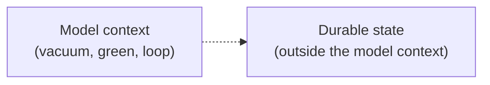

[00:00:00](https://www.udemy.com/course/claude-certified-architect-foundations-complete-course/learn/lecture/57042367#overview)


[00:00:42](https://www.udemy.com/course/claude-certified-architect-foundations-complete-course/learn/lecture/57042367#overview)

### Persistent Case State

- In long-running workflows, passing the entire conversation history (recent messages, tool results, user requests) into every model call is risky
    - A complex support case might involve many disparate data points:
        - Customer messages
        - Order lookups
        - Policy checks
        - Refund limits
        - Photos of damaged items
        - Duplicate charge investigations
        - Human review notes
        - Internal decisions
- If all this information lives only in the conversation history, important facts can get buried
- **The conversation is not your database**
    - For long-running cloud SDK applications, durable state should live outside the model context



### The Fragile Version

- Attempting to pass the entire history can fail at scale because:
    - Repeated messages and verbose tool output
    - Old assumptions and outdated notes
    - Facts drift into the middle of the context
    - A date gets dropped
    - Old refund thresholds cause confusion with the current one
    - "refund" quietly becomes "replacement"

```python
conversation_history = load_entire_case_history(case_id)
response = draft_customer_response()
conversation_history = conversation_history
```


[00:00:48](https://www.udemy.com/course/claude-certified-architect-foundations-complete-course/learn/lecture/57042367#overview)


[00:01:05](https://www.udemy.com/course/claude-certified-architect-foundations-complete-course/learn/lecture/57042367#overview)


[00:01:23](https://www.udemy.com/course/claude-certified-architect-foundations-complete-course/learn/lecture/57042367#overview)

### Lost-in-the-Middle Problem

- As a case grows, important facts can move into the middle of the context
    - This is where models are most likely to miss them
- **Causes of failure at scale**:
    - Repeated messages
    - Verbose tool output
    - Old assumptions and outdated intermediate nodes

### The Fix: Case Facts Block

- A structured, persistent working state (not just a summary for readability)
- **[Why it's necessary]** Critical data must survive long sessions, retries, handoffs, and human review
- **Key data to include**:
    - IDs and dates
    - Refund amounts
    - Policy versions and percentages
    - Customer expectations

```python
case_facts = {
    "case_id": "case_8421",
    "customer_id": "cus_1842",
    "order_id": "ord_77819",
    "item_id": "jacket_blue_m",
    "issue_type": "damaged_item",
    "customer_expectation": "full refund, not replacement",
    "refund_amount_requested": 149.00,
    "currency": "USD",
    "delivered_at": "2026-06-24",
    "policy_id": "returns-v7",
    "automatic_refund_limit": 75.00,
    "evidence": ["photo_uploaded", "damage_visible"],
    "missing_information": [],
    "escalation_reason": "refund amount exceeds automatic limit",
}
```

### The Coordinator Owns State

- The coordinator is responsible for loading the current state explicitly

```python
def resume_case(case_id: str) -> CoordinatorState:
    case_facts = load_case_facts(case_id)
    recovery = load_recovery_manifest(case_id)
    recent_events = load_trimmed_case_events(case_id)
    return CoordinatorState(
        case_facts=case_facts,
        recovery=recovery,
        recent_events=recent_events,
    )
```

| Layer | Responsibility |
| --- | --- |
| Claude | reasons |
| Tools | execute |
| Gates | enforce |
| Hooks | intercept |
| Handoffs | carry state |


[00:01:29](https://www.udemy.com/course/claude-certified-architect-foundations-complete-course/learn/lecture/57042367#overview)


[00:01:45](https://www.udemy.com/course/claude-certified-architect-foundations-complete-course/learn/lecture/57042367#overview)

### Recovery Manifest vs. Chat Transcript

- **[Why it's necessary]** If a workflow is interrupted, you cannot rely on guessing the state from a long chat transcript.
- Use a **recovery manifest** to store the exact progress
    - This provides a reliable way to resume without re-running dangerous or non-idempotent actions
- **[Safety distinction]** Certain actions are safe to retry, while others are not
    - Drafting a customer response is usually safe
    - Processing a refund is **not safe** to retry blindly
    - This decision must be stored in the application state, not left to the model's memory

```python
recovery_manifest = {
    "last_completed_step": "check_return_policy",
    "pending_step": "escalate_to_human",
    "safe_to_retry": [
        "draft_customer_response",
        "process_refund"
    ],
    "last_tool_results": {
        "status": "requires_human_review",
    },
}
```

### Backend Enforcement

- While prompts can instruct a model to follow rules (e.g., "do not process large refunds automatically"), the backend must enforce these rules to ensure they are always followed
- A model might recommend an action that violates a hard rule; the application layer acts as the final gatekeeper

### Reducing Context Pressure

- **[Problem]** Weak tool implementations often return entire internal records (e.g., full order records containing payment logs, warehouse scans, and audit fields) that the agent doesn't actually need.
- **[Solution] Trimmed Tool Outputs**
    - Tools should be designed to return only the relevant facts required for the specific reasoning task.
    - This prevents flooding the context window with noise and preserves space for critical reasoning.
- **[Optimization] Strategic Information Ordering**
    - When aggregating various inputs, place key summaries at the very beginning of the context.
    - **[Why?]** To prevent burying the most important facts under pages of logs, which helps combat the 'lost-in-the-middle' phenomenon where models lose focus on information located in the center of a long prompt.

### Risks of Long-Running Workflows

- **[Problem]** Text-based workflows suffer from gradual degradation as the conversation grows
    - The model might maintain a confident tone but fail on specific details
    - Common failures include missing dates, confusing outdated thresholds, or misremembering specific customer preferences (e.g., requesting a refund vs. a replacement)
- **[Risk] Progressive Summarization Decay**
    - If a workflow relies on summarizing previous steps into new summaries, small but critical details can vanish over time
    - **[Solution]** Critical facts must be preserved in a **structured state** rather than relying solely on natural language summaries

### Sub-agent Architecture

- Sub-agents are effective for splitting work into independent investigations
- **[Constraint] Isolated Context**
    - Sub-agents do not automatically inherit the parent conversation's history
    - A coordinator must explicitly pass the relevant facts and state to the sub-agent to ensure it has the necessary context to perform its task


[00:04:18](https://www.udemy.com/course/claude-certified-architect-foundations-complete-course/learn/lecture/57042367#overview)

### Architecture for Large-Context Work

- **[Key Principle]** Large-context work is an architecture problem, not just a prompting problem
    - Do not rely on a long conversation as your source of truth
    - Instead, store durable state outside the model context
- **Core Strategies for Reliability**
    - Use case facts blocks and trimmed tool outputs to minimize noise
    - Implement recovery manifests to track progress
    - Utilize structured handoffs between agents
    - Ensure prompts guide behavior while code enforces rules (e.g., safety rules should live in the application state, not model memory)
- **Sub-agent Handoffs**
    - Sub-agents should return structured findings and metadata rather than long reasoning transcripts
    - **[Why?]** Structured data is easier to verify, store, compare, and pass forward to the next step
    - A specific handoff allows a human reviewer or a later workflow step to continue without needing to reconstruct the entire conversation history

| Strategy | Implementation Detail |
| --- | --- |
| Source of Truth | Store durable state outside the model context |
| Rule Enforcement | Prompts guide behavior; Code enforces rules |
| Sub-agent Output | Return facts + metadata (IDs, dates, amounts, etc.) |
| Handoffs | Use specific, structured findings for easy verification |


[00:04:29](https://www.udemy.com/course/claude-certified-architect-foundations-complete-course/learn/lecture/57042367#overview)

## Summary: Large-context Work is an Architecture Problem

- **[Core Principle]** Reliability in long-context workflows is achieved through architecture, not just prompting
- **Key strategies for building reliable systems:**
    - Do not rely on a long conversation as your source of truth; store durable state outside the model context
    - Use case facts blocks, trimmed tool outputs, recovery manifests, and structured handoffs
    - Ensure subagents return findings as structured facts and metadata
    - Use backend code to enforce rules (prompts guide behavior, but code enforces it)
- **Protecting critical details:**
    - In production, specific data points are not "small details" and must be preserved exactly
    - Critical data includes:
        - Identifiers: customer IDs, order IDs
        - Financials: amounts, refund amounts
        - Temporal/Policy data: dates, policy versions, percentages
        - Context: missing information, customer expectations