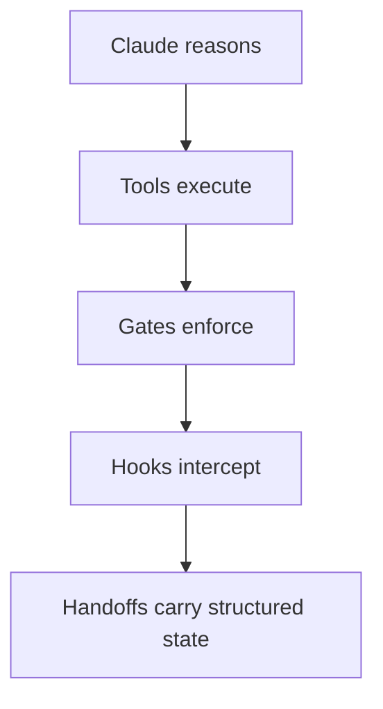
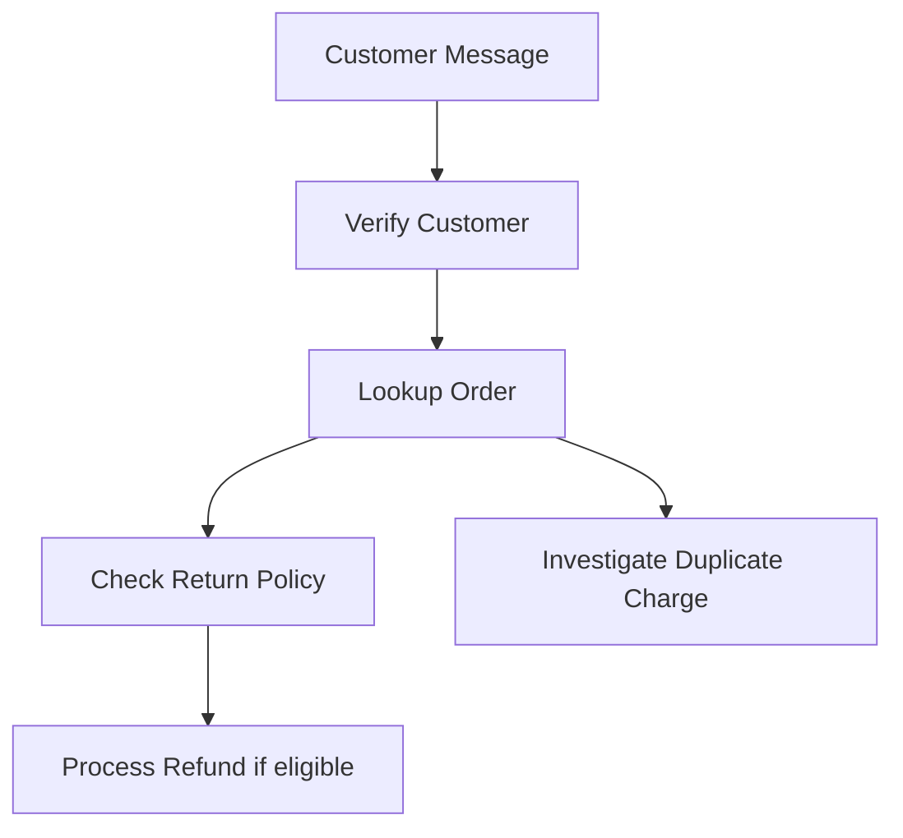

## ShopAssist Agentic System

- Becomes an agentic support system via a controlled loop rather than a single prompt or tool call
- The agentic loop follows these stages:
    - **READ**: Claude reads the customer request
    - **CHOOSE**: Claude chooses the necessary tools
    - **REVIEW**: Claude reviews the tool results
    - **STOP**: The process stops when the case is ready for a response or human escalation

### The Architecture Rule

- The system follows five distinct layers, ensuring Claude never executes business actions directly—it only reasons and requests tools



- **Demo vs Production implementation**
        - In the demo: Backend tools return mock data
        - In production: The same functions call actual systems like customer DB, order API, payment provider, refund service, or ticketing system


[00:00:33](https://www.udemy.com/course/claude-certified-architect-foundations-complete-course/learn/lecture/57042371#overview)


[00:01:16](https://www.udemy.com/course/claude-certified-architect-foundations-complete-course/learn/lecture/57042371#overview)

### Multi-Concern Customer Case

- A single customer message can contain multiple distinct issues that require different toolsets
    - **Example Case:**
        - **Message:** "Hi, I received my blue jacket yesterday and it arrived damaged. I also think I was charged twice. I want a full refund, not a replacement. My order number is ORD-77819."
        - **Identified Concerns:**
                - Damaged item issue
                - Refund request
                - Possible duplicate charge
- **[Why use an agentic workflow?]** Because a fixed pipeline might miss or mismanage one of these overlapping concerns
    - An identity workflow allows Claude to decide which tools are needed and determine the correct sequence to resolve them

### Tool Execution Principle

- Claude does not execute business actions directly
    - It functions by reasoning about the situation and then requesting specific tools to perform the work


[00:01:44](https://www.udemy.com/course/claude-certified-architect-foundations-complete-course/learn/lecture/57042371#overview)

### Demo Tool Definitions

- In this demonstration, tools are mapped to specific backend functions with defined input schemas:
    - `verify_customer`: Checks the currently authenticated customer session
    - `lookup_order`: Retrieves order details using `customer_id` and `order_id`
    - `check_return_policy`: Validates a specific item and reason against return rules
    - `investigate_duplicate_charge`: Checks payment records for potential double charges
    - `process_refund`: Creates a refund, subject to verification and policy gates
    - `escalate_to_human`: Creates a structured handoff for human intervention

### Case Facts (Workflow Memory)

- A persistent block of data that acts as the "memory" for the agentic workflow
- **[Purpose]** To protect and carry forward critical details through the reasoning loop
- **Key data points stored in case facts:**
    - Order IDs and Item IDs
    - Refund amounts
    - Evidence and missing information
    - Escalation reasons


[00:02:17](https://www.udemy.com/course/claude-certified-architect-foundations-complete-course/learn/lecture/57042371#overview)

### Backend Function Logic & Gates

- **Customer Verification Gate**
    - Acts as a prerequisite for sensitive actions like processing refunds
    - **[Process]** Claude requests verification, but the backend evaluates the session and returns a definitive status
    - The backend decides if the verification passes or fails, rather than the agent guessing
- **Order Lookup**
    - Uses explicit, typed arguments (`customer_id` and `order_id`) to ensure precision
    - **[Why?]** This prevents the agent from attempting to "guess" or infer critical identifiers from unstructured raw customer messages
- **Return Policy Check**
    - Evaluates item eligibility and specific return rules
    - **[Logic Hook]** The return value includes an `automatic_refund_limit` (e.g., 75.00)
        - If a requested refund exceeds this limit, it triggers additional logic/gates in the subsequent refund process
- **Duplicate Charge Investigation**
    - A distinct concern handled by a specialized tool
    - In advanced architectures, this can run in parallel with other checks (like policy verification) since the two processes are independent

```python

# Example of the structured return from a policy check
def check_return_policy(customer_id: str, order_id: str, item_id: str, reason: str):
    return {
        "status": "success",
        "policy_id": "returns-v7",
        "eligible": True,
        "automatic_refund_limit": 75.00,
    }
```


[00:03:28](https://www.udemy.com/course/claude-certified-architect-foundations-complete-course/learn/lecture/57042371#overview)

### Refund Tool & Enforcement

- **[The Rule]** Prompts guide behavior, but code enforces the rules
    - While Claude might decide a refund is appropriate, the backend implements a "refund limit hook"
    - If the amount exceeds the `automatic_refund_limit`, the backend blocks automatic processing and requires a different path (e.g., escalation)

```python
def process_refund(customer_id: str, order_id: str, refund_amount: float, reason: str):
    return {
        "status": "blocked",
        "error_code": "REFUND_LIMIT_EXCEEDED",
        "message": "Refund amount exceeds automatic approval limit.",
        "next_step": "escalate_to_human"
    }
```

### The Tool Runner & Agentic Loop

- **Tool Runner**
    - Serves as the backend execution layer
    - Receives tool requests from the agent, executes them, and returns structured results (`success`, `blocked`, or `error`)
- **The Agentic Loop Pattern**
    - The cycle of reasoning and action driven by the `stop_reason` in the model response
    - **[Workflow]**

        1. Claude identifies a need for a tool and returns a `stop_reason: "tool_use"`
        2. The backend identifies the requested tool and its input
        3. The backend executes the tool via the `run_tool` function
        4. The system updates `case_facts` with the new information
        5. The tool results are appended to the message history and sent back to Claude to continue reasoning

```python
if message.stop_reason == "tool_use":
    for block in message.content:
        if block.type == "tool_use":
            result = run_tool(block.name, block.input)
            tool_results.append({
                "type": "tool_result",
                "tool_use_id": block.id,
                "content": json.dumps(result)
            })
            update_case_facts(case_facts, block.name, result)
```


[00:03:42](https://www.udemy.com/course/claude-certified-architect-foundations-complete-course/learn/lecture/57042371#overview)

### Safe Escalation & Case Fact Persistence

- **[Handling Unexpected Behavior]** If the `stop_reason` is anything other than `tool_use` or `end_turn`, the system must not improvise
    - Instead, it performs a safe escalation to a human

```python
if message.stop_reason == "end_turn":
    print(message.content[0].text)
    break

handoff = run_tool("escalate_to_human", {
    "case_facts": case_facts,
    "escalation_reason": f"Unexpected stop reason: {message.stop_reason}"
})
```

- **Case Fact Persistence**
    - The `update_case_facts` function stores critical information outside the immediate model context
    - This ensures the `case_facts` block survives the loop, providing the coordinator with a stable, persistent view of the case

### Multi-Concern Workflow Walkthrough

- When a customer message contains multiple concerns, the agent processes them as independent tasks
- **[Example Workflow]**



- **Step-by-step execution:**

        1. **Verification & Lookup:** Claude requests verification and order lookup to establish the baseline
        2. **Policy & Investigation:** Once the order is retrieved, Claude can independently request a return policy check and a duplicate charge investigation
        3. **Resolution:** Based on the findings (e.g., a damaged item), Claude may then proceed to request a refund


[00:04:46](https://www.udemy.com/course/claude-certified-architect-foundations-complete-course/learn/lecture/57042371#overview)

### Refund Enforcement & Human Escalation

- **[Enforcement via Tool Errors]** A refund tool can act as a safety hook by blocking requests that exceed a specific threshold
    - If the requested amount (e.g., 149 dollars) exceeds the automatic limit (e.g., 75 dollars), the tool returns a structured error instead of processing the refund
    - This error is a feature of the system, not an agent failure; it provides the agent with the necessary context to stop and escalate
- **Structured Human Escalation**
    - When a tool limit is hit, the agent should call `escalate_to_human` with a comprehensive context block
    - **[Escalation Payload]** The handoff includes:
        - Customer and Order details
        - Root cause of the issue
        - Requested refund amount and supporting evidence
        - Missing information and the specific escalation reason
- **Drafting Customer Responses**
    - To ensure accuracy, the agent drafts final responses using the `case_facts` (the verified state)
    - **[Why?]** This prevents the agent from relying on scattered intermediate reasoning, unverified assumptions, or unverified states during the final communication step

```text

# Example of a structured escalation/summary state

## What We Confirmed
- Item | Detail |
- --Order-- | ORD-77819 - Blue Jacket, delivered June 24 |
- --Damage Claim-- | Logged and flagged on your order |
- --Refund Eligibility-- | Your item is eligible for a return/refund |
- --Suspected Duplicate Charge-- | No second charge was actually captured - there is a pending authorization on your account, but it has not been billed. It should drop off automatically, but our team will monitor it. |

## Why Your Refund Needs Human Review
Your full refund of 149.00 dollars exceeds the threshold our system can approve automatically. This doesn't mean your refund is denied - it simply requires a manual approval from our specialist team.

## One Thing That May Help Speed Things Up
If you're able to share a photo of the damage, that can help the team expedite your manual refund approval. You can reply here or send it to our support team referencing #HANDOFF-3087.
```


[00:05:03](https://www.udemy.com/course/claude-certified-architect-foundations-complete-course/learn/lecture/57042371#overview)


[00:05:08](https://www.udemy.com/course/claude-certified-architect-foundations-complete-course/learn/lecture/57042371#overview)

### Principles of an Agentic System

An agentic system is defined as a **controlled loop**, not simply "letting the model do anything."

- **Core Execution Logic**
    - Claude chooses steps and reasons over tool results
    - The backend executes tools using typed arguments
    - `stop_reason` controls whether the loop continues or ends
- **Safety and Control Mechanisms**
    - **Gates**: Verify identity and permissions
    - **Hooks**: Block policy-sensitive or unsafe actions
    - **Structured Errors**: Guide the agent's recovery process
    - **Case Facts**: Preserve critical context across the loop
- **Workflow Management**
    - **Parallel Investigation**: Handles independent concerns simultaneously
    - **Structured Handoff**: Human escalation is a formal, data-rich process, not a vague fallback