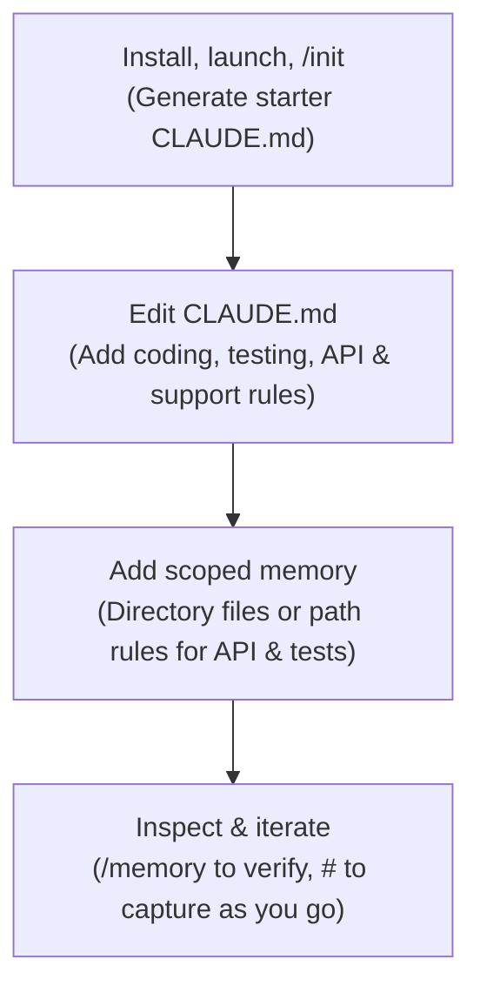

[00:00:15](https://www.udemy.com/course/claude-certified-architect-foundations-complete-course/learn/lecture/57042383#overview)

## Cloud Code

- An agentic coding assistant that runs in the terminal
    - Can read files and edit code
    - Can run commands and inspect tests
    - Assists with multi-step development tasks

### Claude Code vs. the SDK

- **[The Distinction]** They operate at different layers of the development stack
    - The SDK is for building the agentic application layer yourself
    - Claude Code is a product with agentic capabilities built-in

| Feature | With the SDK | Claude Code |
| --- | --- | --- |
| Core Approach | You build the application layer | Agentic capabilities built into the product |
| Responsibilities | Define the tools yourself\n\nStore & resend conversation history\n\nRead files & fetch external context\n\nValidate tool inputs\n\nConnect Claude to backend systems | Works across a whole project\n\nInspects files\n\nRuns terminal commands\n\nKeeps session context\n\nUses built-in & connected tools |


[00:00:34](https://www.udemy.com/course/claude-certified-architect-foundations-complete-course/learn/lecture/57042383#overview)


[00:01:01](https://www.udemy.com/course/claude-certified-architect-foundations-complete-course/learn/lecture/57042383#overview)


[00:01:17](https://www.udemy.com/course/claude-certified-architect-foundations-complete-course/learn/lecture/57042383#overview)

### The Need for Project Configuration

- **[The Problem]** Claude Code is a general agent and does not automatically know project-specific details
    - Coding standards
    - Testing conventions
    - Claude API patterns
    - Support-domain rules
- **[The Solution]** Project configuration provides "durable context"
    - This is more efficient than repeating instructions in every individual prompt


[00:01:19](https://www.udemy.com/course/claude-certified-architect-foundations-complete-course/learn/lecture/57042383#overview)


[00:01:44](https://www.udemy.com/course/claude-certified-architect-foundations-complete-course/learn/lecture/57042383#overview)


[00:01:51](https://www.udemy.com/course/claude-certified-architect-foundations-complete-course/learn/lecture/57042383#overview)


[00:02:01](https://www.udemy.com/course/claude-certified-architect-foundations-complete-course/learn/lecture/57042383#overview)

### Claude Code Installation and Setup

- **Installation Workflow**
    - Ensure Node.js is installed
    - Verify npm availability with `npm help`
    - Install the CLI globally via npm:

```bash
npm install -g @anthropic/claude-code
```

    - Launch the assistant by navigating to the project folder and running the `claude` command

```bash
cd shopassist
      claude
```

    - **[Authentication]** The first time the command is run, Claude Code will prompt for a one-time login

### Project Memory with `CLAUDE.md`

- **The Role of&#32;`CLAUDE.md`**
    - Acts as the most important project memory file
    - Tells Claude Code how to operate specifically within a given repository
- **The&#32;`/init`&#32;Shortcut**
    - Running `/init` triggers Claude Code to scan the project and generate an initial `CLAUDE.md` file
    - The generated file includes:
        - Project structure
        - Common commands
        - Dependencies
        - Development patterns
    - **[Note]** `/init` is just a starting point; the file should be manually edited afterward to be truly useful for a team


[00:02:06](https://www.udemy.com/course/claude-certified-architect-foundations-complete-course/learn/lecture/57042383#overview)


[00:02:37](https://www.udemy.com/course/claude-certified-architect-foundations-complete-course/learn/lecture/57042383#overview)

### Configuring Project Memory with `CLAUDE.md`

- **[The Bootstrap Process]** The `init` command is the easiest way to start
    - Run `claude init` inside the repository
    - Claude Code scans the project and generates an initial `CLAUDE.md` file
    - This generated file typically includes:
        - Project structure
        - Common commands
        - Dependencies
        - Development patterns
- **[Manual Refinement]** `init` is only a starting point; the file should be edited manually to make it useful for the entire team
- **[Example Context for ShopAssist]** A useful `CLAUDE.md` provides specific guidance across four key areas:

| Section | Examples of Context Provided |
| --- | --- |
| Project Conventions | Python 3.12, logic outside route handlers, typed service layer, Pydantic models, no hardcoded keys/customer data |
| Common Commands | Tests: pytest, Format: ruff format, Lint: ruff check |
| Claude API Patterns | Structured outputs, treat model output as untrusted, retry only structurally-fixable errors, route low-confidence cases to humans |
| Support Domain Rules | Missing order ID $\rightarrow$ system error, damaged items need evidence, billing disputes routed separately, exceptions need human review |

> **[The Value of Project Memory]** Providing this context means you no longer have to repeat the same instructions in every individual prompt.


[00:02:54](https://www.udemy.com/course/claude-certified-architect-foundations-complete-course/learn/lecture/57042383#overview)


[00:03:01](https://www.udemy.com/course/claude-certified-architect-foundations-complete-course/learn/lecture/57042383#overview)

### Memory Hierarchy

- Claude Code supports different levels of memory to organize instructions based on scope

| Memory Level | Location / File | Purpose |
| --- | --- | --- |
| User-level | ~/.claude/CLAUDE.md | Personal preferences across all projects; not shared with the team |
| Project-level | CLAUDE.md (or .claude/CLAUDE.md) | Shared instructions that belong in version control for the entire team |
| Directory-level | shopassist/api/CLAUDE.md | Scoped rules for a specific subfolder (e.g., API-specific rules) |

#### User-level Memory

- Used for personal workflow preferences
- Examples include:
    - Preferring concise answers
    - Inspecting nearby files first
    - Running relevant tests automatically
- **[Key Distinction]** This file is private and not shared with other team members

#### Project-level Memory

- Contains instructions that every engineer on the project should follow
- Managed via `CLAUDE.md` in the repository root or a `.claude/` folder
- Ensures consistent application of:
    - Project conventions
    - Common commands
    - Claude API patterns

#### Directory-level Memory

- Allows for highly specific, scoped rules
- Useful for defining rules that only apply to a particular part of the codebase
    - Example: `shopassist/api/CLAUDE.md` might contain rules specifically for the API layer, such as "Keep handlers thin" or "Validate before services".


[00:03:54](https://www.udemy.com/course/claude-certified-architect-foundations-complete-course/learn/lecture/57042383#overview)


[00:04:02](https://www.udemy.com/course/claude-certified-architect-foundations-complete-course/learn/lecture/57042383#overview)


[00:04:17](https://www.udemy.com/course/claude-certified-architect-foundations-complete-course/learn/lecture/57042383#overview)

### Scaling Large Projects

- **[Managing Complexity]** As a project grows, a single `CLAUDE.md` file can become difficult to maintain and review
- **Organizing with&#32;`@-imports`**
    - Split instructions into focused, topic-specific files
    - Pull those files into the main `CLAUDE.md` using `@-imports` syntax
    - **Benefits:**
        - The main file stays short and readable
        - Detailed context lives in specific topic files
        - Each file is easier to review and edit

```markdown

# ShopAssist AI
@docs/claude/coding-standards.md
@docs/claude/testing.md
@docs/claude/claude-api-patterns.md
@docs/claude/support-domain-rules.md
```


[00:04:20](https://www.udemy.com/course/claude-certified-architect-foundations-complete-course/learn/lecture/57042383#overview)

### Path-Scoped Rules with YAML Frontmatter

- **[The Problem]** When related files (e.g., API routes, controllers, handlers) are spread across different directories, a single directory-level `CLAUDE.md` isn't sufficient or easy to maintain.
- **[The Solution]** Use a centralized rules directory and target files via glob patterns in YAML frontmatter.
    - Organize rules under a `.claude/rules/` directory
    - Use `.md` files to define specific rule sets
    - Use YAML frontmatter at the top of the file to specify which `paths` the rules apply to

#### Example: API Rules

`.claude/rules/api.md`

```yaml
paths:
  "shopassist/routes/**/*.py"
  "shopassist/controllers/**/*.py"
```

# API Rules

- Keep handlers thin
- Validate input first
- Return typed responses
- No prompt templates in routes

#### Example: Test Rules

`.claude/rules/tests.md`

```yaml
paths:
  "tests/**/*.py"
```

# Test Rules

- Use pytest
- Test valid & invalid output
- Semantic, not only schema
- Name tests by scenario


[00:05:04](https://www.udemy.com/course/claude-certified-architect-foundations-complete-course/learn/lecture/57042383#overview)


[00:05:16](https://www.udemy.com/course/claude-certified-architect-foundations-complete-course/learn/lecture/57042383#overview)

### Choosing a Scoping Strategy

| Strategy | When to Use |
| --- | --- |
| Subdirectory CLAUDE.md | When all files in a specific folder share the same rules |
| Path-scoped rules | When matching files are spread across multiple different folders |

### Memory Management Commands

- **Quick add with&#32;`#`**
    - Allows you to save a new convention the moment you discover it
    - Claude Code will prompt you to specify where to store that memory
    - **Example:** `# Always run pytest before committing` (saved to memory)
- **Inspect with&#32;`/memory`**
    - Used to see and manage which memory files are currently loaded
    - **[Debugging Utility]** This is the first step to take if Claude Code is misbehaving, such as:
        - Using the wrong test command
        - Following an old architecture pattern
        - Ignoring a domain rule


[00:05:50](https://www.udemy.com/course/claude-certified-architect-foundations-complete-course/learn/lecture/57042383#overview)


[00:05:59](https://www.udemy.com/course/claude-certified-architect-foundations-complete-course/learn/lecture/57042383#overview)

### The ShopAssist Setup Workflow

To effectively integrate Claude Code into a project like ShopAssist, follow this iterative process:

1. **Initial Setup**

    - Install the package:

```bash
npm install -g @anthropic/claude-code
```

    - Navigate to the project directory:

```bash
cd shopassist
```

    - Initialize the project to generate the starter `CLAUDE.md`:

```bash
claude /init
```

2. **Defining Context**

    - Edit the generated `CLAUDE.md` to include project-specific instructions for:
        - Coding standards
        - Testing conventions
        - API usage
        - Support rules
    - Add scoped memory for specific areas (e.g., API or test files) using directory-level or path-scoped rules.

3. **Iterate and Refine**

    - **Inspect**: Use `/memory` to verify which rules Claude Code has actually loaded.
    - **Capture**: Use `#` to quickly save new instructions or conventions discovered during a development session.


[00:06:34](https://www.udemy.com/course/claude-certified-architect-foundations-complete-course/learn/lecture/57042383#overview)

## The ShopAssist Setup Workflow

- **[The Goal]** To turn Claude Code from a generic assistant into a project-aware teammate by providing durable context.
- **[Why it matters]** A good configuration ensures the agent knows:
    - Repository structure
    - Which commands to run
    - Specific patterns to follow
    - Domain-specific logic (e.g., for ShopAssist, knowing that AI output must be validated, retried, and routed to humans if confidence is low)

### Implementation Workflow

```bash
npm install -g @anthropic/claude-code
cd shopassist
claude /init

# Then, in the repo:
edit CLAUDE.md
add api/ & tests/ memory
/memory # inspect

# save new rules live
```

#### Workflow Stages

