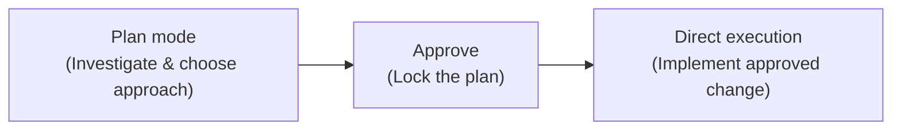
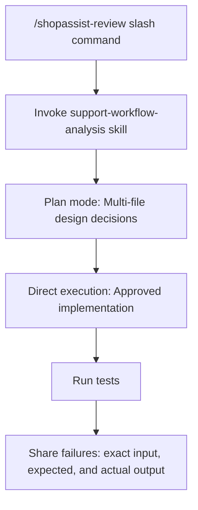

[00:00:00](https://www.udemy.com/course/claude-certified-architect-foundations-complete-course/learn/lecture/57042399#overview)


[00:00:16](https://www.udemy.com/course/claude-certified-architect-foundations-complete-course/learn/lecture/57042399#overview)


[00:00:26](https://www.udemy.com/course/claude-certified-architect-foundations-complete-course/learn/lecture/57042399#overview)

### Reusable Claude Code Workflows

- **Goal**: Make Claude Code useful for the whole team, not just one developer.
- **Five Ways to make Claude Code reusable**:
    - **Commands**: Shared & personal slash commands.
    - **Skills**: Structured, on-demand workflows.
    - **Plan mode**: Design before you build.
    - **Direct execution**: Ship small, clear changes fast.
    - **Refinement**: Examples, tests, focused feedback.

### Project-scoped Commands

- **How to share**: Create a file inside the `.claude/commands/` directory in the project repository.
    - Because it lives in the repo, it is shared via version control.
    - Every developer on the team gets the same command.
- **vs. User commands**:
    - User commands live in `~/.claude/commands/` (your home directory).
    - They are private to you and not shared with the team.

### Example: `shopassist-review`

- A single markdown file (`.claude/commands/shopassist-review.md`) gives the whole team a consistent review command.
- The command prompts for specific focus areas:
    - Refund logic & escalation behavior
    - Customer messaging
    - Missing tests
- **Output**: Returns findings with file paths, risk level, and suggested fixes.


[00:00:42](https://www.udemy.com/course/claude-certified-architect-foundations-complete-course/learn/lecture/57042399#overview)


[00:01:13](https://www.udemy.com/course/claude-certified-architect-foundations-complete-course/learn/lecture/57042399#overview)

### User-scoped Commands

- Live in the user's home directory under `~/.claude/commands/`
- **[Why use them?]** Because they are private to the individual and useful for personal workflows that shouldn't be shared with the team

### Skills

- Structured workflows used when a task is more complex than a simple command
- Live in the project folder under `.claude/skills/`
- Each skill is defined in a `SKILL.md` file
- **Example Skill Structure**:

```markdown
name: support-workflow-analysis
  description: Analyze refund, escalation & response behavior.
  context: fork
  allowed-tools: Read, Grep
  argument-hint: "path to changed workflow or PR summary"
```

    - `description`: Defines when the skill should run
    - `argument-hint`: Specifies what input to provide
    - `allowed-tools`: Limits what the skill is permitted to do
    - `context: fork`: Runs in isolation and returns a summary


[00:01:29](https://www.udemy.com/course/claude-certified-architect-foundations-complete-course/learn/lecture/57042399#overview)

### Skill Configuration Details

- **Safety through Tool Restriction**: For analysis-only skills, you can limit the scope of action by allowing only `Read` and `Grep` while omitting editing tools. This ensures the skill can inspect the codebase without making unauthorized changes.


[00:02:12](https://www.udemy.com/course/claude-certified-architect-foundations-complete-course/learn/lecture/57042399#overview)


[00:02:43](https://www.udemy.com/course/claude-certified-architect-foundations-complete-course/learn/lecture/57042399#overview)

### Skill Context and Personalization

- **`context: fork`**: Runs the skill in an isolated context
    - **[Why use it?]** Useful for verbose exploration, such as reading many files or comparing different alternatives
    - The main conversation receives a concise summary instead of being cluttered with all the discovery output
- **Personal Skills**: Can be created in the user home directory under `~/.claude/skills/`
    - **[Note]**: Use unique names to avoid conflicts with teammates or existing project skills

### Choosing Between CLAUDE.md and Skills

| Feature | CLAUDE.md | Skills |
| --- | --- | --- |
| Purpose | Always-loaded project knowledge | On-demand workflows |
| Examples | Coding standards, test commands, architecture rules, naming conventions | Security review, migration analysis, support workflow review, release notes |


[00:02:58](https://www.udemy.com/course/claude-certified-architect-foundations-complete-course/learn/lecture/57042399#overview)


[00:03:02](https://www.udemy.com/course/claude-certified-architect-foundations-complete-course/learn/lecture/57042399#overview)


[00:03:38](https://www.udemy.com/course/claude-certified-architect-foundations-complete-course/learn/lecture/57042399#overview)

### Execution Modes

#### Plan mode

- Used when the task is complex, multi-file, or architectural
    - Involves multiple possible solutions
    - Requires exploration, design, and approval before implementation
- **Example**: Refactoring a refund flow so that billing disputes, damaged items, and policy exceptions use separate decision paths

#### Direct execution

- Used for small, clear changes with one obvious path
    - Does not require a long planning phase
- **Example**: Adding a validation check so a refund amount cannot be negative

---

### A Strong Default Workflow

To keep discovery clean and maintain control, a robust workflow follows a sequence of investigation, approval, and then implementation:



- **[Tip]** Use an **Explore subagent** for noisy discovery tasks
    - It can inspect files, trace dependencies, and return a compact, structured map
    - **[Why?]** This keeps the main conversation clean by preventing it from being cluttered with verbose discovery output


[00:03:44](https://www.udemy.com/course/claude-certified-architect-foundations-complete-course/learn/lecture/57042399#overview)


[00:04:21](https://www.udemy.com/course/claude-certified-architect-foundations-complete-course/learn/lecture/57042399#overview)

### Using an Explore Subagent

- Ideal for "noisy" discovery tasks
    - It can inspect files, trace dependencies, and return a compact, structured summary
    - **[Why use it?]** This prevents the main conversation from being cluttered with verbose discovery output
- **Example Discovery Workflow**:
    - Use it to find where refund eligibility is calculated
    - Locate where customer responses are generated
    - Identify which tests cover specific scenarios (e.g., damaged items)
    - **Expected structured output**:
        - Refund logic location
        - Response generation location
        - Test coverage locations
        - Missing coverage details

### Refinement via Concrete Examples

- **[Principle]** Examples beat vague descriptions
- Instead of giving vague instructions like "improve refund classification," provide direct mappings of input to expected outcomes

| Input | Expected category |
| --- | --- |
| "I was charged twice." | billing dispute |
| "The item arrived broken." | damaged item |
| "I changed my mind after 45 days." | policy exception |


[00:04:29](https://www.udemy.com/course/claude-certified-architect-foundations-complete-course/learn/lecture/57042399#overview)


[00:04:45](https://www.udemy.com/course/claude-certified-architect-foundations-complete-course/learn/lecture/57042399#overview)

### Advanced Refinement Patterns

#### Test-driven iteration

- Write tests first, then let Claude implement the change
- **[Handling failure]** If a test fails, share the exact failure with Claude to provide a precise target for the next iteration
    - **Example failure message**:

```text
expected: escalation=true
      actual: false
```

#### Interview pattern

- Use this when the domain or requirements are unclear
- Instead of guessing, ask Claude to interview you first to gather the necessary context before it begins implementation

#### Focused feedback

- Use this to manage complex or interacting issues
- **[Strategy]** Break down feedback into specific, isolated messages rather than one large, multi-issue prompt
    - **Interacting issues** $\rightarrow$ one message
    - **Independent issues** $\rightarrow$ sequentially


[00:05:15](https://www.udemy.com/course/claude-certified-architect-foundations-complete-course/learn/lecture/57042399#overview)


[00:05:46](https://www.udemy.com/course/claude-certified-architect-foundations-complete-course/learn/lecture/57042399#overview)

### Summary of Claude Code Tooling

To optimize workflows, select the appropriate feature based on the scope and complexity of the task:

| Feature | Best Use Case |
| --- | --- |
| Project commands | Shared team workflows |
| User commands | Personal workflows |
| Skills | Structured, on-demand tasks |
| context: fork | Verbose or exploratory work |
| allowed-tools | To limit risk |
| Plan mode | For complex work |
| Direct execution | For simple work |


[00:05:58](https://www.udemy.com/course/claude-certified-architect-foundations-complete-course/learn/lecture/57042399#overview)


[00:06:22](https://www.udemy.com/course/claude-certified-architect-foundations-complete-course/learn/lecture/57042399#overview)

### The Practical Rule: Tool Selection Summary

| Tool / Feature | Best Use Case |
| --- | --- |
| Project commands | Shared team workflows |
| User commands | Personal workflows |
| Skills | Structured, on-demand tasks |
| context: fork | Verbose or exploratory work |
| allowed-tools | Limiting risk |
| argument hint | Making invocation clear |
| CLAUDE.md | Always-loaded standards |
| Plan mode | Complex work |
| Direct execution | Simple work |
| Explore subagent | Discovery |

---

### The ShopAssist Workflow: End-to-End Reusability

To ensure reliable results, combine reusable workflows, isolated exploration, the right execution mode, and tight iteration:




[00:06:45](https://www.udemy.com/course/claude-certified-architect-foundations-complete-course/learn/lecture/57042399#overview)

### Summary of Reliable Claude Code Usage

- Reliable usage is built on four pillars:
    - Reusable workflows
    - Isolated exploration
    - Right execution mode selection
    - Tight iteration

### The ShopAssist Workflow Example

An end-to-end workflow demonstrating these principles in practice: