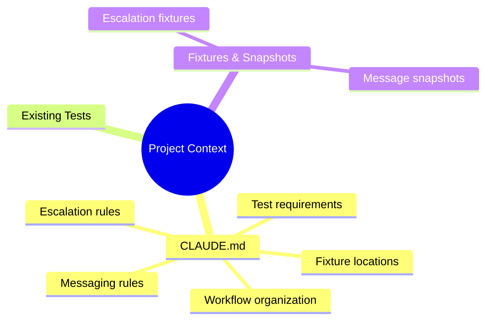
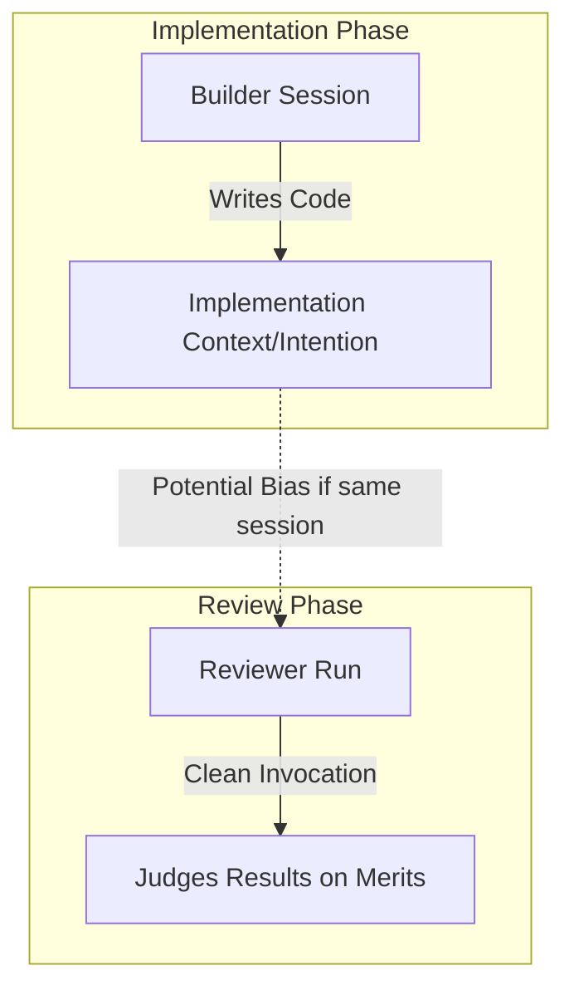
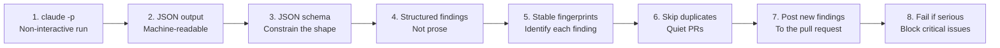

[00:00:00](https://www.udemy.com/course/claude-certified-architect-foundations-complete-course/learn/lecture/57042405#overview)


[00:00:25](https://www.udemy.com/course/claude-certified-architect-foundations-complete-course/learn/lecture/57042405#overview)

### Running Cloud Code in CI/CD Pipelines

- **[Interactive vs. CI Mode]**
    - Interactive mode is for developers in a terminal to ask questions, approve edits, and refine results through collaboration
    - CI mode is for automated jobs that must start, run, output, and finish without waiting for human conversation
    - Using interactive mode in CI will cause the pipeline to hang because it waits for follow-up input that never comes
- **Non-Interactive Execution (Print Mode)**
    - To prevent hanging, use the print mode command to ensure the process runs once and then exits
    - Command options:
        - `cloud -p`
        - `cloud --print`
    - **Workflow of Print Mode:**

        1. Start
        2. Run the prompt once
        3. Print the result
        4. Exit

```bash
$ claude -p \
"Review this pull request for ShopAssist.
Focus on refund logic, escalation, messaging, security, and missing tests.
Return only structured findings."

# -> prints result, then exits
```


[00:00:58](https://www.udemy.com/course/claude-certified-architect-foundations-complete-course/learn/lecture/57042405#overview)

### Machine-Readable Output

- **[Why use it?]** Because plain text is "fragile" for automation
    - To perform actions like posting GitHub comments, creating annotations, failing a build, or deduplicating findings, the CI needs structured data
- **JSON Output**
    - Use `--output-format json` to return findings as JSON
- **JSON Schema**
    - Use `--json-schema <filename>.json` to enforce a strict, parseable shape for the output

```bash
$ claude -p \
  --output-format json \
  --json-schema findings.json \
  "Review the pull request.
  Return an array of findings."

# -> machine-parseable output:
[
  { "severity": "high", ... },
  { "severity": "low", ... }
]
```


[00:01:28](https://www.udemy.com/course/claude-certified-architect-foundations-complete-course/learn/lecture/57042405#overview)


[00:01:39](https://www.udemy.com/course/claude-certified-architect-foundations-complete-course/learn/lecture/57042405#overview)


[00:02:09](https://www.udemy.com/course/claude-certified-architect-foundations-complete-course/learn/lecture/57042405#overview)

### The Finding Schema

- **[What each finding should contain]**
    - To be useful for automation, each finding in the JSON array should include:
        - `file path`: where the issue lives
        - `line number`: the exact location
        - `severity`: critical / high / med / low
        - `category`: type of issue
        - `message`: what's wrong
        - `suggested fix`: how to resolve it
        - `fingerprint`: a stable identifier

### Deduplication with Stable Fingerprints

- **[Why use a fingerprint?]** Because CI runs more than once
    - A PR might be updated with a new commit
    - A workflow might be re-run
    - Without a way to identify the same finding, Claude might repost the same comment every time, making the PR noisy
- **Generating a fingerprint**
    - A fingerprint is a hash created from specific finding attributes to ensure it remains stable across runs
    - Example components for a fingerprint:
        - File path
        - Line number
        - Category
        - Normalized message

```python
for each finding:
    fp = hash(path, line, category, msg)
    if fp in posted:
        skip
    else:
        post
```

| Scenario | Action | Result |
| --- | --- | --- |
| Finding already posted | Skip it | No duplicate comment |
| New fingerprint detected | Post to the pull request | New finding is reported |


[00:02:14](https://www.udemy.com/course/claude-certified-architect-foundations-complete-course/learn/lecture/57042405#overview)


[00:02:25](https://www.udemy.com/course/claude-certified-architect-foundations-complete-course/learn/lecture/57042405#overview)

### Providing Project Context to CI

- **[Why it's necessary]** A review is only as good as its context; Claude Code must compare the PR against real project behavior rather than evaluating code in isolation
- **Sources of context**
    - `CLAUDE.md`: A file used to explain project-specific logic, such as:
        - How workflows (e.g., refund workflows) are organized
        - Where support fixtures live
        - Which tests must be run
        - What constitutes an escalation
        - Customer messaging rules
    - **Existing tests**: Leveraging current test suites to validate behavior
    - **Fixtures & snapshots**: Using existing escalation fixtures and customer-message snapshots to provide a baseline for comparison




[00:02:58](https://www.udemy.com/course/claude-certified-architect-foundations-complete-course/learn/lecture/57042405#overview)


[00:03:09](https://www.udemy.com/course/claude-certified-architect-foundations-complete-course/learn/lecture/57042405#overview)

### Blocking checks vs. non-blocking reports

Deciding how strict a CI review should be typically involves choosing between two modes of operation:

#### Blocking pre-merge

- **[Purpose]** Used for high-confidence issues where a critical finding should cause the CI check to fail
- **Typical issues addressed:**
    - Security problems
    - Broken tests
    - Schema violations
    - Missing required fixtures
    - Dangerous production behavior

#### Non-blocking reports

- **[Purpose]** Runs overnight or on demand to inform rather than block; useful for broader oversight
- **Typical issues addressed:**
    - Code quality
    - Missing edge cases
    - Test suggestions
    - Duplication
    - Architecture concerns

| Mode | Timing/Action | Use Case | Examples |
| --- | --- | --- | --- |
| Blocking | Fails the check | High-confidence, critical issues | Security, broken tests, schema violations |
| Non-blocking | Overnight or on demand | Informational, broader review | Code quality, edge cases, architecture |


[00:03:45](https://www.udemy.com/course/claude-certified-architect-foundations-complete-course/learn/lecture/57042405#overview)


[00:03:59](https://www.udemy.com/course/claude-certified-architect-foundations-complete-course/learn/lecture/57042405#overview)

### The ShopAssist Pattern: Routing findings by severity

- **[Strategy]** Instead of blocking every PR, route findings based on their impact to balance speed and quality
- **Routing logic:**
        - **Critical & high severity**: Block the merge (fail the check); these must be fixed first
        - **Medium & low severity**: Post as PR comments to inform reviewers without blocking the merge
        - **Broader review**: Run overnight on a schedule for deeper quality and architecture passes

### Independent Review

- **[The Problem]** The session that generated the code is not the best reviewer for it
    - The **Builder session** holds all implementation context and intention, which can make the review weaker by introducing bias
    - A clean session judges the result on its merits rather than the reasoning behind it
- **The Reviewer run**
    - Should be a separate, clean invocation
    - Reads the repo, diff, `CLAUDE.md`, tests, and fixtures, but is not part of the original build conversation
- **Questions a fresh reviewer should ask:**
        - Does the code actually do what it claims?
        - Are tests missing?
        - Did the implementation introduce a regression?
        - Would this behavior be clear to another developer?




[00:04:29](https://www.udemy.com/course/claude-certified-architect-foundations-complete-course/learn/lecture/57042405#overview)


[00:04:56](https://www.udemy.com/course/claude-certified-architect-foundations-complete-course/learn/lecture/57042405#overview)

### The ShopAssist PR Review Pipeline

To automate the review process effectively, the pipeline follows these eight steps:




[00:05:14](https://www.udemy.com/course/claude-certified-architect-foundations-complete-course/learn/lecture/57042405#overview)


[00:05:22](https://www.udemy.com/course/claude-certified-architect-foundations-complete-course/learn/lecture/57042405#overview)

### The ShopAssist PR Review Pipeline

To implement an automated review workflow, follow these eight steps:

1. **`claude -p`**: Use a non-interactive run.
2. **JSON output**: Ensure the output is machine-readable.
3. **JSON schema**: Constrain the shape of the output.
4. **Structured findings**: Use structured data instead of prose.
5. **Stable fingerprints**: Identify each unique finding.
6. **Skip duplicates**: Keep Pull Requests quiet by not repeating findings.
7. **Post new findings**: Send findings to the pull request.
8. **Fail if serious**: Block the check only for critical issues.

---

### Interactive vs. CI Mode

> The key distinction: Interactive is for collaboration. CI is for repeatable automation.

| Feature | Interactive Mode | CI Mode |
| --- | --- | --- |
| Execution | Human-in-the-loop | Non-interactive (claude -p / --print) |
| Output | Natural language/Prose | Structured JSON (constrained by schemas) |
| Context | Conversation-based | Project context (CLAUDE.md, tests, fixtures) |
| Review Style | Collaborative | Independent review (separate, clean session) |
| Handling Findings | Discussion | Automated (skip duplicates, fail on serious issues) |


[00:05:59](https://www.udemy.com/course/claude-certified-architect-foundations-complete-course/learn/lecture/57042405#overview)

### Summary: Interactive vs. CI Mode

- **[The Key Distinction]**
    - **Interactive Mode**: Designed for human-in-the-loop collaboration, where the developer provides real-time feedback and guidance.
    - **CI Mode**: Designed for repeatable, automated processes where the tool must operate autonomously without human intervention.