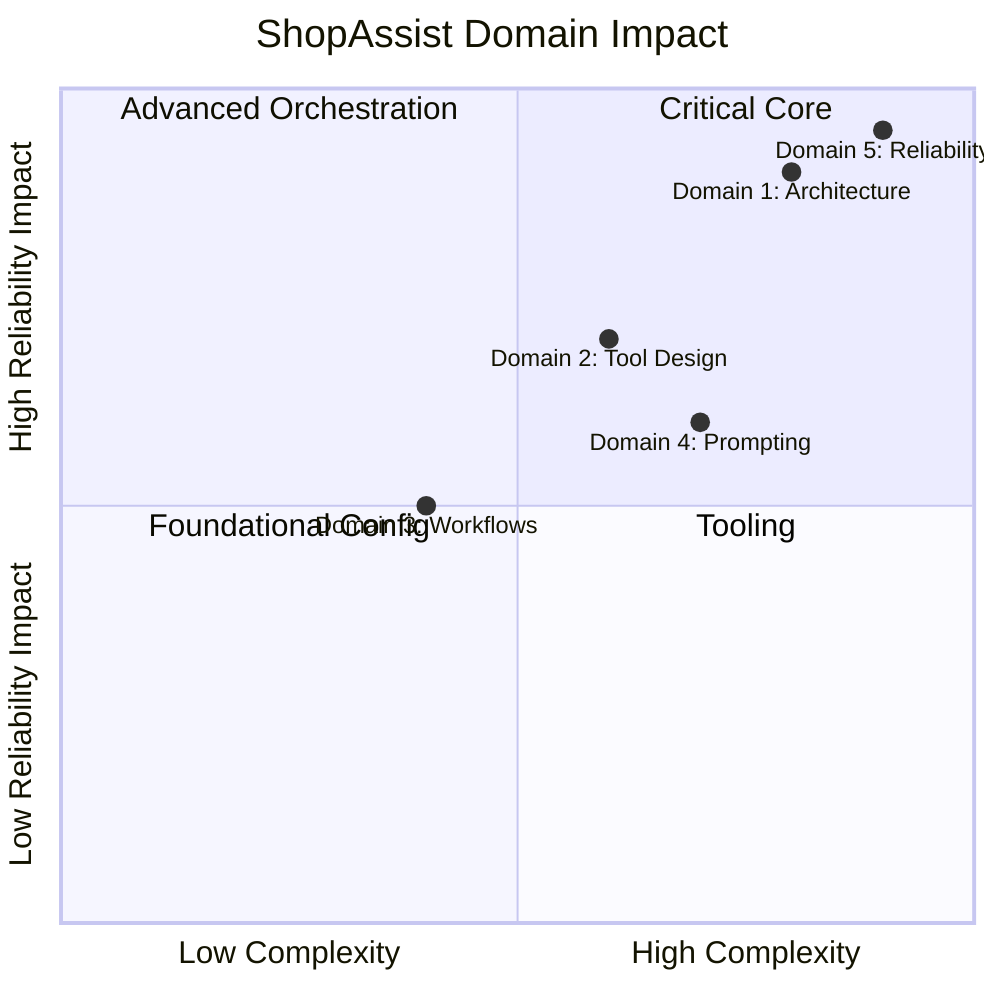

[00:00:05](https://www.udemy.com/course/claude-certified-architect-foundations-complete-course/learn/lecture/57042417#overview)


[00:00:23](https://www.udemy.com/course/claude-certified-architect-foundations-complete-course/learn/lecture/57042417#overview)

## Reliability Patterns & Final Exam Mapping

- Bringing ShopAssist together as a production-style Claude architecture
- **ShopAssist Components:**
    - Prompts
    - Tools
    - Structured output
    - Validation
    - Agentic workflows
    - Claude Code config
    - CI review
    - Reliability patterns

### Escalation: The Wrong Signal

- Do not escalate just because a customer sounds angry
- **[Why?]** Sentiment is useful context, but it is not a reliable signal of case complexity
- **Frustrated&#32;**$\neq$**&#32;complex**
    - A frustrated customer may just have a simple return request that an agent can solve immediately
- **Calm&#32;**$\neq$**&#32;simple**
    - A calm customer may present issues requiring escalation, such as:
        - Policy exceptions
        - Identity ambiguity
        - Financial risk


[00:00:41](https://www.udemy.com/course/claude-certified-architect-foundations-complete-course/learn/lecture/57042417#overview)


[00:01:09](https://www.udemy.com/course/claude-certified-architect-foundations-complete-course/learn/lecture/57042417#overview)

### Escalation: Explicit Triggers

- **[Why?]** To ensure reliability, escalation should be based on rules, not mood
- **Explicit request**
    - If the customer asks for a human, honor it immediately
- **Policy gap**
    - Escalate when the policy is missing, ambiguous, or does not cover the request
- **No progress**
    - Escalate when the agent cannot make meaningful progress
- **Ambiguous results**
    - Escalate or ask for clarification when backend results are ambiguous (e.g., multiple customer matches)

### Escalation: The Golden Rule

- **If they ask for a human, honor it**
- **[The Right Way]**
    - Respond with: "I can connect you with a specialist. First I'll summarize the issue so they have context."
    - Honor the request, summarize, and do not stall
- **[The Wrong Way]**
    - Attempting to force more automated investigation first (e.g., "Let me first check your order...")


[00:01:28](https://www.udemy.com/course/claude-certified-architect-foundations-complete-course/learn/lecture/57042417#overview)


[00:01:41](https://www.udemy.com/course/claude-certified-architect-foundations-complete-course/learn/lecture/57042417#overview)


[00:02:00](https://www.udemy.com/course/claude-certified-architect-foundations-complete-course/learn/lecture/57042417#overview)

### Ambiguity: Identity Resolution

- **[Why?]** Heuristics create risk when the system returns multiple matches for the same name
- **The Wrong Way (Guessing)**
    - Choosing the "most recent account" automatically
- **The Right Way (Clarify)**
    - Ask for a specific identifier (e.g., email or order number)
    - **Exam Pattern:** When identity, permissions, or financial actions are involved, do not use heuristics — clarify, verify, or escalate

### Error Propagation

- **The Problem:** In a multi-agent system, weak errors cause failures to disappear, stranding the coordinator
- **Weak Error Response**
    - Example: "Search unavailable"
    - Gives the coordinator no context to recover
- **Structured Error Response**
    - Includes `failure_type`, `attempted_query`, `partial_results`, and `alternatives`
    - **[Why?]** Gives the coordinator enough context to decide the next step
- **Coordinator Options with Structured Errors:**
    - Retry locally
    - Ask the customer for missing info
    - Continue with partial results
    - Escalate to a human

```python

# Structured error example from the slide
{
  "failure_type": "timeout",
  "attempted_query": "damaged_item",
  "partial_results": {
    "policy_page": "found",
    "order_history": "unavailable"
  },
  "alternatives": [
    "retry_lookup",
    "ask_for_order_ID",
    "escalate"
  ],
  "is_retryable": true
}
```


[00:02:12](https://www.udemy.com/course/claude-certified-architect-foundations-complete-course/learn/lecture/57042417#overview)


[00:02:20](https://www.udemy.com/course/claude-certified-architect-foundations-complete-course/learn/lecture/57042417#overview)


[00:02:51](https://www.udemy.com/course/claude-certified-architect-foundations-complete-course/learn/lecture/57042417#overview)

### Recovery Semantics

- **The Hierarchy of Recovery**
    - **Local recovery first:** A sub-agent should attempt to retry transient failures locally
    - **Coordinator propagation second:** If local recovery fails, propagate a structured error to the coordinator
- **Distinguishing Failure Types**
    - **Valid empty result:** The query succeeded, but no matching record was found
    - **Access failure:** The system could not reach the data source (requires different decision logic than an empty result)

### Provenance

- **Definition:** A reliable system must preserve the source/origin of important claims to ensure trustworthiness.


[00:02:58](https://www.udemy.com/course/claude-certified-architect-foundations-complete-course/learn/lecture/57042417#overview)


[00:03:21](https://www.udemy.com/course/claude-certified-architect-foundations-complete-course/learn/lecture/57042417#overview)

### Provenance Implementation

- **Maintain claim-source mappings:** A polished summary is insufficient; the system must explicitly link claims back to their origins
    - **[Why?]** Summarization processes often compress multiple sources into one, which can inadvertently drop attribution
    - If a synthesis agent loses these links, it can no longer verify the underlying claims, resulting in a reliability failure

```text
claim: item eligible for refund
source: return policy, damaged-items section

claim: delivered 12 days ago
source: order database

claim: product arrived broken
source: customer message
```

### Handling Conflicting Sources

- **Preserve the conflict — don't silently pick:** If two sources provide different information, the agent should not randomly choose one
    - **Example:** A standard return policy might state "30 days," while a newer support memo allows "45 days" for damaged items
- **Strategy for resolving/presenting conflict:**
    - **Annotate the conflict:** Explicitly show that multiple values exist
    - **Include dates:** Use temporal context (e.g., a 2024 policy vs. a 2026 memo) because newer sources often supersede older ones
    - **Escalate if money/policy is involved:** If the conflict affects financial decisions or official policy, move the decision to a human


[00:03:42](https://www.udemy.com/course/claude-certified-architect-foundations-complete-course/learn/lecture/57042417#overview)


[00:03:47](https://www.udemy.com/course/claude-certified-architect-foundations-complete-course/learn/lecture/57042417#overview)


[00:04:08](https://www.udemy.com/course/claude-certified-architect-foundations-complete-course/learn/lecture/57042417#overview)

### Temporal Context in Conflicts

- **Newer sources may supersede older ones:** A conflict between a 2024 policy and a 2026 memo might not be a true contradiction
    - The system should use these dates to determine which information is currently authoritative

### Content Rendering

- **Match the format to the content:** Don't force every result into the same shape; use the structure that best suits the data type
- **Recommended formats:**
        - Financial comparisons $\rightarrow$ Tables
        - Policy reasoning $\rightarrow$ Structured bullets
        - Customer replies $\rightarrow$ Clear prose
        - Technical review findings $\rightarrow$ Include file paths, severity, and suggested fixes

### ShopAssist Certification Mapping

- **Domain 1: Agentic Architecture and Orchestration**
        - Uses an agentic loop, tool calls, and handoffs
        - Employs sub-agents where useful
        - Implements deterministic enforcement for critical steps (e.g., customer verification before processing refunds)
- **Domain 2: Tool Design & MCP**
        - Involves `get_customer`, `lookup_order`, and `process_refund` tools
        - Manages clear boundaries and structured errors


[00:04:28](https://www.udemy.com/course/claude-certified-architect-foundations-complete-course/learn/lecture/57042417#overview)

### ShopAssist Certification Mapping (Continued)

- **Domain 3: Cloud Code Configuration and Workflows**
    - Utilizes `cloud.md` for configuration
    - Employs slash commands and skills
    - Features plan mode, direct execution, and session management
    - Includes CI review processes
- **Domain 4: Prompt Engineering and Structured Output**
    - Uses explicit criteria and few-shot examples to guide models
    - Implements JSON schemas for consistent output formats
    - Employs validation and retry loops to ensure accuracy
    - Generates structured findings
- **Domain 5: Context Management and Reliability**
    - Preserves context throughout the interaction
    - Implements safe escalation procedures
    - Handles error propagation
    - Tracks provenance to maintain claim-source mappings
    - Incorporates human review for critical edge cases




[00:05:12](https://www.udemy.com/course/claude-certified-architect-foundations-complete-course/learn/lecture/57042417#overview)


[00:05:35](https://www.udemy.com/course/claude-certified-architect-foundations-complete-course/learn/lecture/57042417#overview)

### Certification Exam Weighting

- **Domain 1 (Agentic Architecture)**: The largest portion of the exam
- **Domains 3 (Cloud Code) & 4 (Prompting)**: Also heavily represented
- **Domain 2 (Tool Design & MCP)**: Focused on tools and Model Context Protocol
- **Domain 5 (Context & Reliability)**: Smaller percentage of direct questions, but critical because it underpins many scenario-based questions across all domains

---

### Exam-Style Scenario: Resolving Policy Conflicts

**Scenario:** A customer requests a refund because they were told they were eligible, but the bot denies them. They explicitly request a human if the issue cannot be resolved.

**The Facts:**

- **Customer Claim:** "I need a refund. Your site said I was eligible, but the bot says I am not. I want a human if this cannot be fixed."
- **Order Status:** Order exists
- **Standard Policy:** 30-day refund window
- **Current State:** Customer is at day 42
- **New Information:** An internal memo specifies exceptions up to 45 days (human specialist only)

**Potential Responses:**

- **A. Deny**: Incorrect, as it ignores the newer source (the memo)
- **B. Approve**: Incorrect, as it applies an exception without the required authority
- **C. Explain, preserve, escalate**: The preferred behavior
    - **Explain**: Address the conflict between the site and the bot
    - **Preserve**: Maintain the context of the conflict and the customer's request
    - **Escalate**: Route to a human as requested and as required by the memo for exceptions
- **D. Trust confidence > 80%**: Incorrect, as self-reported confidence does not override business risk or specific policy requirements


[00:05:57](https://www.udemy.com/course/claude-certified-architect-foundations-complete-course/learn/lecture/57042417#overview)

### Case Study: Policy Conflict Resolution

**Scenario Details:**

- **Customer Request:** "I need a refund. Your site said I was eligible, but the bot says I am not. I want a human if this cannot be fixed."
- **Contextual Facts:**
    - Order exists
    - Standard policy: 30-day refund window
    - Current state: Customer is at day 42
    - Internal memo: Exceptions for damaged items can be reviewed up to 45 days, but **only by a human specialist**

**Analysis of Response Options:**

| Option | Action | Result | Why it fails/succeeds |
| --- | --- | --- | --- |
| A | Deny | Ignores the newer source | Fails to account for the 45-day exception memo |
| B | Approve | Applies exception without authority | Fails because only a human specialist has the authority to grant this exception |
| C | Explain, preserve, escalate | Conflict + money + human requested | Correct: Addresses the conflict, preserves provenance of both sources, and routes to the required human specialist |
| D | Trust confidence > 80% | Relies on self-reported confidence | Fails because high model confidence is insufficient for managing business risk |

**Key Takeaway:**

- **Option C** is the best behavior because it preserves **provenance** (the history and source of the conflicting information) while respecting the authority boundaries defined in the policy.


[00:06:43](https://www.udemy.com/course/claude-certified-architect-foundations-complete-course/learn/lecture/57042417#overview)

### Core Mindset for Reliable Cloud Systems

- A reliable system is defined by its architectural behavior in the face of uncertainty
- It must know when to:
    - Act
    - Ask
    - Stop
    - Escalate