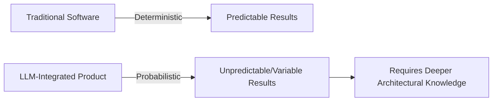

[00:00:03](https://www.udemy.com/course/claude-certified-architect-foundations-complete-course/learn/lecture/57765999#overview)

## Why Claude, and Where Deterministic Thinking Breaks

- **The prevalence of Cloud focus**
    - Developers are heavily focused on Cloud technology and certifications
    - There is a common question regarding the "magic" of Cloud and why it is prioritized over specific platforms like OpenAI or Gmail
- **Perspective on Cloud technology**
    - Cloud is viewed as a tool used on a daily basis rather than just a field for specialists
    - The approach to cloud usage may not be agnostic

[00:00:45](https://www.udemy.com/course/claude-certified-architect-foundations-complete-course/learn/lecture/57765999#overview)

### Claude in Professional Workflows

- **Usage of various AI models**
    - ChatGPT and Gemini are used for daily tasks
- **Claude's specific advantages**
    - Holds a very strong position in coding tasks
    - Highly effective for enterprise-level solutions
    - Currently used in production projects
- **Transferability of skills**
    - Knowledge obtained from creating Claude automations can be applied to other AI models without issues

[00:02:01](https://www.udemy.com/course/claude-certified-architect-foundations-complete-course/learn/lecture/57765999#overview)

### Personal Experience with Claude Code

- **Evolution of model performance**
    - Initial results could be strange or suboptimal
    - At times, implementing a solution from scratch felt faster than correcting the model
    - Recent iterations have shown significant improvement in quality and reliability
- **Enabling new capabilities**
    - Used Claude to build two mobile applications
    - Successfully completed tasks outside of previous experience/expertise
    - **[Key Insight]** Success comes from combining AI assistance with an understanding of the underlying technical background, even if the specific tech stack is unfamiliar

[00:02:15](https://www.udemy.com/course/claude-certified-architect-foundations-complete-course/learn/lecture/57765999#overview)

### The Quality of AI-Generated Code

- **Surprising quality of results**
    - There are moments where the AI-generated code is of unexpectedly high quality
- **The concept of "White Coding"**
    - A joke/observation regarding how AI can inadvertently "white code" vulnerabilities into software
    - **[Implication]** This creates a continuous demand for cybersecurity professionals to identify and fix these AI-introduced flaws

[00:02:59](https://www.udemy.com/course/claude-certified-architect-foundations-complete-course/learn/lecture/57765999#overview)

### Transitioning from AI Helper to Product Integration

- **Shift in AI usage**
    - Moving beyond using AI as a "coach" or helper for daily routines
    - Integrating LLMs directly into the product and its automation workflows
- **The breakdown of deterministic approaches**
    - Traditional software development relies on deterministic logic (predictable inputs and outputs)
    - **[The Problem]** LLMs are probabilistic systems
        - You cannot always predict exactly what results they will return
        - This uncertainty means standard deterministic approaches no longer work
- **Requirement for deeper technical knowledge**
    - Integrating probabilistic systems requires more than just a software developer or architect background
    - Developers must understand the underlying architecture more deeply to manage the unpredictable nature of LLM outputs

### The Necessity of Deep Technical Knowledge

- **The limits of AI assistance**
    - There is a threshold where AI alone is insufficient for building complex systems
    - **[Key Insight]** To successfully build a system, one must possess specific, deep-level knowledge of the architecture and the domain
- **Bridging the gap between AI and Architecture**
    - While AI can handle implementation details, the developer must provide the high-level structural guidance
    - Relying on AI without understanding the underlying principles leads to a lack of control over the system's design