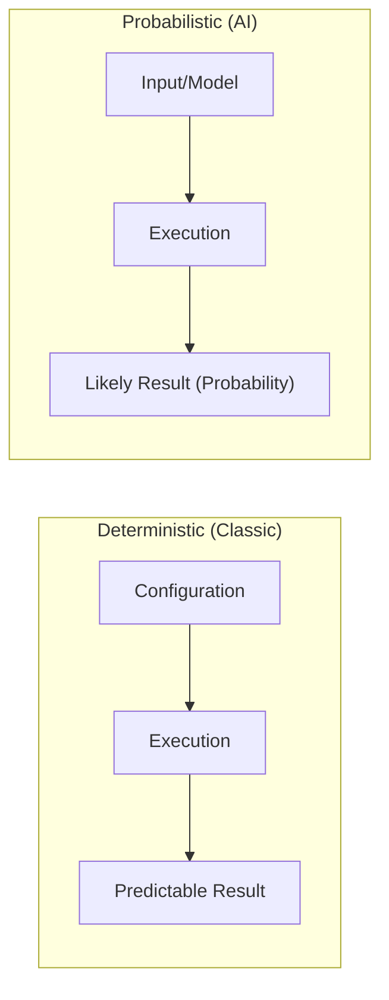

[00:00:00](https://www.udemy.com/course/claude-certified-architect-foundations-complete-course/learn/lecture/57766011#overview)

[00:00:02](https://www.udemy.com/course/claude-certified-architect-foundations-complete-course/learn/lecture/57766011#overview)

[00:00:04](https://www.udemy.com/course/claude-certified-architect-foundations-complete-course/learn/lecture/57766011#overview)

### Cloud Architect Exam Experience

- Personal preparation took a significant amount of time
    - Estimated at least a couple of weeks of dedicated study
- Motivation for course creation
    - The course was developed to help others avoid the excessive time spent on self-preparation

[00:00:44](https://www.udemy.com/course/claude-certified-architect-foundations-complete-course/learn/lecture/57766011#overview)

### Exam Preparation and Question Style

- Challenges in preparation
    - Much of the learned material was not actually relevant to the certification
    - This led to the creation of a tool designed to focus exclusively on certification-specific questions
- Surprising nature of exam questions
    - Questions often present several technically correct answers
    - The core task is to select the single best answer
    - **[Real-world connection]** This process of choosing the best option among valid ones mirrors actual professional decision-making

[00:01:33](https://www.udemy.com/course/claude-certified-architect-foundations-complete-course/learn/lecture/57766011#overview)

### Traditional vs. AI Certifications

- **Classic Enterprise Certifications (e.g., Adobe Certified Master)**
    - Based on a **deterministic** approach
    - Characterized by classic architecture where you configure specific components
    - If everything is configured properly, the system works as expected
- **AI Certifications**
    - Based on a **probabilistic** nature
    - Unlike deterministic systems, outcomes are based on probabilities rather than fixed, predictable configurations

[00:02:14](https://www.udemy.com/course/claude-certified-architect-foundations-complete-course/learn/lecture/57766011#overview)

### Practical Shifts Post-Exam

- **Evolution of Evaluation**
    - **Before exam preparation:** Evaluation was treated as simple test cases (e.g., checking if a solution works or not)
    - **After exam preparation:** Realized that evaluation is a much deeper and more complex requirement than just verifying functional correctness

[00:03:01](https://www.udemy.com/course/claude-certified-architect-foundations-complete-course/learn/lecture/57766011#overview)

### Advanced Evaluation Frameworks

- Moving beyond functional correctness
    - Instead of just checking if a solution works or fails, the focus shifts to measuring how *good* the result is
- Implementing grading systems
    - Use LLM grading to quantify the quality of the output
- **[Practical shift]** This transition from binary test cases to qualitative measurement is a direct result of insights gained from exam preparation

### Practical Shifts in AI Implementation

- **Context Management**
    - Identified as a key area where practical approaches were refined after the exam

[00:03:48](https://www.udemy.com/course/claude-certified-architect-foundations-complete-course/learn/lecture/57766011#overview)

[00:04:26](https://www.udemy.com/course/claude-certified-architect-foundations-complete-course/learn/lecture/57766011#overview)

### Context Management

- Moving toward more curated approaches
    - Exam preparation helped identify new, structured ways to handle context management beyond previous methods

### Value of Structured Exam Preparation

- **[Methodology]** Provides a structured framework to understand industry best practices
- **[Self-Assessment]** Acts as a tool to expose specific knowledge gaps (e.g., evaluation techniques)
- **[Product Impact]** Applying these structured insights directly improves implementation outcomes:
    - Increased reliability
    - Improved stability
    - Higher overall quality