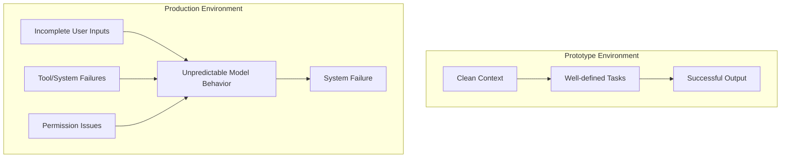

[00:00:04](https://www.udemy.com/course/claude-certified-architect-foundations-complete-course/learn/lecture/57766023#overview)

### AI Architecture Misconceptions

- The biggest misconception is bringing a deterministic mindset from traditional software engineering
    - Traditional software follows predictable, deterministic paths
    - AI architecture is fundamentally probabilistic
- **[Why this matters]** Because you can never know exactly what an LLM will return
    - This unpredictability requires a different approach to design
    - Engineers must account for this uncertainty when thinking about permissions and model capabilities

[00:00:42](https://www.udemy.com/course/claude-certified-architect-foundations-complete-course/learn/lecture/57766023#overview)

### Managing AI Capabilities and Risks

- **[Defining boundaries]** Instead of just focusing on what a model *can* do, architects must decide what it *should* be allowed to do
    - This involves defining strict permissions for model actions
- **[Human-in-the-loop]** For high-risk or sensitive operations, a human must be part of the process to prevent mistakes
    - Example: Preventing accidental or unauthorized refunds

### From Demo to Production

- A successful AI demo only proves that a model is capable of a specific task
- **[The Production Gap]** Building a production-ready system requires much more than just a functional model

[00:01:27](https://www.udemy.com/course/claude-certified-architect-foundations-complete-course/learn/lecture/57766023#overview)

### The Prototype-to-Production Failure Gap

- **[The core issue]** Prototypes often operate in an idealized environment that doesn't reflect real-world usage
    - Prototypes work well with "clean" context and well-defined tasks
    - Production environments introduce unpredictable variables
- **Common failure points in production**
    - Incomplete or messy user inputs
    - Tool/function failures
    - Permission and authorization issues

[00:02:30](https://www.udemy.com/course/claude-certified-architect-foundations-complete-course/learn/lecture/57766023#overview)

### Handling Unpredictable User Inputs

- **[The Reality of User Behavior]** Users rarely provide a single, clean request; they often bundle multiple, distinct intents into one interaction
    - An AI assistant must be architected to parse and process these interleaved requests rather than expecting a 1:1 ratio of request to response
- **Example: The Multi-Intent Request**
    - Instead of one task, a customer might ask for three things simultaneously:

        1. Process a refund
        2. Check an order status
        3. Inquire about a new product's price

    - The system must be robust enough to identify, separate, and execute all these distinct actions correctly