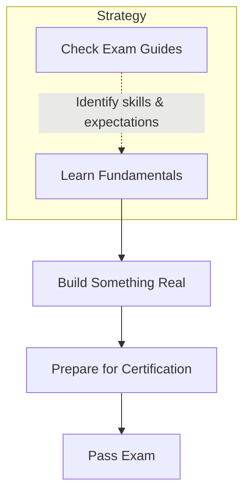

[00:00:03](https://www.udemy.com/course/claude-certified-architect-foundations-complete-course/learn/lecture/57766039#overview)

### The Five-Year View: Which Skills Keep Their Value

- **Long-term value of Cloud Certifications**
    - The knowledge gained is expected to remain helpful for at least five years and beyond
    - Certifications may eventually transition from being a "big thing" to a basic industry requirement
- **Generative AI (GenAI) Hype**
    - Current hype around GenAI is significant, but the core knowledge remains a worthwhile pursuit

[00:00:43](https://www.udemy.com/course/claude-certified-architect-foundations-complete-course/learn/lecture/57766039#overview)

### The Value of Certification Preparation

- The primary benefit is the knowledge and experience gained during the study process
    - This expertise is expected to remain valuable for at least five years
- Encouragement for developers to pursue exams as a way to learn new things

### Transitioning to Architecture

- Moving from software engineering into an architecture role

[00:01:53](https://www.udemy.com/course/claude-certified-architect-foundations-complete-course/learn/lecture/57766039#overview)

### Practical Roadmap for Skill Acquisition

- **Recommended Learning Path**
    - Learn the fundamentals first
    - Build something real
        - Apply learning to your current work
        - Or build personal projects for hands-on experience
    - Prepare for and pass certifications
- **How to Start**
    - Check exam guides for relevant certifications
    - **[Why?]** Guides reveal exactly what the industry (e.g., Anthropic) expects from specific roles
        - Helps identify which skills to prioritize
        - Provides a clear baseline for AI Developer and AI Architect roles

[00:02:13](https://www.udemy.com/course/claude-certified-architect-foundations-complete-course/learn/lecture/57766039#overview)

### Essential Skills for AI Architecture

- **Core Technical Competencies**
    - LLM fundamentals
    - Application engineering
    - Agentic workflows
- **Dual Application of AI**
    - Using AI as a core part of the product itself
    - Using AI as part of the product implementation process

### Emerging Trends

- **AI SDLC (AI-assisted Software Development Life Cycle)**
    - Using AI to assist in the development and implementation of software
    - Predicted to be a major trend for the next 12 months
    - Currently considered an underrated skill area

[00:02:59](https://www.udemy.com/course/claude-certified-architect-foundations-complete-course/learn/lecture/57766039#overview)

[00:03:24](https://www.udemy.com/course/claude-certified-architect-foundations-complete-course/learn/lecture/57766039#overview)

### Overhyped vs. Underrated Skills

- **Prompt Engineering**
    - Currently considered overhyped as a standalone profession
    - **[Why?]** While prompting remains a vital skill, it is increasingly becoming an integrated part of the work performed by AI engineers and AI architects rather than a separate role