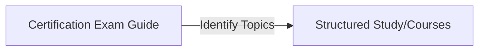

[00:00:03](https://www.udemy.com/course/claude-certified-architect-foundations-complete-course/learn/lecture/57766045#overview)

## Starting an Engineering Career Over

- Avoid jumping between random YouTube tutorials and long, unstructured courses
- **[Recommended Roadmap]**
    - Use a certification exam guide as a roadmap
    - Study the specific topics identified in that roadmap
    - Use courses to reinforce those specific topics

[00:00:55](https://www.udemy.com/course/claude-certified-architect-foundations-complete-course/learn/lecture/57766045#overview)

### Applying Knowledge and Long-Term Career Stability

- **[Practical Application]** Build real, practical products to gain hands-on experience
    - Once basic knowledge and practical experience are established, aim to pass exams or build things in a production environment
- **[Maintaining Career Relevance]** Focus on basic knowledge to avoid skill obsolescence
    - Avoid over-specializing in vendor-specific, cloud-specific, or domain-specific tools
    - **[Why?]** Models and specific technologies change rapidly; fundamental knowledge remains stable

[00:01:28](https://www.udemy.com/course/claude-certified-architect-foundations-complete-course/learn/lecture/57766045#overview)

### Future-Proofing AI Skills

- **[Core Focus]** Prioritize fundamental concepts over vendor-specific or model-specific knowledge
    - Models change rapidly and popularity is transient
    - **[Durable Skills]** Focus on areas that remain relevant for years:
        - Context management
        - Reliability
        - Evaluation

### Learning Through Real-World Application

- Using real applications (e.g., a shop assistant project) is superior to teaching topics in isolation
    - **[Why?]** It is the best way to understand how theoretical knowledge is actually applied in a practical context

[00:02:14](https://www.udemy.com/course/claude-certified-architect-foundations-complete-course/learn/lecture/57766045#overview)

[00:02:31](https://www.udemy.com/course/claude-certified-architect-foundations-complete-course/learn/lecture/57766045#overview)

### The Value of Practical Learning

- **[Why apply knowledge?]** Pure theory is difficult to retain
    - Seeing how knowledge is applied in practice is the best way to learn
    - Practical application makes information easier to remember and understand