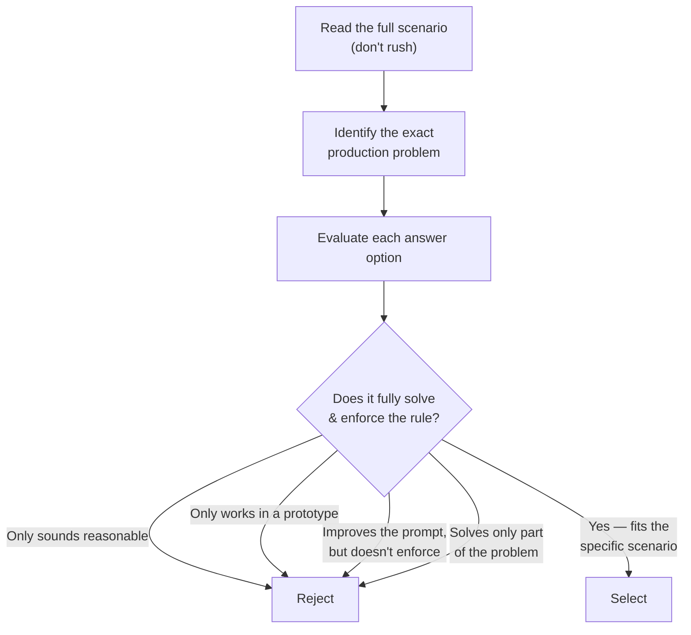
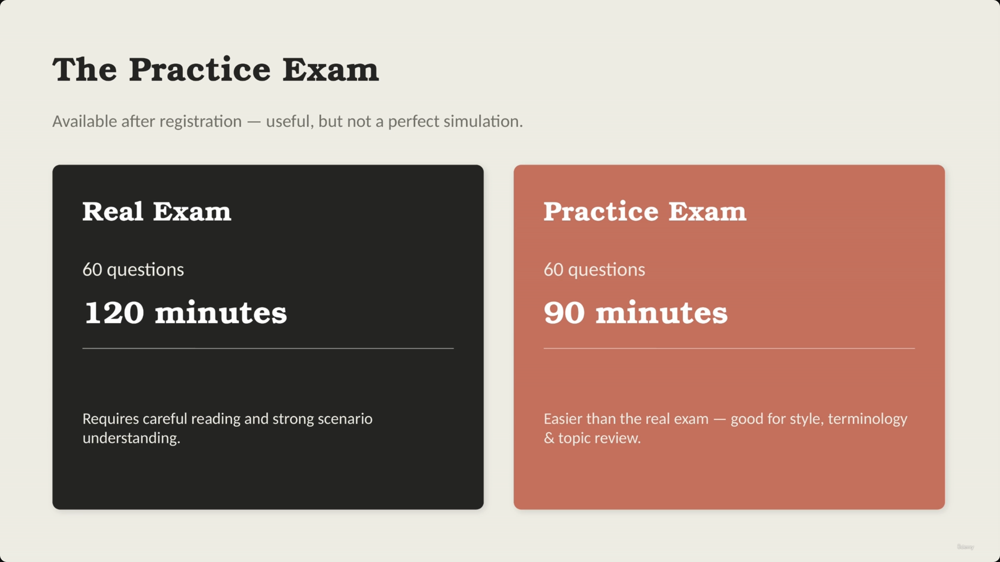
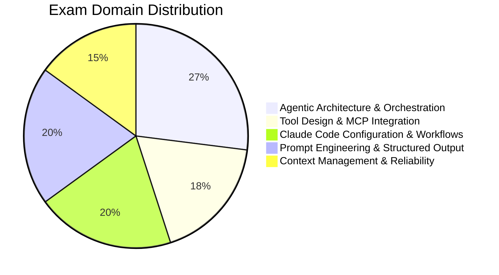
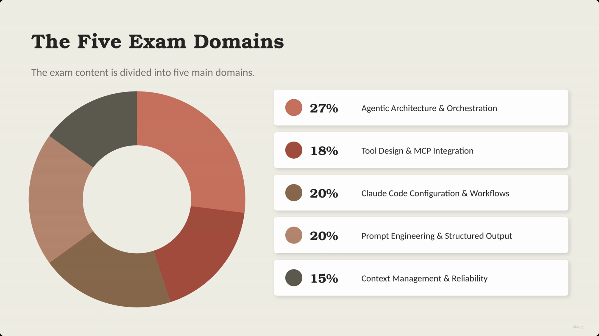
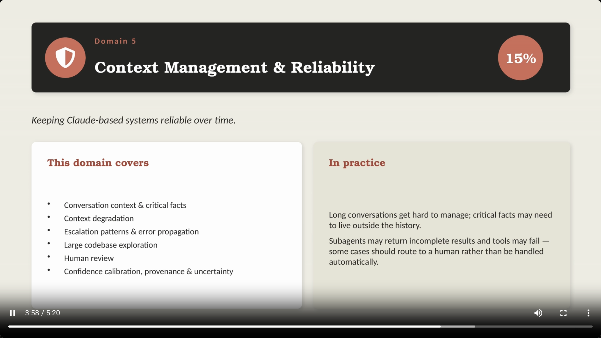
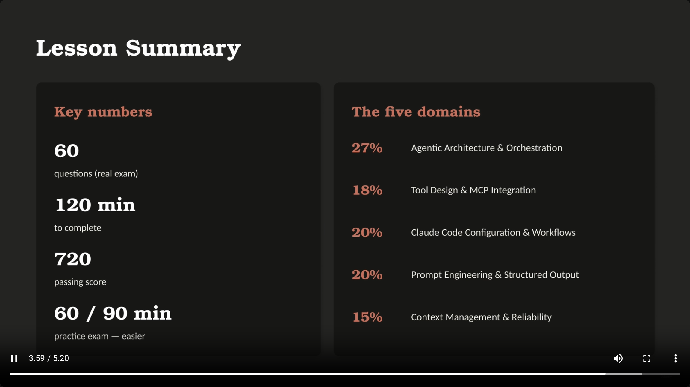

# Claude Certified Architect Foundations — Exam Format

> This lecture covers the logistics of the real exam and the practice exam, how scoring works, and how the exam content breaks down across five domains. The recurring theme: the exam is scenario-driven, not definition-driven — wrong answers are often *plausible*, not obviously wrong.

## Exam Logistics

- **60 questions total**
- **120 minutes** to complete
- **~2 minutes per question**, on average
- **Answer structure:** typically **1 correct answer and 3 incorrect answers**
- **[Caution]** Incorrect answers are not always obviously wrong. They may:
  - Sound reasonable
  - Work in a simple prototype
  - Improve the prompt but not enforce the rule
  - Solve only part of the problem

> **Transcript color:** "When you read an exam question, do not rush. Read the full scenario. Pay attention to the exact problem. And then choose the answer that best fits the production situation described in the question."

### How to approach a question

---

## The Practice Exam

- Available **after registration**
- **[Purpose]** Useful for reviewing style, terminology, and specific topics
- Based on the instructor's experience, it is **easier than the real exam** — not a perfect difficulty simulation

| Feature | Real Exam | Practice Exam |
|---|---|---|
| Questions | 60 | 60 |
| Time Limit | 120 minutes | 90 minutes |
| Difficulty | Requires careful reading and strong scenario understanding | Easier than the real exam |

**Useful for:**
- Getting familiar with question style
- Checking terminology
- Identifying topic areas that require more review

- **[Caution]** If the practice exam feels easy, remember the real exam requires more careful reading and deeper scenario understanding

> **Transcript color:** "I would not treat it as a perfect simulation of the real exam difficulty... if the practice exam feels comfortable, remember that the real exam may still require more careful reading and stronger understanding of the scenarios."

---

## Scoring

- Results are reported as a simple **Pass / Fail**
- The score is calculated on a **scaled range from 100 to 1000**
- **Passing score: 720**

| Metric | Value |
|---|---|
| Scaled score range | 100–1000 |
| Passing score | 720 |
| Result format | Pass / Fail |

---

## Exam Content Domains

The exam content is divided into five main domains:

### Domain 1 — Agentic Architecture & Orchestration (27%)

- The **largest domain** on the exam
- **Core topics:**
  - Agentic loops
  - Multi-agent systems
  - Orchestration
  - Coordinator and sub-agent patterns
  - The Task tool, and hooks
  - Session state
  - Resumption
  - Workflow design
- **[In simple terms]** This domain focuses on how Claude-based systems perform multi-step work

> **Transcript color:** "In simple terms, this domain is about how cloud-based systems perform multi-step work."

*Note: no dedicated title-card screenshot exists for Domain 1 — the capture tool appears to have skipped straight from the domains pie chart to the Domain 2 slide (see below).*

---

### Domain 2 — Tool Design & MCP Integration (18%)

- **[Purpose]** Focuses on how Claude connects to external systems, designed carefully
- **This domain covers:**
  - Tool schemas & descriptions
  - MCP tools and MCP resources
  - Structured tool errors
  - Retryable vs. non-retryable failures
  - Tool distribution across agents
  - Built-in tools: `Read`, `Write`, `Edit`, `Bash`, `Grep`, `Glob`

> **[Slide detail]** The "In practice" panel gives a concrete example not spoken in the transcript or written in the original bullets: *"Claude may need to look up an order, check a customer profile, search internal docs, or call a backend service. Good design means: a clear tool name, a useful description, a precise schema, and a result structured enough to reason about."*

---

### Domain 3 — Claude Code Configuration & Workflows (20%)

- **[Purpose]** Focuses on using Claude Code inside a real development environment
- **Core topics:**
  - `CLAUDE.md` file & instruction hierarchy
  - Custom slash commands & skills
  - Path-specific rules
  - Plan mode vs. direct execution
  - Iterative refinement
  - CI/CD workflows

> **[Slide detail]** The "In practice" panel adds framing not in the transcript or original bullets: *"A development team may want Claude Code to: understand project rules, follow coding conventions, generate tests, review pull requests, and navigate a large codebase. Know how to configure it and when each workflow applies."*

---

### Domain 4 — Prompt Engineering & Structured Output (20%)

- **[Core Focus]** Designing prompts and outputs that software can use reliably — not just "writing better prompts"
- **Core topics:**
  - Explicit criteria & few-shot examples
  - JSON schemas & structured output
  - Validation & retry loops
  - Extraction workflows
  - Batch processing
  - Multi-pass review
- **[In Practice]** Designing for reliability:
  - Example: extracting data from invoices, emails, return forms, or support tickets
  - The output must match a JSON schema
  - If the JSON is invalid → retry
  - If the JSON is valid but the meaning is questionable → add validation or human review

*(The slide's example list includes "return forms" — a minor addition not present in the original slide-note bullets.)*

---

### Domain 5 — Context Management & Reliability (15%)

- **[Purpose]** Focuses on keeping Claude-based systems reliable over time
- **Core topics:**
  - Conversation context & critical facts
  - Context degradation
  - Escalation patterns & error propagation
  - Large codebase exploration
  - Human review
  - Confidence calibration, provenance & uncertainty
- **[In Practice]** Managing the limitations of long-term interaction:
  - Long conversations can become difficult to manage
  - Critical facts may need to live outside the immediate conversation history
  - Sub-agents may return incomplete results, and external tools may fail
  - **[Strategy]** Certain cases should be routed to a human rather than being handled automatically

> **Transcript color:** "This domain is about designing systems that remain useful and safe, even when the workflow becomes complex."

---

## Quick comparison

| Domain | % of exam | Focus |
|---|---|---|
| **1. Agentic Architecture & Orchestration** | 27% | How Claude-based systems perform multi-step work |
| **2. Tool Design & MCP Integration** | 18% | How Claude connects to external systems |
| **3. Claude Code Configuration & Workflows** | 20% | Using Claude Code in a real dev environment |
| **4. Prompt Engineering & Structured Output** | 20% | Designing prompts/outputs software can use reliably |
| **5. Context Management & Reliability** | 15% | Keeping Claude-based systems reliable over time |

---

## Lesson Summary

### Key exam numbers

| Metric | Real Exam | Practice Exam |
|---|---|---|
| Total Questions | 60 | 60 |
| Time Limit | 120 min | 90 min |
| Passing Score | 720 | N/A |

### Exam application approach

- **[Key Insight]** The exam avoids testing isolated definitions — instead, it connects technical topics to realistic production situations.
- **[Next Steps]** The next lesson analyzes official production scenarios and maps them back to these five exam domains.

> **Transcript color:** "The exam does not present these topics only as isolated definitions. It connects them to realistic production situations. And that is where the official production scenarios become important."

---

## In Plain English

Here's the whole file in plain, everyday language:

**The big picture:** this lecture is pure exam logistics — what the real exam looks like, how the practice exam differs, how scoring works, and what topics get tested how much.

**1. The numbers to remember**
60 questions, 120 minutes (~2 min/question), typically 1 correct answer and 3 wrong ones. Passing score is 720 on a 100–1000 scale, reported as simple Pass/Fail.

**2. The wrong answers are sneaky**
Incorrect options often sound reasonable, might even work in a simple demo, or solve only part of the problem — you have to pick the one that fully fits the *specific production scenario*, not just the one that "sounds right."

**3. The practice exam is easier than the real one**
Same 60 questions but only 90 minutes, and by the instructor's own admission it's not a perfect difficulty match — good for getting familiar with the style and spotting weak topics, but don't assume "I found the practice exam easy" means you're ready.

**4. The exam is split into five topic areas, weighted differently**
Agentic Architecture & Orchestration is the biggest chunk (27%) — multi-step workflows, coordinators/subagents. Claude Code Configuration & Workflows and Prompt Engineering & Structured Output are tied at 20% each. Tool Design & MCP Integration is 18%. Context Management & Reliability is the smallest at 15%.

**5. The exam doesn't test bare definitions**
It wraps every concept inside a realistic production scenario and asks you to apply it — which is exactly why the next lecture walks through six official example scenarios.

**One-sentence summary:** The exam is 60 scenario-based questions in 120 minutes (pass at 720/1000), weighted heavily toward agentic architecture and orchestration, and it tests whether you can apply a concept to a real production situation — not whether you can recite a definition.

---

## Full Walkthrough: Applying the Flowchart to One Practice Question

Everything above — the flowchart, the four traps, the "pick the one that fully fits the scenario" advice — can feel abstract until you actually use it on a question. So here is **one constructed practice question**, written in the style of the real exam, walked through step by step using the file's own flowchart.

**Important:** this is not a real leaked exam question. It's a made-up example, built only to show *how* to apply the flowchart above to a real-looking scenario. Treat it as a rehearsal, not as inside knowledge of the actual exam.

---

### The practice question (illustrative — not a real exam question)

> A team builds a support agent that can call a `process_refund(order_id, amount)` tool to send money straight back to a customer's original payment method. During testing, the agent always asks for identity verification (order number + billing zip code) before it calls the tool, and everything looks fine. After launch, a security review finds several refunds that went out **without the agent ever asking for verification** — a customer just had to phrase a request in a way that skipped the check. What is the best fix?
>
> **A.** Update the system prompt: *"You must always verify the customer's identity before calling `process_refund`."*
>
> **B.** Add three few-shot examples to the prompt, each showing the agent correctly asking for the order number and zip code before issuing a refund.
>
> **C.** Add a separate `verify_customer` tool, and instruct the agent to call it before `process_refund`. The agent is told this is the required order of operations.
>
> **D.** Change the `process_refund` tool's schema so it requires a `verification_token` parameter — a token that only exists after a successful `verify_customer` call. The backend rejects any `process_refund` request that arrives without a valid token, no matter what the agent intended to do.

---

### Step 1 — Read the full scenario (don't rush)

Slow down and take in the whole setup, not just the tool name. The important detail isn't "there's a refund tool" — it's the second half of the paragraph: testing looked fine, but *in production*, refunds went out with **no verification at all**. Whatever the fix is, it has to explain why the check was skippable in the first place.

### Step 2 — Identify the exact production problem

This is not "the agent doesn't know it should verify customers." The transcript shows it *does* know that, most of the time — it asked for verification in testing. The real problem is that **nothing stops `process_refund` from running when verification didn't happen.** The check lives only in the agent's behavior, not in the tool itself. That's the gap the correct answer has to close.

### Step 3 — Evaluate each option, one at a time

**Option A — a stronger instruction in the system prompt.**
This reads well. It's clearer and firmer than before. But it's still just words the model is *supposed* to follow — nothing in the system actually checks whether it happened. A slightly different phrasing from the customer, a long conversation, a moment where the model just doesn't apply the rule, and the refund goes through anyway. Exactly like before.

**Option B — few-shot examples showing the correct behavior.**
This makes the desired pattern more visible to the model, which can genuinely help it verify *more often*. But examples shape behavior probabilistically — they don't create a hard rule. There is still no mechanism anywhere that blocks `process_refund` from firing if the model, this one time, skips ahead.

**Option C — a `verify_customer` tool the agent is told to call first.**
This looks like real progress — there's now an actual tool involved, not just prose. But look closely: `process_refund` still has no idea whether `verify_customer` was ever called, or whether it succeeded. The agent could call `verify_customer`, get a failure, and call `process_refund` anyway — or skip straight to `process_refund` and nothing stops it. The pieces exist, but they aren't connected.

**Option D — `process_refund` requires a `verification_token` that only a successful `verify_customer` call can produce, checked server-side.**
This is a rule enforced in code, not in wording. It doesn't matter what the prompt says, what examples were shown, or what the agent "meant to do" — if there's no valid token, the backend refuses the call. The only way to get a refund is to actually pass verification first.

### Step 4 — Reject each wrong option out loud, by its specific trap

- **A is rejected because it Sounds Reasonable.** A firmer instruction is a real improvement in tone, but it's still just a request to the model, not something the system verifies. It doesn't survive a scenario where the model gets it wrong once.
- **B is rejected because it Improves the Prompt but Doesn't Enforce the Rule.** Few-shot examples make good behavior *more likely*, which is genuinely useful — but "more likely" is not the same as "guaranteed." The exam is testing whether you know the difference.
- **C is rejected because it Solves Only Part of the Problem.** It adds the missing verification *tool*, which is the right instinct — but it stops halfway. Without linking `verify_customer`'s result to whether `process_refund` is allowed to run, the enforcement gap from Step 2 is still wide open.

### Step 5 — Select the option that fully solves and enforces the rule

**D** is the answer. It's the only option where the rule ("no refund without verification") is checked by something other than the model's own judgment — the backend itself refuses to process a refund unless it can see proof that verification already happened. That's what "fully solve and enforce the rule" means on this exam: the fix has to hold even in the scenario where the model doesn't behave the way the prompt hoped it would.

---

### The whole walkthrough, end to end

1. Read the scenario fully — the key detail was "worked in testing, failed in production."
2. Pinned the real problem: verification lived only in the agent's behavior, not in the system.
3. Checked A, B, C, D against that problem, one at a time.
4. Rejected A (sounds reasonable), B (improves the prompt but doesn't enforce), and C (solves only part of the problem) — each for its own specific reason, not just "wrong."
5. Selected D, because it's the only option that makes the rule impossible to bypass, regardless of what the model decides to do.

**The one thing to hold onto:** the exam is not really testing whether you know that verification matters — every option in this question "involves" verification. It's testing whether you can spot *which fix actually can't be bypassed*. That's the skill the four traps exist to catch.

---

*Sources: [slide notes](../01-Exam-Format.md) · [[hover-notes-transcripts/01-Exam Format (transcript)|full transcript]]*
