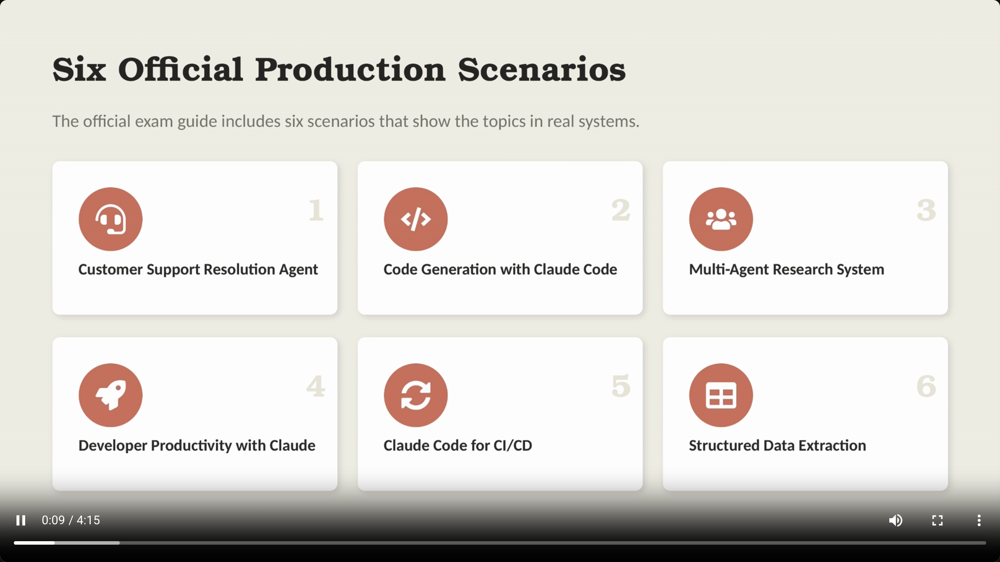
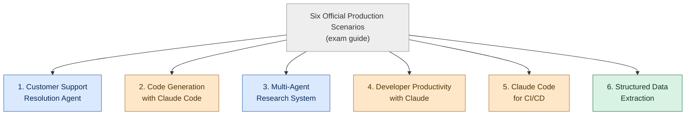
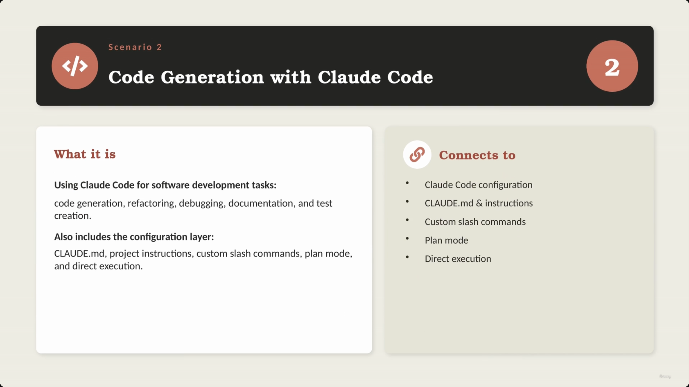
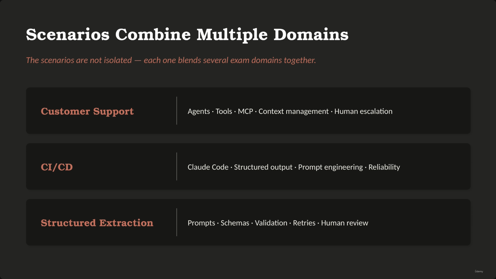
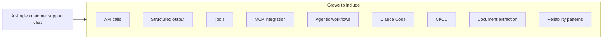
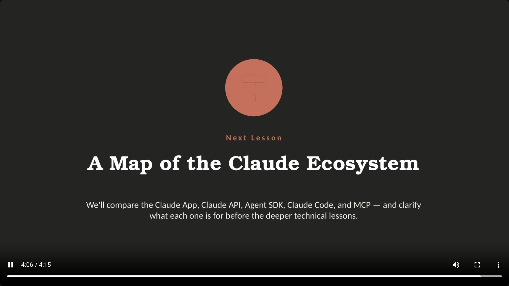

# Six Official Production Scenarios

> The official exam guide anchors the whole course in six production scenarios. Each one shows how exam topics (agents, tools, MCP, Claude Code, structured output) actually show up inside a real cloud-based system — and, as the closing section makes explicit, no single scenario is isolated: they all blend multiple exam domains together.



## Overview: the six scenarios



**Reading it:** two scenarios (1, 3) are agentic-workflow shaped; three (2, 4, 5) center on Claude Code as a developer/CI tool; one (6) is a pure structured-output/extraction problem. The exam mixes all three shapes because production systems mix all three.

---

## 1. Customer Support Resolution Agent

- An AI support agent designed to handle various customer issues:
  - Refunds
  - Billing disputes
  - Account problems
  - Order questions
- **Typical tools used:**
  - `get_customer`
  - `lookup_order`
  - `process_refund`
  - `escalate_to_human`
- **[Connects to]** Agentic architecture, tool use & MCP, business rules, customer verification, human escalation.

> **Transcript color:** "The first scenario is customer support resolution agent... an AI support agent that handles customer issues such as refunds, billing disputes, account problems, and order questions."


---

## 2. Code Generation with Claude Code

- Using Claude Code to perform various software development tasks:
  - Code generation
  - Refactoring
  - Debugging
  - Documentation
  - Test creation
- **[Configuration Layer]** Includes specific elements for controlling and guiding the tool:
  - `CLAUDE.md` & project instructions
  - Custom slash commands
  - Plan mode
  - Direct execution



---

## 3. Multi-Agent Research System

- A system where multiple agents work together to complete complex tasks:
  1. One agent searches for information
  2. Another agent analyzes documents
  3. Another agent synthesizes findings
  4. Another agent generates the final report
- **[Connects to]** Orchestration, context passing, citations & provenance, handling incomplete or conflicting information.

> **Transcript color:** "This scenario is about a system where multiple agents work together... [it] connects to orchestration, context passing, citations, provenance, and handling incomplete or conflicting information."

*(No distinct slide screenshot was captured for this scenario — the capture jumped from the Scenario 2 recap directly to the Scenario 4 slide while this scenario was being narrated. Content here is reconstructed from the slide-note bullets and transcript.)*

---

## 4. Developer Productivity with Claude

- Focused on helping developers work more efficiently by:
  - Exploring codebases
  - Understanding legacy systems
  - Generating boilerplate
  - Automating routine tasks
  - Using built-in tools and MCP servers
- **[Connects to]** Codebase exploration, tool use, project context, built-in tools & MCP, safe developer workflows.

> **Transcript color:** narration lists "code base exploration, tool use, project context, and safe developer workflows" — it skips "built-in tools & MCP" out loud even though that item is clearly on the slide and in the written bullets.


---

## 5. Claude Code for CI/CD

- Focuses on utilizing Claude Code within automated development pipelines.
- **[Connects to]** CI/CD automation, structured output, actionable comments, false-positive reduction, workflow integration.

> **Transcript color:** "Claude may review pull requests, generate tests, summarize code changes or provide structured feedback."


---

## 6. Structured Data Extraction

- Extracting reliable structured data from unstructured content.
- **Examples of use:**
  - Invoices, receipts, forms, emails, support tickets, documents
  - Reviewing pull requests, generating tests, summarizing code changes, or providing structured feedback (within CI/CD contexts)
- **[Connects to]** JSON schemas, validation & retries, edge cases, confidence & human review, downstream system integration.


---

## Scenarios combine multiple domains

- The six scenarios are not isolated from each other or from the exam domains — each one blends several domains together.

| Scenario | Blended Domains/Concepts |
|---|---|
| Customer Support | Agents, Tools, MCP, Context management, Human escalation |
| Code Generation | Claude Code, Configuration (`CLAUDE.md`), Slash commands, Plan mode |
| Multi-Agent Research | Orchestration, Context passing, Citations/provenance, Conflict handling |
| Developer Productivity | Codebase exploration, Tool use, Project context, Built-in tools & MCP |
| CI/CD | Claude Code, Structured output, Prompt engineering, Reliability |
| Structured Extraction | Prompts, Schemas, Validation, Retries, Human review |

> **Transcript color:** "Customer support may involve agents, tools, MCP, context management and human escalation. CI/CD may involve Claude Code, structured output, prompt engineering and reliability. Structured extraction may involve prompts, schemas, validation, retries, and human review."

**[Slide detail]** The slide itself only visualizes 3 of these 6 rows (Customer Support, CI/CD, Structured Extraction) in its table — the other three rows above are synthesized from each scenario's own "Connects to" bullets earlier in this lecture, not shown side-by-side on any single slide.



---

## Running project: ShopAssist AI

- A central project used throughout the course to connect different ideas and scenarios.
- **Starts as:** a simple customer support chat.
- **Grows to include:** API calls, structured output, tools, MCP integration, agentic workflows, Claude Code, CI/CD, document extraction, reliability patterns.



> **Transcript color:** "ShopAssist AI starts as a simple customer support chat. Then it gradually becomes a more complete cloud-based architecture with API calls, structured output, tools, MCP integration, agentic workflows, Claude Code, CI/CD, document extraction and reliability patterns."


---

## What's next

- The next lesson maps and compares the different parts of the Claude ecosystem: **Claude App**, **Claude API**, **Agent SDK**, **Claude Code**, **MCP** — clarifying what each is for before going deeper technically.



---

## Summary

- **Scenario 1 — Customer Support Resolution Agent:** agentic architecture, tool use, business rules, verification, escalation.
- **Scenario 2 — Code Generation with Claude Code:** dev tasks plus the Claude Code configuration layer (`CLAUDE.md`, slash commands, plan mode).
- **Scenario 3 — Multi-Agent Research System:** orchestration, context passing, citations, conflict handling.
- **Scenario 4 — Developer Productivity with Claude:** codebase exploration, built-in tools & MCP, safe workflows.
- **Scenario 5 — Claude Code for CI/CD:** automated pipelines, structured output, false-positive reduction.
- **Scenario 6 — Structured Data Extraction:** JSON schemas, validation & retries, human review.

**Exam framing to remember:** these six scenarios are the *official* lens the exam uses to test every other topic in this course — expect exam questions to be framed as "which of these six scenarios..." rather than asking about a concept in isolation. And no scenario stands alone: real production systems blend several of these patterns (and their domains) at once, as ShopAssist AI will demonstrate across the rest of the course.

---

## In Plain English

Here's the whole file in plain, everyday language:

**The big picture:** the official exam guide is built around six real-world scenario types, and this lecture walks through all six so you know exactly what kind of "story" a question might drop you into.

**1. The six scenarios**
(1) a customer support agent handling refunds/billing/account issues, (2) using Claude Code to generate/refactor/debug/test code, (3) multiple agents working together on a research task (search → analyze → synthesize → report), (4) using Claude to make developers more productive (exploring codebases, understanding legacy code), (5) using Claude Code inside an automated CI/CD pipeline, and (6) pulling clean structured data out of messy documents (invoices, tickets, forms).

**2. None of these are pure textbook categories**
Each one pulls in several different exam topics at once. A support-agent scenario touches agent design, tools, MCP, and human escalation all together, not just "agents" in isolation.

**3. The course's own running example — ShopAssist AI**
It starts as a simple customer support chatbot and gradually grows to touch literally every one of these six scenario types as the course progresses: real API calls, structured output, tools, MCP, multi-step agent workflows, Claude Code, CI/CD, and document extraction.

**One-sentence summary:** The exam is organized around six official real-world scenario types (support agent, code generation, multi-agent research, developer productivity, CI/CD, and structured extraction) — and every one of them blends multiple exam topics together, which is exactly how the course's own ShopAssist project is built up.

---

## Full Walkthrough: One Message, Traced Onto a Scenario, Step by Step

Everything above can feel abstract until you take **one single, slightly messy customer message** and actually work out which of the six scenarios it belongs to — and why. So let's do that with one concrete example.

**Note:** this message is made up as an illustrative example for this note — it is not something that appeared in the course recording.

> "Hey, you charged me twice for order #48213 — I see two charges of $89.99 on my card this week. Also, the tracking still says 'label created' from 5 days ago and I need this before Friday for a work trip. This is honestly getting really frustrating, I've emailed twice already with no reply."

That's genuinely messy: it's a billing complaint (double charge), a shipping question (stale tracking, a hard deadline), and a hint of "I'm already annoyed and you've ignored me" — all in one paragraph, with no label telling you which exam scenario it's testing.

---

### Step 1 — Which of the six scenarios is this really an instance of?

Run through the six and eliminate:

- **Code Generation with Claude Code (Scenario 2)** — no. Nobody is writing, refactoring, or debugging code here.
- **Multi-Agent Research System (Scenario 3)** — no. There's no research task where separate agents search, analyze documents, and synthesize a report. One customer, one issue, one conversation.
- **Developer Productivity with Claude (Scenario 4)** — no. No codebase to explore, no legacy system to understand.
- **Claude Code for CI/CD (Scenario 5)** — no. There's no pull request, pipeline, or automated code review anywhere near this message.
- **Structured Data Extraction (Scenario 6)** — close, but not quite the whole story. Yes, this message needs to be turned into structured fields before anything can happen to it (much like the return-request extraction in the ShopAssist lecture). But extraction alone doesn't resolve the customer's problem — it's a *step inside* a bigger job, not the job itself. Keep this one in mind; it comes back in Step 3.
- **Customer Support Resolution Agent (Scenario 1)** — yes. This is exactly what the slide note lists as the scenario's job: "an AI support agent that handles customer issues such as refunds, billing disputes, account problems, and order questions." Our message is a billing dispute wrapped around an order question — textbook fit.

**Why Scenario 1 and not just Scenario 6:** the customer isn't asking to be handed a structured form back — they want their double charge fixed and their package tracked. That requires the system to actually *look things up and act*, which is what makes it an agent problem, not a pure extraction problem.

---

### Step 2 — Which specific "Connects to" items does THIS message actually trigger?

Scenario 1's own "Connects to" list is: **agentic architecture, tool use & MCP, business rules, customer verification, human escalation.** It's easy to just restate that list — the real skill is checking each item against an actual part of the message:

- **Agentic architecture — yes.** This can't be answered in one reply. The agent has to work through a small chain of steps: check the account, check the charges, check the shipment, weigh a policy, then decide what to tell the customer (or whether to escalate). That multi-step "figure it out, then act" shape is what "agentic" means here — a single canned response wouldn't cut it.
- **Tool use & MCP — yes, specifically.** Two different lookups are needed: `get_customer` / `lookup_order` to pull up order #48213 and confirm two $89.99 charges actually posted, and — separately — a way to check live shipping status, most plausibly through an MCP-connected carrier/shipping tool rather than something built into ShopAssist itself. Two different systems, two different tool calls.
- **Business rules — yes.** "Two charges for the same order" isn't automatically a bug to refund — a rule has to decide the threshold (e.g. duplicate charge on the same order within 24 hours = auto-eligible for refund; anything murkier needs a human). Similarly, "still shows label created after 5 days" needs a rule about what counts as a shipping delay worth acting on.
- **Customer verification — yes.** Before anyone touches billing data or issues a refund, the agent needs to confirm this person actually owns order #48213 — you don't want to hand out charge details or reverse a payment based on an unverified claim in a chat message.
- **Human escalation — yes, and the message itself signals it.** "I've emailed twice already with no reply" is the tell. Even if the duplicate charge is a clean, rule-eligible auto-refund, the *frustration* and *prior unanswered contact* are exactly the kind of sensitivity the course flags for routing to a human — the money problem might be simple, but the relationship problem isn't something a bot should try to smooth over alone.

Every one of the five items is triggered — but each for a different, identifiable reason in the text, not because the list says so.

---

### Step 3 — The same message also brushes up against a second scenario

As promised, this comes back to Scenario 6, **Structured Data Extraction**. Before any of the tool calls in Step 2 can run, the raw sentence has to become something code can act on — the exact move the ShopAssist extraction lecture builds. A plausible extraction result for this message:

```json
{
  "order_id": "48213",
  "issue_type": ["billing_dispute", "delivery_delay"],
  "billing_detail": {
    "charge_amount": 89.99,
    "charge_count": 2,
    "duplicate_suspected": true
  },
  "shipping_detail": {
    "tracking_status": "label_created",
    "days_stale": 5,
    "customer_deadline": "Friday"
  },
  "prior_contact_unanswered": true,
  "confidence": 0.86,
  "human_review_required": true,
  "human_review_reason": "Customer reports prior unanswered contact and expresses frustration; duplicate charge plus shipping deadline both need resolution."
}
```

That's Scenario 6's fingerprint: schema, nullable/typed fields, and a `human_review_required` flag doing real work. But notice it's *feeding into* Scenario 1, not replacing it — the structured object above is what the Customer Support Resolution Agent hands to its tools and its escalation logic. This is the file's own point in practice: "Customer Support may involve agents, tools, MCP, context management and human escalation" *and* pull in structured extraction to get there — scenarios blend, they don't compete.

---

### The whole journey, end to end (this example)

1. Customer sends one messy message mixing a billing complaint and a shipping question.
2. It gets extracted into structured fields (Scenario 6's move) — order ID, charge details, shipping status, a flag for prior unanswered contact.
3. That structured object drives a Customer Support Resolution Agent (Scenario 1): verify the customer, call tools to check the charges and the shipment, apply business rules to the duplicate charge and the delay.
4. The frustration signal ("emailed twice, no reply") plus any rule that doesn't cleanly resolve pushes the case to human escalation rather than fully automating it.

**The one thing to hold onto:** an exam question will never say "this is the Customer Support Resolution Agent scenario" — it'll just hand you a messy situation like the one above and expect you to recognize the shape of the problem (who's asking, what tools and rules it needs, whether a human has to see it) well enough to name the scenario yourself.

---

*Sources: [slide notes](../02-Six-Official-Production-Scenarios.md) · [[hover-notes-transcripts/02-Six Official Production Scenarios (transcript)|full transcript]]*
