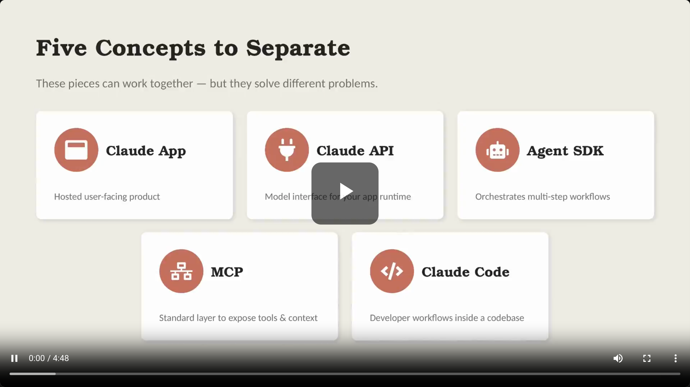
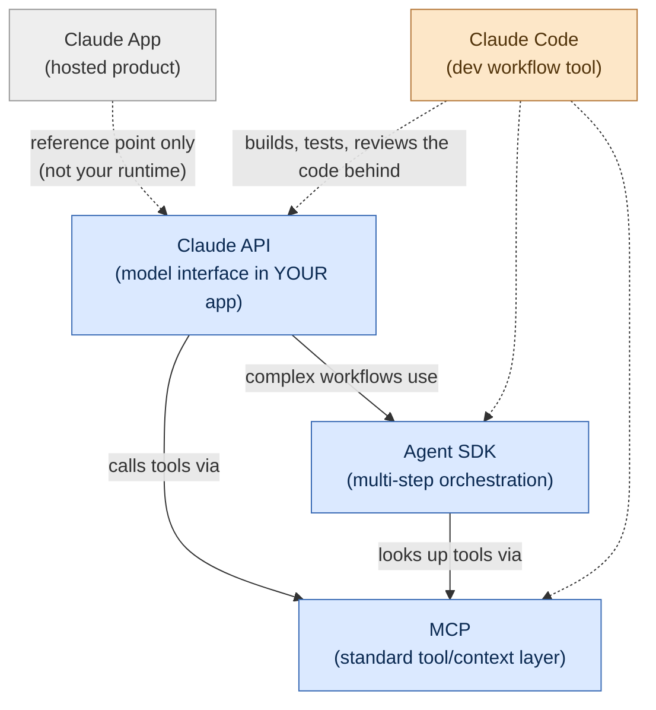
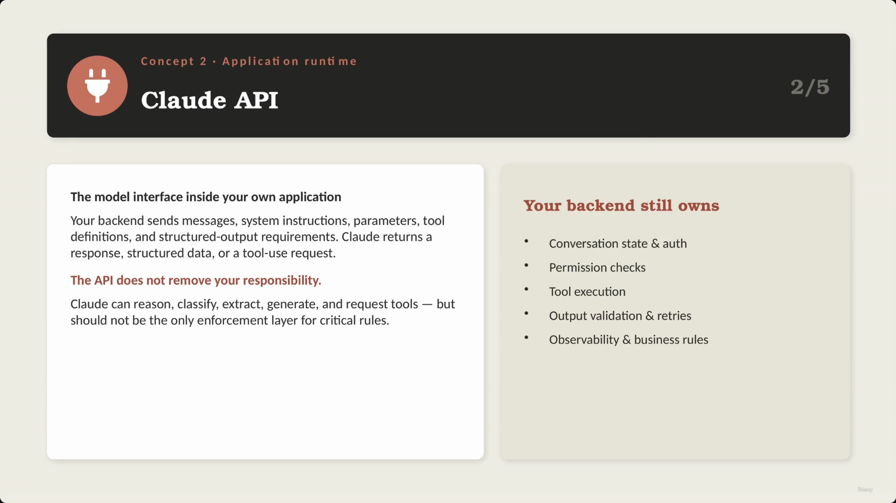
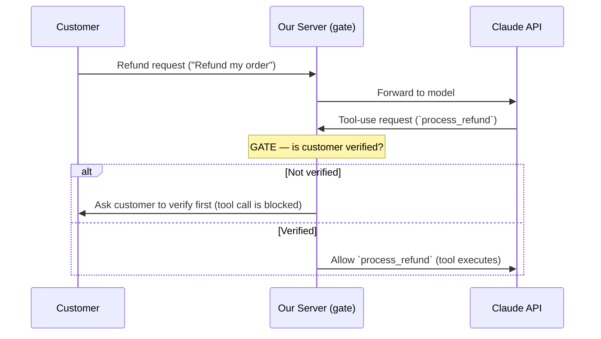
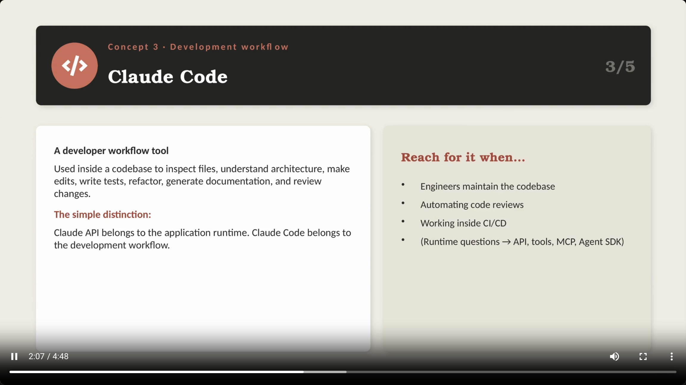
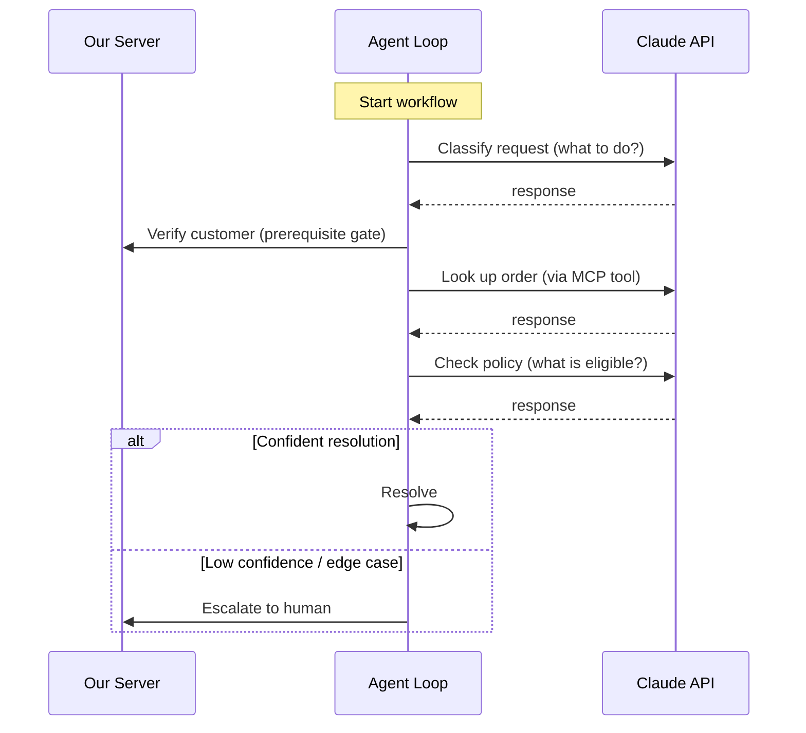
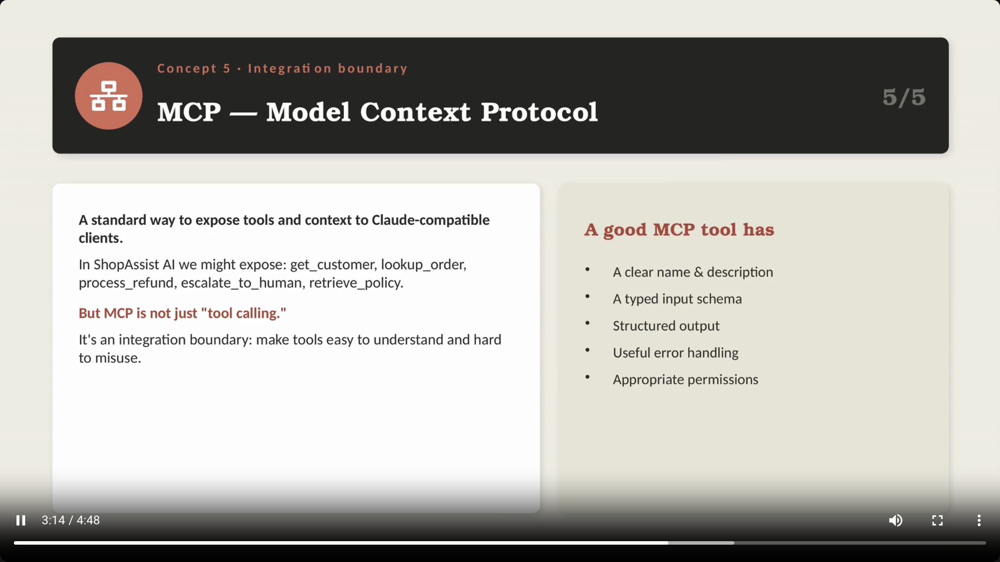
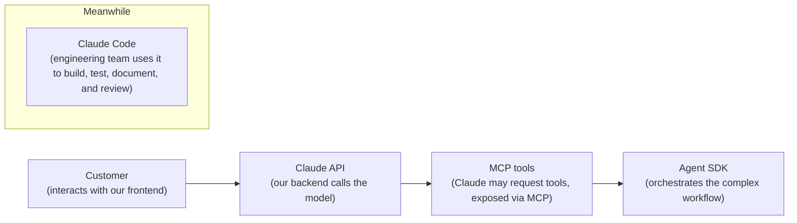
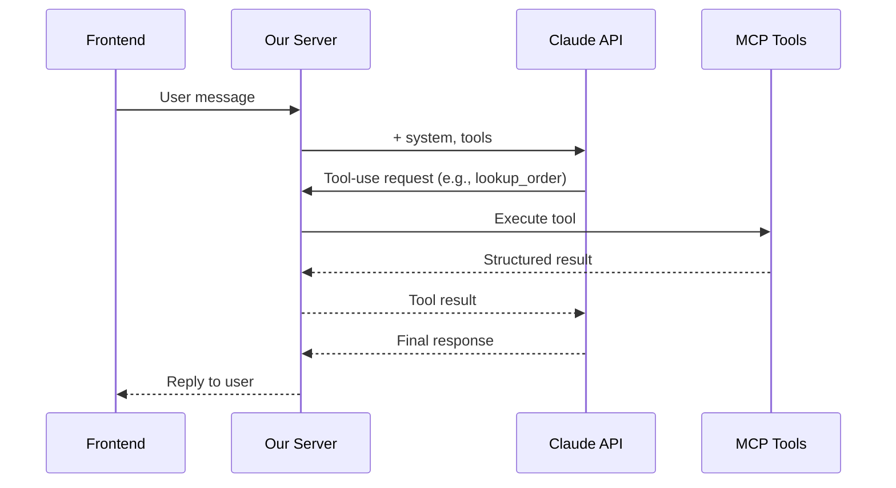

# Claude App vs Claude API vs Claude Code vs MCP vs Agent SDK

> This lecture separates five pieces of the Claude ecosystem that are easy to conflate: **Claude App**, **Claude API**, **Claude Code**, **Agent SDK**, and **MCP**. The exam cares less about "how do we prompt Claude" and more about **which layer is responsible for guaranteeing a behavior**.



## Overview: how the five pieces relate



**Reading it:** only three of these five things run inside your production system (API, MCP, Agent SDK). Claude App is a separate consumer product you don't own or control architecturally, and Claude Code is a development-time tool that helps engineers *build* the other three — it never runs at request-time in production.

---

## 1. Claude App

- The **hosted product experience** — accessed via browser, desktop app, or mobile app.
- Ideal for interactive work: writing, coding help, document review, research.
- **[Note]** It is **not your production runtime**. You don't own:
  - the application state
  - backend orchestration
  - tool execution
  - validation
  - the deployment model
- For this course (and the exam), Claude App is mostly a **reference point** — most architecture decisions happen *outside* the app.

> **Transcript color:** "Most architecture decisions happen outside the app... Cloud App is mostly a reference point."


---

## 2. Claude API

- The **model interface inside your own application**.
- **Communication flow:**
  - Your backend sends → messages, system instructions, model parameters, tool definitions, structured output requirements.
  - Claude returns → a response, structured data, or a tool-use request.
- **[Critical]** The API does **not** remove your responsibility as an architect. Claude can reason, classify, extract, generate, and request tools — but it should never be the *only* enforcement layer for critical rules.
- Your backend must still own:
  - Conversation state & auth
  - Permission checks
  - Tool execution
  - Output validation & retries
  - Observability & business rules



### 2a. The Verification Gate (why this boundary matters)

- **[The Problem]** Relying solely on a system prompt to enforce critical rules is unsafe — the model might decide to call a sensitive tool (e.g. `process_refund`) without proper authorization.
- **[The Solution]** Programmatic **prerequisite gates**: the backend explicitly verifies conditions *in code* before a tool call is allowed to proceed — the rule cannot depend only on the model's reasoning.

> **Transcript color:** "If the customer is not verified, the tool call is blocked. This is the kind of distinction the exam often cares about — not just how do we prompt Claude, but which layer should guarantee the behavior."




---

## 3. Claude Code

- A **developer workflow tool**, used inside a codebase to:
  - Inspect files
  - Understand architecture
  - Make edits
  - Write tests
  - Refactor code
  - Generate documentation
  - Review changes
- **The simple distinction:** Claude API belongs to the *application runtime*; Claude Code belongs to the *development workflow*.
- **When to use it:**
  - Engineers maintaining the codebase
  - Automating code reviews
  - Working inside CI/CD
  - Answering runtime questions *about* the API/tools/MCP/Agent SDK design (not answering them *at* runtime)



---

## 4. Agent SDK

- **[The distinction]** A simple API integration is one request → one response. Production workflows are often **multi-step** — that's an *agentic* workflow.
- **Example agentic workflow** — a support agent may need to:
  1. Classify the request
  2. Verify the customer
  3. Look up the order
  4. Check policy
  5. Call a tool
  6. Inspect the result
  7. Decide: continue, or escalate?
- **[Purpose]** The Agent SDK provides structure for this orchestration — it defines agents, tools, hooks, handoffs, and execution flow.
- **The key point is control:**
  - What can the agent decide?
  - What must the application enforce?
  - When should the loop stop or escalate?
  - Which actions require deterministic validation?




---

## 5. MCP — Model Context Protocol

- **[Definition]** A standard way to expose tools and context to Claude-compatible clients.
- **[Concept]** An **integration boundary** — more than just "tool calling." Designed to make tools easy to understand and hard to misuse.
- **Characteristics of a good MCP tool:**
  - A clear name & description
  - A typed input schema
  - Structured output
  - Useful error handling
  - Appropriate permissions
- **Why it matters:** this discipline matters most when Claude interacts with real business systems (orders, refunds, inventory, etc.) — a sloppy tool contract is where production incidents come from.
- **[Slide detail]** In ShopAssist AI, the tools exposed via MCP might be: `get_customer`, `lookup_order`, `process_refund`, `escalate_to_human`, `retrieve_policy`.



---

## Quick comparison

| Concept | What it is | Who owns/uses it | Runs in production? |
|---|---|---|---|
| **Claude App** | Hosted, consumer-facing product | End users, via browser/desktop/mobile | No — reference point only |
| **Claude API** | Model interface embedded in your app | Your backend | Yes — the core runtime call |
| **Claude Code** | Developer workflow tool | Engineers, CI/CD | No — build-time only |
| **Agent SDK** | Orchestration for multi-step agentic workflows | Your backend | Yes — when workflows are multi-step |
| **MCP** | Standard protocol for exposing tools/context | Your backend + tool servers | Yes — whenever tools are involved |

---

## Putting the map together: ShopAssist AI

> The pieces connect into a single runtime flow. In ShopAssist AI, the customer interacts with the frontend; the backend owns the Claude API call; Claude may request tools exposed through MCP; a complex workflow may be orchestrated with the Agent SDK; and — separately, at build time — the engineering team uses Claude Code to build, test, document, and review the whole system.




### ShopAssist AI — Runtime flow (request-level detail)




---

## Summary

- **Claude App** — the hosted, consumer-facing product. Reference point only.
- **Claude API** — the model interface used within an application's runtime. Your backend still owns state, auth, validation, and enforcement.
- **Agent SDK** — orchestrates complex, multi-step agentic workflows; the exam-relevant point is *control* (what the agent decides vs. what the app enforces).
- **MCP (Model Context Protocol)** — the standard layer for exposing tools and context to the model, designed to be hard to misuse.
- **Claude Code** — the developer workflow tool used for building, testing, documenting, and reviewing the system (build-time, not runtime).

**Exam framing to remember:** the recurring question isn't "how do we phrase the prompt" — it's "**which layer guarantees this behavior**." System prompts guide the model; programmatic gates in your backend *enforce* the rule.

---

## In Plain English

Here's the whole file in plain, everyday language:

**The big picture:** this lecture separates five things people mix up constantly — Claude App, Claude API, Claude Code, MCP, and Agent SDK — by explaining what each one actually is and, more importantly, which of them actually runs *inside your production system*.

**1. Claude App**
The app/website/desktop app you or anyone else chats with directly. It's a finished consumer product — not something you build with, just something you can look at for inspiration. It's not part of your own system at all.

**2. Claude API**
This is the actual thing your backend code calls to talk to the model. Sending messages, getting a response back — this is the real, literal connection point to Claude inside your own application.

**3. The API doesn't remove your responsibility**
Just because Claude can reason and decide things doesn't mean your backend can skip checking things itself — like verifying a customer before letting a refund actually go through. A rule spoken in a prompt is a suggestion; a rule enforced in your backend code is a guarantee.

**4. Claude Code**
A completely different thing — it's a tool for developers writing/reviewing/testing code in their own repository. It doesn't run inside your live product; it helps *build* the product.

**5. Agent SDK**
For when a task needs more than one back-and-forth step — like a support case that needs to classify the issue, verify the customer, look something up, and decide what to do next. It gives you structure for building that kind of multi-step, decision-making workflow.

**6. MCP (Model Context Protocol)**
A standardized way to expose tools/data to Claude so it's easy to use correctly and hard to misuse by accident — clear names, defined inputs, predictable outputs.

**7. How they all fit together in one real system (ShopAssist)**
The customer talks to your frontend → your backend calls the Claude API → Claude might request a tool, which is exposed via MCP → for more complex multi-step work, the Agent SDK orchestrates it all → and separately, the whole time, your engineering team is using Claude Code to actually build and maintain all of this.

**One-sentence summary:** Claude App is a product you don't own, Claude Code is a tool for building your codebase, and Claude API + MCP + Agent SDK are the three pieces that actually run inside your production system — with your backend, not the model, always responsible for guaranteeing the rules that really matter.

---

## Full Walkthrough: One Refund Request, Traced Through All Five Concepts (With Real JSON)

The five-concepts diagram above can feel abstract until you watch **one real customer message** move through it. So let's follow just one message, start to finish, and at every stop ask the same question: *which of the five pieces is actually doing something here?* We'll reuse the exact example this lecture already uses — the ShopAssist headphones order — so nothing here contradicts the diagrams above.

> **Customer message:** "I want to return order 12345, it arrived damaged."

In plain words, here's the whole trip before we get into JSON:

```
customer types → our backend calls Claude API → Claude asks for a tool → the tool runs via MCP →
if the tool is a refund, a gate checks verification first → Agent SDK drives the multi-step loop → reply goes back
```

Claude App and Claude Code never appear in that line. That's on purpose — see the aside at the end.

---

### Step 0 — Where is Claude App in all this? Nowhere.

Before going further: the customer is **not** typing into claude.ai or the Claude desktop/mobile app. They're typing into ShopAssist's own chat widget, which is our frontend, talking to our backend. Claude App is a separate hosted product Anthropic runs — it has no wiring into ShopAssist at all. If this sentence had instead been typed into Claude App by an end user for their own personal use, none of the steps below would exist, because there'd be no ShopAssist backend in the loop. So: zero involvement. Moving on.

---

### Step 1 — Our backend calls the Claude API (the message + the tools it's allowed to use)

This is the real, literal connection point from the "Quick comparison" table — the one arrow in the Overview diagram that says `B["Claude API"]`. Our server sends the customer's message plus the list of MCP-exposed tools Claude is allowed to request:

```json
{
  "model": "claude-...",
  "max_tokens": 1000,
  "system": "You are ShopAssist's support agent. Use tools to look up orders and process refunds. Never call process_refund without a verified customer.",
  "tools": [
    { "name": "get_customer", "description": "Look up a customer's account and verification status." },
    { "name": "lookup_order", "description": "Look up an order by ID." },
    { "name": "process_refund", "description": "Issue a refund for a verified, eligible order." },
    { "name": "retrieve_policy", "description": "Look up the return/refund policy that applies to an order." },
    { "name": "escalate_to_human", "description": "Hand the case to a human agent." }
  ],
  "messages": [
    { "role": "user", "content": "I want to return order 12345, it arrived damaged." }
  ]
}
```

These five tool names are exactly the ones this lecture's MCP section already lists for ShopAssist — nothing new is being invented here.

---

### Step 2 — Claude doesn't answer in words. It asks for a tool.

Because the message names a specific order, Claude doesn't need to ask a clarifying question — it can go straight to looking the order up. The API returns a `tool_use` block, not plain text:

```json
{
  "type": "tool_use",
  "id": "toolu_01Xy9k2Lm4",
  "name": "lookup_order",
  "input": {
    "order_id": "12345"
  }
}
```

This is the same shape as the "Tool-use request (e.g., lookup_order)" arrow in the **ShopAssist AI — Runtime Flow** sequence diagram above (`A->>S: Tool-use request`). Claude hasn't looked anything up yet — it has only asked our server to do it.

---

### Step 3 — MCP is the pipe the tool actually runs through

Our server doesn't run `lookup_order` inline in application code — it calls out to the order-lookup tool exposed via MCP, the same "M" participant in that runtime-flow diagram (`S->>M: Execute tool`). The call over MCP looks like this:

```json
{
  "method": "tools/call",
  "params": {
    "name": "lookup_order",
    "arguments": { "order_id": "12345" }
  }
}
```

And the MCP tool sends back a **structured result** — the "clear name, typed schema, structured output" discipline this lecture's MCP section insists on, not a vague blob of text:

```json
{
  "order_id": "12345",
  "item": "headphones",
  "status": "delivered",
  "delivered_on": "2026-09-05",
  "damaged_reported": true,
  "eligible_for_refund": true,
  "return_window_days_left": 12
}
```

Our server hands that structured result back to Claude as a `tool_result`, and Claude now has real facts about order 12345 instead of just the customer's word for it.

---

### Step 4 — The next tool Claude wants is the sensitive one: `process_refund`. This is where the gate matters.

With the order confirmed as damaged and eligible, Claude's natural next move is to request `process_refund`. This is exactly the scenario the **Verification Gate** sequence diagram above is about — and it's not a hypothetical for this request, because a refund is literally what the customer asked for:

```json
{
  "type": "tool_use",
  "id": "toolu_01Zq7Pn3Rf",
  "name": "process_refund",
  "input": {
    "order_id": "12345",
    "reason": "damaged_item"
  }
}
```

Our server does **not** just execute this because Claude asked. It runs the same programmatic gate from the earlier diagram: *is this customer verified?*

```python
if not customer.is_verified:
    # Tool call is blocked. Ask the customer to verify first.
    return ask_customer_to_verify()
else:
    # Allow process_refund — the tool executes via MCP, same as lookup_order above
    result = mcp_call("process_refund", {"order_id": "12345", "reason": "damaged_item"})
```

If the customer hasn't verified their identity yet, the refund tool call is **blocked in code** — not by asking Claude nicely in the system prompt, but by a real `if` statement standing between Claude's request and the tool actually running. That's the whole point of the gate: the rule "no refund without verification" cannot depend on Claude choosing to follow it.

---

### Step 5 — This is a multi-step case, so the Agent SDK is what's actually driving the loop

Notice what just happened across Steps 2–4: classify the request → look up the order → decide whether a sensitive tool needs a gate → maybe verify → then act. That's not "one request, one response" — it's the exact multi-step shape the **Agent SDK — Multi-Step Loop** diagram above describes. Mapped onto our headphones refund:

| Agent SDK loop step (from the diagram) | What actually happens for order 12345 |
|---|---|
| Classify request | "This is a damaged-item return request" |
| Verify customer (prerequisite gate) | Checked before `process_refund` is allowed to run — Step 4 above |
| Look up order (via MCP tool) | `lookup_order` → structured result — Steps 2–3 above |
| Check policy | `retrieve_policy` confirms damaged items within the return window qualify |
| Resolve or escalate | Confident case → resolve automatically; low-confidence or contradictory case → `escalate_to_human`, same as the "policy exception" and "contradiction" cases routed to human review elsewhere in this course |

For our clean, verified, damaged-item case: confidence is high, the gate passes, policy supports it — the loop resolves. The refund tool executes, and the final reply goes back down through Claude API → our server → frontend → customer, matching the last two arrows of the ShopAssist runtime-flow diagram (`A-->>S: Final response`, `S-->>F: Reply to user`).

---

### Aside — where's Claude Code in this story? Nowhere in *this* request either — but everywhere before it

Claude Code never appears anywhere in Steps 0–5, and that's not an oversight — it's the whole point of the "build-time vs. runtime" distinction this lecture keeps returning to. Weeks before this customer ever typed a word, an engineer on the ShopAssist team likely used Claude Code, sitting in the codebase, to write the `process_refund` MCP tool, write the verification-gate `if` statement in Step 4, write tests for the Agent SDK loop, and review the pull request that shipped it all. None of that happens *during* the customer's request — it happened earlier, in a completely different environment, producing the code that Steps 1–5 now run.

---

### The whole journey, end to end (our damaged-headphones example)

1. Customer types into ShopAssist's own frontend — **not** Claude App.
2. Our backend calls the **Claude API** with the message + the five MCP tool definitions.
3. Claude returns `tool_use: lookup_order` — a request, not an action.
4. Our server executes that request over **MCP**, gets back a structured result (order confirmed damaged, eligible).
5. Claude returns `tool_use: process_refund` — the sensitive one.
6. Our server's **gate** checks verification in code before letting it run — blocked if not verified, executed via MCP if verified.
7. Because this took several coordinated steps (classify → verify → look up → check policy → resolve/escalate), the **Agent SDK** is what's actually structuring that loop, not one lone API call.
8. Claude Code touched none of this live — it built the tools, the gate, and the loop logic at an earlier, separate time.

**The one thing to hold onto:** of the five concepts in this file, only **Claude API, MCP, and Agent SDK** are actually running while this customer's request is in flight. **Claude App** is outside the runtime because it's a different product entirely, and **Claude Code** is outside the runtime because it belongs to an earlier moment in time — the moment the engineering team built everything the other three now execute.

---

*Sources: [slide notes](../03-ClaudeApp-vs-ClaudeAPI-vs-ClaudeCode-vs-MCP-vs-AgentSDK.md) · [[hover-notes-transcripts/03-ClaudeApp-vs-ClaudeAPI-vs-ClaudeCode-vs-MCP-vs-AgentSDK (transcript)|full transcript]]*
