# System Prompts, Behavior, and Application Enforcement

> The previous lecture gave ShopAssist AI **context** (a `messages` list carrying conversation history). This lecture gives it **behavior** — a `system` prompt that defines persona, scope, tone, and hard constraints. It closes with the architectural point the exam keeps coming back to: a system prompt can *steer* a rule, but only application code can *guarantee* it. That's the same "which layer guarantees this behavior" question from the Claude App/API/Code/MCP/Agent SDK lecture — here it shows up one layer down, inside a single API call.

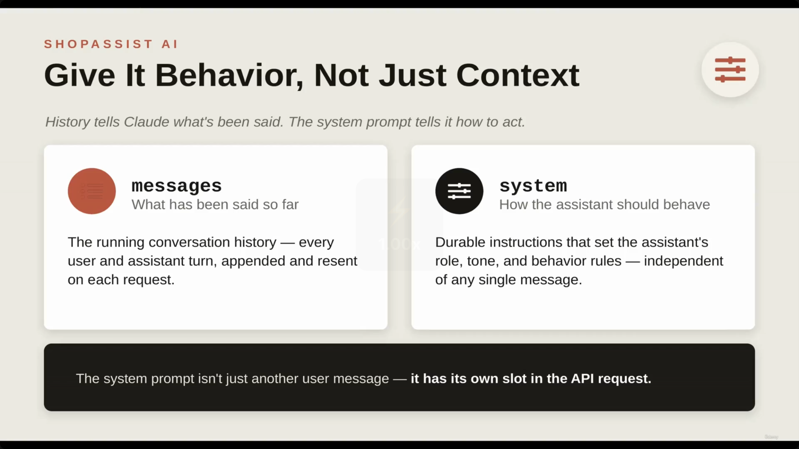

**[Slide detail]** The slide's own tagline: *"History tells Claude what's been said. The system prompt tells it how to act."*

---

## 1. Context vs. Behavior — two different jobs in the API request

- **`messages`** — what has been said so far
  - The running conversation history
  - Every user and assistant turn, appended and resent on each request
- **`system`** — how the assistant should behave
  - Durable instructions that set the assistant's role, tone, and behavior rules
  - Independent of any single message
- **[API Structure]** The system prompt is **not** just another user message — it has its own dedicated slot in the API request.

> **Transcript color:** "In the previous lesson, we built a basic multi-turn conversation... That gave ShopAssist context. Now we need to give it behavior. We do not want a generic chatbot."

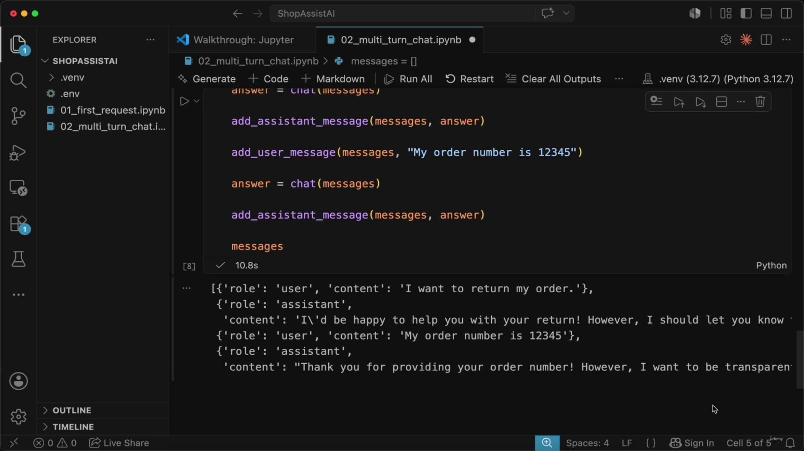

*This screenshot is the tail end of the prior lecture's notebook (a "return my order" conversation with no system prompt yet) — the video briefly recaps it before introducing `system_prompt`.*

---

## 2. Defining ShopAssist AI's behavior

- **[The Goal]** Transform the assistant from a generic chatbot into a specialized customer support agent for an online store, via a `system_prompt` variable.

```python
system_prompt = """
  You are ShopAssist AI, a helpful customer support assistant for an online store.

  Your job is to help customers with order questions, returns, refunds, shipping issues,
  Be concise, polite, and practical.

  Do not promise a refund until the order is checked.

  If you need more information, ask one clear question at a time.
  """
```

| Piece | What it establishes |
|---|---|
| **Persona** | Who the assistant is — ShopAssist AI |
| **Scope** | What it handles — order questions, returns, refunds, shipping, product support |
| **Tone** | Style — concise, polite, practical |
| **Constraints** | Hard rules — don't promise refunds prematurely; ask only one question at a time |

- **[Strategic Communication]** Two of these instructions specifically head off common chatbot failure modes:
  - **Preventing premature commitments** — the refund constraint forces a verification workflow before any promise is made.
  - **Optimizing user experience** — the single-question rule avoids overwhelming the customer during information-gathering.

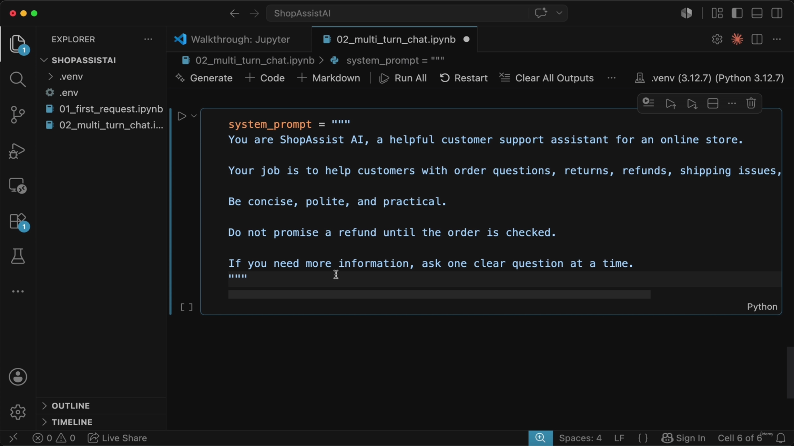

---

## 3. Wiring the system prompt into the chat function

- **[Implementation]** The `chat` function is updated to pass `system=system_prompt` alongside the existing `messages` argument.

```python
def chat(messages):
    message = model.messages.create(
        model=model,
        max_tokens=300,
        system=system_prompt,
        messages=messages
    )
    return message.content[0].text
```

- **[Impact]** Claude now sees not just the message history but its identity and operational constraints on *every single turn*.

> **Transcript color:** "The important difference is this line — system was set as a system prompt. That means every request will now include the ShopAssist AI instructions."

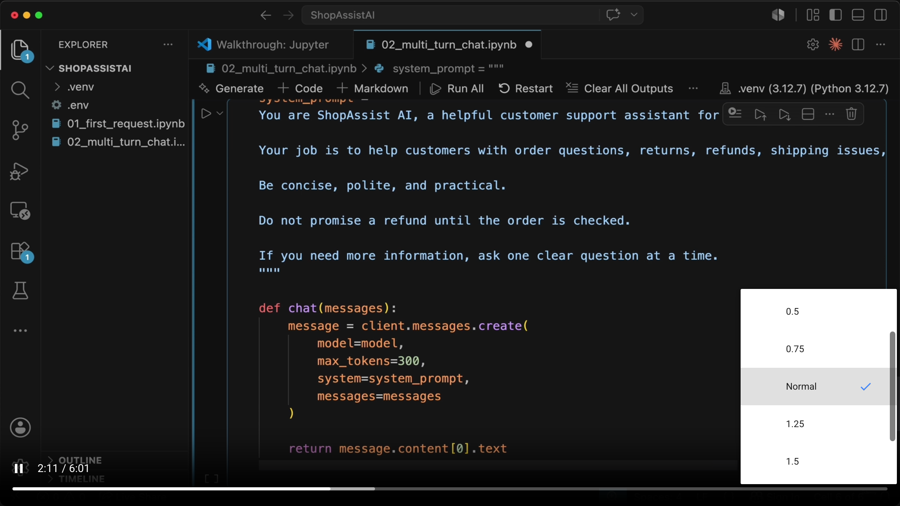

### The role split, restated

| | Answers |
|---|---|
| **System Prompt** | "How should the assistant behave?" |
| **Messages List** | "What has been said so far?" |

---

## 4. Testing it — does the constraint actually show up?

- Reset `messages` to `[]` and simulate a real customer interaction.

```python
messages = []
add_user_message(messages, "Hi, I bought headphones last week and they do not work. I want my money back.")
answer = chat(messages)
print("ShopAssist:", answer)
```

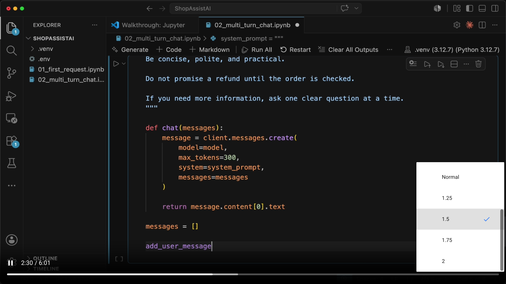

- **[Test Scenario]** User input: *"Hi, I bought headphones last week and they do not work. I want my money back."*
- **[Observed Behavior]** Because the system prompt forbids promising a refund before the order is checked:

| ShopAssist DOES | ShopAssist does NOT |
|---|---|
| Acknowledge the issue | Say **"Your refund is approved."** |
| Ask for the order number | |
| Explain the next step | |

- **[Key Insight]** This cautious, helpful tone is driven **entirely by the system prompt** — no business logic has been written yet.

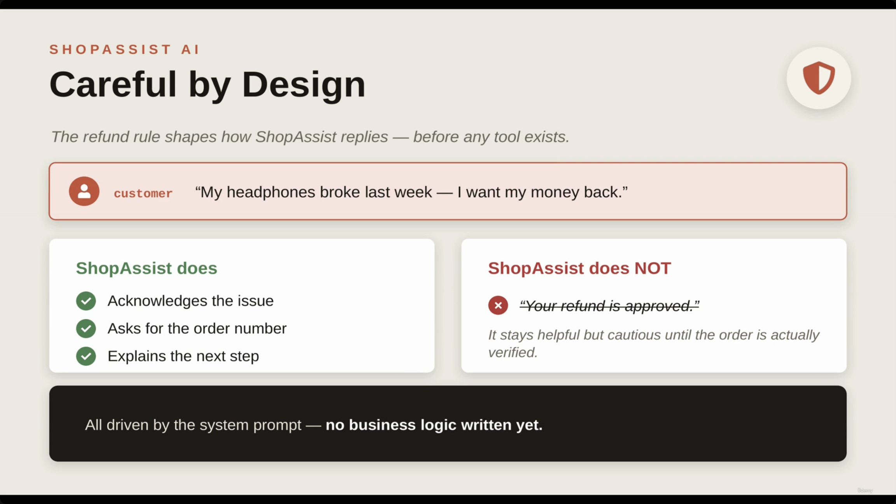

**[Slide detail]** The slide is titled *"Careful by Design"* (not named in the narration) and its footer states explicitly: *"All driven by the system prompt — **no business logic written yet**."* — a sharper way of putting the point than either the transcript or the original bullets stated it.

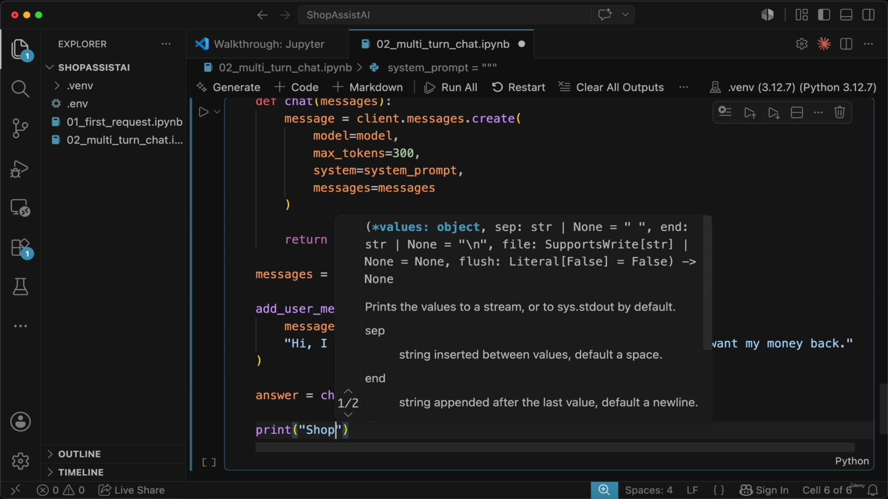

---

## 5. Conversation state and history

- The feeling of continuity comes entirely from **resending the full history** with every request — it is not hidden model memory.
- **[The Conversation Flow]** A typical multi-turn interaction alternates roles:
  1. `user` — initial problem/question
  2. `assistant` — response shaped by the system prompt
  3. `user` — follow-up (e.g., order number)
  4. `assistant` — response acknowledging the new context

```python
messages = [
    {'role': 'user', 'content': 'Hi, I bought headphones last week and they do not work. I want my money back.'},
    {'role': 'assistant', 'content': "I'm sorry to hear your headphones aren't working! ... Could you please share your **order number**..."},
    {'role': 'user', 'content': 'The order number is 12345.'},
    {'role': 'assistant', 'content': "Thank you! Let me look up order #12345 for you..."}
]
```

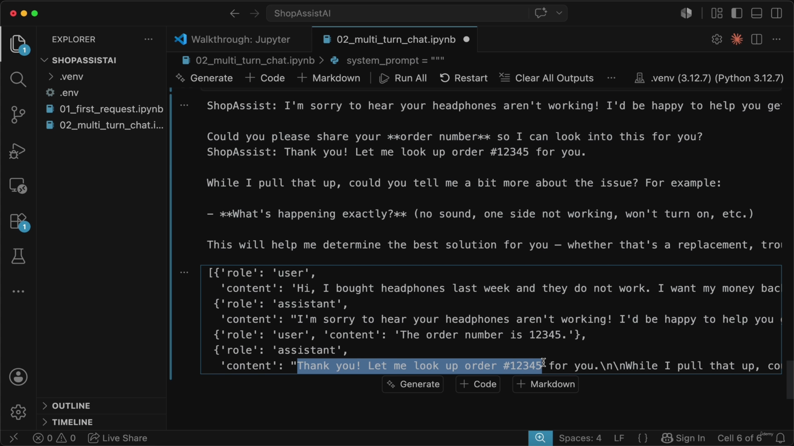

- **[Storage in Production]** This `messages` list can't just live in a local Python variable — it must persist externally (database, session storage) so it survives between requests.
- **[Context Responsibility]** The application owns the conversation; Claude simply responds based on the context the application sends it.

---

## 6. Guidance is not enforcement

- A prompt **steers** behavior; it does not **guarantee** it.

| Feature | Prompt (Guidance) | Code (Enforcement) |
|---|---|---|
| Nature | Soft | Hard |
| Function | Shapes tone, persona, and intent; sets sensible defaults | Backend verifies before it acts; financially critical rules live here |
| Reliability | Can be nudged, ignored, or slip | Cannot be talked out of by a user |

- **[Why this matters]** If a rule is financially or operationally important (e.g., "do not issue refunds before verification"), the **application code** must enforce it programmatically — the LLM following the prompt is not sufficient on its own.

> **Transcript color:** "A system prompt can guide behavior, but it is not the same as a guaranteed business rule... The prompt is guidance. The application code is enforcement. This distinction will become more important later when we add tools like lookup order, process refund, and escalate to human."

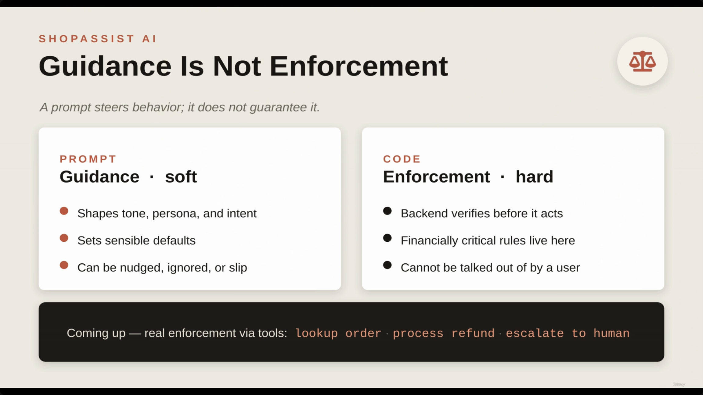

The slide's own footer previews exactly where this is going: **"Coming up — real enforcement via tools: `lookup order` · `process refund` · `escalate to human`"** — i.e., the next lectures wire these into actual tool calls with a backend gate in front of them, the same shape as the Verification Gate pattern from the Claude App/API/Code/MCP/Agent SDK lecture.

### Today (prompt-only) vs. what's coming (programmatic gate)

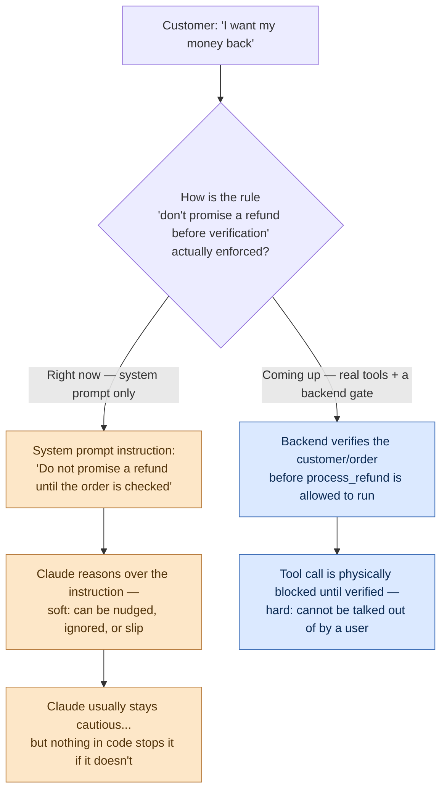

---

## 7. Putting it together — the application loop

- **[The Application Loop]**
  1. Define the system prompt
  2. Maintain a `messages` list for conversation history
  3. Append each new user message with the `user` role
  4. Send both the system prompt and the `messages` list to Claude
  5. Append Claude's response back with the `assistant` role
  6. Repeat

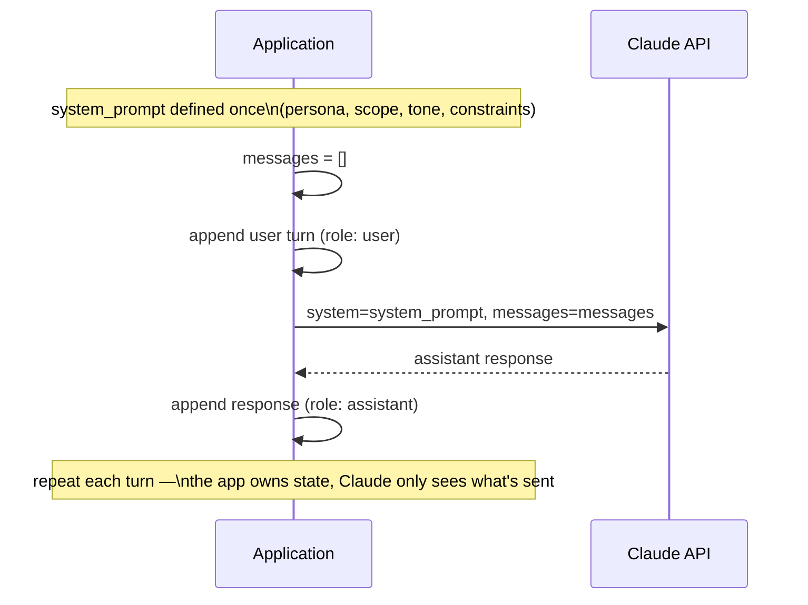

- **[Scaling Conversation History]** Unlimited raw history is impractical in production — longer context means higher cost, more latency, more complexity. Production strategies:
  - Summarize older turns
  - Store key facts separately
  - Keep structured state (e.g., `customer`, `order`, `intent` as distinct fields)

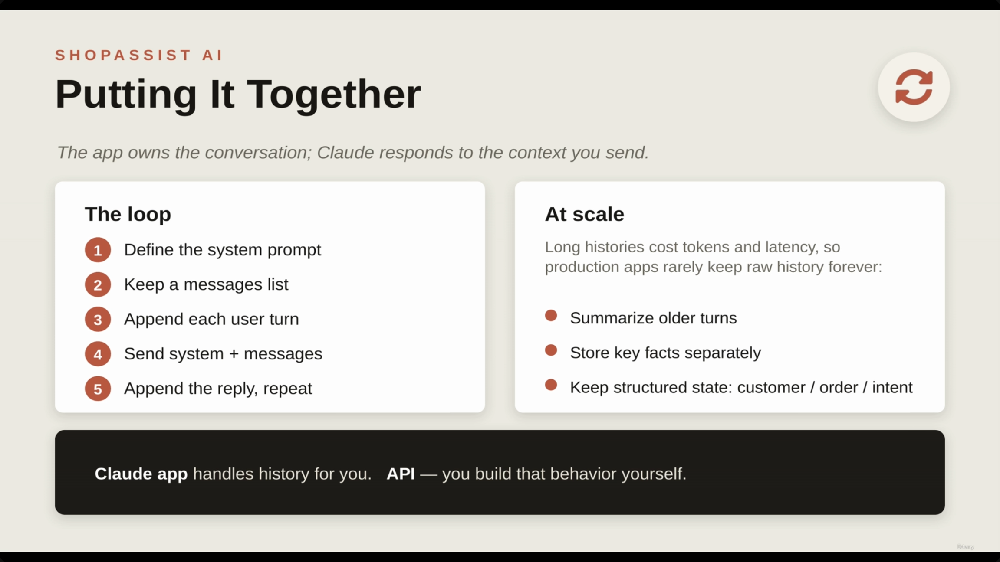

**[Slide detail]** Footer line: *"**Claude app** handles history for you. **API** — you build that behavior yourself."* — a reminder that the convenience of the consumer Claude App (from the earlier "five concepts" lecture) disappears once you're the one calling the API; your backend is now responsible for the loop above.

---

## Summary

- **`messages`** answers "what's been said" (context); **`system`** answers "how should it behave" (behavior) — they occupy separate, dedicated slots in the API request.
- A well-built system prompt combines **persona, scope, tone, and constraints** — and constraints like "don't promise refunds before verification" visibly shape the model's replies even with zero business logic written.
- **Guidance vs. enforcement**: a system prompt is soft — it can be nudged, ignored, or slip. Code is hard — it verifies before acting and cannot be talked out of by a user. Financially or operationally critical rules belong in code, not just the prompt.
- The application owns conversation state end-to-end: building the `messages` list, persisting it externally in production, and managing its growth (summarization, key-fact extraction, structured state) as conversations scale.
- **Exam framing to remember:** this is the same question as "which layer guarantees this behavior" from the five-concepts lecture, now applied inside a single API call — the system prompt guides; the backend (in the upcoming tools lectures) enforces.

---

## In Plain English

Here's the whole file in plain, everyday language:

**The big picture:** the conversation history from the last two lectures tells Claude WHAT has been said — this lecture is about giving it a personality and behavior rules, i.e., telling it HOW to act, using something called a system prompt.

**1. Two separate jobs, two separate slots in the request**
`messages` = the conversation so far (context). `system` = a standing set of instructions about who Claude should be and how it should behave (persona, tone, hard rules) — sent fresh on every single request, independent of any one message.

**2. A good system prompt does four things**
Says who the assistant is (persona), what it's allowed to help with (scope), how it should sound (tone), and specific hard rules it must follow (constraints) — like "never promise a refund until the order has actually been checked."

**3. It actually works, immediately**
With literally zero business logic written yet, just from the system prompt alone, the assistant reliably avoids saying "your refund is approved" and instead asks for the order number first — proving how much a well-written system prompt can shape behavior on its own.

**4. But — and this is the important twist — a prompt only ever GUIDES behavior, it never GUARANTEES it**
A system prompt is a soft suggestion the model could, in theory, ignore or get talked out of by a persistent user. If a rule is actually important (especially anything involving money), your backend CODE has to check and enforce it — not just hope the prompt worked.

**5. Looking ahead**
This is exactly why later lectures wire up real backend tools (lookup order, process refund, escalate to human) with actual code-level checks in front of them — a system prompt says "please verify before refunding," but only code can actually block an unverified refund from happening.

**6. Scaling reality check**
You can't just keep sending an infinitely growing raw history forever in a real production app — eventually you need strategies like summarizing older turns or pulling out just the key facts into separate structured fields.

**One-sentence summary:** A `system` prompt (persona + scope + tone + rules) gives Claude behavior on top of the conversation history — but a prompt is only ever guidance that CAN be ignored, so anything that actually matters (like money) still needs to be enforced by real backend code, not just asked for nicely.

---

## Full Walkthrough: One Message, Traced Step by Step (With Real JSON)

Everything above can feel abstract until you watch **one single customer message** travel through the request, and see exactly why the reply comes out cautious instead of risky. So let's trace the file's own test message, start to finish, with the actual request shape at every stage. We'll use the message this lecture uses for its test:

> "Hi, I bought headphones last week and they do not work. I want my money back."

The whole idea in plain words:

```
system prompt (rules) + messages (what was said) → one request → Claude reasons over BOTH before it replies
```

---

### Step 1 — The request has two separate slots, not one blob

Before this message ever gets sent, `system_prompt` already exists as its own variable (Section 2 above) and `chat()` already wires it in as its own argument (Section 3 above) — separate from `messages`. When the test in Section 4 runs, here's the actual request that goes out:

```json
{
  "model": "<model>",
  "max_tokens": 300,
  "system": "You are ShopAssist AI, a helpful customer support assistant for an online store.\n\nYour job is to help customers with order questions, returns, refunds, shipping issues,\nBe concise, polite, and practical.\n\nDo not promise a refund until the order is checked.\n\nIf you need more information, ask one clear question at a time.",
  "messages": [
    { "role": "user", "content": "Hi, I bought headphones last week and they do not work. I want my money back." }
  ]
}
```

Notice `system` and `messages` are two different fields, sent together in the same request. `messages` holds only what the customer just said. `system` holds the standing rules — persona, scope, tone, and the constraint "do not promise a refund until the order is checked." Nothing about the refund rule lives inside `messages` at all — it only exists because `system` carries it along on every single call.

---

### Step 2 — Why the reply comes out cautious, not risky

Claude reads both fields before writing a single word of the reply. It sees a customer asking for money back (`messages`), and it sees a rule that says don't promise a refund until the order is checked, and ask one question at a time (`system`). The file's own observed-behavior table (Section 4) describes exactly what a reply shaped by that constraint looks like:

| ShopAssist DOES | ShopAssist does NOT |
|---|---|
| Acknowledge the issue | Say **"Your refund is approved."** |
| Ask for the order number | |
| Explain the next step | |

So a plausible reply opens by acknowledging the broken headphones, then asks for the order number as the one clarifying question — and stops short of promising anything. As the file puts it, this cautious tone is driven **entirely by the system prompt** — no business logic has been written yet. It isn't that Claude "checked" anything; there's no code to check with yet. It's that the instruction sitting in `system` shaped how Claude chose to respond.

---

### Step 3 — Illustrative contrast: what if `system` were removed?

*(Nothing below is screenshot-verified — the file doesn't run this version. It's a plain-words illustration of why the `system` slot matters, built by removing one field from the real request above.)*

Take the exact same request and delete the `system` field entirely:

```json
{
  "model": "<model>",
  "max_tokens": 300,
  "messages": [
    { "role": "user", "content": "Hi, I bought headphones last week and they do not work. I want my money back." }
  ]
}
```

Nothing in this version tells Claude to hold off on a refund, to check an order first, or to ask only one question at a time. There's no persona, no scope, no constraint — just a bare customer message. With nothing steering it the other way, a generic, eager-to-help reply could plausibly say something like *"Sure, your refund is approved!"* — the exact sentence the file's DOES/does NOT table says the real, system-prompted version avoids. The point isn't that this would always happen — it's that nothing in this stripped-down request rules it out. That's the whole difference the `system` field makes.

---

### Step 4 — Walking the file's own "today vs. coming" flowchart as this exact decision

The Mermaid flowchart in Section 6 asks: how is the rule "don't promise a refund before verification" actually enforced *right now*, for this exact request? Tracing our headphones message through it:

- **Today (this lecture):** the only thing standing between the model and a bad promise is the sentence `"Do not promise a refund until the order is checked"` sitting inside `system`. Claude reasons over that instruction the same way it reasons over everything else in the request — which is why the flowchart labels this path **soft**: "can be nudged, ignored, or slip." Claude usually stays cautious, as the observed table shows — but nothing in code stops it if it doesn't.
- **Coming up (later lectures):** the file's own footer previews it directly — real enforcement via tools: `lookup order` · `process refund` · `escalate to human`. Once a real `process_refund` tool exists, the backend verifies the customer/order **before** that tool is even allowed to run — the flowchart labels this path **hard**: "cannot be talked out of by a user." At that point, refusing a bad refund stops being a matter of Claude choosing to follow an instruction, and becomes a matter of the tool call being physically blocked until verification passes.

Same customer message, same request shape — the only thing that changes between "today" and "coming up" is whether the refund promise is being *discouraged by an instruction* or *blocked by code*.

---

### The whole journey, end to end (our headphones example)

1. Customer types: "Hi, I bought headphones last week and they do not work. I want my money back."
2. `chat()` sends one request with two slots filled: `system=system_prompt` (rules) and `messages=[...]` (this one message).
3. Claude reads both before replying — the constraint in `system` shapes the reply into something that acknowledges the issue and asks for the order number, without promising a refund.
4. *(Illustrative only)* Strip `system` out of the same request, and nothing rules out a reply like "Sure, your refund is approved!" — because nothing in the request says not to.
5. Right now, that gap is closed only by the model choosing to follow an instruction — soft, per the file's own flowchart. Once `process_refund` exists with a backend verification gate, the gap closes in code instead — hard, per the same flowchart.

**The one thing to hold onto:** a system prompt is just another instruction the model reasons over — powerful enough to visibly shape behavior with zero business logic written, but still just words in a request, not a lock. A lock is code that checks before it acts.

---

*Sources: [slide notes](../08-System-Prompts-Behavior-And-Application-Enforcement.md) · [[hover-notes-transcripts/08-System-Prompts-Behavior-And-Application-Enforcement (transcript)|full transcript]]*
