# Prompt Evaluation Workflow

> Writing a good prompt is only half the job. This lecture introduces the *second* half — **prompt evaluation** — and walks through building a small, concrete eval pipeline for ShopAssist AI's intent classifier: a labeled test dataset, a loop that runs each case through Claude, and a pass/fail comparison that turns "does this prompt look good?" into a measurable score.

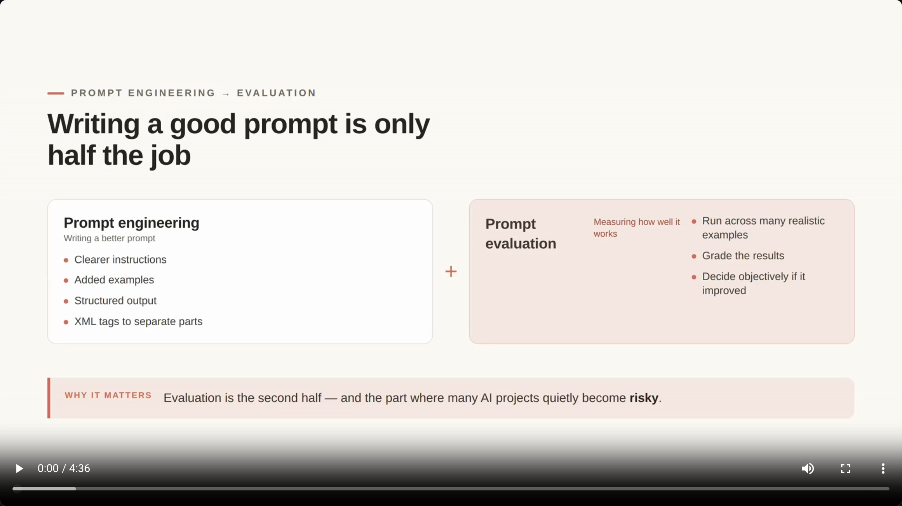

## 1. Prompt Engineering + Prompt Evaluation

- **Prompt engineering** improves the prompt itself:
  - Clearer instructions
  - Added examples
  - Structured output requests
  - XML tags to separate parts of the prompt
- **[The Missing Half]** **Prompt evaluation** measures how well the prompt actually performs:
  - Run it across many realistic examples
  - Grade the results
  - Decide objectively whether it improved

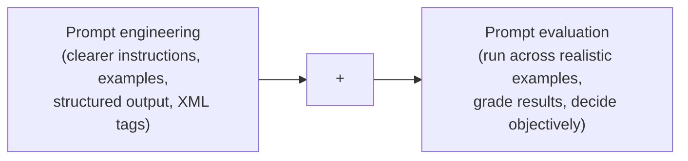

> **Transcript color:** "All of these techniques help Claude understand what we want. But writing a good prompt is only the first part. The second part is prompt evaluation... this is where many AI projects become risky."

---

## 2. The Risks of Manual Testing

- **[The Problem]** A prompt that looks successful in a controlled environment can still fail in production:
  - It may work perfectly in a demo
  - It may pass for the few examples you tested by hand
- **[Why it fails]** Real users send inputs nobody planned for:
  - Unclear or vague messages
  - Unexpected edge cases
  - Forgotten or missing details
  - Multiple problems packed into a single message

> **Example: ShopAssist AI** — a prompt designed to handle a single refund request can fail when a real customer message combines a refund, a missing package, a damaged item, a billing problem, and angry sentiment all at once — a case that likely needs human escalation.

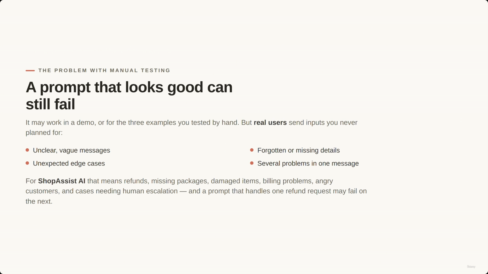

---

## 3. Reframing Prompt Quality

- **[The Shift]** Stop asking a subjective question and start asking an objective one:
  - ~~"Does this prompt look good?"~~
  - **"How does this prompt perform across many realistic examples?"**
- **[The Goal of Evals]** Answer that second question objectively, across many cases — not by feeling.

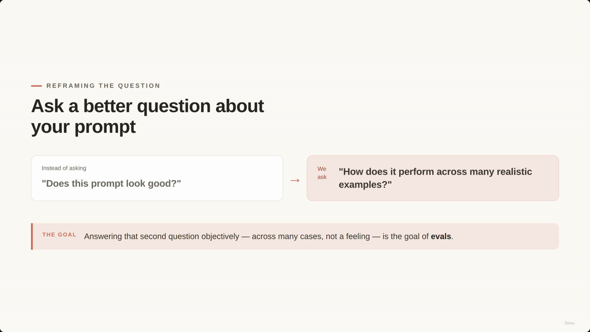

---

## 4. Three Paths After Writing a Prompt

| Path | Description | Risk / Benefit |
|---|---|---|
| **Risky** | Test it once, decide it's "good enough" | May work in a notebook but fail in production |
| **Better, but limited** | Test a few times, fix one or two obvious problems | Only covers the specific cases you happened to think of |
| **Recommended** | Build an eval pipeline | Run against a whole dataset, grade the results, change the prompt, and re-run for an objective comparison |

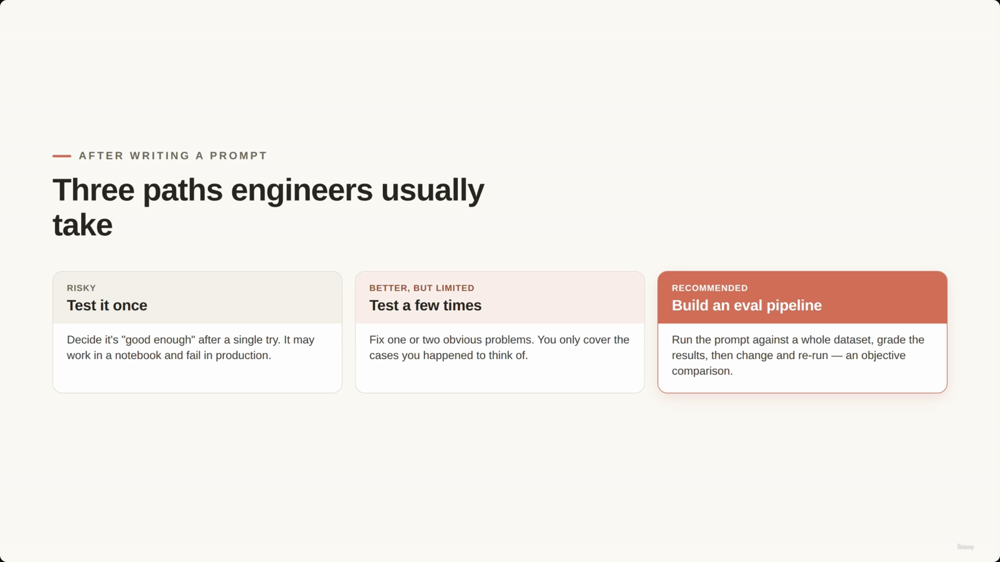

### The recommended path in more detail

- Create a dataset of test cases
- Run the prompt against every case in the dataset
- Grade the results
- Change the prompt and run the *exact same* eval again to compare

---

## 5. The Basic Eval Workflow

Evaluation is a **repeatable loop**, not a one-off check:

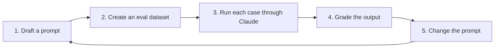

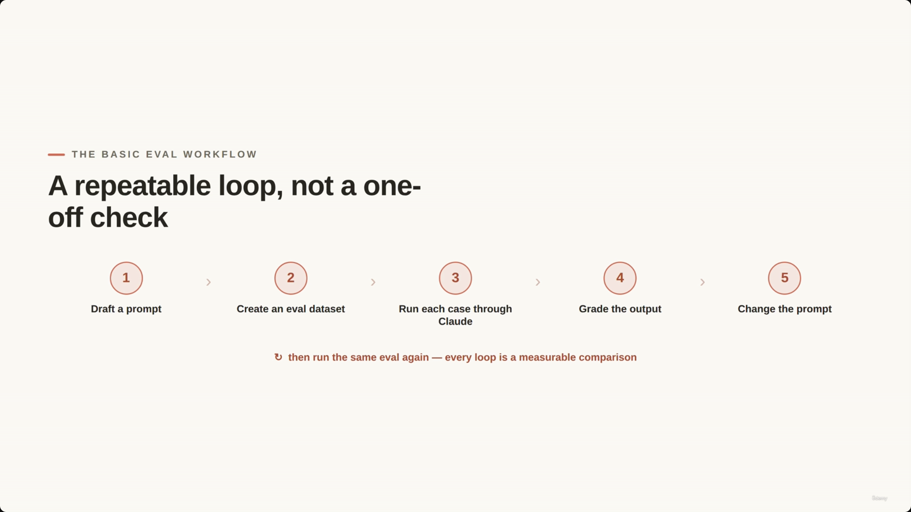

---

## 6. ShopAssist AI Evaluation Dataset

- **[The Dataset Structure]** To make an evaluation objective, each test case needs both an input and a known-correct answer:
  - **Input** — the raw customer message
  - **Expected Intent** — the ground-truth classification the AI should return

> **Transcript color:** "We already know what the correct answer should be. This is what makes it an eval."

```python
test_cases = [
    {
        "input": "I want to return my shoes. They arrived damaged.",
        "expected_intent": "refund_request"
    },
    {
        "input": "Where is my order? It was supposed to arrive yesterday.",
        "expected_intent": "order_status"
    },
    {
        "input": "I was charged twice for the same order.",
        "expected_intent": "billing_issue"
    }
]
```

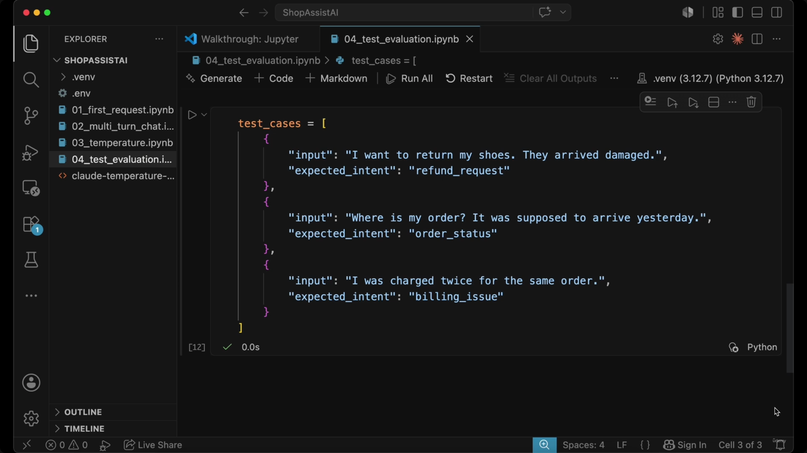

**[Note on this screenshot's placement]** In the original slide note this capture was filed chronologically right after "The Basic Eval Workflow" section, but its content is clearly the `test_cases` dataset code shown here — the capture lagged the actual slide/scroll transition. It's placed here instead, where it matches.

---

## 7. Running the Evaluation Loop

- To automate testing, iterate through `test_cases` and pass each input to the classification function:

```python
for test_case in test_cases:
    response = classify_intent(test_case["input"])
    print(response)
```

- At this point Claude returns an intent for each message, but the loop only *prints* the output — it doesn't yet check whether the result is correct.

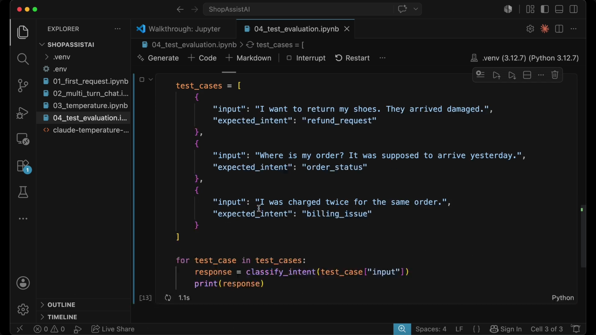

**[Note on this screenshot's placement]** The original slide note filed this capture under "Implementing `classify_intent`" (further down), but its visible content — the `test_cases` list plus the bare `for` loop with no comparison logic yet — matches this "Running the Evaluation Loop" section instead. Moved here for accuracy.

---

## 8. Implementing `classify_intent`

- This function handles the communication between the application and Claude to categorize customer messages.
- **[Configuration Details]**
  - **Model**: `claude-sonnet-4-6` (per the slide note; not visible in the captured screenshot itself — the `model` variable is defined elsewhere in the notebook, off-screen)
  - **Temperature**: `0`, because classification needs consistency and predictability, not creativity
  - **Output format**: plain JSON, so the Python code can parse it directly

```python
def classify_intent(customer_message):
    prompt = f'''
Classify the customer's message into one of these intents:
- refund_request
- order_status
- billing_issue
- product_question
- other

Customer message: {customer_message}

Return only a valid JSON object.
Do not include markdown.
Do not include explanations.
Do not wrap the JSON in a code block.

{{"intent": "refund_request"}}
'''
    message = client.messages.create(
        model=model,
        max_tokens=200,
        temperature=0,
        messages=[
            {
                "role": "user",
                "content": prompt
            }
        ]
    )
    return json.loads(message.content[0].text)
```

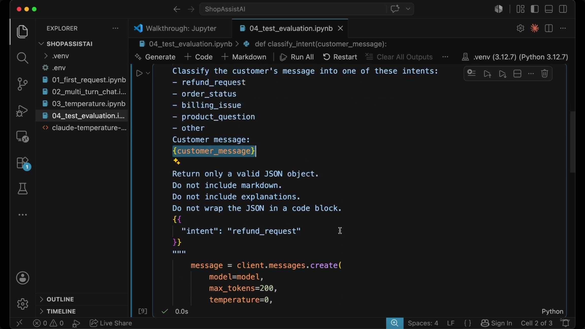

**[Note on this screenshot's placement]** The original slide note filed this capture under "ShopAssist AI Evaluation Dataset," but its content is the `classify_intent` function body (the prompt template and `client.messages.create` call) — it belongs here instead. Moved for accuracy.

---

## 9. Automating the Comparison

- Just printing the response isn't enough — it gives no clear signal of correctness.
- To automate grading, compare the actual intent against the expected intent from the test case:
  - Match → test **passes**
  - Mismatch → test **fails**

```python
for test_case in test_cases:
    response = classify_intent(test_case["input"])
    print(response)
    actual = response["intent"]
    expected = test_case["expected_intent"]
    passed = actual == expected
    print(passed)
```

Running this against the three-case dataset above produces:

```
{'intent': 'refund_request'}
True
{'intent': 'order_status'}
True
{'intent': 'billing_issue'}
True
```

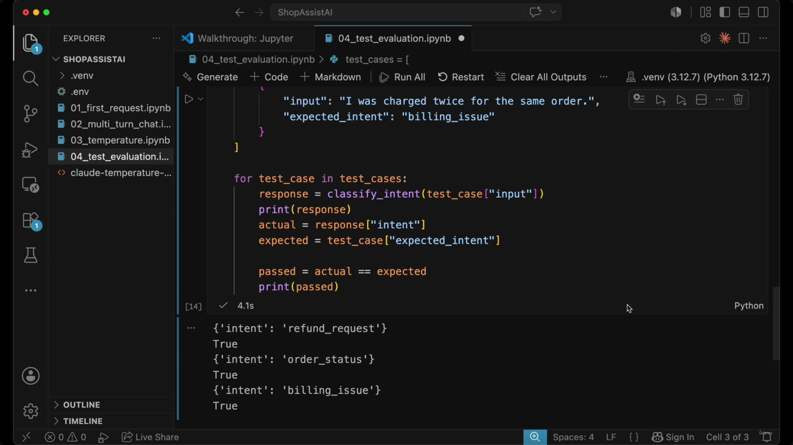

---

## 10. Measuring Results & the Prompt Engineering Workflow

- **[The Core Loop]** Prompt engineering becomes a measurable engineering workflow instead of a feeling:

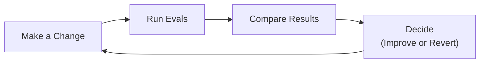

- **[Example Comparison]** Turning prompt changes into measurable data:

| Metric | Description |
|---|---|
| `passed` | `actual == expected` — the model output matches the ground truth |
| `failed` | `actual != expected` — the model output does not match the ground truth |

| Version | Score |
|---|---|
| First prompt | 7 / 10 |
| Improved prompt | 9 / 10 |

> **Key idea (slide):** "Prompt engineering shouldn't be a feeling. Change → run evals → compare → decide. A good prompt isn't one that sounds well-written — it's one that performs well across realistic examples."

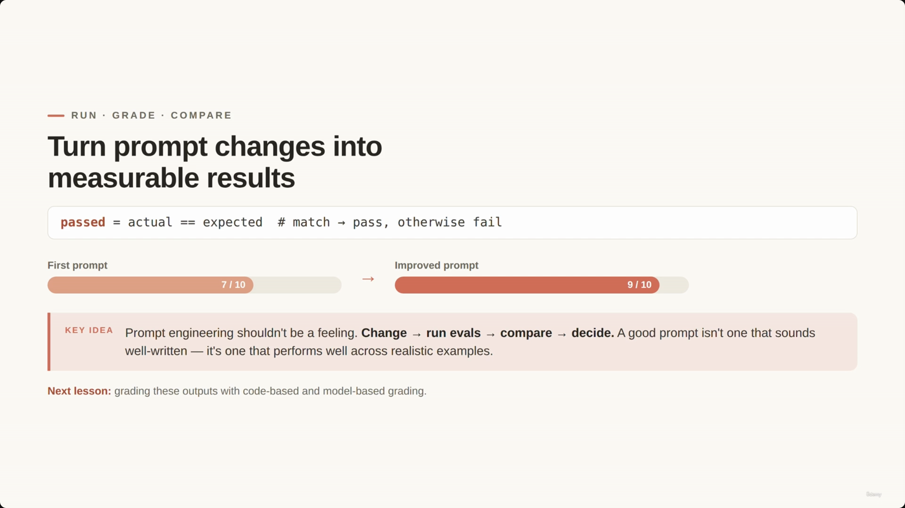

**[Note on this screenshot's placement]** The original slide note filed this capture under "Automating the Comparison," but its content is the closing "Turn prompt changes into measurable results" slide (the 7/10 → 9/10 bars) — it belongs in this final section instead. Moved for accuracy.

**[De-duplication note]** The slide note's own text repeats "The Prompt Engineering Workflow" as two separate headers near the end, each with its own near-identical bullet list and an almost-identical copy of this same four-step Mermaid diagram (`Make a Change → Run Evals → Compare Results → Decide`). Both instances describe the same loop; they've been consolidated into the single diagram and bullet list above rather than repeated.

---

## Summary

- **Prompt engineering** writes a better prompt; **prompt evaluation** proves it actually works — they're two halves of the same job.
- Manual, ad-hoc testing (a demo, a few hand-picked examples) is risky because real users send inputs you never planned for.
- The reframe: stop asking "does this look good?" and start asking "how does it perform across many realistic examples?"
- Of the three common paths (test once, test a few times, build an eval pipeline), only the eval pipeline gives an **objective** answer.
- The basic eval loop: draft a prompt → create an eval dataset (input + expected answer) → run each case through Claude → grade the output → change the prompt → repeat.
- A minimal eval needs three ingredients: a labeled `test_cases` dataset, a function that calls Claude (temperature `0` for classification, JSON-only output), and a comparison (`actual == expected`) that turns responses into pass/fail.
- A good prompt is defined by its measured performance across realistic examples (e.g., 7/10 → 9/10), not by how well-written it sounds.

> **Transcript color (closing):** "A good prompt is not just a prompt that sounds good. A good prompt is a prompt that performs well across realistic examples. In the next lesson, we will make this more systematic by looking at code-based grading and model-based grading."

---

## In Plain English

Here's the whole file in plain, everyday language:

**The big picture:** writing a good prompt is only half the job — this lecture is about the other half, proving the prompt actually works well by testing it against many realistic examples instead of just eyeballing a couple of test messages.

**1. The risky shortcut most people take**
Try the prompt on a couple of examples by hand, it looks good, ship it. The problem: real users send messy, unexpected inputs nobody planned for — multiple issues crammed into one message, vague wording, missing details — and a prompt that "looked fine" in your quick test can quietly fail on all of that.

**2. The mindset shift**
Stop asking "does this prompt look good to me?" and start asking "how does this prompt actually perform across a bunch of realistic examples?" — turn it into something measurable, not a feeling.

**3. The actual recipe for an eval**
Build a small dataset where each test case has both an input AND the known-correct answer, then loop through every case, send it to Claude, and compare what Claude actually returned to what you already know the correct answer should be — literally: did it match, yes or no.

**4. Why this beats hand-testing**
Now every time you change the prompt, you can rerun the exact same dataset and get an objective number (like "7 out of 10 passed") instead of just a vague feeling that "it seems better now."

**5. This turns prompt writing into a real loop, not a one-off**
Make a change → run the evals → compare the score → decide whether to keep it or roll it back → repeat.

**One-sentence summary:** A good prompt isn't one that "sounds well-written" — it's one you've actually proven works, by running it against a labeled test dataset and measuring pass/fail, so you can objectively compare prompt version 1 against prompt version 2 instead of just guessing.

---

## Full Walkthrough: One Test Case, Traced Step by Step (With Real JSON)

Everything above can feel abstract until you watch **one single test case** travel all the way through the eval loop. So let's follow just one, start to finish, with the actual prompt text, the actual API call, and the actual output. We'll use the first entry in this lecture's own `test_cases` list:

> **Input:** "I want to return my shoes. They arrived damaged."
> **Expected intent:** `refund_request`

---

### Step 1 — `classify_intent` builds the prompt

`classify_intent(customer_message)` takes that one input string and drops it into its f-string template. Filled in with this exact message, the prompt Claude actually receives looks like this:

```
Classify the customer's message into one of these intents:
- refund_request
- order_status
- billing_issue
- product_question
- other

Customer message: I want to return my shoes. They arrived damaged.

Return only a valid JSON object.
Do not include markdown.
Do not include explanations.
Do not wrap the JSON in a code block.

{"intent": "refund_request"}
```

Nothing fancy — the customer's sentence gets pasted in, the list of allowed intents is spelled out, and the last line is a tiny worked example showing Claude exactly what shape to answer in.

---

### Step 2 — the exact API call

`classify_intent` sends that whole prompt as a single user message, with the settings the lecture calls out specifically — `max_tokens=200` and `temperature=0`, because classification needs consistency, not creativity:

```python
message = client.messages.create(
    model=model,
    max_tokens=200,
    temperature=0,
    messages=[
        {
            "role": "user",
            "content": prompt
        }
    ]
)
```

`prompt` here is exactly the text block from Step 1 — nothing added, nothing removed.

---

### Step 3 — the raw text Claude sends back

Because the prompt insists on "only a valid JSON object, no markdown, no explanations, no code block," Claude's raw response text — before any parsing — is just:

```
{"intent": "refund_request"}
```

That's it. Not a sentence, not a code fence — just the JSON string sitting in `message.content[0].text`.

---

### Step 4 — `json.loads` turns text into a real dict

```python
return json.loads(message.content[0].text)
```

That one line converts the raw string above into an actual Python dictionary:

```python
{'intent': 'refund_request'}
```

This is the same value the captured notebook output prints on its very first line.

---

### Step 5 — comparing actual vs. expected

Back in the eval loop, three plain lines of code do the grading — no AI involved:

```python
actual = response["intent"]        # "refund_request"
expected = test_case["expected_intent"]  # "refund_request"
passed = actual == expected        # True
```

`actual` and `expected` match, so `passed` is `True` — exactly matching the real captured output for this case:

```
{'intent': 'refund_request'}
True
```

That's the entire trace: one message → one prompt → one API call → one JSON reply → one dict → one `True`/`False`. Nothing else is happening.

---

### Zooming out: the same trace, run 3 times

The eval loop doesn't do anything different for the other two test cases — it repeats this exact five-step trace, once per entry in `test_cases`. Here's the real captured result for all three:

| Input | Expected intent | Actual (`response`) | `passed` |
|---|---|---|---|
| "I want to return my shoes. They arrived damaged." | `refund_request` | `{'intent': 'refund_request'}` | `True` |
| "Where is my order? It was supposed to arrive yesterday." | `order_status` | `{'intent': 'order_status'}` | `True` |
| "I was charged twice for the same order." | `billing_issue` | `{'intent': 'billing_issue'}` | `True` |

Same prompt template, same `max_tokens=200` / `temperature=0` call, same `json.loads`, same comparison — just three different input strings looped through it. All three passed.

---

### How this becomes a score like 7/10 or 9/10

This lecture's own comparison table shows a first prompt scoring **7/10** and an improved prompt scoring **9/10**. Those numbers aren't measured by anything special — they come from doing exactly the trace above, over and over, once per test case in a (larger) dataset, and then counting how many came back `True`.

In plain words: `passed = actual == expected` for test case 1, then again for test case 2, then again for test case 3, then again for every other test case in the dataset. Add up the `True`s, and that total *is* the score. Change the prompt, rerun the identical loop over the identical dataset, and you get a new total to compare against the old one — that's the whole difference between a 7 and a 9.

---

**The one thing to hold onto:** an eval is nothing fancier than this one-case trace — build prompt, call Claude, parse JSON, compare to the known answer — copy-pasted across a whole dataset and tallied up.

---

*Sources: [slide notes](../10-Prompt-Evaluation-Workflow%201.md) · [[hover-notes-transcripts/10-Prompt-Evaluation-Workflow (transcript)|full transcript]]*
