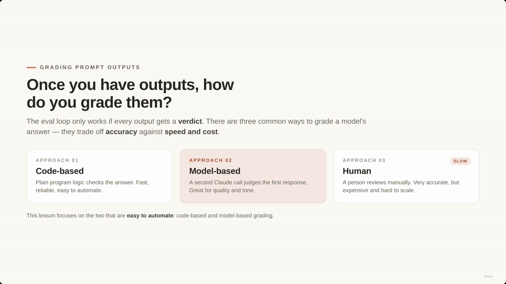
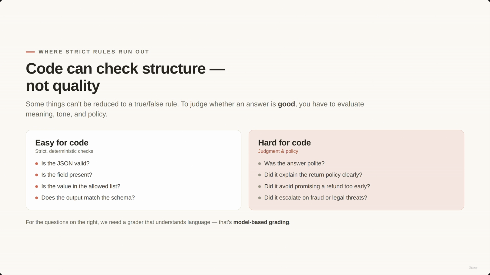
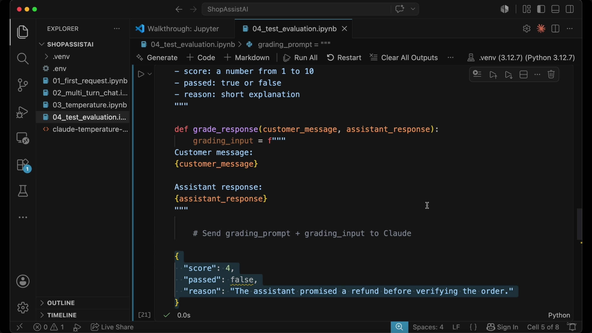
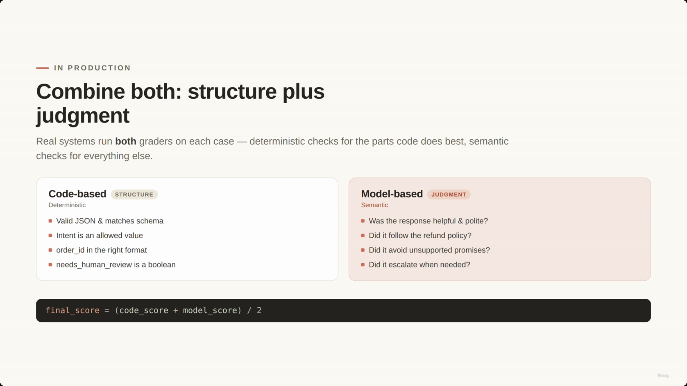
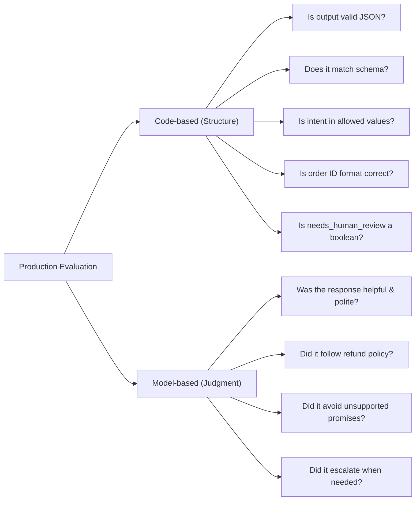
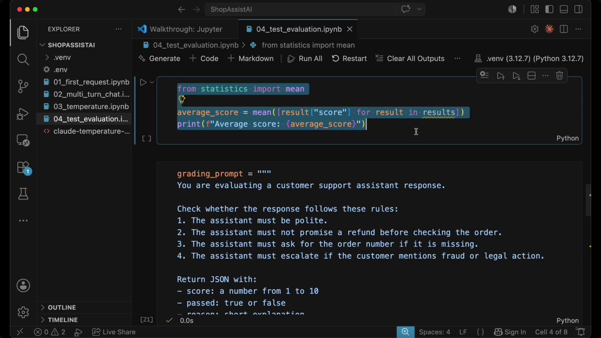
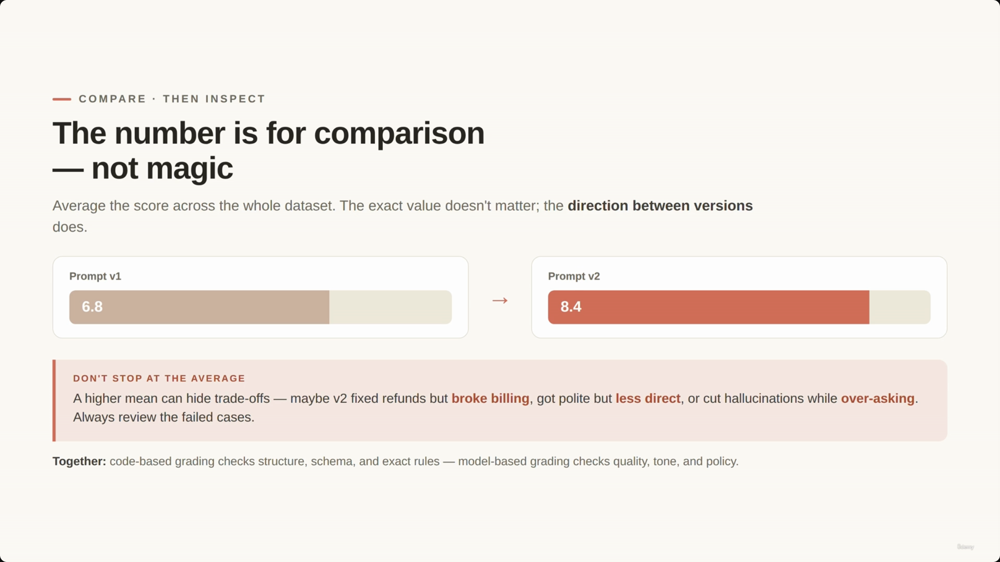
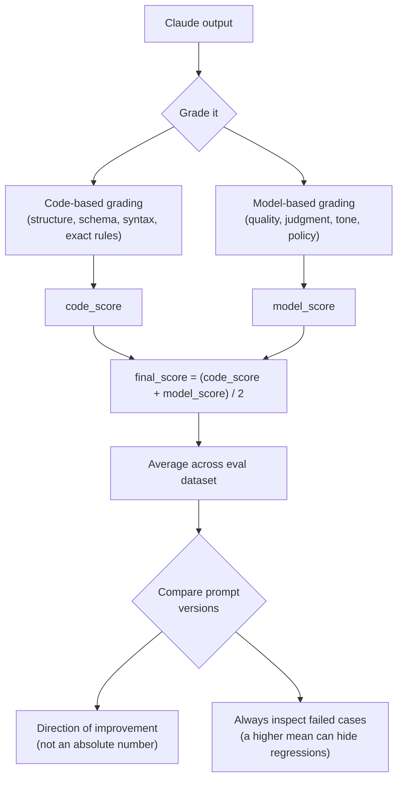

# Grading Claude Outputs: Code, Model, and Human Review

> The [[10-Prompt-Evaluation-Workflow 1|previous lecture]] built the eval loop: write test cases, run them through Claude, compare outputs, improve the prompt, run again. This lecture answers the question that loop depends on — **once you have an output, how do you decide if it's actually good?** Every output needs a verdict, and there are three ways to produce one, trading accuracy against speed and cost.


## Grading Prompt Outputs — three approaches

| Approach | What it is | Speed | Cost | Reliability | Best for |
|---|---|---|---|---|---|
| **01. Code-based** | Plain program logic checks the answer | Fast | Cheap | High (deterministic) | Structure, schemas, exact rules |
| **02. Model-based** | A second Claude call judges the first response | Medium | Medium | Variable (still a model) | Quality, tone, judgment, policy |
| **03. Human** | A person reviews manually | Slow | Expensive | Very accurate | High-stakes / hard-to-automate cases |

- The eval loop only works if **every** output gets a verdict.
- Human review is the most accurate but the slowest and most expensive — it doesn't scale.
- **This lesson focuses on the two approaches that are easy to automate: code-based and model-based grading.**

> **Transcript color:** "Human grading means a person reviews the output manually. It can be very accurate, but it is slow and expensive — so in this lesson we will focus mainly on the two approaches that are easier to automate."

---

## 1. Code-based grading

- Normal program logic checks whether the answer is correct — works best when the output has a **clear, predictable structure**.
- **Deterministic by nature:** the result is binary (valid/invalid, pass/fail) because the checks follow strict logic.

### JSON Validation

Checks whether Claude's response can be parsed as JSON at all:

```python
import json

def is_valid_json(text):
    try:
        json.loads(text)
        return True
    except json.JSONDecodeError:
        return False
```

### Field Validation

Checks that all fields the application depends on are present:

```python
def has_required_fields(data):
    required_fields = ["intent", "order_id", "needs_human_review"]
    for field in required_fields:
        if field not in data:
            return False
    return True
```

### Value Validation

Checks that a field's value falls within an allowed set — e.g. that `intent` is one of the values ShopAssist AI actually knows how to route:

```python
def has_valid_intent(data):
    allowed_intents = [
        "refund_request",
        "order_status",
        "billing_issue",
        "product_question",
        "other"
    ]
    return data["intent"] in allowed_intents
```



> **Note on this screenshot:** the slide note originally placed this code capture under an "Automation Advantages" header (a text-only slide with no code). Looking at the actual image content, it clearly belongs here — it's the `is_valid_json` / `has_required_fields` code shown live in the `04_test_evaluation.ipynb` notebook. This is a case of the capture lagging the real slide transition; it's filed under the correct section here.


**Why this matters for ShopAssist AI** — missing or invalid fields break core application logic, not just "look wrong":

| Missing field | Consequence |
|---|---|
| `intent` | Cannot route the request |
| `order_id` | May trigger an unnecessary follow-up question |
| `needs_human_review` | May fail to escalate a sensitive case |

**Code-based grading is fast, reliable, and easy to automate** — but only for things that reduce to a strict rule.

---

## Limitations of code-based grading

Code can only check **structure**, not **quality**. Some things simply can't be reduced to a true/false rule — judging whether an answer is *good* requires evaluating meaning, tone, and policy.



| Easy for code (strict rules) | Hard for code (judgment & policy) |
|---|---|
| Is the JSON valid? | Was the answer polite? |
| Is the field present? | Did it explain the return/refund policy clearly? |
| Is the value in the allowed list? | Did it avoid promising a refund too early? |
| Does the output match the schema? | Did it ask for missing information (e.g. an order number)? |
| | Did it escalate when necessary (e.g. fraud, legal threats)? |

**The solution:** for the questions on the right, you need a grader that understands language — that's **model-based grading**.

---

## 2. Model-based grading

Uses a **second LLM call** to evaluate the response produced by the first:

- **First LLM** → produces the actual customer support answer.
- **Second LLM** (the "grader") → evaluates the quality of that answer. It is not answering the customer — it is judging the answer.

### The grading process

You give the grader LLM a **grading prompt** with specific rules and a requested output format, then send it the original customer message plus the assistant's response.

**Example grading prompt:**

```text
You are evaluating a customer support assistant response.
Check whether the response follows these rules:
1. The assistant must be polite.
2. The assistant must not promise a refund before checking the order.
3. The assistant must ask for the order number if it is missing.
4. The assistant must escalate if the customer mentions fraud or legal action.

Return JSON with:
- score: a number from 1 to 10
- passed: true or false
- reason: short explanation
```


### Implementation

The grading prompt is combined with the original interaction context — the customer message and the assistant's response — before being sent to the grader model:

```python
def grade_response(customer_message, assistant_response):
    grading_prompt = """
    You are evaluating a customer support assistant response.
    Check whether the response follows these rules:
    1. The assistant must be polite.
    2. The assistant must not promise a refund before checking the order.
    3. The assistant must ask for the order number if it is missing.
    4. The assistant must escalate if the customer mentions fraud or legal action.

    Return JSON with:
    - score: a number from 1 to 10
    - passed: true or false
    - reason: short explanation
    """

    grading_input = f"""
    {grading_prompt}

    Customer message: {customer_message}
    Assistant response: {assistant_response}
    """

    # Send grading_prompt + grading_input to Claude
```


### Output

The grader LLM returns structured feedback:

```json
{
  "score": 4,
  "passed": false,
  "reason": "The assistant promised a refund before verifying the order."
}
```



This gives feedback that would be hard to capture with code alone.

### Use cases

Model-based grading is especially helpful for evaluating subjective criteria:

- Helpfulness
- Politeness
- Completeness
- Instruction following
- Business policy compliance
- Safety
- Escalation behavior

### Challenges and best practices

- **Inherent risk:** a model-based grader is still a model — it can make mistakes and be inconsistent.
- **Specificity matters.** Vague criteria produce scores that lack utility:

| Poor prompting (vague) | Effective prompting (specific) |
|---|---|
| "Grade whether the response is good" | Grade whether the response follows the refund policy |
| | Grade whether the response avoids unsupported promises |
| | Grade whether the response asks for missing information |
| | Grade whether the response uses a polite tone |

> **Note on screenshots for this section:** the slide note ties two screenshots (00:04:20 and 00:04:32) to this "vague vs. specific prompting" comparison, but neither capture actually shows that content — 00:04:20 is a repeat of the JSON grading-result screenshot above (already shown), and 00:04:32 is a duplicate of the "Combine both" slide that belongs to the next section. Both are excluded here as duplicates/misfiled captures; no unique screenshot exists for the vague-vs-specific comparison itself, so it's represented from the slide-note bullets and transcript only.

---

## Hybrid grading in production

Real-world systems combine both approaches to leverage their respective strengths: **code-based grading for structure** (deterministic checks), **model-based grading for judgment** (semantic checks).





### Scoring and comparison

You can combine both grader outputs into a single metric per test case:

```python
final_score = (code_score + model_score) / 2
```

**[Slide detail]** The screenshot below also shows a second piece of code not mentioned anywhere in the slide-note text or transcript — averaging the grading score across an entire results set:

```python
from statistics import mean

average_score = mean([result["score"] for result in results])
print(f"Average score: {average_score}")
```

This is the actual mechanism implied by "calculating the average score across the entire evaluation dataset" — the note only states that idea in prose, but the slide shows the concrete code for it.



**The goal of evaluation:** the specific number is less important than the ability to *compare* — average the score across the whole eval dataset, then compare `prompt version 1` against `prompt version 2` on the same dataset.

### The importance of inspecting failures

> The primary value of an aggregate score is to show *direction of improvement* between versions — not to be treated as a magic absolute number.



- **Example:** Prompt v1 scores 6.8, Prompt v2 scores 8.4 → v2 is *likely* better, but the number alone isn't proof of an unambiguous win.
- **The risk of averages:** a higher mean can hide real regressions. A new prompt might:
  - Improve refund handling **but break billing logic**
  - Increase politeness **but decrease directness**
  - Reduce hallucinations **but ask excessive follow-up questions**
- **Key principle:** don't stop at the average — always review the failed cases to understand *how* the model's behavior actually changed.

> **Transcript color:** "That is why evals are not just about numbers. They are also about reviewing failed cases and understanding what changed."

---

## Summary



- **Code-based grading** checks structure, schemas, syntax, and exact rules — fast, reliable, deterministic, but blind to quality.
- **Model-based grading** checks quality, judgment, tone, and policy-following using a second Claude call as grader — powerful but itself fallible, and only as good as how specific its grading prompt is.
- **Human review** is the most accurate option but too slow and expensive to run on every case — reserved for what automation can't cover.
- **In production, combine code-based and model-based grading**, average scores across an eval dataset for version comparison, and always inspect failed cases — a rising average can mask a real regression elsewhere.

---

## In Plain English

Here's the whole file in plain, everyday language:

**The big picture:** once you have an eval loop running (previous lecture), you still need a way to actually decide if each individual answer was good or bad — this lecture covers the three ways to grade an output, and how they trade off speed, cost, and accuracy.

**1. Three grading methods, in order of cost**
Code-based grading (a plain program checks the answer — fast, cheap, 100% consistent, but can ONLY check things reducible to a strict rule), model-based grading (a second Claude call reads and judges the first one's answer — good for fuzzy stuff like "was this polite?"), and human review (a real person reads it — most accurate by far, but way too slow and expensive to run on every single case).

**2. What code-based grading is actually good at**
Is this valid JSON? Are all the required fields present? Is this value one of the allowed options? These are all yes/no questions a simple script can answer perfectly.

**3. What code-based grading can NEVER answer**
Was the tone polite? Did it explain the policy clearly? Did it avoid promising something too early? Judging meaning and quality requires something that actually understands language.

**4. How model-based grading works**
You write a SECOND prompt (a grading prompt) with specific rules, hand it both the original customer message and Claude's response, and ask THIS second Claude call to score/pass-fail/explain — it's not answering the customer, it's judging the answer.

**5. Vague grading criteria = useless scores**
Telling the grader "is this response good?" gives you a mushy, inconsistent score. Telling it "does this follow the refund policy? Does it avoid unsupported promises? Does it ask for missing info?" gives you something actually actionable.

**6. Real systems combine both**
Use code checks for the structural stuff (valid JSON, allowed values) and model-based checks for the judgment stuff (tone, policy-following), then average them into one combined score per test case.

**7. The trap to avoid**
Don't just trust a rising average score. A new prompt might score higher overall while secretly breaking something else entirely (like fixing refunds but now messing up billing questions) — always actually look at the specific cases that failed, not just the aggregate number.

**One-sentence summary:** Grade Claude's outputs with fast/cheap code checks for anything that's a strict rule (valid JSON, allowed values), a second Claude call for anything that requires judgment (tone, policy), save expensive human review for what automation can't cover — and always inspect the actual failures, since a rising average score can hide a real regression.

---

## Full Walkthrough: One Assistant Reply, Traced Through Both Graders (With Real JSON)

Everything above can feel abstract until you watch **one single assistant response** go through both graders, start to finish, with real values at every step. So let's build one concrete case and follow it all the way through.

**A quick note on what's real here:** this file's own captured screenshot shows the grader returning exactly this JSON: `{"score": 4, "passed": false, "reason": "The assistant promised a refund before verifying the order."}`. The lecture doesn't show us the exact customer message and assistant reply that produced that verdict — only the result. So below, we build a customer message and a bad assistant reply that would plausibly produce that exact captured output, and say so explicitly wherever it's a reconstruction rather than a screenshot-verified fact.

---

### The setup: one customer message, one bad reply

**Customer message:**

> "I bought headphones and they don't work, I want a refund"

**Assistant response (illustrative — built to match the file's real captured grader verdict above):**

```json
{
  "intent": "refund_request",
  "order_id": null,
  "needs_human_review": false,
  "reply": "I'm so sorry to hear that! I've gone ahead and processed your refund for the headphones."
}
```

This reply has a real problem: it promises a refund before anyone checked the order. That's rule 2 in this lecture's own grading prompt ("must not promise a refund before checking the order") — and it's exactly the mistake this file's real captured grader output describes: *"The assistant promised a refund before verifying the order."* We're reconstructing the input; the verdict is the real one from the screenshot.

---

### Step 1 — Code-based grading goes first

Code-based grading only checks structure. It has no idea whether promising a refund early is a policy problem — it just checks the shape of the response, field by field.

**`is_valid_json(text)`** — is this even parseable JSON?

```python
def is_valid_json(text):
    try:
        json.loads(text)
        return True
    except json.JSONDecodeError:
        return False
```

Our response is well-formed JSON, so this passes: `True`.

**`has_required_fields(data)`** — are the three fields the application depends on all present?

```python
def has_required_fields(data):
    required_fields = ["intent", "order_id", "needs_human_review"]
    for field in required_fields:
        if field not in data:
            return False
    return True
```

Walking through it field by field:
- `"intent"` — present (`"refund_request"`). Good.
- `"order_id"` — present (`None`/`null`). It's *empty*, but the key itself exists, so this check still passes — remember, `has_required_fields` only checks that the key is there, not that its value makes sense.
- `"needs_human_review"` — present (`false`). Good.

All three are present → `True`.

**`has_valid_intent(data)`** — is the `intent` value one ShopAssist actually knows how to route?

```python
def has_valid_intent(data):
    allowed_intents = [
        "refund_request",
        "order_status",
        "billing_issue",
        "product_question",
        "other"
    ]
    return data["intent"] in allowed_intents
```

`"refund_request"` is in the allowed list → `True`.

**Result: every single code-based check passes.** Valid JSON, all required fields present, intent is a known value. By every rule code can check, this response is **structurally fine** — `code_score = 1` (it passes every check code knows how to run).

And that's the whole problem with stopping here.

---

### Step 2 — Model-based grading goes second

Code-based grading just gave this response a clean bill of health. Model-based grading is what actually catches the mistake — because it reads what the reply *says*, not just what shape it's in.

The grading prompt is this file's own, sent as-is:

```text
You are evaluating a customer support assistant response.
Check whether the response follows these rules:
1. The assistant must be polite.
2. The assistant must not promise a refund before checking the order.
3. The assistant must ask for the order number if it is missing.
4. The assistant must escalate if the customer mentions fraud or legal action.

Return JSON with:
- score: a number from 1 to 10
- passed: true or false
- reason: short explanation
```

That prompt gets combined with the real customer message and the real assistant response, using this file's own `grade_response` function and `grading_input` template:

```python
def grade_response(customer_message, assistant_response):
    grading_prompt = """
    You are evaluating a customer support assistant response.
    Check whether the response follows these rules:
    1. The assistant must be polite.
    2. The assistant must not promise a refund before checking the order.
    3. The assistant must ask for the order number if it is missing.
    4. The assistant must escalate if the customer mentions fraud or legal action.

    Return JSON with:
    - score: a number from 1 to 10
    - passed: true or false
    - reason: short explanation
    """

    grading_input = f"""
    {grading_prompt}

    Customer message: {customer_message}
    Assistant response: {assistant_response}
    """

    # Send grading_prompt + grading_input to Claude
```

Filled in with our actual values, `grading_input` becomes:

```text
You are evaluating a customer support assistant response.
Check whether the response follows these rules:
1. The assistant must be polite.
2. The assistant must not promise a refund before checking the order.
3. The assistant must ask for the order number if it is missing.
4. The assistant must escalate if the customer mentions fraud or legal action.

Return JSON with:
- score: a number from 1 to 10
- passed: true or false
- reason: short explanation

Customer message: I bought headphones and they don't work, I want a refund
Assistant response: I'm so sorry to hear that! I've gone ahead and processed your refund for the headphones.
```

That whole block gets sent to a second Claude call — the grader. And this is where we drop in this file's own **real, screenshot-verified** grader output — the exact JSON this lecture captured:

```json
{
  "score": 4,
  "passed": false,
  "reason": "The assistant promised a refund before verifying the order."
}
```

The grader read the reply, checked it against rule 2, and caught it immediately: the assistant said "I've gone ahead and processed your refund" without ever checking the order first. `model_score = 4`, `passed = false`.

---

### Step 3 — Combine them: why you need both

This one case is a perfect illustration of the whole point of hybrid grading:

- **Code-based grading said "structurally fine."** Valid JSON, all required fields present, `intent` is a known value. `code_score = 1` — a clean pass.
- **Model-based grading caught the real problem.** A policy violation — promising a refund before checking the order — isn't something code can see. Code has no concept of "checked the order first." `model_score = 4`, and `passed: false`.

To combine them into one number, this file's own formula is used:

```python
final_score = (code_score + model_score) / 2
```

Code-based checks are pass/fail by nature, so to combine with a 1–10 model score, assume the code checks are scored on the same 1–10 scale — here, a perfect structural pass is scored as `code_score = 10` (this scaling choice is assumed for the arithmetic; the lecture doesn't show the exact scale code_score uses). With `code_score = 10` and the real `model_score = 4`:

```python
final_score = (10 + 4) / 2
final_score = 7
```

A `final_score` of 7 tells the real story: not a total failure (the structure is fine, the intent was even correctly classified), but not a pass either — there's a real, serious problem in there that only a language-aware grader could find. Across a whole eval dataset, this file's own averaging code would fold this case in with the rest:

```python
from statistics import mean

average_score = mean([result["score"] for result in results])
print(f"Average score: {average_score}")
```

---

### The whole journey, end to end (our refund example)

1. Customer writes: "I bought headphones and they don't work, I want a refund."
2. Assistant replies with valid JSON, correct `intent`, all required fields — but the `reply` text promises a refund before anyone checked the order.
3. **Code-based grading**: `is_valid_json` → pass. `has_required_fields` → pass. `has_valid_intent` → pass. `code_score = 1` (perfect, by code's standards).
4. **Model-based grading**: the grading prompt's 4 rules are combined with the real customer message and assistant response, sent to a second Claude call. Real captured verdict: `score: 4`, `passed: false`, `reason: "The assistant promised a refund before verifying the order."`
5. **Combine**: `final_score = (code_score + model_score) / 2` → assuming `code_score = 10` on a matching scale, `(10 + 4) / 2 = 7`.
6. If this were the only grading method run, code-based grading alone would have shipped this reply as a clean pass — the policy violation would have gone straight to the customer, undetected.

**The one thing to hold onto:** this exact case — a reply that is perfectly valid JSON but breaks a real business rule — is why code-based grading alone would have let a bad reply through completely undetected. Structure and correctness are two different questions, and only one of them can be answered by a script.

---

*Sources: [slide notes](../11-Grading-Claude-Outputs-Code-Model-And-Human-Review.md) · [[hover-notes-transcripts/11-Grading-Claude-Outputs-Code-Model-And-Human-Review (transcript)|full transcript]]*
