# Batch Processing And Multi-Pass Review Architectures

> This lecture moves from single-item reliability to system-level architecture. [[17-...|Lecture 17]] covered making **one** extraction reliable (validation, retry loops, confidence scores, human review). This lecture asks: what happens when there isn't one document, but 10,000 — and what happens when the output is high-stakes enough that one Claude response reviewing itself isn't good enough?

> **Transcript color:** "In the previous lessons, we learned how to make structured extraction more reliable with validation, retry loops, confidence scores, and human review. Now we need to ask a bigger architecture question."

Two independent problems, two patterns:
- **Scale** — the synchronous Messages API doesn't fit thousands of latency-tolerant requests → the **Message Batches API**.
- **Quality on high-stakes output** — a single Claude call grading its own work has blind spots → **independent multi-pass review**.

---

## Architecture & Scale

### From Single Extractions to Large Batches

- The synchronous Messages API processes **one request at a time** — not ideal for large, latency-tolerant work.
- Scaling to thousands of items (support tickets, audit logs, bulk summary generation) needs a different approach.

### The Message Batches API

- An **asynchronous** method: submit many requests together, retrieve results later.
- **[Key Characteristics]**
  - Asynchronous & latency-tolerant
  - Runs in the background
  - Approximately **50% cheaper**
  - Up to **24h**, no latency SLA

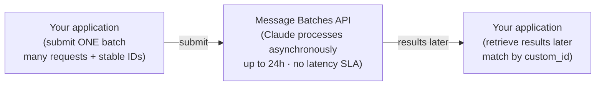

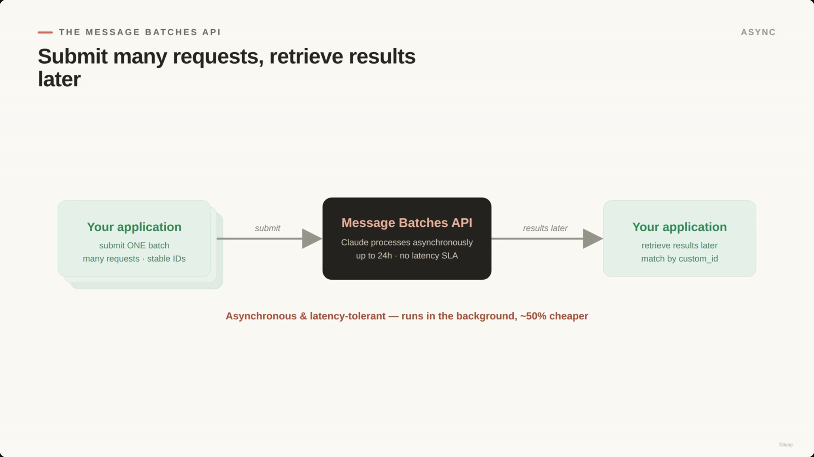

### Benefits of Batch Processing

- **[Cost Efficiency]** ~50% lower cost than standard synchronous API calls.
- **[Suitability]** Ideal for work that doesn't need an immediate answer.


### Choosing Between Synchronous and Batch APIs

| | Use when... | ShopAssist example |
|---|---|---|
| **Synchronous** | A user is actively waiting for a response | Customer chatting: "Can I return this item?" |
| **Batch** | The workload is large and latency-tolerant | Auditing all support tickets from last night |

A nightly ticket audit can run offline to: classify tickets, detect risky refunds, find policy exceptions, and flag cases for human review.

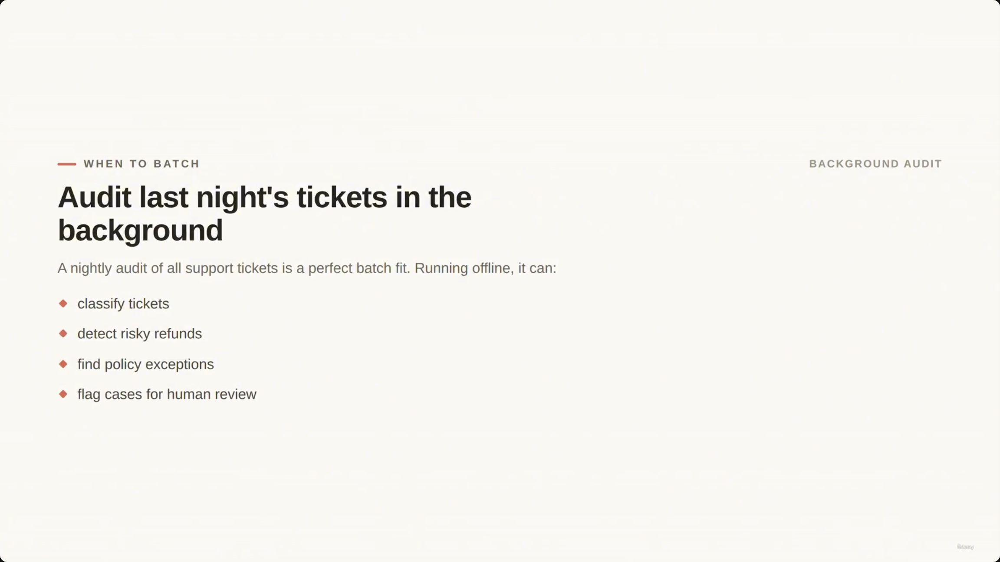

### The Latency Trade-off

- **[The Trade-off]** Batch is built for offline workflows, not blocking ones.
  - A batch can take up to **24 hours**.
  - There is **no guaranteed latency SLA**.
- **Offline (good for batch):** a nightly ticket audit.
- **Blocking (bad for batch):** a task needing an immediate pass/fail, e.g. a pre-merge CI check.

> **Transcript color:** "A pre-merge check in CI should usually not wait on a batch job. If a developer opens a pull request and needs a pass or fail result before merging, that review should use a normal API call or a faster workflow."

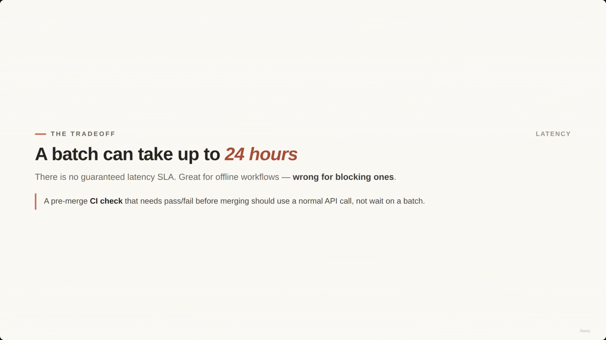

### Correlating Results with `custom_id`

- **[Purpose]** Matches each asynchronous result back to its specific input.
- **[Why it's needed]** Batch results may come back **out of order** — stable IDs let you update the correct audit record regardless of return sequence.

```text
Example IDs:
ticket_1001
ticket_1002
ticket_1003
```


### Tools in Batch

- **[No Live Loop]** A batch request cannot support a mid-request tool loop.
  - In a live workflow: Claude requests a tool → the app executes it → the result is sent back to Claude, in a round-trip.
  - A single batch request **cannot** perform that round-trip during reasoning.
  - If a task needs multiple live tool calls during reasoning, use a different architecture (not batch).


> **[Misfiled in source]** The slide note places this screenshot's timestamp (00:02:41) directly after the `custom_id` code block, chronologically inside the "Correlating Results" section — but the slide it actually captures is this "Tools in Batch" slide. The capture appears to lag the real transition by roughly one topic throughout this stretch of the lecture; content, not timestamp position, decided the placement here (and for several screenshots below).

### Preparing Context for Batch Jobs

- **[The Requirement]** Because a batch request can't run a mid-request tool loop, all context must be assembled **before** submission.
- **Example — auditing a support ticket**, gather upfront: ticket text, customer tier, order status, refund history, policy version.

### Best Practices for Scaling

- **[Test on a Sample]** Don't start by submitting a massive batch (e.g., 10,000 documents).
- **Iterative Refinement Process:**
  1. Start with a small sample
  2. Review the outputs
  3. Identify common mistakes
  4. Improve the prompt, schema, and validation rules
  5. Run the larger batch
- **[The Goal]** Avoid wasting cost on a flawed prompt or incorrect schema across a large dataset.


> **[Duplicate noted]** The slide note also references this same "Don't start with ten thousand documents" slide at 00:03:26 (`screenshot-01M1PFE1S38G9FEGK72WRT7KYE.png`), filed one section early under "Tools in Batch." Same slide, no new content — only the 00:03:41 capture above is kept.

### Handling Failures in Batch Jobs

- **[Resubmit Selectively]** If some requests in a batch fail, don't resubmit the entire batch — identify only the failed documents and resend just those.
- **[Connection to Stable IDs]** This selective resubmission works *because* stable IDs let you track and target the specific failed items.


> **[Misfiled in source]** This screenshot's timestamp (00:03:47) sits under "Best Practices for Scaling" in the slide note, but its content ("Resubmit only the failed documents") is this section's slide, not that one.

---

## Review Architecture

- **[The Problem with Self-Review]** Asking the same Claude response to review itself has limits — the model may miss the same assumptions and mistakes baked into the original answer.
- **[Higher Reliability: Independent Instances]** Use **separate** Claude calls for generation and review:
  - One Claude call **generates** the output.
  - A separate Claude call **reviews** it, using a different prompt, role, or more focused criteria.

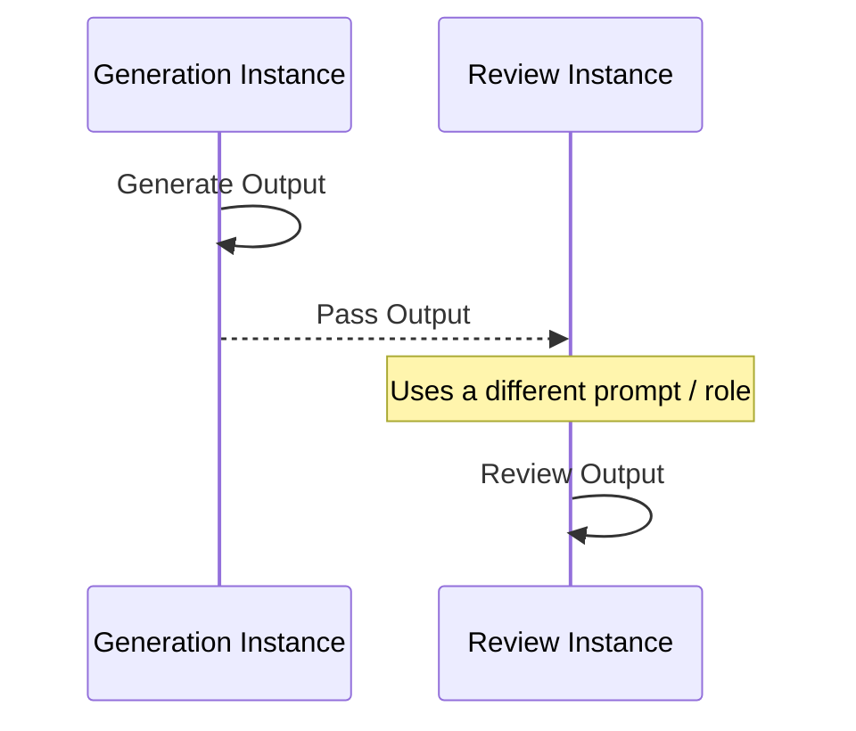

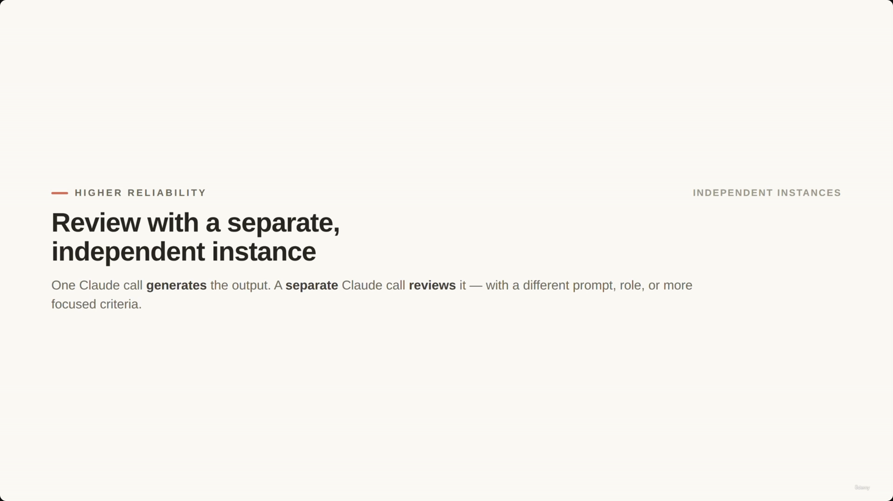

> **[Duplicate noted]** The identical "Review with a separate, independent instance" slide is also captured at 00:04:19 (`screenshot-01M1PFF3QNMBMZQQ6F5SFE1KJP.png`), misfiled one section early under "Best Practices for Scaling." Only the 00:04:26 capture above is kept.

---

## Multi-Pass Review

- **[Concept]** A sequence of distinct Claude calls refines an output:
  - **Pass 1** — produces or analyzes the initial content
  - **Pass 2** — reviews the output using a different prompt, role, or more focused criteria
  - **Pass 3** — integrates findings (e.g., routing to a human)

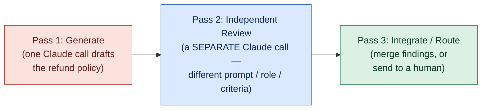

**[Slide detail]** The slide's own caption for this pattern: *"Independent review catches what a response can't catch in itself."* — not spoken verbatim in the transcript or written in the original slide-note bullets, but a clean summary of the whole section's point.


> **[Misfiled in source]** Filed under "Review Architecture" at 00:04:52 in the slide note; content-wise this three-pass diagram belongs to "Multi-Pass Review."

### Example: Policy Review

- **Request 1 (Drafting):** Drafts a refund-resolution policy.
- **Request 2 (Reviewing):** Checks the draft against specific questions:
  - Does it follow the refund rules?
  - Does it create legal or compliance risk?
  - Does it require human approval?
  - Does it contradict any existing policy?


> **[Misfiled in source]** Filed under "Review Architecture" at 00:04:47 in the slide note ("Draft once, review with fresh eyes"); content-wise this is the Policy Review example that belongs here.

- **[Use Cases]** Especially effective for: code review, policy review, support summaries, document analysis.

---

## Large Codebases & Document Sets

> The slide note repeats this section's heading and core diagram twice in immediate succession (once as "Large Codebases & Document Sets," once as "Local-to-Integration Analysis Pattern") — same pattern, same two-pass idea, just restated. Merged here into one section rather than duplicated.

- **[The Pattern]** Analyze individual components locally before looking for systemic patterns.
  - **Pass 1 — Local Analysis:** Claude reviews each file or document separately. Results are small, structured, and focused.
  - **Pass 2 — Integration Analysis:** Runs **only after** every local pass is complete. Looks across the per-file findings for:
    - Conflicts?
    - Repeated issues?
    - Does one file break another's assumptions?
    - Highest-priority findings?

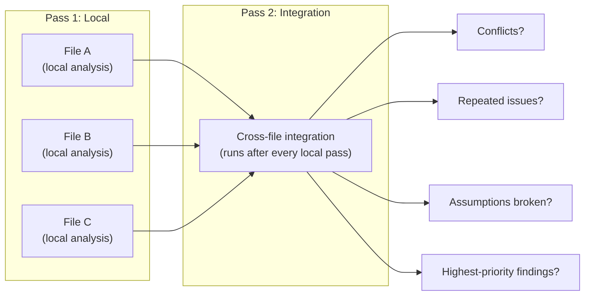


> **[Duplicate noted]** The same "Analyse each file, then look across them" slide is also captured at 00:05:09 (`screenshot-01M1PFHQHWGRZV0V1584B7M5KX.png`), misfiled one section early under "Review Architecture." Only the 00:05:12 capture above is kept.

- **[Why it's better than one giant prompt]**
  - **Traceability** — you know exactly which file produced which finding.
  - **Filtering** — you can filter out low-confidence results before the integration step.
  - **Efficiency** — integration analysis only runs once local analysis is fully complete.

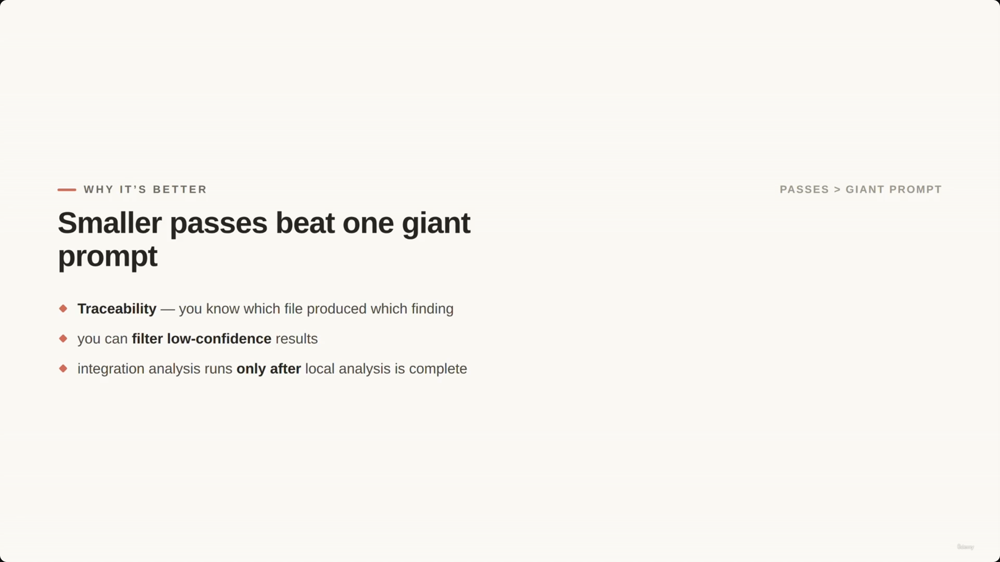

---

## Lesson Summary

### Match the Processing Model to the Requirement

- **Synchronous** — use when the user is actively waiting for a response.
- **Batch** — use when the work is large and latency-tolerant.
- **`custom_id`** — use to correlate asynchronous results.
- **Context Preparation** — prepare all tool context before submitting a batch request.
- **Scaling Strategy** — test prompts on a small sample before scaling to a large dataset.
- **Failure Handling** — resubmit only the specific documents that failed.
- **High-Stakes Review** — prefer independent multi-pass review over simple self-review.

**[Three things to avoid]**

- Batching when an immediate answer is needed.
- Relying only on self-review for high-stakes calls.
- Solving a large review in one giant prompt.

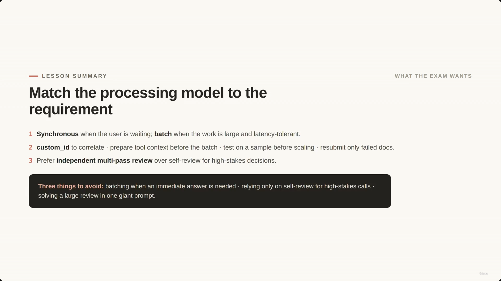

> **[Misfiled in source]** Filed under the second "Large Codebases & Document Sets" occurrence at 00:05:58 in the slide note; content-wise this "Match the processing model to the requirement" slide is the Lesson Summary's opening slide.

### Putting It Together: ShopAssist Use Cases

> The slide note lists this same Task → Method table twice under two different headers ("Putting It Together: ShopAssist Use Cases" and "ShopAssist Implementation Summary") with identical rows. Consolidated into one table here.

| Workload / Task | Recommended Model |
| --- | --- |
| Live customer conversations | Synchronous |
| Nightly support-ticket audits | Batch |
| Generated summaries & policies | Independent review |
| Large analysis jobs | Local passes, then integration |

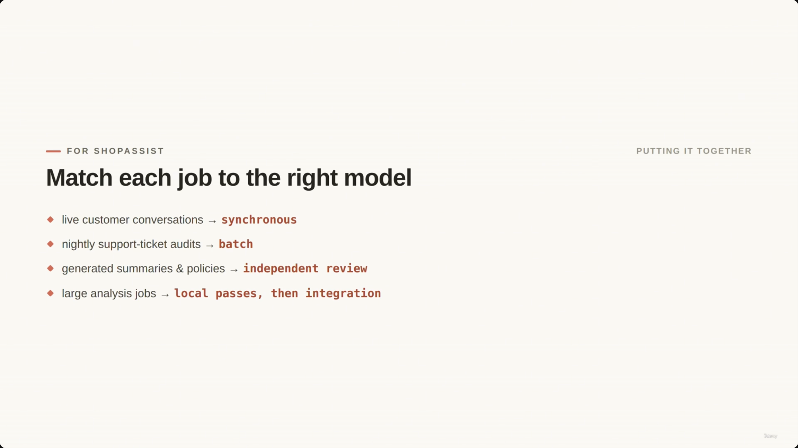

> **[Misfiled in source]** Filed under the second "Large Codebases & Document Sets" occurrence at 00:06:27 in the slide note; content-wise this "Match each job to the right model" slide belongs to the closing ShopAssist mapping. (An identical copy of this same slide is captured again at 00:06:43, correctly positioned at the very end of the note — not duplicated here.)

---

## Summary

- **Message Batches API** — async, ~50% cheaper, up to 24h with no latency SLA. Use for large, latency-tolerant workloads (nightly audits), never for blocking ones (live chat, pre-merge CI checks).
- **`custom_id`** — the mechanism that lets out-of-order batch results be matched back to their input.
- **No live tool loop in batch** — assemble all context upfront; if a task needs multiple live tool calls mid-reasoning, batch is the wrong architecture.
- **Scale iteratively** — sample → review → refine prompt/schema/validation → then run the full batch. On failure, resubmit only the failed items.
- **Self-review has limits** — for high-stakes output, prefer independent instances: one call generates, a separate call reviews with a different prompt/role/criteria.
- **Multi-pass review** — generate → independently review → integrate/route to a human. Effective for code review, policy review, support summaries, document analysis.
- **Large codebases/document sets** — analyze locally per file first (small, traceable, filterable findings), then run one integration pass across all local results — never one giant prompt.

**Exam framing to remember:** match the *processing model* to the requirement (synchronous vs. batch), and match the *review rigor* to the stakes (self-review vs. independent multi-pass review). Building on [[17-...|Lecture 17]]'s per-item reliability, this lecture is about reliability and cost **at the level of the whole pipeline**.

---

## In Plain English

Here's the whole file in plain, everyday language:

**The big picture:** this lecture is about scaling up — what do you do when you have one document working reliably (lecture 17), but now you have 10,000 of them, or the stakes are too high to trust a single Claude response checking its own work?

**1. Two different problems, two different fixes**
- Problem A: too many requests to handle live → solved by **batch processing**.
- Problem B: the output is too important to trust after just one pass → solved by having a **second, separate** Claude call review it.

**2. Batch processing, in plain words**
Instead of asking Claude one question and waiting right there for the answer, you submit a big pile of questions at once and come back later (up to 24 hours) to collect all the answers. It's roughly half the cost — but you can't use it for anything a user is actively waiting on.

**3. Why every item needs its own ID**
Your huge batch of answers can come back in random order, so you tag every request with a unique ID (like a claim ticket) so you know exactly which answer belongs to which original question.

**4. You can't use tools mid-batch**
In a live conversation, Claude can pause, ask you to run a tool, and continue. In a batch job there's no pausing — you have to gather absolutely everything Claude might need *before* submitting.

**5. Don't go big immediately**
Test your prompt/schema on a small handful of documents first, fix the mistakes you find, *then* run it on all 10,000 — otherwise you waste a lot of money re-running a flawed prompt at scale.

**6. If some items fail**
Don't rerun the whole batch — just rerun the specific ones that failed (this is exactly what those unique IDs are for).

**7. Self-review isn't enough for important stuff**
If Claude wrote something risky, don't just ask that same response "are you sure?" — its blind spots stay blind. Use a completely separate Claude call, with a different prompt/role, purely to review the first one's work.

**8. Multi-pass review**
Draft it (pass 1) → have a different call critique it (pass 2) → combine/route the findings (pass 3).

**9. For big codebases/documents**
Check each file separately first (small, easy-to-trace results), then run one more pass that looks across all those results together — never try to review everything in one giant prompt.

**One-sentence summary:** Match your processing style to the size of the job (one live request vs. a big offline batch) and match your review rigor to how risky the output is (a second, independent Claude check beats trusting the first response to grade itself).

---

## Full Walkthrough: One Night's Batch And One Policy Draft, Traced Step by Step

Everything above covers two separate patterns at once — batching for scale, and multi-pass review for quality — and it's easy to blur them together. So let's trace **one concrete run of each**, start to finish, with real values. We'll reuse this lecture's own IDs and its own four review questions rather than inventing new ones.

---

### Part 1 — One nightly batch, traced end to end

**Step 1 — Three tickets go in together, each with its own ID**

The nightly ticket audit doesn't send Claude one ticket and wait, then send the next. It bundles a batch of requests into **one submission**, and every ticket in that bundle gets its own `custom_id` plus its own message:

```json
{
  "requests": [
    {
      "custom_id": "ticket_1001",
      "params": {
        "messages": [
          { "role": "user", "content": "Classify this support ticket and flag any refund risk: [ticket_1001 text, customer tier, order status, refund history, policy version]" }
        ]
      }
    },
    {
      "custom_id": "ticket_1002",
      "params": {
        "messages": [
          { "role": "user", "content": "Classify this support ticket and flag any refund risk: [ticket_1002 text, customer tier, order status, refund history, policy version]" }
        ]
      }
    },
    {
      "custom_id": "ticket_1003",
      "params": {
        "messages": [
          { "role": "user", "content": "Classify this support ticket and flag any refund risk: [ticket_1003 text, customer tier, order status, refund history, policy version]" }
        ]
      }
    }
  ]
}
```

One API call, three tickets riding inside it. Nobody is watching a screen waiting for an answer — this is the nightly audit, not a live chat.

**Step 2 — Why the ID matters: results can come back in any order**

Here's the part that trips people up. The batch doesn't promise to hand results back in the order you submitted them. It could just as easily come back like this (illustrative order, to show the mechanism):

```json
[
  { "custom_id": "ticket_1003", "result": { "classification": "policy_exception", "human_review_required": true } },
  { "custom_id": "ticket_1001", "result": { "classification": "routine_return", "human_review_required": false } },
  { "custom_id": "ticket_1002", "result": { "classification": "risky_refund", "human_review_required": true } }
]
```

`ticket_1003` shows up first, `ticket_1001` second, `ticket_1002` last — the reverse-ish of how they went in. Your code doesn't care about arrival order at all. For each result, it just does:

```python
for result in batch_results:
    ticket_id = result["custom_id"]
    update_ticket_record(ticket_id, result["result"])
```

`update_ticket_record("ticket_1003", ...)` writes to the `ticket_1003` row no matter whether it arrived first, last, or in the middle. The `custom_id` is the only thing tying a result back to the right ticket — without it, three results would come back and you'd have no way to know which ticket each one belongs to.

**Step 3 — What could *not* have happened mid-request**

None of these three tickets could involve Claude pausing partway through to call a tool and wait for a live result — a batch request can't run that round-trip. So everything Claude might need to make its call — the ticket text, the customer's tier, the order status, the refund history, the policy version — had to be gathered and stuffed into the prompt **before** the batch was ever submitted. Compare that to a live chat, where Claude could ask the app to look something up mid-conversation and get an answer back in the same turn. Batch doesn't get that; batch gets whatever you handed it upfront, and nothing more.

---

### Part 2 — One policy draft, traced through multi-pass review

**Step 1 — Pass 1: one Claude call drafts the policy**

Say a customer is asking for a refund on something they bought six months ago — outside the normal window. One Claude call, with one job, drafts a proposed resolution:

```json
{
  "pass": 1,
  "role": "drafting",
  "input": "Customer bought item 6 months ago, no longer has original packaging, requesting full refund.",
  "output": "Proposed resolution: approve a partial store-credit refund as a goodwill exception, citing customer's long purchase history."
}
```

That's it — that call's only job was to produce a draft. It doesn't grade itself.

**Step 2 — Pass 2: a SEPARATE call checks the draft against the file's own four questions**

A different Claude call — different prompt, focused purely on scrutiny — receives that draft and checks it against exactly the four questions this lecture lists:

- **Does it follow the refund rules?** → The draft proposes an exception outside the stated refund window — flag.
- **Does it create legal or compliance risk?** → Approving exceptions ad hoc, without a documented policy basis, could set an inconsistent precedent — flag.
- **Does it require human approval?** → Yes, because it deviates from standard policy — flag.
- **Does it contradict any existing policy?** → Yes, it directly overrides the stated return window — flag.

```json
{
  "pass": 2,
  "role": "independent_review",
  "findings": {
    "follows_refund_rules": false,
    "legal_or_compliance_risk": true,
    "requires_human_approval": true,
    "contradicts_existing_policy": true
  }
}
```

**Step 3 — Pass 3: integrate the findings and route**

A third step (which may just be plain code, not another Claude call) reads Pass 2's findings and decides what happens next:

```python
if findings["legal_or_compliance_risk"] or findings["requires_human_approval"]:
    route_to_human_review(draft, findings)
else:
    approve_policy(draft)
```

Since Pass 2 flagged both a legal/compliance risk and a required human approval, this case gets routed to a person instead of auto-approved. If Pass 2 had come back clean on all four questions, the same code would approve the draft instead.

**Step 4 — Why Pass 2 has to be a separate call**

It would be tempting to just ask the Pass-1 call, "are you sure about that?" But that's still the same response looking at its own reasoning — and self-review has blind spots: the same assumptions and mistakes baked into the original answer tend to survive a self-check, because the model isn't looking at the draft with fresh eyes, it's re-reading its own justification for the choices it already made. A separate call, with a different prompt built purely around those four questions, has no investment in defending the first draft — it's just checking it.

---

### The one thing to hold onto

Batching is about **not waiting live** — it's a scale-and-cost fix for when there are too many requests to handle one at a time, and `custom_id` is what lets thousands of out-of-order results find their way back to the right record. Multi-pass review is about **not trusting one pass's judgment of itself** — it's a quality fix for when the output is too high-stakes to let a single response grade its own work. Two different problems, two different fixes — and this lecture is really about learning to tell which one you're actually facing.

---

*Sources: [slide notes](../18-Batch-Processing-And-MultiPass-Review-Architectures.md) · [[hover-notes-transcripts/18-Batch-Processing-And-MultiPass-Review-Architectures (transcript)|full transcript]]*
