# BUILD: ShopAssist Extracts a Structured Return Request

> This lecture combines three earlier patterns — explicit criteria & examples, `tool_use` + JSON Schema + `tool_choice`, and validation/retry/human-review routing — into one practical ShopAssist module: turning a messy customer message into a validated, structured return request. It's the bridge between natural language and backend logic — before ShopAssist can check an order or issue a refund, it has to understand what the customer is asking for.

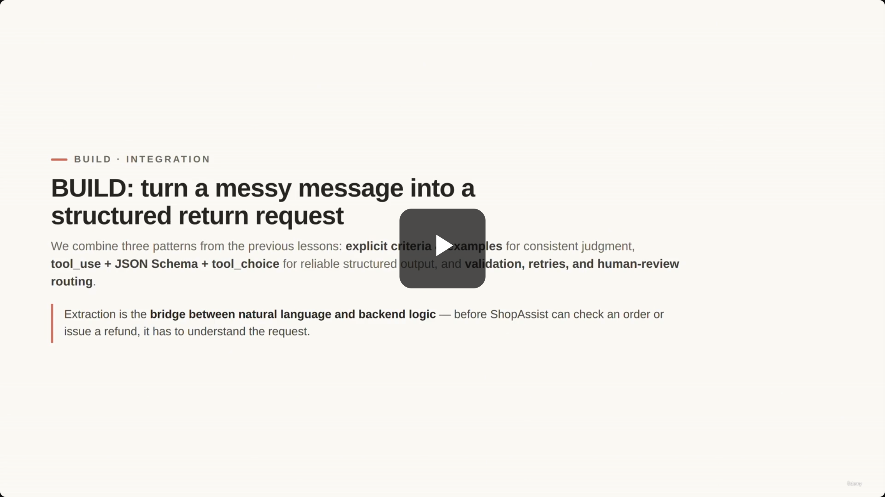

> **Transcript color:** "In the previous lessons, we learned three important patterns... In this lesson, we will combine those ideas into one practical ShopAssist module. The goal is simple: take a messy customer message and convert it into a validated structured return request. This is a common real-world pattern."

**Note on de-duplication:** the slide note references 19 screenshots for this lecture; 4 are exact duplicates of an adjacent capture (same slide, no change) and are omitted below — each surviving state is shown once. Two screenshots also turned out to be **misfiled by chronological position** relative to their actual on-screen content (Hover Notes' capture lagged the real slide/code transition); both are re-filed under the section that actually matches their content, flagged where it happens.

---

## The Input: Unstructured Customer Messages

- Raw customer text is useful but difficult for code to process directly.
- **[The Problem]** The message is completely unstructured, making it hard for a system to automatically check orders or apply policies.

> **Customer message example:**
> "Hi, I got my headphones yesterday, but the box was crushed and one side does not work. Can I send it back? I think the order was 12345."

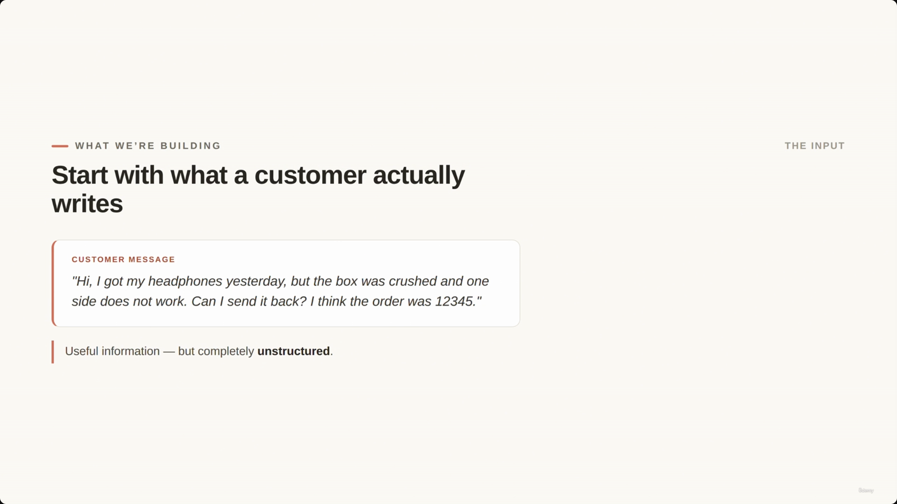

## The Output: Validated Structure

- The goal is to convert messy text into a structured format that's easy for code to validate and process.

```json
{
  "order_id": "12345",
  "item": "headphones",
  "reason": "damaged_item",
  "desired_action": "return",
  "evidence_provided": false,
  "urgency": "normal",
  "missing_information": [],
  "confidence": 0.91,
  "human_review_required": false
}
```

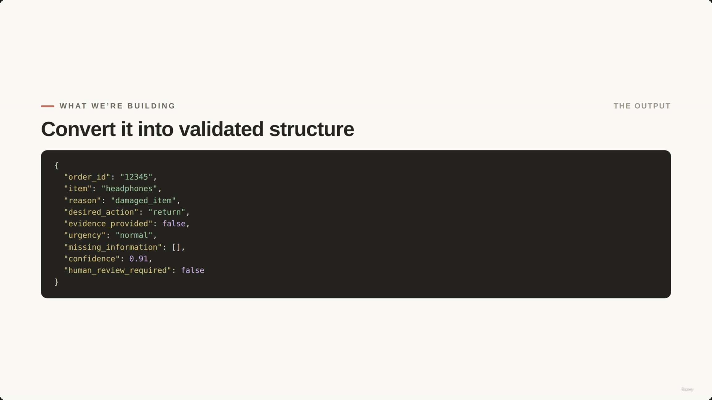

---

## Designing a Reliable Workflow

- Extraction should be treated as a **workflow**, not just a task of filling fields.
- **[Reliability Rules]**
  - **No order ID?** Claude returns `null` instead of inventing one.
  - **Ambiguous reason?** Mark it as `unclear`.
  - **Policy exception or contradiction?** Route the request to **human review**.

> **Transcript color:** "We are not just extracting fields. We are designing a reliable extraction workflow."

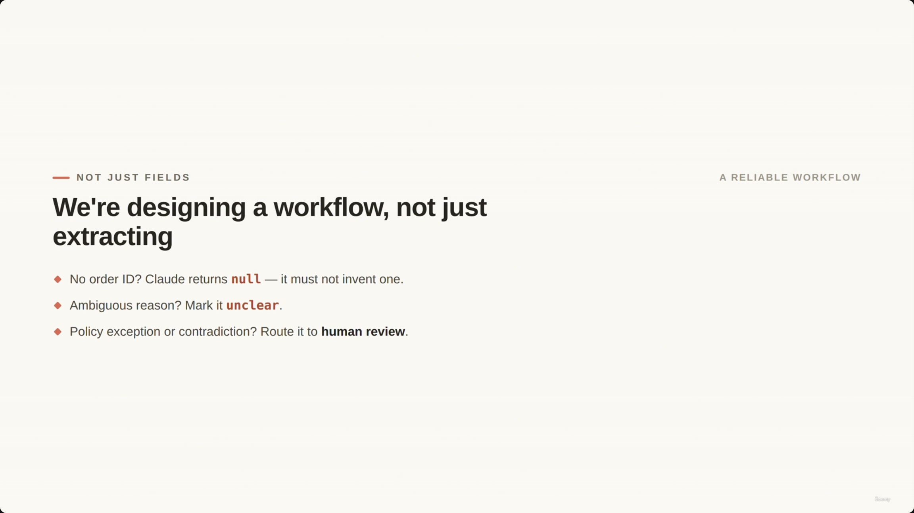

### The Extraction Pipeline (screenshot-verified)

The architecture diagram on screen is more complete than the slide note's own bullet summary — it shows an explicit **retry loop** feeding back into extraction, which the written notes don't mention. Reconstructed faithfully from the screenshot:

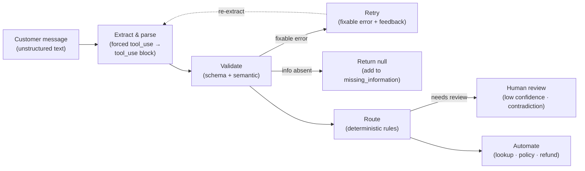

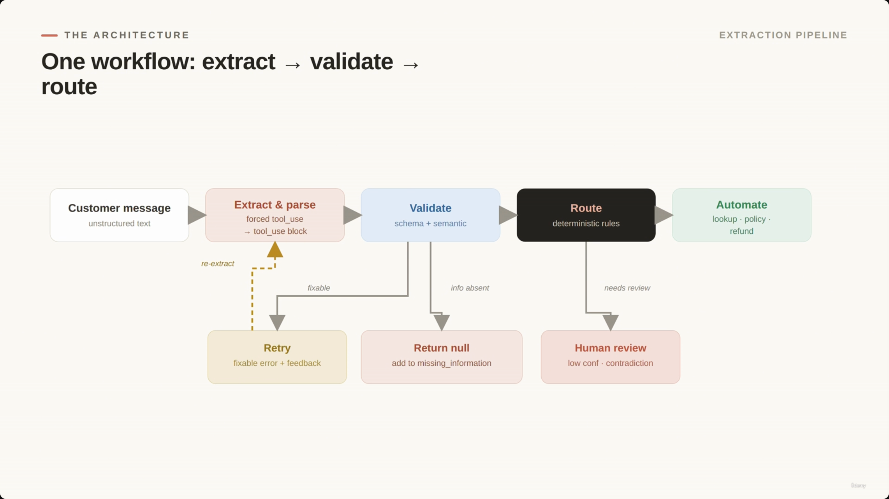

---

## Step 1: Defining the Extraction Schema

- The schema tells the model exactly which fields are expected.
- **Handling Missing Data:** `order_id` and `item` are `nullable` (`type: ["string", "null"]`) — this lets the model return `null` instead of guessing/hallucinating when information is absent.
- **Ensuring Consistency:** `reason` uses an `enum` to restrict the model to a fixed set of values, so it can't return many variations of the same idea ("normalize" damaged → `damaged_item`).
- **[Balancing Structure and Flexibility]** Pair the `reason` enum with a nullable `reason_details` string for extra context when `reason` is `"other"` or `"unclear"`.
- **[Human Review Flag]** A `human_review_required` field lets the extraction step signal to the rest of the system that a case needs a person.

> **[Factual correction — screenshot vs. slide-note text]** The slide note's own code sample writes `tools = { ... }` — a bare **dict**. The actual notebook screenshot shows `tools = [ { ... } ]` — a **list containing one tool-definition dict**, which is the correct shape the Claude API expects for the `tools` parameter. The reconstruction below uses the screenshot-verified list form.
>
> Only `order_id`, `item`, `reason`, and `reason_details` are visible on screen (the properties block scrolls past the visible area before the rest are shown). The remaining fields (`desired_action`, `evidence_provided`, `urgency`, `missing_information`, `confidence`, `human_review_required`, `human_review_reason`) are **not schema-screenshot-confirmed** — they're inferred from the `tool_use` output examples later in the lecture and from the slide note's own text.

```python
tools = [
    {
        "name": "extract_return_request",
        "description": "Extract a structured return request from a customer message.",
        "input_schema": {
            "type": "object",
            "properties": {
                "order_id": {
                    "type": ["string", "null"],
                    "description": "The order ID provided by the customer, or null if missing."
                },
                "item": {
                    "type": ["string", "null"],
                    "description": "The item the customer wants to return, or null if missing."
                },
                "reason": {
                    "type": "string",
                    "enum": [
                        "damaged_item",
                        "wrong_item",
                        "changed_mind",
                        "billing_dispute",
                        "policy_exception",
                        "unclear",
                        "other"
                    ]
                },
                "reason_details": {
                    "type": ["string", "null"],
                    "description": "Additional details when reason is other or unclear."
                }
                # ...remaining properties (desired_action, evidence_provided, urgency,
                # missing_information, confidence, human_review_required,
                # human_review_reason) are inferred from tool_use output examples —
                # not visible in the notebook screenshots.
            }
        }
    }
]
```

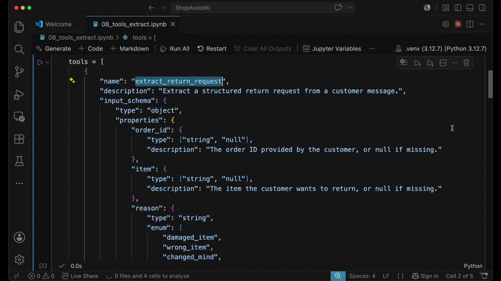

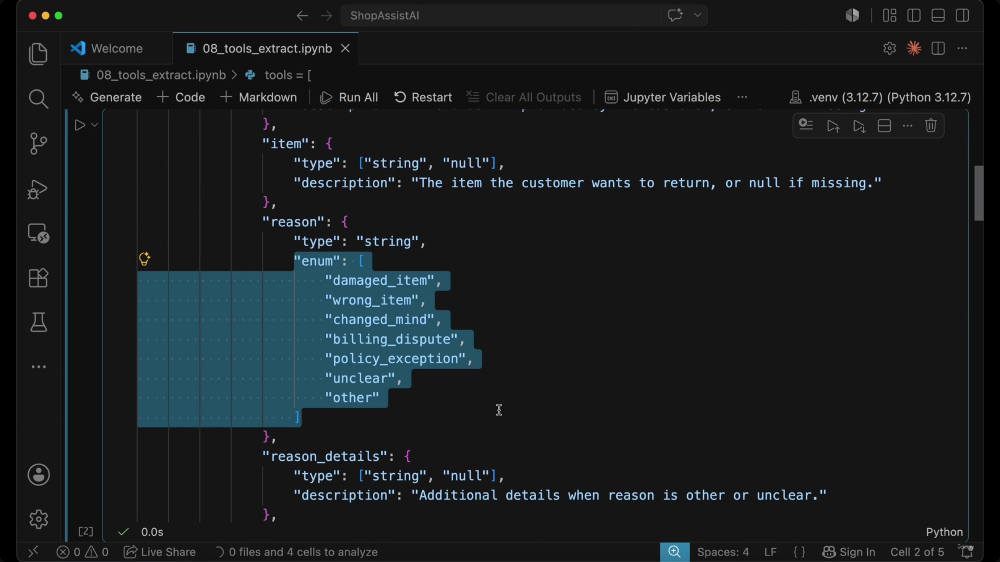

---

## Step 2: Use Forced Tool Choice

- **[The Goal]** Ensure the model acts as a dedicated extraction module rather than a conversational assistant.
- **[Why use it?]** Forced tool choice tells the model: "Use this specific schema. Do not answer conversationally. Return the structured extraction." This is an important exam pattern — when your application needs reliable structured output, **forced tool use is usually better than asking the model to return JSON in free text.**

> **[Misattribution caught]** The slide note places its `tool_choice` code sample right under this section header at timestamp 00:03:36. The screenshot actually captured at that exact timestamp (`screenshot-01M1PGAVQA3CJ680Y5BZ6S0SA2.png`) shows the `validate_return_request()` function instead — that's Step 4 content, filed further down where it belongs. The real forced-tool-choice API call was captured later in the video, at **00:05:07** (`screenshot-01M1PGCKX158BG7W346TE0FSCV.png`), evidently when the presenter actually ran the live demo. It's reproduced here, under the topic it belongs to, rather than where it chronologically appeared:

```python
customer_message = """Hi, I got my headphones yesterday,
but the box was crushed and one side does not work.
Can I send it back? I think the order was 12345."""

message = client.messages.create(
    model=model,
    max_tokens=1000,
    tools=tools,
    tool_choice={
        "type": "tool",
        "name": "extract_return_request"
    },
    messages=[
        {
            "role": "user",
            "content": customer_message
        }
    ]
)
print(message.content[0].model_dump_json(indent=2))
```

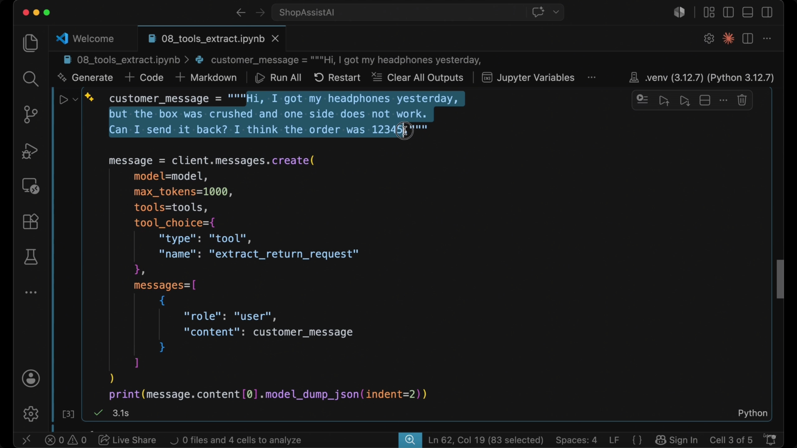

---

## Step 3: Extract the Tool Input & Step 4: Validate the Result

- After the model responds, the system reads the `tool_use` block — a Python dictionary the app can pass to the rest of ShopAssist.
- **[Example Output]** documented in the slide note (no screenshot exists for this specific run — treat the `id` value as illustrative rather than screenshot-verified):

```json
{
  "id": "toolu_01L18vxZv5nqaZujg2p2APQm",
  "caller": { "type": "direct" },
  "input": {
    "order_id": "12345",
    "item": "headphones",
    "reason": "damaged_item",
    "reason_details": "Box was crushed and one side does not work.",
    "desired_action": "return",
    "evidence_provided": false,
    "urgency": "normal",
    "missing_information": [],
    "confidence": 0.88,
    "human_review_required": false,
    "human_review_reason": null
  },
  "name": "extract_return_request",
  "type": "tool_use"
}
```

- **[Why validate?]** A schema guarantees *structure* (types, fields present) — it does **not** guarantee the *semantic* correctness of the values. Validation checks whether the extracted information actually makes sense in context.

> **Transcript color:** "The key idea is Claude extracts, code validates. The model should not be the only line of defense."

The validation function below is screenshot-verified — exact match to the notebook:

```python
def validate_return_request(data):
    errors = []

    if data["order_id"] is None:
        errors.append("order_id is missing")

    if data["item"] is None:
        errors.append("item is missing")

    if data["reason"] == "other" and not data["reason_details"]:
        errors.append("reason_details is required when reason is other")

    if data["confidence"] < 0.7:
        errors.append("confidence is below review threshold")

    return errors
```

- In production, this hand-rolled check would typically be replaced with a formal schema validator for more robust coverage.

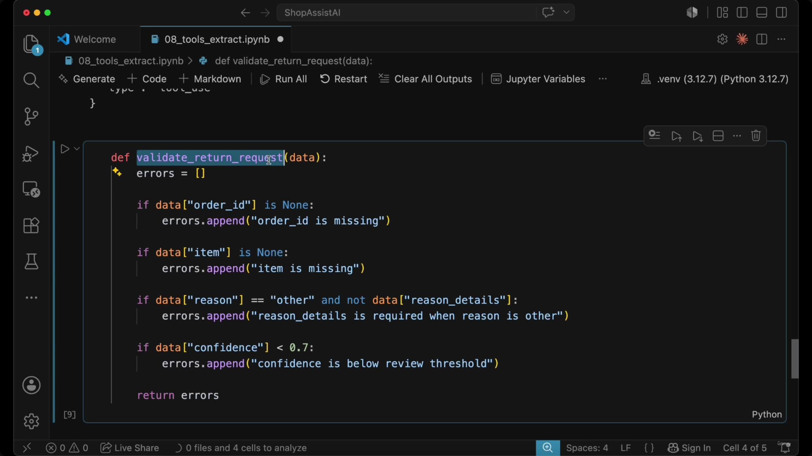

---

## Step 5: Retry Only When It Helps

- **[The Core Principle]** Claude extracts, but code validates; the model should not be the only line of defense.
- **Fixable errors** — e.g. information placed in the wrong field, or a missing `reason_details` → retry the extraction with specific feedback.
- **Not-fixable errors** — e.g. the customer never provided an `order_id` → do **not** retry to invent data; instead return `null`, add the field to `missing_information`, and potentially ask the customer for the missing detail.
- **[Warning]** Retries fix extraction mistakes. They are **not a license to invent missing information.**

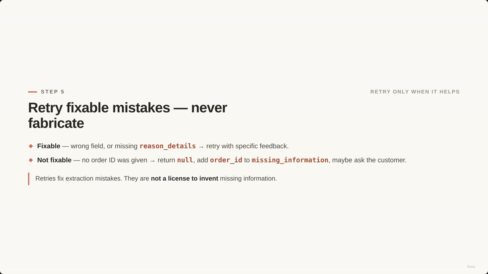

---

## Step 6: Human Review Routing

- **[The Goal]** Determine whether the request can proceed automatically or requires a human.
- **[When to route to human review]**
  - Confidence score is too low
  - The reason for the request is unclear
  - The customer message contains contradictory information
  - The request looks like a policy exception
  - The customer is asking for something sensitive (e.g. a refund outside normal policy)

**[Slide detail]** The original slide note describes these routing rules only as bullet points — it does **not** show any code for this step. The notebook screenshot, however, captures the actual `needs_human_review()` function, reproduced here for the first time:

```python
def needs_human_review(data):
    if data["confidence"] < 0.7:
        return True

    if data["reason"] in ["unclear", "policy_exception"]:
        return True

    if data["human_review_required"]:
        return True

    return False
```

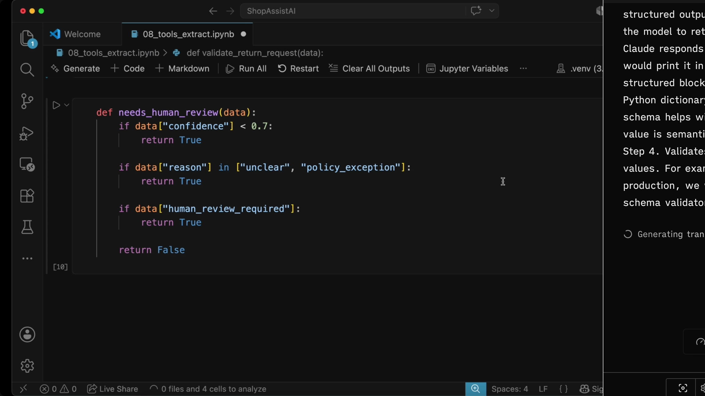

---

## ShopAssist Demo: Testing the Workflow

Running realistic messages through the system to verify the extraction and routing logic. Only **Case 4** and **Case 5** have matching screenshots below; Cases 1–3 are documented in the slide note as typed text only (no screenshot to verify their exact output against).

| Case | Input | Expected behavior |
|---|---|---|
| 1. Complete return request | "I want to return order 12345. The headphones arrived broken." | Extracts cleanly — `confidence: 0.95`, no missing fields *(text-only, no screenshot)* |
| 2. Missing order ID | "I bought a jacket last week and want to return it. I do not have the order number." | `order_id: null`, flagged in `missing_information` *(text-only, no screenshot)* |
| 3. Ambiguous reason | "This product is not what I expected. Can I get my money back?" | May resolve to `unclear` or `changed_mind` depending on criteria *(text-only, no screenshot)* |
| 4. Policy exception | "I bought this six months ago, but I still want a refund because I never used it." | Routed to human review — screenshot-verified below |
| 5. Contradiction | "The item works perfectly, but it arrived broken and I need a replacement today." | Routed to human review — screenshot-verified below |

### Case 4 — Policy exception (screenshot-verified)

**[Misattribution caught]** The slide note places this screenshot (`screenshot-01M1PGE0RC6PM87JPEW21A4Q93.png`, 00:05:53) right under the "Case 1: Complete return request" heading, purely because of chronological position. Its actual on-screen content is the **Case 4** output.

**[Factual correction — screenshot vs. slide-note text]** The slide note's typed-out JSON shows `"order_id": "UNKNOWN"` and `"item": "UNKNOWN"` (plain strings). The screenshot shows `"<UNKNOWN>"` with angle brackets — a placeholder-style sentinel, not a literal string the model would plausibly choose on its own. The screenshot version is authoritative:

```json
{
  "input": {
    "order_id": "<UNKNOWN>",
    "item": "<UNKNOWN>",
    "reason": "changed_mind",
    "reason_details": "Customer purchased the item six months ago but never used it and is requesting a refund.",
    "desired_action": "refund",
    "evidence_provided": false,
    "urgency": "normal",
    "missing_information": ["order_id", "item"],
    "confidence": 0.7,
    "human_review_required": true,
    "human_review_reason": "The purchase was made six months ago, which likely falls outside the standard return/refund window. This may require a policy exception and manual review."
  },
  "name": "extract_return_request",
  "type": "tool_use"
}
```

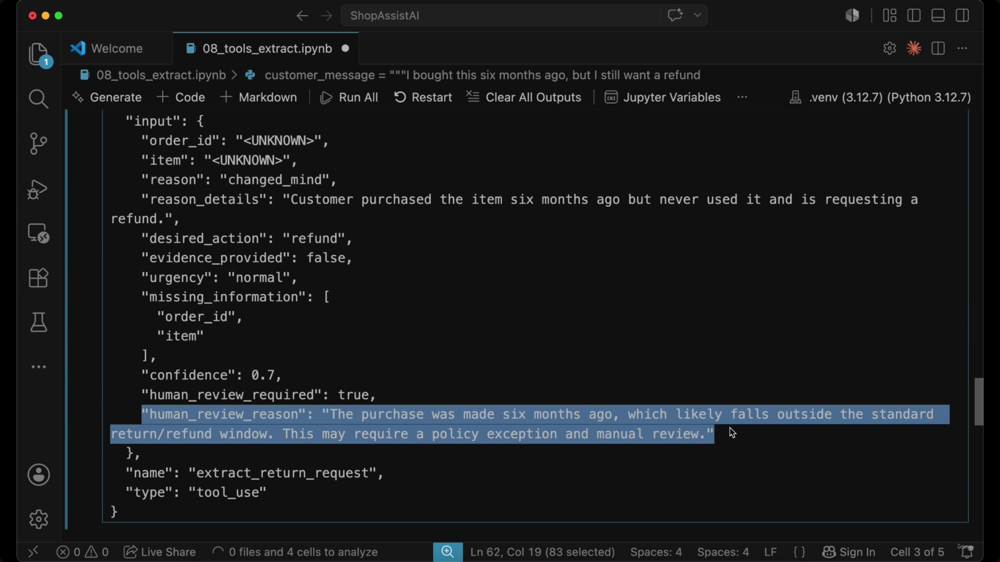

### Case 5 — Contradiction (screenshot-verified)

**[Slide detail]** The slide note describes Case 5 only in prose ("This should be flagged as contradictory or low confidence") — it never types out a JSON example for this case anywhere in the text. The full structured output below comes entirely from the screenshot:

```json
{
  "input": {
    "order_id": "<UNKNOWN>",
    "item": "<UNKNOWN>",
    "reason": "damaged_item",
    "reason_details": "Item arrived broken/damaged. Customer notes it still works perfectly despite physical damage.",
    "desired_action": "replacement",
    "evidence_provided": false,
    "urgency": "high",
    "missing_information": ["order_id", "item"],
    "confidence": 0.75,
    "human_review_required": true,
    "human_review_reason": "Customer urgently needs a same-day replacement but key details are missing (order ID and item name). Additionally, the customer states the item works perfectly despite arriving broken, which is contradictory and may require clarification or special handling."
  },
  "name": "extract_return_request",
  "type": "tool_use"
}
```

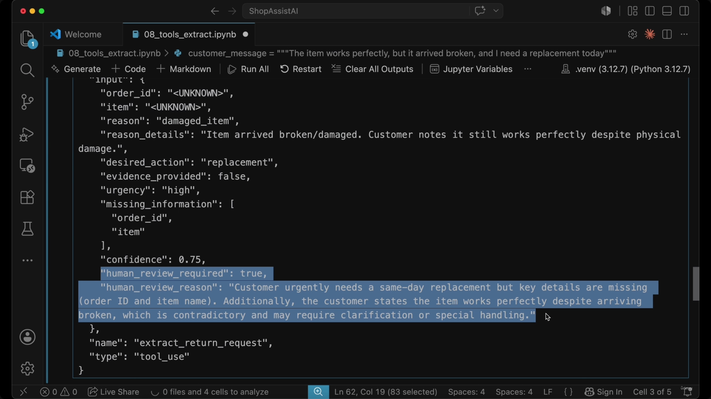

---

## Summary: Architecture vs. Prompting

- **[The Core Insight]** Reliability comes from the **architecture**, not the prompt.
- `tool_use` + `schemas` → structured output
- `nullable fields` → avoid fabricated data
- `enums` → normalize categories
- `validation` → catch structural & semantic problems
- `retries` → only when the problem is fixable
- `human review` → low confidence, contradiction, or outside policy

> **Transcript color:** "The exam will often test the difference between model output, schema enforcement, and application reliability. A strong architecture does not rely on prompting alone."

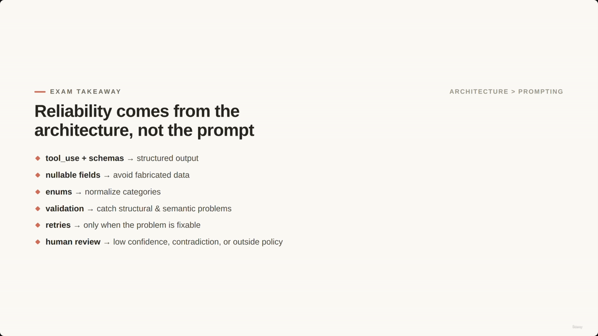

**[Gap]** The slide note also describes a mermaid mindmap ("Reliable AI Architecture" → Output Control / Data Integrity / Error Handling) attached to this section. No screenshot in the captured set actually shows that mindmap graphic — the note's own diagram appears to be a reconstruction rather than a captured slide. Flagging the gap rather than presenting it as screenshot-verified.

---

## Transition: From Extraction to Action

- Moving from understanding requests to executing real tool workflows.
- ShopAssist will evolve to use backend tools for: looking up customers, inspecting orders, processing refunds, and escalating cases when needed.

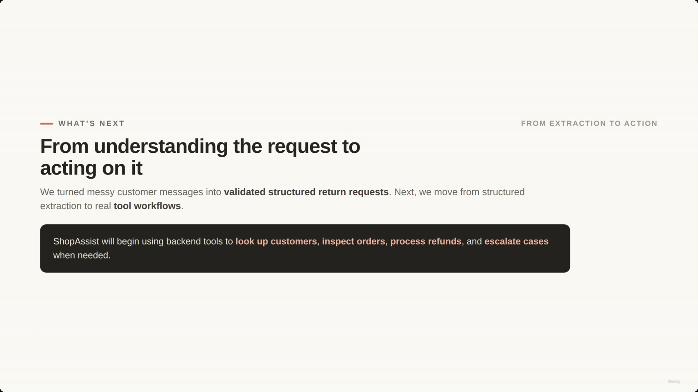

---

## Request Lifecycle (sequence diagram)

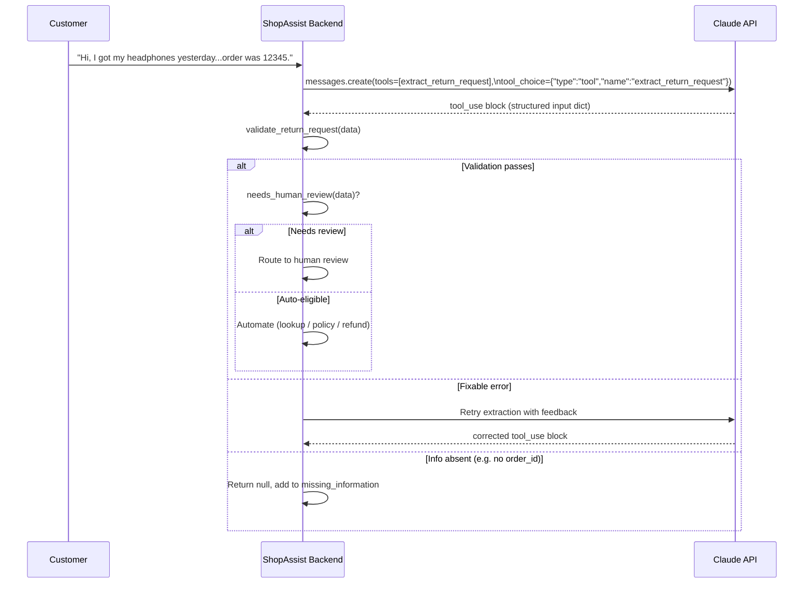

---

## Summary

- Extraction is the **bridge between natural language and backend logic** — combine explicit criteria, forced `tool_use` + schema, and validation/retry/human-review into one pipeline.
- **Nullable fields** (`order_id`, `item`) stop the model from inventing data it wasn't given.
- **Enums** (`reason`) normalize many phrasings into one consistent category.
- **Validation is code's job**, not the model's — a schema only guarantees structure, not semantic correctness.
- **Retry only fixable mistakes** (wrong field, missing detail) — never retry hoping the model will fabricate information the customer never provided.
- **Route to human review** on low confidence, unclear reason, contradiction, policy exception, or anything sensitive.
- Next lecture: ShopAssist moves from *understanding* requests to *acting* on them via backend tools (lookup, refund, escalation).

---

## In Plain English

Here's the whole file in plain, everyday language:

**The big picture:** this is a hands-on "put it all together" lecture — take a messy customer message and turn it into a clean, validated, structured return request your code can actually act on, using everything learned so far (schemas, forced tool use, validation, retries, human review).

**1. The whole job in one sentence**
Turn "Hi, my headphones arrived broken, order was maybe 12345" into a clean object like `{order_id, item, reason, confidence, human_review_required, ...}`.

**2. Step 1 — define the shape**
Build a schema where missing fields (like `order_id`) are allowed to be `null` instead of made up, and the `reason` field can only be one of a fixed list of options — not just any word Claude feels like using.

**3. Step 2 — force the extraction**
Pin Claude to always use this one specific extraction tool, so it never just chats back instead of giving you the structured data.

**4. Steps 3 & 4 — read it, then check it**
Pull the filled-in data out of Claude's response, then run it through your own validation function that checks things like "is the order_id missing," "is confidence too low," "did they say 'other' without explaining why."

**5. Step 5 — retry only when it can actually help**
If Claude clearly made a fixable mistake, ask again with the exact error. If the customer just never gave the info, don't keep asking Claude to guess — mark it missing and move on.

**6. Step 6 — decide who handles it**
Low confidence, unclear reason, contradictions, or a policy exception → send to a human. Otherwise, let it proceed automatically.

**7. Real test cases shown**
A clean request works fine; a policy exception (bought 6 months ago) and a contradiction (item works perfectly but arrived broken) both correctly get flagged for a human — with the model even writing a reasonable explanation of *why* it flagged it.

**8. The big lesson**
Reliability doesn't come from writing a clever prompt — it comes from the surrounding architecture (schema + forced tool use + validation + smart retries + human routing) working together.

**One-sentence summary:** This lecture wires together schema + forced extraction + validation + retries + human-review-routing into one working pipeline that turns a messy customer message into a trustworthy structured object — proving that good architecture, not clever prompting, is what makes it reliable.

---

## Full Walkthrough: One Message, Traced Step by Step (With Real JSON)

Everything above can feel abstract until you watch **one single customer message** travel through the whole pipeline. So let's follow just one, start to finish, with the actual JSON at every stage. We'll use the message this lecture uses everywhere else:

> "Hi, I got my headphones yesterday, but the box was crushed and one side does not work. Can I send it back? I think the order was 12345."

The whole pipeline is this loop, in plain words:

```
message in → Claude fills a form → your code checks the form → fix it / accept "unknown" / send it onward
```

---

### Step 1 — The blank form gets designed once (not per-message)

Before any customer ever writes in, you design the "form" **one time** and reuse it forever. It's just a JSON shape describing which boxes exist and what's allowed in each:

```json
{
  "order_id": "string or null",
  "item": "string or null",
  "reason": "one of: damaged_item | wrong_item | changed_mind | billing_dispute | policy_exception | unclear | other",
  "reason_details": "string or null"
}
```

Two small design choices matter a lot here:
- `order_id` and `item` allow `null` — so if the customer never gave that info, Claude can honestly leave it blank instead of inventing a fake order number.
- `reason` is a fixed list (an "enum") — so Claude can't return 20 different phrasings of "it's broken." It has to pick one of your exact labels.

This form definition is the `tools = [...]` block from Step 1 above — it's written once in your code and sent along with *every* extraction request.

---

### Step 2 — Send the message + the form → get the form back, filled in

Now a real customer message arrives. Your backend sends **one API call** containing both the form and the message, and forces Claude to fill out that exact form (not chat back in plain text):

**What you send:**
```json
{
  "tools": [ /* the form from Step 1 */ ],
  "tool_choice": { "type": "tool", "name": "extract_return_request" },
  "messages": [
    { "role": "user", "content": "Hi, I got my headphones yesterday, but the box was crushed and one side does not work. Can I send it back? I think the order was 12345." }
  ]
}
```

**What comes back:**
```json
{
  "type": "tool_use",
  "name": "extract_return_request",
  "input": {
    "order_id": "12345",
    "item": "headphones",
    "reason": "damaged_item",
    "reason_details": "Box was crushed and one side does not work.",
    "confidence": 0.88,
    "human_review_required": false
  }
}
```

Nothing "ran." Claude didn't look anything up. It just read the sentence and typed the right values into the right boxes. That's the entire job of Step 2.

---

### Step 3 — Your code reads the filled form directly

There's no fetching, no second call, no database. Your code just grabs the `input` object straight out of the response:

```python
response = client.messages.create(..., tools=tools, tool_choice=forced, messages=messages)
data = response.content[0].input
```

`data` is now a plain Python dict — `{"order_id": "12345", "item": "headphones", "reason": "damaged_item", ...}` — ready for checking.

---

### Step 4 — Validate: is what Claude filled in actually trustworthy?

Your code runs `validate_return_request(data)` — a completely ordinary function, no AI involved:

```python
def validate_return_request(data):
    errors = []
    if data["order_id"] is None:
        errors.append("order_id is missing")
    if data["item"] is None:
        errors.append("item is missing")
    if data["reason"] == "other" and not data["reason_details"]:
        errors.append("reason_details is required when reason is other")
    if data["confidence"] < 0.7:
        errors.append("confidence is below review threshold")
    return errors
```

For our headphones example (`order_id: "12345"`, `item: "headphones"`, `confidence: 0.88`) — this returns `errors = []`. Nothing wrong. Moves straight to Step 6.

But imagine Claude had instead returned `"reason": "exchange"` — a word that isn't in the allowed enum list at all. That's a **fixable mistake**: the answer exists, Claude just picked the wrong box. This is where Step 5 kicks in.

---

### Step 5 — Two very different responses to "something's wrong"

**Case A — Fixable mistake → retry with the exact error (illustrative example; the lecture describes this in prose without a captured screenshot, so here's a concrete version of the mechanism):**

```json
{
  "messages": [
    { "role": "user", "content": "Hi, I got my headphones yesterday... order was 12345." },
    { "role": "assistant", "content": "[Claude's earlier tool_use with reason: \"exchange\"]" },
    { "role": "user", "content": "Feedback: 'reason' must be one of damaged_item / wrong_item / changed_mind / billing_dispute / policy_exception / unclear / other. You returned 'exchange', which is not allowed. Re-extract from the original message. Do not invent missing information." }
  ]
}
```
Claude tries again, this time picking a valid label — e.g. `"reason": "damaged_item"`. **Key idea:** you're not just saying "try again," you're handing back the exact rule it broke.

**Case B — Info genuinely absent → don't retry, just accept "unknown"**

Say the customer had written *"I want to return my jacket, no idea what the order number was"* — there's no order ID anywhere in the message. Retrying five more times will never produce a real one; it'll just tempt Claude to make one up. So the correct move is:

```python
data["order_id"] = None
data["missing_information"].append("order_id")
```

No second API call at all. You simply accept the gap and move on (or ask the *customer*, not Claude, for the missing detail).

**The rule that separates A from B:** if the answer exists somewhere in the message and Claude just filled the wrong box → retry. If the answer was never given at all → null, log it, stop asking Claude to guess.

---

### Step 6 — Decide who handles it next: code, or a human

Once the data is valid, one more plain function decides where it goes — again, zero AI involved:

```python
def needs_human_review(data):
    if data["confidence"] < 0.7:
        return True
    if data["reason"] in ["unclear", "policy_exception"]:
        return True
    if data["human_review_required"]:
        return True
    return False
```

For our headphones example — `confidence: 0.88`, `reason: "damaged_item"`, `human_review_required: false` — this returns `False`. ShopAssist can automate it (proceed to look up the order and process the return) without bothering a person.

Compare that to a real example from later in the lecture — a customer asking for a refund on something bought **six months ago**:

```json
{
  "order_id": "<UNKNOWN>",
  "item": "<UNKNOWN>",
  "reason": "changed_mind",
  "confidence": 0.7,
  "human_review_required": true,
  "human_review_reason": "The purchase was made six months ago, which likely falls outside the standard return/refund window. This may require a policy exception and manual review."
}
```

Here, `human_review_required` is already `true` — Claude itself flagged the policy exception — so `needs_human_review()` returns `True` and the case goes to a person instead of being auto-processed.

---

### The whole journey, end to end (our headphones example)

1. Customer types a messy sentence.
2. Your backend sends it + the blank form to Claude, forcing `tool_use`.
3. Claude sends back the SAME form, filled in — no execution, one round trip.
4. Your code pulls `response.content[0].input` straight out — that's the data.
5. `validate_return_request(data)` → no errors → nothing to retry, nothing missing.
6. `needs_human_review(data)` → `False` → ShopAssist proceeds automatically (order lookup, policy check, etc. — covered in the next lecture).

If instead Claude had picked an invalid `reason`, you'd loop back to Step 2 with specific feedback. If instead the customer had never given an order number, you'd skip straight to marking it `null` and moving on — no retry. And if confidence was low or the case was a policy exception, Step 6 would route it to a human instead of automating it.

**The one thing to hold onto:** Claude only ever does *one* thing in this whole pipeline — turn messy text into a filled-in form. Every decision after that (is it valid? do we retry? does a human need to see this?) is plain, boring, 100%-predictable code. That split — Claude extracts, code decides — is the actual "architecture" this lecture keeps pointing at.

---

*Sources: [slide notes](../19-BUILD-ShopAssist-Extracts-Structured-Return.md) · [[hover-notes-transcripts/19-BUILD-ShopAssist-Extracts-Structured-Return (transcript)|full transcript]]*
