# Understanding The Tool Use Lifecycle

> Lecture 15 ([[full-notes/15-ToolSchemas-ToolChoice-And-FirstToolUse|Tool Schemas, Tool Choice & First Tool Use]]) stopped the moment Claude *asked* for a tool. This lecture closes the loop: your application actually **executes** the tool, sends the result **back** to Claude, and keeps going until Claude is done. This is the mechanism that lets Claude act as part of an autonomous, multi-step workflow — and it's one of the most exam-relevant structures in the whole course.

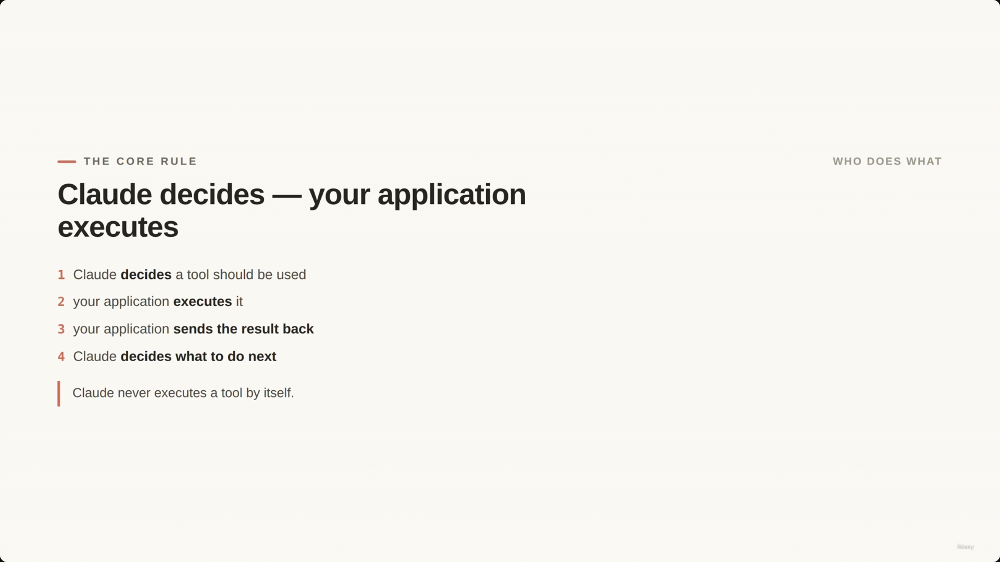

## The Core Rule: Who Does What

- **Claude never executes a tool by itself.** The responsibility is strictly split:
    1. Claude **decides** a tool should be used
    2. Your **application executes** the tool
    3. Your application **sends the result back** to Claude
    4. Claude **decides what to do next**

> **Transcript color:** "The most important thing to remember is this: Claude does not execute tools by itself... You're not building magic. You're building a controlled loop between Claude, your application, and your backend systems."

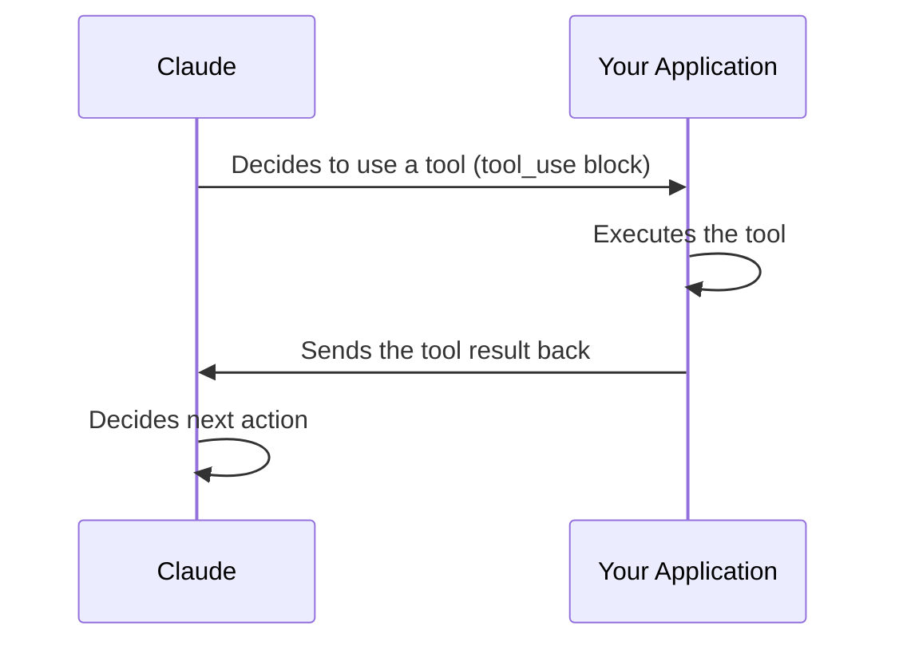

---

## The Assistant Response: The `tool_use` Block

When Claude wants to use a tool, the assistant's response contains a `tool_use` block carrying three pieces of information:

- The **name** of the tool Claude wants to call
- The **input arguments** for that tool
- A **`tool_use_id`** — connects this request to the result sent back later

### ShopAssist Example: Avoiding Guesswork

- **Customer message:** *"I want a refund for my last order, it arrived damaged."*
- **Claude's action:** rather than guess the customer record, Claude requests `get_customer` using the customer's email/account id as input
- **`stop_reason: tool_use`** — this is the reliable signal that Claude isn't finished; it's waiting on your application to run the tool and return a result before it can continue

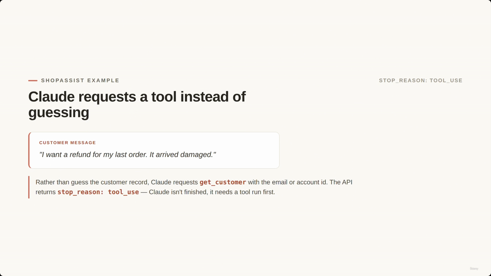

> **[Misattribution note]** The slide note's chronological ordering placed a screenshot timestamped `00:01:12` directly under this section, implying it illustrates the `tool_use` block fields. Having viewed it, it is actually **the same "Round-Trip" sequence-diagram slide** that reappears at `00:01:29`, `00:01:46`, and `00:01:55` (four identical captures of one slide while the narrator kept talking). It belongs conceptually with **The Tool-Use Round-Trip** section below, not here — it's placed there instead, and the three later duplicate captures are dropped.

---

## The Tool-Use Round-Trip

A continuous loop between Claude, your application, and backend systems: **one tool call = request → execute → result → continue.**

- Your application owns the *actual* execution. The model does **none** of the following directly:
    - Looking up customers in a database
    - Calling order services
    - Checking whether a refund is allowed
- **[Crucial]** Your application is responsible for all operational logic: permissions, business rules, authentication, validation, rate limits, safety checks.

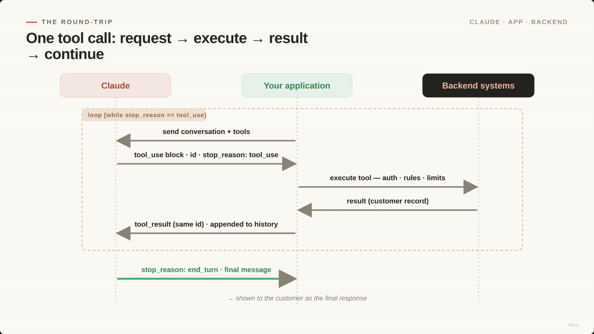

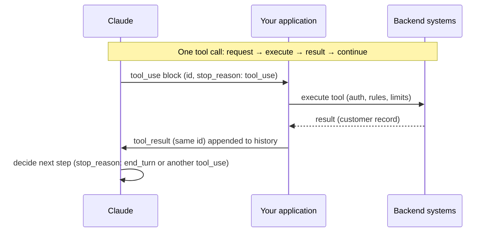

---

## Closing the Loop: Sending the Result Back

- Once the tool is executed, the result is sent back to Claude as a **user message** containing a `tool_result` block.
- **[Requirement]** The result must carry the *same* `tool_use_id` from the original request, so Claude knows which request this result answers.

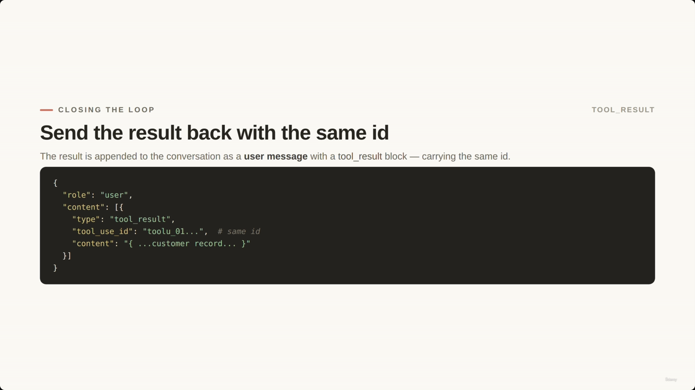

```json
{
  "role": "user",
  "content": [
    {
      "type": "tool_result",
      "tool_use_id": "toolu_01...",
      "content": "{...customer record...}"
    }
  ]
}
```

---

## The Agentic Loop

The loop is driven entirely by the `stop_reason` the API returns — not by parsing text.

1. Send the current conversation history (+ tool definitions) to Claude.
2. Check `stop_reason`:
   - **`tool_use`** → execute the requested tool in your backend, append a `tool_result` to history, call Claude again.
   - **`end_turn`** → the loop terminates; Claude has produced the final assistant message for this turn — this is what gets shown to the customer.

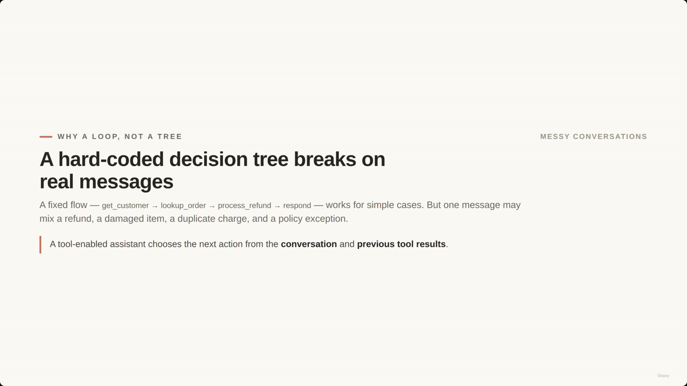

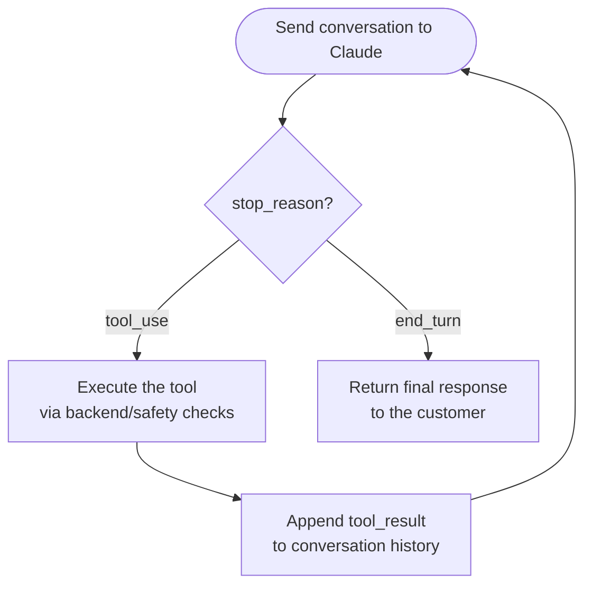

- **[Why follow this loop?]** It lets Claude reason through multiple steps (look up an order, check refund eligibility, process the refund or escalate) without your application having to hand-parse natural language to figure out what happens next.

### Detecting Completion

- **[Avoid]** Scanning assistant text for phrases like *"I'm done,"* *"Here is the final answer,"* or *"No more tools needed"* — this is fragile.
- **[Use]** The API's own `stop_reason` field as the reliable signal: `tool_use` → keep looping; `end_turn` → return the final response.

### Safety Guards vs. Primary Stopping Mechanism

- The **primary** stopping mechanism is model-driven completion via `end_turn`.
- A maximum-iteration cap should exist only as a **safety guard** — protection against bugs, unexpected tool behavior, or poorly designed loops — never as the mechanism that normally ends a task.

---

## Agentic Loops vs. Hard-Coded Decision Trees

- A fixed flow — `get_customer` → `lookup_order` → `process_refund` → `respond` — works for the simple case, but real conversations are messy: a single message might combine a refund, a damaged item, a duplicate charge, *and* a policy exception.
- A tool-enabled assistant instead chooses its next action from the **entire conversation** and **previous tool results**, not a hard-coded script.


---

## ShopAssist Example: Tool Selection and Authorization

- Tools exposed to the model: `get_customer`, `lookup_order`, `process_refund`, `escalate_to_human`.
- **[Crucial distinction]**
  - **Claude (the model):** decides which tool is appropriate given the context.
  - **The backend (the application):** decides whether the requested call is actually **allowed**.

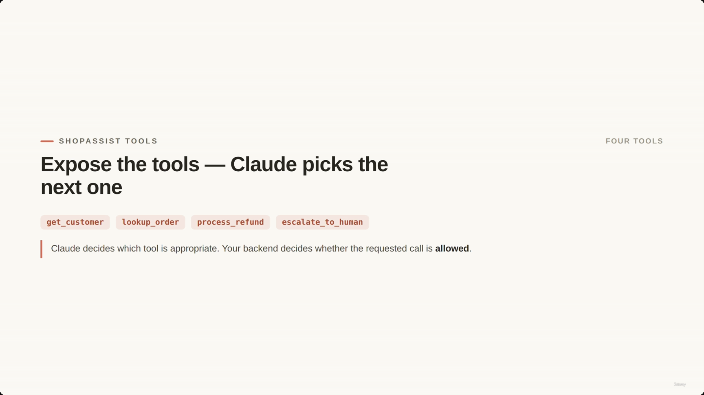

### Decisions vs. Rules

- **Claude decides the step** — reasoning about which tool to call next.
- **The application enforces the rules** — deterministic validation the model cannot be trusted to handle alone. Example rejection criteria:
    - Customer has not been verified
    - Refund amount exceeds a predefined limit
    - The order is not eligible for the requested action

> The agentic loop is not "let the model do anything." It means let Claude decide the next reasonable step, while your application executes tools safely.

---

## ShopAssist Toolset — Tool Definitions

Four tools are exposed to the assistant:

| Tool | Purpose |
|---|---|
| `get_customer` | Returns a customer object based on their email |
| `lookup_order` | Returns order details based on an order ID |
| `process_refund` | Processes a refund for an eligible order |
| `escalate_to_human` | Transfers the conversation to a human agent |

> **[Factual inconsistency — flagged]** The original slide note transcribes the tool definitions twice (once with only `get_customer`/`lookup_order`, once with all four) as a **single Python `dict` literal with repeated `"name"` keys** — e.g. `tools = {"name": "get_customer", ..., "name": "lookup_order", ..., "name": "process_refund", ...}`. That's not valid/meaningful Python: a dict can only hold one value per key, so each repeated `"name"` would silently clobber the previous tool definition, leaving only the last one. The notebook screenshot at `00:05:14` (below) shows the real, correct structure: **`tools` is a list of separate dicts**, one per tool, joined by commas — `tools = [ {...}, {...}, {...}, {...} ]`. The screenshot-verified version is used below.

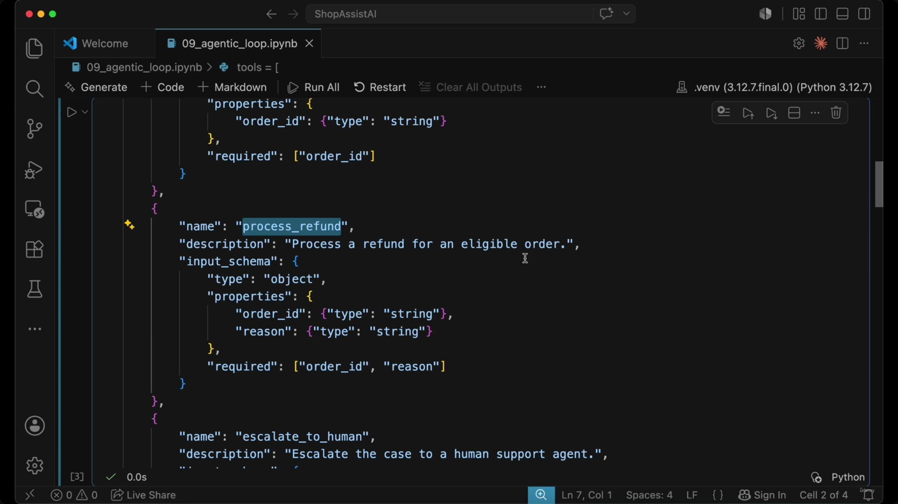

```python
# ShopAssist tool definitions — corrected: a LIST of tool-definition dicts
tools = [
    {
        "name": "get_customer",
        "description": "Get customer profile by email.",
        "input_schema": {
            "type": "object",
            "properties": {
                "email": {"type": "string"}
            },
            "required": ["email"]
        }
    },
    {
        "name": "lookup_order",
        "description": "Look up an order by order id.",
        "input_schema": {
            "type": "object",
            "properties": {
                "order_id": {"type": "string"}
            },
            "required": ["order_id"]
        }
    },
    {
        "name": "process_refund",
        "description": "Process a refund for an eligible order.",
        "input_schema": {
            "type": "object",
            "properties": {
                "order_id": {"type": "string"},
                "reason": {"type": "string"}
            },
            "required": ["order_id", "reason"]
        }
    },
    {
        "name": "escalate_to_human",
        "description": "Escalate the case to a human support agent.",
        "input_schema": {
            "type": "object",
            "properties": {
                "reason": {"type": "string"}
            },
            "required": ["reason"]
        }
    }
]
```

### Tool Definitions vs. Implementation

- **Tool definitions** describe what Claude is *allowed to request* — a `name`, `description`, and `input_schema` per tool. **[Crucial distinction]** The definition itself runs no code; it only gives Claude the structured interface of what's available.
- **Tool implementation** is the actual logic that runs when a tool is called. In this demo the functions return hardcoded/fake data; in production they have real side effects:
    - `get_customer` → a database query or a call to a customer-service API
    - `lookup_order` → a query against an order-management system (status + eligibility)
    - `process_refund` → a call to a payment provider or internal refund service
    - `escalate_to_human` → creates a ticket in Zendesk, Salesforce, Jira, or similar

---

## Connecting Models to Code

- **The `tool_functions` dictionary** is the bridge between Claude's tool request (a name string like `"lookup_order"`) and the actual Python function to run.
- **The `messages` list** stores the conversation history, starting with the customer's initial input.

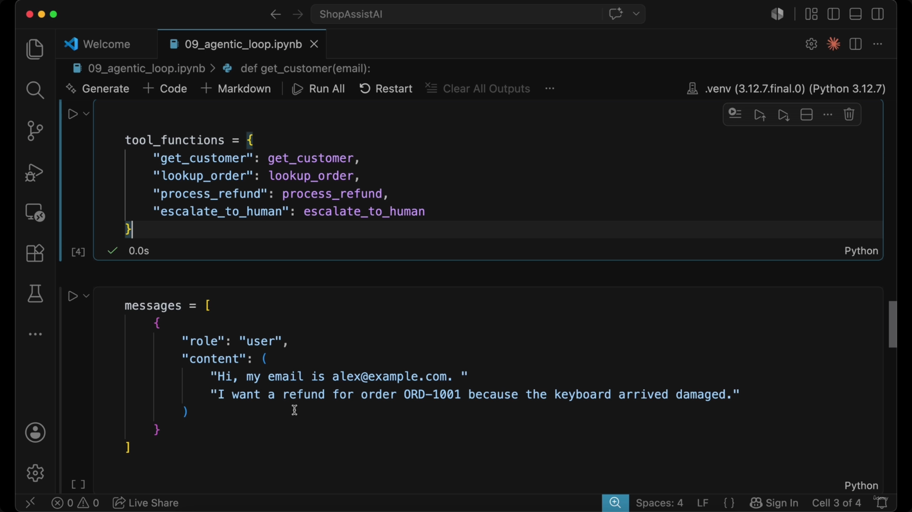

```python
tool_functions = {
    "get_customer": get_customer,
    "lookup_order": lookup_order,
    "process_refund": process_refund,
    "escalate_to_human": escalate_to_human
}

messages = [
    {
        "role": "user",
        "content": (
            "Hi, my email is alex@example.com. "
            "I want a refund for order ORD-1001 because the keyboard arrived damaged."
        )
    }
]
```

---

## The Agentic Loop Implementation

On each iteration the application sends the current `messages` history plus `tools` to Claude, then branches on `stop_reason`:

- **`end_turn`** → the task is finished; print the final response and exit.
- **`tool_use`** → walk `response.content` for each `block.type == "tool_use"`, pull out `tool_name`, `tool_input`, and `tool_use_id`, run the matching Python function from `tool_functions`, package the result as a `tool_result` (with the *same* `tool_use_id`), append it to `messages`, and loop again.

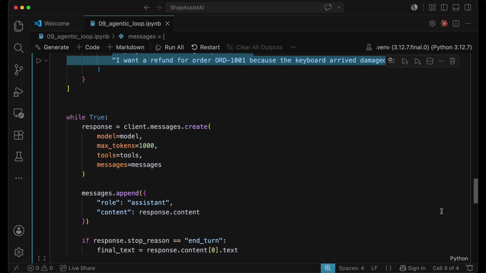

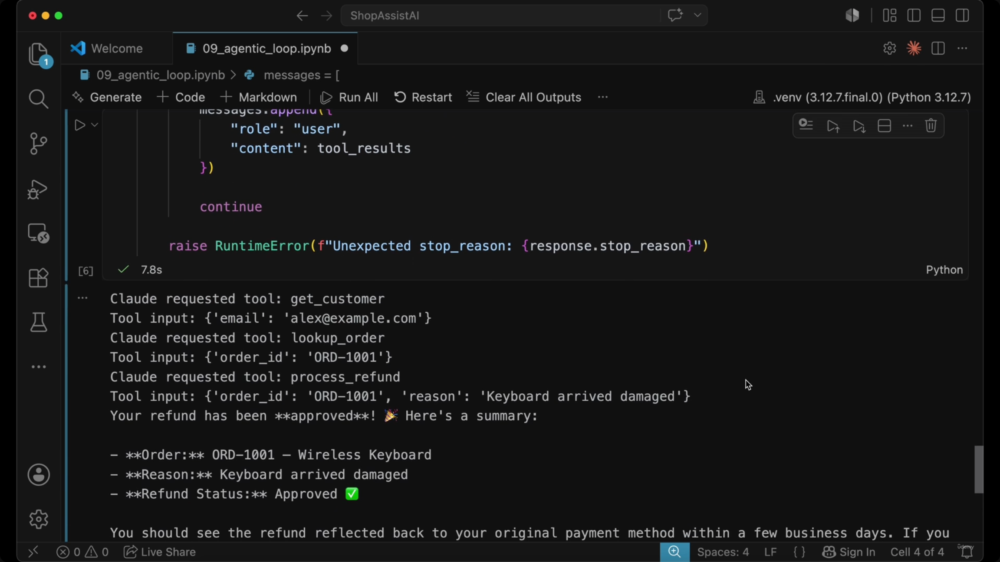

```python
while True:
    response = client.messages.create(
        model=model,
        max_tokens=1000,
        tools=tools,
        messages=messages
    )

    messages.append({
        "role": "assistant",
        "content": response.content
    })

    if response.stop_reason == "end_turn":
        final_text = response.content[0].text
        print(final_text)
        break

    if response.stop_reason == "tool_use":
        tool_results = []
        for block in response.content:
            if block.type == "tool_use":
                tool_name = block.name
                tool_input = block.input
                tool_use_id = block.id

                print(f"Claude requested tool: {tool_name}")
                print(f"Tool input: {tool_input}")

                result = tool_functions[tool_name](**tool_input)

                tool_results.append({
                    "type": "tool_result",
                    "tool_use_id": tool_use_id,
                    "content": str(result)
                })

        messages.append({
            "role": "user",
            "content": tool_results
        })
        continue

    raise RuntimeError(f"Unexpected stop_reason: {response.stop_reason}")
```

> **[Slide detail — not in the slide-note text]** The slide note's transcribed code block ends right after `messages.append({"role": "user", "content": tool_results})` — it omits the trailing `continue` and the `raise RuntimeError(f"Unexpected stop_reason: {response.stop_reason}")` guard clause visible in the `00:07:56` screenshot. That guard matters architecturally: it's exactly the kind of defensive "don't silently hang if the API ever returns something unexpected" safety net the lecture's "safety guards vs. primary stopping mechanism" point is about, so it's included above.

> **[Slide detail — execution trace, not in the slide-note text at all]** The `00:07:56` screenshot also captures the notebook's actual *output* from running this loop end-to-end on the ShopAssist refund example — useful concrete evidence of the loop working:
> ```text
> Claude requested tool: get_customer
> Tool input: {'email': 'alex@example.com'}
> Claude requested tool: lookup_order
> Tool input: {'order_id': 'ORD-1001'}
> Claude requested tool: process_refund
> Tool input: {'order_id': 'ORD-1001', 'reason': 'Keyboard arrived damaged'}
> Your refund has been **approved**! 🎉 Here's a summary:
> - **Order:** ORD-1001 – Wireless Keyboard
> - **Reason:** Keyboard arrived damaged
> - **Refund Status:** Approved ✅
> ```
> This is a nice concrete illustration of the "agentic, not hard-coded" point made earlier: within a single loop, Claude chose to call three tools back-to-back (`get_customer` → `lookup_order` → `process_refund`) purely by reasoning over the conversation and each tool's result, then produced a customer-facing `end_turn` message — no decision tree required.

> **[Inconsistency — flagged]** The slide note also carries a second, shorter code excerpt (under "The Core Mechanic of the Tool-Use Loop") that repeats this same tool-handling logic but ends with `messages.append(tool_results)` — appending the raw list directly, without wrapping it in `{"role": "user", "content": tool_results}`. That's inconsistent with the correct, screenshot-verified version above (and with the API's message-shape requirement that every entry have a `role` and `content`). This looks like a copy/paste simplification made while re-summarizing the loop rather than a distinct code state, so it's not reproduced separately — the wrapped version above is the one to use.

---

## Putting It All Together: The Full Tool-Use Lifecycle

Two separate calls to `client.messages.create(...)`, tied together by one growing `messages` list and one `tool_use_id`:

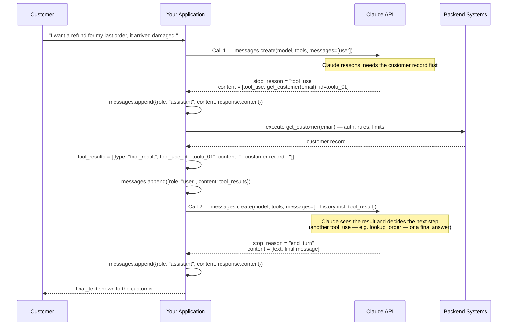

The `messages` array itself grows by exactly one entry per turn — this is the structural detail worth memorizing for the exam:

```python
# 1. Starting state — one user message
messages = [
    {"role": "user", "content": "I want a refund for my last order, it arrived damaged."}
]

# 2. After Call 1 returns stop_reason == "tool_use":
#    append Claude's own tool_use turn, verbatim, as "assistant"
messages.append({
    "role": "assistant",
    "content": response.content            # e.g. [ToolUseBlock(id="toolu_01", name="get_customer", input={...})]
})

# 3. After executing the tool: append the result as a new "user" message,
#    carrying the SAME tool_use_id so Claude can match it to its request
messages.append({
    "role": "user",
    "content": [
        {
            "type": "tool_result",
            "tool_use_id": "toolu_01",      # must match the id from step 2
            "content": "{...customer record...}"
        }
    ]
})

# messages is now: [user, assistant(tool_use), user(tool_result)]
# 4. Call 2 sends this whole history back to Claude.
#    If stop_reason is "end_turn" this time, the loop stops and
#    response.content[0].text is the reply shown to the customer.
```

---

## The Core Mechanic (Recap)

- Assistant messages can contain `tool_use` blocks, each with a `tool_use_id`.
- Your backend executes the tool.
- Results return to Claude and are appended to the conversation history.
- The loop continues while Claude returns `tool_use`, and ends when Claude returns `end_turn`.

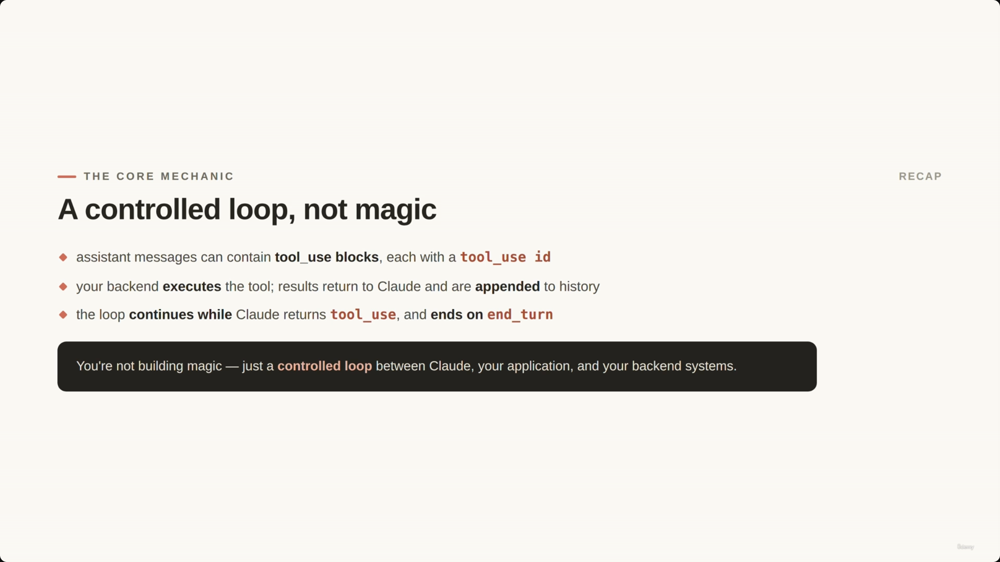

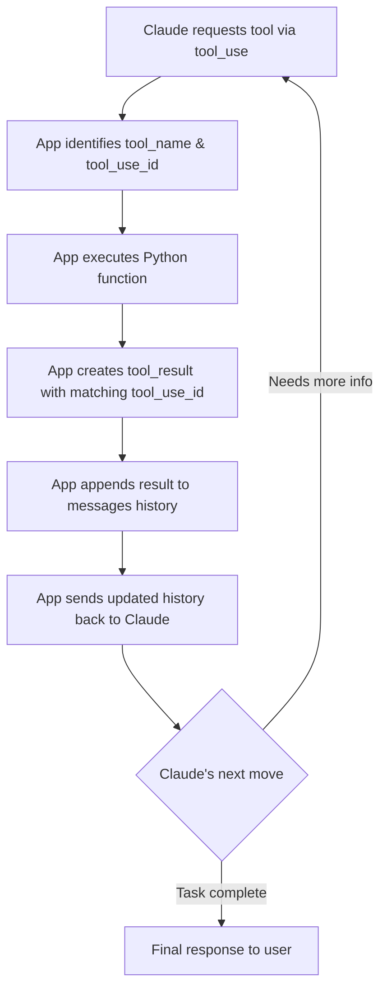

> You're not building magic — just a controlled loop between Claude, your application, and your backend systems.

---

## In Plain English

Here's the whole file in plain, everyday language:

**The big picture:** lecture 15 stopped right after Claude asked for a tool. This lecture finishes the story — actually running the tool, sending the real answer back to Claude, and letting Claude keep going until it's truly done, possibly using several tools in a row.

**1. The golden rule, repeated for emphasis**
Claude never runs anything itself. It asks (`tool_use`) → your code runs it → your code replies with the real result (`tool_result`) → Claude decides what to do next.

**2. Every tool request carries an ID tag**
So when you send the result back, Claude knows exactly which of its earlier requests you're answering — this matters more once Claude asks for multiple things.

**3. How to know when to keep going vs. stop**
Check `stop_reason`. If it says `tool_use`, run the tool and continue the loop. If it says `end_turn`, Claude is finished — show that answer to the user. Don't try to guess by reading Claude's words for phrases like "I'm done" — that's fragile; the `stop_reason` field is the reliable signal.

**4. This turns into a loop, not just one exchange**
Claude can ask for a tool, get a result, decide it needs *another* tool, get that result too, and keep going — chaining multiple real actions together based on what it learns, instead of following a fixed script.

**5. Claude decides WHICH tool; your backend decides if it's ALLOWED**
Even if Claude asks for something, your code can refuse (e.g., customer not verified, amount too high).

**6. A real demo shown**
Given "I want a refund, item arrived damaged," Claude on its own chained three tool calls in a row — look up the customer, look up the order, then process the refund — purely by reasoning through the conversation, with no hard-coded script telling it that exact order.

**7. Safety net**
Always have a maximum number of loop iterations as a backup safety limit — not as the normal way the loop ends, but purely to prevent an infinite loop if something behaves unexpectedly.

**One-sentence summary:** The complete tool-use loop is: Claude asks → your code runs it → your code replies with the real result → repeat until Claude's `stop_reason` says `end_turn` — and this simple loop is what lets Claude solve multi-step problems without you hard-coding the exact sequence of steps.

---

## Full Walkthrough: One Message, Three Chained Tool Calls, Traced Step by Step (With the Real Execution Trace)

The sections above describe the loop in the abstract. This section follows **one real message** through it, start to finish, reusing the exact `messages` array shown above and the exact captured output from running this on the ShopAssist refund example. This particular message is a great one to fully unpack because Claude doesn't stop after one tool — it chains **three** tool calls together, one after another, before it's ready to answer the customer.

The starting message:

> "Hi, my email is alex@example.com. I want a refund for order ORD-1001 because the keyboard arrived damaged."

And the starting `messages` array — just one entry, the customer's own words:

```python
messages = [
    {
        "role": "user",
        "content": (
            "Hi, my email is alex@example.com. "
            "I want a refund for order ORD-1001 because the keyboard arrived damaged."
        )
    }
]
```

---

### API Call 1 — Claude decides it needs the customer record first

Your backend sends this one-entry `messages` list, plus the four tool definitions, to Claude. Claude reads the message and reasons: *before I can do anything about a refund, I need to know who this customer is.* It doesn't answer the customer yet — it comes back with `stop_reason: "tool_use"` and a `tool_use` block requesting `get_customer`. This is the real, captured trace line from the notebook:

```text
Claude requested tool: get_customer
Tool input: {'email': 'alex@example.com'}
```

Nothing has executed yet. Claude has only decided *which* tool it wants and *what* to call it with — exactly the "Claude decides, your application executes" split this whole lecture is built around.

---

### Your backend executes `get_customer`, wraps the result, appends it

This is the same four-step pattern the agentic loop code performs every time it sees a `tool_use` block:

1. **Look up the function** — `tool_functions["get_customer"]` resolves the tool name string to the real Python function.
2. **Run it** — `tool_functions["get_customer"](**tool_input)`, i.e. `get_customer(email="alex@example.com")`, returns a customer record.
3. **Wrap it as a `tool_result`**, tagged with the *same* `tool_use_id` Claude sent in Call 1, so Claude can match the answer to its own question:
   ```python
   tool_results.append({
       "type": "tool_result",
       "tool_use_id": tool_use_id,   # same id Claude sent with the get_customer request
       "content": str(result)
   })
   ```
4. **Append it to `messages`** as a brand-new `user` entry:
   ```python
   messages.append({"role": "user", "content": tool_results})
   ```

At this point `messages` holds four entries: the original customer message, Claude's `get_customer` request, and the `tool_result` answering it — no reply has gone to the customer yet.

---

### API Call 2 — Claude now has the customer, and decides it needs the order too

The loop sends the *whole* updated `messages` history back to Claude. Claude reads its own earlier request, sees the customer record that came back, and reasons: *now I know who this is — next I need the order itself, to check things like eligibility and what was purchased.* Once again it stops short of answering, this time asking for `lookup_order`:

```text
Claude requested tool: lookup_order
Tool input: {'order_id': 'ORD-1001'}
```

Your backend repeats the exact same execute → wrap → append pattern from the step above — this time calling `lookup_order(order_id="ORD-1001")`, wrapping the order details as a `tool_result` with `lookup_order`'s own `tool_use_id`, and appending that to `messages`.

---

### API Call 3 — Claude now has both the customer and the order, and processes the refund

`messages` is sent back to Claude again. Claude now has everything it needs: who the customer is, and the order's details. It reasons that the refund can proceed, and requests the third tool:

```text
Claude requested tool: process_refund
Tool input: {'order_id': 'ORD-1001', 'reason': 'Keyboard arrived damaged'}
```

Notice Claude even composed the `reason` argument itself, distilling "the keyboard arrived damaged" out of the customer's original sentence. Your backend runs the same pattern one more time: call `process_refund(order_id="ORD-1001", reason="Keyboard arrived damaged")`, wrap the result as a `tool_result` tied to this call's `tool_use_id`, append it to `messages`.

---

### API Call 4 (final) — `stop_reason` comes back as `"end_turn"`

`messages` is sent back to Claude a fourth time. This time Claude has everything: the customer, the order, and confirmation the refund went through. There's nothing left to look up, so instead of another `tool_use` block, the response finally comes back with `stop_reason == "end_turn"` and real text content — the loop's `if response.stop_reason == "end_turn":` branch fires, `final_text = response.content[0].text` is captured, and printed. This is the real, captured final reply, verbatim:

```text
Your refund has been **approved**! 🎉 Here's a summary:
- **Order:** ORD-1001 – Wireless Keyboard
- **Reason:** Keyboard arrived damaged
- **Refund Status:** Approved ✅
```

This is the text that actually reaches the customer — everything before this point (three tool requests, three backend executions, three appended results) was internal back-and-forth between your application and Claude that the customer never sees.

---

### Nobody wrote "always call get_customer, then lookup_order, then process_refund"

This is the point the file makes elsewhere and it's worth stating plainly here against the real trace: there is no `if`/`else` chain, no decision tree, no hard-coded script anywhere in the agentic loop code that says "step 1 is always `get_customer`, step 2 is always `lookup_order`, step 3 is always `process_refund`." The loop code itself doesn't know or care which tools get called, in what order, or how many times.

Claude arrived at that exact three-step order — customer, then order, then refund — purely by reading the conversation and each tool's result as it came back, and reasoning about what it still needed to know. A different customer message (say, one that already included full order details, or one describing a case that needed `escalate_to_human` instead) would have produced a different chain, with the same unchanged loop code underneath.

---

### The one thing to hold onto

This four-call, three-tool chain looks sophisticated from the outside, but it's genuinely just the same simple loop — **ask → run → append → repeat** — firing four times in a row. Nothing more clever happened under the hood.

---

*Sources: [slide notes](../20-Understanding-The-Tool-Use-Lifecycle.md) · [[hover-notes-transcripts/20-Understanding-The-Tool-Use-Lifecycle (transcript)|full transcript]]*
