# BUILD: ShopAssist Backend Tools and MCP Integration

> Lectures 20–22 covered tool design, structured errors, scoped access, and MCP configuration in the abstract. This lecture applies all of it to ShopAssist AI: first as five plain Python functions with mocked data, then as the *same* business logic re-exposed through a real MCP server, tested live with the MCP Inspector.

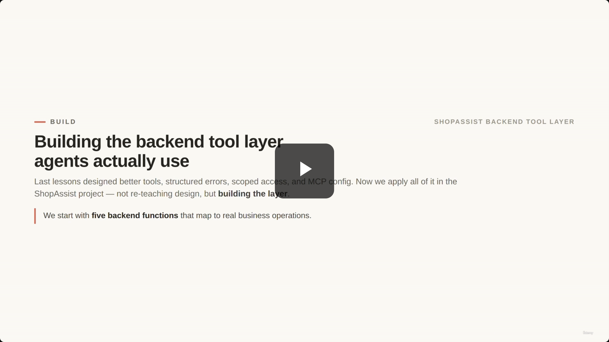

## Overview: what gets built

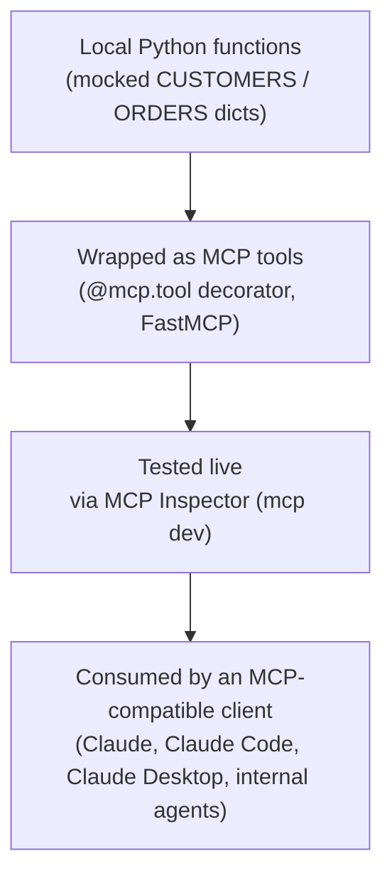
```mermaid
flowchart TD
    A["Local Python functions\n(mocked CUSTOMERS / ORDERS dicts)"] --> B["Wrapped as MCP tools\n(@mcp.tool decorator, FastMCP)"]
    B --> C["Tested live\nvia MCP Inspector (mcp dev)"]
    C --> D["Consumed by an MCP-compatible client\n(Claude, Claude Code, Claude Desktop, internal agents)"]
```

**Reading it:** the business logic barely changes between steps A and B — what changes is *where the tool layer lives* and *how a client discovers/calls it*. That's the whole architectural point of this lecture.

---

## 1. Five backend tools, each with one job

- Building the backend tool layer that agents can actually use — not re-teaching tool design, but *building* the layer.
- **[The Interface]** Five backend functions mapping to real business operations:
  - `get_customer_by_email` — finds the customer
  - `lookup_order_by_id` — retrieves order data
  - `check_refund_eligibility` — applies the refund policy
  - `process_refund` — performs the actual refund (**sensitive**)
  - `create_human_escalation` — sends the case to a human support team

> **Transcript color:** "For ShopAssist we will start with five backend functions... Each tool has a clear job."

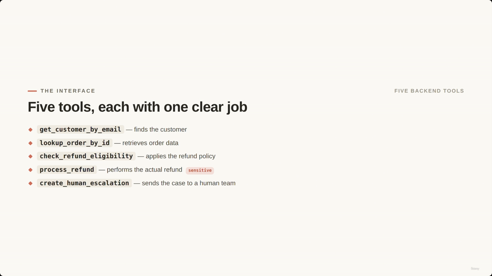

### Tool exposure strategy

- **[Design choice]** Not all backend tools are exposed to the same agent:
  - **Main Support Agent** — safe, decision-support tools only (lookup + eligibility checks)
  - **Refund Workflow Agent** — a narrower, specialized agent that alone gets the sensitive `process_refund` tool
- **[Why?]** Keeps the main support agent helpful but not overpowered, and adds a control layer over sensitive operations.

```python
# Example of the tool sets defined for different agents
main_support_agent_tools = [
    "get_customer_by_email",
    "lookup_order_by_id",
    "check_refund_eligibility",
    "create_human_escalation",
]

refund_agent_tools = [
    "lookup_order_by_id",
    "check_refund_eligibility",
    "process_refund",
    "create_human_escalation",
]
```

---

## 2. Mocked backend implementation

- Functions are mocked with test data so the lecture can focus purely on the *interface*. In production these would call databases, order systems, payment providers, or internal APIs.
- **Test data:** one customer, two orders — one eligible for refund, one a policy exception.

> **Transcript color:** "We have one customer and two orders. One order was delivered 12 days ago. The other was delivered 45 days ago. That gives us one eligible refund case and one policy exception case."

```python
CUSTOMERS = {
    "alex@example.com": {
        "customer_id": "CUS-1001",
        "email": "alex@example.com",
        "name": "Alex Morgan",
        "account_status": "active",
    }
}

ORDERS = {
    "ORD-12345678": {
        "order_id": "ORD-12345678",
        "customer_id": "CUS-1001",
        "status": "delivered",
        "delivered_days_ago": 12,
        "total": 89.99,
        "currency": "USD",
    },
    "ORD-87654321": {
        "order_id": "ORD-87654321",
        "customer_id": "CUS-1001",
        "status": "delivered",
        "delivered_days_ago": 45,
        "total": 149.99,
        "currency": "USD",
    },
}
```

**[Slide detail]** The exact `ORD-87654321` values (`delivered_days_ago: 45`, `total: 149.99`, `currency: "USD"`) are only visible in the code screenshots — the slide-note text described the two orders narratively ("one order... 12 days ago... the other... 45 days ago") but never wrote out the second order's full record. The concrete numbers above are reconstructed from the screenshots.

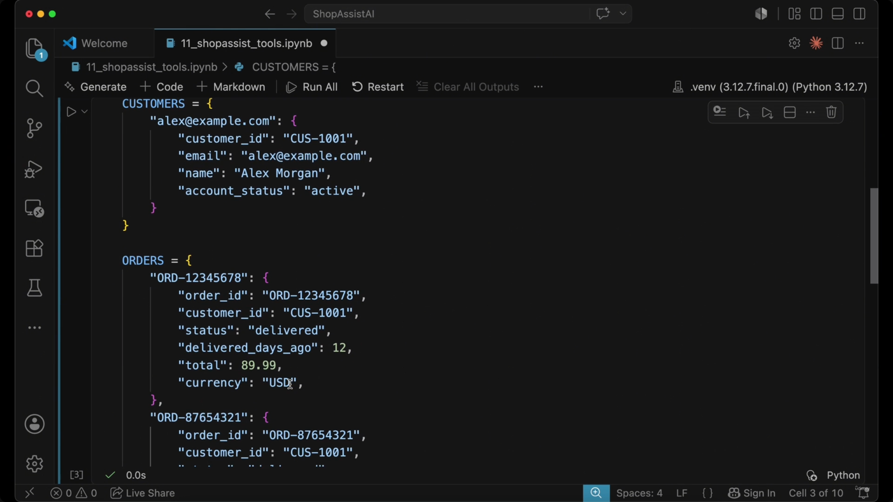

### Customer Lookup Tool

- `get_customer_by_email` returns a structured success response even on a miss.
- **[Handling missing data]** If no customer is found, the tool still returns `isError: False` with `customer: None` — this is *not* a system failure, so Claude won't retry the same lookup as if the backend errored.

```python
def get_customer_by_email(email: str) -> dict:
    normalized_email = email.strip().lower()
    customer = CUSTOMERS.get(normalized_email)

    if not customer:
        return {
            "isError": False,
            "customer": None,
            "message": "No customer found for this email address."
        }

    return {
        "isError": False,
        "customer": customer,
    }
```

### Order Lookup Tool

- `lookup_order_by_id` handles three distinct backend scenarios:
  - **Validation error** — order ID format is wrong (doesn't start with `ORD-`)
  - **Empty result** — order ID is valid but doesn't exist (not a system error)
  - **Permission error** — order exists but belongs to a *different* customer

```python
def lookup_order_by_id(order_id: str, customer_id: str) -> dict:
    normalized_order_id = order_id.strip().upper()

    if not normalized_order_id.startswith("ORD-"):
        return {
            "isError": True,
            "errorCategory": "validation",
            "isRetryable": False,
            "customerMessage": "The order ID does not look valid. Please check the order number and try again.",
            "developerMessage": "Order ID must start with ORD-"
        }

    order = ORDERS.get(normalized_order_id)

    if not order:
        return {
            "isError": False,
            "order": None,
            "message": "No order found with this order ID."
        }

    if order["customer_id"] != customer_id:
        return {
            "isError": True,
            "errorCategory": "permission",
            "isRetryable": False,
            "customerMessage": "I can't access this order with the current account information.",
            "developerMessage": "Order does not belong to the authenticated customer."
        }

    return {
        "isError": False,
        "order": order,
    }
```

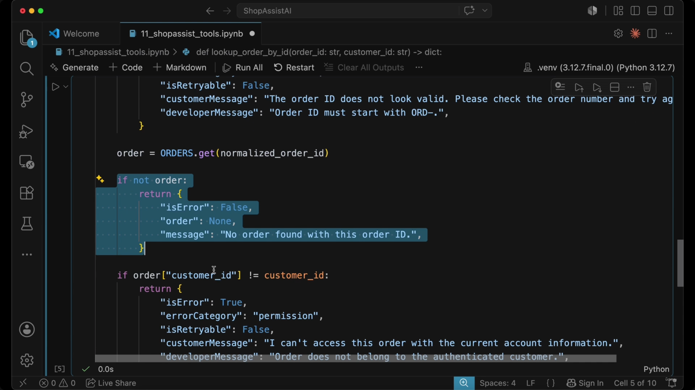

### Refund Eligibility Tool

- `check_refund_eligibility` answers the *policy question* without moving any money.
- **[Why separate it?]** The main support agent can check eligibility without needing the elevated permission required to actually process a refund.
- Two criteria, checked in order:
  - **Order status** — must be `"delivered"`, otherwise refund is denied
  - **Return window** — `delivered_days_ago > 30` puts it outside the standard 30-day window

```python
def check_refund_eligibility(order: dict) -> dict:
    if order["status"] != "delivered":
        return {
            "isError": True,
            "errorCategory": "business",
            "isRetryable": False,
            "customerMessage": "This order is not eligible for an automatic refund because it has not been delivered.",
            "developerMessage": "Refund denied because order status is not delivered."
        }

    if order["delivered_days_ago"] > 30:
        return {
            "isError": True,
            "errorCategory": "business",
            "isRetryable": False,
            "customerMessage": "This order is outside the standard 30-day return window, so I cannot process a refund.",
            "developerMessage": "Refund denied because delivery date is outside policy window."
        }

    return {
        "isError": False,
        "eligible": True,
        "reason": "Order is within the 30-day return window."
    }
```

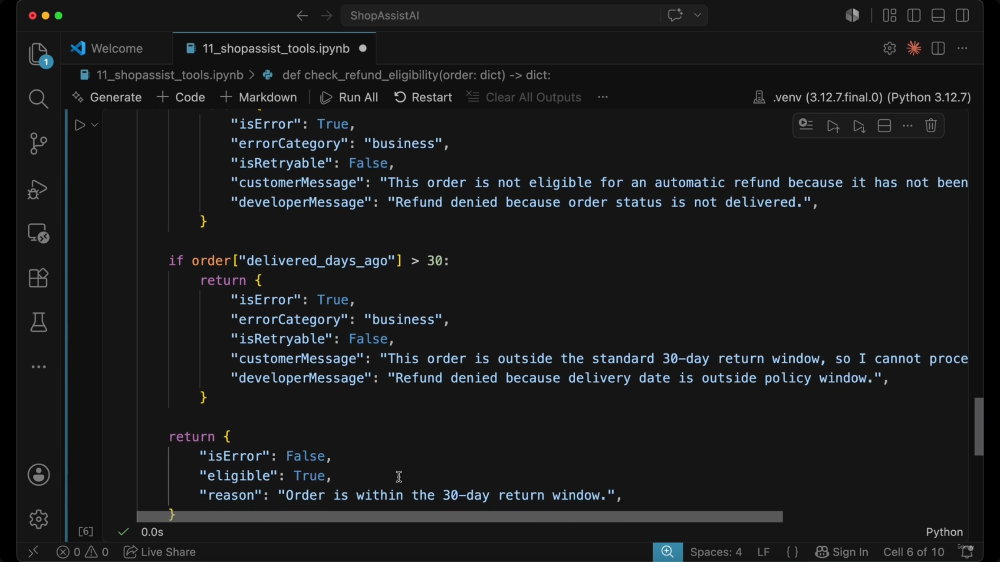

### Refund Execution Tool

- `process_refund` performs the actual financial transaction. In production this would call Stripe, Adyen, Shopify, Magento, or an internal payment service.
- More sensitive than the lookup tools — should be restricted to a narrower workflow (see `refund_agent_tools` above).

```python
def process_refund(order_id: str, amount: float, reason: str) -> dict:
    if amount <= 0:
        return {
            "isError": True,
            "errorCategory": "validation",
            "isRetryable": False,
            "customerMessage": "The refund amount must be greater than zero.",
            "developerMessage": "Refund amount was less than or equal to zero."
        }

    return {
        "isError": False,
        "refund": {
            "refund_id": "REF-55000",
            "order_id": order_id,
            "amount": amount,
            "status": "submitted",
            "reason": reason
        }
    }
```

### Human Escalation Tool

- `create_human_escalation` is used when automation reaches its limit and a human support team needs to intervene.
- **Escalation triggers:** permission issues, policy exceptions (e.g. expired return window), high-value refund requests, conflicting customer information.
- Returns a structured ticket: `isError: False` (the tool itself worked) plus an `escalation` dict with `ticket_id`, `customer_id`, `order_id`, `reason`, `summary`, and `status: "open"`.

The screenshot below shows this actually run end-to-end against the mocked data: `get_customer_by_email("alex@example.com")` → `lookup_order_by_id("ORD-87654321", ...)` (the 45-day-old order) → `check_refund_eligibility(order)` fails → escalated automatically.

```python
customer_result = get_customer_by_email("alex@example.com")
customer = customer_result["customer"]

order_result = lookup_order_by_id("ORD-87654321", customer["customer_id"])
order = order_result["order"]

eligibility_result = check_refund_eligibility(order)

if eligibility_result.get("isError"):
    escalation_result = create_human_escalation(
        customer_id=customer["customer_id"],
        order_id=order["order_id"],
        reason="refund_policy_exception",
        summary=eligibility_result["developerMessage"],
    )
    print(escalation_result)
```

**[Slide detail]** The printed output — not written out anywhere in the slide-note text — was:

```python
{'isError': False, 'escalation': {'ticket_id': 'TCK-9001', 'customer_id': 'CUS-1001',
 'order_id': 'ORD-87654321', 'reason': 'refund_policy_exception',
 'summary': 'Refund denied because delivery date is outside policy window.', 'status': 'open'}}
```

This concrete ticket ID (`TCK-9001`) and the fact that the demo deliberately used the *ineligible* 45-day-old order to trigger the escalation path only appear in the notebook screenshot.

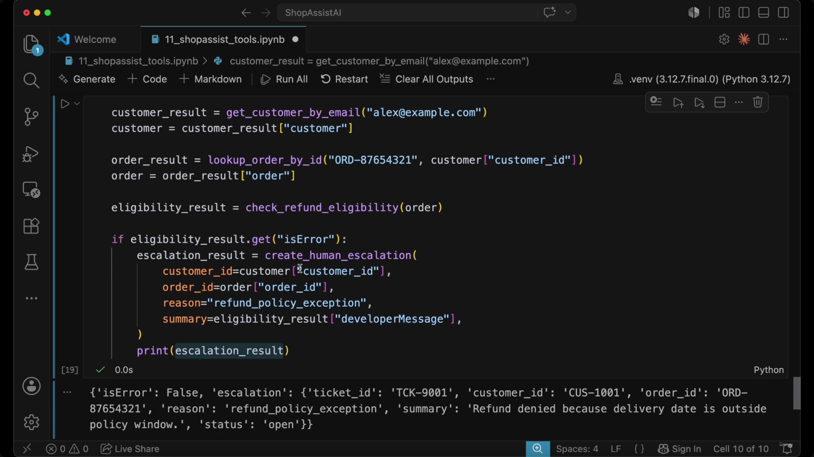

> Note: the slide note captured this same notebook cell twice in a row (00:03:42 and 00:03:44, pixel-identical) — only one copy is kept here.

---

## 3. Refund workflow patterns

### The happy path (successful refund)

To stay safe, the agent must move through backend checks in strict sequence rather than jumping straight to execution.


```mermaid
flowchart LR
    A["User Request"] --> B["Identify Customer"]
    B --> C["Lookup Order"]
    C --> D["Check Eligibility"]
    D --> E["Process Refund"]
```

> **Transcript color:** "The model should not jump directly from user message to refund execution. The workflow should move through back-end checks."

### The policy exception path

When an automated check fails a business rule (e.g. the order is outside the 30-day window), the system should hand off to a human instead of forcing a refund through.

```python
# Example of handling a policy exception via escalation
escalation_result = create_human_escalation(
    customer_id=customer["customer_id"],
    order_id=order["order_id"],
    reason="refund_policy_exception",
    summary=eligibility_result["developerMessage"]
)
```

> **Transcript color:** "Automation handles the standard path. Humans handle exceptions."

---

## 4. Transitioning to MCP

- The core business logic stays almost the same — what changes is *where the tool layer lives* and *how Claude gets access to it*.
- The implementation shifts from plain Python functions (called directly, in-process) to an **MCP server** that exposes the same functions as discoverable tools.

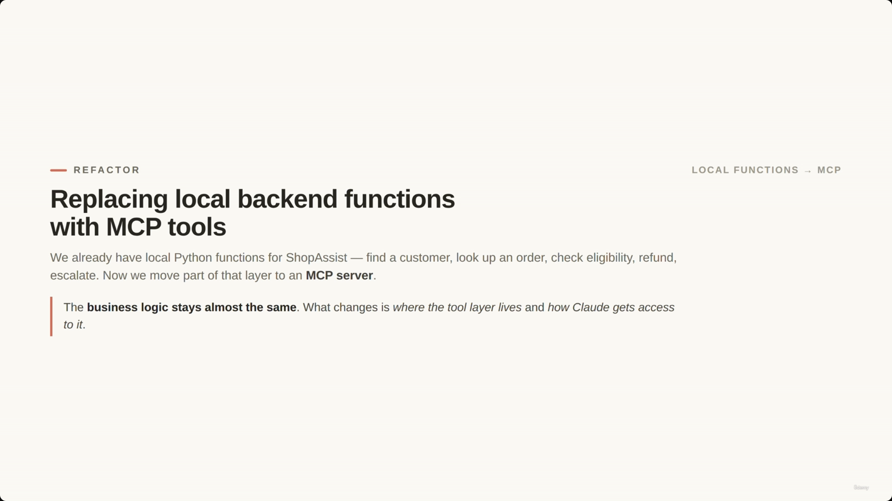

> Note: this "Replacing local backend functions with MCP tools" title card was captured twice (00:03:47 and 00:04:05, identical) while the narrator kept talking — only one copy is kept.

### MCP Server Architecture

- An **MCP server** is the layer that exposes capabilities (the five ShopAssist functions) to any MCP-compatible client.
- Each function is wrapped with `@mcp.tool()` — the underlying logic is still ordinary Python; the MCP SDK handles exposing it as a callable tool.
- Type hints (e.g. `email: str`) define the tool's expected inputs for the agent.

```python
from mcp.server.fastmcp import FastMCP

mcp = FastMCP("ShopAssistMCP")

@mcp.tool()
def get_customer_by_email(email: str) -> dict:
    """Find a customer profile by email address.

    Use this when the user provides an email address but no verified customer ID.
    Returns customer identity, account status, and customer ID.
    Do not use this tool to look up a specific order.
    """
    customer = CUSTOMERS.get(email.strip().lower())
    if not customer:
        return {
            "isError": False,
            "customer": None,
            "message": "No customer found for this email address."
        }

    return {
        "isError": False,
        "customer": customer
    }
```

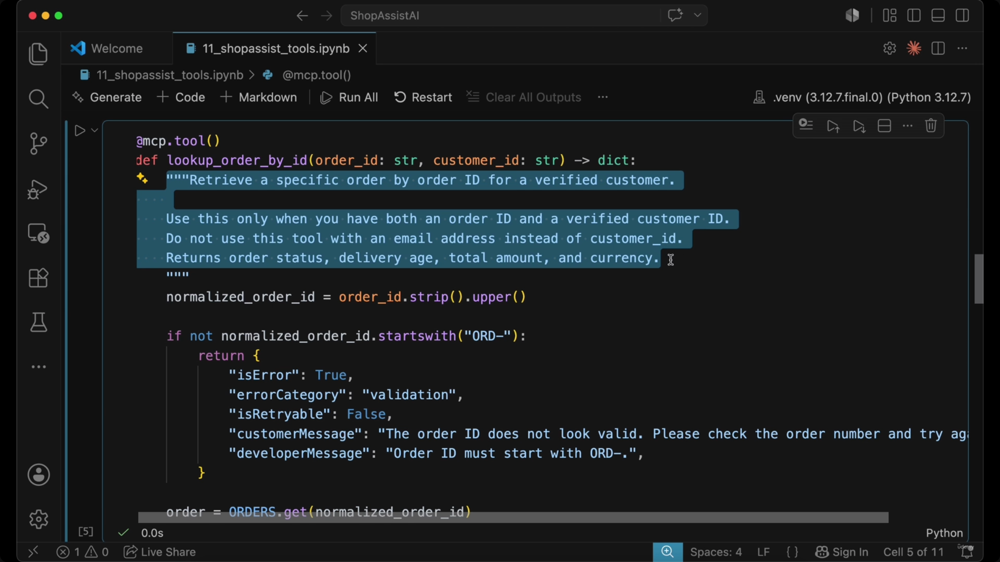

### MCP tool implementation details

- **Input boundaries and dependencies** — `lookup_order_by_id` requires *both* `order_id` and `customer_id`, so the caller must first verify the customer and only then look up the order with the verified ID.
- **Docstrings do real work in MCP** — they become the tool's description for the AI agent, and must explicitly cover: when to use the tool, what it returns, and what it should *not* be used for (to head off misuse, e.g. "do not use this tool with an email address instead of customer_id").
- **Structured responses are unchanged** — MCP changes how a client discovers/calls a tool, but backend validation is still required: success results, validation errors, permission errors, and business errors all still need to come back structured.

```python
@mcp.tool()
def lookup_order_by_id(order_id: str, customer_id: str) -> dict:
    """Retrieve a specific order by order ID for a verified customer.

    Use this only when you have both an order ID and a verified customer ID.
    Do not use this tool with an email address instead of customer_id.
    Returns order status, delivery age, total amount, and currency."""
    normalized_order_id = order_id.strip().upper()
    if not normalized_order_id.startswith("ORD-"):
        return {
            "isError": True,
            "errorCategory": "validation",
            "isRetryable": False,
            "customerMessage": "The order ID does not look valid. Please check the order number and try again.",
            "developerMessage": "Order ID must start with ORD-"
        }

    order = ORDERS.get(normalized_order_id)
    if not order:
        return {
            "isError": False,
            "order": None,
            "message": "No order found with this order ID."
        }

    if order["customer_id"] != customer_id:
        return {
            "isError": True,
            "errorCategory": "permission",
            "isRetryable": False,
            "customerMessage": "I can't access this order with the current account information.",
            "developerMessage": "Order does not belong to the verified customer."
        }

    return {
        "isError": False,
        "order": order,
    }
```

**[Factual inconsistency]** The slide note's own code block for this MCP version ends its success branch with `"eligible": True, "order_id": order_id, "reason": "Order is within the 30-day return window."` — that's actually the shape of `check_refund_eligibility`'s return value, not `lookup_order_by_id`'s. `lookup_order_by_id` is only supposed to *retrieve* the order, not judge eligibility. This looks like a copy-paste slip in the slide-note transcription; the version above returns `{"isError": False, "order": order}`, consistent with the pre-MCP version of the same function shown earlier and with the function's stated job ("retrieves order data").

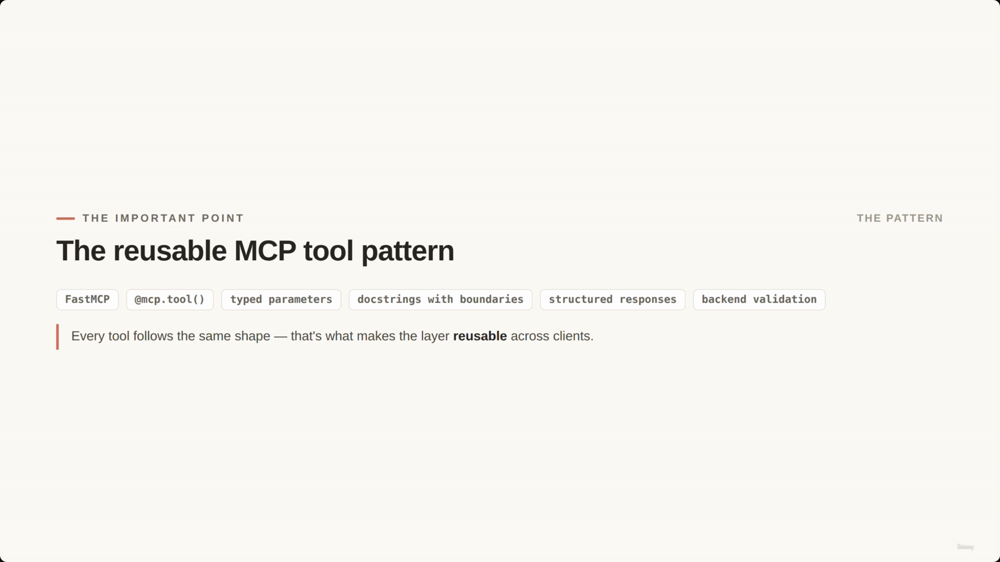

### Inside the actual server file

The screenshot below is `shopassist_mcp_server.py` itself (not the notebook), scrolled to the `ORD-87654321` record and the top of `get_customer_by_email`.

**[Slide detail]** Two things only visible here:
1. The full `ORD-87654321` record confirms `delivered_days_ago: 45`, `total: 149.99`, `currency: "USD"` (used above).
2. The finished server file types `get_customer_by_email`'s return as **`dict[str, Any]`**, not the plain `dict` shown in the slide-note's earlier MCP code block — i.e. the more complete type hint used once the file also imports `from typing import Any`.

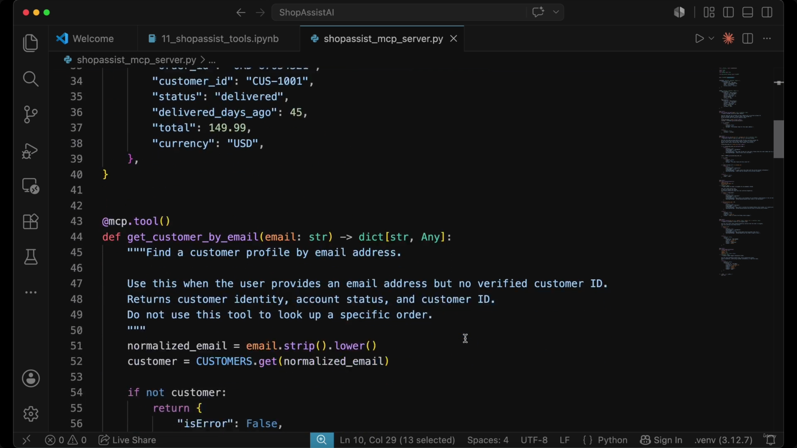

### The reusable MCP tool pattern

Every tool follows the same shape, which is what makes the layer reusable across different clients:

- `FastMCP` + `@mcp.tool()` decorator
- Typed parameters
- Docstrings that define operational boundaries (when to use / not use, what's returned)
- Structured responses
- Backend validation

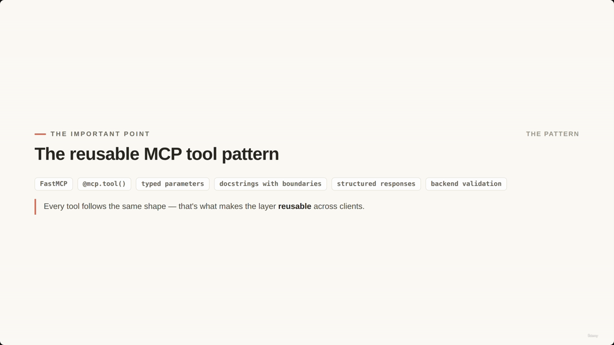

---

## 5. Testing with the MCP Inspector

- The Python MCP SDK ships a browser-based inspector for debugging/testing a server without wiring it into a full application.
- Starting it prints a local browser URL together with a session token used to authenticate requests.

**[Factual inconsistency]** The slide note's own bullets and its bash code block both say to run **`mcpdev shopassist_mcp_server.py`** (one word). The terminal screenshot shows the actual command is **two words**:

```bash
mcp dev shopassist_mcp_server.py
```

Output confirms this:

```
(.venv) selldon@Antons-MacBook-Pro ShopAssistAI % mcp dev shopassist_mcp_server.py
Starting MCP inspector...
⚙ Proxy server listening on 127.0.0.1:6277
🔑 Session token: 3106181abb16f17622fb450c85671d3c05878b0a3000f6a841220a7092303b4d
Use this token to authenticate requests or set DANGEROUSLY_OMIT_AUTH=true to disable auth

🔗 Open inspector with token pre-filled:
   http://localhost:6274/?MCP_PROXY_AUTH_TOKEN=3106181abb16f17622fb450c85671d3c05878b0a3000f6a841220a7092303b4d

🔍 MCP Inspector is up and running at http://127.0.0.1:6274 🚀
```

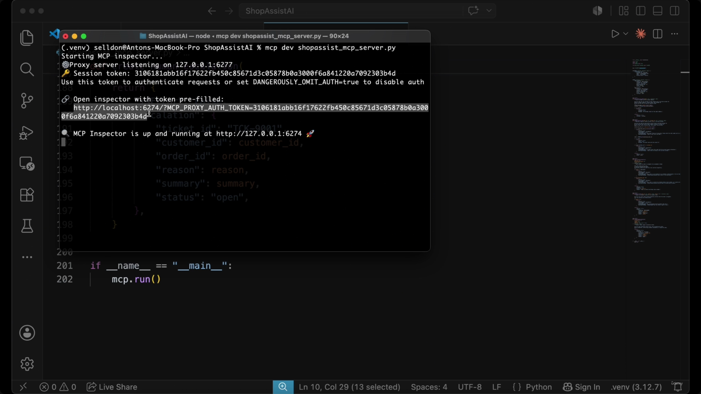

**[Slide detail]** Once the inspector page loads, its connection panel (not mentioned anywhere in the slide-note text) shows exactly how `mcp dev` launches the server under the hood:

| Field | Value |
|---|---|
| Transport Type | `STDIO` |
| Command | `uv` |
| Arguments | `run --with mcp mcp run shopassist_mcp_server.py` |

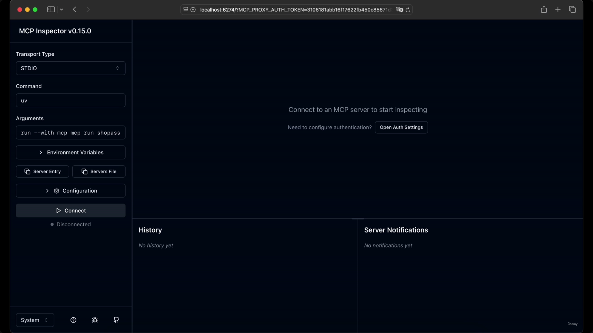

### Using the inspector: List Tools

- Click **Connect**, go to the **Tools** section, then **List Tools** to see everything the server exposes.
- The History panel logs the underlying protocol calls: `1. initialize`, `2. tools/list`.

**[Slide detail]** The tool descriptions rendered here reveal a docstring for `check_refund_eligibility` that was never shown in any of the slide note's Python code blocks (the earlier `check_refund_eligibility` code sample, both pre- and post-MCP, has *no* docstring at all):

> `check_refund_eligibility` — *"Check whether an order is eligible for an automatic refund. This tool checks policy only. It does not process the refund. Use process_refund only after this tool confirms eligibility."*

This is a materially useful detail: it's the boundary-setting docstring text that keeps the main support agent from mistakenly assuming eligibility-check success means the refund was performed.

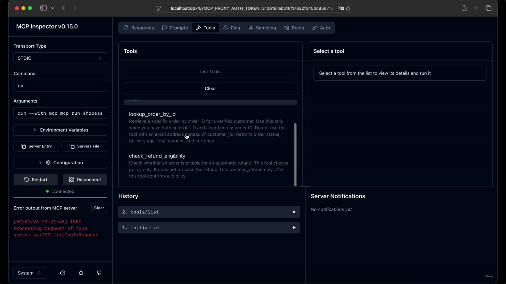

---

## 6. The MCP architectural shift

**[Traditional way]** the application must define tool schemas manually, maintain implementations, execute tool calls, and send results back to the LLM itself.

**[MCP way]** the architecture is decoupled:
- **MCP Server** — hosts the tool implementations
- **MCP Client** (e.g. Claude) — connects to the server, discovers available tools, reads descriptions/input schemas, and calls them through the protocol
- **Benefit** — the main agent application doesn't need to manually hard-code every backend tool into its own tool loop

The lecture's own diagram for this (reconstructed faithfully below, participants and message order verified against the screenshot) is the clearest artifact in the whole lecture for how a ShopAssist MCP tool call actually flows end to end:

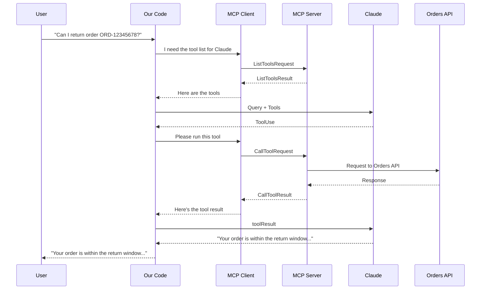
```mermaid
sequenceDiagram
    participant User
    participant Code as Our Code
    participant Client as MCP Client
    participant Server as MCP Server
    participant Claude
    participant API as Orders API

    User->>Code: "Can I return order ORD-12345678?"
    Code->>Client: I need the tool list for Claude
    Client->>Server: ListToolsRequest
    Server-->>Client: ListToolsResult
    Client-->>Code: Here are the tools
    Code->>Claude: Query + Tools
    Claude-->>Code: ToolUse
    Code->>Client: Please run this tool
    Client->>Server: CallToolRequest
    Server->>API: Request to Orders API
    API-->>Server: Response
    Server-->>Client: CallToolResult
    Client-->>Code: Here's the tool result
    Code->>Claude: toolResult
    Claude-->>Code: "Your order is within the return window..."
    Code-->>User: "Your order is within the return window..."
```

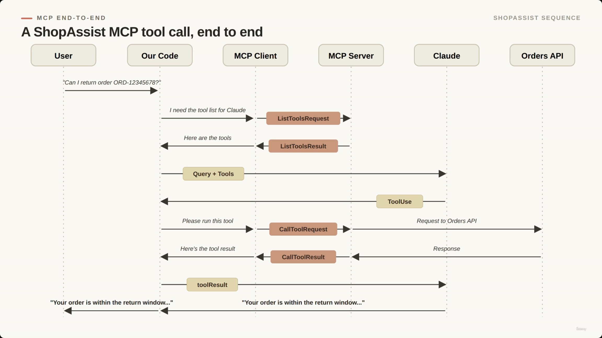

> Note: the slide note captured this exact diagram twice (00:06:23 and 00:06:45, identical) — only one copy is kept.

### Verification example: testing `get_customer_by_email`

- In the inspector, select `get_customer_by_email`, enter `alex@example.com`, and run the tool.
- The inspector returns a structured result containing `customer_id`, `email`, `name`, and `account_status`.
- **This confirms two layers at once:** (1) the underlying Python business logic is correct, and (2) the MCP server is correctly exposing that logic as an accessible tool.

**[Slide detail]** The inspector also displays the auto-derived **Output Schema** for the tool — not mentioned in the slide-note text:

```json
{
  "type": "object",
  "additionalProperties": true,
  "title": "get_customer_by_emailDictOutput"
}
```

This is MCP inferring a (fairly loose) output schema from the Python `dict` / `dict[str, Any]` return type — a concrete illustration of *why* typed, well-described tools matter more than untyped ones: a richer return-type annotation would produce a richer schema here.

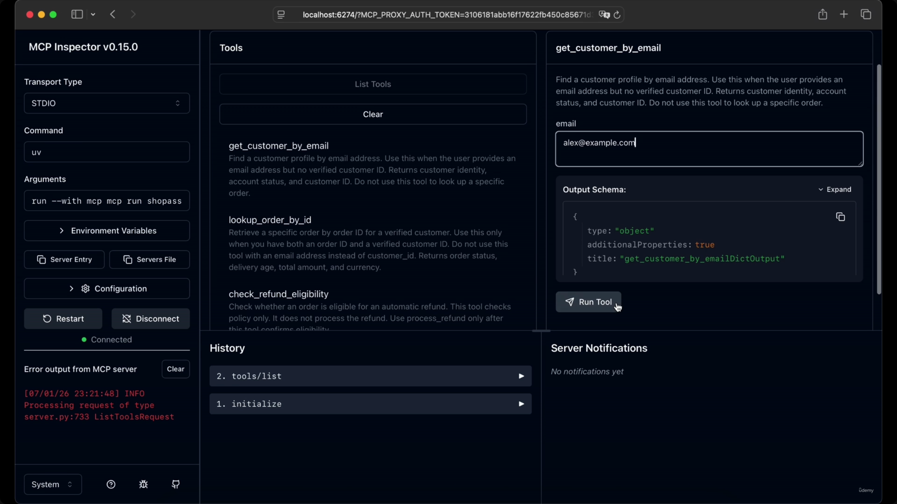

> In production, the dictionaries in this demo would be replaced by real calls to a CRM, ecommerce platform, payment provider, or ticketing system — but the MCP interface the client sees stays identical: clear tool names, typed inputs, useful descriptions, structured results.

---

## 7. ShopAssist MCP server composition

The server sits as a single bridge between the LLM and several backend systems:

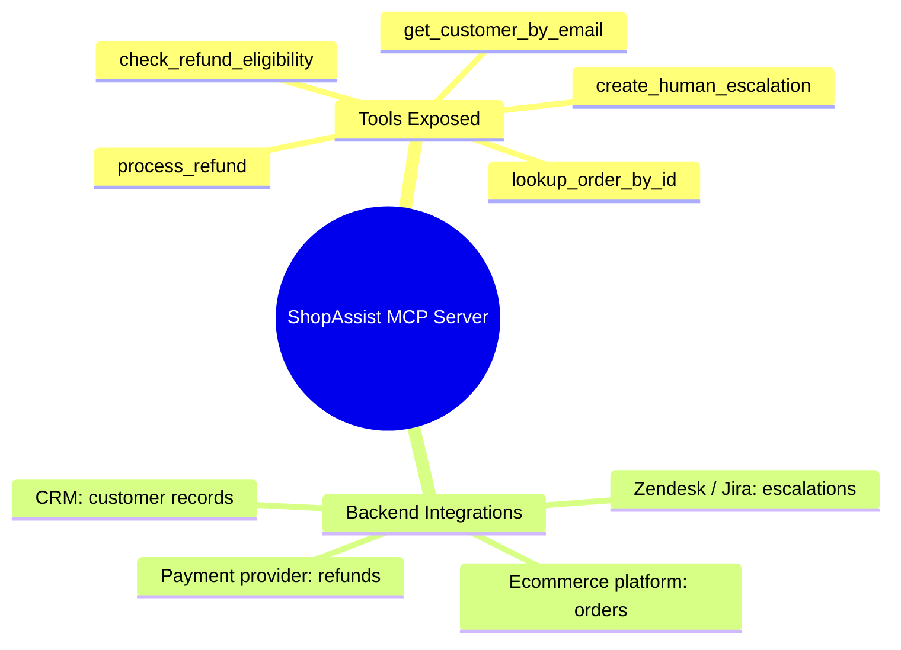
```mermaid
mindmap
  root((ShopAssist MCP Server))
    Tools Exposed
      get_customer_by_email
      lookup_order_by_id
      check_refund_eligibility
      process_refund
      create_human_escalation
    Backend Integrations
      CRM: customer records
      Ecommerce platform: orders
      Payment provider: refunds
      Zendesk / Jira: escalations
```

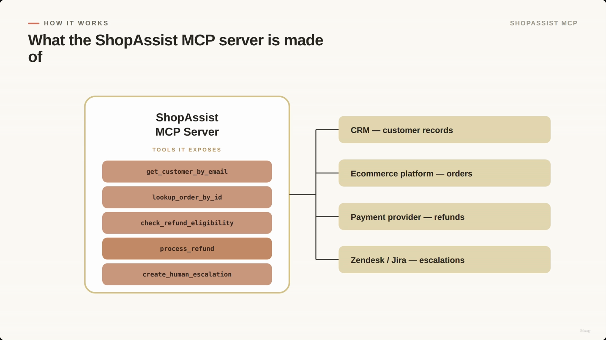

> Note: this composition diagram was also captured twice in a row (00:07:21 and 00:07:31, identical) — only one copy is kept.

---

## 8. Local tools vs. MCP — when to reach for which

- **Local tools** — use when the tool layer belongs exclusively to one application.
- **MCP** — use when you want tools to be discoverable, reusable, and configurable across multiple workloads (Claude Code, Claude Desktop, internal agents, or other MCP-compatible clients).
- MCP is a standardized way to expose controlled backend capabilities — the client always sees clear tool names, typed inputs, useful descriptions, and structured results, regardless of what's actually behind the tool (CRM, ticketing system, payment provider, etc.).

> MCP is about exposing controlled backend capabilities through clear, typed, well-described interfaces.

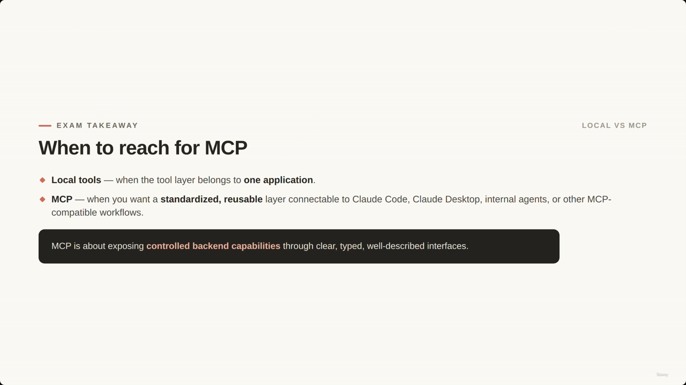

---

## Summary

- ShopAssist's backend tool layer is five functions — `get_customer_by_email`, `lookup_order_by_id`, `check_refund_eligibility`, `process_refund`, `create_human_escalation` — each mocked against a tiny `CUSTOMERS`/`ORDERS` dataset (one customer, one eligible order at 12 days, one policy-exception order at 45 days).
- **Scoping matters as much as correctness**: the main support agent only gets safe/lookup tools; only a narrower refund workflow agent gets `process_refund`.
- Structured, non-throwing responses (`isError`, `errorCategory`, `isRetryable`, `customerMessage`, `developerMessage`) are used consistently whether the tools are called as plain Python or wrapped as MCP tools — MCP changes *discovery and invocation*, not the need for backend validation.
- Moving to MCP means wrapping each function with `@mcp.tool()` under a `FastMCP("ShopAssistMCP")` server, with docstrings doing the work of tool descriptions (when to use, what's returned, what not to do).
- The MCP Inspector (`mcp dev shopassist_mcp_server.py`, launched via `uv run --with mcp mcp run shopassist_mcp_server.py`) lets you `List Tools` and run one directly to verify both the business logic and the exposure layer independently.
- **Exam framing:** MCP is not "give Claude more tools" — it's a standardized way to expose controlled backend capabilities behind clear, typed, reusable, well-described interfaces.

---

## Corrections and gaps surfaced in this pass

- **Command name:** the slide note says `mcpdev` (one word); the actual terminal output shows `mcp dev` (two words) — corrected above.
- **Copy-paste slip:** the slide note's MCP version of `lookup_order_by_id` ends with an eligibility-shaped return (`"eligible": True, ...`) that belongs to `check_refund_eligibility`, not to an order-lookup function — corrected to `{"isError": False, "order": order}` based on the function's stated purpose and its pre-MCP counterpart.
- **Missing docstring surfaced:** the MCP Inspector's tool list shows a docstring for `check_refund_eligibility` ("checks policy only... does not process the refund...") that never appears in any of the slide note's `check_refund_eligibility` code blocks.
- **Slide-only data:** the full `ORD-87654321` record (`delivered_days_ago: 45`, `total: 149.99`, `currency: "USD"`) and the demo's `TCK-9001` escalation ticket output are only visible in screenshots, not written anywhere in the slide-note text.
- **Slide-only config:** the MCP Inspector's actual launch configuration (`Command: uv`, `Arguments: run --with mcp mcp run shopassist_mcp_server.py`) and the auto-derived Output Schema for `get_customer_by_email` are visible only in screenshots.
- **Duplicate captures excluded:** four pairs of screenshots were pixel-identical (the escalation-demo cell at 00:03:42/00:03:44; the "Replacing local backend functions with MCP tools" title card at 00:03:47/00:04:05; the end-to-end sequence diagram at 00:06:23/00:06:45; and the mindmap composition diagram at 00:07:21/00:07:31) — one representative of each pair is kept.
- No lecture bleed-through was found — all 22 captured screenshots show consistent ShopAssist AI content and editor/terminal state.

---

## In Plain English

Here's the whole file in plain, everyday language:

**The big picture:** another hands-on build lecture — actually writing the five real ShopAssist backend functions, then re-exposing that exact same logic through a proper MCP server so any Claude-compatible tool can discover and use it.

**1. The five tools built**
Find a customer by email, look up an order by ID, check if a refund is allowed by policy, actually process a refund (the sensitive one), and escalate a case to a human.

**2. Not every agent gets every tool**
The everyday support agent only gets the safe lookup/eligibility tools; only a narrower "refund agent" is trusted with the sensitive `process_refund` tool.

**3. Every function returns a structured result, success or failure**
No crashes, no vague strings — always something like `{isError, errorCategory, customerMessage, developerMessage}` so the calling code (and Claude) always knows exactly what happened.

**4. A live demo of the escalation path**
An old order that's outside the 30-day refund window automatically gets escalated to a human with a real ticket number — showing the whole "lookup → check eligibility → fails → escalate" flow actually working end to end.

**5. Moving the same logic into MCP**
Nothing about the actual business logic changes — you just wrap each function with a decorator (`@mcp.tool()`) so it becomes something an MCP-compatible client (like Claude) can discover and call through a standard protocol, instead of you hard-coding every tool into your app by hand.

**6. Docstrings matter a lot in MCP**
The text inside each function's docstring becomes the tool's actual description that Claude reads to decide when to use it — same "when to use / when not to use" guidance from lecture 21, just written as a Python docstring instead of a JSON field.

**7. Testing it live**
A browser tool called the MCP Inspector lets you connect to your running server, list every tool it exposes, and actually run one (like looking up a customer by email) to confirm both the business logic and the "is it properly exposed" plumbing work correctly — without needing a real Claude conversation yet.

**8. The big architectural payoff**
Instead of your main app manually maintaining every single tool definition and execution path itself, MCP servers can be built once and reused across multiple different clients (Claude Code, Claude Desktop, your own internal agents, etc.).

**One-sentence summary:** The exact same five ShopAssist backend functions get built first as plain Python, then re-packaged as a discoverable, reusable MCP server — proving that MCP changes *how tools are found and called*, not the need for solid backend logic and structured error handling underneath.

---

## Full Walkthrough: One Refund Request, Traced Step by Step (With Real JSON)

Everything above can feel like a pile of separate functions until you watch **one single request** walk through all of them in order. So let's follow the exact case the lecture itself ran and screenshotted — start to finish, with the real captured output at the end. No invented data here; every value below is reused straight from the sections above.

**The starting point:** the customer `alex@example.com` asks about a refund for order `ORD-87654321`. This is deliberately the *older* order in the mock data — delivered 45 days ago, not the 12-day-old one — because it's the case the lecture actually ran and captured a real output for. It's the policy-exception path, not the happy path.

The whole chain is four function calls, each one feeding its result into the next:

```
email in → find customer → find order → check eligibility → (fails) → escalate to a human
```

---

### Call 1 — `get_customer_by_email("alex@example.com")`

First, turn the email address into a real customer record. The function is the plain, screenshot-verified version from earlier in this file:

```python
def get_customer_by_email(email: str) -> dict:
    normalized_email = email.strip().lower()
    customer = CUSTOMERS.get(normalized_email)

    if not customer:
        return {
            "isError": False,
            "customer": None,
            "message": "No customer found for this email address."
        }

    return {
        "isError": False,
        "customer": customer,
    }
```

`"alex@example.com"` is a key in the mocked `CUSTOMERS` dict, so this returns:

```python
{
    "isError": False,
    "customer": {
        "customer_id": "CUS-1001",
        "email": "alex@example.com",
        "name": "Alex Morgan",
        "account_status": "active",
    },
}
```

The important value to carry forward is `customer_id: "CUS-1001"`.

---

### Call 2 — `lookup_order_by_id("ORD-87654321", "CUS-1001")`

Now that there's a verified `customer_id`, look up the specific order. `ORD-87654321` passes the `ORD-` format check, exists in the mocked `ORDERS` dict, and belongs to `CUS-1001` — so all three of the function's guard clauses (bad format, order not found, wrong owner) pass through cleanly, and it returns the full order record:

```python
{
    "isError": False,
    "order": {
        "order_id": "ORD-87654321",
        "customer_id": "CUS-1001",
        "status": "delivered",
        "delivered_days_ago": 45,
        "total": 149.99,
        "currency": "USD",
    },
}
```

That `delivered_days_ago: 45` is the number that's about to matter.

---

### Call 3 — `check_refund_eligibility(order)`

This function checks two things, in order, using nothing but the order record — no database, no API call, just an `if` and a comparison:

```python
def check_refund_eligibility(order: dict) -> dict:
    if order["status"] != "delivered":
        return { ... }  # "not eligible... has not been delivered"

    if order["delivered_days_ago"] > 30:
        return {
            "isError": True,
            "errorCategory": "business",
            "isRetryable": False,
            "customerMessage": "This order is outside the standard 30-day return window, so I cannot process a refund.",
            "developerMessage": "Refund denied because delivery date is outside policy window."
        }

    return { "isError": False, "eligible": True, "reason": "..." }
```

Walking through it with our order:
1. **First check:** `order["status"]` is `"delivered"` — so the first `if` is `False`. It passes straight through.
2. **Second check:** `order["delivered_days_ago"]` is `45`, and `45 > 30` is `True`. This is the one that fails.

So the function returns the second block above — a structured **business error**, not a crash: `errorCategory: "business"`, `isRetryable: False`, and the customer-facing message *"This order is outside the standard 30-day return window, so I cannot process a refund."*

---

### Call 4 — `create_human_escalation(...)` (the real captured output)

Because `check_refund_eligibility` came back with `isError: True`, the code doesn't retry and it doesn't force a refund through — it escalates to a human:

```python
if eligibility_result.get("isError"):
    escalation_result = create_human_escalation(
        customer_id=customer["customer_id"],
        order_id=order["order_id"],
        reason="refund_policy_exception",
        summary=eligibility_result["developerMessage"],
    )
    print(escalation_result)
```

And here's the actual printed output, captured on screen in the notebook — reused verbatim, not reconstructed:

```python
{'isError': False, 'escalation': {'ticket_id': 'TCK-9001', 'customer_id': 'CUS-1001',
 'order_id': 'ORD-87654321', 'reason': 'refund_policy_exception',
 'summary': 'Refund denied because delivery date is outside policy window.', 'status': 'open'}}
```

Notice `isError` is `False` here — the *escalation tool itself* worked correctly. It didn't fail; its whole job was to create a ticket for a case automation can't finish, and it did exactly that. `ticket_id: 'TCK-9001'` is a real ticket number generated in this run, not a placeholder.

---

### No Claude anywhere in this chain — on purpose

Worth saying plainly, because it's easy to assume otherwise: this entire four-call sequence — customer lookup, order lookup, eligibility check, escalation — is **plain Python function calls**, run directly in the notebook. Nothing here shows Claude choosing to call these functions or reading their results. That's the point of this part of the lecture: it's proving the *backend logic* works correctly, in isolation, before wiring it up as tools Claude can call. The "let an agent drive this" part comes later, once the same functions are exposed through MCP.

---

### The same logic, wrapped for MCP

Later in the file, `get_customer_by_email` reappears — same normalization, same lookup, same two possible return shapes — just wrapped with `@mcp.tool()` and given a docstring:

```python
@mcp.tool()
def get_customer_by_email(email: str) -> dict:
    """Find a customer profile by email address.

    Use this when the user provides an email address but no verified customer ID.
    Returns customer identity, account status, and customer ID.
    Do not use this tool to look up a specific order.
    """
    customer = CUSTOMERS.get(email.strip().lower())
    if not customer:
        return {
            "isError": False,
            "customer": None,
            "message": "No customer found for this email address."
        }

    return {
        "isError": False,
        "customer": customer
    }
```

Run this with `"alex@example.com"` and it produces the exact same result as Call 1 above. Nothing about *what* the function does changed. What's new is the `@mcp.tool()` decorator (which registers it with the MCP server) and the docstring (which becomes the description an MCP client like Claude reads to decide when this tool is the right one to call).

---

### The whole journey, end to end (our refund example)

1. `get_customer_by_email("alex@example.com")` → `customer_id: "CUS-1001"`.
2. `lookup_order_by_id("ORD-87654321", "CUS-1001")` → the order record, `delivered_days_ago: 45`.
3. `check_refund_eligibility(order)` → passes the `"delivered"` check, fails the `> 30` days check → structured business error.
4. Because of that error, `create_human_escalation(...)` runs → real ticket `TCK-9001`, `status: "open"`.
5. All four calls are ordinary Python, run directly, with no Claude/API call in between — this part of the lecture is validating the backend, not the agent.
6. Later, the identical `get_customer_by_email` logic gets wrapped in `@mcp.tool()` with a docstring, so an MCP-compatible client (like Claude) can discover and call it the same way.

**The one thing to hold onto:** the business logic in steps 1–5 never changed between the plain-Python version and the MCP version — the mock data, the checks, the `TCK-9001` escalation, all of it stays identical either way. MCP only changes *how the tool gets found and invoked*, not *what it actually does*.

---

*Sources: [slide notes](../23-BUILD-ShopAssist-Backend-Tools-And-MCP-Integration.md) · [[hover-notes-transcripts/23-BUILD-ShopAssist-Backend-Tools-And-MCP-Integration (transcript)|full transcript]]*
