# Task Decomposition, Hooks, Gates, and Handoffs

> [[24-CoordinatorAndSubagents-Architecture|Lecture 24]] introduced coordinator/sub-agent architecture and explicit context passing between agents. This lecture goes one level deeper: **how do you design the work itself** — when do you hand Claude a fixed script versus let it investigate, where do you insert a **deterministic checkpoint** the model cannot talk its way past, and how does work move cleanly from one agent (or human) to the next? The **prerequisite-gate** concept here is the same mechanism [[03-ClaudeApp-vs-ClaudeAPI-vs-ClaudeCode-vs-MCP-vs-AgentSDK|Lecture 03's refund-verification gate]] introduced — this lecture names it explicitly and adds two siblings: **hooks** (which enforce the gate at the tool-call boundary) and **handoffs** (which carry facts, not vibes, to the next reviewer).

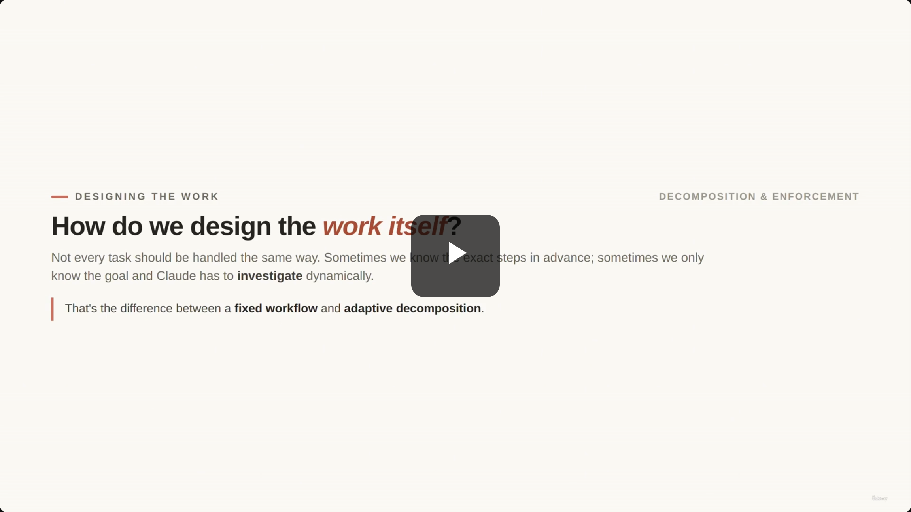

## Designing the work: fixed vs. adaptive

- The right architecture depends on how much is known about the task **before you start**:
  - **Fixed Workflow** — the exact steps are known in advance.
  - **Adaptive Decomposition** — only the goal is known; the agent must investigate dynamically to find the steps.

> **Transcript color:** "Not every task should be handled the same way. Sometimes we know the exact steps in advance. Sometimes we only know the goal, and Claude needs to investigate dynamically."

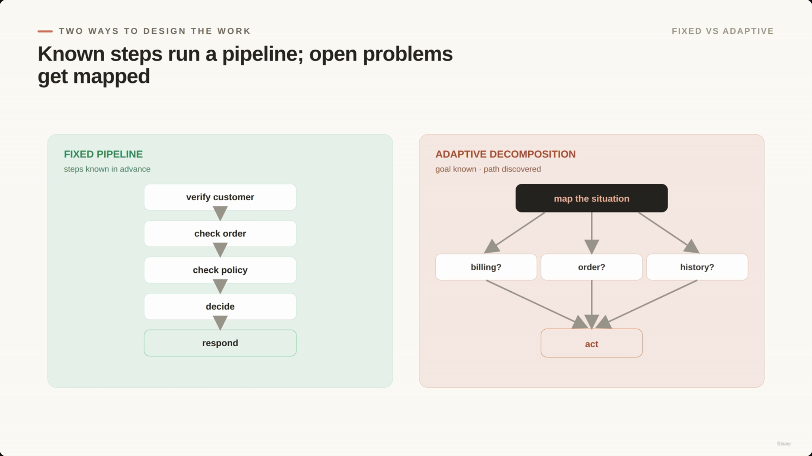

**[Slide detail]** The comparison diagram sketches the adaptive branch concretely: `map the situation` fans out into candidate investigation threads (shown as `billing?`, `order?`, `history?`) before converging back to `act`. Neither the transcript nor the slide-note's bullets name these three example threads — they only appear on the slide itself.

---

## 1. Fixed Sequential Pipeline

- Each step depends on the output of the previous one.
- Ideal for **predictable business processes** where the workflow is well-defined.
- Example: a ShopAssist refund process — verify customer → check order → check policy → decide → respond.

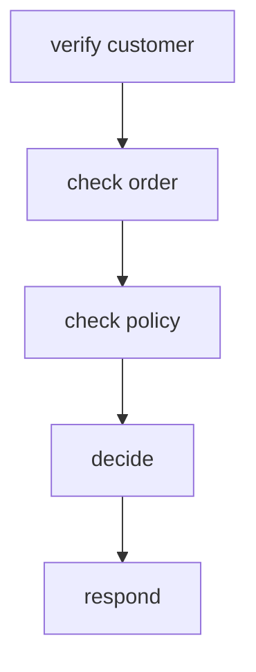

```python
def refund_workflow(customer_id: str, order_id: str, message: str):
    customer = get_customer(customer_id)
    order = lookup_order(
        customer_id=customer['id'],
        order_id=order_id
    )
    policy = check_return_policy(
        customer_id=customer['id'],
        order_id=order['id']
    )
    decision = decide_refund(
        customer=customer,
        order=order,
        policy=policy,
        customer_message=message
    )
    return draft_customer_response(decision)
```

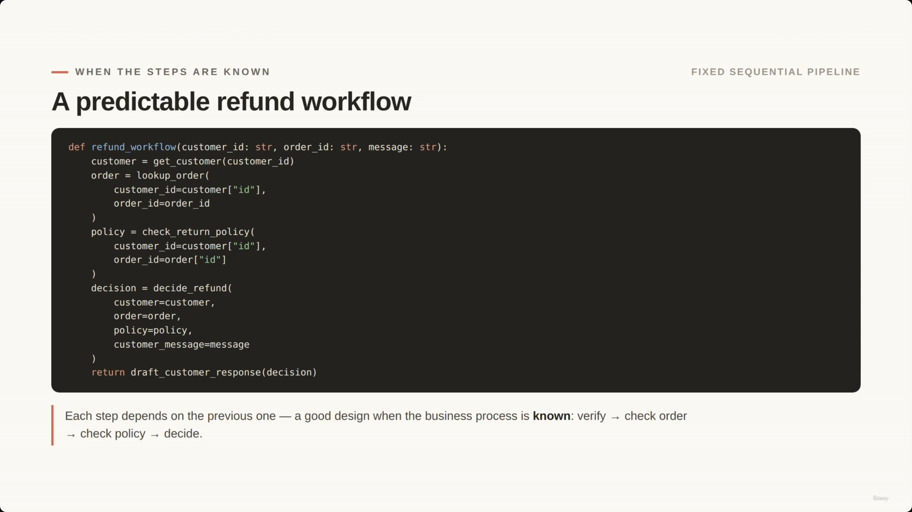

> **Transcript color:** "This is a good design when the business process is known... this is also called **prompt chaining** when each step uses Claude and passes its output to the next step."

### Prompt Chaining

- The implementation technique behind a fixed pipeline: each step is a model call whose output feeds the next step's input.
- **Why use it?** Keeps every call focused on one job. Instead of one massive prompt trying to classify, extract, validate, decide, *and* write the final answer, the work is split into discrete stages that pass clean, structured data forward.

```python
classification = classify_customer_issue(message)
extraction = extract_return_request(message)

# Example output:
# {
#   "order_id": "A123",
#   "claim": "headphones",
#   "reason": "arrived damaged",
#   "desired_action": "replacement"
# }

order = lookup_order(
    customer_id=session.customer_id,
    order_id=extraction["order_id"]
)
policy = check_return_policy(
    customer_id=session.customer_id,
    order_id=order["id"],
    item=extraction["item"],
    reason=extraction["reason"]
)
response = draft_customer_response(
    classification=classification,
    extraction=extraction,
    order=order,
    policy=policy
)
```

*No dedicated screenshot for Prompt Chaining — the slide-note's code sample is the only source here.*

---

## 2. Adaptive Decomposition

- Used when the path is **unclear** — the exact steps aren't known in advance.
- **How it works:** the coordinator first maps the situation, then decides what to investigate.
- Crucial for handling complex or unfamiliar scenarios — e.g. navigating an unknown codebase, or an ambiguous customer complaint.

> **Transcript color:** *"Something is wrong with my account. I was charged, but I don't see my order, and support told me something different yesterday."* We don't yet know the exact path here — the coordinator has to map the situation first.

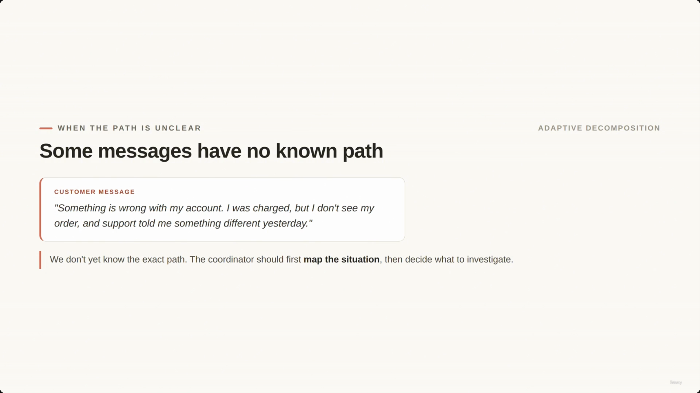

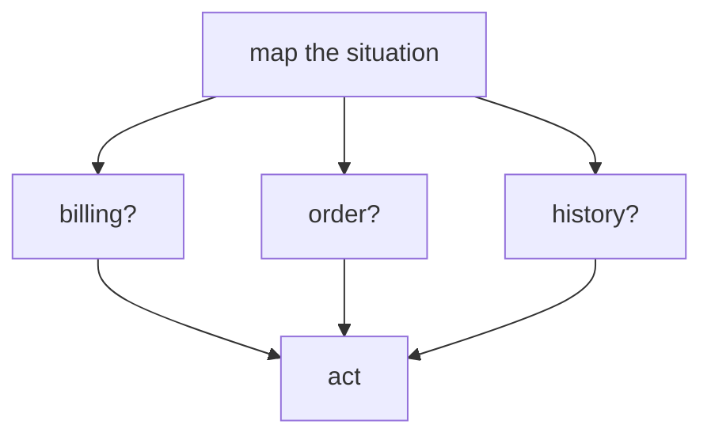

> **Note on screenshot placement:** the original slide-note's chronological ordering files this screenshot (and several that follow) under earlier headers — an artifact of the capture tool lagging the actual slide transitions. This full-note places each screenshot under the section it actually depicts, verified by content rather than timestamp position.

### Map First, Act Second — Investigation Plan Pattern

- Instead of jumping straight to a resolution, the agent first creates an **investigation plan** to identify the relevant facts.
- In a codebase review: don't edit files immediately — first identify modules, entry points, dependencies, and risk areas.
- In a business workflow: map the issue before acting.
- **Why?** Prevents premature or incorrect action in an unfamiliar or complex environment.

```python
# Plan the investigation before resolving
investigation_plan = call_claude(
    """Create an investigation plan.
    Do not resolve the issue yet.
    Identify which facts must be checked first.""",
    customer_message
)
```

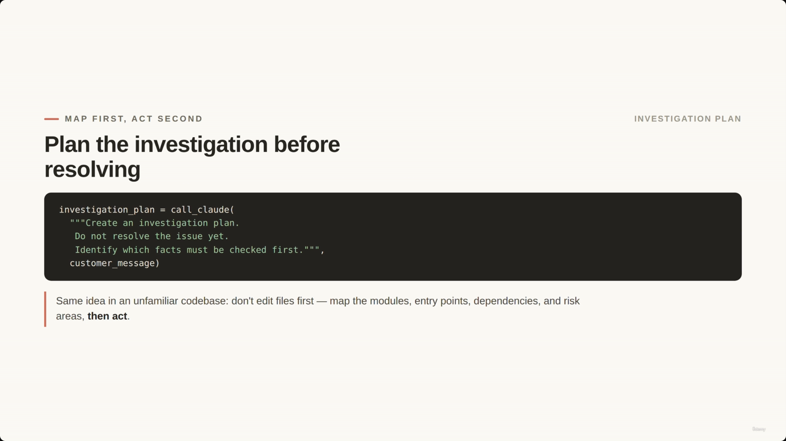

### Large Review Strategy: Local and Integration Passes

- Large tasks split into two stages for reliability:
  - **Local passes** — inspect one specific area at a time.
  - **Integration pass** — checks how findings from the local passes fit together.
- **Why?** More reliable than asking a single prompt to inspect everything at once.

```python
local_findings = [
    review_billing_facts(customer_id),
    review_order_history(customer_id),
    review_policy_constraints(customer_id)
]

integration_review = call_claude(
    "Combine these findings and identify the root cause.", local_findings
)
```

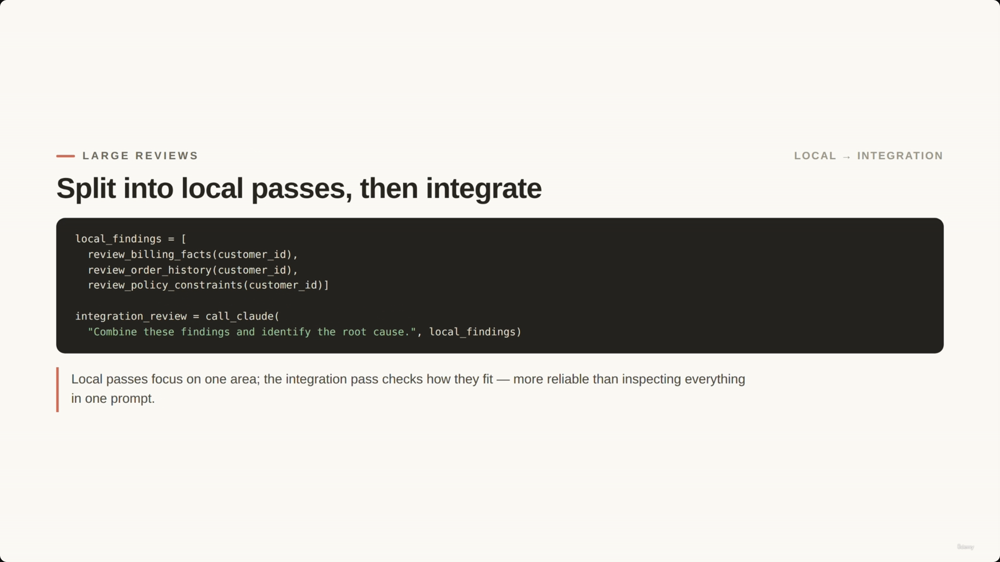

---

## 3. Enforcement: prompts guide, code enforces

- Prompts are useful for **guidance**, but they are not sufficient for **deterministic compliance**.
- **[Key Principle]** If a rule must *always* hold, it belongs in code — not only in a prompt.

> **Transcript color:** "We tell Claude, never process a refund unless the customer has been verified. That instruction is important. But for a production support system, it is not enough. If the rule must always be enforced, it belongs in code."

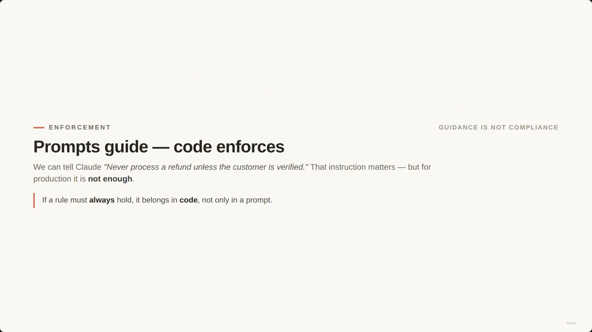

### Prerequisite Gates

- **Definition:** programmatic checks the model cannot bypass — a hard barrier between steps.
- **Implementation:** a system can guarantee a refund is never processed unless a `getCustomer` call confirms the customer is verified.
- **Enforcing thresholds:** application logic — not the model — owns business constraints. If policy requires human approval above $100, the backend must block automatic processing above that amount. The LLM can *recommend* escalation; the application *enforces* the threshold.

```python
def process_refund(customer_id, order_id, amount):
    customer = get_customer(customer_id)
    if not customer["verified"]:
        raise PermissionError("Must be verified before refund.")
    if amount > 100:
        return escalate_to_human(customer_id, "Exceeds auto-approval.")
    return issue_refund(order_id, amount)
```

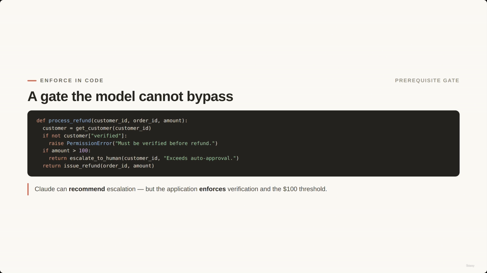

---

## 4. Hooks

- Mechanisms that **intercept or normalize** agent behavior around tool calls.

### Before-tool Use Hooks

- Intercept a tool call **before it executes**, to guarantee deterministic enforcement.
- **[Key Principle]** The model chooses tools dynamically, but the application still controls what is actually *allowed* — blocking or redirecting unsafe or policy-violating actions.

```python
def before_tool_use(tool_name, tool_input, state):
    if tool_name == "process_refund":
        if not state.get("customer_verified"):
            return {"blocked": True, "redirect": "get_customer"}
        if tool_input["amount"] > 100:
            return {"blocked": True, "redirect": "escalate_to_human"}
    return {"blocked": False}
```

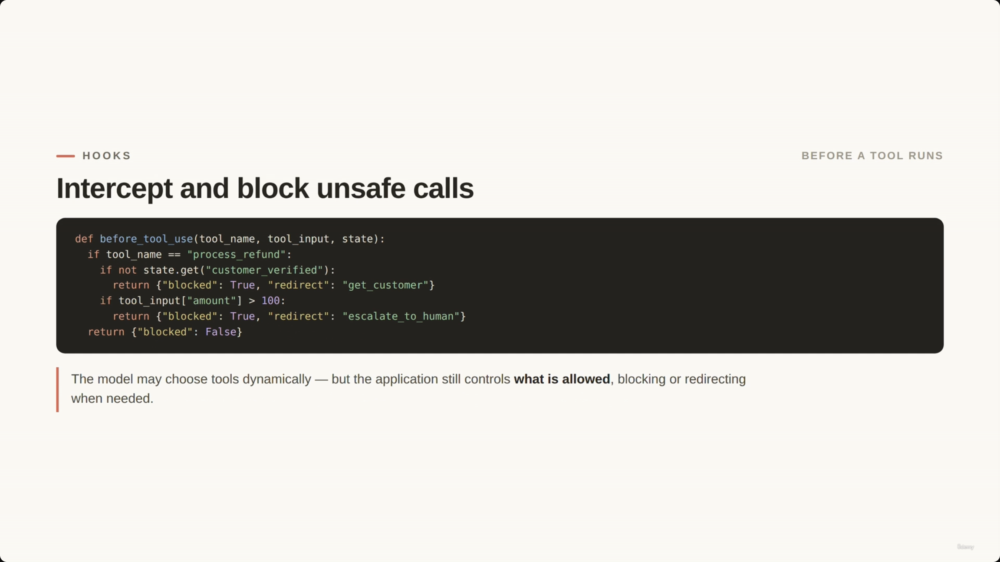

### Post-tool Use Hooks

- Normalize a tool's result **after it runs but before the model sees it**.
- **Why use it?** Standardizes messy or inconsistent tool output into one clean shape, instead of making every downstream prompt deal with the raw format.

```python
def post_tool_use(tool_name, result):
    if tool_name == "lookup_order":
        return {
            "order_id": result["id"],
            "status": result["status"].lower(),
            "delivered": result["status"].lower() == "delivered",
            "total_amount": round(result["total"], 2)
        }
    return result
```

*No dedicated screenshot for the Post-tool Use code — the slide-note's sample is the only source here.*

### Gate + Hooks: the full tool-call boundary

Putting the prerequisite gate and both hooks together, the application wraps every tool call the model makes:

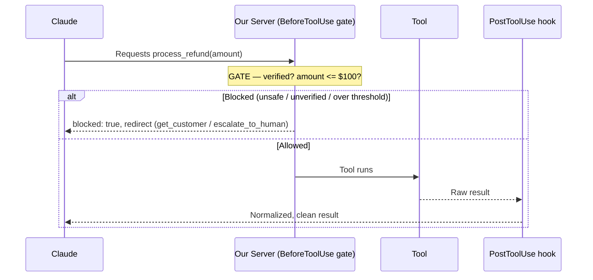

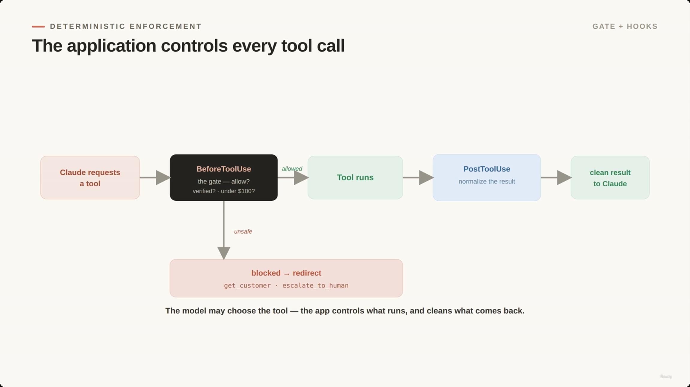

---

## 5. Handoffs

- A handoff is a **structured protocol**, not just "please review this."
- **[Key Principle]** A good handoff carries the *facts*, not a vague request — enough context that the next reviewer (human, agent, or workflow) can continue **without reconstructing the entire conversation**.

> **Transcript color:** "This is much better than a vague escalation like 'please review this refund.' The human reviewer, another agent, or another workflow should receive enough context to continue without reconstructing the entire conversation."

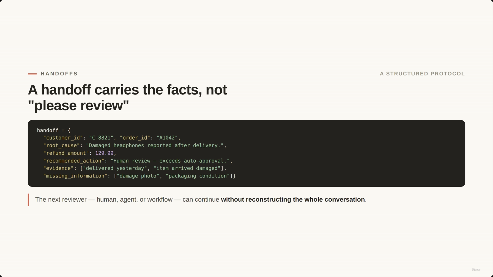

**[Factual inconsistency]** The slide-note's own text sample gives `"customer_id": "C-0021"` and `"refund_amount": 328.98`. The screenshot of the actual slide shows different values — `"customer_id": "C-8821"` and `"refund_amount": 129.99"`. The code structure is otherwise identical. The screenshot-verified version is used below as authoritative:

```python
handoff = {
    "customer_id": "C-8821",
    "order_id": "A1042",
    "root_cause": "Damaged headphones reported after delivery.",
    "refund_amount": 129.99,
    "recommended_action": "Human review - exceeds auto-approval.",
    "evidence": ["delivered yesterday", "item arrived damaged"],
    "missing_information": ["damage photo", "packaging condition"]
}
```

A clean handoff answers the same questions regardless of who (or what) receives it next:

| Field | Answers | Example value |
|---|---|---|
| `customer_id` / `order_id` | Who and what is this about? | `C-8821` / `A1042` |
| `root_cause` | What actually happened? | "Damaged headphones reported after delivery." |
| `refund_amount` | What's the number at stake? | `129.99` |
| `recommended_action` | What does the agent think should happen? | "Human review — exceeds auto-approval." |
| `evidence` | What facts support that recommendation? | delivered yesterday; item arrived damaged |
| `missing_information` | What's still unknown? | damage photo; packaging condition |

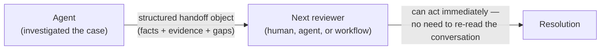

---

## Design Rule: match the mechanism to the task

> The slide-note repeats this recap almost verbatim under two separate headers ("Design Rule: Match the mechanism to the task" and "Match the Mechanism to the Task"). Consolidated once here rather than duplicated.

- **Fixed pipeline** when the steps are known · **dynamic decomposition** when it's investigative.
- **Local + integration passes** for large reviews.
- **Prompts** for guidance · **programmatic gates** when compliance must be guaranteed.
- **Hooks** to normalize tool results, intercept calls, block unsafe actions, and redirect to escalation.
- **Structured handoffs** so work moves safely between agents, tools, and humans.

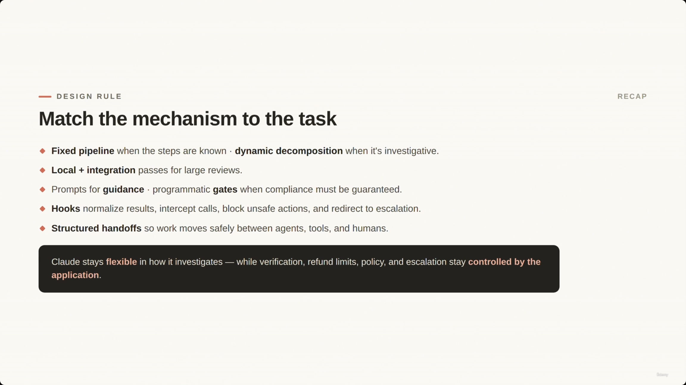

**The balance of flexibility and control:** in ShopAssist, Claude stays flexible in *how* it investigates a customer problem — but customer verification, refund limits, policy enforcement, and escalation rules stay controlled by the application.

---

## Summary

- **Fixed sequential pipeline / prompt chaining** — use when the steps are known in advance; each model call does one job and passes clean output to the next.
- **Adaptive decomposition** — map first, act second; used when the path is unclear or investigative (unfamiliar codebases, ambiguous customer issues).
- **Local + integration passes** — split large reviews into focused local passes plus one pass that reconciles them.
- **Enforcement** — prompts guide the model's reasoning; only code guarantees a rule always holds.
- **Prerequisite gates** — hard, programmatic checks (verification, dollar thresholds) the model cannot talk its way past. Same mechanism as [[03-ClaudeApp-vs-ClaudeAPI-vs-ClaudeCode-vs-MCP-vs-AgentSDK|Lecture 03's refund-verification gate]].
- **Hooks** — `BeforeToolUse` blocks/redirects unsafe calls before they run; `PostToolUse` normalizes messy results before the model sees them.
- **Handoffs** — a structured object carrying facts, evidence, and open questions, so the next reviewer (human, agent, or workflow) never has to reconstruct the conversation from scratch.

**Exam framing to remember:** Claude stays flexible in *how* it investigates — the application stays in control of *what must always be true* (verification, thresholds, policy, escalation).

---

## In Plain English

Here's the whole file in plain, everyday language:

**The big picture:** building on the coordinator/helpers idea (lecture 24), this lecture is about three separate design questions: how do you plan out the work itself, where do you put a "hard stop" rule Claude can't talk its way around, and how does work get handed off cleanly from one agent (or person) to the next?

**1. Two ways to plan the work**
If you already know the exact steps (a standard refund always goes verify → check order → check policy → decide → respond), just hard-code that fixed sequence. If you *don't* know the steps in advance (a confusing, one-off customer complaint), let Claude investigate first and figure out the path as it goes — map the situation, then act.

**2. For big/unclear jobs, look locally first, then combine**
Check each individual piece separately (billing facts, order history, policy) in its own focused pass, and only after all of those are done, run one more pass that looks across all of them together to find the real root cause. Don't dump everything into one giant prompt at once.

**3. The most important rule of the whole lecture**
A prompt can *guide* Claude's behavior, but it can never *guarantee* it. If a rule absolutely must always hold (like "never refund an unverified customer"), that rule has to live in your actual code — not just in the instructions you give Claude.

**4. Prerequisite gates**
Literal code that blocks an action no matter what Claude decides — e.g., the refund function itself refuses to run unless the customer object says `verified: true`, and it automatically escalates anything over $100 regardless of what Claude wants to do.

**5. Hooks — two flavors**
A "before" hook checks and can block/redirect a tool call before it's even allowed to run (e.g., stop an unverified refund and redirect to "verify the customer first"); an "after" hook cleans up a tool's raw, messy result into a tidy, consistent shape before Claude even sees it.

**6. Handoffs — passing work along properly**
When something needs to go to a human (or another agent), don't just say "please review this refund" with no context. Hand over a structured package of facts: who it's about, what actually happened, the dollar amount, what you'd recommend, the evidence you have, and what's still missing — so whoever picks it up next doesn't have to re-read the entire conversation from scratch.

**7. The overall balance**
Let Claude be flexible and creative in *how* it investigates a problem, but keep the things that absolutely must always be true (verification, dollar limits, policy rules) locked down in code, completely outside of Claude's control.

**One-sentence summary:** Match your plan to the task (fixed steps vs. investigate-as-you-go), put anything that must *always* be true into hard-coded gates and hooks instead of just a prompt, and hand off work as a structured packet of facts so the next person or agent never has to start from zero.

---

## Full Walkthrough: One Refund Request, Traced Step by Step (With Real JSON)

Everything above can feel abstract until you watch **one single refund request** travel through the gate, the hooks, and (if needed) a handoff to a human. So let's follow just one, start to finish, using the file's own real numbers — customer `C-8821`, order `A1042`, $129.99.

The whole boundary is this loop, in plain words:

```
Claude wants to call a tool → the before-hook checks it → blocked (redirect) or allowed (tool runs, post-hook cleans the result)
```

---

### The scenario

Claude has been looking at a case: headphones that arrived damaged. It reasons through the evidence, decides a refund is warranted, and tries to call:

```python
process_refund(customer_id="C-8821", order_id="A1042", amount=129.99)
```

That's it — that's the decision Claude made. What happens next is **not** up to Claude anymore.

---

### Step 1 — The before-hook fires first

Before `process_refund` is ever allowed to run, the application's `before_tool_use` hook intercepts the call. Here's the real code from this lecture, checking this exact call:

```python
def before_tool_use(tool_name, tool_input, state):
    if tool_name == "process_refund":
        if not state.get("customer_verified"):
            return {"blocked": True, "redirect": "get_customer"}
        if tool_input["amount"] > 100:
            return {"blocked": True, "redirect": "escalate_to_human"}
    return {"blocked": False}
```

Walking through it for our call:

- `tool_name == "process_refund"` → yes, this is the tool the hook cares about.
- `not state.get("customer_verified")` → assume **customer_verified is True** here, so this check passes clean. (This isolates the second check — in a real run, an unverified customer would already have been redirected to `get_customer` and never reached this point.)
- `tool_input["amount"] > 100` → `129.99 > 100` → **True**.

That second check is the one that fires. The hook returns exactly this:

```json
{"blocked": true, "redirect": "escalate_to_human"}
```

Claude's tool call never executes. `process_refund` never runs. No refund is issued, no database is touched — the call was stopped at the boundary before it did anything.

---

### Step 2 — Why this is code, not Claude's judgment

This is the same principle the file names earlier: **prompts guide, code enforces.** It's worth being very literal about what that means here.

Claude could be completely, 100% correct that this refund is warranted — damaged headphones, clear evidence, a sympathetic case. None of that matters to the hook. The hook doesn't ask "does Claude think this is a good refund?" It asks one boring, mechanical question: `tool_input["amount"] > 100`. That's a number comparison, not a judgment call, and it has nothing to do with how confident or correct Claude's reasoning was.

The `$100` threshold is a business rule that must **always** hold, for every request, regardless of how the model reasons about any individual case. If that rule lived only in a prompt ("please escalate refunds over $100"), a sufficiently persuasive customer message, a clever prompt injection, or just an off day for the model could talk Claude past it. Putting the check in `before_tool_use` — outside the model entirely — means there is no wording, no argument, and no amount of Claude being "sure" that can get a $129.99 refund auto-approved. The dollar threshold isn't Claude's decision to make, ever.

---

### Step 3 — The handoff

Since the call was blocked and redirected to `escalate_to_human`, this case now needs to go to a person. The application builds a structured handoff — not a vague "please review this refund," but the real, screenshot-verified object from this lecture:

```python
handoff = {
    "customer_id": "C-8821",
    "order_id": "A1042",
    "root_cause": "Damaged headphones reported after delivery.",
    "refund_amount": 129.99,
    "recommended_action": "Human review - exceeds auto-approval.",
    "evidence": ["delivered yesterday", "item arrived damaged"],
    "missing_information": ["damage photo", "packaging condition"]
}
```

Walking through what each field answers for the human who picks this up next:

| Field | Answers | Value in our case |
|---|---|---|
| `customer_id` / `order_id` | Who and what is this about? | `C-8821` / `A1042` |
| `root_cause` | What actually happened? | "Damaged headphones reported after delivery." |
| `refund_amount` | What's the number at stake? | `129.99` |
| `recommended_action` | What does the agent think should happen? | "Human review - exceeds auto-approval." |
| `evidence` | What supports that recommendation? | delivered yesterday; item arrived damaged |
| `missing_information` | What's still unknown? | damage photo; packaging condition |

The human reviewer doesn't have to re-read the original customer message or reconstruct Claude's reasoning. They open one object and can act immediately — approve, ask for the missing photo, or deny — because the handoff already carries the facts, not just a request to "look into it."

---

### Step 4 — Contrast: what if the amount had been $45 instead?

Same customer, same verified state, but this time `process_refund(customer_id="C-8821", order_id="A1042", amount=45.00)`.

Run the same `before_tool_use` logic:

- `customer_id` verified → check passes.
- `tool_input["amount"] > 100` → `45.00 > 100` → **False**.

Neither condition fires, so the hook falls through to the final line and returns:

```json
{"blocked": false}
```

Now `process_refund` actually runs — the real function from earlier in this file:

```python
def process_refund(customer_id, order_id, amount):
    customer = get_customer(customer_id)
    if not customer["verified"]:
        raise PermissionError("Must be verified before refund.")
    if amount > 100:
        return escalate_to_human(customer_id, "Exceeds auto-approval.")
    return issue_refund(order_id, amount)
```

Notice this is the *same* $100 rule, checked a second time — this time written directly inside `process_refund` itself rather than intercepting it from outside. Since `amount` is $45, the function skips straight past the escalation branch and calls `issue_refund(order_id, amount)`.

Once the tool finishes, a `post_tool_use` hook gets a chance to clean up the raw result before Claude ever sees it — the same pattern this file uses for `lookup_order`, applied here conceptually to a refund result:

```python
def post_tool_use(tool_name, result):
    if tool_name == "process_refund":
        return {
            "order_id": result["order_id"],
            "status": result["status"].lower(),
            "amount_refunded": round(result["amount"], 2)
        }
    return result
```

Claude sees a clean, normalized confirmation — not whatever raw shape `issue_refund` happened to return — and can tell the customer the refund is done. No human ever needed to see this one.

---

**The one thing to hold onto:** the gate inside `process_refund` and the `before_tool_use` hook outside it are doing the exact same job from two different angles — one is written directly into the function, the other intercepts the call before the function is even reached. It doesn't matter which layer catches it. Either way, the $100 threshold is a number comparison in code, and nothing Claude says, reasons, or believes about a case can talk either layer past it.

---

*Sources: [slide notes](../25-TaskDecomposition-Hooks-Gates-And-Handoffs.md) · [[hover-notes-transcripts/25-TaskDecomposition-Hooks-Gates-And-Handoffs (transcript)|full transcript]]*
