# Claude Code Project Configuration — CLAUDE.md, Rules, and Memory

> This lecture is a topic shift: after building ShopAssist AI's API with the Claude API/SDK across the previous lectures, we now turn to **Claude Code itself** — the terminal-based coding assistant — and how to configure it for a real project via `CLAUDE.md` files, a memory hierarchy, and path-scoped rules. It uses ShopAssist AI purely as the illustrative project being configured, not as new API-building material.

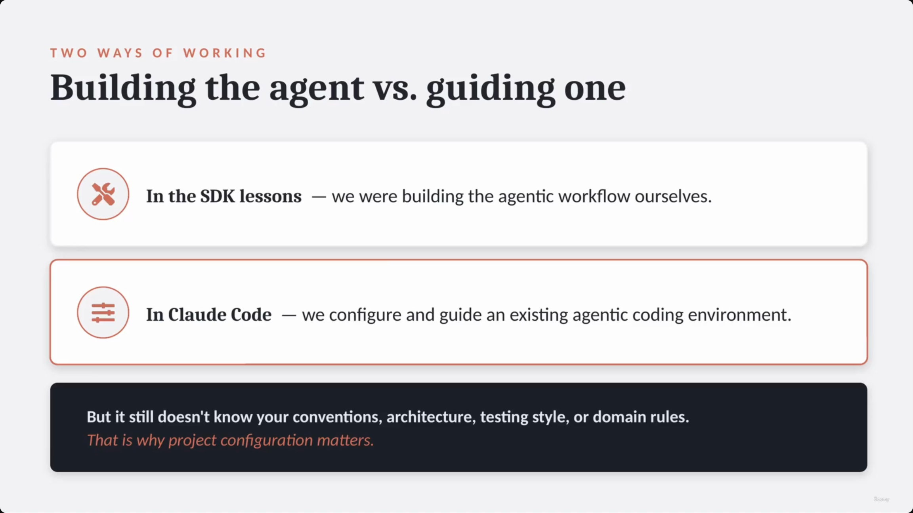

---

## 1. Claude Code: building the agent vs. guiding one

- Claude Code is an **agentic coding assistant that runs in the terminal**:
  - Can read files and edit code
  - Can run commands and inspect tests
  - Assists with multi-step development tasks
- **[The distinction]** Claude Code and the Agent SDK sit at different layers of the same idea:
  - **With the SDK** — *you* build the application layer: define the tools yourself, store & resend conversation history, read files & fetch external context, validate tool inputs, connect Claude to backend systems.
  - **With Claude Code** — the agentic capabilities are already built into the product: it works across a whole project, inspects files, runs terminal commands, keeps session context, and uses built-in & connected tools.

| Feature | With the SDK | Claude Code |
|---|---|---|
| Core approach | You build the application layer | Agentic capabilities built into the product |
| Responsibilities | Define tools yourself · store & resend conversation history · read files & fetch external context · validate tool inputs · connect Claude to backend systems | Works across a whole project · inspects files · runs terminal commands · keeps session context · uses built-in & connected tools |

> **Transcript color:** "So in the SDK lessons, we were building the agent workflow ourselves. In Claude Code, we are configuring and guiding an existing agent coding environment."

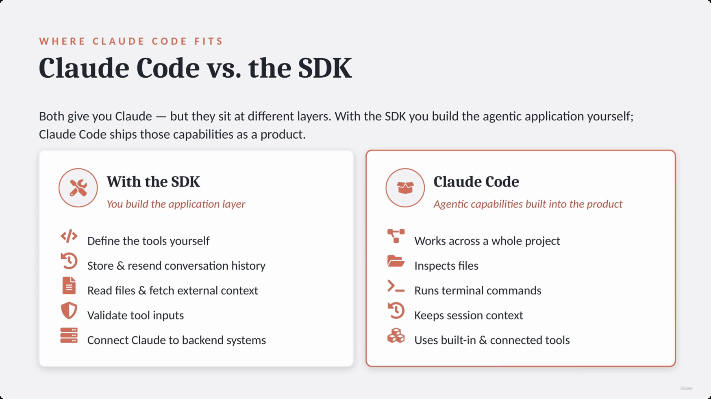

---

## 2. The problem: Claude Code doesn't know your project — yet

- **[The Problem]** Claude Code is a general agent and does not automatically know project-specific details:
  - Coding standards
  - Testing conventions
  - Claude API patterns
  - Support-domain rules
- **[The Solution]** Project configuration provides **"durable context"** — this is more efficient than repeating the same instructions in every individual prompt.

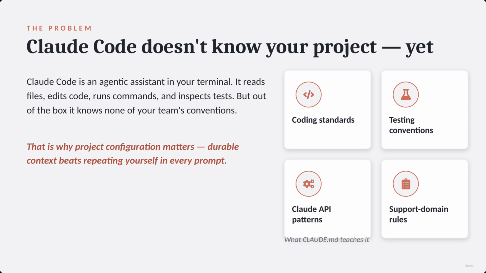

---

## 3. Installing and launching Claude Code

**Installation workflow:**

1. **Install** — Node.js first, then the CLI globally via npm.
2. **Launch** — from your project folder, start the assistant.
3. **Log in** — the first run prompts a one-time authentication.

```bash
npm install -g @anthropic-ai/claude-code
```

```bash
cd shopassist
claude
```

> **[Authentication]** The first time the `claude` command is run, Claude Code will prompt for a one-time login.

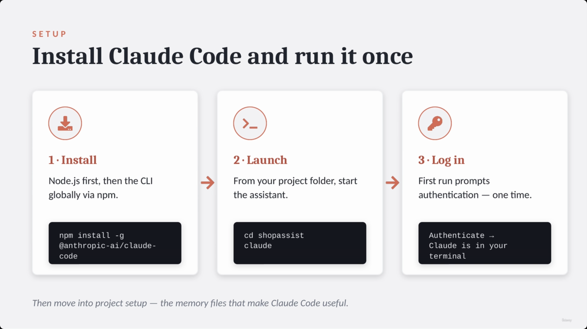

### What launching Claude Code actually looks like

**[Slide detail]** — this is a real captured terminal session (VS Code, project `ShopAssistAI`), not a slide mock-up. It shows details not mentioned anywhere in the transcript or slide-note bullets:

- Running **Claude Code v2.1.201**, greeting "Welcome back Anton!"
- A "Tips for getting started" panel suggesting `/init` to create a `CLAUDE.md` file
- A "What's new" changelog mentioning Claude Sonnet 5 session behavior, `AskUserQuestion` dialog changes, and a default permission-mode change to "Manual"
- A "Fable 5 is back" usage-limit notice
- Status bar showing `high · /effort`, `Claude Pro`, and an (blurred) organization name

None of this changelog/UI detail is part of the taught material — it's just what the live product looked like at capture time — so it's included here only as color, not as exam-relevant content.

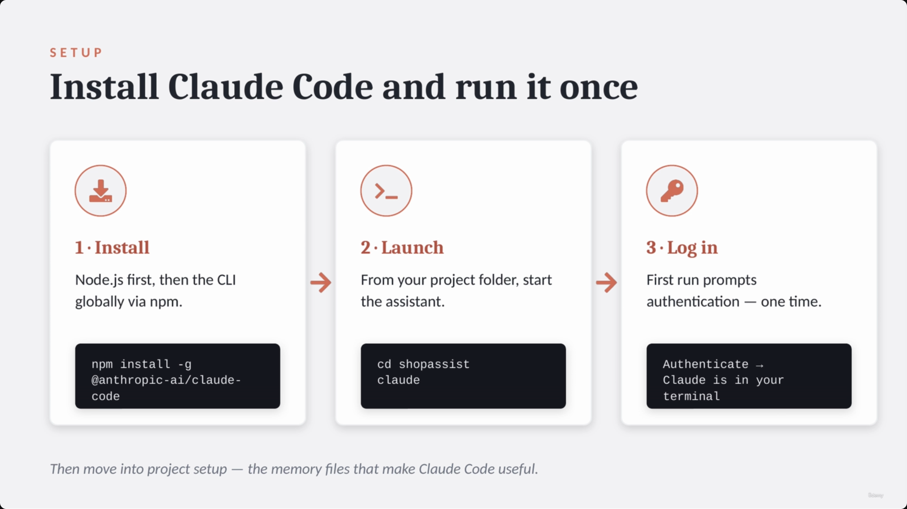

---

## 4. `CLAUDE.md` — the core memory file, and the `/init` shortcut

- **The role of `CLAUDE.md`:**
  - Acts as the most important project memory file
  - Tells Claude Code how to operate specifically within a given repository
- **The `/init` shortcut:**
  - Running `/init` triggers Claude Code to scan the project and generate an initial `CLAUDE.md` file
  - The generated file typically includes: project structure, common commands, dependencies, development patterns
  - **[Note]** `/init` is only a starting point — edit the file by hand afterward to make it genuinely useful for a team

```
~/shopassist $ /init

• Scanning project…
• Detected: Python 3.12, pytest, ruff
• Writing CLAUDE.md

Created CLAUDE.md with:
  - project structure
  - common commands
  - dependencies
  - development patterns
```

> **Transcript color:** "Claude Code scans the project and creates an initial Claude.md file. That generated file usually includes project structure, common commands, dependencies, and development patterns. But `/init` is only the starting point. After that, we should edit the Claude.md file manually and make it useful for the team."

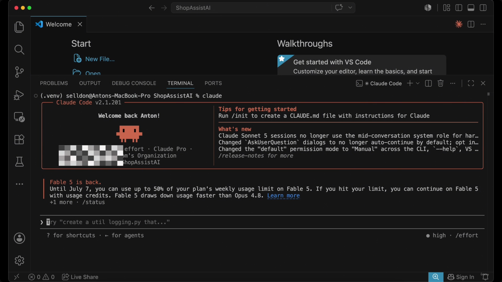

---

## 5. A useful `CLAUDE.md` for ShopAssist: four sections

A useful `CLAUDE.md` gives Claude real, specific context across four areas:

| Section | Examples of context provided |
|---|---|
| **Project Conventions** | Python 3.12 · keep business logic outside route handlers · typed service-layer functions · Pydantic models for structured request/response data · never hardcode API keys, customer data, or order data |
| **Common Commands** | Tests: `pytest` · Format: `ruff format` · Lint: `ruff check` |
| **Claude API Patterns** | Use structured outputs when extracting return-request data · treat model output as untrusted until validated · retry only when the output is structurally fixable · route low-confidence cases to humans |
| **Support Domain Rules** | Missing order ID ≠ system error · damaged items need evidence · billing disputes routed separately · exceptions need human review |

> **[The value of project memory]** Providing this context means you no longer have to repeat the same instructions in every individual prompt.

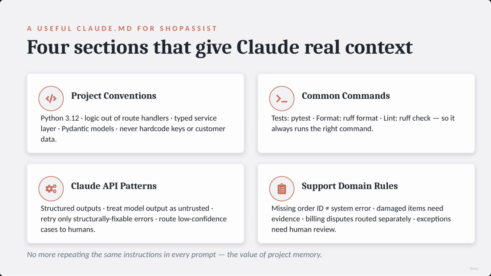

### Aside: a real repository's `CLAUDE.md` looks different

**[Slide detail]** — a separate real editor capture (also VS Code, `ShopAssistAI` project) shows an *actual* `CLAUDE.md` from the working repository behind this course, and it doesn't follow the four-section template above at all. It opens with:

```markdown
# CLAUDE.md

This file provides guidance to Claude Code (claude.ai/code) when working with
code in this repository.

## What this is

A hands-on learning project that builds up **ShopAssist AI**, a fictional
e-commerce customer-support agent, using the Anthropic Claude API. The
material is a sequence of numbered Jupyter notebooks (`01_*` → `13_*`), each
introducing one capability and layering it onto the same ShopAssist domain.
It is a teaching codebase, not a deployable application — there is no package
manifest, test suite, or entrypoint beyond the notebooks and one standalone
MCP server.

## Setup & running

- Python 3.12 with a local virtualenv at `.venv/`. Run notebooks/scripts with
  `.venv/bin/python` and `.venv/bin/jupyter`.
- `.env` holds `ANTHROPIC_API_KEY`. Every notebook calls `load_dotenv()` then
  `Anthropic()` (the client reads the key from the environment) — so any code
  you add must keep the key in `.env`, never inline.
- Key installed packages: `anthropic` (0.111), `mcp` (1.28, the FastMCP
  server SDK), `python-dotenv`, `jupyter`...
```

Neither the transcript nor the slide-note bullets mention this file — it's a candid, unremarked glimpse of the instructor's own working repo (numbered notebooks `01_first_request.ipynb` → `13_shopassist_agent...`, a `.claude/settings.local.json`, `.env`, `.venv/`) rather than the idealized "four sections" example that follows immediately after it. It's included here as an interesting real-world contrast: a genuine `CLAUDE.md` for a *teaching* codebase describes what the codebase *is*, while the idealized ShopAssist AI example (below) describes team *conventions* for a production-style codebase — both are legitimate uses of the same file.

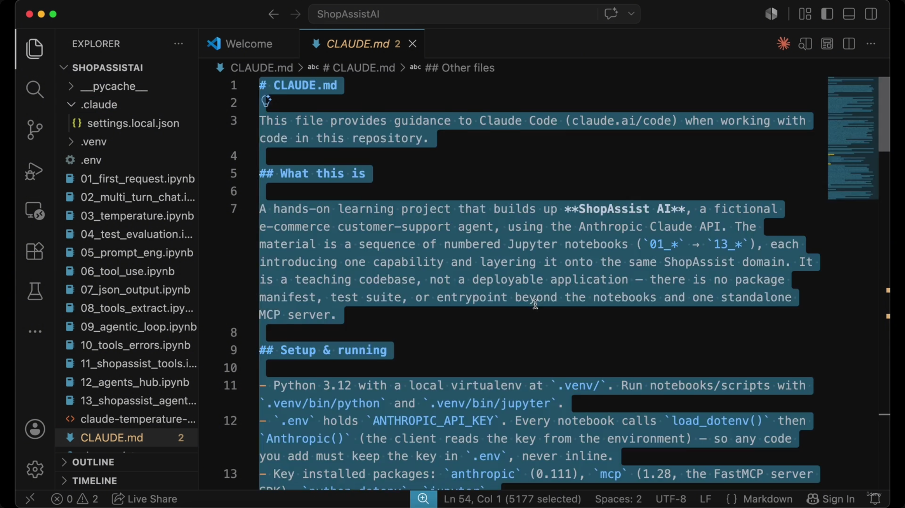

### The idealized example, as actual file content

A second real-editor capture shows the four-section example itself, open as `CLAUDE.md`:

```markdown
# ShopAssist AI

ShopAssist is a customer support assistant for ecommerce return requests.

## Project Conventions

- Use Python 3.12.
- Keep business logic outside route handlers.
- Use typed functions for service-layer code.
- Use Pydantic models for structured request and response data.
- Do not hardcode API keys, customer data, or order data.

## Common Commands

- Run tests with: `pytest`
- Run formatting with: `ruff format`
- Run linting with: `ruff check`

## Claude API Patterns

- Use structured outputs when extracting return request data.
- Treat model output as untrusted until validated.
- Retry only when the output is structurally fixable.
- [continues with Support Domain Rules...]
```

> **Transcript color:** "Now Claude Code has much better context. If we ask it to add a validation rule, it knows we use Pydantic. If we ask it to update extraction logic, it knows output still needs validation. If we ask it to add tests, it knows we use pytest. This is the main value of project memory."

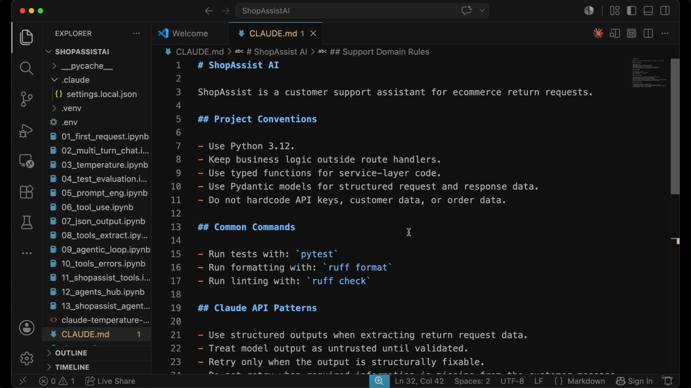

---

## 6. Memory hierarchy: three levels of memory

Claude Code supports different levels of memory to organize instructions by scope:

| Memory level | Location / file | Purpose |
|---|---|---|
| **User-level** | `~/.claude/CLAUDE.md` | Personal preferences across all projects; **not shared** with the team |
| **Project-level** | `CLAUDE.md` (or `.claude/CLAUDE.md`) | Shared instructions that belong in version control, for the entire team |
| **Directory-level** | `shopassist/api/CLAUDE.md` | Scoped rules for a specific subfolder (e.g., API-specific rules) |

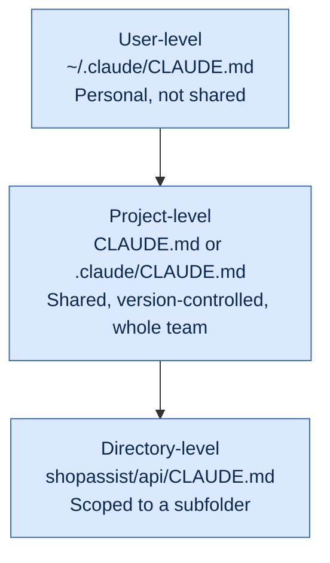

**User-level memory:**
- Used for personal workflow preferences, e.g. preferring concise answers, inspecting nearby files first, running relevant tests automatically.
- **[Key distinction]** Private — not shared with other team members.

```
# Personal Preferences
- Prefer concise answers
- Inspect nearby files first
- Run relevant tests
```

**Project-level memory:**
- Contains instructions every engineer on the project should follow.
- Managed via `CLAUDE.md` in the repository root, or a `.claude/` folder.
- Ensures consistent application of project conventions, common commands, and Claude API patterns.

```
# ShopAssist AI
## Conventions
## Commands
## API Patterns
```

**Directory-level memory:**
- Allows highly specific, scoped rules for one part of the codebase.
- Example: `shopassist/api/CLAUDE.md` might say "Keep handlers thin," "Validate before services."

```
# API Layer Rules
- Keep handlers thin
- Validate before services
- No prompts in handlers
```

> **Transcript color:** "User-level memory is for personal workflow preferences. Project-level memory is for shared instructions that belong in version control... Claude Code can also use more specific memory files in subdirectories... not every rule belongs everywhere. API files need API rules. Test files need test rules."

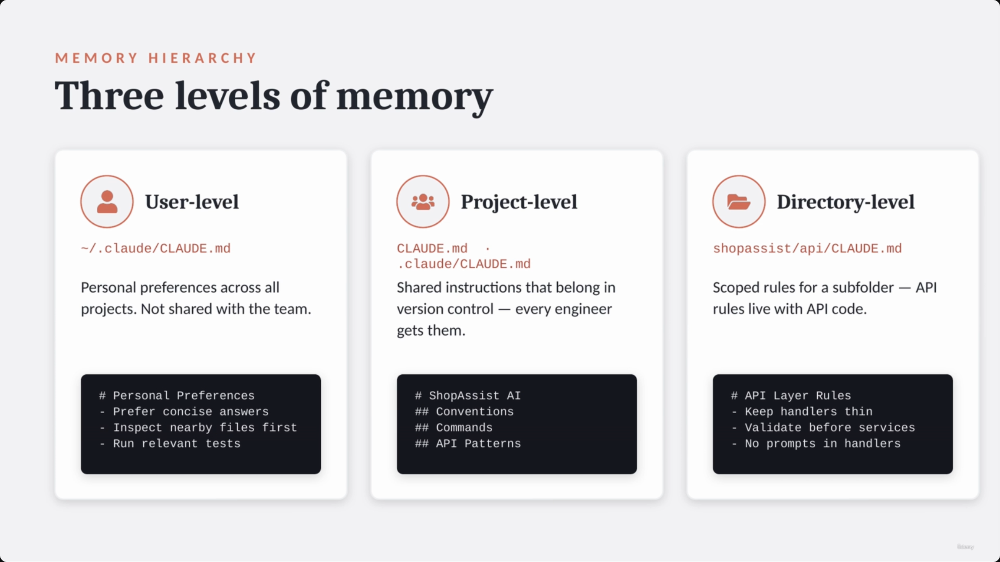

> **Note on ordering:** this "Three levels of memory" screenshot is timestamped between the two `CLAUDE.md`-content captures above (00:02:54 → 00:03:01) in the raw capture, and the original slide note filed it under "Configuring Project Memory with CLAUDE.md." It's placed here instead, under its own Memory Hierarchy heading, because that's what the slide itself is actually about — the capture simply landed slightly ahead of the section transition.

---

## 7. Scaling large projects: `@-imports`

- **[Managing complexity]** As a project grows, a single `CLAUDE.md` file can become difficult to maintain and review.
- **Organizing with `@-imports`:**
  - Split instructions into focused, topic-specific files.
  - Pull those files into the main `CLAUDE.md` using `@-imports` syntax.
  - **Benefits:** the main file stays short and readable; detailed context lives in specific topic files; each file is easier to review and edit.

```markdown
# ShopAssist AI

@docs/claude/coding-standards.md
@docs/claude/testing.md
@docs/claude/claude-api-patterns.md
@docs/claude/support-domain-rules.md

# main file stays short —
# full context still loaded
```

> **Transcript color:** "For larger projects, one big Claude.md becomes hard to maintain. In that case, we can organize memory with imports... This keeps the main Claude.md file short while still giving Claude Code detailed project context."

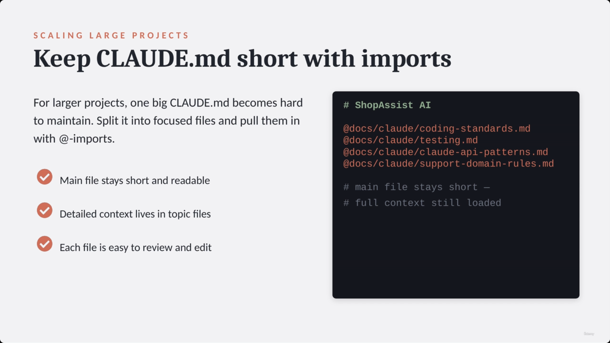

---

## 8. Path-scoped rules with YAML frontmatter

- **[The Problem]** When related files (API routes, controllers, handlers) are spread across different directories, a single directory-level `CLAUDE.md` isn't sufficient or easy to maintain.
- **[The Solution]** Use a centralized rules directory (`.claude/rules/`) and target files via glob patterns declared in YAML frontmatter at the top of each rule file.

**[Factual correction]** The slide-note's own markdown rendering of this example dropped the YAML list-item dashes and the `---` frontmatter delimiters (rendering it as bare `paths:` lines). The actual screenshot shows correct YAML frontmatter syntax — that version is reproduced below as authoritative:

`.claude/rules/api.md`:
```yaml
---
paths:
  - "shopassist/routes/**/*.py"
  - "shopassist/controllers/**/*.py"
---
# API Rules
- Keep handlers thin
- Validate input first
- Return typed responses
- No prompt templates in routes
```

`.claude/rules/tests.md`:
```yaml
---
paths:
  - "tests/**/*.py"
---
# Test Rules
- Use pytest
- Test valid & invalid output
- Semantic, not only schema
- Name tests by scenario
```

> **Transcript color:** "A team may organize these under a rules directory... An API rule file can use YAML frontmatter to describe which files it applies to. And a test rule can target test files."

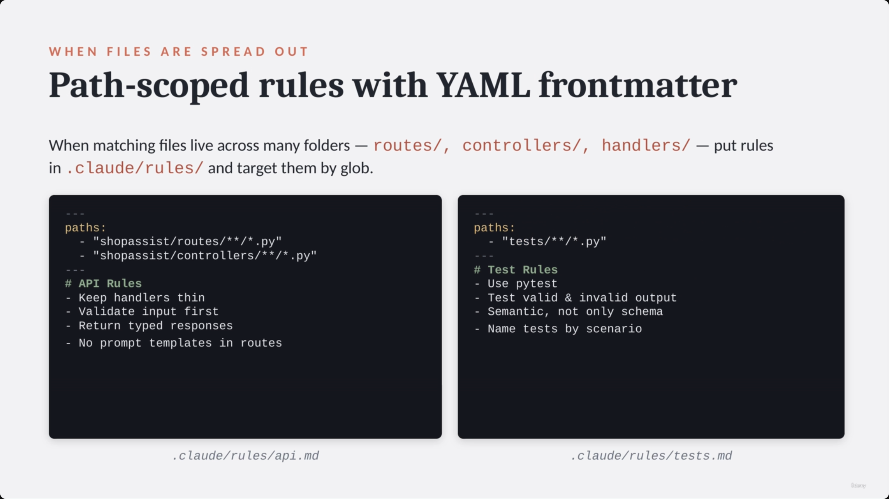

---

## 9. Choosing a scoping strategy: directory `CLAUDE.md` vs. path-scoped rules

| Strategy | When to use | Example |
|---|---|---|
| **Subdirectory `CLAUDE.md`** | When all files in a specific folder share the same rules | `tests/CLAUDE.md` → `# Test Rules` / Use pytest / Realistic customer messages / Cover edge cases |
| **Path-scoped rules** | When matching files are spread across multiple different folders | `.claude/rules/api.md` → `paths: routes/** · controllers/** · handlers/**` → one glob, many folders |

> **Transcript color:** "Use a subdirectory Claude.md file when all files in that folder share the same rules. Use path-specific rules when matching files are spread across multiple folders."

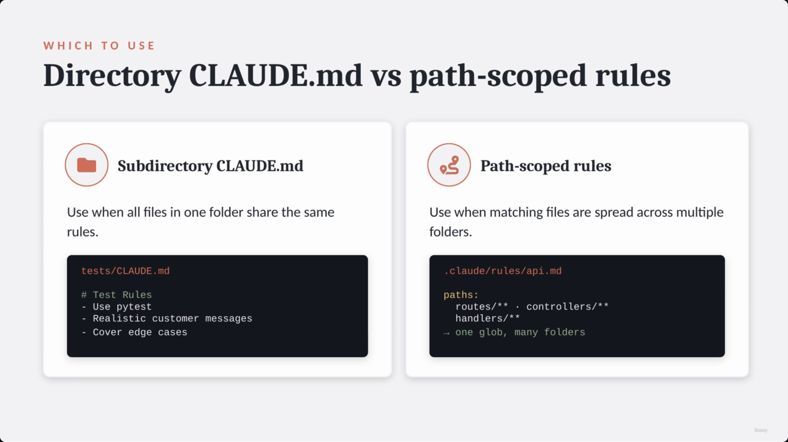

---

## 10. Memory management commands: `#` and `/memory`

- **Quick add with `#`:**
  - Saves a new convention the moment you discover it.
  - Claude Code prompts you to specify where to store that memory.
  - Example: `# Always run pytest before committing` → saved to memory.
- **Inspect with `/memory`:**
  - See and manage which memory files are currently loaded.
  - **[Debugging utility]** The first thing to check if Claude Code is misbehaving:
    - Using the wrong test command? Check memory.
    - Following an old architecture pattern? Check memory.
    - Ignoring a domain rule? Check whether that rule is actually loaded.

```
# Always run pytest
#   before committing

→ saved to memory
```

> **Transcript color:** "If Claude Code keeps using the wrong test command, check memory. If it follows an old architecture pattern, check memory. If it ignores a domain rule, check whether that rule is actually loaded."

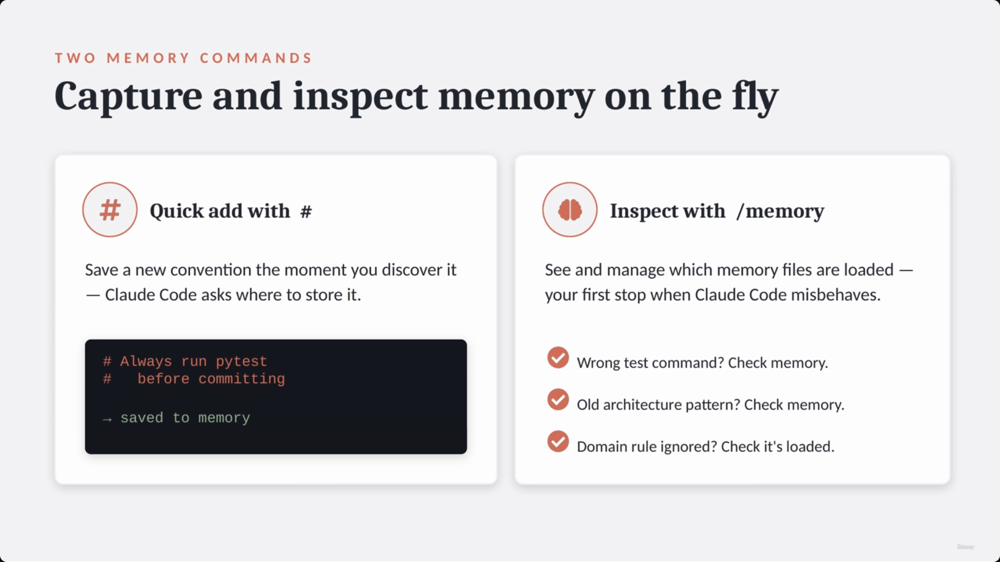

---

## 11. Putting it together: the ShopAssist setup workflow

1. **Initial setup** — install, launch, `/init` (generates the starter `CLAUDE.md`).
2. **Defining context** — edit `CLAUDE.md` to add coding, testing, API & support rules; add scoped memory for specific areas (API or test files) via directory-level or path-scoped rules.
3. **Iterate and refine** — `/memory` to inspect what Claude Code actually loaded; `#` to quickly save new conventions discovered during a session.

```bash
npm install -g @anthropic-ai/claude-code
cd shopassist
claude
/init

# then, in the repo:
edit CLAUDE.md
add api/ & tests/ memory
/memory   # inspect

#  save new rules live
```

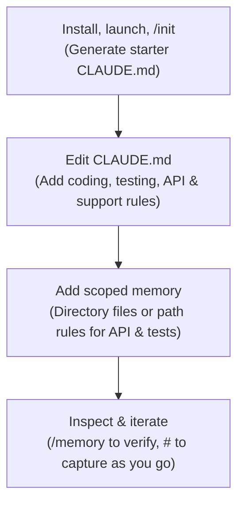

> **Transcript color:** "The key idea is this: Claude Code works best when it has durable project context. A good Claude.md file turns Claude Code from a generic coding assistant into a project-aware teammate. It knows how the repository is structured, which commands to run, which patterns to follow — and for ShopAssist, it knows that AI output must be validated, retried carefully, and routed to humans when confidence is low, or the customer message is contradictory."

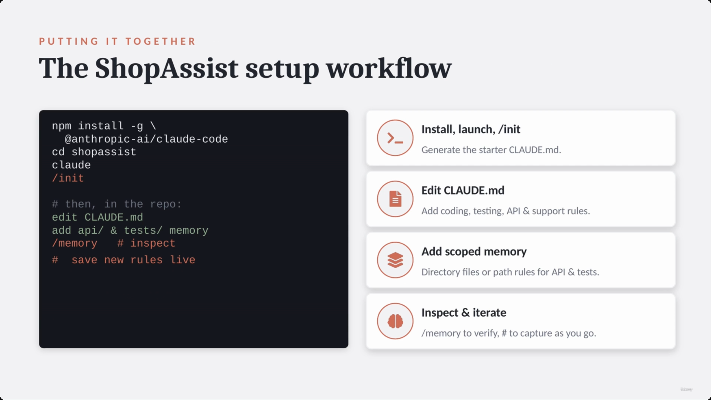

---

## Summary

- **Claude Code vs. the SDK** — the SDK is for building the agent workflow yourself; Claude Code ships agentic capabilities as a product you configure and guide.
- **`CLAUDE.md`** is Claude Code's core project-memory file. `/init` generates a starting point by scanning the repo; it must be hand-edited afterward to be genuinely useful.
- **A good `CLAUDE.md`** covers four areas for ShopAssist: project conventions, common commands, Claude API patterns, and support-domain rules.
- **Three memory levels**, in ascending scope-narrowness: user-level (`~/.claude/CLAUDE.md`, private), project-level (`CLAUDE.md`, shared/version-controlled), directory-level (e.g. `shopassist/api/CLAUDE.md`, scoped to a subfolder).
- **`@-imports`** keep a large `CLAUDE.md` short by pulling in topic-specific files.
- **Path-scoped rules** (`.claude/rules/*.md` with YAML `paths:` frontmatter) handle the case where related files are spread across multiple directories — use a subdirectory `CLAUDE.md` when one folder shares all the same rules, path-scoped rules when they don't.
- **`#`** quickly captures a new convention into memory; **`/memory`** inspects what's actually loaded — the first debugging step when Claude Code misbehaves.

**Exam framing to remember:** `CLAUDE.md` and its scoped variants are what turn Claude Code from a generic coding agent into a project-aware teammate — durable context beats repeating instructions in every prompt.

---

## In Plain English

Here's the whole file in plain, everyday language:

**The big picture:** this lecture switches gears completely — instead of building ShopAssist's API, it's about setting up Claude Code (the terminal coding assistant) so it actually understands YOUR specific project instead of behaving like a generic helper every single time.

**1. Two different things — don't confuse them**
With the Agent SDK, YOU build the whole agent yourself (tools, memory, everything). With Claude Code, the agent already exists as a product — your job is just to configure and guide it.

**2. The core problem**
Claude Code doesn't automatically know your team's coding style, your testing setup, or your project's specific business rules — you have to tell it, and repeating that in every single chat is wasteful.

**3. The fix — a `CLAUDE.md` file**
One file at the root of your project that Claude Code reads and remembers, describing things like coding conventions, common test/lint commands, and your project's specific do's-and-don'ts. Running `/init` auto-generates a starting draft by scanning your codebase — but you still need to edit it by hand to make it genuinely useful.

**4. Memory has different "levels," like nested folders**
Personal preferences that are just for you (never shared with the team), project-wide rules everyone on the team follows (checked into version control), and even more specific rules for just one subfolder (like "API code has these extra rules").

**5. For big projects, split the file up**
Instead of one giant `CLAUDE.md`, break instructions into separate topic files (coding standards, testing, API patterns) and pull them all into the main file with a simple import line — keeps things organized and easy to review.

**6. Even more precise targeting**
You can write a rule file that only applies to files matching a specific pattern (like "everything under `routes/` and `controllers/`") no matter which folders they're actually scattered across.

**7. Two handy commands**
Typing `#` followed by a note instantly saves a new rule to memory as you discover it; `/memory` lets you see exactly what rules are currently loaded — which is the very first thing to check if Claude Code starts behaving oddly or ignoring a rule you thought you'd set.

**One-sentence summary:** A well-written `CLAUDE.md` file (plus its more targeted variants) turns Claude Code from a generic assistant into one that actually knows your project's conventions, commands, and rules — so you stop repeating yourself in every single prompt.

---

## Full Walkthrough: One Request, Traced Before and After `CLAUDE.md`

Everything above can feel abstract until you watch **one single developer request** go through Claude Code twice — once before any project memory exists, once after. Same tool, same words, same terminal. We'll use the request the lecture itself points at:

> "Add a validation rule so a refund amount can never be negative."

The whole idea in plain words:

```
same request → Claude Code with no project memory guesses → Claude Code with a good CLAUDE.md follows convention
```

---

### Step 1 — Ask cold, before any `CLAUDE.md` exists

A brand-new ShopAssist checkout: `cd shopassist && claude`, no `/init` run yet, no `CLAUDE.md` anywhere in the repo. The developer types the request straight away:

> "Add a validation rule so a refund amount can never be negative."

Claude Code can still read the files in front of it, but it has no durable context about *this* project's conventions. It doesn't know:
- whether this codebase validates with Pydantic models or plain `if` checks
- whether validation logic belongs in the route handler, the service layer, or somewhere else
- whether there's a test command it should run afterward, or a testing framework at all

So it has to guess, or stop and ask. This is exactly the gap called out earlier in this file: **[The Problem]** Claude Code is a general agent and does not automatically know project-specific details — coding standards, testing conventions, Claude API patterns, support-domain rules. Without a `CLAUDE.md`, that gap shows up on the very first non-trivial request.

---

### Step 2 — Run `/init` to generate a starting point

Instead of guessing forever, the developer runs `/init`. This is the real captured output from earlier in this file, reproduced exactly:

```
~/shopassist $ /init

• Scanning project…
• Detected: Python 3.12, pytest, ruff
• Writing CLAUDE.md

Created CLAUDE.md with:
  - project structure
  - common commands
  - dependencies
  - development patterns
```

`/init` did the scanning work — it found the language version, the test runner, and the linter on its own. But as the transcript itself warns, `/init` is only the starting point: "After that, we should edit the Claude.md file manually and make it useful for the team." The generated file is a draft, not a finished set of team conventions — it doesn't yet know that this project uses Pydantic, or how it wants AI output treated, or how support cases get routed.

---

### Step 3 — Hand-edit the generated file into the real four-section template

The developer now fills in the four sections this file lays out for ShopAssist, using the actual template content:

```markdown
# ShopAssist AI

ShopAssist is a customer support assistant for ecommerce return requests.

## Project Conventions

- Use Python 3.12.
- Keep business logic outside route handlers.
- Use typed functions for service-layer code.
- Use Pydantic models for structured request and response data.
- Do not hardcode API keys, customer data, or order data.

## Common Commands

- Run tests with: `pytest`
- Run formatting with: `ruff format`
- Run linting with: `ruff check`

## Claude API Patterns

- Use structured outputs when extracting return request data.
- Treat model output as untrusted until validated.
- Retry only when the output is structurally fixable.
- [continues with Support Domain Rules...]
```

This is the moment the file's own transcript color describes directly — and it names our exact scenario:

> "Now Claude Code has much better context. If we ask it to add a validation rule, it knows we use Pydantic. If we ask it to update extraction logic, it knows output still needs validation. If we ask it to add tests, it knows we use pytest. This is the main value of project memory."

---

### Step 4 — Ask the SAME request again, now with `CLAUDE.md` in place

The developer types the identical sentence into the identical tool:

> "Add a validation rule so a refund amount can never be negative."

Nothing about Claude Code changed between Step 1 and now. What changed is that this `CLAUDE.md` is loaded as durable context before the request is even read. Walking through how each section shapes the answer:

- **From Project Conventions** — "Use Pydantic models for structured request and response data" — Claude Code knows the new rule should live as a Pydantic validator (e.g. a field or model validator that rejects a negative amount), not a stray `if` statement dropped into a handler.
- **From Project Conventions** — "Keep business logic outside route handlers" — it knows *where* to put that validator: the service layer or the Pydantic model itself, not inline in the route.
- **From Claude API Patterns** — "Treat model output as untrusted until validated" — it knows this new check is exactly the kind of thing that pattern calls for: even if a refund amount comes from a model's extracted output, it still has to pass through validation before anything acts on it.
- **From Common Commands** — "Run tests with: `pytest`" — it knows to write a pytest test for the new rule, and which command to run to confirm it passes.

The developer never had to say "use Pydantic," "put it in the service layer," "validate model output," or "write a pytest test" — the `CLAUDE.md` already said all of that once, and it now applies to every request, including this one.

---

### Step 5 — Scope it even further, without touching the main file

Say the team wants one more rule that applies *only* to the API layer where this refund validation actually lands — without cluttering the main `CLAUDE.md` that every part of the project reads. Two ways to do that, both already shown in this file:

**A directory-level file**, `shopassist/api/CLAUDE.md`, scoped just to that subfolder:

```
# API Layer Rules
- Keep handlers thin
- Validate before services
- No prompts in handlers
```

**Or, if the relevant files aren't all in one folder** — say route files and controller files that both need this refund-amount rule but live in different directories — a path-scoped rule instead, `.claude/rules/api.md`, using the file's own YAML frontmatter example:

```yaml
---
paths:
  - "shopassist/routes/**/*.py"
  - "shopassist/controllers/**/*.py"
---
# API Rules
- Keep handlers thin
- Validate input first
- Return typed responses
- No prompt templates in routes
```

Either one adds "validate input first" as a rule that only fires when Claude Code is touching a matching file — the main `CLAUDE.md` stays short, and the refund-validation change still gets the extra scrutiny this specific area needs.

---

### Debugging aside — what if the new rule doesn't seem to be taking effect?

Say the developer adds that directory-level rule, asks for the refund-validation change again, and it still doesn't look like handlers are staying thin. Before assuming Claude Code is ignoring the instruction, the first move is `/memory` — exactly as this file frames it: **[Debugging utility]** the first thing to check if Claude Code is misbehaving. Is it using the wrong test command? Check memory. Following an old pattern? Check memory. Ignoring a domain rule? Check whether that rule is actually loaded. `/memory` shows which files are currently loaded — often the fix is as simple as noticing the new `shopassist/api/CLAUDE.md` was saved in the wrong folder.

---

### The whole journey, end to end (our refund-validation example)

1. Developer asks Claude Code, cold: "Add a validation rule so a refund amount can never be negative." No `CLAUDE.md` exists — Claude Code has to guess at conventions or ask.
2. Developer runs `/init` — Claude Code scans the project, detects Python 3.12/pytest/ruff, writes a starter `CLAUDE.md`.
3. Developer hand-edits that starter file into the real four-section template — Project Conventions, Common Commands, Claude API Patterns, Support Domain Rules.
4. Developer asks the exact same request again. This time Claude Code writes the check as a Pydantic validator, keeps it out of the route handler, treats it as part of the "model output is untrusted until validated" pattern, and adds a pytest test — all without being told any of that in the prompt.
5. A directory-level `shopassist/api/CLAUDE.md` (or a path-scoped `.claude/rules/api.md`) adds one more API-specific rule just for this area, without growing the main file.
6. If a rule ever seems ignored, `/memory` shows exactly what's loaded — the first debugging step, not a last resort.

**The one thing to hold onto:** the exact same request, typed into the exact same tool, produced a generic guess before configuration and a project-aware, convention-following change after — nothing about Claude Code itself changed in between. The only thing that changed was what it had been told about the project.

---

*Sources: [slide notes](../28-ClaudeCode-Project-Configuration-CLAUDE-Rules-And-Memory.md) · [[hover-notes-transcripts/28-ClaudeCode-Project-Configuration-CLAUDE-Rules-And-Memory (transcript)|full transcript]]*
