# Claude Code in CI/CD and Independent Review

> Lectures 28–30 covered Claude Code's project configuration (`CLAUDE.md`), session management, and workflows/commands/skills/plan mode — all from the point of view of a developer working interactively in the terminal. This lecture takes the same tool into a very different environment: an unattended CI/CD job. The core tension is that interactive Claude Code is built around a conversation, and a CI job cannot hold one. Everything below follows from that single constraint, through to the related principle of **independent review** — never asking the session that wrote the code to also grade it.

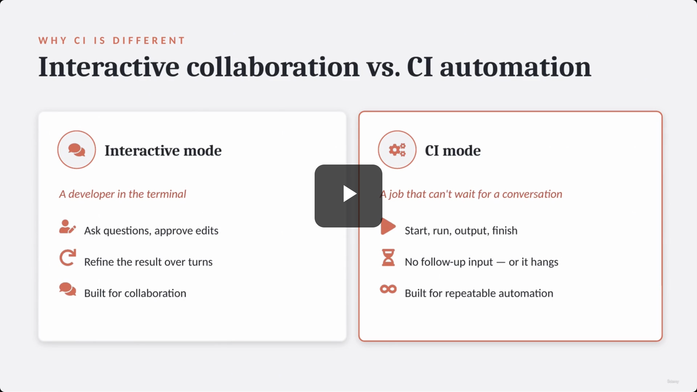

**[Note on the transcript]** The spoken transcript for this lecture consistently renders "Claude Code" as "Cloud Code" — a transcription artifact, not a product name. The slide-note's own prose bullets inherited the same mistake in one place (see the callout under Non-Interactive Execution below); the code examples on the actual slides are correct throughout (`claude -p`, `claude --print`).

---

## 1. Interactive mode vs. CI mode

| | Interactive mode | CI mode |
|---|---|---|
| Who/what drives it | A developer in the terminal | A job that can't wait for a conversation |
| Behavior | Ask questions, approve edits, refine over turns | Start, run, output, finish |
| Failure mode if misused | — | No follow-up input → **hangs** |
| Built for | Collaboration | Repeatable automation |

- Interactive mode is for developers in a terminal to ask questions, approve edits, and refine results through collaboration.
- CI mode is for automated jobs that must start, run, output, and finish without waiting for human conversation.
- **[Critical]** Using interactive mode in CI will cause the pipeline to hang, because it waits for follow-up input that never comes.

> **Transcript color:** "A CI job cannot wait for a conversation. It must start, run, produce output, and finish. That is why Cloud [Claude] Code supports non-interactive mode."

---

## 2. Non-Interactive Execution (Print Mode)

- To prevent hanging, use **print mode** so the process runs once and then exits.
- Command options: `claude -p` or `claude --print` (equivalent — the slide-note's own bullets typo these as `cloud -p` / `cloud --print`, but the screenshot's actual command block is correct: **`claude`**, not `cloud`).
- **Workflow of print mode:** Start → Run the prompt once → Print the result → Exit.

```bash
$ claude -p \
"Review this pull request for ShopAssist.
Focus on refund logic, escalation, messaging, security, and missing tests.
Return only structured findings."

# -> prints result, then exits
```

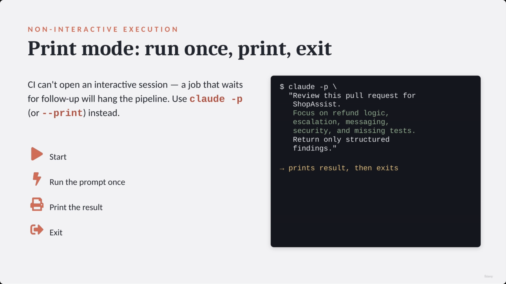

---

## 3. Machine-Readable Output

- **[Why use it?]** Plain text is fine for humans but **fragile for automation**. To post GitHub comments, create annotations, fail a build, or deduplicate findings, CI needs structured data.
- `--output-format json` — returns findings as JSON.
- `--json-schema <filename>.json` — enforces a strict, parseable shape for the output.

```bash
$ claude -p \
  --output-format json \
  --json-schema findings.json \
  "Review the pull request.
  Return an array of findings."

# -> machine-parseable output:
[
  { "severity": "high", ... },
  { "severity": "low", ... }
]
```

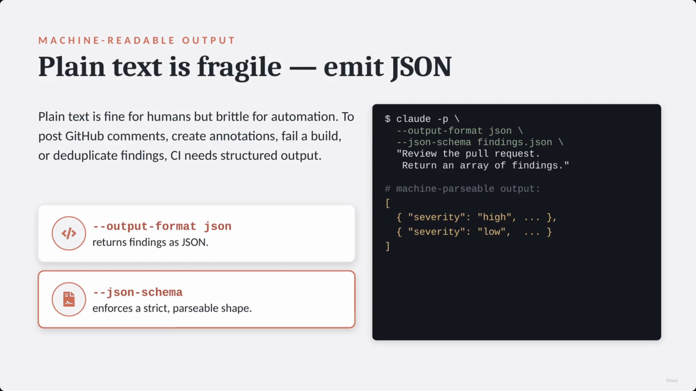

### The Finding Schema

Each finding in the JSON array should include:

| Field | Purpose |
|---|---|
| `file path` | Where the issue lives |
| `line number` | The exact location |
| `severity` | critical / high / med / low |
| `category` | Type of issue |
| `message` | What's wrong |
| `suggested fix` | How to resolve it |
| `fingerprint` | A stable identifier |

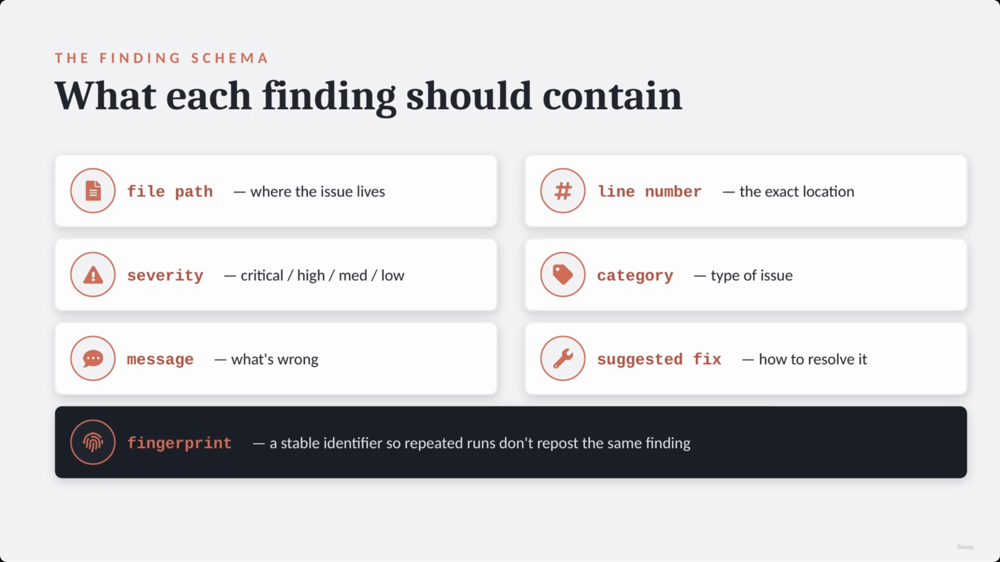

---

## 4. Deduplication with Stable Fingerprints

- **[Why]** CI runs more than once — a PR gets a new commit, a workflow gets re-run. Without a stable identifier, Claude might repost the same comment every time, making the PR noisy.
- A **fingerprint** is a hash built from attributes that stay stable across runs: file path, line number, category, normalized message.

```python
for each finding:
    fp = hash(path, line, category, msg)
    if fp in posted:
        skip
    else:
        post
```

| Scenario | Action | Result |
|---|---|---|
| Finding already posted | Skip it | No duplicate comment |
| New fingerprint detected | Post to the pull request | New finding is reported |

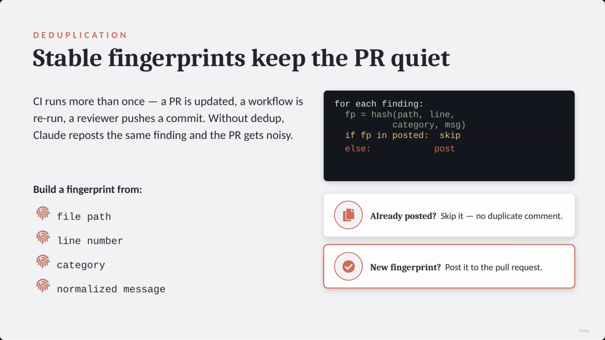

---

## 5. Providing Project Context to CI

- **[Why]** A review is only as good as its context — Claude Code must compare the PR against real project behavior rather than evaluating a diff in isolation.

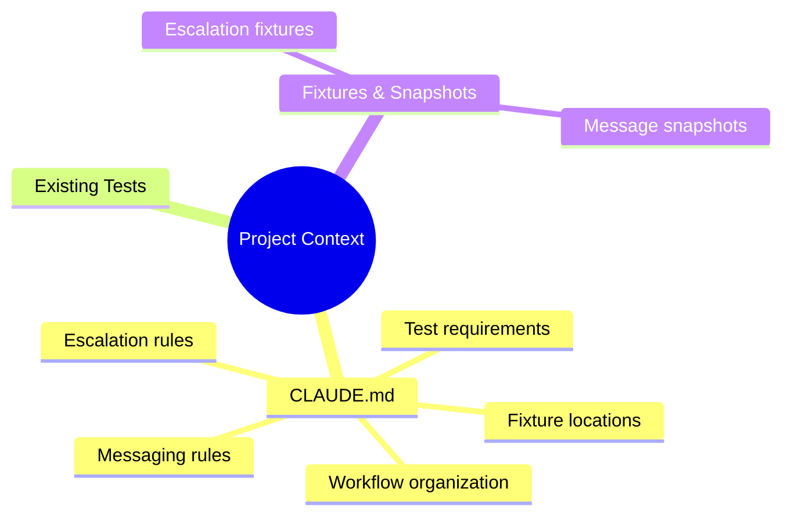

- **`CLAUDE.md`** — explains project-specific logic: how refund workflows are organized, where support fixtures live, which tests must run, what counts as an escalation, and customer-messaging rules.
- **Existing tests** — refund policy tests and escalation checks the PR must still satisfy.
- **Fixtures & snapshots** — escalation fixtures and customer-message snapshots to compare against.

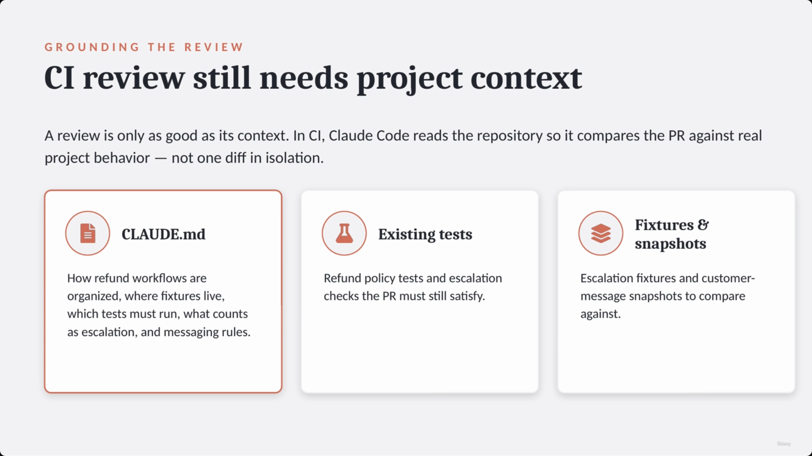

---

## 6. Blocking Checks vs. Non-Blocking Reports

Deciding how strict a CI review should be comes down to two modes:

| Mode | Timing/Action | Use case | Examples |
|---|---|---|---|
| **Blocking pre-merge** | Fails the check | High-confidence, critical issues | Security problems, broken tests, schema violations, missing required fixtures, dangerous production behavior |
| **Non-blocking reports** | Overnight or on demand | Informational, broader review | Code quality, missing edge cases, test suggestions, duplication, architecture concerns |

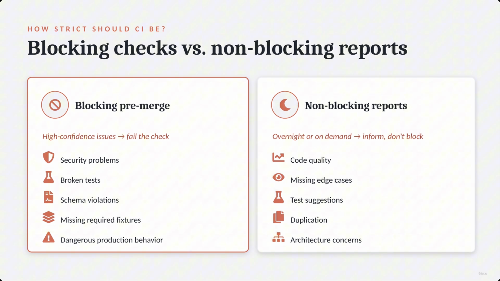

### The ShopAssist Pattern: routing findings by severity

Rather than blocking every PR, route findings by impact:

- **Critical & high severity** → **Block the merge** (fail the check) — these must be fixed first.
- **Medium & low severity** → **Post as PR comments** — inform reviewers without blocking the merge.
- **Broader review** → **Run overnight** — a deeper quality-and-architecture pass on a schedule.

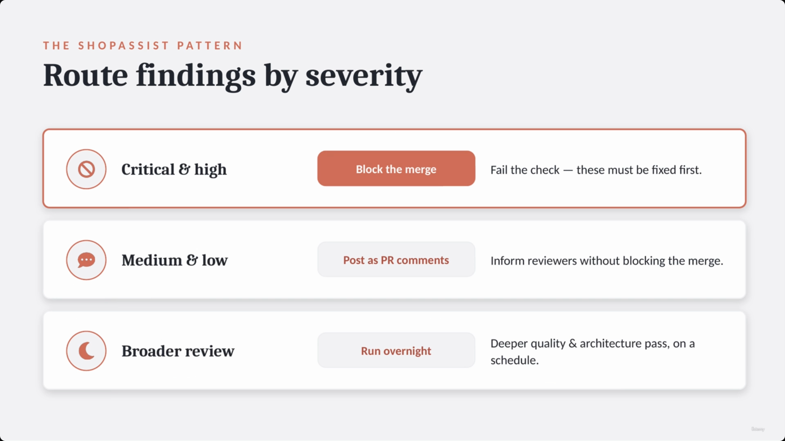

---

## 7. Independent Review

- **[The Problem]** The session that generated the code is not the best reviewer for it — the **Builder session** holds all the implementation context and intention, which can make review weaker by introducing bias.
- A **clean session** judges the result on its merits rather than the reasoning behind it. **[Slide detail]** the slide labels this principle explicitly as **"isolation"** between the builder and reviewer sessions.
- **The Reviewer run** should be a separate, clean invocation: it reads the repo, diff, `CLAUDE.md`, tests, and fixtures — but it is *not* part of the original build conversation.

**A fresh reviewer should ask:**
- Does the code actually do what it claims?
- Are tests missing?
- Did the implementation introduce a regression?
- Would this behavior be clear to another developer?

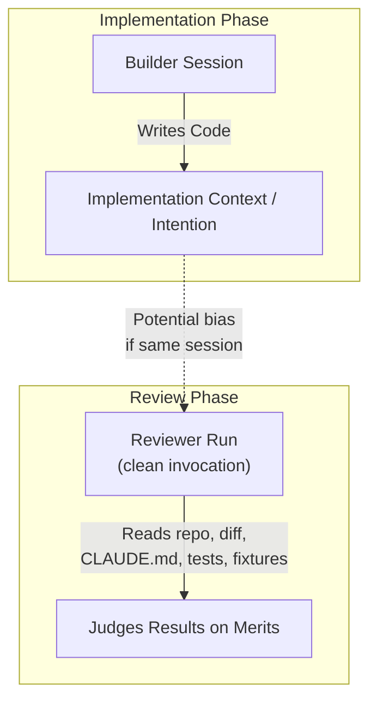

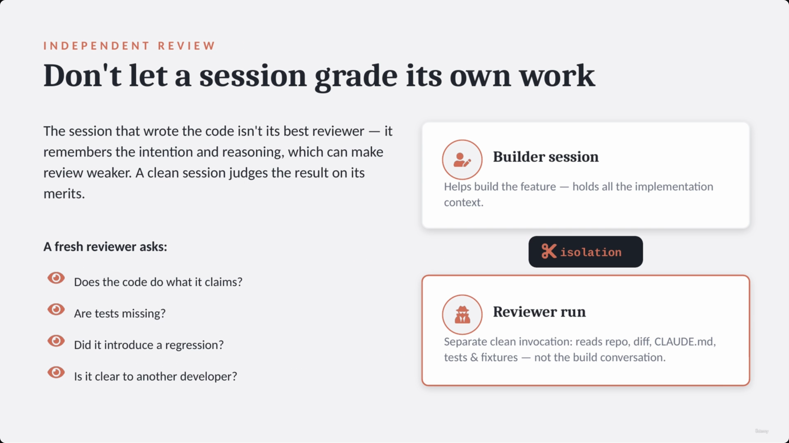

> **Transcript color:** "The same cloud [Claude] session that generated code is not always the best reviewer of that code... This gives us session isolation. One Claude session can help build the feature. A separate Claude Code run can review it independently."

This is the same underlying instinct as the multi-pass review architecture from lecture 18 — a single pass (or a single session) tends to miss its own blind spots, so a structurally separate check catches what self-review won't.

---

## 8. The ShopAssist PR Review Pipeline — putting it all together

```mermaid
flowchart LR
    step1["1. claude -p\nNon-interactive run"] --> step2["2. JSON output\nMachine-readable"]
    step2 --> step3["3. JSON schema\nConstrain the shape"]
    step3 --> step4["4. Structured findings\nNot prose"]
    step4 --> step5["5. Stable fingerprints\nIdentify each finding"]
    step5 --> step6["6. Skip duplicates\nQuiet PRs"]
    step6 --> step7["7. Post new findings\nTo the pull request"]
    step7 --> step8["8. Fail if serious\nBlock critical issues"]
```

1. **`claude -p`** — non-interactive run.
2. **JSON output** — machine-readable.
3. **JSON schema** — constrain the shape.
4. **Structured findings** — not prose.
5. **Stable fingerprints** — identify each finding.
6. **Skip duplicates** — keep PRs quiet.
7. **Post new findings** — to the pull request.
8. **Fail if serious** — block only critical issues.

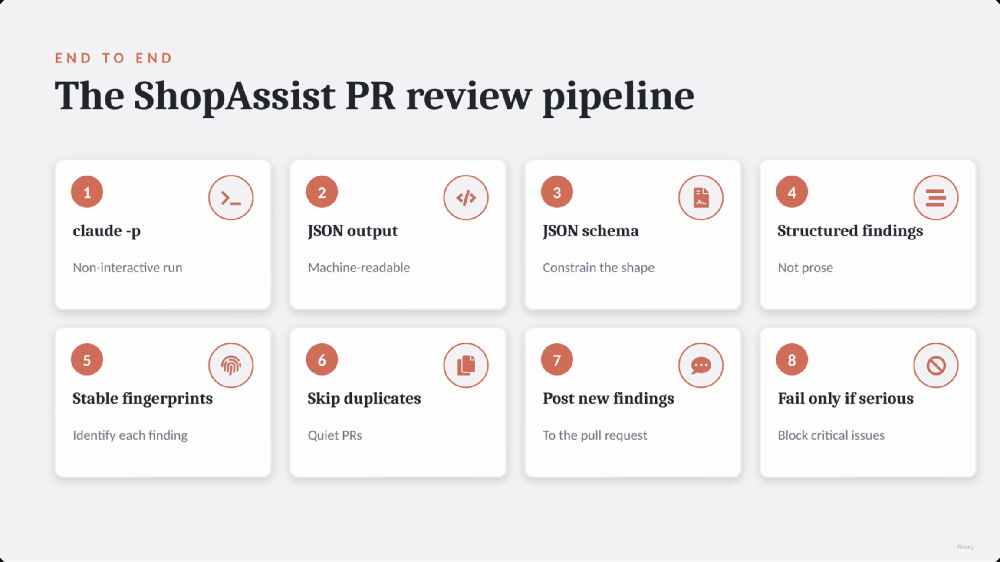

### End-to-end pipeline with a review gate

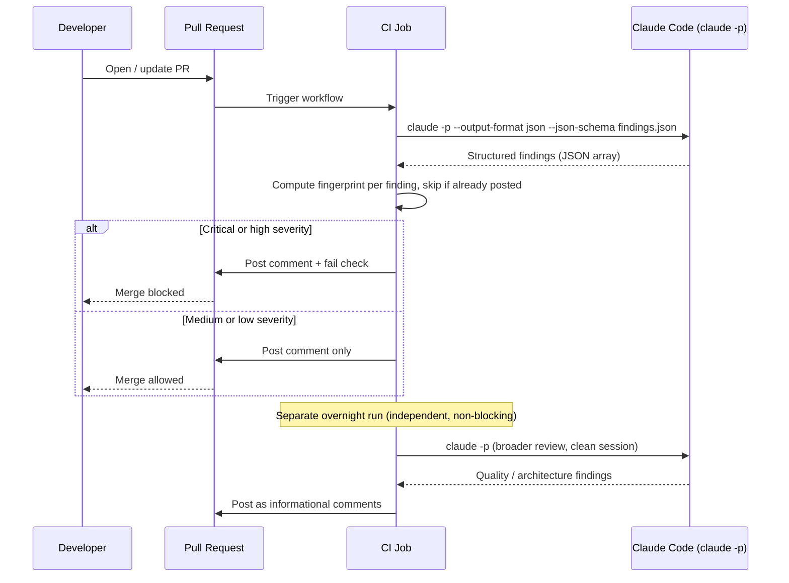

---

## 9. Interactive vs. CI Mode — the summary comparison

| Feature | Interactive Mode | CI Mode |
|---|---|---|
| Execution | Human-in-the-loop | Non-interactive (`claude -p` / `--print`) |
| Output | Natural language / prose | Structured JSON (constrained by schemas) |
| Context | Conversation-based | Project context (`CLAUDE.md`, tests, fixtures) |
| Review style | Collaborative | Independent review (separate, clean session) |
| Handling findings | Discussion | Automated (skip duplicates, fail on serious issues) |

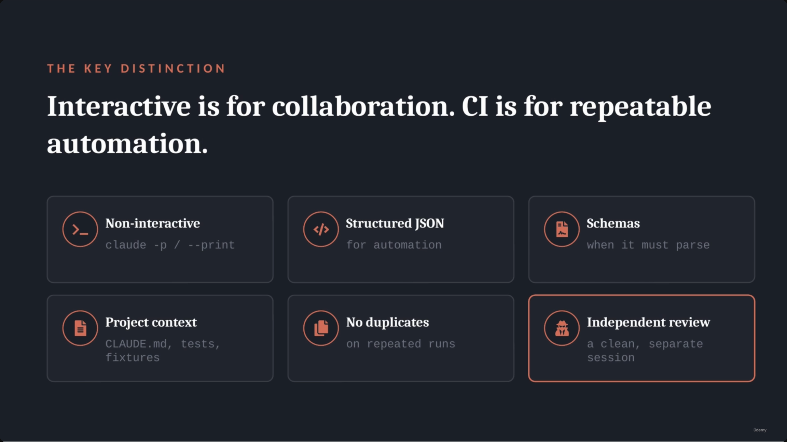

**[Slide detail]** The closing slide condenses the whole lecture into six tiles, the last of which is the independent-review principle itself: **Non-interactive** (`claude -p` / `--print`) · **Structured JSON** (for automation) · **Schemas** (when it must parse) · **Project context** (`CLAUDE.md`, tests, fixtures) · **No duplicates** (on repeated runs) · **Independent review** (a clean, separate session).

---

## Summary

- **Interactive vs. CI mode** — interactive Claude Code is built for a back-and-forth conversation; a CI job cannot hold one, so it must run non-interactively or it will hang.
- **Print mode** (`claude -p` / `claude --print`) — run once, print, exit. This is the only safe way to invoke Claude Code from a pipeline.
- **Structured output** — `--output-format json` plus `--json-schema` turn fragile prose into machine-parseable findings with a defined shape: file path, line number, severity, category, message, suggested fix, fingerprint.
- **Stable fingerprints** — hash path + line + category + normalized message so repeated CI runs don't repost the same finding.
- **Project context** — `CLAUDE.md`, existing tests, and fixtures/snapshots ground the review in real project behavior instead of evaluating a diff in isolation.
- **Blocking vs. non-blocking** — fail the check only for high-confidence, critical issues (security, broken tests, schema violations, dangerous behavior); route lower-severity findings to PR comments or an overnight non-blocking pass.
- **Independent review** — never let the session that wrote the code also review it. A separate, clean Claude Code invocation reads the repo, diff, `CLAUDE.md`, tests, and fixtures without inheriting the build conversation's context or bias.

**Exam framing to remember:** in CI, the recurring failure mode isn't a wrong answer from Claude — it's an interactive session that hangs the pipeline, unstructured output that can't be automated, or a reviewer that shares the builder's blind spots. Print mode, schemas/fingerprints, and session isolation are the three fixes.

---

## In Plain English

Here's the whole file in plain, everyday language:

**The big picture:** the same Claude Code you use interactively in your terminal behaves very differently — and needs to be used very differently — when it's running unattended inside an automated pipeline (CI/CD) that can't wait around for you to answer questions.

**1. The core problem**
Interactive Claude Code is built around a back-and-forth conversation — asking you questions, waiting for your approval. A CI job can't do that; if you run it the normal interactive way inside a pipeline, it will just hang forever waiting for input that's never coming.

**2. The fix — "print mode"**
Run it with a special flag (`claude -p` / `claude --print`) that makes it run once, print its answer, and exit immediately — no conversation, no waiting.

**3. Make the output something a machine can actually use**
Plain paragraphs of text are fine for a human to read, but a computer can't reliably act on them. Ask for the output as structured JSON (with an enforced shape) instead — then your pipeline can automatically post comments, fail a build, or file a ticket based on it.

**4. Avoid spamming the same complaint over and over**
Since a PR might get re-reviewed multiple times as new commits come in, give each finding a stable "fingerprint" (basically a fixed ID based on file, line, and category) so if the same issue gets found again, your pipeline recognizes it and skips posting a duplicate comment.

**5. Give the review real context, not just a bare diff**
Feed it your project's `CLAUDE.md` file, the existing tests, and known example outputs — so it's actually checking the change against how your project is supposed to work, not just judging code in a vacuum.

**6. Not every finding should block the merge**
Split findings by how serious they are — genuinely critical stuff (security holes, broken tests) blocks the merge outright; smaller stuff (code style, minor suggestions) just gets posted as a comment so it doesn't slow anyone down, and a separate, deeper review can run overnight instead of on every single PR.

**7. The most important idea in the whole lecture — never let the same session grade its own work**
The Claude session that wrote the code already has all its own assumptions and reasoning baked in, which makes it a biased reviewer of its own work. Always use a completely separate, fresh Claude Code session — one that never saw the original conversation — to actually review the change.

**One-sentence summary:** Running Claude Code in CI means running it non-interactively with structured JSON output and stable fingerprints to avoid spam and hangs, feeding it real project context so its review means something, and — most importantly — always reviewing with a fresh, separate session rather than letting the code's own author grade its own work.

---

## Full Walkthrough: One Pull Request, Traced Step by Step (With Real JSON)

Everything above can feel abstract until you watch **one single pull request** travel through the whole CI pipeline. So let's follow just one, start to finish, reusing the file's own real commands, schema, and routing rules at every stage.

> A developer opens a PR that changes ShopAssist's refund logic — the code path that decides whether a customer gets money back.

The whole pipeline is this loop, in plain words:

```
PR opens → claude -p runs once → structured JSON comes back → fingerprint each finding → route by severity → merge blocked or allowed
```

---

### Step 1 — The PR opens, CI wakes up

The developer pushes a change to `process_refund.py` and opens the PR. This triggers a CI job. The job can't hold a conversation — it has to start, run, output, and finish on its own. That's the whole reason print mode exists.

---

### Step 2 — Non-interactive run: CI calls `claude -p`

CI runs the exact same command shown earlier in this file, unchanged:

```bash
$ claude -p \
"Review this pull request for ShopAssist.
Focus on refund logic, escalation, messaging, security, and missing tests.
Return only structured findings."

# -> prints result, then exits
```

No back-and-forth. No approvals to click through. It runs once, prints a result, and exits — exactly the "start → run → print → exit" workflow from Section 2 above.

---

### Step 3 — Structured output: findings CI can actually act on

Plain prose is fine for a human but useless for automation, so CI instead uses the schema-constrained version from Section 3:

```bash
$ claude -p \
  --output-format json \
  --json-schema findings.json \
  "Review the pull request.
  Return an array of findings."

# -> machine-parseable output:
[
  { "severity": "high", ... },
  { "severity": "low", ... }
]
```

The file's own example above is a two-item stub — it shows the shape but not the field detail. Here's an **illustrative** version of that same two-item array, filled in against the file's real Finding Schema table (file path, line number, severity, category, message, suggested fix, fingerprint). The specific message text and line numbers below are illustrative, not screenshot-verified — only the schema fields and the routing behavior are real:

```json
[
  {
    "file_path": "src/refunds/process_refund.py",
    "line_number": 142,
    "severity": "high",
    "category": "business-logic",
    "message": "Refund is approved without checking whether the order's return window has expired.",
    "suggested_fix": "Add a check against order.return_window_expires_at before approving the refund.",
    "fingerprint": "a3f9c2e1"
  },
  {
    "file_path": "src/refunds/process_refund.py",
    "line_number": 58,
    "severity": "low",
    "category": "style",
    "message": "Variable name `x` is not descriptive.",
    "suggested_fix": "Rename `x` to `refund_amount_cents`.",
    "fingerprint": "7b21d40f"
  }
]
```

Notice the high-severity finding is exactly the kind of thing a plain diff review might miss — a *missing* check, not a visibly broken line. The low-severity one is a harmless naming nitpick. Same array, two very different next steps, which is where fingerprinting and routing come in.

---

### Step 4 — Fingerprinting: don't repost what's already been said

CI runs the file's own dedup logic from Section 4 over every finding:

```python
for each finding:
    fp = hash(path, line, category, msg)
    if fp in posted:
        skip
    else:
        post
```

For the high-severity finding, that's:

```
fp = hash("src/refunds/process_refund.py", 142, "business-logic",
          "Refund is approved without checking whether the order's return window has expired.")
# -> "a3f9c2e1" (illustrative hash value)
```

**First CI run:** `"a3f9c2e1"` isn't in the `posted` set yet → CI posts the comment and records the fingerprint.

**Second CI run (a new commit pushed to the same PR, refund check still missing):** Claude reviews again and finds the *same* issue at the *same* file, line, category, and message. That produces the *same* fingerprint, `"a3f9c2e1"`. It's already in `posted` → CI skips it instead of posting a duplicate comment. This is exactly the file's own dedup table:

| Scenario | Action | Result |
|---|---|---|
| Finding already posted | Skip it | No duplicate comment |
| New fingerprint detected | Post to the pull request | New finding is reported |

If the developer's new commit had instead introduced a *different* problem, that finding would hash to a new fingerprint and get posted as a fresh comment — the mechanism doesn't suppress real new findings, only exact repeats.

---

### Step 5 — Routing by severity: block one, comment on the other

CI now applies the file's own severity-routing rule from Section 6:

- **Critical & high severity → Block the merge (fail the check).** The missing-verification finding is `"severity": "high"`, so this PR's check fails. The developer cannot merge until it's fixed.
- **Medium & low severity → Post as PR comments.** The naming nitpick is `"severity": "low"`, so it's posted as an informational comment only — it does not block the merge.
- **Broader review → Run overnight.** A deeper, non-blocking quality-and-architecture pass is scheduled separately, not run on every push.

So from one array of two findings, the pipeline produces two different outcomes: one blocks, one just informs.

---

### Step 6 — This review isn't happening in a vacuum

Before any of this is useful, Claude Code needs to know what "correct" refund logic even looks like for ShopAssist — that's the project context from Section 5:


`CLAUDE.md` is what tells the review that a return-window check even matters for refunds. Existing refund/escalation tests and fixture snapshots give it something real to compare the diff against, rather than judging the PR in isolation.

---

### Step 7 — This same PR also gets an independent review, overnight

Everything above happened in one CI run, on push. But the file's independent-review principle (Section 7) applies here too: the same PR is *also* picked up later by a separate, clean Claude Code session — one that never saw the original conversation that may have helped draft the fix.


That overnight run reads the same repo, the same diff, the same `CLAUDE.md`, tests, and fixtures — but it isn't part of the build conversation, so it isn't carrying any of the builder's assumptions about why the fix should already be correct. It judges the refund-logic change on its merits alone.

---

### The whole journey, end to end (our refund-logic PR)

1. Developer opens a PR touching `process_refund.py`.
2. CI triggers `claude -p "Review this pull request for ShopAssist. Focus on refund logic, escalation, messaging, security, and missing tests. Return only structured findings."`
3. CI re-runs with `--output-format json --json-schema findings.json` and gets back a structured array — one high-severity, one low-severity finding.
4. CI computes a fingerprint per finding. On this first run, neither fingerprint has been seen before, so both get posted.
5. Severity routing kicks in: the high-severity missing-check finding fails the check and blocks the merge; the low-severity naming nitpick is just a comment.
6. A new commit is pushed to fix... something else, but the return-window check is still missing. CI re-reviews, recomputes the same fingerprint for the same unresolved finding, sees it's already posted, and skips the duplicate — the PR comment thread doesn't get spammed.
7. Once the real fix lands and the high-severity finding is gone, the check passes and the merge unblocks.
8. Separately, overnight, a clean reviewer session re-reads the whole diff against `CLAUDE.md`, tests, and fixtures — independent of whatever session helped write the fix — and posts any broader, non-blocking quality findings.

**The one thing to hold onto:** nothing here would work if Claude Code were run interactively. The entire pipeline depends on `-p` mode never waiting for a human, and on structured JSON being something code — not a person reading prose — can act on automatically.

---

*Sources: [slide notes](../31-ClaudeCode-In-CI-CD-And-Independent-Review.md) · [[hover-notes-transcripts/31-ClaudeCode-In-CI-CD-And-Independent-Review (transcript)|full transcript]]*
