# Reliability Patterns & Final Exam Mapping

> This is the **capstone/review lecture**. It doesn't introduce new machinery — it takes ShopAssist, which by this point already has prompts, tools, structured output, validation, agentic workflows, Claude Code config, and CI review, and asks the final architectural question: *how do we make this system safe and trustworthy in real customer support?* It then explicitly maps every pattern discussed onto the five certification exam domains. Treat this note as an **index/recap**, not a from-scratch derivation — each pattern below links back to the lecture that covers it in depth.

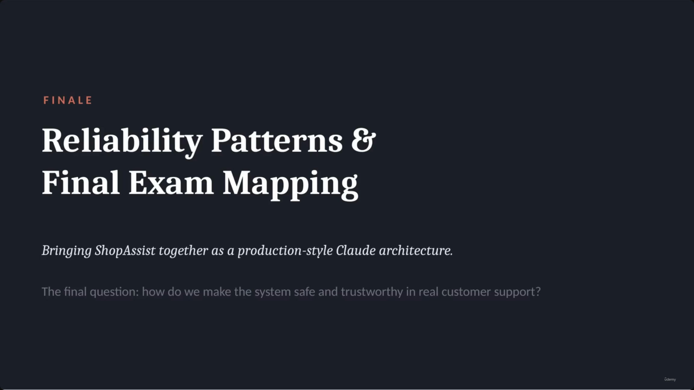

## Where we are: ShopAssist is no longer just a chatbot

- ShopAssist has accumulated, across the course: **Prompts · Tools · Structured output · Validation · Agentic workflows · Claude Code config · CI review · Reliability patterns**.
- This lecture's scope is specifically the last item: **the reliability layer that makes the whole thing trustworthy.**

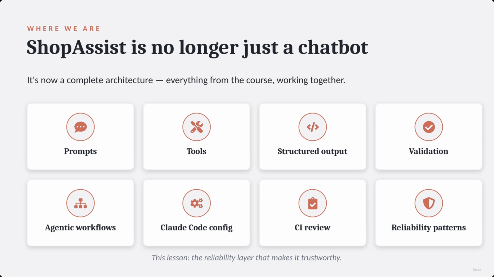

---

## 1. Escalation: the wrong signal vs. the right triggers

- **The wrong signal — sentiment.** Do not escalate just because a customer sounds angry. Sentiment is useful context, but it is **not** a reliable proxy for case complexity.
  - **Frustrated ≠ complex** — a frustrated customer may have a simple return request an agent can solve immediately.
  - **Calm ≠ simple** — a calm customer may be sitting on a policy exception, identity ambiguity, or financial risk that *must* be escalated.

> **Transcript color:** "A frustrated customer may have a simple return request... A calm customer may [face] policy exception, identity ambiguity, or financial risk."

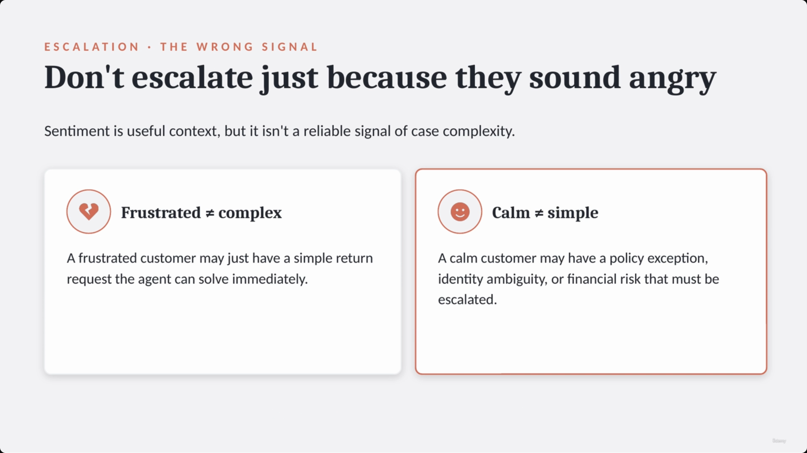

- **The right triggers — explicit rules, not mood.** Escalate when:
  1. The customer **explicitly asks for a human**.
  2. The **policy is missing, ambiguous, or doesn't cover** the request.
  3. The agent **can't make meaningful progress**.
  4. Backend results are **ambiguous** (e.g., multiple customer matches) — ask for clarification or escalate.
- **The golden rule: if they ask for a human, honor it — immediately.**
  - **Right:** *"I can connect you with a specialist. First I'll summarize the issue so they have context."* — honor the request, summarize, don't stall.
  - **Wrong:** *"Let me first check your order..."* — forcing more automated investigation before honoring an explicit request.

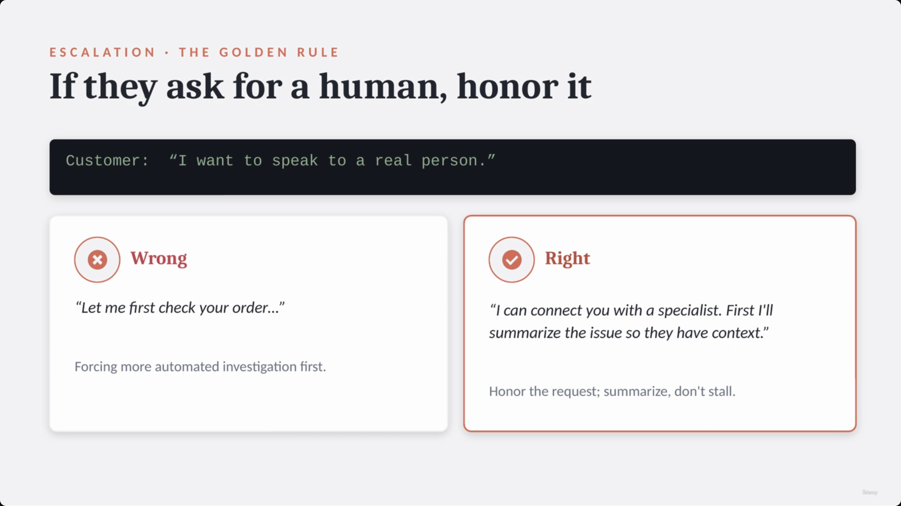

*(Note: the "Wrong signal" slide above and the "Golden rule" slide were each captured twice in a row by Hover Notes — 00:00:41/00:01:09 duplicate 00:00:23, and 00:01:41 duplicates 00:01:28 — while the narrator kept talking over the unchanged slide. Only one copy of each is kept here.)*

This pairs directly with the escalation/human-handoff material in **[[25-TaskDecomposition-Hooks-Gates-And-Handoffs]]** and the confidence/human-review material in **[[17-Validation-RetryLoops-Confidence-And-HumanReview]]**.

---

## 2. Ambiguity: when identity is unclear, don't guess

- **[Why]** Heuristics create risk whenever the system returns multiple matches for the same name.
- **Wrong — guess:** silently choosing "the most recent account."
- **Right — clarify:** ask for a specific identifier (email or order number).
- **Exam pattern:** when identity, permissions, or financial actions are involved — **do not use heuristics.** Clarify, verify, or escalate.
- **[Slide detail]** The slide names the concrete failure mode: `get_customer` returning two matches for the same name — more specific than the slide-note's paraphrase ("the system returns multiple matches").

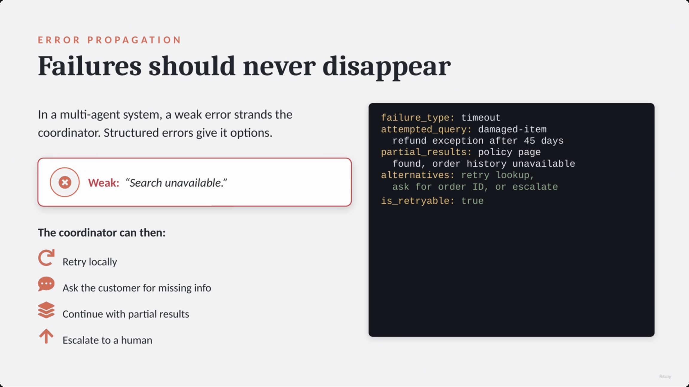

---

## 3. Error propagation: failures should never disappear

- **The problem:** in a multi-agent system, a weak error response (e.g., *"Search unavailable"*) gives the coordinator no context to recover — the failure effectively disappears.
- **The fix — structured errors.** Give the coordinator `failure_type`, `attempted_query`, `partial_results`, and `alternatives`, so it can decide to: retry locally, ask the customer for missing info, continue with partial results, or escalate.

> **[Factual inconsistency — screenshot vs. slide-note text]** The slide-note's Python code block renders a *cleaned-up* version of the example, e.g. `"attempted_query": "damaged_item"`. The actual on-screen card reads more verbosely: **`attempted_query: damaged-item refund exception after 45 days`** — a full descriptive string, not a short slug. The slide also writes `partial_results` as prose ("policy page found, order history unavailable") rather than the nested JSON object `{"policy_page": "found", "order_history": "unavailable"}` the slide-note implies. The screenshot is the authoritative version; the slide-note's JSON is a tidied paraphrase.

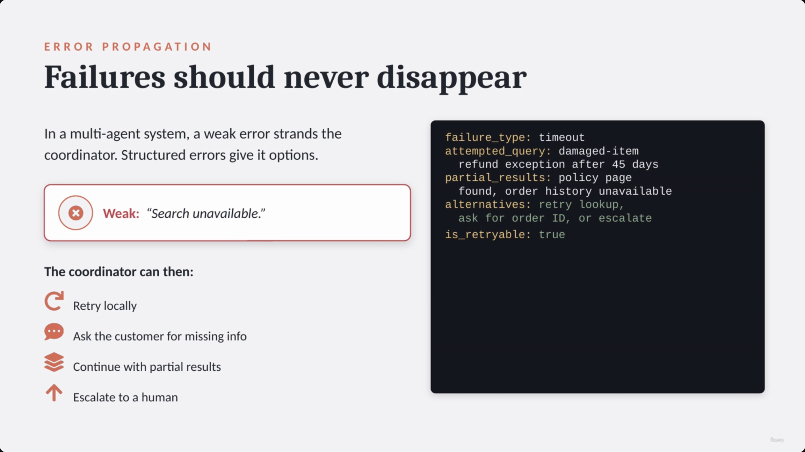

- **Recovery hierarchy:** **local recovery first** (a sub-agent retries transient failures locally) → **coordinator propagation second** (if local recovery fails, propagate a structured error).
- **Distinguish failure types:**
  - **Valid empty result** — the query succeeded, no matching record exists (maybe the wrong order number).
  - **Access failure** — the system couldn't reach the data source at all (retry, use another source, or escalate).


This is the same discipline covered in depth in **[[21-Designing-Effective-Tools-And-Structured-MCP-Errors]]** (structured tool errors) and **[[24-Coordinator-Subagents-TaskTool-And-ExplicitlyContextPassing]]** (coordinator/sub-agent error handling).

---

## 4. Provenance: preserve where every claim came from

- **Definition:** a reliable system must preserve the source/origin of important claims to remain trustworthy — a polished summary alone is not enough.
- **[Why]** Summarization often compresses multiple sources into one output, which can silently drop attribution. If a sub-agent loses the claim→source links, the synthesis agent can no longer verify its own claims — that's a reliability failure, not just a cosmetic one.
- **Maintain claim-source mappings**, verbatim as shown on the slide:

```text
claim: item eligible for refund
source: return policy, damaged-items section

claim: delivered 12 days ago
source: order database

claim: product arrived broken
source: customer message
```

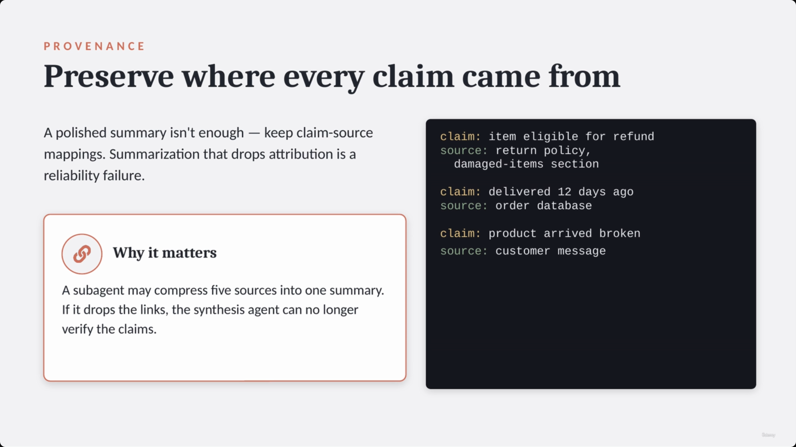

### Handling conflicting sources

- **Preserve the conflict — don't silently pick.** Example: a standard return policy says **30 days**, while a newer support memo allows **45 days** for damaged items.
- **Strategy:** annotate the conflict explicitly · include dates (temporal context — newer sources often supersede older ones) · escalate if the conflict touches money or policy.
- **[Slide detail]** A 2024 policy vs. a 2026 memo "may not be a true contradiction" — the newer source can simply supersede the older one; this framing appears as connective narration on the slide, not just in the transcript.

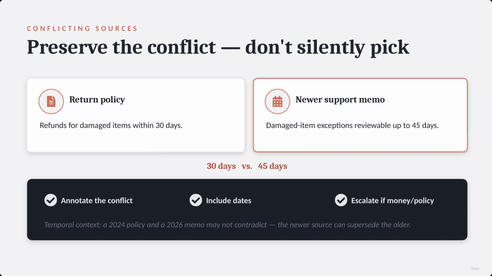

---

## 5. Content rendering: match the format to the content

- Don't force every result into the same shape — use the structure that best suits the data:

| Content type | Format |
|---|---|
| Financial comparisons | Tables |
| Policy reasoning | Structured bullets |
| Customer replies | Clear prose |
| Technical review findings | File paths, severity, suggested fixes |

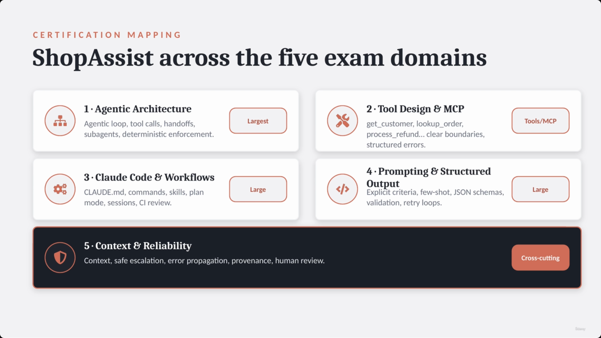

---

## 6. ShopAssist mapped to the five exam domains

The slide-note splits this into two chunks ("Certification Mapping" and "Certification Mapping (Continued)" plus a separate "Certification Exam Weighting" section), but **one single on-screen slide already shows all five domains together, each carrying its own weighting badge** — the weighting isn't a separate visual, it's baked directly into this card grid:

| Domain | ShopAssist behaviors | Exam weight (per slide badge) |
|---|---|---|
| **1 · Agentic Architecture and Orchestration** | Agentic loop, tool calls, handoffs, sub-agents where useful, deterministic enforcement for critical steps (e.g., verify customer before refund) | **Largest** portion of the exam |
| **2 · Tool Design & MCP** | `get_customer`, `lookup_order`, `process_refund`, clear boundaries, structured errors | Focused on **Tools/MCP** |
| **3 · Claude Code Configuration and Workflows** | `CLAUDE.md`, slash commands, skills, plan mode, direct execution, session management, CI review | **Large** |
| **4 · Prompt Engineering and Structured Output** | Explicit criteria, few-shot examples, JSON schemas, validation, retry loops, structured findings | **Large** |
| **5 · Context Management and Reliability** | Preserves context, safe escalation, error propagation, provenance/claim-source mappings, human review for critical edge cases | **Cross-cutting** — smaller share of direct questions, but underpins scenario questions across *every* domain |

- **[Missing from slide/slide-note]** The **transcript** names a fuller Domain 2 tool list than either the slide or the slide-note bullets show: *"GetCustomer, LookupOrder, **CheckPolicy**, ProcessRefund, and **EscalateToHuman**."* Both the slide card and the slide-note text stop at `get_customer, lookup_order, process_refund...` — `check_policy` and `escalate_to_human` are spoken but not written anywhere on screen.


> **[Note on the slide-note's own content]** The original slide note (lines 235–249) embeds a `quadrantChart` mermaid diagram plotting the five domains by complexity vs. reliability impact. **No screenshot in this lecture shows a quadrant/2×2 chart** — the actual slide is the card grid above with text badges (Largest / Tools-MCP / Large / Large / Cross-cutting), not a plotted quadrant. The quadrant chart appears to be the note-taking tool's own interpretive rendering of the weighting, not something that was literally on screen — treat the card-grid + badge table above as the screenshot-verified version.

---

## 7. Exam-style scenario: resolving a policy conflict

The slide note presents this scenario twice — once as an "Exam-Style Scenario" with bulleted option analysis, once again as a "Case Study" with the same options reformatted into a markdown table. Both point at the same single on-screen slide, so they're consolidated into one walkthrough here.

**Scenario:** *"I need a refund. Your site said I was eligible, but the bot says I am not. I want a human if this cannot be fixed."*

- Order exists · standard policy = 30-day window · customer is at **day 42** · a newer internal memo allows damaged-item exceptions up to **45 days**, reviewable **only by a human specialist**.

| Option | Action | Why it fails / succeeds |
|---|---|---|
| A | Deny | Ignores the newer source (the memo) |
| B | Approve | Applies an exception without the authority to grant it |
| **C** | **Explain, preserve, escalate** | **Correct** — addresses the conflict, preserves provenance of both sources, and routes to the human specialist the memo requires |
| D | Trust confidence > 80% | Self-reported model confidence doesn't override business risk or policy requirements |

> **Transcript color:** "Option C preserves provenance, handles uncertainty, and escalates with useful context. This is the mindset the exam rewards."

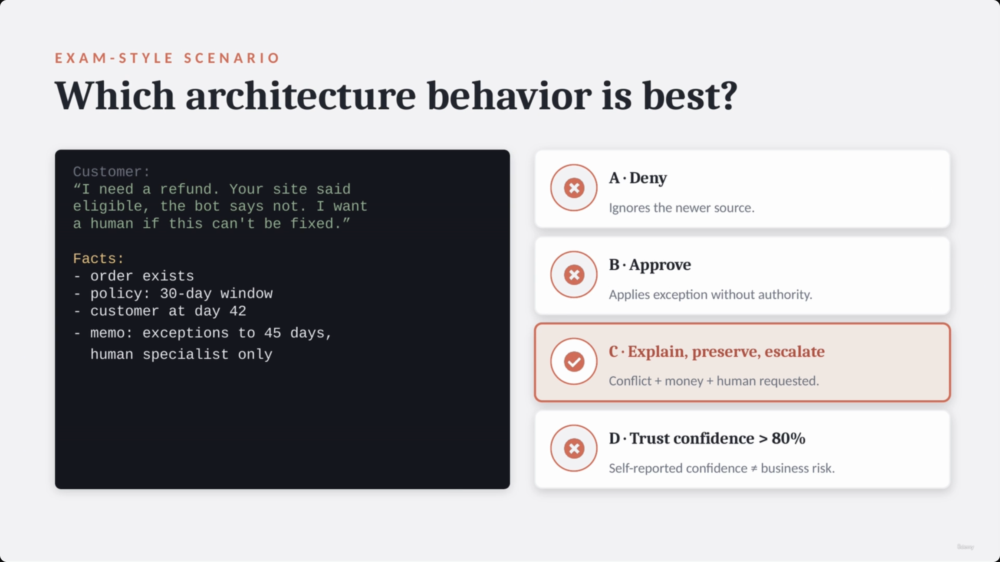

---

## Core mindset for reliable Claude systems

- A reliable system is defined by its behavior **in the face of uncertainty**, not by how well it performs on the easy path.
- It must know when to: **Act · Ask · Stop · Escalate.**

> **Transcript color:** "A reliable [Claude] system is not just a strong prompt. It is an architecture that knows when to act, when to ask, when to stop, and when to escalate."

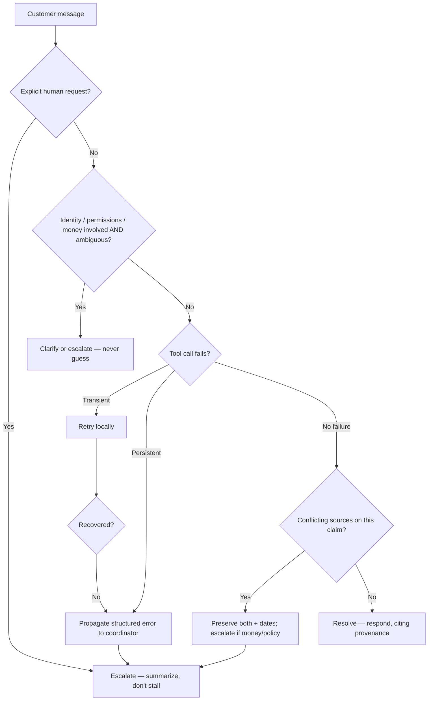

**Reading it:** this isn't a new mechanism — it's the connective tissue between patterns already built earlier in the course (escalation triggers, structured tool errors, recovery semantics, provenance/conflict handling). The lecture's job is to show that these independently-taught patterns compose into one coherent decision path.

---

## Reliability pattern → where it's covered in depth

| Pattern | One-line description | Covered in depth |
|---|---|---|
| Verification gates before sensitive actions | Programmatic prerequisite checks in code, not just prompt instructions | [[03-ClaudeApp-vs-ClaudeAPI-vs-ClaudeCode-vs-MCP-vs-AgentSDK]] |
| Human review & grading | Using human review (alongside code/model checks) to judge Claude outputs | [[11-Grading-Claude-Outputs-Code-Model-And-Human-Review]] |
| Validation, retry loops, confidence | Retrying on validation failure; not trusting self-reported confidence alone | [[17-Validation-RetryLoops-Confidence-And-HumanReview]] |
| Multi-pass / batch review | Running multiple review passes for higher-stakes or higher-volume checks | [[18-Batch-Processing-And-MultiPass-Review-Architectures]] |
| Structured tool errors | Typed error schemas (`failure_type`, `partial_results`, `alternatives`) instead of bare failure strings | [[21-Designing-Effective-Tools-And-Structured-MCP-Errors]] |
| Coordinator/sub-agent context passing | Explicit context and error propagation between a coordinator and its sub-agents | [[24-Coordinator-Subagents-TaskTool-And-ExplicitlyContextPassing]] |
| Hooks, gates, and handoffs | Deterministic enforcement points and human handoff mechanics in agentic workflows | [[25-TaskDecomposition-Hooks-Gates-And-Handoffs]] |
| Structured output / JSON schemas | Enforcing shape on model output via tool-use/JSON schema | [[16-StructuredOutput-With-ToolUse-JSONSchema-ToolOutput]] |
| CI review / independent review | Running Claude Code review in CI as an independent check | [[31-ClaudeCode-In-CI-CD-And-Independent-Review]] |
| Claude Code config (CLAUDE.md, skills, plan mode) | Build-time configuration referenced in Domain 3 | [[28-ClaudeCode-Project-Configuration-CLAUDE-Rules-And-Memory]], [[30-ClaudeCode-Workflows-Commands-Skills-PlanMode-And-Refinement]] |
| The six official production scenarios | The scenario set (including ShopAssist) that the exam draws its case studies from | [[02-Six-Official-Production-Scenarios]] |
| Exam format & domain structure | The original breakdown of the five domains this lecture maps ShopAssist onto | [[01-Exam-Format]] |

---

## Summary

- **Escalation** should run on explicit rules (explicit request, policy gap, no progress, ambiguous results) — never on sentiment.
- **Ambiguity** around identity, permissions, or money should be clarified or escalated — never resolved by heuristic guessing.
- **Error propagation** needs structured errors (not bare failure strings) so a coordinator has real recovery options; recover locally first, propagate second; and don't confuse a valid empty result with an access failure.
- **Provenance** — claim-source mappings — must survive summarization; conflicting sources should be preserved and annotated (with dates), not silently resolved, and escalated when money or policy is at stake.
- **Rendering** should match the content type (tables, bullets, prose, or technical findings), not force one shape on everything.
- ShopAssist maps onto all **five exam domains**, with Domain 1 (Agentic Architecture) weighted largest and Domain 5 (Context & Reliability) a cross-cutting concern that shows up inside scenario questions across every other domain.
- **Exam framing to remember:** the best answer to a conflict-plus-risk scenario is almost never "pick a side" — it's *explain, preserve, escalate.*

---

## In Plain English

Here's the whole file in plain, everyday language:

**The big picture:** this is the capstone/review lecture — it doesn't teach anything brand new, it takes everything built for ShopAssist so far and asks the final question: how do you make this whole thing actually safe and trustworthy for real customers, then maps every pattern back onto the five exam domains.

**1. Don't escalate based on mood**
A frustrated customer might have a simple problem, and a calm customer might be sitting on something genuinely risky. Escalate based on explicit rules instead — the customer directly asked for a human, the policy doesn't cover this case, the system can't make progress, or the backend results are ambiguous. And if a customer explicitly asks for a human, honor it immediately — don't stall with more automated checks first.

**2. Never guess at someone's identity**
If a lookup returns two different customers with the same name, don't just silently pick "the most recent one." Ask a clarifying question or escalate — this rule applies specifically whenever identity, permissions, or money are involved.

**3. Errors should never just vanish**
A vague failure message like "search unavailable" gives the system nothing to work with. A good error tells you exactly what was attempted, what partial results exist, and what alternatives are available — so the system can decide to retry, ask the customer, continue with partial info, or escalate, instead of just quietly failing.

**4. Always know where a fact came from**
When summarizing information for a final answer, don't lose track of which source backs which claim. If two sources genuinely disagree (like an old 30-day policy vs. a newer 45-day exception memo), don't silently pick one — flag the conflict, note which source is newer, and escalate if money or policy is on the line.

**5. Format the answer to fit the content**
Numbers belong in tables, policy reasoning belongs in bullets, a reply to a customer belongs in plain prose — don't force everything into the same shape.

**6. How it maps to the exam**
Agentic Architecture & Orchestration is the biggest chunk of the exam. Tool Design & MCP, Claude Code Configuration, and Prompt Engineering & Structured Output are all large. Context Management & Reliability is officially the smallest slice, but it's a "cross-cutting" concern — meaning its ideas (escalation, error handling, provenance) actually show up baked into scenario questions across every other domain too.

**7. The one mental model to remember for the whole exam**
A reliable system knows when to Act, when to Ask, when to Stop, and when to Escalate — and when a scenario question presents a genuine conflict plus real risk, the answer is almost never "just pick a side," it's "explain, preserve the conflict, and escalate."

**One-sentence summary:** A trustworthy Claude-based system escalates on explicit rules (not mood), never guesses at identity when stakes are high, never lets an error just disappear, always preserves where a fact came from, and — when given a real conflict with real risk — the right move is almost always to explain, preserve, and escalate rather than confidently pick a side.

---

*Sources: [slide notes](../32-Reliability-Patterns-And-Final-Exam-Mapping.md) · [[hover-notes-transcripts/32-Reliability-Patterns-And-Final-Exam-Mapping (transcript)|full transcript]]*
