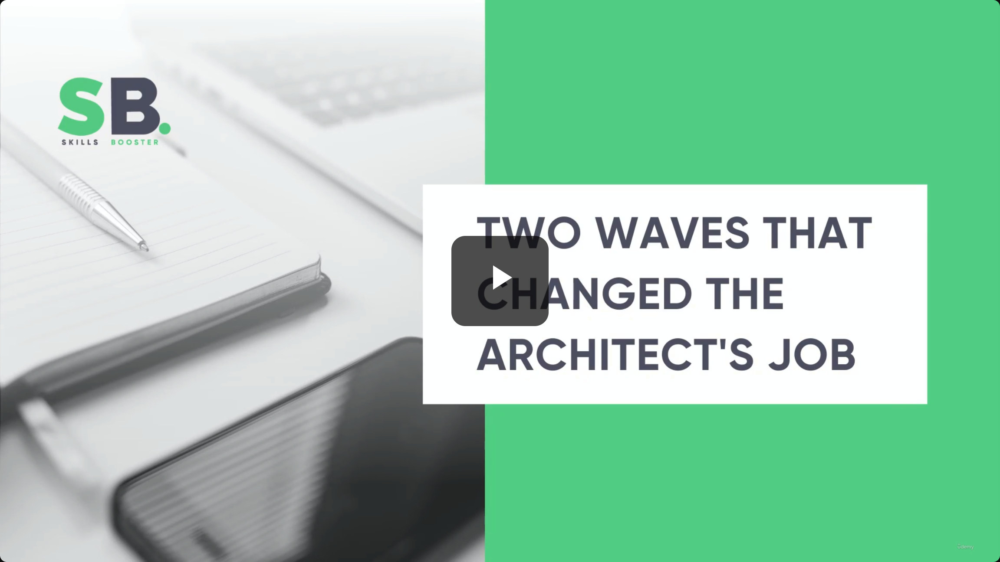
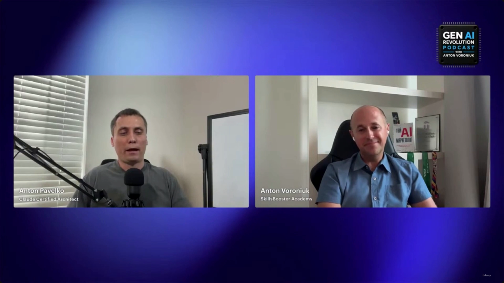
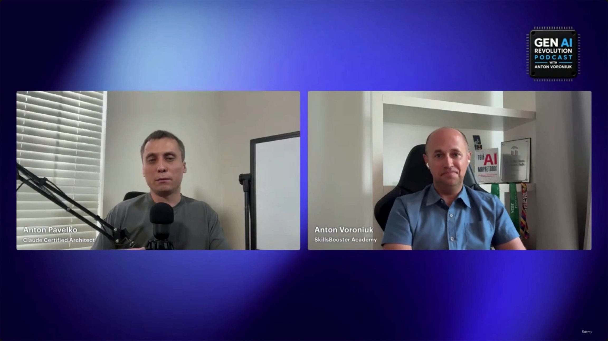

# Two Waves That Changed the Architect's Job

> This is a bonus/interview-style lecture, not a slide deck — it's a clip from the **Gen AI Revolution Podcast** (host **Anton Voroniuk**, SkillsBooster Academy) interviewing **Anton Pavelko**, a Claude Certified Architect with 15+ years in software engineering and enterprise architecture. **[Slide detail]** Neither the slide-note bullets nor the transcript text name the speakers or the podcast — that context is visible only in the video captures themselves. There is no slide content in this lecture at all: every capture other than the title card is the same static two-shot video-call frame, confirming this segment is pure talking-head commentary.

---

## The question: when did AI start changing the architect's job?

Voroniuk asks Pavelko, who has spent 15+ years in software engineering and enterprise systems architecture, when he realized AI was changing the architect's job itself. Pavelko's answer: he remembers **two distinct waves**.

### Wave 1 vs. Wave 2

| | Wave 1 — No-code / low-code | Wave 2 — Agentic coding |
|---|---|---|
| **What it was** | No-code/low-code platforms | Agentic coding tools, e.g. **Claude Code** |
| **Who it enabled** | People with *no* software development experience | People who already have a coding/architecture background — but that background alone stops being enough |
| **What it produced** | Simple builds (e.g. animations); a wave of **AI agencies** that automated all kinds of processes | A shift in how automation systems get built entirely |
| **New skills demanded** | Not much — that was the point | **Content management** and **orchestration** methods — knowledge outside the classic dev/architect toolkit |

> **Transcript color:** "I remember two waves. The first wave was related to no-code and low-code systems... when everyone without any software and development experience can build animations and all those numerous AI agencies that automated everything. And I remember the second wave related to agentic coding, for example, Claude Code, and that changes the approach of building automation systems."

- **[Note on transcript quality]** The transcript names the wave-1 tooling as "like 1080" — this reads as a transcription artifact (likely a mis-heard no-code platform name) rather than an actual product name. Quoted verbatim above; treat it as unreliable rather than a real tool to look up.

---

## The Impact of Agentic Coding

- Agentic coding tools (Claude Code is the named example) change *the approach* to building automation systems, not just the speed of building them.
- **[Shift in required expertise]** Pavelko found that once he tried building with Claude Code, his classic software-developer/architect background wasn't sufficient on its own.
- Architects now need deeper knowledge in areas such as:
  - **Content management**
  - **Orchestration** methods (how to properly wire the pieces together)

> **Transcript color:** "When I try to build something with Claude Code, I realized that it's not enough to have that classic background of software developer or even architect. And I need more knowledge — like I need to understand what is content management, how to choose the proper orchestration way, etc."

---

## Aside: "Vibe coding" — 10x more code, or 10x more garbage?

Voroniuk pushes on a related, more provocative question: is "vibe coding" (rendered as "white coding" in the raw transcript — almost certainly a mis-transcription of *vibe coding*) just producing "10x more garbage," and what does that do to the software development market?

Pavelko's answer reframes the question around **intent and rigor**, which leads into the lecture's core theme below: it depends on *why* you're coding this way, and pure coding — vibe-coded or not — was never going to be enough for production.

---

## Challenges in Building Production-Ready AI

- **Pure coding is insufficient** for creating a production-ready product.
  - Building only for the **happy path** (simple, successful requests) fails to account for real-world complexity.
- **[The core problem] AI systems are inherently unpredictable:**
  - You cannot guarantee exactly what an LLM will return as a result.
  - You cannot predict with certainty which specific tool the agent will decide to use.
- As a result, you need to engineer a **reliable system** that can handle any kind of input and any kind of LLM response — the unpredictability is the design constraint, not an edge case to patch later.

> **Transcript color:** "I don't believe that you can build some kind of production-ready product just by coding — because if you just build something for the happy path, right, and you see that it works for some simple requests... the complexity of AI systems is that you never know. You never know what the LLM will return as a result. You never know which tool will be used."

---

## Building Production-Ready AI Systems: Demo vs. Production

- **[Demo vs. Production]** There is a significant gap between a successful proof-of-concept and a reliable product.
  - A **demo** is useful to prove a model *is capable* of a specific task.
  - A **production-ready solution** requires much more than just coding to ensure reliability.
- **The necessity of reliability:**
  - Systems must be engineered to handle any kind of input.
  - They must be robust enough to manage unpredictable LLM responses.

> **Transcript color:** "It's nice to create some kind of demo just to prove that the model can do something. But in case you need to implement some kind of production-ready solution, I don't believe that [coding alone is] enough."

---

## Summary

- **Wave 1 (no-code/low-code):** let non-developers build simple things and spawned AI agencies that automated processes — but didn't demand new expertise from architects.
- **Wave 2 (agentic coding, e.g. Claude Code):** changed *how* automation systems get built, and made a classic software/architecture background insufficient on its own — architects now need to understand content management and orchestration.
- **The production-readiness gap is the throughline:** coding — happy-path or "vibe-coded" — can produce an impressive demo, but AI's inherent unpredictability (unknown LLM outputs, unknown tool choices) means a production-ready system requires deliberate engineering for reliability, not just more code.

---

## In Plain English

Here's the whole file in plain, everyday language:

**The big picture:** an interview about how two separate waves of AI tooling reshaped what it means to be a software architect — first no-code tools, then agentic coding tools like Claude Code.

**1. Wave 1 — no-code/low-code**
Let people with ZERO coding experience build simple things themselves, which spawned a wave of "AI agencies" automating processes. It didn't really demand any new skills from architects — it just opened the door to non-developers.

**2. Wave 2 — agentic coding (like Claude Code)**
This one hit differently. It changed HOW automation systems get built, and — importantly — it meant an architect's classic coding/design background alone stopped being enough. Suddenly you also needed to understand things like content management and orchestration — skills outside the traditional toolkit.

**3. "Vibe coding" isn't inherently bad or good — it depends on intent**
Is AI-assisted, fast, loosely-supervised coding producing 10x more useful code, or 10x more garbage? The answer given is that pure coding (vibe-coded or carefully hand-written) was never going to be enough for a real production system on its own.

**4. The real problem with AI systems**
You genuinely cannot guarantee exactly what an LLM will return, or which tool it'll decide to use. That means you have to design your whole system to expect and handle that unpredictability, rather than treating it as a rare edge case.

**5. A demo vs. a real production system**
A demo proving a model "can do something" is a very different bar from an actually reliable production system — production requires deliberately engineering for reliability on top of the AI, not just writing more code.

**One-sentence summary:** No-code tools let anyone build simple things without needing new architect skills, but agentic coding tools like Claude Code demanded new expertise (content management, orchestration) — and because AI output is fundamentally unpredictable, turning any AI demo into a real production system takes deliberate engineering for reliability, not just more code.

---

*Sources: [slide notes](../34-Two-Waves-That-Changed-The-Architects-Job.md) · [[hover-notes-transcripts/34-Two-Waves-That-Changed-The-Architects-Job (transcript)|full transcript]]*
