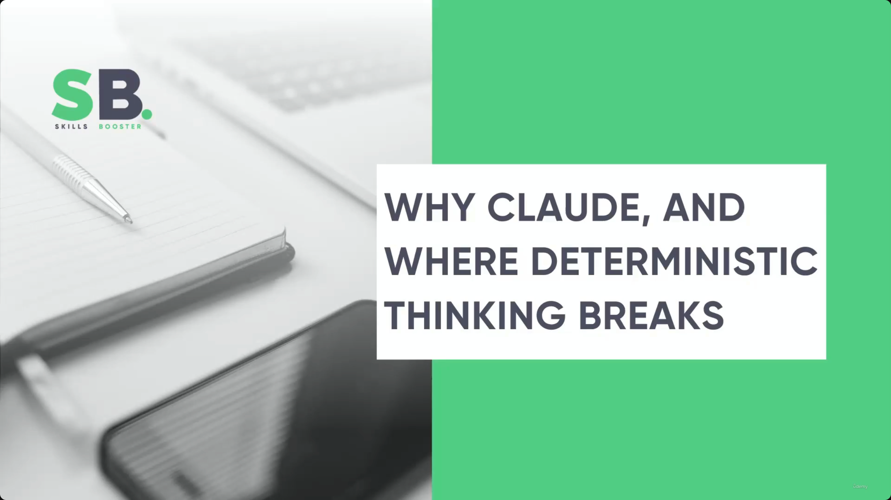
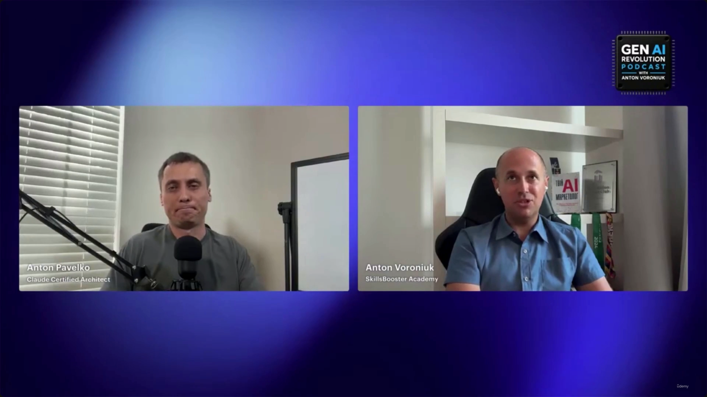
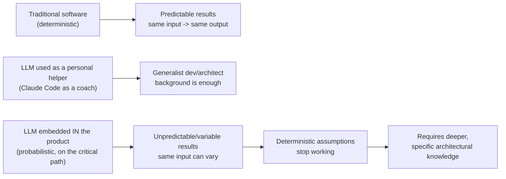

# Why Claude, and Where Deterministic Thinking Breaks

> This lecture is a **podcast-style interview**, not a slide deck. **[Slide detail]** The on-screen graphics identify it as the *Gen AI Revolution Podcast with Anton Voroniuk* — a two-person video call between **Anton Pavelko** (labeled "Claude Certified Architect") being interviewed by **Anton Voroniuk** (labeled "SkillsBooster Academy"). None of the slide-note bullets mention this framing; it's only visible on the screenshots. Anton Pavelko is the one answering the "why Claude" question throughout.

---

## Why Claude — the "magic" question

- Anton Voroniuk poses the recurring student question: developers are heavily focused on Claude and Claude certification — what's the "magic" of Claude, and why prioritize it over OpenAI, Gemini, or other platforms?
- Anton Pavelko's framing up front is deliberately modest:
  - He is **not a Claude specialist** — Claude is just one of the tools he uses daily.
  - He is **not model-agnostic** in his day-to-day usage, but he doesn't claim Claude is objectively "the best" either.

> **Transcript color:** "Cloud is just one of tools which I use on a daily basis. And I'm not agnostic... I can't say that like it's the best solution, but it's one of the best solutions."

---

## Claude in professional workflows

- He still uses **ChatGPT and Gemini** for daily tasks — this isn't an exclusive-use claim.
- Where Claude stands out for him specifically:
  - A **very strong position in coding tasks**.
  - Highly effective for **enterprise-level solutions**.
  - It's the tool **currently running his production project**.
- **[Key point]** The skills transfer: knowledge gained building Claude-based automations carries over to other models without much friction — the underlying architectural thinking (tools, gates, orchestration) isn't Claude-specific, only the implementation details are.

> **Transcript color:** "I would say that the knowledge you can obtain creating Claude automations, you can apply for other models without any problems."

---

## Personal experience with Claude Code

- **Evolution over time**, in his own words:
  - Early results were "strange" — at points it felt *faster to build a solution from scratch* than to correct the model's output.
  - Recent iterations have improved substantially in quality and reliability.
- **New capabilities unlocked**: he used Claude to build **two mobile apps**, in a stack he hadn't worked in before.
- **[Key Insight]** His explanation for why this worked isn't "the AI did it for me" — it's that he already understood the underlying technical background (general software/architecture knowledge), even without prior experience in that specific tech stack. AI assistance plus foundational understanding, not AI assistance alone.

> **Transcript color:** "Well, yes and no, because I understand the background. Probably I was not aware about that tech stack, but I understand, like, how it works."

---

## The quality of AI-generated code — and "white coding"

- He was genuinely surprised at times by how high-quality the generated code was — "partially white coded" is his own term for it.
- **"White coding" joke**: he recounts asking a friend who moved into cybersecurity what she thinks of it — her only half-joking answer: *"White coding is amazing. You will white code so many vulnerabilities. We definitely will have work for many years in the future."*
- **[Implication]** AI-generated code introducing subtle vulnerabilities isn't a one-off risk — it's framed as a durable, ongoing source of demand for cybersecurity work, i.e., generated code still needs human/security review, not blind trust.

---

## Transitioning from AI helper to product integration — where deterministic thinking breaks

This is the conceptual core of the lecture, and it's the direct answer to "when did you realize you needed to understand the architecture at a much deeper level?"

- **Before:** using Claude/Claude Code as a personal "coach" or daily-routine helper only required a normal software-developer/architect background — nothing special.
- **The shift:** once the decision was made to put an LLM **inside the product itself**, inside the automation layer (not just as a personal tool), everything changed.
- **[The Problem]** Traditional software is **deterministic** — same input, same output, every time. An LLM embedded in a product is a **probabilistic system** — you never know exactly what result it will return.
- **The consequence:** deterministic engineering habits and assumptions **stop working** the moment probabilistic components sit on the critical path of a real workflow.
- **Requirement that follows:** integrating a probabilistic system into production requires knowledge *beyond* generalist developer/architect skills — deeper, more specific understanding of how these systems actually behave.

> **Transcript color:** "We decided to use LLM inside the product, inside the automation. And at that moment, I realized that with that automation, we need to know how to work with that... our deterministic approach no longer works here. Because here we have kind of probabilistic system where you never know what results it can return."

**Cross-reference:** this is the same pressure point that motivates [[17-Validation-RetryLoops-Confidence-And-HumanReview|Validation, Retry Loops, Confidence & Human Review]] and [[32-Reliability-Patterns-And-Final-Exam-Mapping|Reliability Patterns]] elsewhere in this course, and the "Verification Gate" idea from [[03-ClaudeApp-vs-ClaudeAPI-vs-ClaudeCode-vs-MCP-vs-AgentSDK|Claude App vs API vs Code vs MCP vs Agent SDK]]: because the model's output is probabilistic, the *architecture* — not the prompt — has to own validation, retries, confidence thresholds, and escalation to a human. This lecture states the "why" in plain terms; those other lectures give the concrete patterns.

---

## The necessity of deep technical knowledge

- **[Key Insight]** There's a real ceiling to what AI assistance alone can produce — beyond a certain complexity, building a working system requires specific, deep domain and architecture knowledge that the AI itself doesn't supply.
- **Division of labor he lands on:** the AI can handle implementation detail; the *developer* has to supply high-level structural/architectural guidance.
- **The risk of skipping this:** relying on AI without understanding the underlying principles means losing control over the system's design — you can generate code, but you can't reliably steer or trust the result.

---

## Summary

- The "why Claude" answer is intentionally unglamorous: it's one strong, production-proven tool among several (ChatGPT, Gemini included) — chosen for its coding and enterprise strength, not framed as an exclusive or objectively "best" choice, and the underlying skills transfer across models anyway.
- Claude Code's output quality has visibly improved over time, to the point of enabling projects (two mobile apps) outside the speaker's prior experience — but success depended on pre-existing architectural understanding, not the tool alone.
- AI-generated code can be surprisingly high quality *and* can quietly introduce vulnerabilities ("white coding") — a durable argument for continued security review.
- **The central thesis:** deterministic software habits break down the moment an LLM moves from "personal helper" to "component embedded inside a production product/automation" — because the LLM is a probabilistic system, not a deterministic one. That shift is precisely why deeper architectural knowledge (validation, gates, confidence handling, human review) becomes necessary — themes this course develops concretely in later lectures.

---

## In Plain English

Here's the whole file in plain, everyday language:

**The big picture:** an interview explaining why the course centers on Claude specifically (a modest, practical answer), and — more importantly — the exact moment in a project where old "traditional software" thinking habits stop working and you have to think differently.

**1. Why Claude, honestly**
Not framed as "the objective best AI" — Claude is just one of several tools the speaker uses daily (alongside ChatGPT and Gemini), but it happens to be particularly strong at coding and enterprise-level work, and it's what's currently running his own production project. Importantly: the underlying architectural skills you learn (tools, gates, orchestration) transfer to other models too — they're not Claude-exclusive knowledge.

**2. His own experience with Claude Code improved a lot over time**
Early on, it sometimes felt faster to just build something from scratch than fix what the model produced. More recently, it's gotten good enough that he used it to build two entire mobile apps in a tech stack he'd never worked in before — but he's clear that this worked BECAUSE he already understood general software architecture, not because the AI replaced that understanding.

**3. AI-generated code can be surprisingly good — and can also quietly hide vulnerabilities**
("White coding," a play on "vibe coding" — a cybersecurity friend jokes it'll keep security professionals employed for years fixing what AI quietly breaks.) Point: AI-written code still needs real security review, it can't be blindly trusted.

**4. The core idea of the whole lecture — where deterministic thinking actually breaks**
Using Claude as your own personal coding helper only requires a normal developer/architect skillset — nothing special. But the MOMENT you decide to put an LLM INSIDE your actual product (not just as a personal tool, but as a real component customers depend on), everything changes. Traditional software is deterministic (same input always gives the same output). An LLM embedded in a product is probabilistic (same input CAN give different, unpredictable results) — and that single shift is exactly why deeper knowledge (validation, confidence handling, human review) suddenly becomes necessary.

**5. There's a real ceiling on what AI assistance alone can do**
Past a certain complexity, you genuinely need real architecture knowledge that the AI itself can't supply — the AI can handle implementation details, but a human still has to supply the high-level structural thinking, or you lose control over what you're actually building.

**One-sentence summary:** Claude was chosen as a strong, practical tool (not framed as objectively "the best"), but the real lesson of this lecture is that the moment an LLM moves from being your personal coding helper to being embedded inside an actual product, you cross from deterministic software (predictable) into probabilistic software (never fully predictable) — and that shift is exactly why deeper architectural knowledge like validation, gates, and human review becomes necessary.

---

*Sources: [slide notes](../35-Why-Claude-And-Where-Deterministic-Thinking-Breaks.md) · [[hover-notes-transcripts/35-Why-Claude-And-Where-Deterministic-Thinking-Breaks (transcript)|full transcript]]*
