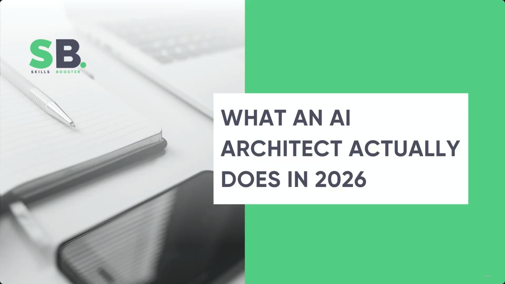

# What an AI Architect Actually Does in 2026

> This lecture is a bonus **Gen AI Revolution Podcast** segment (host **Anton Voroniuk**, SkillsBooster Academy, interviewing **Anton Pavelko**, a Claude Certified Architect) rather than a standard slide lecture. There is no real slide deck here — just a title card followed by several near-identical two-person video-call frames. **[Slide detail]** Neither speaker's name nor the podcast's title/affiliation ("Gen AI Revolution Podcast with Anton Voroniuk", "Anton Voroniuk — SkillsBooster Academy", "Anton Pavelko") appears anywhere in the transcript text or the slide-note bullets — it is only visible as an on-screen graphic in the video frames themselves.

---

## Classic Architect/Developer vs. AI Architect

- The role is defined by whether the LLM is a **core, fundamental component of the product** — not by the tools used to build it.
  - **Classic Architect/Software Developer**: uses AI tools (e.g. Copilot, Claude Code) to help write code or implement products that do *not* use an LLM as a core feature.
  - **AI Architect**: designs and implements solutions where the LLM is fundamental to the product itself.

> **Transcript color:** "If you're just using Claude Code or other AI tools to produce some product that doesn't use LLM inside the product, you're just like a classic architect or software developer. But if you design or implement solutions that use LLM inside the product... you are an AI architect."

---

## Distinguishing AI Roles

- There are **no strict boundaries** between AI Architect, AI Engineer, Software Architect, and Prompt Engineer — in reality these blend together.
- **The Architect's role** (in a large company): the person responsible for
  - Designing the architecture and overall solution
  - Making key decisions on technical direction
  - Determining what kind of architecture should be implemented
- **AI Engineer**: implements the architecture and solutions that have already been decided.
- **Prompt Engineer**: focuses specifically on prompt quality and different approaches to improve prompt effectiveness.
- **In practice**: these roles are rarely isolated — a single person often acts as both AI Architect and AI Engineer, or the roles simply merge into one position.

> **Transcript color:** "In reality, usually it can be the same person, or a couple of roles — like AI engineer and the architect — can be just one person."

### Role comparison

| Role | Primary focus | Typical scope |
|---|---|---|
| **AI Architect** | Designing the architecture & solution; setting technical direction | Decides *what* should be built and *how* the whole system should be structured |
| **AI Engineer** | Implementing the architecture that's already been decided | Executes *within* a direction someone else (or the same person) set |
| **Prompt Engineer** | Prompt quality and effectiveness | A narrower slice — improving how the model is instructed, not the surrounding system |
| **Software Architect** (classic) | Designing systems that don't rely on an LLM as a core feature | Same architect skillset, applied outside the LLM-centric context |

---

## The Scope of AI Architecture

- **[Model Selection vs. Architecture]** Choosing the right model is only **one decision among many** — the model itself is *not* the architecture.
  - Architecture means designing the **entire system** surrounding the model.
- **Core architectural responsibilities:**
  - Context management
  - Reliability
  - Evaluation
  - Observability
  - Governance
  - Security

> **Transcript color:** "AI model is important to choose, but it's not the architecture. In addition to it, you also need to architect the whole system."

---

## Critical AI Architectural Decisions

- **[Evaluation]** Called out as one of the most important topics and a **requirement for any reliable system** — because LLMs exhibit probabilistic behavior, evaluation is necessary to ensure consistency and quality.
- **Core technical puzzles / focus areas:**
  - Agents
  - Tools
  - Chain of Thought (CoT)
  - Context management
  - Structured output
  - Evaluations

---

## The Underestimated Skills of AI Architecture

- All of the technical areas above are vital, and an architect must master **all of them** to build a reliable system — reliability and structured output specifically called out as essential, since structured output is what lets LLM responses plug into programmatic workflows.
- **[The Most Underestimated Skill]** **Evaluation** — identified as the skill experienced developers most underestimate, and as a core requirement for an architect to guarantee overall system reliability.

> **Transcript color:** "As for me, evaluation is the most underestimated skill, but at the same time, this is what an architect should know... and when you know all those things, only in that case you can build a reliable system."

---

## Summary

- The **AI Architect** role is defined by designing products where the LLM is a fundamental component — not merely by using AI coding tools.
- Role boundaries (**Architect**, **AI Engineer**, **Prompt Engineer**) are fluid in practice and frequently collapse into one person.
- **Model selection is not architecture** — architecture is the whole system: context management, reliability, evaluation, observability, governance, security.
- **Evaluation** is repeatedly singled out as the single most important — and most underestimated — architectural skill, precisely because LLM behavior is probabilistic.

---

## In Plain English

Here's the whole file in plain, everyday language:

**The big picture:** an interview defining what actually separates an "AI Architect" from a regular software architect who just happens to use AI coding tools.

**1. The defining line isn't the tools you use**
It's whether the LLM is a core, fundamental part of the PRODUCT itself. Using Claude Code to help you write regular software = you're still a classic architect/developer. Designing a product where the LLM itself is a core feature = that's when you're an AI Architect.

**2. The role boundaries are blurry in real life**
AI Architect (decides the overall design and direction), AI Engineer (builds what's already been decided), and Prompt Engineer (focuses specifically on making prompts effective) often aren't three separate people at all — very often it's literally the same one person wearing multiple hats.

**3. Choosing which model to use is just ONE small decision — it is NOT the whole architecture**
The actual architecture is the entire system built around the model: how context is managed, how reliable it is, how it's evaluated, how it's monitored (observability), how it's governed, and how it's secured.

**4. The single most underrated skill, called out explicitly: evaluation**
Because LLM behavior is inherently unpredictable (probabilistic), you genuinely cannot guarantee your system is reliable unless you're actually measuring and testing its outputs systematically — and this is the skill even experienced developers most commonly underestimate or skip.

**One-sentence summary:** An "AI Architect" is defined by building a product where the LLM is a core component (not just by using AI coding tools) — the real job is architecting the whole system around the model (context, reliability, evaluation, security), and evaluation specifically is called out as the single most underrated skill in the entire field.

---

*Sources: [slide notes](../37-What-An-AI-Architect-Actually-Does-In-2026.md) · [[hover-notes-transcripts/37-What-An-AI-Architect-Actually-Does-In-2026 (transcript)|full transcript]]*
