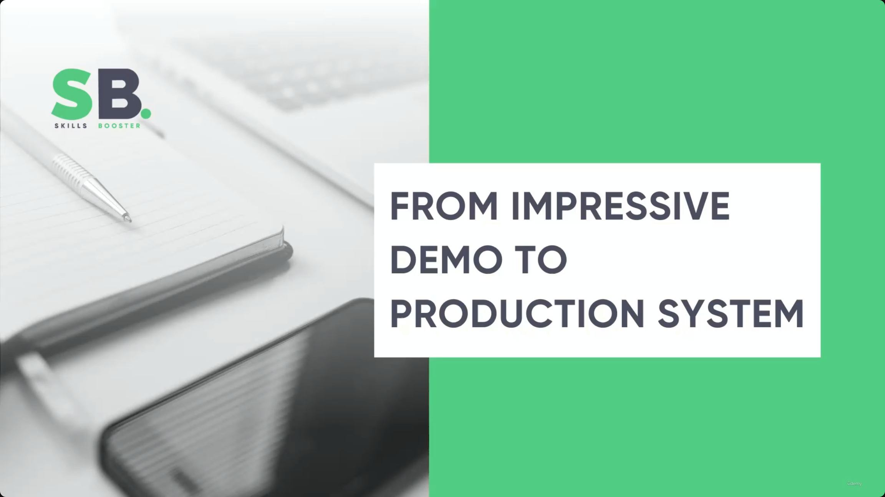
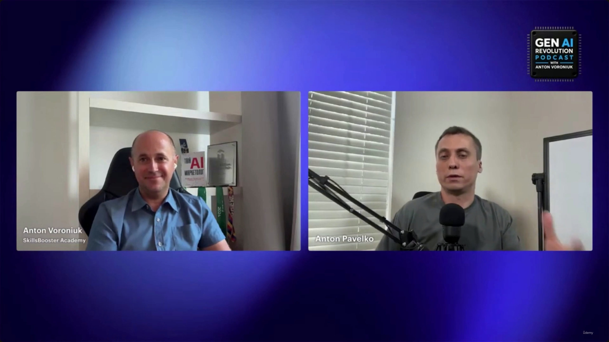
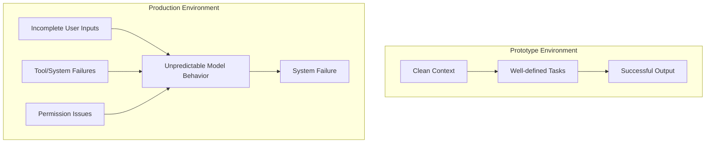

# From Impressive Demo To Production System

> This is one of the bonus/interview-style lectures — a podcast conversation (the *Gen AI Revolution* podcast, Anton Voroniuk interviewing Anton Pavelko of SkillsBooster Academy) rather than a slide deck. There's no on-screen diagram content to capture; the value is entirely in the spoken answers about why AI demos collapse once they meet real users.

**[Image note]** The Hover Notes capture grabbed this same two-person video-call frame (Anton Voroniuk, left; Anton Pavelko, right) four separate times across the lecture (00:00:04, 00:00:42, 00:01:27, 00:02:30) — the podcast never cuts to slides, diagrams, or screen-share. All four are the same talking-head shot with only micro-differences in expression/pose; one representative frame is kept above and the other three are omitted as pure duplicates carrying no new information.

---

## 1. AI Architecture Misconceptions

- The biggest misconception is bringing a **deterministic mindset** from traditional software engineering.
  - Traditional software follows predictable, deterministic paths.
  - AI architecture is fundamentally **probabilistic**.
- **[Why this matters]** You can never know exactly what an LLM will return.
  - This unpredictability requires a different design approach.
  - Engineers must account for this uncertainty when thinking about **permissions** and **model capabilities**.

> **Transcript color:** "What is the biggest misconception software engineers bring from traditional software architecture in the AI? I believe it's deterministic mindset because in the AI architecture, we have, again, the probabilistic behavior and we never know what LLM can return. And we have to... think about permissions."

---

## 2. Managing AI Capabilities and Risks

- **[Defining boundaries]** Instead of only asking what a model *can* do, architects must decide what it *should* be allowed to do — this means defining strict permissions for model actions.
- **[Human-in-the-loop]** For high-risk or sensitive operations, a human must be part of the process to prevent mistakes.
  - Example given: preventing accidental or unauthorized **refunds**.

> **Transcript color:** "We should also think... not only what the model can do but also what that model should allow it to do, right? And when we need the human in the loop, so we do not allow some risky operations like by mistake, like refunds, et cetera."

**Cross-reference:** this is the same "capability vs. permission" split — and the same refund example — used as the running case study in [[03-ClaudeApp-vs-ClaudeAPI-vs-ClaudeCode-vs-MCP-vs-AgentSDK]]'s verification-gate discussion (blocking `process_refund` until a programmatic check passes). Two independent parts of the course converge on the same lesson: capability is not permission, and the backend — not the model's own judgment — has to own the gate on irreversible actions.

---

## 3. From Demo to Production

- A successful AI demo only proves that a model is **capable** of a specific task.
- **[The Production Gap]** Building a production-ready system requires much more than a functional model.

> **Transcript color:** "A good demo can prove that the model can do something, right? But if you need to produce... if you need to build production-ready [system], you need to understand what happens when it fails."

---

## 4. The Prototype-to-Production Failure Gap

- **[The core issue]** Prototypes operate in an idealized environment that doesn't reflect real-world usage.
  - Prototypes work well with "clean" context and well-defined tasks.
  - Production environments introduce unpredictable variables.
- **Common failure points in production:**
  - Incomplete or messy user inputs
  - Tool/function failures
  - Permission and authorization issues

> **Transcript color:** "The prototype works perfectly when we have clean context, well-defined tasks, but in production, users provide some incomplete inputs, tool fails, like we have some issues with permissions, etc. So it's always about — be ready to anything."

---

## 5. Handling Unpredictable User Inputs

- **[The reality of user behavior]** Users rarely provide a single, clean request — they often bundle multiple, distinct intents into one interaction.
  - An AI assistant must be architected to parse and process these interleaved requests, not expect a 1:1 ratio of request to response.
- **Example: the multi-intent request.** Instead of one task, a customer might ask for three things simultaneously:
  1. Process a refund
  2. Check an order status
  3. Inquire about a new product's price
- The system must be robust enough to identify, separate, and execute all these distinct actions correctly.

> **Transcript color:** "That customer decided to ask you three different questions. So at the same time, the customer ask you, hey, can you please do refund? Then also please check this order. And also, you know, I saw that new product, what price of it, right? ... Instead of one request, customer ask it to you all three requests, right? And your system have to be ready to process all of them. So this is like what this AI architecture is."

---

## Demo assumption vs. production reality

| Demo assumption | Production reality |
|---|---|
| Deterministic, predictable execution path | Probabilistic model behavior — output is never fully certain |
| Clean context, well-defined single task | Messy, incomplete, ambiguous user input |
| "The model can do X" is enough to ship | Must also define what the model *should* be allowed to do |
| Tools and permissions assumed to work | Tool/function failures and permission/authorization issues are routine |
| One request → one response | Users bundle multiple, unrelated intents into a single message |
| Model's own judgment is trusted for risky actions | High-risk actions (e.g. refunds) need a human in the loop / gate |

---

## Summary

- A working demo proves **capability**, not production-readiness — the real work starts with "what happens when it fails?"
- The core mental shift required: trade a **deterministic** engineering mindset for a **probabilistic** one — you must design around uncertainty, not assume it away.
- Two separate control questions matter: what the model *can* do, and what it *should* be *allowed* to do — the latter requires explicit, enforced permissions and human-in-the-loop review for risky operations like refunds.
- Prototypes succeed in idealized conditions (clean context, well-defined tasks); production breaks that idealization via messy inputs, tool failures, and permission issues.
- Real users don't send one clean request at a time — they interleave multiple intents (e.g. refund + order status + price inquiry) in a single message, and the system must be architected to detect and handle all of them, not just the first.

---

## In Plain English

Here's the whole file in plain, everyday language:

**The big picture:** an interview about the specific gap between "this AI demo works great" and "this is safe to actually ship to real customers" — and why that gap is bigger than most engineers expect.

**1. The single biggest misconception engineers bring from traditional software**
Assuming AI behaves deterministically (same input, same output every time) like regular code does. It doesn't — it's probabilistic, meaning you genuinely never know exactly what it'll return, and that changes how you have to think about permissions and what the system is allowed to do.

**2. Two separate questions, not one**
It's not enough to ask "what CAN this model do?" — you also have to explicitly decide what it SHOULD be allowed to do. For anything risky (like processing a refund), a human needs to be part of the loop, not just the model's own judgment.

**3. Why a working demo doesn't mean you're ready to ship**
A demo only proves the model is capable of doing a task under ideal conditions. Real production readiness means understanding exactly what happens when it FAILS — because it will, eventually.

**4. Demos live in a clean, idealized world; production doesn't**
A demo gets well-defined tasks and clean input. Real users send messy, incomplete input, tools sometimes fail, and permission/authorization issues come up constantly — the system has to be ready for all of that, not just the happy path.

**5. Real users rarely ask for just one thing at a time**
A single customer message might bundle together a refund request, an order status question, AND a totally unrelated product question, all at once. A production system has to be built to detect and correctly handle all of those bundled intents — not just assume one message equals one clean request.

**One-sentence summary:** A demo only proves an AI model CAN do something under clean, ideal conditions — a real production system has to additionally decide what the model SHOULD be allowed to do, keep a human in the loop for risky actions, and be architected to survive messy real-world input, tool failures, and customers bundling multiple unrelated requests into a single message.

---

*Sources: [slide notes](../38-From-Impressive-Demo-To-Production-System.md) · [[hover-notes-transcripts/38-From-Impressive-Demo-To-Production-System (transcript)|full transcript]]*
